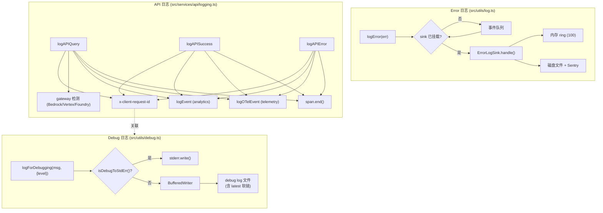
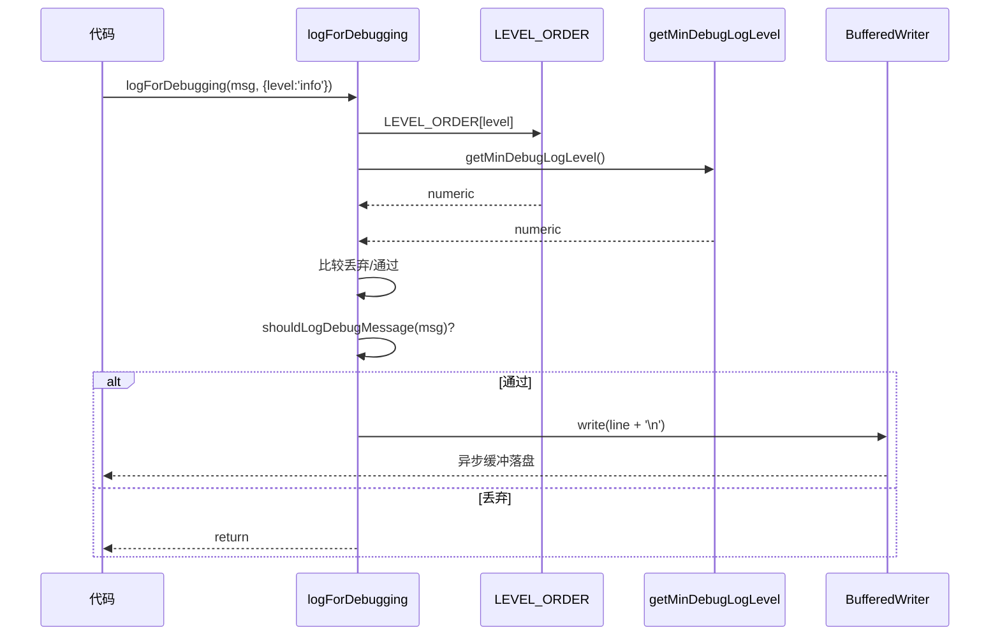

# 第 21 章 · 日志体系 —— debug、error 与 API 三大日志通道

> 本章面向开发者,系统描述 Claude Code 的三套日志通道:**debug 日志**(开发期排错)、**error 日志**(用户错误报告)、**API 日志**(网关/SDK 关联)。术语以 [`00-front/03-glossary.md`](../00-front/03-glossary.md) 为准;与 telemetry 的边界见 [`03-developer/22-telemetry.md`](22-telemetry.md)。

## 摘要

Claude Code 把日志分成三套独立通道:

1. **debug 日志**(`src/utils/debug.ts`)——按 level 过滤、按 file 落盘、可立即同步写或缓冲异步写。
2. **error 日志**(`src/utils/log.ts`)——`ErrorLogSink` 抽象 + 内存 ring(100 条上限)+ 落盘文件 + Sentry/外部上报;`--hard-fail` 模式直接打印退出。
3. **API 日志**(`src/services/api/logging.ts`)——关联 `x-client-request-id`、gateway 检测、调用 analytics + OTel + span。

三套通道在 `logForDebugging`(`src/utils/debug.ts:203-228`)、`logError`(`src/utils/log.ts:158-199`)、`logAPIQuery`/`logAPIError`/`logAPISuccess`(`src/services/api/logging.ts:170-232/234-395/397+`) 三个入口函数处分叉。重要约束:**immediate mode 同步写**(防止直接 `process.exit()` 时日志丢失)、**bedrock/vertex/foundry 等三方环境的 essential-only 限制**、**`DISABLE_ERROR_REPORTING` 完全关闭**、**sink 未挂载前事件入队**(`src/utils/log.ts:80-134`)。

## 速赢

1. **三套通道分离**:debug(file,按 level) / error(sink + ring) / API(关联请求)。
2. **`logForDebugging(msg, { level })`**:`src/utils/debug.ts:203-228`,默认 level='debug'。
3. **debug 落盘 + `latest` 软链**:`src/utils/debug.ts:155-196`。
4. **immediate 模式同步写**:防止 `process.exit()` 丢日志。
5. **`ErrorLogSink` 未挂载前事件入队**:`src/utils/log.ts:80-134`。
6. **内存 error ring 上限 100**:`src/utils/log.ts:66-77`。
7. **`logError`** 自动加 cause chain + 抑制 stack frame:`src/utils/log.ts:158-199`。
8. **API 日志同时写三处**:`logEvent` + `logOTelEvent` + span。
9. **`x-client-request-id` 永远落 debug log**:便于服务端关联。
10. **`DISABLE_ERROR_REPORTING=1` 全局关闭** error 上报。

## 关键图





## 详细机制

### 21.1 Debug 日志 —— `src/utils/debug.ts`

#### 21.1.1 Level 与过滤

- `getMinDebugLogLevel()`(`:34-40`)读 `CLAUDE_CODE_DEBUG_LEVEL` env;默认 `'debug'`。
- 内部用 `LEVEL_ORDER = { trace:0, debug:1, info:2, warn:3, error:4 }` 做单调比较:消息 level 数值 < 阈值即丢弃。
- `isDebugToStdErr()`(`:85-89`)读 `CLAUDE_CODE_DEBUG_STDERR=1`;为 true 时直接 `process.stderr.write()`,绕过文件。

#### 21.1.2 Writer 与文件生命周期

- `BufferedWriter`(`:155-196`)封装带缓冲的异步写;阈值/行数触发 flush。
- debug 日志路径:`<configHome>/debug/<sessionId>.log`,并维护 `latest` 软链指向当前 session。
- flush(`:198-201`)在进程退出/切换 session 时强制同步落盘。

#### 21.1.3 入口函数

```ts
// src/utils/debug.ts:203-228
export function logForDebugging(
  message: string,
  { level }: { level: DebugLogLevel } = { level: 'debug' },
): void {
  if (LEVEL_ORDER[level] < LEVEL_ORDER[getMinDebugLogLevel()]) return
  if (!shouldLogDebugMessage(message)) return

  const timestamp = new Date().toISOString()
  const output = `${timestamp} [${level.toUpperCase()}] ${message.trim()}\n`

  if (isDebugToStdErr()) {
    writeToStderr(output)
    return
  }
  getDebugWriter().write(output)
}
```

注意:**immediate 模式必须同步**,否则 `process.exit()` 会丢日志。`writeToStderr` 是同步调用,不走 BufferedWriter。

#### 21.1.4 ant-only 日志

`logAntError`(`:258-268`)只在 `USER_TYPE === 'ant'` 时记录;用于内部诊断,不会出现在外部版本中。

### 21.2 Error 日志 —— `src/utils/log.ts`

#### 21.2.1 `ErrorLogSink` 抽象

```ts
// src/utils/log.ts:80-86
export interface ErrorLogSink {
  handle(event: ErrorLogEvent): void | Promise<void>
}
```

实现可以是 Sentry、文件落盘、网络上报。**attach 时机**:CLI 启动后、首次需要 sink 时调 `attachErrorLogSink(sink)`。

#### 21.2.2 Sink 未挂载前的事件队列

`src/utils/log.ts:80-134` 实现了一个**有界队列**:CLI 启动早期(`main.tsx` 还没 attach sink)就抛了错误,事件先入队;sink 一旦挂载,队列立刻 drain。

> 这是为了避免"早期初始化错误因为还没上报就被吞"的问题。

#### 21.2.3 内存 ring

- `getInMemoryErrors()`(`:201-203`)返回最近 100 条错误(`src/utils/log.ts:66-77`)。
- 用途:`/feedback` 命令把这些错误附在反馈里,用户无需复制 stacktrace。
- ring 是 LRU 简化版,固定大小,溢出即覆盖最旧。

#### 21.2.4 入口函数

```ts
// src/utils/log.ts:158-199
export function logError(
  err: unknown,
  options?: { level?: ErrorLevel; tags?: Record<string, string> },
): void {
  const normalized = normalizeError(err)
  // ... 添加 cause chain / 抑制 stack frame / 填 PII-safe 标签
  emitErrorEvent(normalized)
}
```

要点:
- **自动拆 `cause`**:errors are often chained;`normalizeError` 会把 `err.cause` 一层层展开,直到根因。
- **抑制 stack frame**:`new Error().stack` 包含 Node 内部/Bun 内部/V8 帧;只保留项目源码帧。
- **PII-safe 标签**:`tags.userId` 不会附 PII;只用 `sessionId`/`appVersion`。

#### 21.2.5 MCP 专用日志

`src/utils/log.ts:300-326` 提供 `logMcpServerError(serverName, err)`,会在 Sentry tag 上加 `mcp_server_name`,便于过滤。

#### 21.2.6 `--hard-fail` 模式

当 `process.env.CLAUDE_CODE_HARD_FAIL=1` 时,`logError` 不再上报,而是直接 `console.error + process.exit(1)`。用于 CI smoke test 验证错误处理路径。

#### 21.2.7 隐私/环境门

| 环境/标志 | 行为 |
|---|---|
| Bedrock | essential-only;只上报启动错误,不报运行时 |
| Vertex | essential-only |
| Foundry | essential-only |
| `DISABLE_ERROR_REPORTING=1` | 全部关闭上报;只落盘 |
| `USER_TYPE === 'ant'` | 内部 Sentry 项目;全量 |

### 21.3 API 日志 —— `src/services/api/logging.ts`

#### 21.3.1 三个入口

```ts
logAPIQuery(request)   // :170-232   请求开始
logAPISuccess(response) // :397+    请求成功
logAPIError(err)       // :234-395   请求失败
```

三者都会:
1. 把 `x-client-request-id`(`requestId`)写到 debug log,便于服务端关联。
2. 调 `logEvent(name, metadata)` 写 analytics。
3. 调 `logOTelEvent` 写 OTel event。
4. 调对应的 span 结束函数。

#### 21.3.2 Gateway 检测

`:64-139` 检测当前请求走的是哪个 gateway:
- 直连 Anthropic API
- AWS Bedrock
- GCP Vertex
- Microsoft Foundry

不同 gateway 的:
- 错误归一化方式不同(每个 gateway 都有自己的错误码)
- retry-after 头不同
- 429/5xx 处理策略不同

#### 21.3.3 连接错误

连接失败时(`ECONNREFUSED`/`ETIMEDOUT`),`logAPIError` 会**额外**写一行 debug log(包含 cURL 风格的请求摘要),便于复现。

#### 21.3.4 SDK 客户端请求 ID

每个请求都生成 UUID v4 作为 `x-client-request-id`,写到 request header;**同时**写到 debug log。这样:
- 服务端日志包含该 ID
- 本地 debug log 也包含该 ID
- 任何错误都能 1-1 对应

### 21.4 日志与 telemetry 的边界

| 维度 | 日志 | Telemetry |
|---|---|---|
| 数据形态 | 自由文本/stack | 结构化事件 + 类型化字段 |
| 消费方 | 开发者(本地文件) | 产品/分析团队(后端) |
| 实时性 | 立即落盘 | 批量上报,有 sampling |
| PII 处理 | 抑制 stack frame | 编译期 marker 类型 |
| 重试 | 不重试 | 批量重试 |

> 见 [`03-developer/22-telemetry.md`](22-telemetry.md) 详解 telemetry 的 marker 类型与 sampling。

### 21.5 日志清理与生命周期

| 文件 | 保留策略 | 路径 |
|---|---|---|
| Debug log | 每个 session 一个文件;`latest` 软链 | `<configHome>/debug/<sessionId>.log` |
| Error log 文件 | 滚动,最大 10 MB × 3 | `<configHome>/logs/error/*.log` |
| 内存 ring | 100 条上限 | 进程内 |
| API 请求 capture | 最近 5 条(供 `--debug` 显示) | 进程内 `recentApiRequests` |

`/clear` 或 session 切换时,debug writer 显式 `flush()` + 关闭句柄。

### 21.6 接入新日志目标的步骤

假设要加一个**自定义 webhook 上报** channel:

1. **决定通道**:是 error 还是 debug?如果是错误链路 → 实现 `ErrorLogSink`。
2. **实现 sink**:
   ```ts
   const mySink: ErrorLogSink = {
     async handle(event) {
       await fetch(WEBHOOK_URL, { method:'POST', body: JSON.stringify(event) })
     },
   }
   ```
3. **挂载**:在 `main.tsx` 启动后调 `attachErrorLogSink(mySink)`。
4. **验证**:故意触发一个错误,看 webhook 是否收到。
5. **加 e2e 测试**:模拟 sink handle 被调用,断言 fetch 入参。

## 反模式

### ❌ 在非 immediate 模式下用 logForDebugging 记录 `process.exit()` 前的关键信息

```ts
// 错误:BufferedWriter 是异步,可能丢
logForDebugging('cleanup done')
process.exit(0)
```

```ts
// 正确:exit 前调 flush,或用 stderr 模式
logForDebugging('cleanup done')
flushDebugWriterSync()
process.exit(0)
```

### ❌ 把任意对象传进 logError

```ts
// 错误:不是 Error,normalizeError 会用 Object.keys 展开,容易序列化失败
logError({ code: 500, message: 'oops' })
```

```ts
// 正确
logError(new Error('oops'), { tags: { httpStatus: '500' } })
```

### ❌ 在日志中拼 PII

```ts
// 错误
logForDebugging(`User email: ${user.email}`)

// 正确
logForDebugging(`User logged in: ${user.id}`)
```

### ❌ 在 hot path 用 console.log 而不用 debug log

`console.log` 写到 stdout,**会破坏 SDK 消费者**的 line-by-line JSON 解析。`src/cli/print.ts:594` 的 `installStreamJsonStdoutGuard` 就是为了拦截这种污染。改用 `logForDebugging`。

### ❌ 假设 sink 已经挂载

```ts
// 错误:CLI 早期(import 阶段)就 attach sink?那它执行时 sink 还没挂
logError(new Error('init failed'))
const sink = await import('./mySink.js')
attachErrorLogSink(sink)  // ← 太晚了
```

正确做法见 21.2.2:**sink 未挂载前事件入队,挂载后 drain**。

### ❌ 在 API 日志中带完整请求 body

```ts
// 错误:日志包含用户 prompt 内容,触发 PII 警报
logAPIQuery({ ..., body: request.messages })

// 正确:body 仅记字节数和 message count
logAPIQuery({ ..., bodyBytes: serializedBody.length, messageCount: request.messages.length })
```

## 引用与下一步

### 前置
- `00-front/03-glossary.md` —— debug/error/telemetry 术语
- `01-foundation/03-feature-flags.md` —— debug 开关常走 feature flag

### 平行
- `03-developer/20-schemas.md` —— telemetry event schema
- `03-developer/22-telemetry.md` —— telemetry sink 与 marker
- `04-architect/28-streaming.md` —— 流式场景下的日志时机

### 后继
- `03-developer/23-build.md` —— `--define` 注入的常量如何影响日志

### 源码定位

| 主题 | 路径:行 |
|---|---|
| `getMinDebugLogLevel` | `src/utils/debug.ts:34-40` |
| `isDebugToStdErr` | `src/utils/debug.ts:85-89` |
| Buffered writer | `src/utils/debug.ts:155-196` |
| `flush` 同步落盘 | `src/utils/debug.ts:198-201` |
| `logForDebugging` 入口 | `src/utils/debug.ts:203-228` |
| `logAntError` | `src/utils/debug.ts:258-268` |
| `ErrorLogSink` 抽象 | `src/utils/log.ts:80-86` |
| attach sink + 事件队列 | `src/utils/log.ts:80-134` |
| 内存 error ring (100 条) | `src/utils/log.ts:66-77` |
| `logError` 入口 | `src/utils/log.ts:158-199` |
| `getInMemoryErrors` | `src/utils/log.ts:201-203` |
| MCP 专用日志 | `src/utils/log.ts:300-326` |
| 最近 API 请求 capture | `src/utils/log.ts:331-352` |
| `logAPIQuery` | `src/services/api/logging.ts:170-232` |
| `logAPIError` | `src/services/api/logging.ts:234-395` |
| `logAPISuccess` | `src/services/api/logging.ts:397+` |
| Gateway 检测 | `src/services/api/logging.ts:64-139` |
| Stream JSON stdout 守卫 | `src/cli/print.ts:594` |
