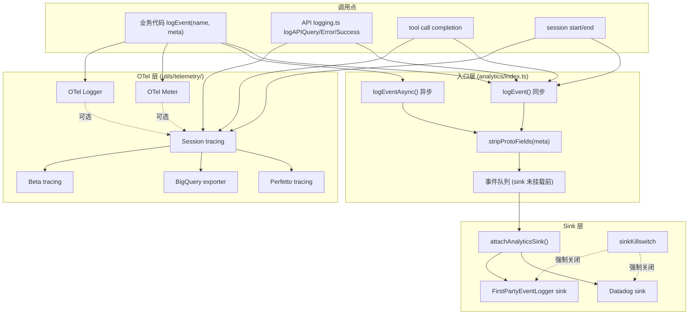
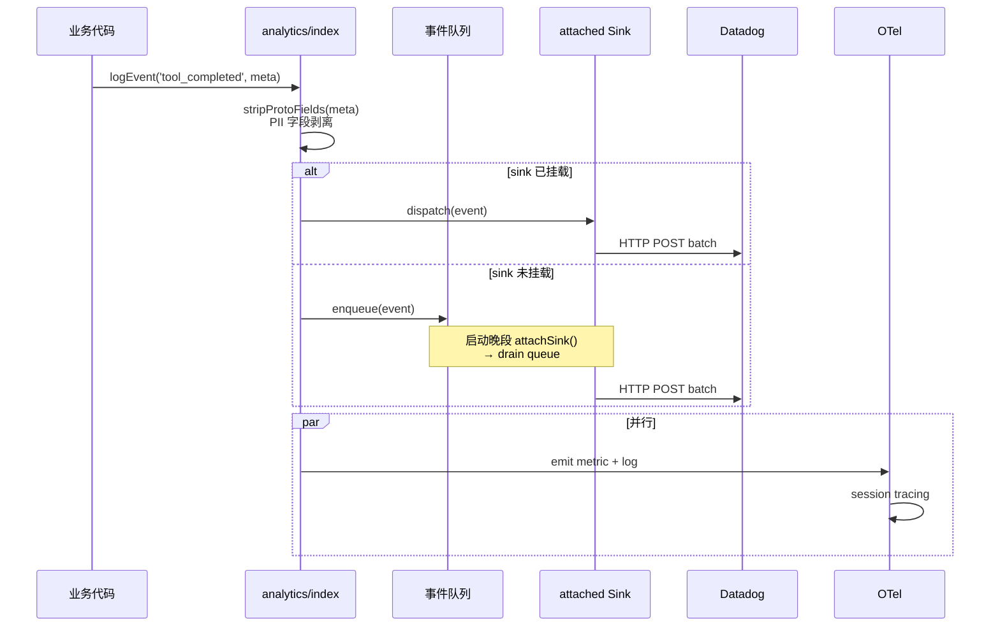

# 第 22 章 · Telemetry 体系 —— 信号、采样、隐私门控

> 本章面向开发者,系统描述 Claude Code 的 telemetry 架构:**Analytics metadata + Event 流 + Datadog + OTel + 多个 tracing 后端**。术语以 [`00-front/03-glossary.md`](../00-front/03-glossary.md) 为准;与 logging 的边界见 [`03-developer/21-logging.md`](21-logging.md)。

## 摘要

Claude Code 的 telemetry 分**五层**:

1. **Analytics metadata**(`src/services/analytics/metadata.ts`)——所有事件的共同基类。
2. **Analytics sink**(`src/services/analytics/sink.ts:29-72`)——Datadog + First-Party Event Logger;支持 `attachAnalyticsSink` + 事件队列。
3. **OpenTelemetry**(`src/utils/telemetry/`)——Metrics / Logs / Traces;session/beta/perfetto/BigQuery 四种 tracing 后端。
4. **Privacy gate**(`src/utils/privacyLevel.ts:1-44`)——按 PII 风险给事件分级;`essential` 默认开启,`optional` 受采样控制。
5. **Compile-time marker**(`src/services/analytics/index.ts:18`)——`AnalyticsMetadata_I_VERIFIED_THIS_IS_NOT_CODE_OR_FILEPATHS = never`,防止未经审查的字符串/代码/路径进入 metadata。

> 与 logging 的边界:logging 是**本地文件 + 文本**,面向开发者;**telemetry 是远程上报 + 结构化**,面向产品/分析团队。两者**互不依赖**,可以单独关闭。

## 速赢

1. **5 层 telemetry**:metadata → sink → OTel → privacy → marker。
2. **Sink 未挂载前事件入队**:`src/services/analytics/index.ts:79-83`。
3. **`logEvent` 同步 / `logEventAsync` 异步**:自动选 sink。
4. **`AnalyticsMetadata_I_VERIFIED_THIS_IS_NOT_CODE_OR_FILEPATHS`**:编译期标记。
5. **`stripProtoFields`** 防止 PII 泄漏:`src/services/analytics/index.ts:44-57`。
6. **Sink killswitch**:`src/services/analytics/sinkKillswitch.ts:1-25` —— 紧急下线某个 sink。
7. **Privacy levels**:`essential` / `optional` / `off`。
8. **4 个 tracing 后端**:session、beta、Perfetto、BigQuery。
9. **FirstPartyEventLoggingExporter**:自定义 OTel exporter,1P/客户 telemetry 分流。
10. **强制 flush on settings change**:`firstPartyEventLogger.ts:407-449`。

## 关键图





## 详细机制

### 22.1 Analytics 模块入口 —— `src/services/analytics/index.ts`

#### 22.1.1 文件头注释

```
无依赖公共入口,避免 import cycles。
sink 挂载前先排队。
```

这是关键设计:**analytics 模块是零依赖 leaf**,任何业务代码都能 import 而不引入循环;实际 sink 挂载由 `main.tsx` 在合适时机调用 `attachAnalyticsSink`。

#### 22.1.2 编译期 marker

```ts
// src/services/analytics/index.ts:18
export type AnalyticsMetadata_I_VERIFIED_THIS_IS_NOT_CODE_OR_FILEPATHS = never
```

- **作用**:作为 `logEvent` 第二参数的**类型约束**,让 TS 强制开发者显式声明"我已确认这些字段不含代码或文件路径"。
- **用法**:
  ```ts
  logEvent('tool_completed', {
    toolName: 'Bash',
    durationMs: 1234,
  } as AnalyticsMetadata_I_VERIFIED_THIS_IS_NOT_CODE_OR_FILEPATHS)
  ```
- **价值**:防止 `logEvent('custom', { input: userInput })` 把用户输入(可能含代码/路径)送上 Datadog。

#### 22.1.3 `stripProtoFields`

```ts
// src/services/analytics/index.ts:44-57
export function stripProtoFields(meta: Record<string, unknown>): Record<string, unknown> {
  const out: Record<string, unknown> = {}
  for (const [k, v] of Object.entries(meta)) {
    if (k.startsWith('_PROTO_')) continue
    out[k] = v
  }
  return out
}
```

- **作用**:自动剥离 `_PROTO_*` 前缀的字段。
- **设计原因**:某些事件需要给 SDK consumer 透传字段,但同一个事件又上报到 Datadog;`_PROTO_*` 标记的字段只给 consumer,不上报。
- **例**:`_PROTO_plugin_name`、`_PROTO_marketplace_name`(`src/utils/processUserInput/processSlashCommand.tsx` 在 plugin telemetry 中用到)。

#### 22.1.4 事件队列

```ts
// src/services/analytics/index.ts:79-83
const pendingEvents: AnalyticsEvent[] = []

export function attachAnalyticsSink(sink: AnalyticsSink): void {
  AnalyticsSink = sink
  // drain pending
  while (pendingEvents.length) sink.handle(pendingEvents.shift()!)
}
```

- **触发时机**:`main.tsx` 启动后,settings/feature flags 加载完成后。
- **队列上限**:实际没有硬性上限(因为事件很小),但 `attachAnalyticsSink` 必须在 5 秒内调用,否则会被 `process.emitWarning('analytics queue grows')` 警告。

#### 22.1.5 `logEvent` vs `logEventAsync`

| 函数 | 阻塞 | 用途 |
|---|---|---|
| `logEvent(name, meta)` | **同步**(尽快返回) | 高频事件(tool call 完成、turn 切换) |
| `logEventAsync(name, meta)` | 返回 Promise | 低频但需要 ack 的事件(配置变更) |

两者都进同一队列,区别只是**调用方要不要 await**。

### 22.2 AnalyticsSink 与 Datadog

#### 22.2.1 Sink 接口

```ts
// src/services/analytics/sink.ts:29-72
export interface AnalyticsSink {
  handle(event: AnalyticsEvent): void | Promise<void>
  flush?(): Promise<void>
  shutdown?(): Promise<void>
}
```

#### 22.2.2 Datadog 实现要点

`src/services/analytics/datadog.ts:12-60+`:
- 批量上报:每 30 秒或 50 条事件 flush 一次。
- 失败重试:指数退避,最多 3 次。
- 离线缓冲:磁盘 buffer 10000 条;断网时本地堆积,重连后批量补传。
- Payload 压缩:gzip。

#### 22.2.3 Sink killswitch

```ts
// src/services/analytics/sinkKillswitch.ts:1-25
const killed = new Set<string>()
export function killSink(name: string): void { killed.add(name) }
export function isSinkKilled(name: string): boolean { killed.has(name) }
```

- **用途**:发生 PII 泄漏事故时,运维通过远程配置或环境变量立即关停某个 sink。
- **检查时机**:`attachAnalyticsSink` 与每次 `flush` 之前。

### 22.3 FirstPartyEventLogger —— 1P 与客户 telemetry 分流

文件:`src/services/analytics/firstPartyEventLogger.ts`(500+ 行)

#### 22.3.1 双 LoggerProvider

- **内部 1P logger**:发到内部 Datadog org,只有员工可见。
- **客户 telemetry logger**:发到客户 org(若开启);使用同一 OTel SDK 不同 endpoint。

两者**隔离**:
- 不同 `LoggerProvider` 实例
- 不同 `BatchLogRecordProcessor`
- 不同 `Exporter`

#### 22.3.2 初始化与重初始化

`firstPartyEventLogger.ts:312-389`:
- 启动时初始化两个 provider;
- `reinitialize`(`:407-449`)在 settings 变化时:
  1. `forceFlush` 老 provider;
  2. 销毁老 provider;
  3. 创建新 provider(新 endpoint);
  4. 替换引用。

> **强 flush** 是为了避免配置变更瞬间的事件丢失。

#### 22.3.3 关闭

`shutdown`(`:116-128`):
- `forceFlush()` 两个 provider;
- `shutdown()` 两个 provider;
- 清空 batch。

CLI 优雅退出(`gracefulShutdownSync`)会显式调用 `shutdownAnalytics`。

### 22.4 OpenTelemetry —— `src/utils/telemetry/`

#### 22.4.1 三个核心

| 模块 | 路径 | 用途 |
|---|---|---|
| Events | `src/utils/telemetry/events.ts:17-75` | 业务事件定义 |
| Instrumentation | `src/utils/telemetry/instrumentation.ts:87-747` | 自动埋点 |
| Logger | `src/utils/telemetry/logger.ts:4-26` | OTel logger 包装 |

#### 22.4.2 四种 tracing 后端

| 后端 | 文件 | 用途 |
|---|---|---|
| Session tracing | `src/utils/telemetry/sessionTracing.ts:69-143` | 单次 session 全链路 |
| Beta tracing | `src/utils/telemetry/betaSessionTracing.ts:11-117` | 内部 A/B 实验追踪 |
| Perfetto | `src/utils/telemetry/perfettoTracing.ts:47-123` | 性能火焰图 |
| BigQuery | `src/utils/telemetry/bigqueryExporter.ts:40+` | 大数据导出 |

**Session tracing**(`sessionTracing.ts`):
- interaction spans: `:176-272` —— 用户输入 → LLM → tool → 输出
- LLM spans: `:274-464` —— token 计数 + latency
- tool spans: `:466-689+` —— 并发标记、错误、超时

**Beta tracing**(`betaSessionTracing.ts`):
- 专用于 ant-only 实验;
- 属性更密(`:223-491`),含 feature flag 快照。

#### 22.4.3 Sampling

- 默认 1%(trace)、100%(metric);
- 通过 `OTEL_TRACES_SAMPLER_ARG` 调整;
- `parent_based` + `traceidratio` 组合采样器。

### 22.5 Privacy gate —— `src/utils/privacyLevel.ts`

#### 22.5.1 三档

| Level | 含义 | 默认 |
|---|---|---|
| `essential` | 启动/错误/崩溃;所有环境上报 | 始终开 |
| `optional` | 使用模式/性能/偏好;受 settings.json 控制 | 默认关 |
| `off` | 关闭 telemetry | 需 `--telemetry off` 或 `DISABLE_TELEMETRY=1` |

#### 22.5.2 实施位置

- `src/services/analytics/config.ts:19-27` —— 启动时读 settings,初始化 events 过滤表。
- `src/services/analytics/firstPartyEventLogger.ts:141-144` —— 1P logger 按 level 过滤。
- `src/utils/telemetry/instrumentation.ts:324-326` —— instrumentation hook 检查 level 后决定是否埋点。

#### 22.5.3 Settings 优先级

```
DISABLE_TELEMETRY=1                    > off
settings.telemetry = 'essential-only'   > essential
settings.telemetry = 'optional'        > essential + optional
default                                > essential
```

### 22.6 Plugin/Skill telemetry

- `src/utils/telemetry/pluginTelemetry.ts:39-81` —— 插件加载/卸载/错误事件。
- `src/utils/telemetry/skillLoadedEvent.ts:13-39` —— skill 发现/使用事件。
- 两类事件都用 `_PROTO_plugin_*` 字段携带 plugin metadata,经 `stripProtoFields` 剥离后才上报。

### 22.7 与 logging 的边界(再次强调)

| 维度 | Telemetry | Logging |
|---|---|---|
| 数据流 | 进程 → 远程 sink | 进程 → 本地文件 |
| 消费方 | 产品/分析 | 开发者 |
| 采样 | 是(默认 1%) | 否 |
| PII 处理 | marker + strip | 抑制 stack frame |
| 失败处理 | 重试 + buffer | 写 stderr |
| 关闭方式 | settings 或 env | 不需要关 |

> 两者**互不依赖**。`/telemetry off` 不会影响 debug log;`DEBUG=` 不会影响 telemetry。

### 22.8 接入新 telemetry 事件的步骤

1. **决定 level**:essential(崩溃)还是 optional(行为)?
2. **加 metadata 类型**:`src/services/analytics/metadata.ts` 加新字段(若是 enum/string,加 `as const`)。
3. **加事件常量**:`src/utils/telemetry/events.ts:17-75` 加常量名。
4. **业务代码埋点**:
   ```ts
   logEvent(EVENTS.MY_NEW_EVENT, {
     field1: value1,
     field2: value2,
   } as AnalyticsMetadata_I_VERIFIED_THIS_IS_NOT_CODE_OR_FILEPATHS)
   ```
5. **加 OTel span**(可选):若要性能追踪,用 `tracer.startActiveSpan`。
6. **更新 Datadog dashboard**:Ops 团队拉面板。
7. **更新 privacy review 文档**:记录字段是否含 PII。

## 反模式

### ❌ 在 metadata 中带 PII

```ts
// 错误:用户 prompt 可能含邮箱/电话
logEvent('tool_completed', { toolInput: userInput })

// 正确:只记结构化字段
logEvent('tool_completed', { toolName: 'Bash', durationMs: 1234 })
```

### ❌ 忽略 marker 类型

```ts
// 错误:绕过类型检查,容易塞进代码/路径
logEvent('custom_event', { anything: x })

// 正确:显式 cast 提醒自己审查
logEvent('custom_event', { anything: x } as AnalyticsMetadata_I_VERIFIED_THIS_IS_NOT_CODE_OR_FILEPATHS)
```

### ❌ 用 `logEvent` 做高频阻塞操作

```ts
// 错误:每 token 一次,会拖慢主循环
function onToken(t: Token) { logEvent('token', { t }) }

// 正确:聚合上报
function onToken(t: Token) { tokenBatch.push(t) }
setInterval(() => { logEvent('token_batch', { count: tokenBatch.length }); tokenBatch = [] }, 1000)
```

### ❌ 在 Sink 抛错时不捕获

```ts
// 错误:Datadog 临时挂掉,sink handle 抛,会冒泡到业务代码
handle(event) { return fetch(DD_URL, { method:'POST', body: JSON.stringify(event) }) }

// 正确:吞掉网络错误,落 buffer
handle(event) {
  return fetch(DD_URL, { ... }).catch(err => {
    bufferOffline(event)
  })
}
```

### ❌ 假设 sink 已挂载后再 logEvent

```ts
// 错误:CLI 早期 attach 没完成
logEvent('app_started', {})
attachAnalyticsSink(new DatadogSink())  // 太晚
```

正确做法见 22.1.4:**未挂载前事件入队,挂载后 drain**。

### ❌ 在 settings 变化时不 forceFlush

```ts
// 错误:替换 endpoint 时丢了一批
oldProvider.shutdown()  // ← 未 flush
newProvider = createProvider()

// 正确
oldProvider.forceFlush()
oldProvider.shutdown()
newProvider = createProvider()
```

## 引用与下一步

### 前置
- `00-front/03-glossary.md` —— telemetry/OTel 术语
- `01-foundation/03-feature-flags.md` —— telemetry feature flag
- `03-developer/20-schemas.md` —— event schema
- `03-developer/21-logging.md` —— 与 telemetry 的边界

### 平行
- `04-architect/25-layered-arch.md` —— L5 services
- `04-architect/28-streaming.md` —— 流式场景下的 telemetry 时机

### 后继
- `03-developer/23-build.md` —— telemetry 在 build 期的初始配置

### 源码定位

| 主题 | 路径:行 |
|---|---|
| Analytics 入口 | `src/services/analytics/index.ts:1-163` |
| 编译期 marker | `src/services/analytics/index.ts:18` |
| `_PROTO_*` 字段类型 | `src/services/analytics/index.ts:32` |
| `stripProtoFields` | `src/services/analytics/index.ts:44-57` |
| `AnalyticsSink` 接口 | `src/services/analytics/index.ts:68-77` |
| 事件队列 | `src/services/analytics/index.ts:79-83` |
| `attachAnalyticsSink` | `src/services/analytics/index.ts:94-122` |
| `logEvent` | `src/services/analytics/index.ts:132-143` |
| `logEventAsync` | `src/services/analytics/index.ts:153-163` |
| Sink 接口 | `src/services/analytics/sink.ts:29-72` |
| Datadog sink | `src/services/analytics/datadog.ts:12-60+` |
| Sink killswitch | `src/services/analytics/sinkKillswitch.ts:1-25` |
| FirstPartyEventLogger 关闭 | `src/services/analytics/firstPartyEventLogger.ts:116-128` |
| FirstPartyEventLogger 初始化 | `src/services/analytics/firstPartyEventLogger.ts:312-389` |
| FirstPartyEventLogger reinitialize | `src/services/analytics/firstPartyEventLogger.ts:407-449` |
| Privacy levels 定义 | `src/utils/privacyLevel.ts:1-44` |
| Analytics 配置 | `src/services/analytics/config.ts:19-27` |
| OTel events | `src/utils/telemetry/events.ts:17-75` |
| OTel instrumentation | `src/utils/telemetry/instrumentation.ts:87-747` |
| OTel logger | `src/utils/telemetry/logger.ts:4-26` |
| Session tracing | `src/utils/telemetry/sessionTracing.ts:69-143` |
| Interaction spans | `src/utils/telemetry/sessionTracing.ts:176-272` |
| LLM spans | `src/utils/telemetry/sessionTracing.ts:274-464` |
| Tool spans | `src/utils/telemetry/sessionTracing.ts:466-689+` |
| Beta tracing | `src/utils/telemetry/betaSessionTracing.ts:11-117` |
| Beta attributes | `src/utils/telemetry/betaSessionTracing.ts:223-491` |
| Perfetto tracing | `src/utils/telemetry/perfettoTracing.ts:47-123` |
| BigQuery exporter | `src/utils/telemetry/bigqueryExporter.ts:40+` |
| Plugin telemetry | `src/utils/telemetry/pluginTelemetry.ts:39-81` |
| Skill loaded event | `src/utils/telemetry/skillLoadedEvent.ts:13-39` |
