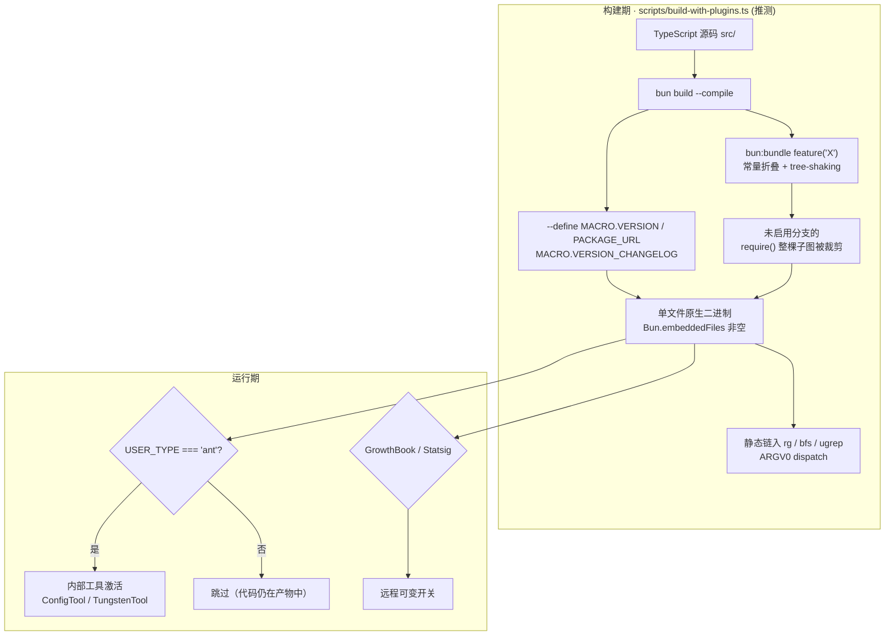
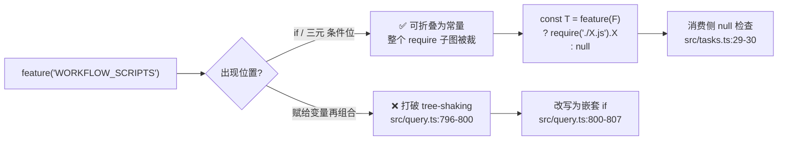

# 第 23 章 · 构建与打包 —— bun bundle、MACRO 注入与 feature() 死代码消除

> 本章面向**开发者**,基于源码中可见的构建机制反推 Claude Code 的构建契约。**注意**:本仓库只包含从发布产物回推的 `src/`,不存在 `package.json`、CI YAML 或构建脚本的"权威版本"——所有结论都有 file:line 锚点,但脚本细节不能从本仓库验证。术语以 [`00-front/03-glossary.md`](../00-front/03-glossary.md) 为准;feature flag 基础见 [`01-foundation/03-feature-flags.md`](../01-foundation/03-feature-flags.md)。

## 摘要

Claude Code 用 Bun 编译产出**单文件原生二进制**;三个正交机制:
1. **`bun --define` 注入 MACRO.* 常量**(`src/utils/sessionStorage.ts:97-99` 注释解释 `--define` 在 async 上下文的 bug,必须模块顶层缓存)。
2. **`bun:bundle` 的 `feature()` 编译期 DCE** —— 91 个 flag、212 处引用;Top 10:KAIROS(154)、TRANSCRIPT_CLASSIFIER(107)、TEAMMEM(51)、VOICE_MODE(46)、BASH_CLASSIFIER(45)。
3. **`process.env.USER_TYPE === 'ant'` 运行期门控** —— 296 处;代码**仍在**外部产物,只在内部激活。

构建产物形态鉴别:`isInBundledMode()`(`src/utils/bundledMode.ts:16-22`)靠 `Bun.embeddedFiles.length > 0` 而非 env 变量。ARGV0 dispatch 让 `bfs`/`ugrep`/`rg` 静态链入单一二进制。平台矩阵覆盖 darwin/linux/win32 × x64/arm64 × glibc/musl,有 `feature('IS_LIBC_MUSL')` / `feature('IS_LIBC_GLIBC')` 两个 libc 编译期 flag。

## 速赢

1. **三种门控时机不同**:编译期 DCE / 编译期常量 / 运行期 env。
2. **`feature()` 必须直接出现在 `if`/三元条件位**:`src/query.ts:796-800` 注释说明。
3. **DCEmissing 目录本身是教具**:`src/tools.ts:129` require 了一个被裁掉的目录。
4. **`MACRO.*` 必须在模块顶层求值**:`sessionStorage.ts:97-99` 注释解释 `--define` 的 async bug。
5. **`isInBundledMode()` 鉴别产物形态**:`Bun.embeddedFiles.length > 0`。
6. **`spawnMultiAgent.ts:197` 用 `isInBundledMode()` 切自举路径**。
7. **ARGV0 dispatch 让 rg/bfs/ugrep 静态链入**。
8. **91 个 feature flag、212 处引用**;DCE 收益巨大。
9. **`USER_TYPE === 'ant'` 296 处**:内部工具,但代码留在外部产物里。
10. **`pidLock` 防并发安装**:`src/utils/nativeInstaller/pidLock.ts`。

## 关键图





## 详细机制

### 23.1 产物形态:单文件原生二进制

**鉴别手段**(两个独立函数):
- `isRunningWithBun()`(`src/utils/bundledMode.ts:7-10`):`process.versions.bun !== undefined` —— 区分 bun runtime 与 node。
- `isInBundledMode()`(`src/utils/bundledMode.ts:16-22`):
  ```ts
  return (
    typeof Bun !== 'undefined' &&
    Array.isArray(Bun.embeddedFiles) &&
    Bun.embeddedFiles.length > 0
  )
  ```
  这是**判定 Bun 编译产物的关键**:compiled binary 会内嵌静态文件,`Bun.embeddedFiles` 非空。

**`main.tsx` 日志埋点**(`:2487-2488`):
```ts
logForDiagnosticsNoPII('started', { is_native_binary: isInBundledMode() })
```

### 23.2 `MACRO.*` 编译期常量注入

`bun build --define` 把字符串字面量替换为常量值。Claude Code 用 `MACRO` 作为统一前缀:

| 字段 | 引用示例 | 用途 |
|---|---|---|
| `MACRO.VERSION` | `src/main.tsx:3808`, `src/utils/localInstaller.ts:115`, `src/utils/sessionStorage.ts:97-99` | 当前版本号 |
| `MACRO.PACKAGE_URL` | `src/utils/localInstaller.ts:115` | 安装包 URL(`npm install <URL>@stable`) |
| `MACRO.ISSUES_EXPLAINER` | `src/constants/prompts.ts:218` | 错误页"如何提 issue"文案 |
| `MACRO.VERSION_CHANGELOG` | `src/utils/releaseNotes.ts:293,341` | 整个 changelog 内联进二进制 |

**关键约束**(`src/utils/sessionStorage.ts:97-99`):
```ts
// Cache MACRO.VERSION at module level to work around bun --define bug in async contexts
const VERSION = typeof MACRO !== 'undefined' ? MACRO.VERSION : 'unknown'
```

> **`--define` 在 async 上下文里有 bug**,所以必须在模块顶层求值;`typeof MACRO !== 'undefined'` 的守卫让非 bundle(`bun run` 源码)路径不崩。

**`MACRO.VERSION` 用法**:
- `src/utils/permissions/filesystem.ts:51`:`declare const MACRO: { VERSION: string }`
- `src/constants/system.ts:78`:`${MACRO.VERSION}.${fingerprint}`(版本 + 构建指纹)
- `src/utils/permissions/filesystem.ts:368`:`bundled-skills/<MACRO.VERSION>/` 缓存目录按版本隔离

### 23.3 `feature()` 编译期 DCE —— 本章核心

**规模数据**(建议直接放进正文,很有冲击力):
- **91 个 flag**
- **212 处文件引用**
- Top 10 引用频次:
  - `KAIROS` 154
  - `TRANSCRIPT_CLASSIFIER` 107
  - `TEAMMEM` 51
  - `VOICE_MODE` 46
  - `BASH_CLASSIFIER` 45
  - `KAIROS_BRIEF` 39
  - `PROACTIVE` 37
  - `COORDINATOR_MODE` 32
  - `BRIDGE_MODE` 28
  - `EXPERIMENTAL_SKILL_SEARCH` 21

#### 23.3.1 惯用法 A —— `feature() ? require() : null`

`src/tools.ts:104-135`(完整 IIFE 变体 + 注释):

```ts
import { feature } from 'bun:bundle'
// Dead code elimination: conditional import for OVERFLOW_TEST_TOOL
/* eslint-disable custom-rules/no-process-env-top-level, @typescript-eslint/no-require-imports */
const OverflowTestTool = feature('OVERFLOW_TEST_TOOL')
  ? require('./tools/OverflowTestTool/OverflowTestTool.js').OverflowTestTool
  : null
const CtxInspectTool = feature('CONTEXT_COLLAPSE')
  ? require('./tools/CtxInspectTool/CtxInspectTool.js').CtxInspectTool
  : null
// ...
const WorkflowTool = feature('WORKFLOW_SCRIPTS')
  ? (() => {
      require('./tools/WorkflowTool/bundled/index.js').initBundledWorkflows()
      return require('./tools/WorkflowTool/WorkflowTool.js').WorkflowTool
    })()
  : null
/* eslint-enable ... */
```

> **DCE 关键**:用 `require()` 而非 `import`,才能让整个子模块图在 feature 关闭时被裁掉。`import` 是 ES Module 的静态结构,无法 tree-shake;`require()` 是条件调用,可被折叠。

#### 23.3.2 消费侧 null 检查

工具注册数组(`src/tools.ts:201,214-232`)、任务注册(`src/tasks.ts:29-30`):
```ts
const allTasks = [
  // ...
  ...(LocalWorkflowTask ? [LocalWorkflowTask] : []),
  ...(MonitorMcpTask ? [MonitorMcpTask] : []),
]
```

> `feature('WORKFLOW_SCRIPTS')` 关闭时,`LocalWorkflowTask` 为 `null`,`...null` 展开会报错,所以必须用 `[...(x ? [x] : [])]`。

#### 23.3.3 关键约束:`feature()` 只能出现在 if/三元条件位

`src/query.ts:796-800` 是教学金句注释:

```
// feature() only works in if/ternary conditions (bun:bundle
// tree-shaking constraint), so the collapse check is nested
// rather than composed.
```

反例(错误):
```ts
const enabled = feature('FOO') && feature('BAR')  // 复合表达式,不能折叠
```

正例(正确):
```ts
if (feature('FOO')) {
  if (feature('BAR')) { /* ... */ }
}
```

#### 23.3.4 命令侧同构

`src/commands.ts:400-406`:
```ts
export const getWorkflowCommands = feature('WORKFLOW_SCRIPTS')
  ? getWorkflowCommandsImpl
  : () => []
```

`src/commands.ts:547-559` `getMcpSkillCommands` 仅在 `feature('MCP_SKILLS')` 时把 MCP prompt-typed 命令纳入技能索引。

### 23.4 三层门控对照表

| 层 | 机制 | 时机 | 产物影响 | 引用示例 |
|---|---|---|---|---|
| 编译期 DCE | `feature('X')` from `bun:bundle` | build | 代码**不进**二进制 | `src/tools.ts:129` |
| 编译期常量 | `MACRO.*` via `bun --define` | build | 值被内联 | `src/constants/system.ts:78` |
| 运行期门控 | `process.env.USER_TYPE === 'ant'` | runtime | 代码在,但不激活 | `src/tools.ts:17,214,215` 等 296 处 |
| 运行期动态 | GrowthBook / Statsig | runtime | 远程可变 | `src/services/analytics/growthbook.ts` |

**要点**:`USER_TYPE === 'ant'` 用于内部员工功能,代码**仍在**公开二进制里;而 `feature()` 用于真正需要物理移除的部分。

### 23.5 构建变体(build targets)

#### 23.5.1 内嵌搜索工具

`src/utils/embeddedTools.ts:13`:
```
"Set as a build-time define in scripts/build-with-plugins.ts
for ant-native builds."
```

`src/utils/embeddedTools.ts:15-22`:
```ts
export function hasEmbeddedSearchTools(): boolean {
  return (
    !!process.env.EMBEDDED_SEARCH_TOOLS &&
    !['sdk-ts', 'sdk-py', 'sdk-cli', 'local-agent'].includes(ENTRYPOINT)
  )
}
```

`src/tools.ts:198-201`:embedded 时把 `GlobTool`/`GrepTool` 移出注册表(避免重复)。

#### 23.5.2 ARGV0 dispatch 技巧

静态编译的 `rg`/`bfs`/`ugrep` 走同一个二进制,靠 `argv[0]` 分发:

`src/utils/ripgrep.ts:47-64`:
```ts
if (isInBundledMode()) {
  return { command: process.execPath, argv0: 'rg', args: [...] }
}
// 否则用 vendor/ripgrep/<arch>-<platform>/rg
```

`src/utils/bash/ShellSnapshot.ts:28` 注释:"bun-internal ARGV0 dispatch trick"。

#### 23.5.3 平台与 libc 矩阵

| 平台 | 矩阵 |
|---|---|
| OS | darwin / linux / win32 |
| Arch | x64 / arm64 |
| libc | glibc / musl |

`src/utils/nativeInstaller/installer.ts:103-105`:`linux-${arch}-musl`。
`src/utils/envDynamic.ts:25-58`:运行时探测 `/lib/libc.musl-{x86_64,aarch64}.so.1`,仅 node/unbundled 回退路径需要。
两个 libc flag:`feature('IS_LIBC_MUSL')` / `feature('IS_LIBC_GLIBC')`。

### 23.6 版本、发布渠道、自动更新

- `src/utils/config.ts:74`:`type ReleaseChannel = 'stable' | 'latest'`
- `src/utils/autoUpdater.ts:30-31`:GCS bucket `claude-code-dist-...` 存 releases
- `src/utils/autoUpdater.ts:56-62`:SHA-based versioning `X.X.X+SHA`,SemVer 比较时忽略 build metadata
- `src/utils/autoUpdater.ts:82-86`:`minVersion` 强制升级
- `src/utils/localInstaller.ts:108-116`:`npm install <PACKAGE_URL>@stable|latest`
- `src/utils/nativeInstaller/{download,installer,pidLock}.ts`:原生安装三件套
- `src/bridge/bridgeEnabled.ts:168`:`lt(MACRO.VERSION, config.minVersion)` 门控 Remote Control
- `src/constants/system.ts:78`:`version = MACRO.VERSION + '.' + fingerprint`

`pidLock.ts` 用 PID file 防止并发安装互踩。

### 23.7 测试策略(诚实处理)

仓库内 **0 个测试文件**:
```bash
$ find src -name "*.test.ts*"   # 0
$ grep "from 'bun:test'" -r src # 0
```

可指出的间接证据:
- `src/tools/testing/TestingPermissionTool.tsx`:留在产物里的测试辅助工具
- `feature('OVERFLOW_TEST_TOOL')`、`feature('HARD_FAIL')`、`feature('ABLATION_BASELINE')`、`feature('ALLOW_TEST_VERSIONS')`:测试/实验能力本身也走 DCE

> 正确描述:**测试面在发布产物中被裁剪**,而不是"没有测试"。

### 23.8 反向证据:缺失目录本身就是教具

14 个 `feature()` 门控工具的存在性对照:

```
MISSING (被 DCE 裁掉):
  WorkflowTool, MonitorTool, CtxInspectTool, TerminalCaptureTool,
  WebBrowserTool, SnipTool, ListPeersTool, OverflowTestTool,
  SuggestBackgroundPRTool, SendUserFileTool, PushNotificationTool

EXISTS (DCE 未启用 → 保留):
  SleepTool, ScheduleCronTool, RemoteTriggerTool
```

但 `src/tools.ts:129` `require('./tools/WorkflowTool/WorkflowTool.js')` —— **源码层 require 一个不存在目录**。这就是 DCE 的实际效果:**关闭 feature 时,被 require 的模块从产物中消失,即使源码还在**。

## 反模式

### ❌ 把 `feature()` 写到变量再参与复合表达式

```ts
// 错误:bun:bundle 无法折叠复合表达式
const x = feature('A') && feature('B')
if (x) require('./big.js')

// 正确:嵌套 if
if (feature('A')) {
  if (feature('B')) {
    require('./big.js')
  }
}
```

> 见 `src/query.ts:796-800` 注释。

### ❌ 用 `import` 替代 `require()`

```ts
// 错误:ESM 静态结构,无法 tree-shake
import { BigModule } from './big.js'

// 正确:用 require + feature 守门
const BigModule = feature('BIG_MODULE') ? require('./big.js').BigModule : null
```

### ❌ 在 async 上下文直接读 MACRO

```ts
// 错误:--define 在 async 下取值可能 undefined(bun bug)
async function fetchVersion() {
  return MACRO.VERSION  // ← 可能拿到 undefined
}

// 正确:模块顶层缓存
const VERSION = typeof MACRO !== 'undefined' ? MACRO.VERSION : 'unknown'
async function fetchVersion() { return VERSION }
```

> 见 `src/utils/sessionStorage.ts:97-99` 注释。

### ❌ 假设产物一定有 `Bun.embeddedFiles`

```ts
// 错误:`bun run` 源码模式下 Bun.embeddedFiles 为 undefined
if (Bun.embeddedFiles.length > 0) { /* ... */ }

// 正确:用 isInBundledMode() 包装
if (isInBundledMode()) { /* ... */ }
```

### ❌ 把 `USER_TYPE === 'ant'` 当 DCE 用

```ts
// 错误:这个分支代码仍在外部产物里,只是不激活
if (process.env.USER_TYPE === 'ant') {
  require('./ant-only.js')  // ← 外部用户拿到这个 require 体积
}

// 正确:用 feature() 物理移除
const antOnly = feature('ANT_ONLY') ? require('./ant-only.js').Ant : null
```

### ❌ 假设 ARGV0 在所有环境生效

```ts
// 错误:node + unbundled 时 argv0 只是 node 路径
const argv0 = process.argv[0]
if (argv0 === 'rg') { /* ... */ }

// 正确:先判 isInBundledMode
if (isInBundledMode() && process.argv[0] === 'rg') { /* ... */ }
```

### ❌ 凭空捏造 CI / package.json scripts

仓库中**没有** `package.json`、`scripts/`、CI YAML。文档应基于源码事实,**不要虚构 npm scripts 或测试命令**。

## 引用与下一步

### 前置
- `00-front/03-glossary.md`
- `01-foundation/03-feature-flags.md` —— feature flag 基础

### 平行
- `03-developer/18-commands.md` —— 命令用 `feature()` 守门
- `03-developer/22-telemetry.md` —— telemetry 用 GrowthBook

### 后继
- `03-developer/24-workflow.md` —— task 生命周期(产物形态影响编排路径)

### 源码定位

| 主题 | 路径:行 |
|---|---|
| `isRunningWithBun` | `src/utils/bundledMode.ts:7-10` |
| `isInBundledMode` | `src/utils/bundledMode.ts:16-22` |
| `logForDiagnosticsNoPII('started')` | `src/main.tsx:2487-2488` |
| `MACRO` declare | `src/utils/permissions/filesystem.ts:51` |
| `MACRO.VERSION` 顶层缓存 | `src/utils/sessionStorage.ts:97-99` |
| `MACRO.VERSION` 拼装 | `src/constants/system.ts:78` |
| `MACRO.PACKAGE_URL` | `src/utils/localInstaller.ts:115` |
| `MACRO.ISSUES_EXPLAINER` | `src/constants/prompts.ts:218` |
| `MACRO.VERSION_CHANGELOG` | `src/utils/releaseNotes.ts:293,341` |
| `bundledMode` typeof 守卫 | `src/utils/permissions/filesystem.ts:368` |
| `feature()` IIFE 范式 | `src/tools.ts:129-134` |
| `feature()` require 范式 | `src/tools.ts:104-128` |
| `feature()` 注释 | `src/tools.ts:105` |
| 嵌套 if 范式 | `src/query.ts:796-807` |
| `getWorkflowCommands` 范式 | `src/commands.ts:400-406` |
| 任务侧 DCE 范式 | `src/tasks.ts:8-14, 29-30` |
| `hasEmbeddedSearchTools` | `src/utils/embeddedTools.ts:15-22` |
| embedded tools build 注释 | `src/utils/embeddedTools.ts:13` |
| `embeddedTools` 排除 entrypoint | `src/tools.ts:198-201` |
| ARGV0 dispatch | `src/utils/ripgrep.ts:47-64` |
| ShellSnapshot trick 注释 | `src/utils/bash/ShellSnapshot.ts:28` |
| 平台矩阵 | `src/utils/nativeInstaller/installer.ts:103-105` |
| libc 运行时探测 | `src/utils/envDynamic.ts:25-58` |
| ReleaseChannel | `src/utils/config.ts:74` |
| GCS bucket | `src/utils/autoUpdater.ts:30-31` |
| SemVer 比较 | `src/utils/autoUpdater.ts:56-62` |
| minVersion 强制升级 | `src/utils/autoUpdater.ts:82-86` |
| `lt(MACRO.VERSION, minVersion)` | `src/bridge/bridgeEnabled.ts:168` |
| `pidLock` | `src/utils/nativeInstaller/pidLock.ts` |
| `spawnMultiAgent` 用 bundledMode | `src/tools/shared/spawnMultiAgent.ts:197` |
| Build 注释引用脚本 | `src/utils/embeddedTools.ts:13` |
