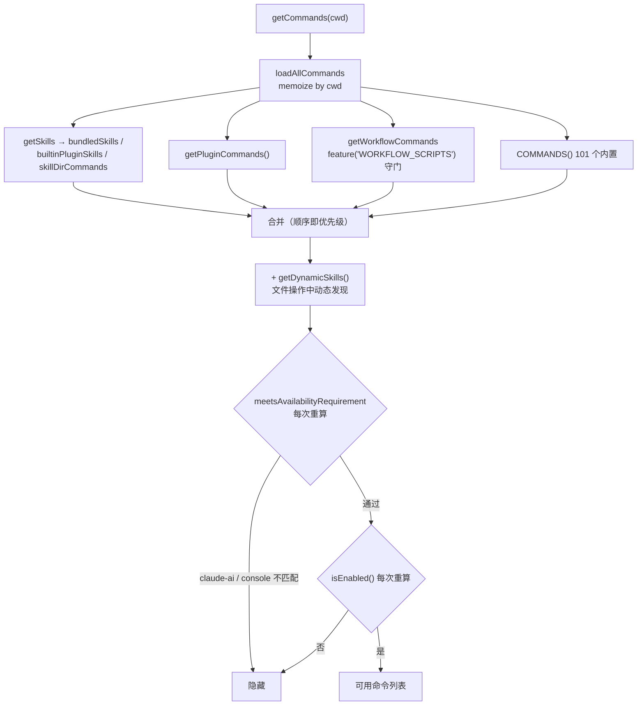
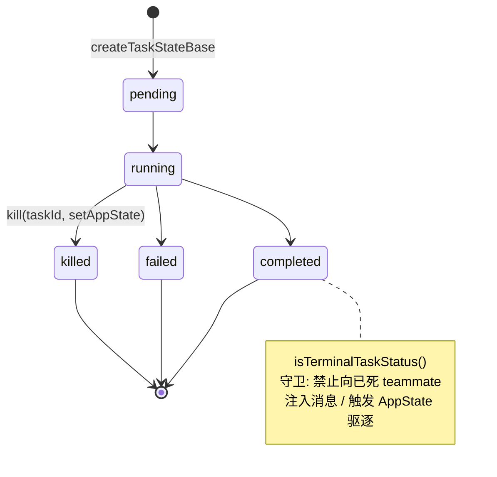
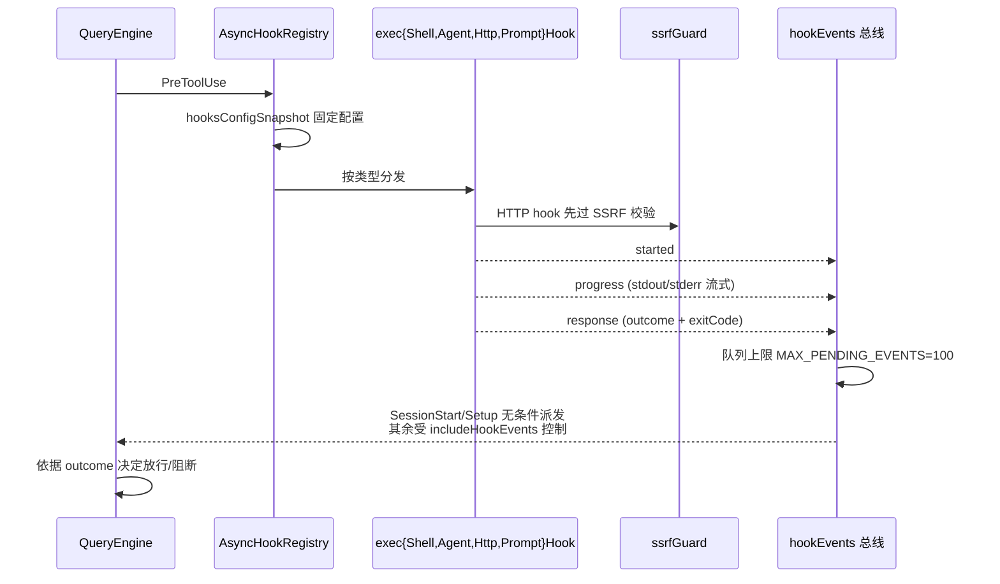

# 第 24 章 · 命令装配、Task 生命周期与 Hook 总线

> 本章面向**开发者**,聚焦 Claude Code 的"工作流编排"内部实现。题目中的"workflow"包含两层意思:**开发者侧的工程工作流**(命令如何装配、task 如何跑、hook 何时触发)与**运行时的内部工作流引擎**(`local_workflow` 类型任务)。本章从开发到交付的工程视角,系统覆盖这两层。术语以 [`00-front/03-glossary.md`](../00-front/03-glossary.md) 为准;hook 用户视角见 [`02-user/08d-hooks.md`](../02-user/08d-hooks.md)。

## 摘要

Claude Code 的"工作流"由四块组成:**命令装配管线**(`src/commands.ts:448-517`,6 来源并行 + 三段式缓存分层)、**Task 抽象**(`src/Task.ts`,7 种 TaskType + 5 态 Status + `kill` 多态)、**Hook 总线**(27 个事件 + `src/utils/hooks/` 5000+ 行实现 + 4 种执行器 + SSRF guard)、**运行模式**(`COORDINATOR_MODE`、`KAIROS`、multi-agent spawn)。命令装配的"三段式缓存分层"是关键工程经验:**加载 memo / availability 重算 / isEnabled 重算** —— 加载慢但稳定,enable 动态但便宜。Task 接口随时间收敛(`#22546` 砍掉 spawn/render 多态,只剩 kill),是设计演化的教学样本。Hook 27 个事件按生命周期分为 8 组:工具 / 会话 / 权限 / 压缩 / 子代理 / 任务 / worktree / 文件环境 / elicitation。

## 速赢

1. **命令装配 6 来源**:`bundledSkills + builtinPluginSkills + skillDirCommands + workflowCommands + pluginCommands + COMMANDS()`。
2. **三段式缓存分层**(`commands.ts:528`):加载 memo / availability 重算 / enable 重算。
3. **Task 7 种类型**:`local_bash | local_agent | remote_agent | in_process_teammate | local_workflow | monitor_mcp | dream`。
4. **Task 5 态**:`pending | running | completed | failed | killed`。
5. **`isTerminalTaskStatus`** 守卫:completed/failed/killed(`src/Task.ts:27-29`)。
6. **Task ID 36^8 + 8 字符**(`:96-106`):抵御 brute-force symlink。
7. **Task 接口只剩 kill 多态**(`:69-76`):`#22546` 砍掉 spawn/render。
8. **Hook 27 个事件**:`coreTypes.ts:25-53` HOOK_EVENTS。
9. **Hook 4 种执行器**:shell / agent / http / prompt。
10. **`MAX_PENDING_EVENTS=100`** hook 事件背压(`utils/hooks/hookEvents.ts:18`)。

## 关键图







## 详细机制

### 24.1 命令装配管线

#### 24.1.1 6 来源合并

`src/commands.ts:448-467`:
```ts
const loadAllCommands = memoize(async (cwd: string): Promise<Command[]> => {
  const [
    { skillDirCommands, pluginSkills, bundledSkills, builtinPluginSkills },
    pluginCommands,
    workflowCommands,
  ] = await Promise.all([
    getSkills(cwd),
    getPluginCommands(),
    getWorkflowCommands(),
  ])
  // 合并顺序: bundledSkills → builtinPluginSkills → skillDirCommands
  //          → workflowCommands → pluginCommands → pluginSkills → COMMANDS()
  return [
    ...bundledSkills, ...builtinPluginSkills, ...skillDirCommands,
    ...workflowCommands, ...pluginCommands, ...pluginSkills,
    ...COMMANDS(),
  ]
})
```

合并顺序即优先级:bundled 在前,内置在后;动态技能(`getDynamicSkills()`,`:480-516`)在 builtin 之前插入——用户技能优先级高于通用命令。

#### 24.1.2 三段式缓存分层

| 层 | 函数 | 是否 memo | 失效时机 |
|---|---|---|---|
| 加载 | `loadAllCommands(cwd)` | **memoize**(按 cwd) | `clearCommandMemoizationCaches()` |
| 可用性 | `meetsAvailabilityRequirement(cmd)` | **不 memo** | 每次重算 |
| 启用 | `isCommandEnabled(cmd)` | **不 memo** | 每次重算 |

`src/commands.ts:528` 注释解释为何分两层:
> availability 先于 isEnabled,且不 memo(/login 后即时生效)。

#### 24.1.3 加载函数签名

```ts
// src/commands.ts:417-443
export function meetsAvailabilityRequirement(cmd: CommandBase): boolean {
  if (!cmd.availability) return true
  return cmd.availability.some(a => matchesCurrentProvider(a))
}
```

`matchesCurrentProvider(a)` 检测当前 auth(`claude-ai` 订阅 / `console` 直连 / Bedrock / Vertex / Foundry / 自定义 base URL)。

#### 24.1.4 缓存失效

`src/commands.ts:523-539`:
```ts
export function clearCommandMemoizationCaches(): void {
  loadAllCommands.cache.clear?.()
  builtInCommandNames.cache.clear?.()
  clearSkillIndexCache()  // 兜底,避免 lodash memoize 残留
}
```

触发时机:`/login` 改 auth、`/reload-plugins` 显式刷新、settings 切换 provider。

#### 24.1.5 命令描述后缀

`formatDescriptionWithSource(cmd)`(`:728-754`):UI 显示命令描述时附 `[plugin]` / `[workflow]` / `[bundled]` 来源标签,与 SkillTool 模型文案区分。

### 24.2 Task 抽象与生命周期

#### 24.2.1 类型与状态

`src/Task.ts`:

```ts
// :6-14
export type TaskType =
  | 'local_bash' | 'local_agent' | 'remote_agent'
  | 'in_process_teammate' | 'local_workflow'
  | 'monitor_mcp' | 'dream'

// :15-21
export type TaskStatus =
  | 'pending' | 'running' | 'completed' | 'failed' | 'killed'

// :27-29
export function isTerminalTaskStatus(status: TaskStatus): boolean {
  return status === 'completed' || status === 'failed' || status === 'killed'
}
```

#### 24.2.2 `Task` 接口的演化

`src/Task.ts:69-76` 的注释是教学金句:
```
What getTaskByType dispatches for: kill. spawn/render were never
called polymorphically (removed in #22546). All six kill implementations
use only setAppState — getAppState/abortController were dead weight.
```

接口随时间收敛的演化:
- **曾经**:`spawn / render / kill` 三态多态
- **现在**:实测只有 `kill` 被多态调用,`spawn/render` 被裁
- 顺便删掉 `getAppState`/`abortController` —— 六个 `kill` 实现都没用

#### 24.2.3 Task ID 设计

```ts
// :96-106
const TASK_ID_ALPHABET = '0123456789abcdefghijklmnopqrstuvwxyz'
export function generateTaskId(type: TaskType): string {
  const prefix = getTaskIdPrefix(type)
  const bytes = randomBytes(8)
  let id = prefix
  for (let i = 0; i < 8; i++) {
    id += TASK_ID_ALPHABET[bytes[i]! % TASK_ID_ALPHABET.length]
  }
  return id
}
```

- **36^8 ≈ 2.8 万亿种组合**:足以抵御 brute-force symlink 攻击(`Task.ts:94-95` 注释)
- **prefix 表**(`:79-87`):`b/a/r/t/w/m/d` 对应 7 种 TaskType
- **用 lowercase hex + digits**,避免大小写歧义

#### 24.2.4 `createTaskStateBase`

`src/Task.ts:108-125`:构造 `TaskStateBase`(id / type / status / description / startTime / outputFile / outputOffset / notified)。`outputOffset` 用于增量读取 task 输出文件(参见 `getTaskOutputPath` in `diskOutput.ts`)。

#### 24.2.5 Task 实现清单

`src/tasks/` 下:
- `LocalShellTask` (local_bash)
- `LocalAgentTask` (local_agent)
- `RemoteAgentTask` (remote_agent)
- `InProcessTeammateTask` (in_process_teammate)
- `LocalWorkflowTask` (local_workflow) —— `feature('WORKFLOW_SCRIPTS')` 守门
- `MonitorMcpTask` (monitor_mcp) —— `feature` 守门
- `DreamTask` (dream)
- `stopTask.ts` —— 通用停止

`src/utils/tasks.ts` 提供 `TaskSchema`(zod 推导)、`createTask`、file lock、high-water mark、`getTask` / `updateTask` / `listTasks`。

### 24.3 Hook 总线

#### 24.3.1 27 个事件

`src/entrypoints/sdk/coreTypes.ts:25-53` `HOOK_EVENTS`:

| 分组 | 事件 |
|---|---|
| 工具 | `PreToolUse` / `PostToolUse` / `PostToolUseFailure` |
| 会话 | `SessionStart` / `SessionEnd` / `Setup` / `Elicitation` |
| 权限 | `PermissionRequest` / `PermissionDenied` |
| 压缩 | `PreCompact` / `PostCompact` |
| 子代理 | `SubagentStart` / `SubagentStop` / `TeammateIdle` |
| 任务 | `TaskCreated` / `TaskCompleted` |
| Worktree | `WorktreeCreate` / `WorktreeRemove` |
| 文件/环境 | `FileChanged` / `CwdChanged` / `InstructionsLoaded` / `ConfigChange` |
| 用户 | `UserPromptSubmit` |
| 通知 | `Notification` |
| Stop | `Stop` |

#### 24.3.2 事件生命周期

`src/utils/hooks/hookEvents.ts:16-53`:

```ts
// :16 - 总会派发的事件
const ALWAYS_EMITTED_HOOK_EVENTS = ['SessionStart', 'Setup']

// :18 - 队列上限
const MAX_PENDING_EVENTS = 100

// :22-53 - 事件类型
type HookEvent =
  | { type: 'started'; hookId; hookName; hookEvent; ... }
  | { type: 'progress'; stdout; stderr; output; ... }
  | { type: 'response'; output; stdout; stderr; exitCode; outcome; ... }
```

背压:超过 `MAX_PENDING_EVENTS` 时,新事件丢弃并打 warning 日志。

#### 24.3.3 4 种执行器

| 执行器 | 文件 | 用途 |
|---|---|---|
| Shell | `src/utils/hooks/execShellHook.ts`(推测,泄露快照中不存在) | 命令 hook,白名单子进程 |
| Agent | `src/utils/hooks/execAgentHook.ts` | 子代理 hook |
| HTTP | `src/utils/hooks/execHttpHook.ts` | 远程 webhook,过 SSRF guard |
| Prompt | `src/utils/hooks/execPromptHook.ts` | LLM 推理 hook |

#### 24.3.4 SSRF guard

`src/utils/hooks/ssrfGuard.ts:1-294`(294 行):
- 黑名单 RFC1918 / link-local / loopback
- 强制 HTTPS
- 检查 DNS 解析结果
- 拒绝重定向到内网

> HTTP hook 调任何远程 URL,都先过 `ssrfGuard.check(url)`,失败直接拒绝,不发起请求。

#### 24.3.5 配置快照

`src/utils/hooks/hooksConfigSnapshot.ts`:hook 触发期间冻结 settings,避免 settings 变更影响正在执行的 hook outcome。

#### 24.3.6 sessionHooks

`src/utils/hooks/sessionHooks.ts`(447 行):session 级别 hook 注册表,负责 hook 编排与跨事件传播。

#### 24.3.7 AsyncHookRegistry

`src/utils/hooks/AsyncHookRegistry.ts`(309 行):异步 hook 调度器,跟踪每个 hook 的 in-flight 状态,提供 `cancel()` / `awaitAll()`。

### 24.4 运行模式与编排器

#### 24.4.1 `COORDINATOR_MODE`

`src/coordinator/coordinatorMode.ts` —— `feature('COORDINATOR_MODE')` 守门,32 处引用。
`src/tools.ts:120-122` `coordinatorModeModule` 条件 require。
`src/tools.ts:280-292` 工具集装配:`COORDINATOR_MODE_ALLOWED_TOOLS`(`src/constants/tools.js`)限制可用工具。

#### 24.4.2 `KAIROS`

异步助理模式:`KAIROS`(154 处引用)、`KAIROS_BRIEF`(39 处)。在 [`03-developer/18-commands.md`](18-commands.md) §18.5 已详述。

#### 24.4.3 Multi-agent spawn

`src/tools/shared/spawnMultiAgent.ts:197` —— **构建形态直接影响编排路径**:
```ts
const spawnPath = isInBundledMode() ? process.execPath : process.argv[1]
```

> 原生二进制下自举路径(`process.execPath`)与源码运行(`process.argv[1]`)不同;同一段 spawn 代码要在两种形态下都能正确启动子 agent。

#### 24.4.4 `QueryEngine` / `query.ts`

- `src/QueryEngine.ts`(1295 行):查询引擎总入口
- `src/query.ts`(1729 行):底层 streaming 实现

详见 [`04-architect/28-streaming.md`](../04-architect/28-streaming.md)。

### 24.5 开发者侧的工程工作流

从"开发 → 集成 → 发布"的角度,典型流程:

#### 24.5.1 修改代码

1. **定位边界**:`src/commands.ts`(命令)/ `src/Task.ts`(task)/ `src/utils/hooks/`(hook)/ `src/tools.ts`(工具)。
2. **决定门控**:`feature('XXX')`(编译期 DCE)还是 `USER_TYPE === 'ant'`(运行期门控)?
3. **同步更新 schema**:见 [`03-developer/20-schemas.md`](20-schemas.md)。
4. **同步更新 telemetry**:见 [`03-developer/22-telemetry.md`](22-telemetry.md)。

#### 24.5.2 验证

1. **build-time DCE 验证**:切到关闭 feature 的 build,确认 require 的模块不在产物里。
2. **runtime 验证**:启 CLI,逐路径走通用户交互。
3. **gate 验证**:测试所有 hook 事件都能派发到目标 hook。

#### 24.5.3 发布

1. **bump 版本**:`MACRO.VERSION` 由 `scripts/build-with-plugins.ts` 注入(脚本本仓库不可见)。
2. **release channel**:`stable` / `latest` —— `src/utils/config.ts:74`。
3. **auto-updater 检测**:`src/utils/autoUpdater.ts` 启动时检查版本。
4. **rollback**:`minVersion` 强制升级(`autoUpdater.ts:82-86`)。

### 24.6 命令装配失败模式

| 现象 | 根因 | 排查 |
|---|---|---|
| 改了 `COMMANDS` 数组没生效 | memoize 缓存 | 调 `clearCommandMemoizationCaches()` |
| `/login` 后命令消失 | availability 未重算 | 检查 `meetsAvailabilityRequirement` 的 provider 检测 |
| skill 文件看不到 | `getSkills` 失败被吞 | 看每个 source 单独的 try/catch |
| plugin 命令加载顺序错 | 合并顺序理解错 | 重读 `loadAllCommands`(:448-467) |
| `feature('X')` 改动未生效 | bun:bundle 没重新 build | 重新 `bun build --compile` |
| `MACRO.VERSION` 是 `undefined` | async 上下文取值 | 模块顶层缓存,见 `sessionStorage.ts:97-99` |

## 反模式

### ❌ 把所有命令都直接 `require` 进 `COMMANDS` 数组

```ts
// 错误:重型依赖永远进产物
const heavyCommands = [
  require('./commands/big-a').a,
  require('./commands/big-b').b,
  // ...
]
```

```ts
// 正确:用 feature() 守门,关闭时整棵裁掉
const bigA = feature('BIG_A') ? require('./commands/big-a').a : null
const bigB = feature('BIG_B') ? require('./commands/big-b').b : null

export const COMMANDS = memoize((): Command[] => [
  // ...
  ...(bigA ? [bigA] : []),
  ...(bigB ? [bigB] : []),
])
```

### ❌ 在 hook 中改 settings

```ts
// 错误:hook 期间 settings 是 frozen snapshot(hooksConfigSnapshot),修改会被丢
export function onPreToolUse(input) {
  settings.foo = 'bar'  // ← 没用
  return { decision: 'approve' }
}
```

```ts
// 正确:用返回的 outcome 影响本次 tool 执行,不直接改 settings
export function onPreToolUse(input) {
  return { decision: 'block', reason: '...' }
}
```

### ❌ 向已死 teammate 注入消息

```ts
// 错误:completed teammate 不能再接收消息
if (task.status === 'completed') {
  sendToTeammate(task.id, 'hi')
}

// 正确:用 isTerminalTaskStatus 守卫
if (!isTerminalTaskStatus(task.status)) {
  sendToTeammate(task.id, 'hi')
}
```

### ❌ 在 spawnMultiAgent 里假设 `process.argv[1]` 永远是入口

```ts
// 错误:原生二进制下 argv[1] 是 execPath,不是入口
const entry = process.argv[1]

// 正确:用 isInBundledMode() 切换
const entry = isInBundledMode() ? process.execPath : process.argv[1]
```

### ❌ 同步 HTTP hook 调用

```ts
// 错误:阻塞主 agent turn
async function onPostToolUse(input) {
  await fetch(WEBHOOK_URL, { method:'POST', body: JSON.stringify(input) })
}

// 正确:异步 fire-and-forget,不 await
function onPostToolUse(input) {
  void fetch(WEBHOOK_URL, { method:'POST', body: JSON.stringify(input) })
}
```

### ❌ HTTP hook 不经 SSRF guard

```ts
// 错误:用户可设置 webhook URL 指向内部服务
async function httpHook(url, body) {
  return fetch(url, { method:'POST', body })
}

// 正确:先过 ssrfGuard
async function httpHook(url, body) {
  if (!ssrfGuard.check(url)) throw new Error('blocked by SSRF guard')
  return fetch(url, { method:'POST', body })
}
```

### ❌ 把"工程工作流"和"运行时 workflow"混为一谈

> 第 24 章题目中的 "workflow" 有歧义:
> - **工程工作流**(开发者从改代码到发布的流程)
> - **运行时 workflow**(`feature('WORKFLOW_SCRIPTS')` 守门的 `local_workflow` 类型 task)
>
> 文档/讨论时要明确指代哪个;否则讨论会失焦。

### ❌ 修改源码后不更新 schema

```ts
// 错误:新增字段但 settings schema 没允许
// settings.json 读不出来,默认 false
```

```ts
// 正确:同时更新 utils/settings/{types,validation,schemaOutput}.ts、utils/plugins/schemas.ts(原推断 schema.ts 在泄露中不存在)
```

## 引用与下一步

### 前置
- `00-front/03-glossary.md`
- `02-user/08d-hooks.md` —— hook 用户视角配置
- `02-user/11-multi-agent.md` —— 多 agent 用户视角
- `03-developer/18-commands.md` —— 命令装配细节
- `03-developer/20-schemas.md` —— 命令/schema 同步

### 平行
- `03-developer/22-telemetry.md` —— 装配事件的 telemetry
- `03-developer/23-build.md` —— feature() DCE 与 build 形态
- `04-architect/25-layered-arch.md` —— L3 编排层
- `04-architect/28-streaming.md` —— QueryEngine 流式

### 后继
- `03-developer/24-workflow.md`(即本章)完成工作流循环

### 源码定位

| 主题 | 路径:行 |
|---|---|
| `loadAllCommands` 6 来源 | `src/commands.ts:448-467` |
| `getCommands` 合并 | `src/commands.ts:476-517` |
| `clearCommandMemoizationCaches` | `src/commands.ts:523-532` |
| `meetsAvailabilityRequirement` | `src/commands.ts:417-443` |
| `loadedFrom` 来源 | `src/commands.ts:571-574` |
| `getSkillToolCommands` | `src/commands.ts:585-597` |
| `formatDescriptionWithSource` | `src/commands.ts:728-754` |
| `TaskType` 7 种 | `src/Task.ts:6-14` |
| `TaskStatus` 5 态 | `src/Task.ts:15-21` |
| `isTerminalTaskStatus` | `src/Task.ts:27-29` |
| `Task` 接口只剩 kill | `src/Task.ts:69-76` |
| `TASK_ID_PREFIXES` | `src/Task.ts:79-87` |
| `TASK_ID_ALPHABET` | `src/Task.ts:96` |
| `generateTaskId` | `src/Task.ts:98-106` |
| `createTaskStateBase` | `src/Task.ts:108-125` |
| LocalWorkflowTask/MonitorMcpTask DCE | `src/tasks.ts:8-14, 29-30` |
| `getAllTasks` | `src/tasks.ts:22-31` |
| 27 hook events | `src/entrypoints/sdk/coreTypes.ts:25-53` |
| ALWAYS_EMITTED_HOOK_EVENTS | `src/utils/hooks/hookEvents.ts:16` |
| MAX_PENDING_EVENTS=100 | `src/utils/hooks/hookEvents.ts:18` |
| Hook 事件三态 | `src/utils/hooks/hookEvents.ts:22-53` |
| AsyncHookRegistry | `src/utils/hooks/AsyncHookRegistry.ts`(309 行) |
| execShellHook | `src/utils/hooks/execShellHook.ts`(推测) |
| execAgentHook | `src/utils/hooks/execAgentHook.ts` |
| execHttpHook | `src/utils/hooks/execHttpHook.ts` |
| execPromptHook | `src/utils/hooks/execPromptHook.ts` |
| ssrfGuard | `src/utils/hooks/ssrfGuard.ts:1-294` |
| hooksConfigSnapshot | `src/utils/hooks/hooksConfigSnapshot.ts` |
| sessionHooks | `src/utils/hooks/sessionHooks.ts`(447 行) |
| hooks 主实现 | `src/utils/hooks.ts`(5022 行) |
| coordinatorMode | `src/coordinator/coordinatorMode.ts` |
| coordinatorModeModule DCE | `src/tools.ts:120-122` |
| COORDINATOR_MODE 工具装配 | `src/tools.ts:280-292` |
| spawnMultiAgent 构建形态分支 | `src/tools/shared/spawnMultiAgent.ts:197` |
| QueryEngine | `src/QueryEngine.ts`(1295 行) |
| query 底层 | `src/query.ts`(1729 行) |
