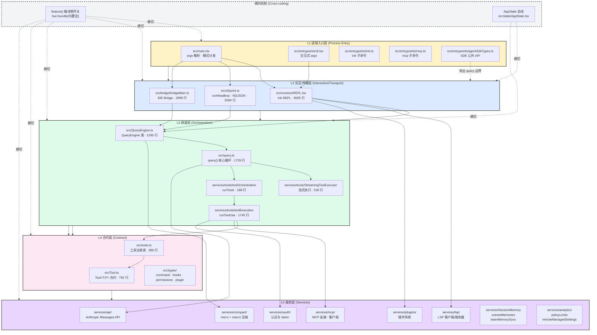
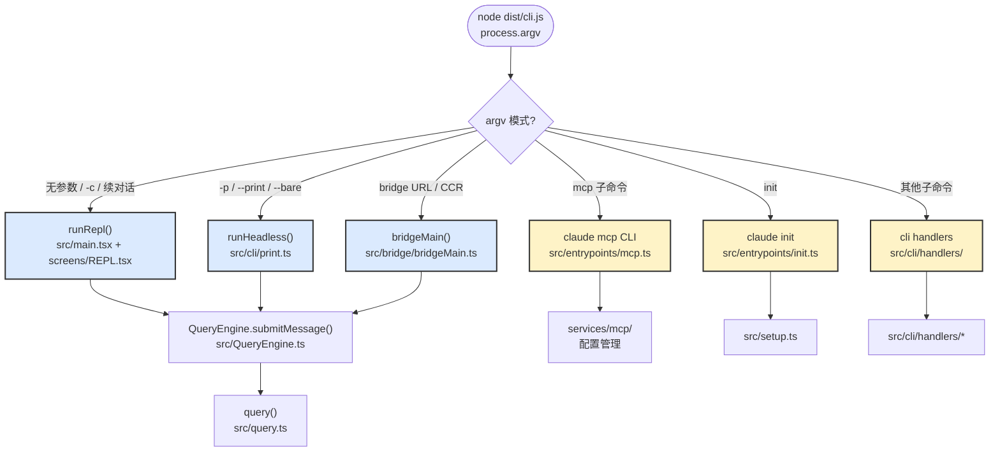
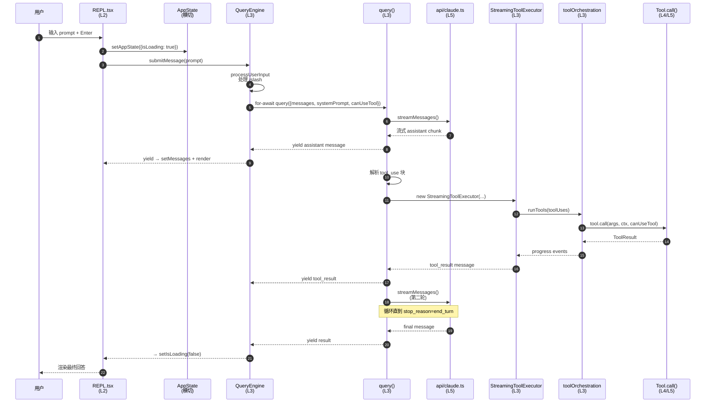
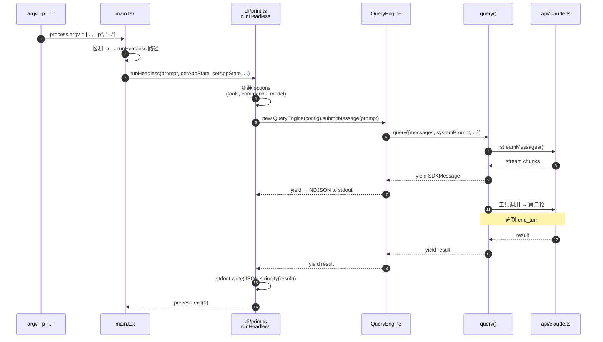
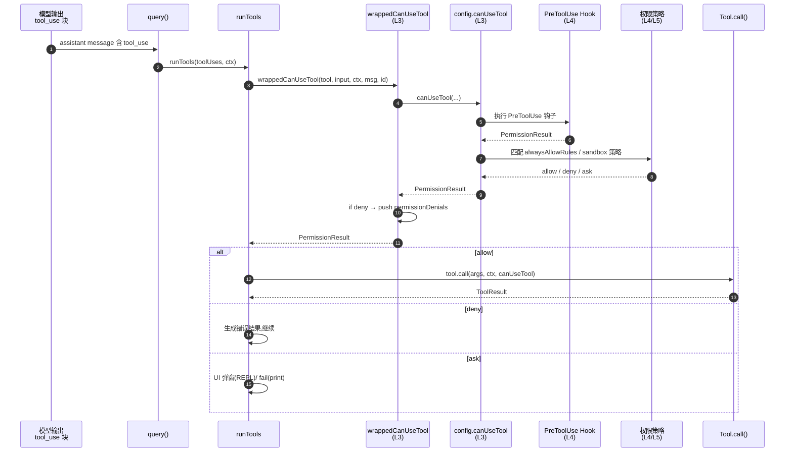
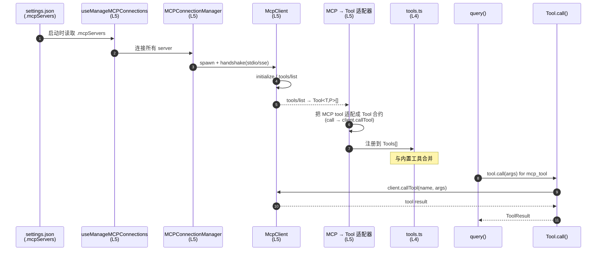
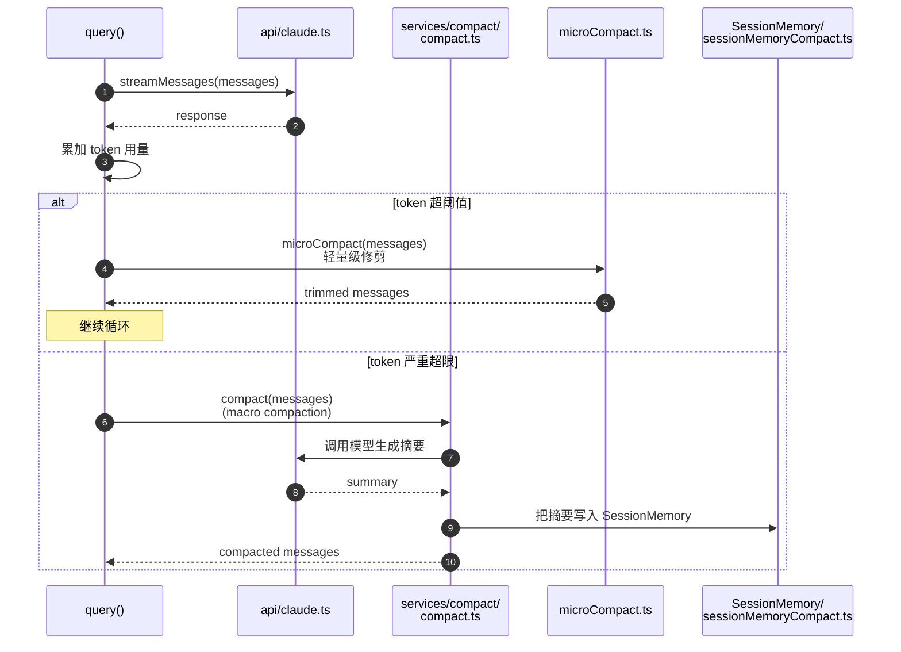
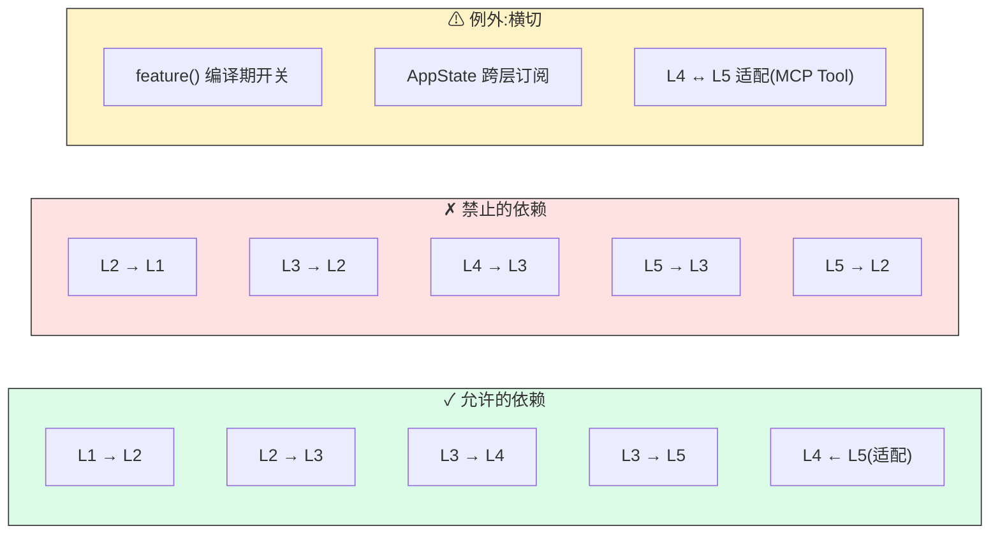

# 第 25 章 分层架构基线 —— Claude Code CLI 的五层架构模型

> 本章是 **架构师视角的开篇章节**,目的是为后续约 12 个架构章节建立共同的坐标系。我们把 Claude Code CLI(~512K 行,~1900 文件,~33 MB)的源代码抽象为一个 **五层架构模型**,并把每个关键模块映射到具体的层。后文涉及"调度层""合约层"等术语时,默认指本章定义的分层。

---

## 1. 为什么需要分层模型

直接面对一个近 1900 文件、2000+ 函数调用的代码库,任何架构讨论都会陷于细节。本章用一个**自顶向下的五层模型**回答三个问题:

1. **代码怎么组织的?** —— 顶层目录的职责划分
2. **模块之间怎么通信?** —— 依赖方向与传递规则
3. **典型请求怎么流动?** —— 5 个标志性调用序列

后续每章都会引用本章节的图作为坐标系(例如 `图 1 中的第 3 层` 等价于"调度层 `src/query.ts`"),读者可以随时回到本章对齐认知。

---

## 2. 顶层目录分类表

下表给出 `src/` 下顶层目录/文件的行数估算与职责。这是后续所有架构讨论的"地名词典"。

| 目录/文件 | 关键文件 | 行数 | 层级 | 职责 |
|---|---|---:|---|---|
| `src/main.tsx` | — | ~4500 | L1 | 主入口:解析 `process.argv`,按 `-p`/`mcp`/bridge/REPL 分发,跑 `runHeadless`/`runRepl`/`bridgeMain` |
| `src/entrypoints/cli.tsx` | — | 302 | L1 | 交互式 REPL 的 argv 解析与启动器 |
| `src/entrypoints/init.ts` | — | 340 | L1 | `claude init` 子命令入口 |
| `src/entrypoints/mcp.ts` | — | 196 | L1 | `claude mcp` 子命令入口(配置管理) |
| `src/entrypoints/agentSdkTypes.ts` | `query()` 导出处 | 130+ | L1 | SDK 公共 API 类型契约(`query`、`Options`) |
| `src/entrypoints/sdk/{coreSchemas,coreTypes}.ts` | — | — | L1 | SDK 模式下的运行时核心类型与校验 schema |
| `src/screens/REPL.tsx` | `REPL()` 组件 | 5005 | L2 | Ink 渲染的交互式 REPL 主屏,所有热键/输入/输出渲染 |
| `src/screens/ResumeConversation.tsx` | — | — | L2 | 会话恢复屏幕 |
| `src/screens/Doctor.tsx` | — | — | L2 | 诊断屏幕 |
| `src/cli/print.ts` | `runHeadless()` | 5594 | L2 | 无头 NDJSON 模式(`/print -p`),`--bare` 极致精简路径 |
| `src/cli/transports/` | — | — | L2 | 输出传输适配(stdio / WebSocket / SSE) |
| `src/cli/handlers/` | — | — | L2 | CLI 子命令处理器(`autoMode` 等) |
| `src/bridge/bridgeMain.ts` | `bridgeMain()` | 2999 | L2 | IDE Bridge 协议核心(远端会话模式) |
| `src/bridge/replBridge.ts` | — | — | L2 | REPL ↔ Bridge 双向通道 |
| `src/bridge/initReplBridge.ts` | — | — | L2 | Bridge 初始化与握手 |
| `src/QueryEngine.ts` | `QueryEngine` 类 | 1295 | L3 | **会话生命周期**封装:`submitMessage` 生成器、消息/权限/用量累积 |
| `src/query.ts` | `query()` 生成器 | 1729 | L3 | **核心 LLM 调用循环**:`ask()` 调用 API、流式消费、工具分发 |
| `src/context.ts` | — | 189 | L3 | 会话上下文(`cwd`、权限缓存、读文件状态) |
| `src/services/tools/StreamingToolExecutor.ts` | `StreamingToolExecutor` | 530 | L3 | 工具执行流式包装(进度事件 + 中断) |
| `src/services/tools/toolOrchestration.ts` | `runTools()` | 188 | L3 | 工具编排(并发 vs 串行、依赖图) |
| `src/services/tools/toolExecution.ts` | `runToolUse()`,权限闸 | 1745 | L3 | 单个工具的实际执行 + 权限/钩子串联 |
| `src/Tool.ts` | `Tool<T,P>` 类型 | 792 | L4 | **核心合约层**:工具接口、`Tools` 列表、`findToolByName` |
| `src/tools.ts` | — | 389 | L4 | 工具注册表:把 `BashTool`/`FileEditTool`/… 组合成 `Tools[]` |
| `src/types/` | `command.ts`、`hooks.ts`、`permissions.ts`、`plugin.ts` | — | L4 | 共享类型:命令、钩子、权限、插件 |
| `src/state/AppState.tsx` | `useAppState` | 199 | 横切 | **跨层状态总线**:toolPermissionContext、verbose、mcp、plugins、tasks |
| `src/services/api/claude.ts` | — | 3419 | L5 | Anthropic Messages API 客户端(流式 / 重试 / 错误归一化) |
| `src/services/api/client.ts` | — | 389 | L5 | API 客户端基类(共享连接、超时) |
| `src/services/mcp/useManageMCPConnections.ts` | — | 1141 | L5 | MCP 连接管理(发现/连接/重连) |
| `src/services/mcp/MCPConnectionManager.tsx` | — | — | L5 | MCP 客户端池化与生命周期 |
| `src/services/lsp/LSPClient.ts`、`LSPServerManager.ts` | — | — | L5 | LSP 客户端 + 服务器进程管理 |
| `src/services/compact/` | `compact.ts`、`microCompact.ts`、`apiMicrocompact.ts` | — | L5 | 上下文压缩(micro + macro) |
| `src/services/oauth/` | — | — | L5 | OAuth 认证与 token 刷新 |
| `src/services/plugins/` | — | — | L5 | 插件系统(发现 / 安装 / 热加载) |
| `src/services/SessionMemory/` | — | — | L5 | 会话内记忆:CLAUDE.md、memdir、autoDream |
| `src/services/extractMemories/` | — | — | L5 | 记忆抽取(从会话中提取可重用知识) |
| `src/services/teamMemorySync/` | — | — | L5 | 团队记忆同步(共享 / 拉取) |
| `src/services/analytics/` | — | — | L5 | 埋点 / 指标上报 |
| `src/services/policyLimits/` | — | — | L5 | 速率限制 / 配额 |
| `src/services/remoteManagedSettings/` | — | — | L5 | 远端托管设置(企业部署) |

> **横切关注点**:来自 Bun 内置宏 `bun:bundle` 的 `feature()` 是**编译期常量**,被所有层用 `feature('FOO')` 守卫包裹,死代码消除会把它整段剥离。这是一条"横向机制"。`src/state/AppState.tsx` 是另一个横切件 —— 跨层状态总线,几乎每个 React 组件都通过 `useAppState` 订阅。

---

## 3. 五层架构模型

### 3.1 一图总览



**关键解读**:

- **箭头方向 = 依赖方向**。上层依赖下层;下层从不反向引用上层。
- **`L3 → L4 → L5`** 是主干链路。所有"动脑子"的工作都经过这三层。
- **`L4` 是最薄的一层**,但承担了"统一抽象"的关键角色 —— 没有 `Tool<T,P>` 合约,所有工具实现都是"野生"的。
- **`L5` 是最厚的一层**,因为它需要封装真实世界的外部依赖(网络 API、MCP 协议、LSP 协议等)。
- **`HORIZ` 不在 5 层之内**。`feature()` 与 `AppState` 是横切关注点(见 §6)。

---

### 3.2 第 1 层:进程入口层(Process Entry)

#### 目录与关键文件

| 路径 | 行数 | 角色 |
|---|---:|---|
| `src/main.tsx` | ~4500 | argv 解析、模式识别、顶层副作用(遥测、设置加载)、按模式分发 |
| `src/entrypoints/cli.tsx` | 302 | `claude` 无参数默认入口 → 启动 REPL |
| `src/entrypoints/init.ts` | 340 | `claude init` 子命令 |
| `src/entrypoints/mcp.ts` | 196 | `claude mcp add/list/remove` 子命令 |
| `src/entrypoints/agentSdkTypes.ts` | 130+ | SDK 模式对外暴露的 `query()`、`Options` 类型 |
| `src/entrypoints/sdk/{coreSchemas,coreTypes}.ts` | — | SDK 模式下的运行时核心 schema |

#### 职责

- 解析 `process.argv`(包括 `-p`、`--bare`、`mcp`、bridge URL 等)
- 执行顶层特性开关副作用(例如 `HEADLESS_AUTO_MODE` 路径下的预连接)
- 决定走哪条路径:`runRepl()` / `runHeadless()` / `bridgeMain()` / `claude mcp`
- 提供 SDK 入口的公共类型边界

#### 上游依赖

- `process.argv`(Node 运行时)
- 全局配置文件(`~/.claude/settings.json`、`.claude/settings.json`)

#### 下游调用

L1 把控制权交给 L2 之后,自身基本不再参与运行时逻辑。L1 不应出现任何 React 组件或工具调用代码。

#### 关键代码位置

- `src/main.tsx:602-799`:argv 分发(检测 `-p`/`cc://`/bridge URL 等)
- `src/main.tsx:2826`:`runHeadless` 入口
- `src/main.tsx:4331`:`bridgeMain` 入口

---

### 3.3 第 2 层:交互/传输层(Interaction/Transport)

#### 目录与关键文件

| 路径 | 行数 | 角色 |
|---|---:|---|
| `src/screens/REPL.tsx` | 5005 | Ink 渲染的交互式 REPL |
| `src/screens/ResumeConversation.tsx` | — | 会话恢复屏幕 |
| `src/screens/Doctor.tsx` | — | 诊断屏幕 |
| `src/cli/print.ts` | 5594 | 无头 NDJSON 模式 |
| `src/cli/transports/` | — | 输出传输适配(stdio / WebSocket / SSE) |
| `src/cli/handlers/` | — | CLI 子命令处理器 |
| `src/bridge/bridgeMain.ts` | 2999 | IDE Bridge 协议核心 |
| `src/bridge/replBridge.ts` | — | REPL ↔ Bridge 双向通道 |
| `src/bridge/initReplBridge.ts` | — | Bridge 初始化与握手 |

#### 职责

L2 的根本职责是**"把字节流变成用户可感知的 I/O,再把用户意图变成结构化事件"**。它处理三种交互模式:

1. **交互式 REPL**(`screens/REPL.tsx`):Ink 渲染、TUI 热键、消息列表、SpinnerWithVerb、QueuedCommands、对话状态机(`QueryGuard`)
2. **Headless NDJSON**(`cli/print.ts`):`runHeadless()` 走 `-p` 模式,流式输出 NDJSON 到 stdout;`--bare` 是极致精简子集
3. **IDE Bridge**(`bridge/bridgeMain.ts`):远端控制协议,JWT 握手、能力上报、远端中断

#### 上游依赖

- L1 的 `runRepl()` / `runHeadless()` / `bridgeMain()` 入口
- Ink 运行时(`src/ink.ts`、`node_modules/ink`)
- 平台 I/O(stdin/stdout/socket)

#### 下游调用

L2 调用 L3(`QueryEngine`、`query()`),把用户输入转换为 `submitMessage(prompt)` 调用,并把 L3 yield 出来的 `SDKMessage` 流反向渲染成 UI/NDJSON/bridge 消息。

#### 关键代码位置

- `src/screens/REPL.tsx:572`:`REPL` 函数组件定义
- `src/screens/REPL.tsx:618-640`:从 `AppState` 订阅的 30+ 字段(工具权限、verbose、mcp、plugins 等)
- `src/cli/print.ts:455`:`runHeadless` 入口
- `src/bridge/bridgeMain.ts` 全文:bridge 协议实现

---

### 3.4 第 3 层:调度层(Orchestration)

#### 目录与关键文件

| 路径 | 行数 | 角色 |
|---|---:|---|
| `src/QueryEngine.ts` | 1295 | 会话生命周期、`submitMessage` 生成器 |
| `src/query.ts` | 1729 | 核心 LLM 调用循环(`query()`、`ask()`) |
| `src/context.ts` | 189 | 会话上下文(`cwd`、权限缓存、读文件状态) |
| `src/services/tools/StreamingToolExecutor.ts` | 530 | 工具执行流式包装 |
| `src/services/tools/toolOrchestration.ts` | 188 | 工具编排(并发 vs 串行) |
| `src/services/tools/toolExecution.ts` | 1745 | 单个工具执行 + 权限闸 |
| `src/services/tools/toolHooks.ts` | — | 工具调用前后的钩子串联 |

#### 职责

L3 是"动脑子"的层。它做四件事:

1. **LLM 调用循环**:`query()` 调用 API、解析流式响应、判断 `tool_use`/`end_turn`
2. **工具调度**:识别工具调用 → 选 `StreamingToolExecutor` 或 `runTools` → 决定并发/串行 → 注入结果
3. **上下文管理**:消息累积、压缩触发、转写(transcript)
4. **权限决策包装**:把 `canUseTool` 包成 `wrappedCanUseTool`,记录 `permissionDenials`

#### 上游依赖

- L2 的 `REPL` / `runHeadless` / `bridgeMain` 触发 `QueryEngine.submitMessage(prompt)`
- L4 的 `Tool<T,P>` 合约与 `Tools[]` 列表

#### 下游调用

- 调用 L4 的 `Tool.call(args, context, canUseTool, parentMessage)` 执行工具
- 调用 L5 的 `services/api/claude.ts` 发起 API 请求
- 调用 L5 的 `services/compact/` 在上下文超限时压缩
- 调用 L5 的 `services/mcp/` 解析 MCP 工具结果

#### 关键代码位置

- `src/QueryEngine.ts:184`:`QueryEngine` 类
- `src/QueryEngine.ts:200-207`:`constructor` —— 初始化 `mutableMessages`、`abortController`、`readFileState`
- `src/QueryEngine.ts:209`:`submitMessage` 异步生成器(每轮 turn 的入口)
- `src/query.ts:96`:`import { StreamingToolExecutor } from './services/tools/StreamingToolExecutor.js'`
- `src/query.ts:98`:`import { runTools } from './services/tools/toolOrchestration.js'`
- `src/query.ts:563,735,914`:`new StreamingToolExecutor(...)` 三处实例化
- `src/services/tools/toolOrchestration.ts:19`:`export async function* runTools(...)`
- `src/services/tools/StreamingToolExecutor.ts:40`:`export class StreamingToolExecutor`

---

### 3.5 第 4 层:合约层(Contract)

#### 目录与关键文件

| 路径 | 行数 | 角色 |
|---|---:|---|
| `src/Tool.ts` | 792 | `Tool<T,P>` 类型合约 + 工具查询工具(`findToolByName`、`toolMatchesName`) |
| `src/tools.ts` | 389 | 工具注册表,把内置工具组装成 `Tools[]` |
| `src/types/command.ts` | — | `Command` 共享类型 |
| `src/types/hooks.ts` | — | 钩子事件类型 |
| `src/types/permissions.ts` | — | 权限决策类型 |
| `src/types/plugin.ts` | — | 插件元数据 |

#### 职责

L4 提供**统一的抽象**。它本身不做事,但所有上层都按它的形状做事。具体地说:

- **工具接口**:`Tool<T,P>` 定义 `call`、`description`、`inputSchema`、`isConcurrencySafe`、`isReadOnly`、`isEnabled`、`isDestructive` 等方法。任何一个工具,无论内置 / MCP / 插件,都必须满足这套形状。
- **消息类型**:`Message`、`UserMessage`、`AssistantMessage`、`SDKMessage`、`ToolResult` 等
- **权限决策**:`PermissionResult`(allow / deny / ask)、`CanUseToolFn` 签名
- **命令注册**:`Command` 类型 + 注册中心

#### 上游依赖

无。L4 是"纯粹的形状定义"。

#### 下游调用

L3(`query`、`toolExecution`)和 L2(`REPL` 中的 `findToolByName`)都按 L4 的形状操作工具。L5 的 MCP 客户端返回的工具会被适配成 `Tool<T,P>` 再注入 L3。

#### 关键代码位置

- `src/Tool.ts:362-705`:`Tool<T,P>` 接口(`call`、`description`、`inputSchema`、`isConcurrencySafe`、`isReadOnly`、`isEnabled`、`isDestructive`、`searchHint`、`aliases`、`inputsEquivalent`、`renderToolUseMessage` 等)
- `src/Tool.ts:358`:`findToolByName(tools, name)` —— L2/L3 都用
- `src/tools.ts:2`:`import { type Tool, type Tools } from './Tool.js'`
- `src/tools.ts:3-...`:逐个 `import` 内置工具 + 最后 `export const Tools = [...]`

---

### 3.6 第 5 层:服务层(Services/Subsystems)

#### 目录与关键文件

| 子目录 | 关键文件 | 角色 |
|---|---|---|
| `services/api/` | `claude.ts`(3419 行)、`client.ts`(389 行) | Anthropic Messages API 调用、流式消费、重试 |
| `services/mcp/` | `useManageMCPConnections.ts`(1141 行)、`MCPConnectionManager.tsx`、`client.ts` | MCP 连接发现、客户端池化、协议 |
| `services/lsp/` | `LSPClient.ts`、`LSPServerManager.ts`、`LSPServerInstance.ts` | LSP 客户端 + 服务器进程管理 |
| `services/compact/` | `compact.ts`、`microCompact.ts`、`apiMicrocompact.ts`、`sessionMemoryCompact.ts` | 上下文压缩(micro + macro + 提示词) |
| `services/oauth/` | — | OAuth 认证与 token 刷新 |
| `services/plugins/` | — | 插件系统(发现 / 安装 / 热加载) |
| `services/SessionMemory/` | — | 会话内记忆(CLAUDE.md、memdir、autoDream) |
| `services/extractMemories/` | — | 记忆抽取(从会话中提取可重用知识) |
| `services/teamMemorySync/` | — | 团队记忆同步(共享 / 拉取) |
| `services/analytics/` | — | 埋点 / 指标上报 |
| `services/policyLimits/` | — | 速率限制 / 配额 |
| `services/remoteManagedSettings/` | — | 远端托管设置(企业部署) |
| `services/AgentSummary/` | — | 摘要代理 |
| `services/PromptSuggestion/` | — | prompt 补全建议 |
| `services/toolUseSummary/` | — | 工具使用摘要 |

#### 职责

L5 的根本职责是**封装外部依赖**。它把"真实的、不可控的世界"翻译成"可控的、内部接口":

- 把 Anthropic API → `services/api/claude.ts` 暴露的 `streamMessages()` 等
- 把 MCP 协议 → `services/mcp/client.ts` 的 `McpClient`
- 把 LSP 协议 → `services/lsp/LSPClient` 的 `request()` / `notify()`
- 把 OAuth → `services/oauth/` 的 `getToken()` / `refresh()`

#### 上游依赖

L4 的类型(L5 内部也用 `Tool<T,P>`,但只是"消费")

#### 下游调用

无。L5 是依赖链最末端。L5 之间互不直接依赖(见 §4 依赖方向规则)。

#### 关键代码位置

- `src/services/api/claude.ts` 全文:API 客户端
- `src/services/mcp/useManageMCPConnections.ts:143`:`useManageMCPConnections` hook 入口(MCP 连接管理的 React 入口)
- `src/services/mcp/MCPConnectionManager.tsx`:MCP 客户端池化
- `src/services/compact/compact.ts`:`runCompact()` 主入口

---

## 4. 依赖方向规则

### 4.1 严格单向

> **规则 1:上层依赖下层,下层绝不依赖上层。**

具体地:
- L1 可以 `import` L2(`main.tsx` 调用 `runRepl`、`runHeadless`、`bridgeMain`)
- L2 可以 `import` L3(`REPL.tsx` 调用 `QueryEngine.submitMessage`)
- L3 可以 `import` L4(`query.ts` 调用 `Tool.call`)
- L3 可以 `import` L5(`query.ts` 调用 `services/api/claude.ts`)
- L4 可以 `import` L5(`tools.ts` 不需要 L5,但 L5 的 MCP 客户端**反向适配** L4 —— 见 §4.2)
- L4 不 `import` L3
- L5 不 `import` L3 或 L2

### 4.2 同层通信通过合约

> **规则 2:同层模块互不直接依赖,通过合约层(L4)或 AppState 总线通信。**

例如:
- `services/mcp/MCPConnectionManager` 与 `services/lsp/LSPServerManager` 没有直接依赖关系 —— 它们的"协作"是通过 L2 的 `REPL` 组件同时订阅两边实现的
- `services/api/claude.ts` 与 `services/compact/compact.ts` 不直接耦合 —— `query.ts` 在循环里分别调用它们

### 4.3 Feature Flag 是横向机制

> **规则 3:`feature('FOO')` 是编译期常量,可出现在任何层。**

Bun 内置宏 `bun:bundle` 的 `feature()` 是一个**死代码消除**机制。代码形如:

```ts
const snipProjection = feature('HISTORY_SNIP')
  ? (require('./services/compact/snipProjection.js') as typeof import('./services/compact/snipProjection.js'))
  : null
```

构建时如果 `feature('HISTORY_SNIP') === false`,`require` 调用整段被剥离。`HISTORY_SNIP` 这类敏感特性既出现在 L3(`QueryEngine.ts:125-128`)也出现在 L4、L5。它**跨越所有层**但不会破坏依赖关系,因为它在编译期消失。

### 4.4 AppState 是跨层状态总线

> **规则 4:`AppState` 是横切件,几乎所有层都通过 `useAppState` 订阅。**

`src/state/AppState.tsx` 定义的 `AppState` 包含 ~30 个字段:`toolPermissionContext`、`verbose`、`mcp`、`plugins`、`agentDefinitions`、`fileHistory`、`initialMessage`、`tasks`、`teamContext`、`elicitation` 等。

- L2 的 `REPL.tsx` 一次订阅 30+ 字段(见 `REPL.tsx:618-640`)
- L3 的 `QueryEngine` 通过 `getAppState/setAppState` 读写状态(`QueryEngine.ts:137-138`)
- L5 的 hook(`useManageMCPConnections`、`useLspInitialization` 等)把自身状态写入 `AppState.mcp` / `AppState.lsp`

**重要**:AppState 是 React 状态。它不是数据流的"主干",而是"通知通道" —— 真正的数据流依然是 L2→L3→L4→L5。

---

## 5. 模块依赖矩阵

下表给出 5 层 × 关键模块的依赖关系矩阵。"列依赖行"。

| 模块 ↓ 依赖 → | L1 入口 | L2 交互 | L3 调度 | L4 合约 | L5 服务 |
|---|:---:|:---:|:---:|:---:|:---:|
| **L1** `main.tsx` | — | ✓ | — | — | ✓(轻) |
| **L1** `entrypoints/cli.tsx` | — | ✓ | — | — | — |
| **L1** `entrypoints/mcp.ts` | — | — | — | — | ✓(MCP 配置) |
| **L2** `screens/REPL.tsx` | — | — | ✓ | ✓ | ✓(多 hook) |
| **L2** `cli/print.ts` | — | — | ✓ | ✓ | ✓(API) |
| **L2** `bridge/bridgeMain.ts` | — | — | ✓ | ✓ | ✓(API、Auth) |
| **L3** `QueryEngine.ts` | — | — | ✓ | ✓ | ✓(compact、API) |
| **L3** `query.ts` | — | — | ✓ | ✓ | ✓(API、MCP、compact) |
| **L3** `services/tools/StreamingToolExecutor.ts` | — | — | — | ✓ | — |
| **L3** `services/tools/toolOrchestration.ts` | — | — | — | ✓ | — |
| **L3** `services/tools/toolExecution.ts` | — | — | — | ✓ | ✓(MCP、oauth、policyLimits) |
| **L4** `Tool.ts` | — | — | — | — | — |
| **L4** `tools.ts` | — | — | — | ✓ | — |
| **L5** `services/api/claude.ts` | — | — | — | — | — |
| **L5** `services/mcp/useManageMCPConnections.ts` | — | — | — | ✓(适配) | ✓(内部) |
| **L5** `services/lsp/LSPServerManager.ts` | — | — | — | — | ✓(内部) |
| **L5** `services/compact/compact.ts` | — | — | — | — | ✓(内部) |
| **L5** `services/oauth/` | — | — | — | — | ✓(内部) |

**矩阵阅读法**:
- 一行表示该模块依赖了哪些层
- 主对角线(L1→L5)是允许的
- 左下角(L5 依赖 L2/L3)应该全为 ✗
- L5 内部模块互相依赖是允许的(同层)

---

## 6. 三种进程入口对比

### 6.1 分支图



### 6.2 对比要点

| 入口 | 触发 | 主要模式 | 关键文件 | 性能优化点 |
|---|---|---|---|---|
| **REPL** | `claude`(无参数)/ `claude -c` | 交互式 Ink TUI | `src/screens/REPL.tsx`(5005 行) | 大量 `useMemo`、`useRef`、状态机(`QueryGuard`)避免重渲染 |
| **Headless** | `claude -p "..."` / `--bare` | NDJSON 流式 stdout | `src/cli/print.ts`(5594 行) | `--bare` 跳过 transcript、跳过 lazy plugin 网络 |
| **Bridge** | `claude` 远端握手 / CCR URL | WebSocket / Unix socket | `src/bridge/bridgeMain.ts`(2999 行) | JWT 鉴权、能力上报、远端中断 |
| **MCP CLI** | `claude mcp add/list/remove/get` | 子命令 | `src/entrypoints/mcp.ts`(196 行) | 不进入 L3,只操作 `services/mcp/config` |
| **Init** | `claude init` | 子命令 | `src/entrypoints/init.ts`(340 行) | 不进入 L3,只调 `setup.ts` 写配置 |

**关键观察**:
- **REPL / Headless / Bridge 三条路径都汇聚到 `QueryEngine.submitMessage()`** —— 这是 L2/L3 边界的关键枢纽
- **MCP CLI / Init / 其他子命令不进入 L3** —— 它们是"运维面"的命令,直接调 L5 配置

---

## 7. 五个标志性调用序列

下面给出 Claude Code CLI 中最关键的 5 个调用序列。每个序列标注**关键文件:行号**,方便按图索骥。

### 7.1 序列 A:用户输入 → 工具调用 → 结果注入(REPL 完整路径)



**关键文件:行号**:

1. `src/screens/REPL.tsx:572` —— `REPL` 组件入口
2. `src/screens/REPL.tsx:618-640` —— 订阅 AppState
3. `src/QueryEngine.ts:184-207` —— `QueryEngine` 类与 `constructor`
4. `src/QueryEngine.ts:209` —— `submitMessage` 异步生成器
5. `src/query.ts:563,735,914` —— `new StreamingToolExecutor(...)` 三处实例化
6. `src/services/tools/toolOrchestration.ts:19` —— `runTools`
7. `src/services/tools/toolOrchestration.ts:118` —— `runToolsSerially`
8. `src/services/tools/toolOrchestration.ts:152` —— `runToolsConcurrently`
9. `src/Tool.ts:379` —— `Tool.call(args, context, canUseTool, parentMessage, onProgress)`

### 7.2 序列 B:Headless / `--print` 模式(-p 单轮)



**关键文件:行号**:

1. `src/main.tsx:602` —— 检测 `-p` 或 `--print`
2. `src/main.tsx:2826` —— `runHeadless` 入口调用
3. `src/cli/print.ts:455` —— `runHeadless` 函数
4. `src/cli/print.ts:976` —— `runHeadlessStreaming`(流式子路径)
5. `src/QueryEngine.ts:209` —— `submitMessage`
6. 后续与序列 A 一致

**性能差异**:`--bare` 跳过 transcript 写入、跳过 lazy plugin 网络(见 `QueryEngine.ts:450-453`:`if (isBareMode()) { void transcriptPromise }`)。

### 7.3 序列 C:工具权限闸(`canUseTool` 完整路径)



**关键文件:行号**:

1. `src/QueryEngine.ts:243-271` —— `wrappedCanUseTool` 包装(track denials)
2. `src/services/tools/toolExecution.ts` 全文 —— 权限闸的实际执行
3. `src/cli/print.ts:4149` —— `createCanUseToolWithPermissionPrompt`
4. `src/cli/print.ts:4267` —— `getCanUseToolFn`
5. `src/types/permissions.ts` —— `PermissionResult` 类型

### 7.4 序列 D:MCP 工具发现与调用



**关键文件:行号**:

1. `src/services/mcp/useManageMCPConnections.ts:143` —— hook 入口(连接管理 React 入口)
2. `src/services/mcp/MCPConnectionManager.tsx` —— 池化管理
3. `src/services/mcp/client.ts` —— MCP 协议实现
4. `src/tools.ts` —— 把 MCP 工具与内置工具合并进 `Tools[]`

### 7.5 序列 E:上下文压缩触发



**关键文件:行号**:

1. `src/services/compact/compact.ts` —— 主压缩入口
2. `src/services/compact/microCompact.ts` —— 微压缩
3. `src/services/compact/apiMicrocompact.ts` —— 通过 API 的微压缩
4. `src/services/compact/sessionMemoryCompact.ts` —— 把摘要写入会话记忆
5. `src/services/compact/autoCompact.ts` —— 自动触发阈值检测

---

## 8. 依赖方向规则的可视化总结



**例外说明**:

1. **L4 ↔ L5 适配**:MCP 服务(`services/mcp/`)返回的工具描述需要被**反向适配**成 `Tool<T,P>` 合约才能注入 `Tools[]`。这是 L4 与 L5 的"接缝",通过适配器函数完成,不破坏单向规则。
2. **feature()**:编译期消失,运行时不存在依赖关系。
3. **AppState**:不是依赖关系,是通知通道。L2/L3/L5 都订阅,但 `AppState.tsx` 本身只依赖 L4 类型,不知道任何 L2/L3 实现细节。

---

## 9. 关键源码位置速查

下列是后续架构章节最常引用的位置。建议收藏本表。

| 关注点 | 路径:行号 | 用途 |
|---|---|---|
| argv 分发 | `src/main.tsx:602-799` | 三种入口路由 |
| `runHeadless` 入口 | `src/main.tsx:2826` | L1 → L2 边界 |
| `bridgeMain` 入口 | `src/main.tsx:4331` | L1 → L2 边界 |
| REPL 组件 | `src/screens/REPL.tsx:572` | L2 入口 |
| REPL AppState 订阅 | `src/screens/REPL.tsx:618-640` | 横切件使用 |
| `QueryEngine` 类 | `src/QueryEngine.ts:184-207` | L3 主类 |
| `QueryEngineConfig` 类型 | `src/QueryEngine.ts:130-173` | L3 配置契约 |
| `submitMessage` 生成器 | `src/QueryEngine.ts:209` | L3 主入口 |
| `wrappedCanUseTool` | `src/QueryEngine.ts:243-271` | 权限闸包装 |
| feature 守卫示例 | `src/QueryEngine.ts:125-128` | 横向机制 |
| `StreamingToolExecutor` 实例化 | `src/query.ts:563,735,914` | L3 ↔ L3 调用 |
| `runTools` 函数 | `src/services/tools/toolOrchestration.ts:19` | L3 工具编排 |
| `runToolsSerially` | `src/services/tools/toolOrchestration.ts:118` | L3 串行执行 |
| `runToolsConcurrently` | `src/services/tools/toolOrchestration.ts:152` | L3 并发执行 |
| `Tool<T,P>` 接口 | `src/Tool.ts:362-705` | L4 核心合约 |
| `findToolByName` | `src/Tool.ts:358` | L4 工具查询 |
| `toolMatchesName` | `src/Tool.ts:348-353` | L4 名称匹配(含别名) |
| 工具注册表 | `src/tools.ts:2-...` | L4 装配 |
| `useManageMCPConnections` hook | `src/services/mcp/useManageMCPConnections.ts:143` | L5 MCP 管理 |
| `MCPConnectionManager` | `src/services/mcp/MCPConnectionManager.tsx` | L5 MCP 池化 |
| `AppState` 类型 | `src/state/AppState.tsx:1-199` | 横切件 |
| `feature()` 实现 | `bun:bundle`(Bun 内置宏) | 横向机制 |

---

## 10. 给后续章节读者的提示

1. **后续章节凡提到"调度层"指 L3,"合约层"指 L4,"服务层"指 L5**。不再重复解释。
2. **依赖图都基于本章图 1**。任何新模块都应能映射到这五层之一。
3. **遇到横切件(`feature()`、`AppState`)要单独标注**,不要混入依赖图主线。
4. **新增代码请遵守 §4 的依赖方向规则**。如果发现需要反向依赖,大概率是抽象位置错了 —— 把它下沉一层或上提一层。
5. **同层模块不要直接互依赖**。通过 L4 合约或 AppState 总线协作。

---

## 11. 小结

本章建立了 5 层架构坐标系:

- **L1 进程入口层**:`main.tsx` + `entrypoints/`
- **L2 交互/传输层**:`screens/REPL.tsx`(5005 行)+ `cli/print.ts`(5594 行)+ `bridge/bridgeMain.ts`(2999 行)
- **L3 调度层**:`QueryEngine.ts`(1295 行)+ `query.ts`(1729 行)+ `services/tools/{StreamingToolExecutor,toolOrchestration,toolExecution}.ts`
- **L4 合约层**:`Tool.ts`(792 行,`Tool<T,P>`)+ `tools.ts`(389 行,注册表)+ `types/`
- **L5 服务层**:`services/{api,mcp,lsp,compact,oauth,plugins,SessionMemory,extractMemories,teamMemorySync,analytics,policyLimits,remoteManagedSettings}/`

**5 条依赖方向规则**(§4)、**3 种入口分支**(§6)、**5 个标志性调用序列**(§7)组成了后续 ~12 章架构讨论的公共语言。

下一章将基于本章坐标系,深入 **第 26 章 · 调度层详解:QueryEngine 的生命周期与并发模型**。