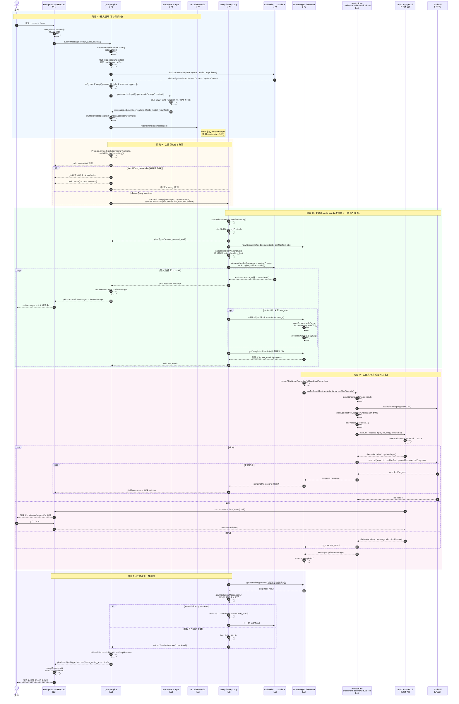
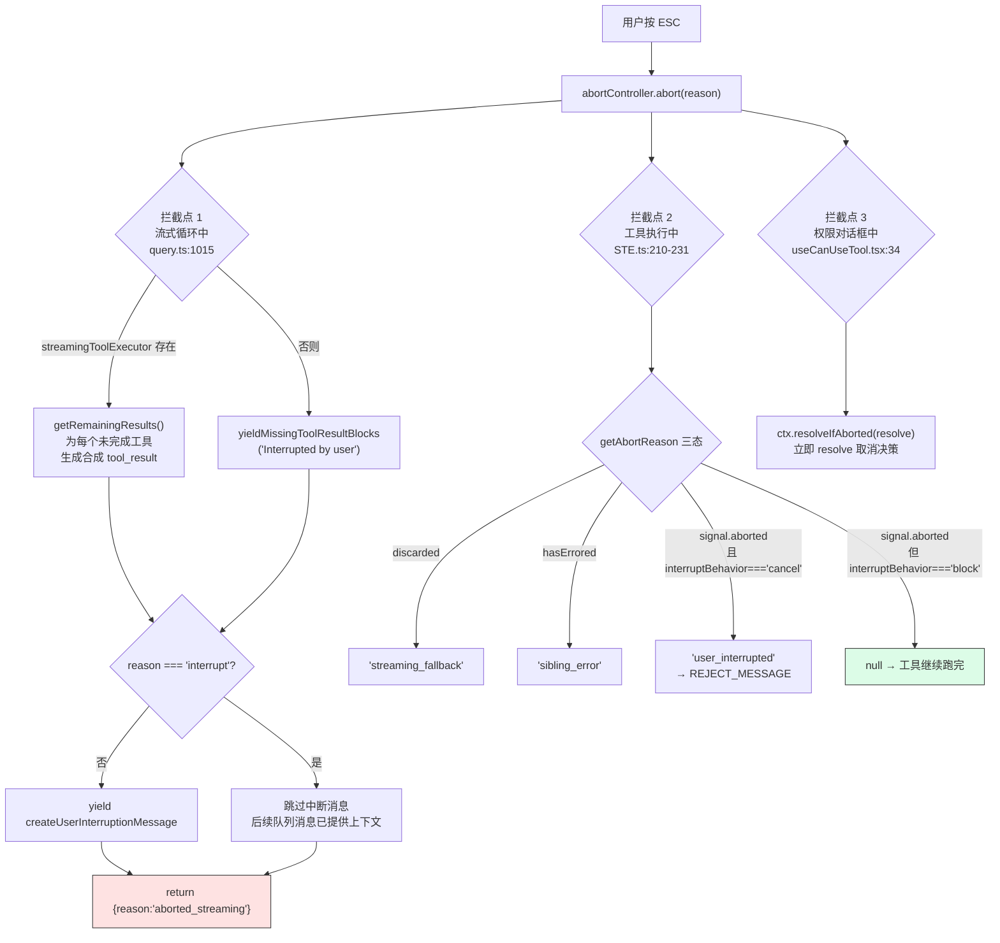

# 第 26 章 端到端数据流 —— 从一次按键到一次渲染

> 本章沿用 [第 25 章](./25-layered-arch.md) 建立的五层坐标系(L1 进程入口 / L2 交互传输 / L3 调度 / L4 合约 / L5 服务)。凡出现"调度层""合约层"等词,均指该章定义的分层。术语以 [`00-front/03-glossary.md`](../00-front/03-glossary.md) 为准。

---

## 摘要

Claude Code 的一次对话轮次(turn),本质是**一条穿越五层的单向数据管道,叠加一个内层的多轮反馈环**。用户按下 Enter 之后,输入先在 L3 被 `processUserInput` 展开为一组 `Message`,再由 `QueryEngine.submitMessage` 落盘、装配系统提示词、发射 `system/init`,然后交给 `query()` 进入 while 循环:调 API → 流式解析 → 边流边执行工具 → 把 `tool_result` 拼回消息数组 → 再调 API,直到模型不再请求工具。整条链路是**异步生成器的嵌套 `yield*`**,而不是回调或事件总线 —— 这个选择决定了中断、背压和错误传播的全部形态。

---

## 速赢

1. **整条主干是一串嵌套的 `AsyncGenerator`**:`REPL → QueryEngine.submitMessage → query → queryLoop → StreamingToolExecutor.getRemainingResults → runToolUse`。每一层都是 `async function*`,消费端 `for await` 拉取。**背压天然存在** —— 渲染慢了,生产就停。
2. **`shouldQuery` 是第一个岔路口**。`processUserInput` 返回 `shouldQuery: false` 时(纯本地 slash 命令),`submitMessage` 直接吐 `result` 并 `return`,**根本不进 `query()`**(`QueryEngine.ts:556-639`)。
3. **消息落盘发生在 API 调用之前**,不是之后。`recordTranscript` 在进入 query 循环前就写(`QueryEngine.ts:450-463`),否则用户发完立刻杀进程会导致 `--resume` 找不到会话。
4. **工具不等模型说完才跑**。`query.ts:841-843` 在流式解析出 `tool_use` 块的瞬间就 `addTool`,与后续 token 的生成**并发**。这是延迟优化的最大单点。
5. **失败路径不是异常,是数据**。中断、权限拒绝、模型回退都被转换成**合法的 `tool_result` 消息**塞回历史 —— 因为 Anthropic API 强制要求每个 `tool_use` 必须有配对的 `tool_result`,少一个就 400。

---

## 关键图:端到端序列图



**锚点对照表**(图中步骤 → 源码位置):

| 阶段 | 步骤 | 源码位置 |
|---|---|---|
| A | `useCanUseTool` 闭包创建 | `src/screens/REPL.tsx:2382` |
| A | `submitMessage` 入口 | `src/QueryEngine.ts:209` |
| A | `wrappedCanUseTool` 包装 | `src/QueryEngine.ts:244-271` |
| A | `fetchSystemPromptParts` | `src/QueryEngine.ts:288-300` |
| A | `asSystemPrompt` 拼装 | `src/QueryEngine.ts:321-325` |
| A | `processUserInput` 调用 | `src/QueryEngine.ts:410-428` |
| A | `recordTranscript` 前置落盘 | `src/QueryEngine.ts:450-463` |
| B | skills + plugins 并行加载 | `src/QueryEngine.ts:534-537` |
| B | `buildSystemInitMessage` | `src/QueryEngine.ts:540-551` |
| B | `shouldQuery === false` 短路 | `src/QueryEngine.ts:556-639` |
| B | 进入 `query()` | `src/QueryEngine.ts:675-686` |
| C | `queryLoop` 主循环 | `src/query.ts:241`、`307` |
| C | `StreamingToolExecutor` 构造 | `src/query.ts:561-568` |
| C | 阻塞上限检查 | `src/query.ts:637-647` |
| C | `deps.callModel` | `src/query.ts:659` |
| C | `addTool` 边流边投递 | `src/query.ts:837-844` |
| C | `getCompletedResults` 轮询 | `src/query.ts:847-862` |
| D | `runToolUse` | `src/services/tools/toolExecution.ts:337` |
| D | `checkPermissionsAndCallTool` | `src/services/tools/toolExecution.ts:599` |
| D | `useCanUseTool` 决策 | `src/hooks/useCanUseTool.tsx:28-183` |
| E | `getRemainingResults` 汇聚 | `src/query.ts:1380-1382` |
| E | 终态返回 | `src/query.ts:1264`、`1357` |
| E | 结果消息装配 | `src/QueryEngine.ts:1082-1155` |

---

## 消息类型:在管道里流动的到底是什么

`Message` 是一个判别联合(discriminated union),由 `src/types/message.js` 导出,在 `query.ts:30-39` 与 `QueryEngine.ts:42` 被导入。管道里流动的具体成员及其归属阶段:

| 成员 | 产生方 | 消费方 | 是否进 `mutableMessages` |
|---|---|---|---|
| `UserMessage` | `processUserInput` / 工具结果 | API、transcript、UI | ✓ |
| `AssistantMessage` | `callModel` 流式解析 | UI、transcript、下一轮 API | ✓ |
| `AttachmentMessage` | `getAttachmentMessages`、钩子 | API(转 user)、UI | ✓ |
| `ProgressMessage` | `Tool.call` 的 `onProgress` | 仅 UI | ✓(便于 resume 去重) |
| `SystemMessage` | `createSystemMessage`、compact 边界 | UI、transcript | 视 subtype 而定 |
| `TombstoneMessage` | 消息删除控制信号 | 被 `QueryEngine` 显式跳过 | ✗ |
| `StreamEvent` | `callModel` 原始 SSE 事件 | 用量累加、`includePartialMessages` | ✗ |
| `RequestStartEvent` | `query.ts:337` | 计时/埋点 | ✗ |
| `ToolUseSummaryMessage` | `generateToolUseSummary` | UI 折叠显示 | ✗ |

**注意两个"不进历史"的类别**:`StreamEvent` 只用于旁路(用量统计、partial 流),`TombstoneMessage` 在 `QueryEngine.ts:758-760` 被显式 `break` 掉。把它们当普通消息 push 进 `mutableMessages` 会污染下一轮 API 请求体。

`QueryEngine` 出口处会经 `normalizeMessage` 转成 **`SDKMessage`** —— 这是对外契约(NDJSON / SDK / bridge 三条 L2 路径共用),与内部 `Message` 是两套类型。

---

## 设计权衡

### 为什么是嵌套异步生成器,而不是事件总线?

管道有 6 层嵌套。用 `EventEmitter` 也能实现,但会丢掉三样东西:

1. **背压**。`for await` 天然是拉模型。Ink 渲染一帧要 ~16ms,如果 API 每 5ms 吐一个 chunk,事件总线会把队列堆到内存里;生成器则直接把生产端挂起在 `yield` 上。
2. **取消的结构化传播**。生成器的 `.return()` 会沿调用栈逐层触发 `finally`。`query.ts:301` 那句 `using pendingMemoryPrefetch = startRelevantMemoryPrefetch(...)` 靠的就是这个 —— `using` 声明在**所有**退出路径(正常返回、抛出、`.return()`)上都会 dispose。事件总线做不到,得手写清理。
3. **顺序保证**。`yield*` 委托保证了子生成器的所有产出严格插在父生成器的产出之间。UI 依赖这个顺序:`tool_use` 必须先于 `tool_result` 渲染。

代价是**栈深度和可调试性**:一个 `tool_result` 从 `Tool.call` 冒到 REPL 要穿 6 层 `yield`,断点调试极其痛苦。源码用大量 `queryCheckpoint()` / `headlessProfilerCheckpoint()` 打点弥补(`query.ts:339`、`560`、`580`、`652`、`658`、`864`)。

### 为什么不是 Redux?

有人会问:既然有 `AppState`,为什么消息流不走 store?

因为**消息流是无限的、有序的、且大部分不需要被订阅**。Redux 的 reducer 模型要求每次变更产生新的完整 state —— 一个 20 万 token 的会话,每来一个 SSE chunk 就复制一次消息数组,是 O(n²)。源码的做法相反:`mutableMessages` 是一个**显式可变数组**(`QueryEngine.ts:186`),直接 `push`;只有真正需要驱动重渲染的部分(`toolPermissionContext`、`isLoading`、`mcp`)才走 `AppState`。

这是有意的职责切分:**`AppState` 是通知通道,`mutableMessages` 是数据主干**。第 25 章 §4.4 已强调过这一点,本章给出了它的性能理由。

### 为什么不是 RxJS?

RxJS 的 `Observable` 是推模型,背压要靠 `Subject` + 缓冲策略手动补。而且工具执行是**有状态的并发调度**(见[第 28 章](./28-streaming.md)):哪些能并行、哪个错了要杀兄弟、中断时补什么合成结果 —— 这些用 operator 组合表达出来会比 `StreamingToolExecutor` 那 530 行命令式代码更难读。当控制流本身就是业务逻辑时,命令式往往更诚实。

### 为什么工具要"边流边执行"?

`query.ts:837-844` 在流式解析出 `tool_use` 的瞬间就投递给执行器,而不是等 `message_stop`。

**收益**:模型生成 3 个工具调用需要 ~2s,如果串行等待,总延迟 = 2s + 工具时间;边流边跑,第 1 个工具在模型还在生成第 2、3 个时就已经在读文件了。对 `Read` 这类 ~10ms 的工具收益不大,对 `Bash` / `WebFetch` 这类秒级工具收益显著。

**成本**:引入了三个必须处理的边界情况:
- 模型中途 400 了,已启动的工具怎么办? → `discard()` + 重建执行器(`query.ts:912-919`)
- 第 1 个工具错了,第 2、3 个还在跑? → `siblingAbortController`,且**只有 Bash 触发**(`StreamingToolExecutor.ts:359-363`)
- 用户此刻按 ESC? → `getAbortReason` 三态判定 + 合成错误结果(`StreamingToolExecutor.ts:210-231`)

这三条是[第 28 章](./28-streaming.md)的主题。

---

## 详细机制

### 1. 输入摄取:`processUserInput` 是个展开器,不是解析器

```ts
// src/QueryEngine.ts:410-428
const {
  messages: messagesFromUserInput,
  shouldQuery,
  allowedTools,
  model: modelFromUserInput,
  resultText,
} = await processUserInput({
  input: prompt,
  mode: 'prompt',
  setToolJSX: () => {},
  context: { ...processUserInputContext, messages: this.mutableMessages },
  messages: this.mutableMessages,
  uuid: options?.uuid,
  isMeta: options?.isMeta,
  querySource: 'sdk',
})
```

一句 `submitMessage("/review src/foo.ts")` 可能展开成 5 条消息:一条 `UserMessage`(原始输入)、一条 `AttachmentMessage`(文件内容)、一条 `SystemMessage`(命令元数据)……返回值里的 4 个字段全都影响后续:

- `shouldQuery` → 决定是否进 `query()`
- `allowedTools` → 写回 `AppState.toolPermissionContext.alwaysAllowRules.command`(`QueryEngine.ts:477-486`)
- `model` → 覆盖本轮 `mainLoopModel`(`QueryEngine.ts:488`)
- `resultText` → 本地命令的输出文本,直接进 `result` 消息

**反例**:见过有人在 `submitMessage` 外面自己判断 `prompt.startsWith('/')` 来决定要不要调 API。这会漏掉 skill 触发、`@` 文件引用、队列命令注入等一堆展开逻辑 —— 判定权在 `shouldQuery`,不在调用方。

### 2. 落盘时机:为什么 transcript 写在 API 之前

```ts
// src/QueryEngine.ts:450-463
if (persistSession && messagesFromUserInput.length > 0) {
  const transcriptPromise = recordTranscript(messages)
  if (isBareMode()) {
    void transcriptPromise
  } else {
    await transcriptPromise
    // ...EAGER_FLUSH / IS_COWORK 时额外 flushSessionStorage()
  }
}
```

注释里给了完整理由:`for await` 循环只在 `ask()` yield 出 assistant/user/compact_boundary 时才调 `recordTranscript` —— 而那要等 API 响应。如果进程在响应前被杀(cowork 里用户点 Stop),transcript 里就只剩队列操作记录,`getLastSessionLog` 会把它们过滤光、返回 `null`,`--resume` 报 "No conversation found"。

`--bare` 走 fire-and-forget:脚本化调用不会 resume,而这个 `await` 是"模块求值之后最大的可控关键路径开销"(SSD 上 ~4ms,磁盘争用时 ~30ms)。

### 3. 主循环状态:9 个字段的显式 `State`

```ts
// src/query.ts:204-217
type State = {
  messages: Message[]
  toolUseContext: ToolUseContext
  autoCompactTracking: AutoCompactTrackingState | undefined
  maxOutputTokensRecoveryCount: number
  hasAttemptedReactiveCompact: boolean
  maxOutputTokensOverride: number | undefined
  pendingToolUseSummary: Promise<ToolUseSummaryMessage | null> | undefined
  stopHookActive: boolean | undefined
  turnCount: number
  transition: Continue | undefined
}
```

注释解释了这个结构的存在理由:循环体在顶部一次性解构,读取时保持裸名(`messages`、`toolUseContext`);而 7 个 `continue` 站点写 `state = { ... }` 整体替换,**而不是 9 次独立赋值**。这把"哪些字段跨迭代存活"变成了类型系统能检查的事 —— 漏赋一个字段就是编译错误。

`transition` 字段专门记录"上一轮为什么继续",让测试能断言恢复路径确实触发过,而不必去 diff 消息内容。

### 4. 渲染回程:`normalizeMessage` 是内外类型的闸门

```ts
// src/QueryEngine.ts:761-787(节选)
case 'assistant':
  if (message.message.stop_reason != null) {
    lastStopReason = message.message.stop_reason
  }
  this.mutableMessages.push(message)
  yield* normalizeMessage(message)
  break
case 'progress':
  this.mutableMessages.push(message)
  if (persistSession) {
    messages.push(message)
    void recordTranscript(messages)
  }
  yield* normalizeMessage(message)
  break
```

注意 `assistant` 分支的 `stop_reason` 捕获:流式响应在 `content_block_stop` 时 yield 的 assistant 消息里 `stop_reason` 是 `null`,真值要等 `message_delta`(`QueryEngine.ts:806-808`)。所以这里是 `!= null` 才覆盖 —— 只有合成消息才会在这个时点带值。

用量累加也分三段(`QueryEngine.ts:788-816`):`message_start` 重置 `currentMessageUsage`、`message_delta` 累加、`message_stop` 才并入 `totalUsage`。

---

## 失败路径

管道的健壮性全在这四条分支上。**共同原则:失败被降级为数据,而不是异常。**

### 路径 1:用户中断(ESC / Ctrl+C)



关键细节:**`interrupt` 与其他 abort 原因被区别对待**。`query.ts:1046` 和 `1501` 两处都判断 `signal.reason !== 'interrupt'` 才 yield 中断消息 —— 因为 `interrupt` 表示"用户在工具跑的时候又发了条新消息",紧随其后的队列消息本身就说明了上下文,再插一条 "Interrupted by user" 是噪音。

而 `interruptBehavior` 让工具能拒绝被中断(`StreamingToolExecutor.ts:233-241`,默认 `'block'`)。语义是:新消息进来时,`'cancel'` 类工具丢弃结果,`'block'` 类工具跑完、新消息排队等。

### 路径 2:权限拒绝

拒绝**不抛异常**。`useCanUseTool` 返回 `{behavior: 'deny', message, decisionReason}`,`checkPermissionsAndCallTool` 把它转成 `is_error: true` 的 `tool_result`(`toolExecution.ts:995` 起)塞回消息流。模型看到错误结果,自己决定换个方式还是放弃。

同时 `QueryEngine` 的 `wrappedCanUseTool` 会记账:

```ts
// src/QueryEngine.ts:262-268
if (result.behavior !== 'allow') {
  this.permissionDenials.push({
    tool_name: sdkCompatToolName(tool.name),
    tool_use_id: toolUseID,
    tool_input: input,
  })
}
```

这份 `permissionDenials` 最终出现在 `result` 消息里(`QueryEngine.ts:1148`),供 SDK 调用方审计。**注意判定是 `!== 'allow'`** —— `ask` 超时、`deny`、取消都算进去。

### 路径 3:模型回退(FallbackTriggeredError)

```ts
// src/query.ts:894-919(节选)
if (innerError instanceof FallbackTriggeredError && fallbackModel) {
  currentModel = fallbackModel
  attemptWithFallback = true

  yield* yieldMissingToolResultBlocks(assistantMessages, 'Model fallback triggered')
  assistantMessages.length = 0
  toolResults.length = 0
  toolUseBlocks.length = 0
  needsFollowUp = false

  if (streamingToolExecutor) {
    streamingToolExecutor.discard()
    streamingToolExecutor = new StreamingToolExecutor(
      toolUseContext.options.tools, canUseTool, toolUseContext,
    )
  }
  // ...
  continue
}
```

这是**唯一会清空已积累 assistant 消息**的路径。四个数组全清、执行器丢弃重建 —— 因为重试是整个请求级别的,旧的 `tool_use_id` 如果泄漏到重试里,会产生孤儿 `tool_result`,API 直接 400。

`attemptWithFallback` 是 `while` 循环的开关(`query.ts:650-654`),只允许回退一次:进循环立刻置 `false`,只有回退分支重新置 `true`。

对 ant 用户还额外做了一步(`query.ts:927-929`):`stripSignatureBlocks` —— thinking 签名是模型绑定的,把受保护模型的 thinking 块回放给非受保护的 fallback 会 400。

### 路径 4:API 错误与上下文溢出

```mermaid
%% 图 3:queryLoop 的 10 个终态与 7 个续跑理由
flowchart LR
    subgraph TERM["Terminal:结束本轮"]
        direction TB
        t1["blocking_limit<br/>query.ts:646"]
        t2["image_error<br/>:977"]
        t3["model_error<br/>:996"]
        t4["aborted_streaming<br/>:1051"]
        t5["prompt_too_long<br/>:1182"]
        t6["completed<br/>:1264 / :1357"]
        t7["stop_hook_prevented<br/>:1279"]
        t8["aborted_tools<br/>:1515"]
        t9["hook_stopped<br/>:1520"]
        t10["max_turns<br/>:1711"]
    end

    subgraph CONT["Continue:再跑一次迭代"]
        direction TB
        c1["collapse_drain_retry<br/>:1110"]
        c2["reactive_compact_retry<br/>:1162"]
        c3["max_output_tokens_escalate<br/>:1217"]
        c4["max_output_tokens_recovery<br/>:1246"]
        c5["stop_hook_blocking<br/>:1302"]
        c6["token_budget_continuation<br/>:1338"]
        c7["next_turn<br/>:1725"]
    end

    LOOP(("while true<br/>query.ts:307")) --> TERM
    LOOP --> CONT
    CONT -.state = next; continue.-> LOOP

    style TERM fill:#fee2e2,stroke:#333
    style CONT fill:#dcfce7,stroke:#333
```



上下文溢出走的是 `collapse_drain_retry → reactive_compact_retry` 两级递进(`query.ts:1085-1182`):先尝试排空已暂存的 context-collapse(便宜,保留粒度),不够再做 reactive compact(整段摘要)。两者各只试一次,再失败就 `return {reason:'prompt_too_long'}`。

---

## 反模式

**❶ 在 `for await (const message of query(...))` 里 `await` 慢操作**

生成器是拉模型,消费端阻塞 = 生产端阻塞 = API 连接空转。`QueryEngine.ts:717-732` 专门为此把 assistant 消息的 `recordTranscript` 改成了 `void`(fire-and-forget):

> 注释原文:`claude.ts` 每个 content block yield 一条 assistant 消息,然后在 `message_delta` 上修改最后一条的 `usage`/`stop_reason`……在这里 `await` 会阻塞 `ask()` 的生成器,导致 `message_delta` 在所有块被消费完之前无法运行;而排空定时器(从第 1 块就启动)会先到期。

`enqueueWrite` 本身是保序的,所以 fire-and-forget 是安全的。**但这个结论依赖写队列的保序保证** —— 换成裸 `fs.writeFile` 就会乱序。

**❷ 把 `StreamEvent` 或 `TombstoneMessage` push 进 `mutableMessages`**

`StreamEvent` 是原始 SSE 事件(用于用量统计和 `includePartialMessages` 透传),`TombstoneMessage` 是删除控制信号。两者都不是对话内容。push 进去下一轮请求体就会带上非法块,API 400。`QueryEngine.ts:758-760` 的 `case 'tombstone': break` 就是这道闸。

**❸ 假设 `assistant` 消息一定带 `stop_reason`**

流式路径下 `content_block_stop` 时 yield 的 assistant 消息 `stop_reason` 恒为 `null`。想拿真值必须监听 `message_delta`(`QueryEngine.ts:797-808`)。直接读 `lastMessage.message.stop_reason` 会永远拿到 `null`,导致 `isResultSuccessful` 误判为失败,最终吐出 `error_during_execution`。

**❹ 在 L3 直接调 React `setState`**

`QueryEngine` 拿到的是 `getAppState` / `setAppState` 两个**函数**(`QueryEngine.ts:137-138`),不是 hook。这保证了同一个 `QueryEngine` 能被 REPL(真 React)、`print.ts`(假 store)、`bridgeMain`(远端 store)三条 L2 路径复用。直接 `import { useAppState }` 会把 L3 钉死在 React 上,headless 路径立刻炸。

**❺ 绕过 `wrappedCanUseTool` 直接传 `config.canUseTool` 给 `query()`**

会丢掉 `permissionDenials` 记账。SDK 调用方的审计字段就永远是空数组。包装层只有 28 行(`QueryEngine.ts:244-271`),但它是唯一的记账点。

---

## 引用

**前置**
- [`00-front/03-glossary.md`](../00-front/03-glossary.md) —— B.1 `QueryEngine`、B.3 `submitMessage`、B.5 `query()/queryLoop()`、B.6 `StreamingToolExecutor`、B.7 `processUserInput`、G.1 `Message`、G.3 `SDKMessage`
- [`04-architect/25-layered-arch.md`](./25-layered-arch.md) —— 五层坐标系;§7.1 序列 A 是本章图 1 的简化版

**平行**
- [`04-architect/27-query-engine.md`](./27-query-engine.md) —— 本章阶段 A/B 的状态机展开
- [`04-architect/28-streaming.md`](./28-streaming.md) —— 本章阶段 D 的并发模型展开
- [`04-architect/29-permission.md`](./29-permission.md) —— 本章阶段 D 中 `canUseTool` 那一步的五阶段展开

**后继**
- `04-architect/30-*` —— 上下文压缩与记忆子系统(本章图 3 中 `collapse_drain_retry` / `reactive_compact_retry` 的机制)

**源码定位**

| 关注点 | 路径:行号 |
|---|---|
| `submitMessage` 入口 | `src/QueryEngine.ts:209` |
| `wrappedCanUseTool` 记账 | `src/QueryEngine.ts:244-271` |
| transcript 前置落盘 | `src/QueryEngine.ts:450-463` |
| `shouldQuery` 短路分支 | `src/QueryEngine.ts:556-639` |
| 消息 switch 与用量累加 | `src/QueryEngine.ts:757-828` |
| `queryLoop` 主循环 | `src/query.ts:241`、`307` |
| `State` 类型定义 | `src/query.ts:204-217` |
| 边流边执行工具 | `src/query.ts:837-844` |
| 模型回退处理 | `src/query.ts:893-951` |
| 中断时补齐 tool_result | `src/query.ts:1015-1052` |
| 工具汇聚点(两种执行器) | `src/query.ts:1380-1382` |
| `processUserInput` 签名 | `src/utils/processUserInput/processUserInput.ts:85-140` |
| `runToolUse` | `src/services/tools/toolExecution.ts:337` |
| REPL 的 `canUseTool` 闭包 | `src/screens/REPL.tsx:2382` |
