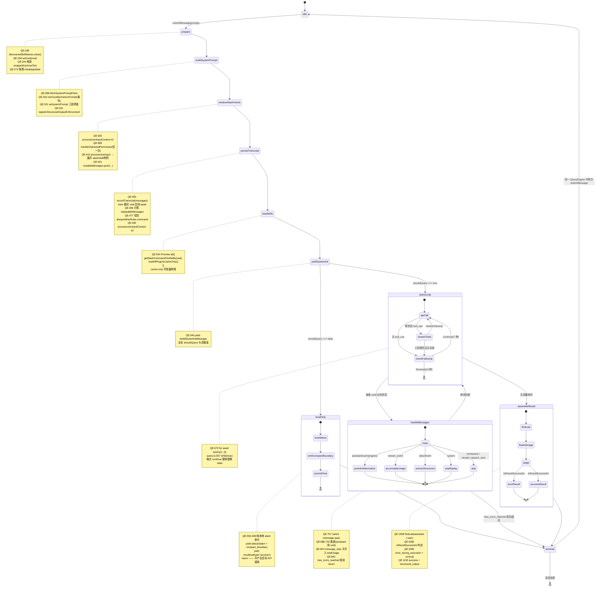

# 第 27 章 QueryEngine —— 会话生命周期与轮次状态机

> 本章沿用 [第 25 章](./25-layered-arch.md) 的五层坐标系。`QueryEngine` 位于 **L3 调度层**,是 L2 三条交互路径(REPL / headless / bridge)**唯一**的收敛点。本章聚焦"一次 `submitMessage` 内部走了哪些状态",[第 26 章](./26-data-flow.md)聚焦"数据在层间怎么流"。

---

## 摘要

`QueryEngine` 是**会话级**对象:一个对话一个实例,`mutableMessages`、`readFileState`、`totalUsage`、`permissionDenials` 跨轮次存活。`submitMessage()` 是**轮次级**异步生成器:每次调用推进一个 turn。它把 1295 行代码压缩成一条线性状态链 —— 解析输入 → 落盘 → 加载技能插件 → 发 `system/init` → 分流 → 进 `query()` 循环 → 消息路由 → 装配结果。真正的复杂度不在这条链上,而在**三个分流点**(`shouldQuery`、`isResultSuccessful`、`max_turns`)和**一个下沉的 while 循环**(`queryLoop`,7 种续跑理由 × 10 种终态)。

---

## 速赢

1. **`QueryEngine` 一个会话一个,`submitMessage` 一次轮次一次**。状态跨轮次持久,这是它和裸 `query()` 的唯一区别 —— `ask()`(`QueryEngine.ts:1186`)只是一次性包装。
2. **`processUserInputContext` 被构造了两次**(`:335` 和 `:492`),不是重复代码。第一次给 `processUserInput` 用(带可写 `setMessages`),第二次给 `query()` 用(`setMessages` 变成 no-op,`model` 已被 slash 命令更新)。
3. **`system/init` 消息在 `shouldQuery` 判定之前发**(`:540-551`)。即使输入是纯本地命令、根本不调 API,SDK 调用方也一定能收到一条 init。
4. **`queryLoop` 的每次 `continue` 都整体替换 `state` 对象**,不做 9 次独立赋值。漏一个字段就是编译错误 —— 用类型系统兜住了跨迭代状态的完整性。
5. **`totalUsage` 只在 `message_stop` 时累加**(`:810-816`)。中途读到的 `currentMessageUsage` 是单条消息的,不是累计的。

---

## `QueryEngine` 字段表

```ts
// src/QueryEngine.ts:184-207
export class QueryEngine {
  private config: QueryEngineConfig
  private mutableMessages: Message[]
  private abortController: AbortController
  private permissionDenials: SDKPermissionDenial[]
  private totalUsage: NonNullableUsage
  private hasHandledOrphanedPermission = false
  private readFileState: FileStateCache
  private discoveredSkillNames = new Set<string>()
  private loadedNestedMemoryPaths = new Set<string>()

  constructor(config: QueryEngineConfig) {
    this.config = config
    this.mutableMessages = config.initialMessages ?? []
    this.abortController = config.abortController ?? createAbortController()
    this.permissionDenials = []
    this.readFileState = config.readFileCache
    this.totalUsage = EMPTY_USAGE
  }
```

| 字段 | 生命周期 | 谁写 | 谁读 | 为什么在这一层 |
|---|---|---|---|---|
| `config` | 会话 | 构造器 / `setModel()` | `submitMessage` 开头解构 | 不可变配置 + 一个可变逃逸口(`userSpecifiedModel`) |
| `mutableMessages` | **会话** | `:431` push 用户输入;`:768/772/785/830` push 各类消息 | 下一轮 `submitMessage` 的起点 | 对话历史必须跨轮次;显式可变数组避免 O(n²) 复制 |
| `abortController` | 会话 | `interrupt()`(`:1158`) | 传给 `processUserInputContext.abortController` | 一个会话一个中断信号,子工具从它派生 child |
| `permissionDenials` | **会话** | `wrappedCanUseTool`(`:263`) | `result` 消息的 `permission_denials`(`:1148`) | SDK 审计字段,跨轮次累积 |
| `totalUsage` | **会话** | `message_stop` 时 `accumulateUsage`(`:812`) | `result.usage` | 会话总账;单条消息用量在局部 `currentMessageUsage` |
| `hasHandledOrphanedPermission` | 会话 | `:399` 置 true | `:398` 守卫 | 孤儿权限只处理一次,不是每轮 |
| `readFileState` | **会话** | 工具执行时更新 | 记忆预取去重(`query.ts:1606`)、文件状态校验 | 跨轮次的"模型读过哪些文件" |
| `discoveredSkillNames` | **轮次** | `processUserInput` 内部 | 埋点 `was_discovered` | `:238` 每轮清空 —— 注释明确写了防止 SDK 模式无界增长 |
| `loadedNestedMemoryPaths` | 会话 | 附件加载器 | 避免重复注入嵌套 CLAUDE.md | 跨轮次去重 |

**关键对比**:`discoveredSkillNames` 是唯一每轮 `clear()` 的字段。原因写在 `:194-196` 的注释里 —— 它必须跨越 `submitMessage` 内部两次 `processUserInputContext` 重建而存活,但不能跨轮次累积。

### `QueryEngineConfig` 的三类字段

`QueryEngine.ts:130-173` 定义了 27 个配置字段,可以分三类:

| 类别 | 字段 | 说明 |
|---|---|---|
| **能力注入** | `tools`、`commands`、`mcpClients`、`agents`、`canUseTool` | L2 决定"这个会话能用什么" |
| **状态桥接** | `getAppState`、`setAppState`、`readFileCache`、`abortController`、`setSDKStatus` | 函数而非 hook —— 让 L3 与 React 解耦 |
| **策略参数** | `customSystemPrompt`、`fallbackModel`、`maxTurns`、`maxBudgetUsd`、`jsonSchema`、`thinkingConfig` | 单轮/会话行为调节 |

其中 `snipReplay`(`:169-172`)最值得注意:它是一个**注入的回调**,而不是直接 `import`。注释解释了原因 —— `HISTORY_SNIP` 是 feature-gated 特性,把带特性字符串的判断留在 `ask()` 里注入,能让 `QueryEngine` 本身不含被排除的字符串,从而在 `feature()` 返回 false 的 bun test 环境下仍可测试。这是 [`01-foundation/03-feature-flags.md`](../01-foundation/03-feature-flags.md) 讲的死代码消除机制在类设计上的一次投影。

---

## 关键图:`submitMessage` 轮次状态机



---

## 三个决策点

### 决策点 1:是否进 query loop —— `shouldQuery`

```ts
// src/QueryEngine.ts:556
if (!shouldQuery) {
  for (const msg of messagesFromUserInput) {
    // 只 yield 带 LOCAL_COMMAND_STDOUT_TAG / STDERR_TAG 的内容
    // 以及 compact_boundary
  }
  if (persistSession) { await recordTranscript(messages) /* ... */ }
  yield { type: 'result', subtype: 'success', /* ... */ }
  return
}
```

`shouldQuery` 由 `processUserInput` 返回(`:412`)。`false` 意味着输入被完全消费在本地 —— `/help`、`/clear`、`/config` 之类。

三个设计细节值得注意:

1. **仍然发 `system/init`**。init 消息在 `:540` 发出,在 `:556` 判定之前。SDK 调用方可以无条件等这条消息,不必区分命令类型。
2. **用 `messagesFromUserInput` 而不是 `replayableMessages`**。注释(`:557-559`)说明:`selectableUserMessagesFilter` 会排除 `local-command-stdout` 标签,所以命令输出必须走未过滤的数组。
3. **`num_turns: messages.length - 1`**(`:624`)。本地命令路径没有真实轮次概念,用消息数减一近似。

### 决策点 2:是否需要压缩 —— 下沉到 `queryLoop`

压缩**不在 `QueryEngine` 里判定**。`submitMessage` 只负责在 `query()` yield 出 `compact_boundary` 系统消息时做特殊落盘处理:

```ts
// src/QueryEngine.ts:701-715
if (persistSession && message.type === 'system' && message.subtype === 'compact_boundary') {
  const tailUuid = message.compactMetadata?.preservedSegment?.tailUuid
  if (tailUuid) {
    const tailIdx = this.mutableMessages.findLastIndex(m => m.uuid === tailUuid)
    if (tailIdx !== -1) {
      await recordTranscript(this.mutableMessages.slice(0, tailIdx + 1))
    }
  }
}
```

注释解释得很清楚:写 compact 边界之前,必须把内存里还没落盘的消息 flush 到 `preservedSegment` 的尾部。否则 SDK 子进程重启时(claude-desktop 在轮次间杀进程),`tailUuid` 指向一条从未写入的消息,`applyPreservedSegmentRelinks` 的 tail→head 遍历失败、直接返回不裁剪,resume 时就会加载**完整的压缩前历史** —— 压缩白做了。

真正的压缩判定在 `queryLoop` 里,是三级递进(`query.ts:1085-1182`):

| 级别 | 触发条件 | 动作 | 续跑理由 |
|---|---|---|---|
| 预防性阻断 | `isAtBlockingLimit` 且未开启自动压缩 | 直接吐 `PROMPT_TOO_LONG` 并返回 | `blocking_limit`(终态) |
| context-collapse 排空 | 收到被withhold 的 413 | `recoverFromOverflow` 提交暂存折叠 | `collapse_drain_retry` |
| reactive compact | collapse 不够 / 媒体超限 | `tryReactiveCompact` 生成摘要 | `reactive_compact_retry` |

前两级各只试一次(靠 `state.transition?.reason` 和 `hasAttemptedReactiveCompact` 守卫),都失败则 `return {reason: 'prompt_too_long'}`。

### 决策点 3:是否触发回退模型 —— `FallbackTriggeredError`

同样在 `queryLoop`(`query.ts:893-951`)。`QueryEngine` 的贡献只有一处:把 `config.fallbackModel` 透传给 `query()`(`:682`)。

回退的关键在于**它是请求级重试,不是消息级**:

```ts
// src/query.ts:650-655
let attemptWithFallback = true
try {
  while (attemptWithFallback) {
    attemptWithFallback = false   // 进来立刻关闭
    try {
      // ... callModel ...
```

`attemptWithFallback` 只在捕获到 `FallbackTriggeredError` 且 `fallbackModel` 存在时才重新置 `true`(`:897`),所以最多回退一次。回退时清空 `assistantMessages` / `toolResults` / `toolUseBlocks` 三个数组并 `discard()` 重建执行器 —— 这是[第 26 章](./26-data-flow.md)"失败路径 3"讲的内容。

---

## 设计权衡

### 为什么 `submitMessage` 是生成器而不是返回 Promise?

如果签名是 `async submitMessage(prompt): Promise<Result>`,消费方就拿不到中间态。而 REPL 必须在模型逐 token 生成时就渲染、必须在工具跑到一半时显示进度。

生成器让**同一段代码同时服务三种消费者**:
- REPL:`for await` + `setMessages` → Ink 增量渲染
- headless:`for await` + `stdout.write(JSON.stringify(msg))` → NDJSON 流
- bridge:`for await` + WebSocket 帧

三者的差异只在 `for await` 循环体里,而不在 `QueryEngine` 内部。这是 L2/L3 边界能收敛到一个点的根本原因。

### 为什么状态放在类字段上,而不是闭包?

`ask()`(`:1186`)是 `submitMessage` 的一次性包装,内部就是 `new QueryEngine(config).submitMessage(prompt)`。既然有这个包装,为什么不把 `QueryEngine` 整个写成闭包工厂?

因为 REPL 需要**在轮次之间访问会话状态**:

```ts
// src/QueryEngine.ts:1158-1176
interrupt(): void { this.abortController.abort() }
getMessages(): readonly Message[] { return this.mutableMessages }
getReadFileState(): FileStateCache { return this.readFileState }
getSessionId(): string { return getSessionId() }
setModel(model: string): void { this.config.userSpecifiedModel = model }
```

`interrupt()` 必须在 `submitMessage` 生成器**正在被消费时**从外部调用 —— 闭包做不到(生成器执行期间无法从外部访问它的局部变量)。`setModel()` 同理:用户在轮次之间敲 `/model opus`,下一轮必须生效。

`getMessages()` 返回 `readonly Message[]` 而不是拷贝,是有意的:5000 条消息的会话,每次读都拷贝一遍不可接受。`readonly` 只是类型层面的意图声明,运行时仍是同一个数组 —— **调用方 push 进去会直接污染引擎状态**。这是个真实的脚枪,后文反模式会展开。

### 为什么不是有限状态机库(XState 之类)?

`submitMessage` 的外层是**线性的**:prepare → buildSystemPrompt → resolveAttachments → persistTranscript → loadSkills → yieldSystemInit → 分流。只有两个分支(`shouldQuery`、`isResultSuccessful`),没有回边。线性流程用 FSM 库表达纯属负担。

真正有环的是 `queryLoop`,而它的环有 7 种进入方式、10 种退出方式(见[第 26 章](./26-data-flow.md)图 3)。这个规模确实到了 FSM 库的甜区,但源码选择了**显式 `State` 对象 + `while(true)` + 整体替换**:

```ts
// src/query.ts:1099-1115(collapse_drain_retry 站点,7 个 continue 之一)
const next: State = {
  messages: drained.messages,
  toolUseContext,
  autoCompactTracking: tracking,
  maxOutputTokensRecoveryCount,
  hasAttemptedReactiveCompact,
  maxOutputTokensOverride: undefined,
  pendingToolUseSummary: undefined,
  stopHookActive: undefined,
  turnCount,
  transition: { reason: 'collapse_drain_retry', committed: drained.committed },
}
state = next
continue
```

理由写在 `query.ts:265-267` 的注释里:循环体顶部一次性解构,让读取保持裸名;continue 站点写 `state = {...}` 而不是 9 次独立赋值 —— **漏一个字段就是 TS 编译错误**。FSM 库的 context 更新通常是 partial merge,反而丢掉了这个保证。

### 为什么 `processUserInputContext` 要构造两次?

```ts
// #1: src/QueryEngine.ts:335-395
let processUserInputContext: ProcessUserInputContext = {
  messages: this.mutableMessages,
  setMessages: fn => { this.mutableMessages = fn(this.mutableMessages) },
  // ... options.mainLoopModel = initialMainLoopModel
}

// #2: src/QueryEngine.ts:492-527
processUserInputContext = {
  messages,                    // 已 push 用户输入后的快照
  setMessages: () => {},       // no-op
  // ... options.mainLoopModel = mainLoopModel(可能被 /model 改过)
}
```

第一次的 `setMessages` 必须可写:注释(`:337-343`)说明 `/force-snip` 这类会改消息数组的 slash 命令会调 `setMessages(fn)`;交互模式下这写回 `AppState`,print 模式下必须写回 `mutableMessages`,否则后续的 push(`:431`)和快照(`:434`)看不到结果。

第二次改成 no-op,因为过了 slash 命令处理点之后**再没有任何东西调 `setMessages`**。留着可写反而是隐患 —— 一个失控的工具改了消息数组,`messages` 快照和 `mutableMessages` 就分叉了。

同时第二次要吃进 `modelFromUserInput`(`:488`):`/model sonnet` 这类命令改的模型必须在本轮生效。

---

## 详细机制

### `wrappedCanUseTool`:28 行的记账层

```ts
// src/QueryEngine.ts:244-271
const wrappedCanUseTool: CanUseToolFn = async (
  tool, input, toolUseContext, assistantMessage, toolUseID, forceDecision,
) => {
  const result = await canUseTool(
    tool, input, toolUseContext, assistantMessage, toolUseID, forceDecision,
  )
  if (result.behavior !== 'allow') {
    this.permissionDenials.push({
      tool_name: sdkCompatToolName(tool.name),
      tool_use_id: toolUseID,
      tool_input: input,
    })
  }
  return result
}
```

三个要点:

- **纯透传 + 副作用**。它不改决策,只记账。判定逻辑全在 [第 29 章](./29-permission.md) 讲的五阶段链里。
- **`!== 'allow'` 而非 `=== 'deny'`**。取消(`cancelAndAbort`)、ask 超时也算拒绝 —— 从审计视角看,"工具没跑成"就是一次拒绝。
- **`sdkCompatToolName`**。内部工具名(如 `mcp__server__tool`)要转成 SDK 对外的稳定名。这是 L3 唯一做名字转换的地方。

### 结果判定:`isResultSuccessful` 与诊断前缀

```ts
// src/QueryEngine.ts:1058-1068
const result = messages.findLast(m => m.type === 'assistant' || m.type === 'user')
const edeResultType = result?.type ?? 'undefined'
const edeLastContentType =
  result?.type === 'assistant' ? (last(result.message.content)?.type ?? 'none') : 'n/a'
```

`findLast` 只找 assistant 或 user。注释(`:1051-1057`)解释了为什么不能直接 `last(messages)`:stop hooks 会在 assistant 响应**之后**yield progress/attachment 消息,而这些消息自 #23537 起被 inline push 进 `messages`。直接取最后一条会拿到 progress,导致文本提取返回空串,`-p` 模式吐一个空行。

判定失败时,`errors[]` 数组的第一项是一条**诊断前缀**:

```ts
`[ede_diagnostic] result_type=${edeResultType} last_content_type=${edeLastContentType} stop_reason=${lastStopReason}`
```

这三个字段正是 `isResultSuccessful` 检查的东西 —— 直接把判定依据打进错误里,而不是让人去猜。

`errorLogWatermark`(`:669`)也值得一提:它是**引用型水位线**而非索引。注释说明索引会在 100 条环形缓冲区 `shift()` 时滑动;引用则在被轮转掉时 `lastIndexOf` 返回 -1,回退到"包含全部"这个安全默认。

### 用量累加的三段式

```ts
// src/QueryEngine.ts:788-816(节选)
case 'stream_event':
  if (message.event.type === 'message_start') {
    currentMessageUsage = EMPTY_USAGE
    currentMessageUsage = updateUsage(currentMessageUsage, message.event.message.usage)
  }
  if (message.event.type === 'message_delta') {
    currentMessageUsage = updateUsage(currentMessageUsage, message.event.usage)
    if (message.event.delta.stop_reason != null) {
      lastStopReason = message.event.delta.stop_reason
    }
  }
  if (message.event.type === 'message_stop') {
    this.totalUsage = accumulateUsage(this.totalUsage, currentMessageUsage)
  }
```

`updateUsage` 是**覆盖式**(API 给的是该消息的累计值),`accumulateUsage` 是**加法式**(跨消息求和)。混用这两个函数会让计费翻倍或归零。

`stop_reason` 的捕获也在这里 —— 注释(`:802-805`)指出 assistant 消息在 `content_block_stop` 时 yield,那时 `stop_reason` 是 `null`,真值只在 `message_delta` 到达。不接这一路,`result.stop_reason` 永远是 `null`。

---

## 反模式

**❶ 每轮 `new QueryEngine(...)`**

会丢掉 `mutableMessages`、`totalUsage`、`readFileState`、`permissionDenials` —— 也就是丢掉整个会话。模型看不到上一轮说了什么,用量统计每轮归零,记忆预取的去重失效。

正确做法:一个会话一个实例,反复调 `submitMessage`。想要一次性语义就用 `ask()`(`:1186`),它内部替你建了个用完即弃的引擎。

**❷ 对 `getMessages()` 的返回值做 push**

```ts
// ✗ 危险
const msgs = engine.getMessages()
;(msgs as Message[]).push(myMessage)   // 直接污染 mutableMessages
```

`getMessages()` 返回的是 `this.mutableMessages` **本体**,`readonly` 只是类型标注。要修改历史必须走 `submitMessage` 或 slash 命令路径 —— 那里有落盘、去重、compact 边界维护。绕过去的结果是 transcript 和内存状态分叉,resume 时炸。

**❸ 在 `submitMessage` 生成器耗尽前假设 `totalUsage` 已终结**

`totalUsage` 直到最后一条 `message_stop` 才完整。中途读到的是部分累计。想拿最终值,读 `result` 消息的 `usage` 字段。

**❹ 把 `abortController` 当成"取消这次工具"的开关**

`this.abortController` 是**会话级**的。abort 它会终止整个 turn,不是某个工具。工具级取消要用 `StreamingToolExecutor` 派生的 child controller(见[第 28 章](./28-streaming.md))。`interrupt()` 的语义就是"停掉当前轮次"。

**❺ 假设 `shouldQuery === false` 时不会有消息产出**

会有:本地命令的 stdout/stderr(`:560-596`)、compact 边界(`:597-605`)、以及 `system/init` 和 `result`。消费方如果只在 `shouldQuery` 路径下建立消息处理器,会漏掉这些。

**❻ 在 `QueryEngine` 里 `import { useAppState }`**

L3 通过 `getAppState` / `setAppState` **函数**与状态层通信(`:137-138`)。直接 import hook 会把 `QueryEngine` 钉死在 React 渲染树上,`runHeadless` 和 `bridgeMain` 两条路径立刻不可用 —— 它们根本没有 React 组件树。这是[第 25 章](./25-layered-arch.md) §4.4 "AppState 是通知通道不是依赖"在实现上的兑现。

---

## 引用

**前置**
- [`00-front/03-glossary.md`](../00-front/03-glossary.md) —— B.1 `QueryEngine`、B.3 `submitMessage`、B.5 `query()/queryLoop()`、B.7 `processUserInput`、B.8 `fetchSystemPromptParts`、B.10 `recordTranscript`、C.5 `transcript`
- [`04-architect/25-layered-arch.md`](./25-layered-arch.md) —— L3 调度层定位;§9 关键源码速查表
- [`04-architect/26-data-flow.md`](./26-data-flow.md) —— 本章状态机在端到端管道中的位置

**平行**
- [`04-architect/28-streaming.md`](./28-streaming.md) —— `queryLoop` 内 `streamTools` 状态的展开
- [`04-architect/29-permission.md`](./29-permission.md) —— `wrappedCanUseTool` 包裹的那个 `canUseTool` 内部
- [`01-foundation/03-feature-flags.md`](../01-foundation/03-feature-flags.md) —— `HISTORY_SNIP`、`COORDINATOR_MODE` 等在 `QueryEngine.ts:110-128` 的条件 require

**后继**
- `04-architect/30-*` —— compact 子系统(本章决策点 2 的三级递进机制)

**源码定位**

| 关注点 | 路径:行号 |
|---|---|
| `QueryEngineConfig` 类型 | `src/QueryEngine.ts:130-173` |
| 类定义与字段 | `src/QueryEngine.ts:184-198` |
| 构造器 | `src/QueryEngine.ts:200-207` |
| `submitMessage` 入口 | `src/QueryEngine.ts:209` |
| `wrappedCanUseTool` | `src/QueryEngine.ts:244-271` |
| 系统提示词三段拼装 | `src/QueryEngine.ts:321-325` |
| `processUserInputContext` #1 | `src/QueryEngine.ts:335-395` |
| `processUserInput` 调用 | `src/QueryEngine.ts:410-428` |
| transcript 前置落盘 | `src/QueryEngine.ts:450-463` |
| `processUserInputContext` #2 | `src/QueryEngine.ts:492-527` |
| skills + plugins 并行加载 | `src/QueryEngine.ts:534-537` |
| `buildSystemInitMessage` | `src/QueryEngine.ts:540-551` |
| `shouldQuery === false` 分支 | `src/QueryEngine.ts:556-639` |
| 进入 `query()` | `src/QueryEngine.ts:675-686` |
| compact 边界落盘 | `src/QueryEngine.ts:701-715` |
| 消息路由 switch | `src/QueryEngine.ts:757-893` |
| 用量三段累加 | `src/QueryEngine.ts:788-816` |
| `max_turns_reached` 提前返回 | `src/QueryEngine.ts:842-874` |
| 结果判定与诊断 | `src/QueryEngine.ts:1058-1155` |
| `interrupt` / `getMessages` / `setModel` | `src/QueryEngine.ts:1158-1176` |
| `ask()` 一次性包装 | `src/QueryEngine.ts:1186` |
| `State` 类型 | `src/query.ts:204-217` |
| `queryLoop` 定义与主循环 | `src/query.ts:241`、`307` |
| `continue` 站点示例 | `src/query.ts:1099-1115` |
