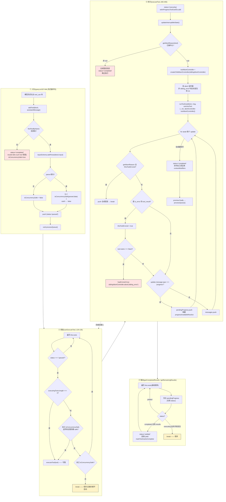
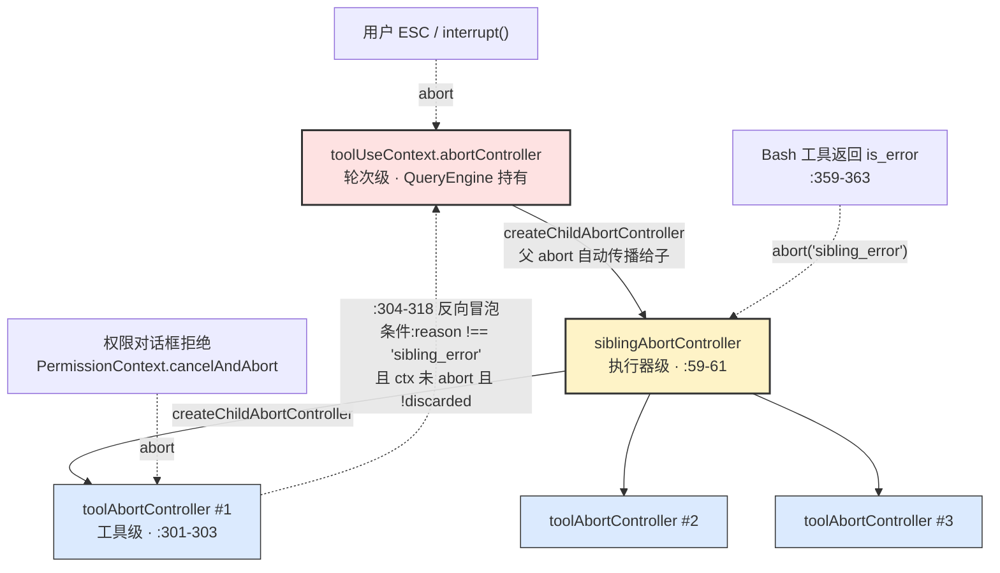

# 第 28 章 StreamingToolExecutor —— 流式并发执行模型

> 本章沿用 [第 25 章](./25-layered-arch.md) 的五层坐标系。`StreamingToolExecutor` 位于 **L3 调度层**,530 行,是"边流边执行"的全部实现。[第 26 章](./26-data-flow.md) 图 1 的阶段 D 在这里展开。

---

## 摘要

模型流式吐出 `tool_use` 块时,执行器不等 `message_stop` 就开跑。这带来三个必须解决的问题:**并发安全**(哪些工具能同时跑)、**顺序保证**(结果必须按接收顺序 yield)、**失败传播**(一个错了,兄弟怎么办)。`StreamingToolExecutor` 用一个 4 态机 + `canExecuteTool` 一行判定 + 三级 AbortController 层级回答了这三个问题。它的核心洞察是:**并发不是全局策略,而是每个工具用自己的输入自证的**——`isConcurrencySafe(input)` 接收参数,`Read('/etc/passwd')` 和 `Read(巨大目录)` 可以给出不同答案。

---

## 速赢

1. **并发判定看的是输入不是工具**。`isConcurrencySafe(input: z.infer<Input>)` 是带参方法(`Tool.ts:402`),同一个工具不同参数可以有不同答案。默认实现返回 `false`(`Tool.ts:759`)—— 保守优先。
2. **并发窗口是"全并发或全独占"**。`canExecuteTool` 只有一行逻辑:没有正在跑的 → 可以跑;有正在跑的 → 只有当**自己和所有在跑的都是并发安全**时才能加入。非安全工具永远独占。
3. **只有 Bash 错误会杀兄弟**(`:359-363`)。Read / WebFetch / Grep 失败只影响自己。理由写在注释里:Bash 命令常有隐式依赖链(`mkdir` 失败 → 后续命令无意义)。
4. **AbortController 有三层**:`toolUseContext.abortController`(轮次级) → `siblingAbortController`(执行器级) → `toolAbortController`(工具级)。中间那层向下杀不向上传;最内层的**权限拒绝会反向冒泡**到轮次级。
5. **`progress` 消息走旁路**。它们进 `pendingProgress` 而不是 `results`,在 `getCompletedResults` 里**无视工具状态立即 yield**(`:418-422`)—— 保证 spinner 实时更新。

---

## 类概览

```ts
// src/services/tools/StreamingToolExecutor.ts:19-32
type ToolStatus = 'queued' | 'executing' | 'completed' | 'yielded'

type TrackedTool = {
  id: string
  block: ToolUseBlock
  assistantMessage: AssistantMessage
  status: ToolStatus
  isConcurrencySafe: boolean
  promise?: Promise<void>
  results?: Message[]
  pendingProgress: Message[]
  contextModifiers?: Array<(context: ToolUseContext) => ToolUseContext>
}
```

| 方法 | 签名 | 调用方 | 职责 |
|---|---|---|---|
| `addTool` | `(block, assistantMessage) => void` | `query.ts:842`(流式循环内) | 入队 + 判定并发安全性 + 触发 `processQueue` |
| `processQueue` | `() => Promise<void>` | 内部(`:123`、`:403`、`:459`) | 遍历队列,择机启动;遇到不能跑的非安全工具就 `break` |
| `getCompletedResults` | `() => Generator<MessageUpdate>` | `query.ts:851`(非阻塞轮询) | 按序吐已完成结果 + 立即吐 progress |
| `getRemainingResults` | `() => AsyncGenerator<MessageUpdate>` | `query.ts:1019`、`1381` | 阻塞至全部完成 |
| `discard` | `() => void` | `query.ts:734`、`913` | 标记丢弃,已排队的不启动、在跑的收合成错误 |
| `getUpdatedContext` | `() => ToolUseContext` | 循环收尾 | 返回被 contextModifier 改过的上下文 |

**状态迁移**:`queued → executing → completed → yielded`。只有 `addTool` 遇到"工具不存在"时会跳过前两态直接 `completed`(`:79-100`)—— 因为那时结果已经是现成的错误消息了。

`yielded` 是终态,`getCompletedResults` 遇到就 `continue`(`:424-426`)。这保证了同一个结果不会被 yield 两次 —— 而 `getCompletedResults` 在流式循环里**每个 chunk 都会被调一次**,幂等性是刚需。

---

## 关键图:并发模型



---

## `isConcurrencySafe` 的判定规则

```ts
// src/services/tools/StreamingToolExecutor.ts:104-113
const parsedInput = toolDefinition.inputSchema.safeParse(block.input)
const isConcurrencySafe = parsedInput?.success
  ? (() => {
      try {
        return Boolean(toolDefinition.isConcurrencySafe(parsedInput.data))
      } catch {
        return false
      }
    })()
  : false
```

三重保守:

| 情况 | 结果 | 理由 |
|---|---|---|
| schema 解析失败 | `false` | 输入都不合法,不敢并发 |
| `isConcurrencySafe` 抛异常 | `false` | 常见于 Bash 的 `shell-quote` 解析失败 |
| 工具没实现该方法 | `false` | 默认实现(`Tool.ts:759`)就是 `() => false` |

**注意 `Boolean(...)` 包装**:合约声明返回 `boolean`,但 MCP / 插件工具是外部代码,可能返回 truthy 值而非严格布尔。

### 调度判定只有一行

```ts
// src/services/tools/StreamingToolExecutor.ts:129-135
private canExecuteTool(isConcurrencySafe: boolean): boolean {
  const executingTools = this.tools.filter(t => t.status === 'executing')
  return (
    executingTools.length === 0 ||
    (isConcurrencySafe && executingTools.every(t => t.isConcurrencySafe))
  )
}
```

翻译成人话:**要么现在没人在跑,要么大家(包括我)都是并发安全的。**

推论:
- 非并发安全工具**永远独占** —— 它跑的时候别人进不来,别人跑的时候它进不来
- 并发安全工具之间**无上限并发**(不像 `runTools` 有 10 的上限)
- 一旦有非安全工具在跑,`processQueue` 的 `break`(`:148`)会阻止后面所有工具启动,保证顺序

### 与 `runTools` 的对比

`StreamingToolExecutor` 只在 statsig 门 `tengu_streaming_tool_execution2` 开启时使用(`query/config.ts:33-35`);否则回落到 `runTools`(`query.ts:1382`)。两者的并发模型有实质差异:

| 维度 | `StreamingToolExecutor` | `runTools`(`toolOrchestration.ts:19`) |
|---|---|---|
| 启动时机 | 流式解析出 `tool_use` 立即启动 | 等整个 assistant 消息完成后统一编排 |
| 分组方式 | 动态:看当前谁在跑 | 静态:`partitionToolCalls` 预先切成批(`:90-116`) |
| 并发上限 | 无 | `getMaxToolUseConcurrency()` = 10(`toolOrchestration.ts:10`,可用 `CLAUDE_CODE_MAX_TOOL_USE_CONCURRENCY` 覆盖) |
| 兄弟失败传播 | Bash 错误 abort 兄弟 | 无 |
| contextModifier | 仅非并发工具支持(`:388-395`) | 并发批用队列延迟应用(`:38-62`) |
| 中断补偿 | `getRemainingResults` 生成合成结果 | `yieldMissingToolResultBlocks` |

`runTools` 的分批逻辑是"连续的并发安全工具合成一批,非安全工具各自成批"(`toolOrchestration.ts:90-116`),批之间严格串行。这比动态调度保守 —— 一个非安全工具会把前后的安全工具切成两批,即便它们本可以和它同时跑完再合并。

---

## AbortController 三层层级



### 为什么中间层不向上传?

```ts
// src/services/tools/StreamingToolExecutor.ts:45-48(字段注释)
// Child of toolUseContext.abortController. Fires when a Bash tool errors
// so sibling subprocesses die immediately instead of running to completion.
// Aborting this does NOT abort the parent — query.ts won't end the turn.
private siblingAbortController: AbortController
```

Bash 失败要杀掉兄弟子进程(否则 `rm -rf` 在 `mkdir` 失败后继续跑很危险),但**不应该结束整个 turn** —— 模型需要看到错误结果、自己决定下一步。所以中间层是单向的:父 → 子传播,子 → 父不传播。

### 为什么最内层要反向冒泡?

```ts
// src/services/tools/StreamingToolExecutor.ts:301-318
const toolAbortController = createChildAbortController(this.siblingAbortController)
toolAbortController.signal.addEventListener('abort', () => {
  if (
    toolAbortController.signal.reason !== 'sibling_error' &&
    !this.toolUseContext.abortController.signal.aborted &&
    !this.discarded
  ) {
    this.toolUseContext.abortController.abort(toolAbortController.signal.reason)
  }
}, { once: true })
```

注释给了具体的 issue 编号:

> Permission-dialog rejection also aborts this controller (`PermissionContext.ts` `cancelAndAbort`) — that abort must bubble up to the query controller so the query loop's post-tool abort check ends the turn. Without bubble-up, ExitPlanMode "clear context + auto" sends `REJECT_MESSAGE` to the model instead of aborting (#21056 regression).

用户在权限对话框里选"拒绝并退出计划模式"时,语义是"停下来",不是"告诉模型我拒绝了"。这个意图必须传到 `query.ts:1482` 的 post-tool abort 检查才能生效。

三个守卫条件缺一不可:
- `reason !== 'sibling_error'` —— 兄弟错误是执行器内部事件,不该升级为轮次中止
- `!ctx.signal.aborted` —— 已经中止了就别重复 abort(避免覆盖原始 reason)
- `!this.discarded` —— 丢弃场景下的 abort 是清理动作,不是用户意图

---

## 失败传播:三种合成错误

```ts
// src/services/tools/StreamingToolExecutor.ts:210-231
private getAbortReason(tool: TrackedTool):
  'sibling_error' | 'user_interrupted' | 'streaming_fallback' | null {
  if (this.discarded) return 'streaming_fallback'
  if (this.hasErrored) return 'sibling_error'
  if (this.toolUseContext.abortController.signal.aborted) {
    if (this.toolUseContext.abortController.signal.reason === 'interrupt') {
      return this.getToolInterruptBehavior(tool) === 'cancel' ? 'user_interrupted' : null
    }
    return 'user_interrupted'
  }
  return null
}
```

**优先级是有意的**:`discarded`(模型回退,整批作废)> `hasErrored`(兄弟出错)> 用户中断。前两者都是系统事件,应该覆盖用户视角的解释。

| reason | 触发源 | 合成消息内容 | 用户看到 |
|---|---|---|---|
| `user_interrupted` | ESC / 新消息(且 `interruptBehavior === 'cancel'`) | `withMemoryCorrectionHint(REJECT_MESSAGE)` | "User rejected edit" |
| `streaming_fallback` | `discard()` 后模型回退重试 | `Error: Streaming fallback - tool execution discarded` | 通常不可见(整批被丢) |
| `sibling_error` | Bash 兄弟工具返回 `is_error` | `Cancelled: parallel tool call Bash(npm install…) errored` | 带出错工具的描述 |

`sibling_error` 的消息会带上**出错工具的简短描述**(`:243-252`):从输入里取 `command` / `file_path` / `pattern`,截断到 40 字符。这让模型知道是哪个兄弟拖累了自己,而不是收到一句无信息量的 "cancelled"。

### `interruptBehavior`:工具可以拒绝被中断

```ts
// src/services/tools/StreamingToolExecutor.ts:233-241
private getToolInterruptBehavior(tool: TrackedTool): 'cancel' | 'block' {
  const definition = findToolByName(this.toolDefinitions, tool.block.name)
  if (!definition?.interruptBehavior) return 'block'
  try {
    return definition.interruptBehavior()
  } catch {
    return 'block'
  }
}
```

合约在 `Tool.ts:416`,默认 `'block'`。语义(`Tool.ts:407-415` 注释):

- `'cancel'` —— 用户发新消息时停掉工具、丢弃结果
- `'block'` —— 继续跑完,新消息排队等

**注意 `getAbortReason` 里的 `null` 分支**:`reason === 'interrupt'` 且工具是 `'block'` 时返回 `null`,意味着**工具继续正常执行**。注释(`:222`)说这种情况理论上到不了这里(block 类工具不会触发 abort),但代码仍做了防御。

`updateInterruptibleState`(`:254-260`)把这个信息推给 UI:只有**所有**正在跑的工具都是 `'cancel'` 时,才显示"可中断"提示。

---

## 详细机制

### 工具执行的完整调用链

```
StreamingToolExecutor.executeTool          (:265)
  └─ runToolUse                            (toolExecution.ts:337)
       └─ streamedCheckPermissionsAndCallTool  (:492)  ← Stream 适配器
            └─ checkPermissionsAndCallTool     (:599)
                 ├─ tool.inputSchema.safeParse (:615)  ← 阶段 0
                 ├─ tool.validateInput         (:683)  ← 阶段 1
                 ├─ startSpeculativeClassifierCheck (:740, Bash 专用)
                 ├─ backfillObservableInput    (:790)
                 ├─ runPreToolUseHooks         (:800)
                 ├─ resolveHookPermissionDecision (:921)
                 │    └─ canUseTool → hasPermissionsToUseTool → 五阶段链
                 └─ tool.call(...)                     ← 最终执行
```

`streamedCheckPermissionsAndCallTool`(`:492-509`)存在的唯一理由是把两种输出合并成一个异步迭代器:

```ts
// src/services/tools/toolExecution.ts:504-509(注释原文)
// This is a bit of a hack to get progress events and final results
// into a single async iterable.
//
// Ideally the progress reporting and tool call reporting would
// be via separate mechanisms.
const stream = new Stream<MessageUpdateLazy>()
```

`checkPermissionsAndCallTool` 返回 `Promise<MessageUpdateLazy[]>`(最终结果),同时通过 `onToolProgress` 回调推送进度。`Stream` 把两条路径缝成一条。作者自己标注了这是 hack —— 理想设计应该是两个独立机制。

### 输入的四次变形

从模型给的原始 `block.input` 到最终传给 `tool.call` 的参数,中间变了四次:

| 步 | 位置 | 动作 | 目的 |
|---|---|---|---|
| 1 | `:615` | `inputSchema.safeParse` | zod 校验 + 类型收窄 |
| 2 | `:761-773` | 剥离 `_simulatedSedEdit` | 纵深防御:该字段只能由权限系统注入 |
| 3 | `:783-793` | `backfillObservableInput` 到**克隆体** | 让 hooks/canUseTool 看到派生字段 |
| 4 | 权限链内 | `updatedInput` 覆盖 | 用户/钩子/分类器修改后的输入 |

第 3 步的克隆是关键。注释(`:775-782`)解释:文件工具会把 `file_path` 改写成 `expandPath` 的结果,但**这个改写不能到达 `call()`** —— 工具结果里会原样嵌入输入路径(`"File created successfully at: {path}"`),改了就会让序列化的 transcript 和 VCR fixture 哈希变化。所以 backfill 只作用于给 hooks 看的副本。

但如果 hook 或权限层返回了新的 `updatedInput`,`callInput` 就收敛到它 —— 那次替换是有意的,应该到达 `call()`。

### `getRemainingResults` 的双条件等待

```ts
// src/services/tools/StreamingToolExecutor.ts:467-484
if (this.hasExecutingTools() && !this.hasCompletedResults() && !this.hasPendingProgress()) {
  const executingPromises = this.tools
    .filter(t => t.status === 'executing' && t.promise)
    .map(t => t.promise!)

  const progressPromise = new Promise<void>(resolve => {
    this.progressAvailableResolve = resolve
  })

  if (executingPromises.length > 0) {
    await Promise.race([...executingPromises, progressPromise])
  }
}
```

只在**三个条件同时成立**时才等待:有工具在跑 + 没有已完成结果 + 没有待发进度。任一不成立就应该立刻返回去 yield,不能阻塞。

`Promise.race` 的第二个参赛者 `progressPromise` 由 `:371-374` 的 `progressAvailableResolve` 唤醒。没有它,一个跑 60 秒的 Bash 命令会让所有中间进度积压到最后一起吐出 —— spinner 会假死一分钟。

---

## 反模式

**❶ 在 `isConcurrencySafe` 里做 I/O 或抛异常**

它在 `addTool` 里被**同步调用**(`:108`),而 `addTool` 在流式循环的热路径上(每个 `tool_use` 块一次)。抛异常虽然被 catch 成 `false`(`:109-111`),但那意味着工具被降级为独占执行 —— 悄悄地损失并发。

正确做法:纯函数,只看输入结构。比如 `Read` 判断路径是否在允许目录内,而不是去 `fs.stat`。

**❷ 假设并发工具的 `contextModifier` 会生效**

```ts
// src/services/tools/StreamingToolExecutor.ts:388-395
// NOTE: we currently don't support context modifiers for concurrent
//       tools. None are actively being used, but if we want to use
//       them in concurrent tools, we need to support that here.
if (!tool.isConcurrencySafe && contextModifiers.length > 0) {
  for (const modifier of contextModifiers) {
    this.toolUseContext = modifier(this.toolUseContext)
  }
}
```

并发工具产生的 `contextModifier` 被**静默丢弃**。如果你写了个并发安全的工具、又想改上下文,它不会报错,只是什么都不发生。要么把工具标成非并发安全,要么改用 `runTools`(它有队列化的延迟应用,`toolOrchestration.ts:38-62`)。

**❸ 让非 Bash 工具的失败去杀兄弟**

```ts
// src/services/tools/StreamingToolExecutor.ts:356-363
// Only Bash errors cancel siblings. Bash commands often have implicit
// dependency chains (e.g. mkdir fails → subsequent commands pointless).
// Read/WebFetch/etc are independent — one failure shouldn't nuke the rest.
if (tool.block.name === BASH_TOOL_NAME) {
  this.hasErrored = true
  // ...
}
```

模型经常一次发 5 个 `Read`。其中一个文件不存在,剩下 4 个照样有用。放宽这个条件会把"一个文件读不到"放大成"这一轮全废",模型收到 4 条 `sibling_error` 后大概率会重试整批 —— 白烧 token。

**❹ 忘记消费 `getRemainingResults` 就返回**

```ts
// src/query.ts:1015-1023(中断路径)
if (toolUseContext.abortController.signal.aborted) {
  if (streamingToolExecutor) {
    for await (const update of streamingToolExecutor.getRemainingResults()) {
      if (update.message) yield update.message
    }
  }
```

注释说得很直白:必须消费 `getRemainingResults()`,执行器才会为排队中/进行中的工具生成合成 `tool_result`。不消费的话,`tool_use` 块就没有配对的 `tool_result` —— 下一次 API 请求直接 400。

**❺ 在 `discard()` 之后继续用同一个执行器**

`discard()` 只置一个标志位(`:70`)。之后 `getCompletedResults` 和 `getRemainingResults` 都会**立即返回空**(`:413-415`、`:454-456`),但已经在跑的工具**并不会被 abort**——它们跑完后结果被丢弃。

`query.ts:912-919` 的用法是正确的:`discard()` 之后立刻 `new StreamingToolExecutor(...)` 重建。复用被 discard 的实例只会得到一个永远吐不出东西的黑洞。

**❻ 依赖 `getCompletedResults` 的调用次数**

它在流式循环里每个 chunk 都被调一次(`query.ts:851`),但只有状态变成 `completed` 的工具才产出。设计上它是**幂等的轮询**,不是事件通知。在里面写有副作用的逻辑(计数、打点)会被放大成几百次。

---

## 引用

**前置**
- [`00-front/03-glossary.md`](../00-front/03-glossary.md) —— A.1 `Tool`、B.6 `StreamingToolExecutor`、G.2 `tool_use / tool_result`
- [`04-architect/25-layered-arch.md`](./25-layered-arch.md) —— L3 调度层;§7.1 序列 A
- [`04-architect/26-data-flow.md`](./26-data-flow.md) —— 阶段 D 在端到端管道中的位置;失败路径 1/3

**平行**
- [`04-architect/27-query-engine.md`](./27-query-engine.md) —— `queryLoop` 中 `streamTools` 状态的上游
- [`04-architect/29-permission.md`](./29-permission.md) —— `checkPermissionsAndCallTool` 里 `canUseTool` 那一步的完整展开

**后继**
- `04-architect/30-*` —— 工具合约与工具注册表(`isConcurrencySafe` / `interruptBehavior` 在具体工具上的实现)

**源码定位**

| 关注点 | 路径:行号 |
|---|---|
| `ToolStatus` / `TrackedTool` | `src/services/tools/StreamingToolExecutor.ts:19-32` |
| 类定义与 `siblingAbortController` | `src/services/tools/StreamingToolExecutor.ts:40-62` |
| `discard()` | `src/services/tools/StreamingToolExecutor.ts:69-71` |
| `addTool` + 并发安全判定 | `src/services/tools/StreamingToolExecutor.ts:76-124` |
| `canExecuteTool` | `src/services/tools/StreamingToolExecutor.ts:129-135` |
| `processQueue` | `src/services/tools/StreamingToolExecutor.ts:140-151` |
| 三种合成错误消息 | `src/services/tools/StreamingToolExecutor.ts:153-205` |
| `getAbortReason` 三态 | `src/services/tools/StreamingToolExecutor.ts:210-231` |
| `interruptBehavior` 读取 | `src/services/tools/StreamingToolExecutor.ts:233-241` |
| `executeTool` 主体 | `src/services/tools/StreamingToolExecutor.ts:265-405` |
| 工具级 controller + 反向冒泡 | `src/services/tools/StreamingToolExecutor.ts:301-318` |
| Bash 专属兄弟中止 | `src/services/tools/StreamingToolExecutor.ts:356-363` |
| contextModifier 限制 | `src/services/tools/StreamingToolExecutor.ts:388-395` |
| `getCompletedResults` | `src/services/tools/StreamingToolExecutor.ts:412-440` |
| `getRemainingResults` 双条件等待 | `src/services/tools/StreamingToolExecutor.ts:453-490` |
| `runToolUse` | `src/services/tools/toolExecution.ts:337` |
| `streamedCheckPermissionsAndCallTool` | `src/services/tools/toolExecution.ts:492-509` |
| `checkPermissionsAndCallTool` | `src/services/tools/toolExecution.ts:599-613` |
| 输入四次变形 | `src/services/tools/toolExecution.ts:615`、`761-773`、`783-793` |
| `runTools` 静态分批 | `src/services/tools/toolOrchestration.ts:19`、`90-116` |
| 并发上限 = 10 | `src/services/tools/toolOrchestration.ts:10` |
| `createChildAbortController` | `src/utils/abortController.ts:68-95` |
| 流式执行门控 | `src/query/config.ts:33-35` |
| `Tool.isConcurrencySafe` 合约 | `src/Tool.ts:402` |
| `Tool.interruptBehavior` 合约 | `src/Tool.ts:407-416` |
| 默认实现(全部保守) | `src/Tool.ts:759-762` |
