# 第 29 章 权限系统 —— 五阶段检查链与纵深防御

> 本章沿用 [第 25 章](./25-layered-arch.md) 的五层坐标系。权限系统横跨 L2(`useCanUseTool` 闭包、对话框 UI)、L3(`toolExecution` 编排)、L4(`Tool.checkPermissions` 合约、`types/permissions.ts`)、L5(设置、Statsig 门、分类器 API),是全系统**唯一一条主动跨四层的控制链**。

---

## 摘要

Claude Code 的权限系统不是一个函数,是一条**五阶段流水线**:zod 校验 → 工具自校验 → 规则/模式判定 → 交互裁决 → 执行。它的核心设计是**判定与呈现分离**:`hasPermissionsToUseTool` 是纯逻辑(不碰 UI),`useCanUseTool` 是 React 闭包(负责弹窗、分类器竞速、跨机转发)。11 种 `PermissionDecisionReason` 变体不是装饰 —— 它们决定了后续每一层的行为:`safetyCheck` 免疫 bypass 模式,`classifier` 触发 UI 标记,`hook` 产生附件消息。纵深防御体现在三处:跨机桥接消息强制 ask、Bridge 初始化熔断、Bash 分类器提前判定。

---

## 速赢

1. **五个阶段,四个能拒绝**。zod parse、`validateInput`、`checkPermissions`+规则链、交互裁决都能否决;只有第五阶段 `tool.call` 是纯执行。任何一阶段返回非 allow,后面的都不跑。
2. **`hasPermissionsToUseTool` 内部有 10 个子步骤**(1a→1g、2a、2b、3),前 7 个在 bypass 模式判定**之前** —— 也就是说 `--dangerously-skip-permissions` 并不能跳过它们。
3. **`safetyCheck` 是最高优先级的拒绝理由**。它在 1g 免疫 bypassPermissions(`permissions.ts:1252-1260`),又在 auto 模式里被单独挡在分类器之外(`permissions.ts:532-548`)—— 两道独立的守卫。
4. **`passthrough` 是第四种 behavior,但只存在于 `PermissionResult`,不存在于 `PermissionDecision`**。它在第 3 步被强制转成 `ask`(`permissions.ts:1299-1310`)。工具实现返回 passthrough 意思是"我没意见,你们决定"。
5. **Bash 分类器是投机执行 + 2 秒竞速**。检查在 `checkPermissionsAndCallTool` 早期就启动(`toolExecution.ts:740-752`),与 hooks 并行跑;到了要弹窗时 `Promise.race` 等最多 2 秒(`useCanUseTool.tsx:126-159`)。

---

## 关键图:五阶段权限检查链

```mermaid
%% 图 1:完整的五阶段权限检查链
flowchart TD
    START(["模型产出 tool_use 块<br/>StreamingToolExecutor.executeTool"]) --> S0

    subgraph S0G["阶段 0 · Schema 校验(toolExecution.ts:615-680)"]
        S0["tool.inputSchema.safeParse(input)"]
        S0 --> S0Q{"success?"}
        S0Q -->|否| S0F["formatZodValidationError<br/>+ buildSchemaNotSentHint<br/>→ InputValidationError"]
    end

    S0Q -->|是| S1

    subgraph S1G["阶段 1 · validateInput(Tool.ts:489,调用于 toolExecution.ts:683)"]
        S1["await tool.validateInput?.(parsed, ctx)"]
        S1 --> S1Q{"result === false?"}
        S1Q -->|是| S1F["yield is_error tool_result<br/>errorCode 透传"]
    end

    S1Q -->|否/未实现| PRE

    subgraph PREG["前置副作用(不改判定)"]
        PRE["Bash: startSpeculativeClassifierCheck<br/>toolExecution.ts:740-752"]
        PRE --> PRE2["剥离 _simulatedSedEdit<br/>:761-773"]
        PRE2 --> PRE3["backfillObservableInput 到克隆体<br/>:783-793"]
        PRE3 --> PRE4["runPreToolUseHooks<br/>:800-862"]
        PRE4 --> PRE4Q{"hook 返回 stop?"}
        PRE4Q -->|是| PRE4F["createToolResultStopMessage<br/>直接返回"]
    end

    PRE4Q -->|否| S2

    subgraph S2G["阶段 2 · hasPermissionsToUseTool(permissions.ts:473 / Inner:1158)"]
        direction TB
        S2["resolveHookPermissionDecision<br/>toolExecution.ts:921<br/>(hook 已裁决则直接用)"]
        S2 --> A1{"1a 整工具 deny 规则?<br/>:1170"}
        A1 -->|命中| DENY1["deny · reason=rule"]
        A1 -->|否| A2{"1b 整工具 ask 规则?<br/>:1183"}
        A2 -->|"命中且非<br/>沙箱自动放行"| ASK1["ask · reason=rule"]
        A2 -->|否/沙箱穿透| A3["1c tool.checkPermissions(parsed, ctx)<br/>:1208-1223 · Tool.ts:500"]
        A3 --> A4{"1d 工具自身 deny?<br/>:1225"}
        A4 -->|是| DENY2["deny · 工具给的理由"]
        A4 -->|否| A5{"1e requiresUserInteraction<br/>且 ask? :1230"}
        A5 -->|是| ASK2["ask · bypass 免疫"]
        A5 -->|否| A6{"1f 内容级 ask 规则?<br/>:1238"}
        A6 -->|是| ASK3["ask · bypass 免疫"]
        A6 -->|否| A7{"1g decisionReason<br/>=== safetyCheck? :1252"}
        A7 -->|是| ASK4["ask · bypass 免疫 ★"]
        A7 -->|否| B1{"2a bypassPermissions<br/>或 plan+bypass 可用? :1262"}
        B1 -->|是| ALLOW1["allow · reason=mode"]
        B1 -->|否| B2{"2b toolAlwaysAllowedRule?<br/>:1283"}
        B2 -->|是| ALLOW2["allow · reason=rule"]
        B2 -->|否| C1["3 passthrough → ask<br/>:1299-1310"]
    end

    subgraph S2PG["阶段 2' · 外层模式变换(permissions.ts:473-501 / 505-620)"]
        direction TB
        M1{"mode === dontAsk?<br/>:508"}
        M1 -->|是| DENY3["deny · reason=mode"]
        M1 -->|否| M2{"TRANSCRIPT_CLASSIFIER<br/>且 mode ∈ auto/plan+auto? :520"}
        M2 -->|否| OUT["决策出口"]
        M2 -->|是| M3{"safetyCheck 且<br/>!classifierApprovable? :532"}
        M3 -->|是| M3A["原样返回 ask<br/>(或 asyncAgent deny)★"]
        M3 -->|否| M4{"requiresUserInteraction? :549"}
        M4 -->|是| OUT
        M4 -->|否| M5{"PowerShell 且<br/>!POWERSHELL_AUTO_MODE? :572"}
        M5 -->|是| OUT
        M5 -->|否| M6["acceptEdits 快速路径试探<br/>:600-619<br/>(排除 Agent / REPL 工具)"]
        M6 --> M7["auto-mode 分类器裁决"]
    end

    C1 --> M1
    ASK1 --> M1
    ASK2 --> M1
    ASK3 --> M1
    ASK4 --> M1

    M7 --> OUT
    ALLOW1 --> OUT
    ALLOW2 --> OUT
    DENY1 --> OUT
    DENY2 --> OUT

    OUT --> S3

    subgraph S3G["阶段 3 · useCanUseTool 交互裁决(useCanUseTool.tsx:28-183)"]
        direction TB
        S3["createPermissionContext :33"]
        S3 --> S3A{"resolveIfAborted? :34"}
        S3A -->|是| S3AF["cancelAndAbort"]
        S3A -->|否| S3B{"behavior?"}
        S3B -->|allow| S3C["setYoloClassifierApproval(条件)<br/>logDecision accept/config<br/>buildAllow(updatedInput ?? input)"]
        S3B -->|deny| S3D["logPermissionDecision reject<br/>recordAutoModeDenial(条件)<br/>addNotification"]
        S3B -->|ask| S3E["await tool.description(...) :55"]
        S3E --> H1{"awaitAutomatedChecks<br/>BeforeDialog? :95"}
        H1 -->|是| H1A["handleCoordinatorPermission :96"]
        H1A -->|"返回非 null"| S3RES
        H1A -->|null| H2
        H1 -->|否| H2["handleSwarmWorkerPermission :113"]
        H2 -->|"返回非 null"| S3RES
        H2 -->|null| H3{"BASH_CLASSIFIER 且<br/>pendingClassifierCheck 且<br/>是 Bash 且非 coordinator? :126"}
        H3 -->|是| H3A["peekSpeculativeClassifierCheck<br/>Promise.race([分类器, 2000ms 超时]) :131"]
        H3A --> H3B{"matches 且<br/>confidence==='high'?"}
        H3B -->|是| H3C["consumeSpeculativeClassifierCheck<br/>setClassifierApproval<br/>→ allow · reason=classifier"]
        H3B -->|"否/超时"| H4
        H3 -->|否| H4["handleInteractivePermission :160<br/>弹窗 + 后台跑 hooks/分类器"]
        H4 --> S3RES["resolve(PermissionDecision)"]
        H3C --> S3RES
    end

    S3RES --> S4Q{"behavior === 'allow'?"}
    S3C --> S4Q
    S3D --> S4Q

    S4Q -->|否| REJECT["toolExecution.ts:995+<br/>endToolBlockedOnUserSpan('reject')<br/>→ is_error tool_result"]
    S4Q -->|是| S4["阶段 4 · tool.call(args, ctx,<br/>canUseTool, parentMessage, onProgress)<br/>Tool.ts:379"]

    S4 --> DONE(["ToolResult"])

    S0F --> ERR(["is_error tool_result 回灌模型"])
    S1F --> ERR
    PRE4F --> ERR
    REJECT --> ERR

    style ASK4 fill:#fee2e2,stroke:#333,stroke-width:2px
    style M3A fill:#fee2e2,stroke:#333,stroke-width:2px
    style ALLOW1 fill:#dcfce7,stroke:#333
    style ALLOW2 fill:#dcfce7,stroke:#333
    style S4 fill:#dcfce7,stroke:#333,stroke-width:2px
    style ERR fill:#fee2e2,stroke:#333
```



> ★ 标记的两处是 **bypass 免疫点**:即使用户开了 `--dangerously-skip-permissions` 或 auto 模式,这两条路径仍会弹窗。

---

## 决策理由:11 种 `PermissionDecisionReason` 变体

```ts
// src/types/permissions.ts:271-324
export type PermissionDecisionReason =
  | { type: 'rule'; rule: PermissionRule }
  | { type: 'mode'; mode: PermissionMode }
  | { type: 'subcommandResults'; reasons: Map<string, PermissionResult> }
  | { type: 'permissionPromptTool'; permissionPromptToolName: string; toolResult: unknown }
  | { type: 'hook'; hookName: string; hookSource?: string; reason?: string }
  | { type: 'asyncAgent'; reason: string }
  | { type: 'sandboxOverride'; reason: 'excludedCommand' | 'dangerouslyDisableSandbox' }
  | { type: 'classifier'; classifier: string; reason: string }
  | { type: 'workingDir'; reason: string }
  | { type: 'safetyCheck'; reason: string; classifierApprovable: boolean }
  | { type: 'other'; reason: string }
```

> **勘误说明**:本章据源码核实为 **11 个变体**(`permissions.ts:271-324`)。如遇资料称 12 个,可能把 `PermissionResult` 的第四种 behavior `passthrough`(`:255-266`)一并计入了 —— 它是 behavior 而非 reason,类型上是分开的。

| 变体 | 谁产生 | 下游特殊行为 |
|---|---|---|
| `rule` | 1a/1b/1f/2b 规则匹配 | 1f 的 ask 规则**免疫 bypass**(`:1244-1250`) |
| `mode` | 2a bypass、dontAsk 转换 | 无 |
| `subcommandResults` | Bash 复合命令逐段判定 | UI 展开每段的独立结论 |
| `permissionPromptTool` | 外部 MCP 权限提示工具 | 结果原样透传 |
| `hook` | `PreToolUse` / `PermissionRequest` 钩子 | `hookName === 'PermissionRequest'` 时产生 `hook_permission_decision` 附件消息(`toolExecution.ts:980-993`) |
| `asyncAgent` | 无法交互的上下文(子代理) | 把本该 ask 的降级为 deny |
| `sandboxOverride` | 沙箱排除命令 / 显式禁用 | 说明为什么没走沙箱 |
| `classifier` | auto-mode / bash_allow 分类器 | `classifier === 'auto-mode'` 时触发 `setYoloClassifierApproval`(`useCanUseTool.tsx:43-45`)或 `recordAutoModeDenial`(`:77-89`) |
| `workingDir` | 工作目录越界 | 提示添加目录 |
| `safetyCheck` | 敏感路径 / 跨机桥接 | **两道 bypass 免疫**;`classifierApprovable` 决定能否被分类器裁决 |
| `other` | 兜底 | 无 |

### `safetyCheck.classifierApprovable`:一个布尔位的重量

```ts
// src/types/permissions.ts:312-320
| {
    type: 'safetyCheck'
    reason: string
    // When true, auto mode lets the classifier evaluate this instead of
    // forcing a prompt. True for sensitive-file paths (.claude/, .git/,
    // shell configs) — the classifier can see context and decide. False
    // for Windows path bypass attempts and cross-machine bridge messages.
    classifierApprovable: boolean
  }
```

`true` → 分类器可以看上下文后自行放行(敏感文件路径)。
`false` → 必须由人类确认,连分类器都不行(Windows 路径绕过、跨机桥接消息)。

这个位在 `permissions.ts:532-548` 被读取:

```ts
if (result.decisionReason?.type === 'safetyCheck' && !result.decisionReason.classifierApprovable) {
  if (appState.toolPermissionContext.shouldAvoidPermissionPrompts) {
    return { behavior: 'deny', message: result.message,
      decisionReason: { type: 'asyncAgent', reason: '...' } }
  }
  return result   // 原样返回 ask,不进分类器
}
```

注意 `shouldAvoidPermissionPrompts` 分支:在无法弹窗的上下文(异步子代理)里,不可分类器裁决的 safetyCheck 会被**降级为 deny** 而不是挂起。**fail-closed**,不是 fail-open。

---

## 设计权衡

### 为什么判定和呈现要分成两个文件?

`hasPermissionsToUseTool`(`utils/permissions/permissions.ts`)是纯函数式的:输入 tool + input + context,输出 `PermissionDecision`。它不 import 任何 React、不碰 Ink、不知道有没有终端。

`useCanUseTool`(`hooks/useCanUseTool.tsx`)是 React 闭包:它把 `setToolUseConfirmQueue` 和 `setToolPermissionContext` 捕获进去,能弹窗、能改全局权限上下文。

这个切分让**同一套判定逻辑服务四种运行环境**:

| 环境 | 用什么 | ask 怎么处理 |
|---|---|---|
| 交互式 REPL | `useCanUseTool`(`REPL.tsx:2382`) | 弹 `PermissionRequest` 对话框 |
| headless `-p` | `createCanUseToolWithPermissionPrompt` / `getCanUseToolFn` | 按 `--permission-prompt-tool` 转发或直接失败 |
| 异步子代理 | 同上 + `shouldAvoidPermissionPrompts` | 降级为 deny |
| Bridge / swarm | `handleSwarmWorkerPermission` 转发给 leader | 通过 mailbox 异步等待 |

如果判定逻辑写在 React hook 里,后三种环境全部不可用。

### 为什么 bypass 模式的判定要放在第 2a 步这么靠后?

直觉上,`--dangerously-skip-permissions` 应该第一行就 return allow。源码把它放在 1a-1g **七个检查之后**。

因为 "skip permissions" 的真实语义不是"跳过一切",而是"**跳过日常摩擦**":

| 检查 | 在 bypass 之前? | 理由 |
|---|---|---|
| 1a 整工具 deny 规则 | ✓ | 用户显式配置的禁令 |
| 1b 整工具 ask 规则 | ✓ | 同上 |
| 1d 工具自身 deny | ✓ | 工具知道自己什么时候不该跑 |
| 1e `requiresUserInteraction` | ✓ | 如 ExitPlanMode,交互是它的语义 |
| 1f 内容级 ask 规则 | ✓ | `Bash(npm publish:*)` 这种显式配置 |
| 1g `safetyCheck` | ✓ | `.git/`、`.claude/`、shell 配置、跨机消息 |
| 2b 整工具 allow 规则 | ✗(在 bypass 之后) | 结果相同,顺序无所谓 |

1f 的注释(`permissions.ts:1238-1243`)把逻辑讲得很清楚:用户显式配了内容级 ask 规则,说明他要的就是"这件事问我"。bypass 是关于**默认行为**的开关,不是关于**显式配置**的覆盖。这个原则跟 deny 规则在 1d 被尊重是一致的。

### 为什么 `passthrough` 要单独存在?

`Tool.checkPermissions` 的默认实现是:

```ts
// src/Tool.ts:759-762(默认实现节选)
isConcurrencySafe: (_input?: unknown) => false,
isReadOnly: (_input?: unknown) => false,
checkPermissions: (/* ... */) => ({ behavior: 'allow', updatedInput }),
```

但**规则链里的初始值**是 passthrough(`permissions.ts:1210-1213`):

```ts
let toolPermissionResult: PermissionResult = {
  behavior: 'passthrough',
  message: createPermissionRequestMessage(tool.name),
}
```

区别在语义:`allow` 是"我批准了",`passthrough` 是"我没有意见,交给通用系统"。这个区分让 1d/1e/1f/1g 四个检查能准确判断"工具有没有主动表态"。到第 3 步统一转成 `ask`(`:1299-1310`)—— 没人表态就问用户,fail-closed。

如果只有三种 behavior,工具就必须在"批准"和"拒绝"之间二选一,无法表达"不关我事"。

### 为什么不用集中式策略引擎(OPA / Cedar)?

这类系统通常把策略写成声明式规则,由引擎统一求值。Claude Code 没这么做,原因有三:

1. **判定需要执行 IO**。`tool.checkPermissions` 是 `async` 的 —— Bash 要解析命令、文件工具要 `expandPath`、MCP 工具要问服务器。声明式引擎难以表达"先跑个子进程再决定"。
2. **判定需要调 LLM**。auto 模式的分类器本身是一次模型调用。这在任何策略语言里都是异物。
3. **规则来源是分层合并的**。企业托管设置 > 项目 `.claude/settings.json` > 用户 `~/.claude/settings.json` > CLI 参数,再叠加会话内的临时授权。这个合并逻辑在 `permissionSetup.ts` 里已经足够复杂,再套一层 DSL 只会更难调试。

代价是**策略无法静态审计**。你不能拿一份配置文件问"这套规则会不会允许 `rm -rf /`" —— 只能实际跑一遍。源码用大量埋点(`logPermissionDecision`、`tengu_tool_use_can_use_tool_rejected`、OTel `tool_decision`)来补偿可观测性。

---

## 详细机制

### 模式优先级:`orderedModes` 的三源仲裁

```ts
// src/utils/permissions/permissionSetup.ts:722-773(结构)
const orderedModes: PermissionMode[] = []

if (dangerouslySkipPermissions) orderedModes.push('bypassPermissions')   // :725

if (permissionModeCli) {                                                 // :728
  const parsedMode = permissionModeFromString(permissionModeCli)
  if (feature('TRANSCRIPT_CLASSIFIER') && parsedMode === 'auto') {
    if (autoModeCircuitBrokenSync) { /* 熔断,降级 */ }
    else orderedModes.push('auto')
  } else orderedModes.push(parsedMode)
}

if (settings.permissions?.defaultMode) {                                 // :743
  const settingsMode = settings.permissions.defaultMode as PermissionMode
  if (isEnvTruthy(process.env.CLAUDE_CODE_REMOTE) &&
      !['acceptEdits', 'plan', 'default'].includes(settingsMode)) {
    // CCR 只支持 acceptEdits / plan —— 忽略并埋点
  } else if (feature('TRANSCRIPT_CLASSIFIER') && settingsMode === 'auto') {
    /* 同样过熔断检查 */
  } else orderedModes.push(settingsMode)
}
```

优先级:**CLI `--dangerously-skip-permissions` > CLI `--permission-mode` > settings `defaultMode`**。

然后逐个试,第一个"可用"的胜出(`:777-796`):

```ts
for (const mode of orderedModes) {
  if (mode === 'bypassPermissions' && disableBypassPermissionsMode) {
    notification = growthBookDisableBypassPermissionsMode
      ? 'Bypass permissions mode was disabled by your organization policy'
      : 'Bypass permissions mode was disabled by settings'
    continue                          // 跳过,试下一个
  }
  result = { mode, notification }
  break
}
```

`disableBypassPermissionsMode` 有两个来源(`:699-711`),**Statsig 门优先于 settings**:

```ts
const disableBypassPermissionsMode =
  growthBookDisableBypassPermissionsMode || settingsDisableBypassPermissionsMode
```

这让企业可以通过远端开关关掉 bypass,而用户本地改 settings 无法恢复。

三个值得注意的细节:

1. **CCR 环境的白名单**(`:748-759`)。`CLAUDE_CODE_REMOTE` 下 settings 的 `defaultMode` 只允许 `acceptEdits` / `plan` / `default`。注释直言:否则 `bypassPermissions` 会在远程环境里静默授予完全访问权限。忽略时还打了埋点 `tengu_ccr_unsupported_default_mode_ignored`。
2. **auto 模式的同步熔断检查**(`:717-719`)。`getAutoModeEnabledStateIfCached() === 'disabled'` 是同步的缓存读,目的是**避免在 `showSetupScreens()` 里显示一个注定进不去的 AutoModeOptInDialog**。真正的门检在异步的 `verifyAutoModeGateAccess`。
3. **一段重复的死代码**(`:798-804`):

```ts
if (!result) { result = { mode: 'default', notification } }
if (!result) { result = { mode: 'default', notification } }   // 永远不会执行
```

第二个 `if` 恒假。无害,但说明这块代码经历过合并冲突或重构残留。**这是原有代码,不在本书修改范围内** —— 记录于此供读者按图索骥时不必困惑。

### Ask 路径的三个前置处理器

`useCanUseTool.tsx:93-169` 的 `case 'ask'` 分支按顺序试三个处理器,任一返回非 null 就短路:

**① `handleCoordinatorPermission`(`:96`)—— 由 `awaitAutomatedChecksBeforeDialog` 门控**

```ts
if (appState.toolPermissionContext.awaitAutomatedChecksBeforeDialog) {
  const coordinatorDecision = await handleCoordinatorPermission({
    ctx,
    ...(feature('BASH_CLASSIFIER') ? { pendingClassifierCheck: result.pendingClassifierCheck } : {}),
    updatedInput: result.updatedInput,
    suggestions: result.suggestions,
    permissionMode: appState.toolPermissionContext.mode,
  })
  if (coordinatorDecision) { resolve(coordinatorDecision); return }
  // null 意味着两个自动检查都没定夺 —— 落到下面的对话框。
  // hooks 已经跑过,分类器已经消费过。
}
```

语义(注释 `:93-95`):后台 worker 只应该在自动检查无法决定时才打断用户。所以它**先等自动检查跑完**,而不是立刻弹窗。

紧接着有一次 `resolveIfAborted`(`:110-112`):等自动检查的过程中用户可能已经中断,不检查会弹出一个陈旧的对话框。

**② `handleSwarmWorkerPermission`(`:113`)—— 无条件试**

swarm worker 先试分类器自动批准,不行就通过 mailbox 把请求转发给 leader。

**③ 投机分类器竞速(`:126-159`)—— Bash 专用**

```ts
if (feature('BASH_CLASSIFIER') && result.pendingClassifierCheck &&
    tool.name === BASH_TOOL_NAME &&
    !appState.toolPermissionContext.awaitAutomatedChecksBeforeDialog) {
  const speculativePromise = peekSpeculativeClassifierCheck((input as {command: string}).command)
  if (speculativePromise) {
    const raceResult = await Promise.race([
      speculativePromise.then(r => ({ type: 'result' as const, result: r })),
      new Promise<{type:'timeout'}>(res => setTimeout(res, 2000, { type: 'timeout' as const })),
    ])
    if (ctx.resolveIfAborted(resolve)) return
    if (raceResult.type === 'result' && raceResult.result.matches &&
        raceResult.result.confidence === 'high' && feature('BASH_CLASSIFIER')) {
      consumeSpeculativeClassifierCheck((input as {command: string}).command)
      // ... setClassifierApproval + resolve allow
    }
    // 超时或不匹配 —— 落到对话框
  }
}
```

三个条件同时满足才放行:`matches` + `confidence === 'high'` + 特性开启。`medium` / `low` 置信度一律弹窗。

**`peek` 与 `consume` 的区别很重要**:`peek` 只观察不消费(可能落到对话框,那时 `interactiveHandler` 还要用),确认要用了才 `consume`。

投机检查本身在 `toolExecution.ts:740-752` 启动 —— 也就是**权限判定还没开始**的时候。注释解释了为什么 UI 指示器不在那里设置:

> The UI indicator (`setClassifierChecking`) is NOT set here — it's set in `interactiveHandler.ts` only when the permission check returns `ask` with a `pendingClassifierCheck`. This avoids flashing "classifier running" for commands that auto-allow via prefix rules.

**④ 兜底:`handleInteractivePermission`(`:160-167`)**

```ts
handleInteractivePermission({
  ctx, description, result,
  awaitAutomatedChecksBeforeDialog: appState.toolPermissionContext.awaitAutomatedChecksBeforeDialog,
  bridgeCallbacks: feature('BRIDGE_MODE') ? appState.replBridgePermissionCallbacks : undefined,
  channelCallbacks: feature('KAIROS') || feature('KAIROS_CHANNELS')
    ? appState.channelPermissionCallbacks : undefined,
}, resolve)
```

它弹对话框,同时**在后台继续跑 hooks 和分类器**(`interactiveHandler.ts:433-443`)。谁先给出结论谁赢 —— 内部用 `claim()` 做单次认领(`:259`),避免用户点了 yes 的同时分类器也 resolve 造成双重 resolve。

`bridgeCallbacks` / `channelCallbacks` 让远端(claude.ai、Kairos channel)也能应答同一个权限请求。

### 错误处理:全部降级为取消

```ts
// src/hooks/useCanUseTool.tsx:171-182
.catch(error => {
  if (error instanceof AbortError || error instanceof APIUserAbortError) {
    logForDebugging(`Permission check threw ${error.constructor.name} for tool=${tool.name}: ${error.message}`)
    ctx.logCancelled()
    resolve(ctx.cancelAndAbort(undefined, true))
  } else {
    logError(error)
    resolve(ctx.cancelAndAbort(undefined, true))
  }
})
.finally(() => { clearClassifierChecking(toolUseID) })
```

**任何异常都 resolve 成取消,从不 reject。** 这保证了 `runToolUse` 的 `for await` 不会因为权限层的意外而炸掉整个轮次 —— 那会导致 `tool_use` 没有配对的 `tool_result`,下一次 API 请求 400。

`finally` 里清除分类器 UI 指示器 —— 无论走哪条路径都要清,否则 spinner 卡住。

---

## 纵深防御的三个实例

### ① SendMessageTool:跨机桥接消息永远 ask

```ts
// src/tools/SendMessageTool/SendMessageTool.ts:585-602
async checkPermissions(input, _context) {
  if (feature('UDS_INBOX') && parseAddress(input.to).scheme === 'bridge') {
    return {
      behavior: 'ask' as const,
      message: `Send a message to Remote Control session ${input.to}? It arrives as a user prompt on the receiving Claude (possibly another machine) via Anthropic's servers.`,
      // safetyCheck (not mode) — permissions.ts guards this before both
      // bypassPermissions (step 1g) and auto-mode's allowlist/classifier.
      // Cross-machine prompt injection must stay bypass-immune.
      decisionReason: {
        type: 'safetyCheck',
        reason: 'Cross-machine bridge message requires explicit user consent',
        classifierApprovable: false,
      },
    }
  }
  return { behavior: 'allow' as const, updatedInput: input }
}
```

威胁模型:A 机器上的 Claude 给 B 机器上的 Claude 发消息,消息**以用户提示词的身份**到达 B。如果 A 被提示词注入攻破,它就能让 B 执行任意指令 —— 而 B 的用户完全不知情。

防御用了**两个正交的机制**:

1. `type: 'safetyCheck'` → 命中 1g(`permissions.ts:1252-1260`),免疫 bypassPermissions
2. `classifierApprovable: false` → 命中 `permissions.ts:532-548`,免疫 auto 模式分类器

注释里 "permissions.ts guards this before both" 明确指出这是**两道独立的门**。只用其中一个,另一条路径就会漏。

对照:如果用 `decisionReason: { type: 'mode', ... }`,1g 检查看的是 `type === 'safetyCheck'`,不匹配 → 直接落到 2a 被 bypass 放行。**变体选错 = 防御失效**。这就是 11 种变体不是装饰的最好证明。

### ② Bridge 初始化熔断

```ts
// src/hooks/useReplBridge.tsx:30-40(注释 + 常量)
// 保证 401 打在 POST /v1/environments/bridge。Datadog 2026-03-08:
// 单个卡住的客户端一天产生 2,879 次 401(占该路由全部 401 的 17%)。
const MAX_CONSECUTIVE_INIT_FAILURES = 3
```

```ts
// src/hooks/useReplBridge.tsx:64-67
// Persists across effect re-runs (unlike the effect's local state). Reset
// only on successful init. Hits MAX_CONSECUTIVE_INIT_FAILURES → fuse blown
// for the session, regardless of replBridgeEnabled re-toggling.
const consecutiveFailuresRef = useRef(0)
```

这不是权限判定,但属于同一类防御:**限制失败的放大**。用 `useRef` 而非 `useState` 是刻意的 —— 它跨 effect 重跑存活,用户反复切换 `/bridge` 开关也不会重置计数。

熔断在 `:113` 检查。`initReplBridge.ts:174` 为进程内路径做了同样的镜像实现。

从权限视角看,一个反复失败的 bridge 意味着**远端权限回调通道不可靠** —— 与其让 `handleInteractivePermission` 的 `bridgeCallbacks` 挂在一个永远不会应答的通道上,不如彻底断开,退回本地对话框。

### ③ Bash 投机分类器:提前判定 + 优雅降级

前文已述机制。从纵深防御角度看它的价值在于**降低了绕过的诱惑**:如果每个 `git status` 都要弹窗,用户会去开 `--dangerously-skip-permissions`,那就失去了所有防护。投机分类器让常见安全命令免打扰,把用户留在有防护的模式里。

设计上的克制:
- 只有 `high` 置信度才放行,`medium` / `low` 仍弹窗
- 2 秒硬超时 —— 宁可弹窗也不让用户干等
- `peek` / `consume` 分离,避免结果被提前消耗掉

---

## 反模式

**❶ 在 `checkPermissions` 里用 `mode` 变体表达安全约束**

```ts
// ✗ 会被 bypassPermissions 直接放行
return { behavior: 'ask', decisionReason: { type: 'mode', mode: 'default' }, message: '...' }

// ✓ 命中 1g,bypass 免疫
return { behavior: 'ask', decisionReason: { type: 'safetyCheck',
  reason: '...', classifierApprovable: false }, message: '...' }
```

1g 的判定是 `toolPermissionResult.decisionReason?.type === 'safetyCheck'`(`permissions.ts:1257`)。变体不对,守卫就不生效。而且**这个失效是静默的** —— 在默认模式下测试完全正常,只有开了 bypass 才暴露。

**❷ 在 `checkPermissions` 里做副作用**

它可能被调用两次:一次在 1c(`permissions.ts:1216`),一次在 auto 模式的 acceptEdits 快速路径试探(`permissions.ts:607`,用一个伪造成 `acceptEdits` 的 `getAppState` 包装)。写文件、发请求、改全局状态都会被执行两遍。

**❸ 用 `validateInput` 做权限检查**

合约注释(`Tool.ts:495`)写得很清楚:"`checkPermissions` … Only called after `validateInput()` passes."

`validateInput` 是**语义校验**(路径存在吗?参数自洽吗?),失败产生 `InputValidationError` 让模型自己修正。权限检查放这里会导致:错误信息把权限策略泄漏给模型,而且完全绕过规则链、hooks、分类器、审计埋点。

**❹ 假设 `canUseTool` 返回的 `updatedInput` 一定等于传入的 `input`**

```ts
// src/hooks/useCanUseTool.tsx:50-52
resolve(ctx.buildAllow(result.updatedInput ?? input, {
  decisionReason: result.decisionReason,
}))
```

用户可以在对话框里改参数,钩子可以返回 `hookUpdatedInput`(`toolExecution.ts:834-838`),`checkPermissions` 也可以返回 `updatedInput`。执行时必须用返回值,不能用原始 `input` —— 否则用户改的东西白改,更糟的是"看到的是 A、执行的是 B"的 TOCTOU 类问题。

**❺ 让权限检查抛异常**

`useCanUseTool` 的 catch(`:171-182`)会把它降级为取消,不会崩。但你丢失了所有上下文:用户看到的是一个笼统的取消,而不是具体原因。正确做法是返回 `{ behavior: 'deny', message: '<具体原因>', decisionReason: {...} }` —— 这条消息会作为 `tool_result` 回灌给模型,模型能据此调整策略。

**❻ 依赖 `permissionDenials` 判断"用户拒绝了"**

`QueryEngine.ts:262` 的条件是 `result.behavior !== 'allow'`。这把 ask 超时、`cancelAndAbort`、auto 模式 deny 全算进去。想区分具体原因,读 `decisionReason.type`。

**❼ 在 headless 里假设 ask 会弹窗**

无头模式没有 UI。`shouldAvoidPermissionPrompts` 为真时,不可分类器裁决的 safetyCheck 被降级为 `deny` + `reason: 'asyncAgent'`(`permissions.ts:536-546`)。写自动化脚本时必须预先配好 allow 规则,否则会遇到"本地跑得好好的、CI 里全被拒"。

---

## 引用

**前置**
- [`00-front/03-glossary.md`](../00-front/03-glossary.md) —— A.3 `Permission / PermissionResult`、A.4 `PermissionMode`、E.2 `Bypass Permissions`、E.3 `Auto Mode`、E.4 `Permission Rule`、E.6 `Sandbox`、E.7 `Transcript Classifier`、E.8 `Speculative Classifier`、G.4 `PermissionRequest`
- [`01-foundation/03-feature-flags.md`](../01-foundation/03-feature-flags.md) —— `TRANSCRIPT_CLASSIFIER`、`BASH_CLASSIFIER`、`BRIDGE_MODE`、`UDS_INBOX`、`KAIROS`、`POWERSHELL_AUTO_MODE`
- [`04-architect/25-layered-arch.md`](./25-layered-arch.md) —— §7.3 序列 C 是本章图 1 的简化版

**平行**
- [`04-architect/26-data-flow.md`](./26-data-flow.md) —— 阶段 D 中 `canUseTool` 那一步的上下文;失败路径 2
- [`04-architect/27-query-engine.md`](./27-query-engine.md) —— `wrappedCanUseTool` 的记账层
- [`04-architect/28-streaming.md`](./28-streaming.md) —— 权限拒绝如何通过 `toolAbortController` 反向冒泡终止轮次

**后继**
- `04-architect/30-*` —— 钩子系统(`PreToolUse` / `PermissionRequest` 在本章图 1 前置副作用段的展开)

**源码定位**

| 关注点 | 路径:行号 |
|---|---|
| `PermissionAllowDecision` | `src/types/permissions.ts:174-184` |
| `PermissionAskDecision` | `src/types/permissions.ts:199-226` |
| `PermissionDenyDecision` | `src/types/permissions.ts:231-236` |
| `PermissionResult`(含 passthrough) | `src/types/permissions.ts:251-266` |
| `PermissionDecisionReason` 11 变体 | `src/types/permissions.ts:271-324` |
| `ClassifierResult` | `src/types/permissions.ts:330-335` |
| `Tool.call` 合约 | `src/Tool.ts:379-385` |
| `Tool.validateInput` 合约 | `src/Tool.ts:489-492` |
| `Tool.checkPermissions` 合约 | `src/Tool.ts:500-503` |
| 默认实现(保守) | `src/Tool.ts:759-762` |
| `hasPermissionsToUseTool` 外层 | `src/utils/permissions/permissions.ts:473-501` |
| dontAsk → deny | `src/utils/permissions/permissions.ts:505-517` |
| auto 模式入口 | `src/utils/permissions/permissions.ts:520-525` |
| safetyCheck 免疫分类器 | `src/utils/permissions/permissions.ts:532-548` |
| PowerShell 特例 | `src/utils/permissions/permissions.ts:572-591` |
| acceptEdits 快速路径 | `src/utils/permissions/permissions.ts:600-619` |
| `checkRuleBasedPermissions` | `src/utils/permissions/permissions.ts:1071` |
| `hasPermissionsToUseToolInner` 1a-3 | `src/utils/permissions/permissions.ts:1158-1319` |
| 1g safetyCheck bypass 免疫 | `src/utils/permissions/permissions.ts:1252-1260` |
| 2a bypassPermissions | `src/utils/permissions/permissions.ts:1262-1281` |
| 3 passthrough → ask | `src/utils/permissions/permissions.ts:1299-1310` |
| `CanUseToolFn` 类型 | `src/hooks/useCanUseTool.tsx:27` |
| `useCanUseTool` 主体 | `src/hooks/useCanUseTool.tsx:28-191` |
| allow 分支 | `src/hooks/useCanUseTool.tsx:39-54` |
| deny 分支 | `src/hooks/useCanUseTool.tsx:65-92` |
| ask 分支三处理器 | `src/hooks/useCanUseTool.tsx:93-169` |
| 投机分类器 2s 竞速 | `src/hooks/useCanUseTool.tsx:126-159` |
| 异常降级为取消 | `src/hooks/useCanUseTool.tsx:171-182` |
| `initialPermissionModeFromCLI` | `src/utils/permissions/permissionSetup.ts:689-811` |
| `orderedModes` 三源仲裁 | `src/utils/permissions/permissionSetup.ts:722-773` |
| CCR defaultMode 白名单 | `src/utils/permissions/permissionSetup.ts:748-759` |
| bypass 禁用仲裁 | `src/utils/permissions/permissionSetup.ts:777-796` |
| schema 校验 | `src/services/tools/toolExecution.ts:615-680` |
| `validateInput` 调用 | `src/services/tools/toolExecution.ts:683-733` |
| 投机分类器启动 | `src/services/tools/toolExecution.ts:740-752` |
| `runPreToolUseHooks` | `src/services/tools/toolExecution.ts:800-862` |
| `resolveHookPermissionDecision` | `src/services/tools/toolExecution.ts:921-931` |
| hook 权限决策附件 | `src/services/tools/toolExecution.ts:980-993` |
| 拒绝路径埋点 | `src/services/tools/toolExecution.ts:995-1010` |
| SendMessageTool 桥接 safetyCheck | `src/tools/SendMessageTool/SendMessageTool.ts:585-602` |
| Bridge 熔断常量 | `src/hooks/useReplBridge.tsx:40`、`64-67`、`113` |
| 进程内 bridge 熔断镜像 | `src/bridge/initReplBridge.ts:174` |
| REPL 的 `canUseTool` 闭包 | `src/screens/REPL.tsx:2382` |
