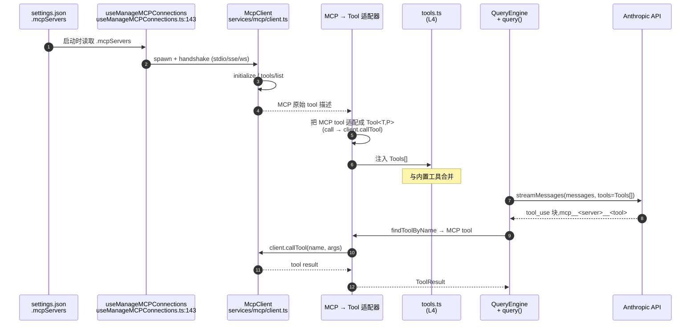
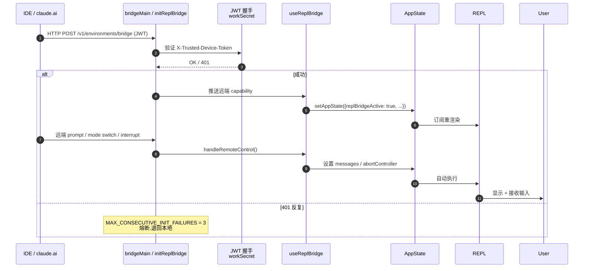
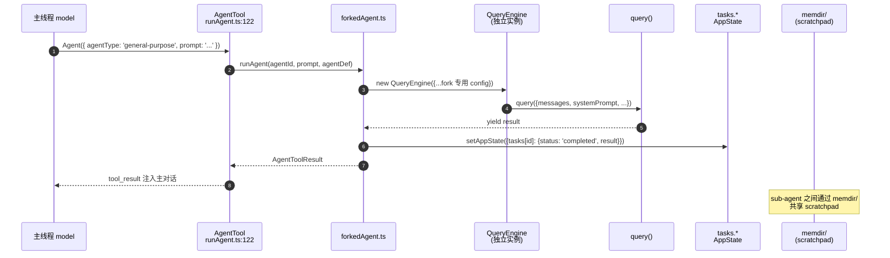
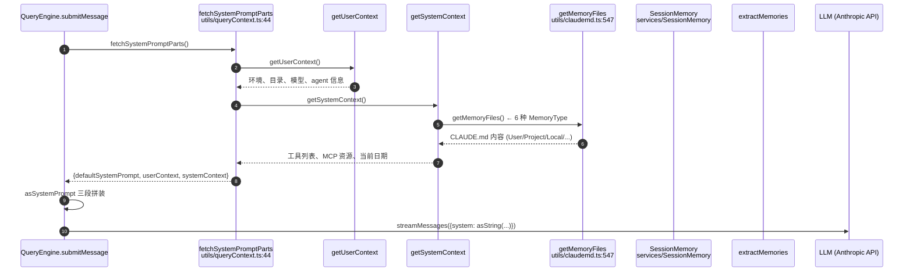

# 第 30 章 子系统地图 —— 8 大子系统的接口与依赖

> 本章是架构师视角的子系统**横向**总结。前面 [第 25 章](./25-layered-arch.md) 的五层坐标系把代码切成 L1→L5 的纵向,本章把 L5 服务层按职责切成 8 大**子系统**,给出每个子系统的入口、对内/对外接口、依赖矩阵,以及最关键的 4 个跨子系统交互。后续 30a(运行时拓扑)、30b(沙箱)、31(性能)、32(安全)、33(可观测性)、34(模式)各章会按子系统横向引用本章。

---

## 摘要

Claude Code CLI 的 L5 服务层并非平铺直叙,而是 8 个高内聚子系统按职责切分:**MCP / Bridge / Coordinator / Memory / Plugin-Skill / Remote-Server / LSP / Compact**。它们各自对外暴露 React hook 或 service class,对内收敛在同一目录下;子系统之间**严禁直接 import**,只能通过 L4 合约层(`Tool<T,P>` / `Message` / `Command`)或 L3 调度层(`QueryEngine` / `StreamingToolExecutor` / `wrappedCanUseTool`)协作。本章给出 8 × 8 依赖矩阵与 4 个最关键的跨子系统交互链路。

---

## 速赢

1. **8 个子系统按"功能 vs 通信 vs 控制"分为三类**:功能类(MCP、LSP、Compact)、通信类(Bridge、Remote-Server)、控制类(Coordinator、Memory、Plugin-Skill)。
2. **每个子系统入口只有 1-3 个**:MCP 是 `useManageMCPConnections`(`useManageMCPConnections.ts:143`) + `MCPConnectionManager`(`MCPConnectionManager.tsx:38`);Bridge 是 `bridgeMain`(`bridgeMain.ts:1`) + `initReplBridge`(`initReplBridge.ts:110`);Compact 是 `autoCompact.ts:241` 的 `autoCompactIfNeeded`。
3. **子系统之间严禁直接 import**。`services/mcp/` 不会 import `services/lsp/`,它们通过 L2 的 `REPL.tsx` 同时订阅两边实现"协作"。
4. **4 个最关键的跨子系统交互**是:MCP → Tool 注册 → QueryEngine → API;Bridge → REPL → useReplBridge;Coordinator → AgentTool → 多 Fork;Memory → fetchSystemPromptParts → system prompt。
5. **失败隔离是子系统的核心属性**。MCP server 连不上不影响主循环(`useManageMCPConnections.ts:447-455` 用 16ms batched flush 把状态更新解耦);Compact 失败由 circuit breaker 兜底(`autoCompact.ts:70` 的 `MAX_CONSECUTIVE_AUTOCOMPACT_FAILURES = 3`)。
6. **子系统状态几乎都通过 AppState 总线传递**。`mcp.*`、`plugins.*`、`tasks.*`、`lsp.*`、`channelPermissionCallbacks` 都是 `AppState` 字段,L2 订阅,L3 读写,L5 写。

---

## 关键图 1:8 大子系统接口关系

```mermaid
%% 图 1:8 大子系统的接口、入口、AppState 字段
flowchart TB
    subgraph L2["L2 交互/传输层 (REPL / Bridge / Print)"]
        REPL["screens/REPL.tsx<br/>订阅 AppState"]
        BRIDGE_MAIN["bridge/bridgeMain.ts"]
        PRINT["cli/print.ts runHeadless"]
    end

    subgraph APP["AppState 横切总线 (src/state/AppState.tsx)"]
        AS_MCP["mcp.*"]
        AS_PLUG["plugins.*"]
        AS_TASKS["tasks.*"]
        AS_LSP["lsp.*"]
        AS_BRIDGE["replBridgePermissionCallbacks"]
        AS_CHAN["channelPermissionCallbacks"]
    end

    subgraph MCP["① MCP 服务 (services/mcp/)"]
        MCP_HOOK["useManageMCPConnections<br/>(useManageMCPConnections.ts:143)"]
        MCP_CTX["MCPConnectionManager<br/>React Context"]
        MCP_CLIENT["McpClient<br/>(client.ts)"]
        MCP_TOOLS["MCP → Tool&lt;T,P&gt; 适配器"]
    end

    subgraph BRIDGE["② Bridge 服务 (bridge/)"]
        BR_INIT["initReplBridge<br/>(initReplBridge.ts:110)"]
        BR_REPL["useReplBridge"]
        BR_JWT["bridgeApi.ts + jwtUtils.ts"]
        BR_MESSAG["bridgeMessaging.ts"]
    end

    subgraph COORD["③ Coordinator 服务 (coordinator/)"]
        CO_RUN["runAgent / forkedAgent"]
        CO_TEAM["TeamCreate/TeamDelete"]
        CO_SCRATCH["getScratchpadDir()<br/>memdir/ 协同"]
    end

    subgraph MEM["④ Memory 服务"]
        MEM_DIR["memdir/<br/>scratchpad + 共享笔记"]
        MEM_SM["services/SessionMemory/<br/>sessionMemoryCompact"]
        MEM_EX["services/extractMemories/<br/>记忆抽取"]
        MEM_TM["services/teamMemorySync/<br/>团队同步"]
    end

    subgraph PLUG["⑤ Plugin/Skill 服务"]
        PLUG_SVC["services/plugins/<br/>install/CLI"]
        PLUG_LOAD["utils/plugins/loadPluginCommands.ts<br/>getPluginCommands"]
        PLUG_SKILL["skills/loadSkillsDir.ts"]
        PLUG_BUND["skills/bundledSkills.ts"]
    end

    subgraph REM["⑥ Remote/Server 服务"]
        REM_REM["remote/<br/>--remote 模式"]
        REM_SRV["server/<br/>本地 HTTP/WS 暴露"]
        REM_FLAG["getIsRemoteMode()<br/>bootstrap/state.ts"]
    end

    subgraph LSP["⑦ LSP 服务 (services/lsp/)"]
        LSP_CLI["LSPClient<br/>JSON-RPC"]
        LSP_MGR["LSPServerManager<br/>进程管理"]
        LSP_REC["useLspPluginRecommendation"]
    end

    subgraph COMP["⑧ Compact 服务 (services/compact/)"]
        COMP_AUTO["autoCompact.ts:241<br/>autoCompactIfNeeded"]
        COMP_MICRO["microCompact.ts<br/>缓存感知"]
        COMP_SNIP["snipCompact.ts (HISTORY_SNIP)"]
        COMP_RX["reactiveCompact.ts<br/>REACTIVE_COMPACT"]
        COMP_SM["sessionMemoryCompact.ts"]
    end

    REPL --> MCP_HOOK
    REPL --> BR_REPL
    REPL --> LSP_REC
    REPL --> PLUG_LOAD
    REPL --> CO_RUN
    REPL --> REM_FLAG
    PRINT --> CO_RUN
    BRIDGE_MAIN --> MCP_CLIENT

    MCP_HOOK --> MCP_CLIENT
    MCP_CTX --> MCP_HOOK
    MCP_CLIENT --> MCP_TOOLS
    MCP_TOOLS -.写.-> AS_MCP

    BR_INIT --> BR_JWT
    BR_INIT --> BR_MESSAG
    BR_REPL -.写.-> AS_BRIDGE

    CO_RUN -.写.-> AS_TASKS
    CO_TEAM -.写.-> AS_TASKS
    CO_RUN -.读.-> MEM_DIR

    MEM_DIR --> MEM_SM
    MEM_SM --> COMP_SM
    MEM_EX -. 注入 .-> MEM_DIR

    PLUG_SVC --> PLUG_LOAD
    PLUG_LOAD --> PLUG_SKILL
    PLUG_SKILL --> PLUG_BUND
    PLUG_LOAD -.写.-> AS_PLUG

    LSP_MGR --> LSP_CLI
    LSP_REC -.写.-> AS_LSP

    COMP_AUTO --> COMP_MICRO
    COMP_AUTO --> COMP_SNIP
    COMP_AUTO --> COMP_SM
    COMP_AUTO --> COMP_RX

    style MCP fill:#dbeafe,stroke:#333
    style BRIDGE fill:#dbeafe,stroke:#333
    style COORD fill:#dcfce7,stroke:#333
    style MEM fill:#dcfce7,stroke:#333
    style PLUG fill:#fef3c7,stroke:#333
    style REM fill:#fef3c7,stroke:#333
    style LSP fill:#fce7f3,stroke:#333
    style COMP fill:#e9d5ff,stroke:#333
    style APP fill:#f3f4f6,stroke:#333,stroke-dasharray:5 5
```



> **阅读提示**:实线箭头 = 函数调用,虚线箭头 = 写 AppState / 跨子系统的通知通道。8 个子系统的颜色与 [第 3 章 · 术语表](../00-front/03-glossary.md) 的子系统分类保持一致。

---

## 关键图 2:8 × 8 子系统依赖矩阵

下表回答一个架构问题:**子系统 A 在源码里能直接 import 子系统 B 的符号吗?**

| 子系统 ↓ 依赖 → | MCP | Bridge | Coordinator | Memory | Plugin/Skill | Remote/Server | LSP | Compact |
|---|:---:|:---:|:---:|:---:|:---:|:---:|:---:|:---:|
| **① MCP** | — | ✗ | ✗ | ✗ | ⚠ (仅 Plugin MCP 桥) | ✗ | ✗ | ✗ |
| **② Bridge** | ✗ | — | ✗ | ✗ | ✗ | ⚠ (CCR init 读取 remote flag) | ✗ | ✗ |
| **③ Coordinator** | ✗ | ✗ | — | ⚠ (读 `memdir/`) | ✗ | ✗ | ✗ | ✗ |
| **④ Memory** | ✗ | ✗ | ✗ | — | ✗ | ✗ | ✗ | ⚠ (`sessionMemoryCompact`) |
| **⑤ Plugin/Skill** | ✗ | ✗ | ✗ | ✗ | — | ✗ | ⚠ (lsp 插件挂载) | ✗ |
| **⑥ Remote/Server** | ✗ | ⚠ | ✗ | ✗ | ✗ | — | ✗ | ✗ |
| **⑦ LSP** | ✗ | ✗ | ✗ | ✗ | ✗ | ✗ | — | ✗ |
| **⑧ Compact** | ✗ | ✗ | ✗ | ⚠ (通过 `trySessionMemoryCompaction` 调 SM) | ✗ | ✗ | ✗ | — |

**矩阵阅读法**:
- **✗ = 严禁 import**:破坏分层,违反 [第 25 章](./25-layered-arch.md) §4 的"同层不互依赖"。
- **⚠ = 边界例外**:每一个 ⚠ 都有明确理由,详见下文 §6 关键交互。
- **空白 = 不依赖也不被依赖**:LSP(⑦)是孤儿子系统,只在 REPL UI 层被消费;Compact(⑧)是被消费方。

> **空矩阵的解读**:LSP 子系统在 8 个系统里最孤立 —— 它不依赖任何其他子系统,也不被任何其他子系统依赖(只被 L2 REPL 订阅显示状态)。这是它"插件式"特征的反应:LSP 是**增强层**,不是必需路径。

---

## 详细机制:每个子系统的入口、接口、关键文件

### ① MCP 子系统(`services/mcp/`)

**职责**:Model Context Protocol 客户端实现。`stdio` / `sse` / `http` / `ws` / `sdk` / `claudeai-proxy` 6 种 transport,把外部 MCP server 注册的 tools/commands/resources 适配成 `Tool<T,P>` 注入 `Tools[]`。

**入口函数**:

| 入口 | 位置 | 角色 |
|---|---|---|
| `useManageMCPConnections(dynamicConfig, strict)` | `useManageMCPConnections.ts:143` | **React hook** 入口,被 `MCPConnectionManager.tsx:48` 包成 Context |
| `MCPConnectionManager` | `MCPConnectionManager.tsx:38` | Provider,提供 `reconnectMcpServer` / `toggleMcpServer` |
| `loadAndConnectMcpConfigs` | `useManageMCPConnections.ts:861` | 启动时连接所有 server |
| `client.ts` `McpClient` | `services/mcp/client.ts` | 协议实现(JSON-RPC over transport) |

**与其他子系统的接口**:
- **→ Tool 注册**:MCP tools 经适配器(`services/mcp/`)变成 `Tool<T,P>`,与内置工具一起进入 L4 注册表(`tools.ts`)。
- **→ AppState**:MCP 状态写 `AppState.mcp.clients` / `.tools` / `.commands` / `.resources`。**16ms batched flush**(`useManageMCPConnections.ts:207` `MCP_BATCH_FLUSH_MS = 16`)把多个 server 的状态更新合并成一次 `setAppState`。
- **→ Bridge**:MCP server `sse-ide` / `ws-ide` transport 用于 IDE Bridge(Bridge 子系统是其宿主)。

**关键文件清单**:
- `useManageMCPConnections.ts`(1141 行,React 入口 + 状态机)
- `MCPConnectionManager.tsx`(Context Provider)
- `client.ts`(协议 + transport 适配)
- `types.ts`(`MCPServerConnection` 类型、`McpServerConfig` 7 种 type)

**反模式**:`useManageMCPConnections.ts:447-455` 用 `pendingUpdatesRef` + `setTimeout(16ms)` 而不是 `queueMicrotask`。注释解释:`queueMicrotask` 在连接回调同 tick 到达时无法合并;`setTimeout` 即使回调分批到达也会聚合。

---

### ② Bridge 子系统(`bridge/`)

**职责**:本地 CLI ↔ claude.ai / IDE Extension 双向协议。推本地消息流(Hook 事件、permission request、command result),接收远端 prompt、mode 切换、中断信号。

**入口函数**:

| 入口 | 位置 | 角色 |
|---|---|---|
| `initReplBridge()` | `bridge/initReplBridge.ts:110` | 启动时建链(JWT 握手 + 能力上报) |
| `bridgeMain()` | `bridge/bridgeMain.ts:1` | 进程级入口(`bridgeMain.ts:2999`) |
| `useReplBridge` | `bridge/useReplBridge.tsx:30-40` | REPL 端的 React 桥接 hook |
| `BridgeApiClient` | `bridge/bridgeApi.ts:12` | HTTP/WS 客户端(OAuth 重试) |

**与其他子系统的接口**:
- **→ REPL**:`useReplBridge` 把远端中断、mode 切换注入 React 状态机。
- **→ AppState**:`replBridgePermissionCallbacks` 让 `interactiveHandler`(`hooks/toolPermission/handlers/interactiveHandler.ts:57`)能把 permission request 反向桥到 claude.ai。
- **→ MCP**:MCP `sse-ide` / `ws-ide` 是 Bridge 的承载 transport。

**失败熔断**:`useReplBridge.tsx:40` 的 `MAX_CONSECUTIVE_INIT_FAILURES = 3` —— 401 反复 3 次后整次熔断,不再尝试。详见 [第 32 章 · 安全](./32-security.md)。

**关键文件清单**:
- `bridgeMain.ts`(2999 行,协议核心)
- `initReplBridge.ts`(110 行附近为入口)
- `bridgeApi.ts`(HTTP 客户端)
- `bridgeMessaging.ts`(消息路由)
- `jwtUtils.ts` / `workSecret.ts`(鉴权)

---

### ③ Coordinator 子系统(`coordinator/`)

**职责**:多 Agent 协调器。Fork agent 跑在独立 QueryEngine 实例(`runAgent` / `forkedAgent`),TeamCreate/TeamDelete 跟踪 team 生命周期,scratchpad 让 sub-agent 共享笔记。

**入口函数**:

| 入口 | 位置 | 角色 |
|---|---|---|
| `runAgent(agentId, prompt, agentDefinition)` | `utils/forkedAgent.ts` | 创建独立 QueryEngine 实例 |
| `getCoordinatorUserContext()` | `coordinator/` | 注入主线程 system prompt 描述当前 team |
| `TeamCreateTool` / `TeamDeleteTool` | `tools/TeamCreateTool/` | 显式生命周期管理 |
| `getScratchpadDir()` | `memdir/` | sub-agent 共享笔记目录 |

**与其他子系统的接口**:
- **→ Memory**:scratchpad 写入 `memdir/`,被 SessionMemory 读取形成 team 记忆。
- **→ AgentTool**:`AgentTool` 工具是 Coordinator 的主入口,模型调用 `Agent({ agentType: 'general-purpose', ... })` 实际走 `runAgent`。
- **→ AppState**:`sessionCreatedTeams`(`bootstrap/state.ts:149`)、`teamContext`、各 `tasks[id]` 子代理任务。

**关键文件清单**:
- `coordinator/`(TeamCreate/TeamDelete、scratchpad)
- `tools/AgentTool/runAgent.ts`(子代理入口)
- `utils/forkedAgent.ts`(fork 逻辑)
- `tasks/InProcessTeammateTask/`(`InProcessTeammateTaskState`)

**反模式**:Coordination 失败不会让主循环挂起。详见 §6 关键交互。

---

### ④ Memory 子系统(`memdir/` + `services/SessionMemory/` + `services/extractMemories/`)

**职责**:长期/短期记忆。会话级 CLAUDE.md(`User` / `Project` / `Local` / `Managed` / `AutoMem` / `TeamMem` 6 种 `MemoryType`)、自动摘要(`sessionMemoryCompact`)、从会话提取可重用知识(`extractMemories`)、团队共享(`teamMemorySync`)。

**入口函数**:

| 入口 | 位置 | 角色 |
|---|---|---|
| `getUserContext()` / `getSystemContext()` | `context.ts:155` | 注入 system prompt 的两段上下文 |
| `fetchSystemPromptParts()` | `utils/queryContext.ts:44` | 拼装三段 system prompt |
| `getMemoryFiles()` | `utils/claudemd.ts:547` | 读 6 种 CLAUDE.md |
| `trySessionMemoryCompaction()` | `services/compact/sessionMemoryCompact.ts:1` | 摘要式压缩 |

**与其他子系统的接口**:
- **→ System Prompt**:`fetchSystemPromptParts` 把 memory 内容直接拼进 LLM 的 system 块。
- **→ Compact**:Compact 子系统通过 `trySessionMemoryCompaction` 优先尝试 session memory compaction(保留 memory 而非丢弃)。
- **→ Coordinator**:scratchpad 写入 `memdir/` 让 sub-agent 共享。

**关键文件清单**:
- `memdir/memoryTypes.ts`(11 个 `MemoryType` 常量)
- `memdir/memoryScan.ts`(扫描)
- `services/SessionMemory/sessionMemory.ts`(摘要)
- `services/extractMemories/`(知识抽取)
- `services/teamMemorySync/`(团队同步)
- `utils/claudemd.ts`(CLAUDE.md 加载)

---

### ⑤ Plugin/Skill 子系统(`plugins/` + `skills/` + `services/plugins/`)

**职责**:插件市场、安装、加载、热更新。Skill 是带 frontmatter 的 markdown 文件,可被模型作为 prompt 上下文使用。Command 与 Skill 共用 `createPluginCommand`(`utils/plugins/loadPluginCommands.ts:218-412`)。

**入口函数**:

| 入口 | 位置 | 角色 |
|---|---|---|
| `loadAllPluginsCacheOnly()` | `utils/plugins/loadPluginCommands.ts:414-677` | 同步加载插件元数据 |
| `getPluginCommands()` | `utils/plugins/loadPluginCommands.ts:414` | 解析 plugin commands |
| `loadSkillsFromDirectory()` | `utils/plugins/loadPluginCommands.ts:687` | 加载 skills |
| `useSkillsChange` | `hooks/` | 监听本地 skill 文件变动热重载 |

**与其他子系统的接口**:
- **→ Commands**:Plugin 命令以 `pluginName:commandName` 命名空间注入主 commands 列表。
- **→ MCP**:Plugin 可以提供 MCP server(`mcpPluginIntegration.ts`)。
- **→ LSP**:Plugin 可以提供 LSP server(`lspPluginIntegration.ts`)。
- **→ AppState**:`plugins.errors`、`plugins.marketplace`、`plugins.installed`。

**关键文件清单**:
- `services/plugins/`(安装/市场/CLI)
- `plugins/`(注册)
- `skills/`(内置技能)
- `utils/plugins/loadPluginCommands.ts`(解析核心)
- `utils/plugins/mcpPluginIntegration.ts`(Plugin MCP 桥)
- `utils/plugins/lspPluginIntegration.ts`(Plugin LSP 桥)

---

### ⑥ Remote/Server 子系统(`remote/` + `server/`)

**职责**:`--remote` 模式(云端会话)、本地 HTTP/WS server 暴露(CCR / Cowork)。`getIsRemoteMode()` 是核心开关,大部分本地副作用(`useManagePlugins`、`useSwarmInitialization`)读取它跳过副作用。

**入口函数**:

| 入口 | 位置 | 角色 |
|---|---|---|
| `getIsRemoteMode()` | `bootstrap/state.ts` | 同步开关 |
| `src/remote/` | `remote/` | --remote 实现 |
| `src/server/` | `server/` | 本地 HTTP/WS 暴露 |

**与其他子系统的接口**:
- **→ Bridge**:CCR(`Claude Code Remote`)是 Remote + Bridge 的混合形态,本地 Bridge 客户端写远端,远端 Bridge 服务端读本地。
- **→ 一切本地副作用**:绝大多数 hook(`useManagePlugins`、`useSwarmInitialization` 等)读取 `getIsRemoteMode()` 在 remote 模式下直接跳过。

**关键文件清单**:
- `remote/`(--remote 模式实现)
- `server/`(本地 server)
- `bootstrap/state.ts`(`getIsRemoteMode`)

**架构判断**:Remote 模式是"被动"子系统,它**不主动调用任何 L5 服务**,而是让 L1/L2 跳过本地副作用。详见 [第 30a 章 · 运行时拓扑](./30a-runtime-modes.md)。

---

### ⑦ LSP 子系统(`services/lsp/`)

**职责**:Language Server Protocol 集成,让 CLI 复用编辑器级 LSP 服务做代码智能(跳转、引用、补全)。`useLspInitializationNotification` / `useLspPluginRecommendation` 提示用户安装 LSP 插件。

**入口函数**:

| 入口 | 位置 | 角色 |
|---|---|---|
| `LSPServerManager` | `services/lsp/` | 服务器进程管理(spawn / health-check) |
| `LSPClient` | `services/lsp/LSPClient.ts` | JSON-RPC 客户端 |
| `useLspPluginRecommendation` | `hooks/` | 推荐 LSP 插件的 React hook |
| `lspRecommendationShownThisSession` | `bootstrap/state.ts:163` | 一次性开关 |

**与其他子系统的接口**:
- **→ Plugin/Skill**:LSP server 可以由 plugin 提供(`lspPluginIntegration.ts`)。
- **→ AppState**:`AppState.lsp.servers`。
- **→ REPL**:LSP 跳转结果被 REPL 消费显示在 IDE 状态栏。

**关键文件清单**:
- `services/lsp/LSPClient.ts`(协议)
- `services/lsp/LSPServerManager.ts`(进程)
- `services/lsp/LSPServerInstance.ts`(单实例)
- `services/lsp/config.ts`(配置)

**架构判断**:LSP 是 8 个子系统里**最孤立**的 —— 不依赖任何其他子系统,也不被任何其他子系统依赖(只被 L2 REPL 消费状态)。

---

### ⑧ Compact 子系统(`services/compact/`)

**职责**:5 阶段压缩流水线。`compact.ts`(手动 + 自动)、`autoCompact.ts`(自动 + 熔断)、`microCompact.ts`(细粒度 + 缓存感知)、`snipCompact.ts`(HISTORY_SNIP feature)、`reactiveCompact.ts`(API 报错时被动触发)、`sessionMemoryCompact.ts`(摘要式,记忆优先)。

**入口函数**:

| 入口 | 位置 | 角色 |
|---|---|---|
| `compactConversation()` | `services/compact/compact.ts` | 主压缩(API 调一次拿 summary) |
| `autoCompactIfNeeded()` | `services/compact/autoCompact.ts:241` | 自动触发(含熔断) |
| `microcompactMessages()` | `services/compact/microCompact.ts` | 细粒度微压缩 |
| `compactViaReactive()` | `query.ts:15` 引用 | 被动触发(API 返回 prompt_too_long) |
| `trySessionMemoryCompaction()` | `services/compact/sessionMemoryCompact.ts` | 优先尝试(记忆优先) |
| `snipCompactIfNeeded()` | `services/compact/snipCompact.ts`(HISTORY_SNIP) | Snip 投影压缩 |

**与其他子系统的接口**:
- **→ QueryEngine**:`QueryEngine.ts:741-742` 显式要求 `autoCompactIfNeeded` 保持 prompt cache —— 详见 [第 31 章 · 性能](./31-performance.md) §Prompt cache preservation。
- **→ SessionMemory**:`sessionMemoryCompact` 是 Memory 与 Compact 的**唯一直接耦合点**(`autoCompact.ts:288`)。
- **→ Memory**:memory 摘要化产物。

**关键文件清单**:
- `compact.ts`(主压缩)
- `autoCompact.ts`(241 行附近为主入口,含 `MAX_CONSECUTIVE_AUTOCOMPACT_FAILURES = 3`)
- `microCompact.ts`(微压缩 + 缓存感知)
- `reactiveCompact.ts`(被动触发)
- `sessionMemoryCompact.ts`(记忆式压缩)
- `snipCompact.ts`(HISTORY_SNIP feature)

---

## 关键交互:4 条最重要的跨子系统链

### ① MCP → Tool 注册 → QueryEngine → API



**架构师视角的要点**:
- L4 → L5 的"反向适配"是这条链的关键。MCP 在 L5,但它必须变成 L4 `Tool<T,P>` 才能被 L3 调度。
- 适配器在 `MCPConnectionManager` 把 `client.callTool` 包装成 `tool.call()`。
- MCP server 启动失败不会让 `tools/list` 阻塞 —— 失败被吞进 `AppState.mcp.clients[i].type = 'failed'`,REPL 显示红色但不致命。

### ② Bridge → REPL → useReplBridge → UI 状态



**架构师视角的要点**:
- **JWT 1 年期**(`workSecret.ts`),bridge 鉴权靠设备签名而不是密码。
- `X-Trusted-Device-Token` 头是设备绑定的二次验证(`bridgeApi.ts:84-89`)。
- 失败熔断避免无意义的重试放大 —— Datadog 2026-03-08 数据显示单卡住客户端每天产生 2,879 次 401。

### ③ Coordinator → AgentTool → 多 Fork → 任务系统



**架构师视角的要点**:
- 每个 fork 是**独立 QueryEngine 实例** —— 有自己的 `mutableMessages`、`permissionDenials`、`totalUsage`。
- 内存硬上限:`TEAMMATE_MESSAGES_UI_CAP = 50`(`InProcessTeammateTask/types.ts:101`)。BQ 分析:292 agents × ~125MB RSS = 36.8GB 峰值;UI 镜像保留 50 条消息把单 agent RSS 砍到 ~20MB。
- 失败隔离:一个 sub-agent 抛异常不挂主线程 —— `runAgent` 包了 try/catch,失败以 `tool_result is_error` 形式回灌主线程。

### ④ Memory → fetchSystemPromptParts → system prompt



**架构师视角的要点**:
- `fetchSystemPromptParts` 是 L3 与 Memory 子系统的**唯一接缝**。
- Memory 读取是 disk-bound 的,`getMemoryFiles` 用 `picomatch` glob 过滤(`utils/claudemd.ts:572`)并 cache。
- Session memory 摘要(`sessionMemoryCompact`)在 token 超限时压缩历史,但 CLAUDE.md 永远保留。

---

## 设计权衡

### 为什么子系统入口是 React hook 而不是 service class?

`useManageMCPConnections`(`useManageMCPConnections.ts:143`)是 React hook,**不是** service class。这不是偶然:

| 维度 | React hook | Service class |
|---|---|---|
| 状态归属 | `AppState.mcp.*` 全局可见 | 私有字段,需要 Context 透传 |
| 失败隔离 | 16ms batched flush 天然防抖 | 需要手动 batch |
| 资源清理 | `useEffect` 卸载时 `reset()` | 需要 `dispose()` 调用纪律 |
| REPL 订阅 | 直接 `useAppState(s => s.mcp.clients)` | 需要 Context Provider |

**取舍**:hook 让"子系统状态可见"成为 React 心智模型的第一公民,代价是子系统入口不能在非 React 环境直接调用。SDK / print 模式下用 `getAppState().mcp` 旁路(详见 [第 25 章](./25-layered-arch.md) §6 序列 B)。

### 为什么子系统的入口"宽"出口"窄"?

每个子系统只有 1-3 个 React hook 入口,但内部可以引用任意模块。这与 L5 服务层的"单向依赖"规则配套:**对外只露一个口子,内部可以随便进化**。

反例:`autoCompact` 的内部 5 个文件(`autoCompact`/`microCompact`/`reactiveCompact`/`snipCompact`/`sessionMemoryCompact`)互相 import 是允许的 —— 它们都在 `services/compact/` 内部,符合 §4.2"同层互依赖通过 L4 合约"。

### 为什么 AppState 是子系统通信的"总线"而不是 event emitter?

AppState 的字段大多是 `Record<Id, State>` 形态(`mcp.clients`、`tasks` 等),**整个对象本身就是 immutable**。React 18 的 `useSyncExternalStore` 让写入端 `setAppState(updater)` 与读取端 `useAppState(selector)` 自动同步,不需要手写订阅/退订。

代价:AppState 字段越多,任意一个 `setAppState` 都会触发所有 selector 的浅比较。但 Claude Code 用 `useAppState(s => s.field.subfield)` 让 selector 只读需要的子字段,React Compiler(`useMemo` cache sentinel `Symbol.for("react.memo_cache_sentinel")`)自动 memo 化。

---

## 反模式

**❶ 子系统之间直接 import**

```ts
// ✗ services/mcp/ 内引用 services/lsp/
import { LSPClient } from '../lsp/LSPClient.js'
```

后果:两个子系统互相耦合,任何一个改动都会影响对方。**正确做法**:通过 `AppState` 中转 —— L5 → L2(REPL 订阅两边)→ L3(统一调度)。

**❷ 绕过 React hook 直接 setAppState**

```ts
// ✗ 在任何文件直接
import { setAppState } from '../../state/AppState.js'
setAppState(prev => ({...prev, mcp: ...}))
```

后果:绕过 hook 的 batched flush / 错误处理 / telemetry。**正确做法**:在子系统的 hook 入口内(`useManageMCPConnections.ts:222` 的 `flushPendingUpdates`)调用 `setAppState`,外层只调用 hook 暴露的方法。

**❸ 把 Compact 的失败当作 fatal**

```ts
// ✗ QueryEngine 主循环里
try {
  await autoCompactIfNeeded(...)
} catch (e) {
  throw e   // 让主循环挂掉
}
```

后果:Compact 失败应该被吞掉并增加 `consecutiveFailures` 计数,触发熔断。源码(`autoCompact.ts:334-350`)正确处理了这点。

**❹ 假设 MCP server 总能连上**

```ts
// ✗ useManageMCPConnections
const tools = await client.listTools()   // 可能抛 ECONNREFUSED
```

正确做法:`onConnectionAttempt` 里把 `client.type === 'failed'` 写入 AppState,REPL 显示红点,但不阻塞主流程。详见 `useManageMCPConnections.ts:447-455`。

**❺ 在 Compact 链路里同步等待**

```ts
// ✗ autoCompactIfNeeded 同步实现
const result = syncCompact(messages)
```

Compact 必须走 `await`(调一次 API 拿 summary),但**对外签名是 async**,调用方 `await` 必须配 `circuitBreaker`(详见 `autoCompact.ts:241`)。

---

## 引用

**前置**
- [`00-front/03-glossary.md`](../00-front/03-glossary.md) —— D.1-D.8 子系统全表
- [`04-architect/25-layered-arch.md`](./25-layered-arch.md) —— 五层坐标系,L5 服务层定义
- [`04-architect/27-query-engine.md`](./27-query-engine.md) —— QueryEngine 7 个分流点
- [`04-architect/28-streaming.md`](./28-streaming.md) —— StreamingToolExecutor 4 态机

**平行**
- [`04-architect/30a-runtime-modes.md`](./30a-runtime-modes.md) —— 5 种运行时拓扑(各子系统在不同拓扑下的开关)
- [`04-architect/30b-sandboxing.md`](./30b-sandboxing.md) —— Sandbox 子系统详解
- [`04-architect/31-performance.md`](./31-performance.md) —— 各子系统的性能边界
- [`04-architect/32-security.md`](./32-security.md) —— 各子系统的攻击面

**后继**
- `04-architect/33-observability.md` —— 各子系统的埋点矩阵
- `04-architect/34-patterns.md` —— 8 个子系统复用 15+ 经典模式

**源码定位**

| 关注点 | 路径:行号 |
|---|---|
| MCP hook 入口 | `src/services/mcp/useManageMCPConnections.ts:143` |
| MCP 16ms batched flush | `src/services/mcp/useManageMCPConnections.ts:207,216-291` |
| MCP Context Provider | `src/services/mcp/MCPConnectionManager.tsx:38` |
| Bridge init 入口 | `src/bridge/initReplBridge.ts:110` |
| Bridge 熔断常量 | `src/hooks/useReplBridge.tsx:40,64-67,113` |
| Bridge JWT | `src/bridge/jwtUtils.ts`、`src/bridge/workSecret.ts` |
| Bridge 失败 token | `src/bridge/bridgeApi.ts:84-89` |
| Coordinator 入口 | `src/coordinator/`、`src/utils/forkedAgent.ts` |
| Coordinator 多 agent 内存上限 | `src/tasks/InProcessTeammateTask/types.ts:101` |
| Memory CLAUDE.md 类型 | `src/utils/memory/types.ts:12` |
| Memory fetchSystemPrompt | `src/utils/queryContext.ts:44` |
| Plugin 加载 | `src/utils/plugins/loadPluginCommands.ts:414-677` |
| Plugin MCP 桥 | `src/utils/plugins/mcpPluginIntegration.ts:589` |
| Plugin LSP 桥 | `src/utils/plugins/lspPluginIntegration.ts:322` |
| Remote 开关 | `src/bootstrap/state.ts`(`getIsRemoteMode`) |
| LSP 推荐 | `src/bootstrap/state.ts:163`(`lspRecommendationShownThisSession`) |
| Compact 自动触发 | `src/services/compact/autoCompact.ts:241` |
| Compact 熔断 | `src/services/compact/autoCompact.ts:70`(`MAX_CONSECUTIVE_AUTOCOMPACT_FAILURES = 3`) |
| Compact 主入口 | `src/services/compact/compact.ts` |
| Compact 微压缩 | `src/services/compact/microCompact.ts:215` |
| Compact 被动 | `src/services/compact/reactiveCompact.ts`、`src/query.ts:15` |
| Compact session memory | `src/services/compact/sessionMemoryCompact.ts` |
| Compact snip | `src/services/compact/snipCompact.ts` |
| AppState 总线 | `src/state/AppState.tsx:1-199` |
| feature() 编译期开关 | `bun:bundle`(Bun 内置宏) |