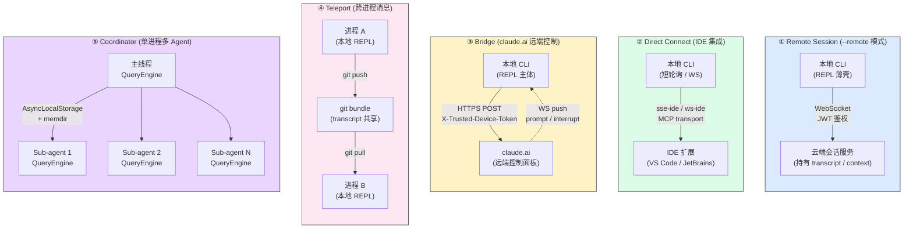
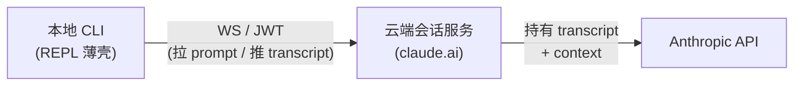
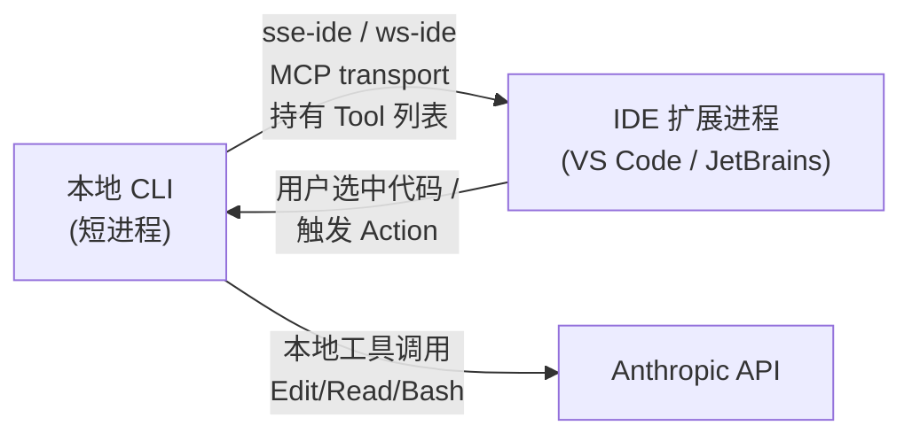
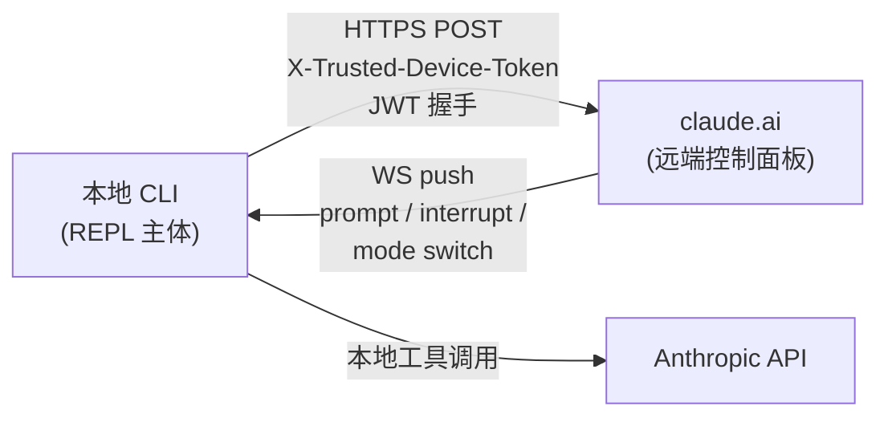
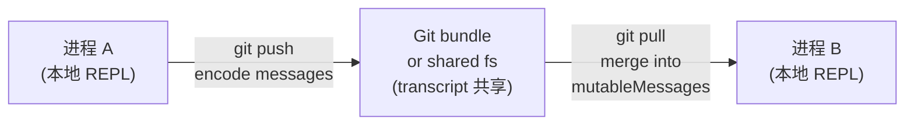
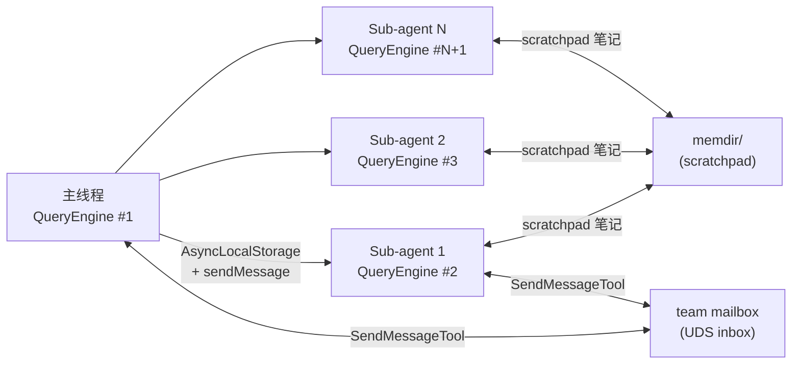

# 第 30a 章 5 种运行时拓扑 —— 进程级架构视图

> 本章是 [第 30 章](./30-subsystems.md) 的**进程级**展开,把 8 大子系统在 5 种不同部署形态下的拓扑画出来。每种拓扑对应不同的"谁启动谁 / 通信协议 / 状态归属 / 持久化策略",直接决定 8 个子系统的开关与降级路径。本章用架构师视角回答"我应该用哪种"。

---

## 摘要

Claude Code CLI 不是一个进程,而是 **5 种进程拓扑**的可变形体:Remote Session(本地 CLI → 云端会话)、Direct Connect(本地 CLI ↔ IDE 直接 WS)、Bridge(本地 CLI ↔ claude.ai 远端)、Teleport(本地 CLI 之间 git bundle 传消息)、Coordinator(单进程内多 Agent 协作)。每种拓扑由 L1 入口(`main.tsx`)按 argv 模式分发,各自有独立的**进程拓扑**(谁启动谁)、**通信协议**(WS/SSE/HTTP/git)、**状态归属**(本地 vs 云端)、**持久化策略**(transcript 文件位置)。8 个子系统的开与关、桥与降级,在 5 种拓扑下完全不同。

---

## 速赢

1. **5 种拓扑不是模式,是部署形态**。`-p` / `-c` / `bridge URL` / `claude.ai` 启动入口决定拓扑,影响所有子系统。
2. **进程拓扑**:Local REPL(单进程)↔ Bridge(本地 + 远端)↔ Remote Session(本地轻 + 云端重)↔ Coordinator(单进程多 Agent)↔ Teleport(进程间)。
3. **通信协议**:stdio(本地)、WS/SSE(Bridge、IDE)、HTTP(`/v1/environments/bridge`)、git bundle(Teleport)、UDS(InProcess teammate)。
4. **状态归属**:Local REPL/Coordinator 全本地;Bridge 关键状态本地 + 远端 capability 上报;Remote Session 关键状态云端,本地只镜像 UI;Teleport 通过 git 共享。
5. **持久化策略**:transcript 文件位置由 `CLAUDE_CODE_REMOTE` / `CLAUDE_CODE_ENTRYPOINT` 决定。`~/.claude/projects/<encoded-cwd>/` 是默认;remote 模式下落到 `/remote/<encoded-cwd>/` 子目录。

---

## 关键图 1:5 种运行时拓扑对比

---

## 关键图 2:5 种拓扑下 8 大子系统的开关矩阵

| 子系统 ↓ 拓扑 → | ① Remote Session | ② Direct Connect | ③ Bridge | ④ Teleport | ⑤ Coordinator |
|---|:---:|:---:|:---:|:---:|:---:|
| **MCP** | ✓(云端代理) | ✓(`sse-ide`) | ✓ | ✓ | ✓(fork 独立) |
| **Bridge** | ✗(被 Remote 替代) | ✗(被 IDE 替代) | ✓(本体) | ✓(进程间) | ✓(本地) |
| **Coordinator** | ✗(云端调度) | ✓ | ✓ | ✗(无 fork) | ✓(本体) |
| **Memory** | ✓(云端持久) | ✓ | ✓ | ✓(git) | ✓(memdir) |
| **Plugin/Skill** | △(云端白名单) | ✓ | ✓ | ✓ | ✓ |
| **Remote/Server** | ✓(本体) | ✗ | △(CCR 混合) | ✗ | ✗ |
| **LSP** | △(云端代理) | ✓(IDE 替代) | ✓ | ✓ | ✓ |
| **Compact** | ✓(云端) | ✓(本地) | ✓(本地) | ✓(本地) | ✓(fork 内) |

**矩阵阅读法**:
- **✓** = 子系统按设计全功能运行
- **△** = 子系统被降级或受限运行(例如:Remote Session 下 Plugin 走云端白名单,LSP 由云端代理)
- **✗** = 子系统在该拓扑下完全不参与,源码里 `getIsRemoteMode()` 或类似 flag 跳过

---

## 详细机制

### ① Remote Session:本地 CLI → 云端会话

**触发**:`claude --remote` 或 `CLAUDE_CODE_REMOTE=1` 环境变量,或 claude.ai 推送的 cc:// 协议链接。

**进程拓扑**:

**通信协议**:WebSocket(JWT 鉴权),本地 CLI 是**薄壳**,只承担 UI 渲染与本地副作用(MCP server、本地 IO)。

**状态归属**:
- transcript / context / totalUsage / permissionDenials **云端**(`cc.sessions.io`)
- 本地只镜像 UI 渲染所需字段:`messages`、`isLoading`、`tasks`
- 设置(settings.json)**本地**(走正常 L1 加载),云端通过 `~/.claude/settings.json` 同步

**持久化策略**:`CLAUDE_CODE_REMOTE` 为 true 时,transcript 落到 `~/.claude/projects/remote-<encoded-cwd>/<sessionId>.jsonl`。

**子系统开关**(对应源码读取 `getIsRemoteMode()`):
- **Plugin/Skill**:走云端白名单(`remoteManagedSettings`)。本地 `loadAllPluginsCacheOnly` 仍跑但 `enabled: false`。
- **MCP**:云端代理。本地 MCP server 仍可启,但 tool 实际执行在云端。
- **LSP**:云端代理。`useLspPluginRecommendation` 在本地不显示。
- **Coordinator**:完全跳过,云端调度 sub-agent。
- **Compact**:在云端跑,本地只看百分比。
- **Bridge**:**不参与**,被 Remote 自身替代。

**何时用**:用户想要"随时随地继续会话",transcript 必须云端持久。代价:断网不能用,延迟比 Local REPL 高。

---

### ② Direct Connect:本地 CLI ↔ IDE 集成

**触发**:IDE 扩展(VS Code / JetBrains)通过 MCP `sse-ide` / `ws-ide` transport 与本地 CLI 连接。CLI 不需要显式入口,IDE 拉起 `claude mcp serve` 或类似子命令。

**进程拓扑**:

**通信协议**:MCP `sse-ide` / `ws-ide` transport。IDE 既是 MCP client(订阅本地 tool 列表)又是 MCP server(暴露 selection、diagnostics 给 CLI)。

**状态归属**:
- transcript / context:本地(`~/.claude/projects/<encoded-cwd>/`)
- IDE selection / diagnostics:IDE 持有,CLI 拉取
- settings.json:本地 + IDE 扩展提供的 IDE-specific settings

**持久化策略**:与 Local REPL 相同(transcript 在本地)。

**子系统开关**:
- **MCP**:核心通道。`sse-ide` 是 MCP transport 的一种。
- **LSP**:被 IDE 替代。CLI 不再起 LSP server,IDE 自带。
- **Bridge**:不参与(被 IDE 替代)。
- **Plugin/Skill**:本地。
- **Remote/Server**:不参与。

**何时用**:用户在 IDE 内写代码,需要 AI 配合选中代码片段/触发 LSP-aware 操作。

---

### ③ Bridge:本地 CLI ↔ claude.ai 远端控制

**触发**:`/remote-control` slash 命令,或 `claude.ai` 网页打开 Remote Control。

**进程拓扑**:

**通信协议**:
- 上行(HTTPS POST):`POST /v1/environments/bridge` 注册设备 + JWT 握手
- 下行(WS):claude.ai 推 prompt / interrupt / mode 切换
- 鉴权:`X-Trusted-Device-Token`(`bridgeApi.ts:84-89`)+ JWT 1 年期(`workSecret.ts`)

**状态归属**:
- transcript / context / totalUsage:**本地**(transcript 在本地 disk)
- capability / 用户偏好:**远端**(claude.ai 持久化)
- permission request:本地决定,但**反向桥到 claude.ai 让用户在网页答**

**持久化策略**:与 Local REPL 相同。但 claude.ai 持久化用户的 Remote Control preference(开/关)。

**子系统开关**:
- **Bridge**:**本体**,关键子系统。
- **MCP**:`sse-ide` / `ws-ide` 是 Bridge 的承载 transport。
- **Plugin/Skill**:本地。
- **LSP**:本地。
- **Remote/Server**:不参与(Remote 是另一种拓扑)。
- **Compact**:本地。

**何时用**:用户在本地跑长任务,想用手机/平板从 claude.ai 监控或介入。

**关键失败熔断**:`useReplBridge.tsx:40` `MAX_CONSECUTIVE_INIT_FAILURES = 3`。详见 [第 32 章 · 安全](./32-security.md) §纵深防御。

---

### ④ Teleport:跨进程消息(git bundle)

**触发**:两个本地 CLI 实例需要共享消息(例如同一仓库的两个 worktree,或开发机 + 服务器)。

**进程拓扑**:

**通信协议**:**git bundle**(通过 `.git/` 或外部 bundle 文件)。两个 CLI 共享 transcript 文件系统,通过 git push/pull 同步。

**状态归属**:
- transcript:git 仓库持有(共享)
- context:每个 CLI 独立,但可以同步新消息
- permission:每个 CLI 独立(用户各自决定)

**持久化策略**:transcript 文件在 git 仓库内,git 的版本控制即历史。

**子系统开关**:
- **Coordinator**:不参与(无 fork,只有独立进程)。
- **Remote/Server**:不参与。
- **MCP**:本地。
- **Bridge**:本地(进程间通过 git,不通过 Bridge)。

**何时用**:用户在多机协作同一项目,希望两个 CLI 实例"无缝接力"。

**架构判断**:Teleport 是最少见的拓扑,主要用于代码 review / pair programming 场景。

---

### ⑤ Coordinator:单进程多 Agent

**触发**:AgentTool(`Agent({ agentType: 'general-purpose', prompt: '...' })`)在主线程被调用,或 `TeamCreate` 触发。

**进程拓扑**:

**通信协议**:**进程内**(单 Node 进程),通过 `AsyncLocalStorage`(运行时 context)与 `team mailbox`(消息队列)协作。

**状态归属**:
- 每个 sub-agent 有独立 `QueryEngine` 实例、独立 `mutableMessages`、独立 `totalUsage`。
- scratchpad(`memdir/`)**共享**:sub-agent 之间写笔记。
- mailbox(`teamContext.inProcessMailboxes`)**主线程持有**,sub-agent 通过 `SendMessageTool` 投递。

**持久化策略**:每个 sub-agent 的 transcript 写到 `~/.claude/projects/<encoded-cwd>/<sessionId>/<agentId>.jsonl`,**主线程 transcript 引用 sub-agent 的 transcript**(sidechain 形式)。

**子系统开关**:
- **Coordinator**:**本体**。
- **Memory**:`memdir/` + `teamMemorySync` 主导。
- **MCP**:每个 fork 独立连接(可能共享同一 server,也可能 fork 独立连接)。
- **Compact**:每个 fork 独立运行(`autoCompactIfNeeded` 在子 QueryEngine 实例里调)。
- **Bridge**:本地(不参与跨进程)。
- **LSP**:本地。
- **Plugin/Skill**:本地。
- **Remote/Server**:不参与。

**内存硬上限**:`TEAMMATE_MESSAGES_UI_CAP = 50`(`InProcessTeammateTask/types.ts:101`)。

**何时用**:复杂任务需要并行调研、对比、生成。

---

## 关键源码定位

| 拓扑 | 入口 | 关键 flag |
|---|---|---|
| Remote Session | `src/main.tsx` `--remote` 检测 | `CLAUDE_CODE_REMOTE`、`getIsRemoteMode()` |
| Direct Connect | `src/services/mcp/` `sse-ide` / `ws-ide` | MCP transport type |
| Bridge | `src/bridge/initReplBridge.ts:110` | `/remote-control` slash 命令 |
| Teleport | (外部脚本,gw 协议) | git bundle |
| Coordinator | `src/tools/AgentTool/runAgent.ts:122` | AgentTool 调用 |

---

## 架构判断:何时用哪种

| 场景 | 推荐拓扑 | 理由 |
|---|---|---|
| 本地开发、写代码 | **Local REPL**(不在 5 种内,默认) | 最简单、最低延迟、无网络依赖 |
| IDE 内选中代码片段 | **② Direct Connect** | IDE selection / diagnostics 必须从 IDE 来 |
| 跨设备继续会话 | **① Remote Session** 或 **③ Bridge** | Remote 用于"无缝接管",Bridge 用于"监控 + 介入" |
| 并行调研/对比 | **⑤ Coordinator** | fork 独立 QueryEngine,内存硬上限保护 |
| 团队 pair programming | **④ Teleport** | git 仓库即共享 transcript |
| 企业部署 + 集中策略 | **① Remote Session** + 远端托管设置 | `remoteManagedSettings` 推送到所有 CLI 实例 |

---

## 反模式

**❶ 在 Bridge 模式下手动同步 transcript**

Bridge 模式下 transcript 仍是本地写。手动同步会与 `recordTranscript` 重复写,造成 race condition。**正确做法**:让 `recordTranscript` 写本地,claude.ai 通过 WebSocket 订阅事件流即可。

**❷ Direct Connect 把 IDE 当 LLM client**

Direct Connect 的 LLM 调用仍在本地 CLI。IDE 只通过 MCP transport 与 CLI 通信,不该直接调 API。

**❸ Teleport 用文件锁**

git bundle 已经提供了原子提交语义。手动加文件锁反而破坏并发。**正确做法**:让 git 处理冲突,sub-agent 通过 mailbox 协商。

**❹ Coordinator 跨进程 fork**

Coordinator 是**单进程**多 Agent。跨进程 fork 会破坏 `AsyncLocalStorage` context,造成 mailbox 投递失败。**正确做法**:跨进程用 Bridge 或 Teleport,而不是 Coordinator。

---

## 引用

**前置**
- [`04-architect/25-layered-arch.md`](./25-layered-arch.md) —— L1 入口分发
- [`04-architect/30-subsystems.md`](./30-subsystems.md) —— 8 大子系统接口
- [`04-architect/32-security.md`](./32-security.md) —— Bridge JWT、X-Trusted-Device-Token

**平行**
- [`04-architect/30b-sandboxing.md`](./30b-sandboxing.md) —— 沙箱在各拓扑下的行为
- [`04-architect/31-performance.md`](./31-performance.md) —— Coordinator 内存硬上限

**后继**
- `04-architect/33-observability.md` —— 5 种拓扑的埋点差异

**源码定位**

| 拓扑 | 路径:行号 |
|---|---|
| Remote Session 开关 | `src/bootstrap/state.ts` `getIsRemoteMode()` |
| Direct Connect transport | `src/services/mcp/types.ts` `sse-ide` / `ws-ide` |
| Bridge init | `src/bridge/initReplBridge.ts:110` |
| Bridge 鉴权 | `src/bridge/bridgeApi.ts:84-89`、`src/bridge/workSecret.ts` |
| Coordinator fork | `src/utils/forkedAgent.ts`、`src/tools/AgentTool/runAgent.ts:122` |
| 多 agent 内存上限 | `src/tasks/InProcessTeammateTask/types.ts:101` |
| memdir scratchpad | `src/memdir/memoryTypes.ts:21` |
| mailbox | `src/utils/teammateMailbox.ts`、`src/utils/mailbox.ts:5` |