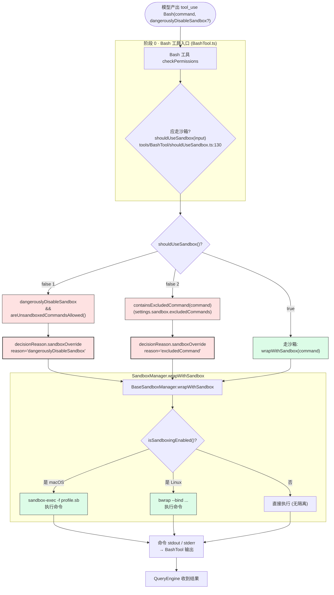

# 第 30b 章 沙箱子系统 —— 命令级隔离与决策链

> 本章是 [第 30 章](./30-subsystems.md) 中**沙箱**与 [第 29 章 · 权限系统](./29-permission.md) 中 **`sandboxOverride`** 决策原因的展开。沙箱是 Bash 工具的**最后一层物理隔离**,即使权限链路全部绕过(bypassPermissions + safetyCheck 误用),仍能阻止实际写磁盘/网络调用。本章聚焦 Bash sandbox 的入口、决策链、配置、UI 提示。

---

## 摘要

Claude Code CLI 的 Bash 沙箱是一个**进程级隔离层**,用 `sandbox-exec`(macOS)或 `bwrap`(Linux)限制被沙箱命令的写文件范围、网络出口、危险操作。决策点 `shouldUseSandbox`(`tools/BashTool/shouldUseSandbox.ts:130`)在命令真正执行前判定,有两个豁免理由:`excludedCommand`(用户在 `settings.json` 配置的排除列表)与 `dangerouslyDisableSandbox`(显式禁用)。豁免会以 `decisionReason: { type: 'sandboxOverride' }` 写入权限判定结果(详见 [第 29 章](./29-permission.md) §决策理由)。QueryEngine 在中断时会 `cleanupAfterCommand`,Computer-Use(`CHICAGO_MCP`)另有独立 sandbox。

---

## 速赢

1. **沙箱只针对 Bash 工具**。其他工具(Edit、Read、Write、WebFetch 等)的访问控制走权限层,不走 sandbox。
2. **决策点是 `shouldUseSandbox`**(`tools/BashTool/shouldUseSandbox.ts:130`),不是 `SandboxManager.wrapWithSandbox`。后者是物理执行,前者是"要不要走沙箱"的判定。
3. **两个豁免理由**:`dangerouslyDisableSandbox`(Bash 工具的 input 字段)+ `excludedCommands`(settings 数组)。豁免会以 `decisionReason: { type: 'sandboxOverride', reason: 'excludedCommand' | 'dangerouslyDisableSandbox' }` 写入权限判定。
4. **平台依赖**:macOS 用 `sandbox-exec`(Apple 内置),Linux 用 `bwrap`(需要用户安装)。Windows 不支持(被 `isSupportedPlatform()` 排除)。
5. **设置字段**:`settings.json` 的 `sandbox.enabled` / `sandbox.excludedCommands` / `sandbox.autoAllowBashIfSandboxed` / `sandbox.allowUnsandboxedCommands`。
6. **中断时清理**:`QueryEngine.ts:1033-1042` 在用户中断时调 `cleanupAfterCommand()` 解锁 lock 与 un-hide hidden files。

---

## 关键图 1:沙箱决策链



---

## 详细机制

### 1. 决策函数 `shouldUseSandbox`

```ts
// src/tools/BashTool/shouldUseSandbox.ts:130-152
export function shouldUseSandbox(input: Partial<SandboxInput>): boolean {
  if (!SandboxManager.isSandboxingEnabled()) {
    return false
  }

  // Don't sandbox if explicitly overridden AND unsandboxed commands are allowed by policy
  if (
    input.dangerouslyDisableSandbox &&
    SandboxManager.areUnsandboxedCommandsAllowed()
  ) {
    return false
  }

  if (!input.command) {
    return false
  }

  // Don't sandbox if the command contains user-configured excluded commands
  if (containsExcludedCommand(input.command)) {
    return false
  }

  return true
}
```

**返回值语义**:
- **`true`** = 应该走沙箱。`BashTool.call` 会调 `SandboxManager.wrapWithSandbox` 把命令包进 `sandbox-exec` / `bwrap`。
- **`false`** = 不走沙箱。`BashTool.call` 直接 fork 子进程执行。

### 2. 决策链上的三个 if

**① `isSandboxingEnabled()`** —— 平台与用户设置双重判断

```ts
// src/utils/sandbox/sandbox-adapter.ts
isSandboxingEnabled(): boolean {
  return getSettings_DEPRECATED().sandbox?.enabled !== false &&
    isSupportedPlatform() &&
    BaseSandboxManager.checkDependencies().available
}
```

注释里特别说明:**用户关闭(`sandbox.enabled: false`)不会让沙箱 UI 完全消失** —— `sandbox-toggle` 命令仍可重新打开;但 `areUnsandboxedCommandsAllowed()` 默认 true,所以一旦关闭,所有命令都"dangerously disable"。

**② `dangerouslyDisableSandbox && areUnsandboxedCommandsAllowed()`** —— 工具 input 字段豁免

`Bash` 工具的 input schema 允许 `dangerouslyDisableSandbox: boolean`。模型可显式置 true 跳过沙箱。但用户必须先在 `settings.sandbox.allowUnsandboxedCommands: true` 才允许此豁免。默认 false。

**③ `containsExcludedCommand(command)`** —— 用户配置的排除列表

```ts
// src/tools/BashTool/shouldUseSandbox.ts:21-128
function containsExcludedCommand(command: string): boolean {
  // ... ant-only disabled commands/substrings via GrowthBook
  
  const userExcludedCommands = settings.sandbox?.excludedCommands ?? []
  if (userExcludedCommands.length === 0) return false

  // Split compound commands (e.g. "docker ps && curl evil.com")
  let subcommands: string[]
  try {
    subcommands = splitCommand_DEPRECATED(command)
  } catch {
    subcommands = [command]
  }

  for (const subcommand of subcommands) {
    // Iteratively strip env var prefixes + safe wrappers until fixed-point
    const candidates = [trimmed]
    // ... handles "FOO=bar bazel ..." / "timeout 30 bazel ..."

    for (const pattern of userExcludedCommands) {
      const rule = bashPermissionRule(pattern)
      for (const cand of candidates) {
        // prefix / exact / wildcard match
      }
    }
  }
  return false
}
```

注释特别说明:

```ts
// NOTE: excludedCommands is a user-facing convenience feature, not a security boundary.
// It is not a security bug to be able to bypass excludedCommands — the sandbox permission
// system (which prompts users) is the actual security control.
```

`excludedCommands` 是**便利特性**而不是安全边界 —— 用户配错不会被审计,但仍受权限层保护。

### 3. 物理隔离层 `wrapWithSandbox`

```ts
// src/utils/sandbox/sandbox-adapter.ts:704-725
async function wrapWithSandbox(
  command: string,
  binShell?: string,
  customConfig?: Partial<SandboxRuntimeConfig>,
  abortSignal?: AbortSignal,
): Promise<string> {
  if (isSandboxingEnabled()) {
    if (initializationPromise) {
      await initializationPromise
    } else {
      throw new Error('Sandbox failed to initialize. ')
    }
  }
  return BaseSandboxManager.wrapWithSandbox(
    command,
    binShell,
    customConfig,
    abortSignal,
  )
}
```

`BaseSandboxManager` 在 macOS 是 `sandbox-exec` + `.sb` profile(profiles/sb/*),Linux 是 `bwrap`。两者的功能类似但 profile 写法不同。

**初始化承诺**(注释 `sandbox-adapter.ts:759-761`):

```ts
// Create the initialization promise synchronously (before any await) to prevent
// race conditions where wrapWithSandbox() is called before the promise is assigned.
initializationPromise = (async () => {
  // ...
})()
```

`initializationPromise` 必须在任何 `await` 之前同步赋值,避免 `wrapWithSandbox()` 与 `initialize()` 之间的 race condition。

### 4. 决策理由 `sandboxOverride` 如何写入权限层

`shouldUseSandbox` 返回 false 时,**BashTool 的 `checkPermissions`** 会把原因写入 `decisionReason`:

```ts
// src/types/permissions.ts:300-302
| { type: 'sandboxOverride'; reason: 'excludedCommand' | 'dangerouslyDisableSandbox' }
```

这条 reason 触发 [第 29 章 · 权限系统](./29-permission.md) 图 1 中的 `ASK1`/`ASK2`/`ASK3` 等路径之一:

- **1b 整工具 ask 规则** + sandbox auto-allow → 不弹窗(`permissions.ts:1183` 注释:"沙箱穿透")
- **1f 内容级 ask 规则** + sandbox auto-allow → 不弹窗

也就是说:**沙箱**与**权限**是正交的"两层防护" —— 沙箱用来阻断实际写入,权限用来确认用户意图。

### 5. 中断时清理:QueryEngine.ts:1033-1042

```ts
// src/QueryEngine.ts:1033-1042(注释 + 调用于 interrupt)
SandboxManager.cleanupAfterCommand()
```

`cleanupAfterCommand()` 干两件事:
1. **un-hide hidden files**:沙箱运行时把 `.git/`、`.claude/` 等临时 hide,中断时 un-hide 让用户能继续编辑。
2. **release lock**:沙箱持有 `.git/index.lock` 等临时锁,中断必须释放,否则后续命令永久阻塞。

注释特别指出:

```ts
// auto-unhide + lock release on interrupt
```

这条 cleanup 在 `interrupt()` 路径上同步执行,优先级高于 transcript 写入。

### 6. `entrypoints/sandboxTypes.ts`

L1 入口 `src/entrypoints/sandboxTypes.ts` 定义 sandbox 的**运行时类型**(`SandboxRuntimeConfig`),供 settings 反序列化。包含字段:

```ts
type SandboxRuntimeConfig = {
  enabled: boolean
  autoAllowBashIfSandboxed: boolean
  allowUnsandboxedCommands: boolean
  excludedCommands: string[]
  fsReadConfig: FsReadRestrictionConfig
  fsWriteConfig: FsWriteRestrictionConfig
  networkRestrictionConfig: NetworkRestrictionConfig
  // ...
}
```

这些字段也是 `SettingsJson` schema 的一部分,会通过 zod 校验。

### 7. Computer-Use 沙箱(`CHICAGO_MCP` feature)

`CHICAGO_MCP` 是 Anthropic 内部的 computer-use 沙箱,位于 `services/computerUse/`(`hostAdapter.ts`、`setupPortable.ts` 等)。Computer-use 是模型直接操控 GUI 的能力,需要更严格的沙箱。

```ts
// src/utils/computerUse/hostAdapter.ts 中引用 Logger + sandbox-aware 包装
```

`CHICAGO_MCP` 是 `feature()` gated,只在内部分发。详见 [第 1 章 · 特性开关](../01-foundation/03-feature-flags.md) `CHICAGO_MCP`。

---

## settings.json 配置详解

```jsonc
{
  "sandbox": {
    "enabled": true,
    "autoAllowBashIfSandboxed": true,
    "allowUnsandboxedCommands": false,
    "excludedCommands": ["docker:*", "podman:*"],
    "fsReadConfig": {
      "allowOnly": ["/Users/me/projects"],
      "deny": ["/etc/passwd"]
    },
    "fsWriteConfig": {
      "allowOnly": ["/Users/me/projects/**"],
      "deny": ["**/.git/objects/**"]
    },
    "network": {
      "allowManagedDomainsOnly": false,
      "allowedDomains": ["*.github.com", "pypi.org"],
      "deniedDomains": []
    }
  }
}
```

| 字段 | 类型 | 含义 | 默认 |
|---|---|---|---|
| `enabled` | boolean | 启用沙箱 | `true` |
| `autoAllowBashIfSandboxed` | boolean | 已沙箱化的命令自动 allow,不弹窗 | `true` |
| `allowUnsandboxedCommands` | boolean | 是否允许 `dangerouslyDisableSandbox` 生效 | `false` |
| `excludedCommands` | string[] | 永不沙箱的命令(prefix/exact/wildcard) | `[]` |
| `fsReadConfig` / `fsWriteConfig` | object | 文件系统读/写白名单/黑名单 | 平台默认 |
| `network.*` | object | 网络域名白名单/黑名单 | 平台默认 |

`/sandbox` slash 命令可交互式切换这些字段:

```
/sandbox                       # 显示状态
/sandbox enable                # enabled: true
/sandbox disable               # enabled: false
/sandbox auto-allow-bash on    # autoAllowBashIfSandboxed: true
/sandbox allow-unsandboxed on  # allowUnsandboxedCommands: true
```

实现见 `src/commands/sandbox-toggle/`。

---

## UI 提示与 violation 展示

沙箱拒绝时的 UI:

- **`SandboxViolationExpandedView.tsx`**(`src/components/permissions/`)展示哪个规则被违反(读 / 写 / 网络)
- **`SandboxViolationStore`**(`SandboxManager.getSandboxViolationStore()`)累积违规历史
- **`sandbox/`** 目录下还有:
  - `SandboxStatus.tsx`(顶栏状态指示)
  - `SandboxToggle.tsx`(`/sandbox` 命令的 Ink UI)

**`annotateStderrWithSandboxFailures`**(`sandbox-adapter.ts:962-963`):把 stderr 中的沙箱错误转成可读消息。例如 macOS `sandbox-exec` 报 `Operation not permitted`,会变成 "Sandbox denied write to /etc/passwd (not in allowOnly)"。

---

## 设计权衡

### 为什么 sandboxOverride 不算安全漏洞?

注释 `shouldUseSandbox.ts:18-20` 说得很清楚:

> excludedCommands is a user-facing convenience feature, not a security boundary. It is not a security bug to be able to bypass excludedCommands — the sandbox permission system (which prompts users) is the actual security control.

也就是说:**沙箱提供物理隔离,权限提供意图确认**。两者独立。如果用户配错 `excludedCommands`,权限层的 `ask` 对话框仍会弹 —— 这就够了。

### 为什么 `dangerouslyDisableSandbox` 还需 `allowUnsandboxedCommands` 双重开关?

两层保护:
1. **模型层面**:模型在 tool_use 里写 `dangerouslyDisableSandbox: true`(依赖 sandbox 决策)
2. **用户层面**:`settings.sandbox.allowUnsandboxedCommands: true` 才允许这个字段生效

任何一层为 false,豁免不生效。这让"模型想绕过沙箱"必须先让用户主动配置 —— 与 [第 32 章 · 安全](./32-security.md) §SendMessageTool 的双门设计同理。

### 为什么 cleanupAfterCommand 是同步的?

中断时如果不立刻释放 lock,后续命令会永久阻塞。注释 `QueryEngine.ts:1033-1042`:

```ts
// auto-unhide + lock release on interrupt
```

`process.exit()` 之前的最后一个 await 必须是 sync,且 timeout 极短(否则 setImmediate 异步任务会复活 beforeExit handler,造成死循环,见 [第 33 章 · 可观测性](./33-observability.md) §Debug 日志)。

---

## 反模式

**❶ 假设 sandbox 启用就一定能阻断网络**

```ts
// ✗ Bash tool call
await exec(`curl https://api.openai.com/v1/chat`)
```

如果 `network.allowedDomains` 没配,沙箱会拦截,但**默认配置允许 `localhost` 与 `*.anthropic.com`**(`sandbox.adapters/sandbox-runtime` 平台默认)。**正确做法**:在 settings.json 显式列 `deniedDomains`。

**❷ 让 `dangerouslyDisableSandbox` 默认 allow**

```jsonc
// ✗ settings.json
{ "sandbox": { "allowUnsandboxedCommands": true } }
```

这会让所有 `dangerouslyDisableSandbox: true` 的命令直接执行。**正确做法**:保持 `false`,只在需要时通过 `/sandbox` 临时切换。

**❸ 假设 macOS sandbox 与 Linux bwrap 等价**

两者 profile 语法不同(`.sb` vs `--bind`),且 macOS 没有 bind-mount 概念。**正确做法**:`convertToSandboxRuntimeConfig` 已经处理平台差异,不要绕过它手写 sandbox profile。

**❹ 在 `checkPermissions` 里写 sandbox 决策**

sandbox 决策在 `BashTool` 自己的 `call` 里走,**不在 `checkPermissions` 里**。如果写在 `checkPermissions`,会导致 [第 29 章](./29-permission.md) §反模式 ❷ 的"checkPermissions 副作用"问题(被调两次)。

---

## 引用

**前置**
- [`00-front/03-glossary.md`](../00-front/03-glossary.md) —— E.6 `Sandbox`
- [`04-architect/25-layered-arch.md`](./25-layered-arch.md) —— L3 调度层 + L5 服务层
- [`04-architect/29-permission.md`](./29-permission.md) —— `sandboxOverride` 决策原因
- [`04-architect/30-subsystems.md`](./30-subsystems.md) —— 8 大子系统中的沙箱位置

**平行**
- [`04-architect/32-security.md`](./32-security.md) —— 沙箱与权限的双层防御
- [`04-architect/33-observability.md`](./33-observability.md) —— sandbox 失败日志

**后继**
- `04-architect/34-patterns.md` —— "per-tool child AbortController" 模式在中 interrupt 处的应用

**源码定位**

| 关注点 | 路径:行号 |
|---|---|
| shouldUseSandbox 决策 | `src/tools/BashTool/shouldUseSandbox.ts:130-152` |
| containsExcludedCommand | `src/tools/BashTool/shouldUseSandbox.ts:21-128` |
| SandboxManager | `src/utils/sandbox/sandbox-adapter.ts:927-967` |
| wrapWithSandbox | `src/utils/sandbox/sandbox-adapter.ts:704-725` |
| 初始化 race-condition 防御 | `src/utils/sandbox/sandbox-adapter.ts:759-761` |
| 排除命令添加 | `src/utils/sandbox/sandbox-adapter.ts:828-874`(`addToExcludedCommands`) |
| sandboxToggle 命令 | `src/commands/sandbox-toggle/` |
| sandboxViolationStore | `src/utils/sandbox/sandbox-adapter.ts:917` |
| annotateStderrWithSandboxFailures | `src/utils/sandbox/sandbox-adapter.ts:962-963` |
| settings 类型 | `src/utils/settings/types.ts:1104`(sandbox 字段) |
| sandboxOverride 判别 | `src/types/permissions.ts:300-302` |
| QueryEngine 中断清理 | `src/QueryEngine.ts:1033-1042` |
| sandboxTypes 入口 | `src/entrypoints/sandboxTypes.ts` |
| Computer-Use 沙箱 | `src/utils/computerUse/hostAdapter.ts`、`src/utils/claudeInChrome/setupPortable.ts`(`CHICAGO_MCP` feature) |