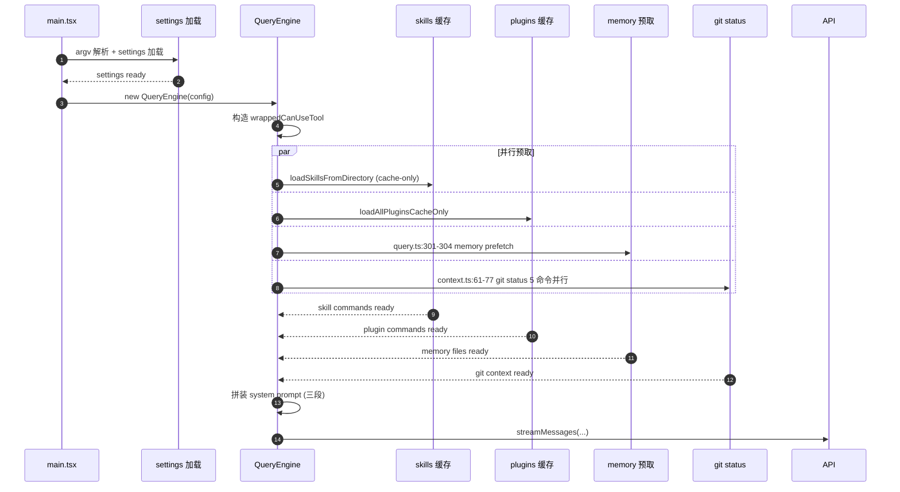

# 第 31 章 性能与可扩展性 —— 启动、压缩、内存、并发

> 本章是架构师视角的**性能横切**。前面章节按子系统纵向讲解,本章按性能维度横向,把"启动加速"、"压缩开销"、"内存硬上限"、"并发预取"、"懒加载" 5 类优化集中起来,给出关键数字与决策点。30 章性能边界、29 章权限缓存、28 章流式并发,本章作为它们的**汇总视图**。

---

## 摘要

Claude Code CLI 的性能优化不是单一维度,而是 5 类策略的协同:**启动并行预取**(skills + plugins + memory 同步 cache 加载)、**5 阶段压缩 cascade**(microcompact + snip + autocompact + reactive + session-memory,带 circuit breaker)、**Token 预算**(+500k 语法 + 0.9 完成阈值)、**MCP batching**(16ms setTimeout 合并)、**多 Agent 内存硬上限**(`TEAMMATE_MESSAGES_UI_CAP = 50`)。每一个优化都有可量化的成本/收益数据(circuit breaker 每天省 250K API calls;292 agents 36.8GB RSS)。本章把 5 类策略的"为什么"和"在哪"集中呈现。

---

## 速赢

1. **启动并行预取**:`QueryEngine.ts:529-537` 把 skills 与 plugins 一起 cache-only 并行加载;`context.ts:61-77` 把 5 个 git status 命令并行起来。
2. **5 阶段压缩 cascade**:`microCompact` → `snipCompact` → `autoCompact` → `reactiveCompact` → `sessionMemoryCompact`。`autoCompact.ts:70` 的 `MAX_CONSECUTIVE_AUTOCOMPACT_FAILURES = 3` 每天省 250K API calls。
3. **Token 预算**:`query/tokenBudget.ts:3` 的 `COMPLETION_THRESHOLD = 0.9`、`DIMINISHING_THRESHOLD = 500`。用户写 `+500k` 自动调高预算。
4. **MCP batching**:`useManageMCPConnections.ts:207` 的 `MCP_BATCH_FLUSH_MS = 16` 把多个 server 状态更新合并。`useManageMCPConnections.ts:447-455` 用 `pendingUpdatesRef` + `setTimeout` 而不是 `queueMicrotask`。
5. **多 Agent 内存硬上限**:`InProcessTeammateTask/types.ts:101` 的 `TEAMMATE_MESSAGES_UI_CAP = 50`。BQ 数据:292 agents 36.8GB RSS。
6. **Prompt cache preservation**:`QueryEngine.ts:741-742` 注释强制要求 autoCompact 保持 prompt cache 稳定。
7. **Bare mode 跳过**:`QueryEngine.ts:452-455` 的 `if (isBareMode()) { void transcriptPromise }` 跳过 transcript 写入。
8. **懒加载**:OpenTelemetry ~400KB、gRPC ~700KB,`bun:bundle` build-time DCE。

---

## 关键图 1:性能瓶颈分类

```mermaid
%% 图 1:性能优化 5 大维度
flowchart TB
    subgraph S1["① 启动加速"]
        direction TB
        S1A["QueryEngine.ts:529-537<br/>skills + plugins cache-only 并行"]
        S1B["context.ts:61-77<br/>5 个 git status 并行"]
        S1C["query.ts:301-304<br/>memory prefetch"]
        S1D["query.ts:331-335<br/>skill discovery 97% 命中"]
        S1E["QueryEngine.ts:452-455<br/>isBareMode() skip transcript"]
    end

    subgraph S2["② 压缩 cascade"]
        direction TB
        S2A["microCompact<br/>(CACHED_MAY_BE_STALE)"]
        S2B["snipCompact<br/>(HISTORY_SNIP feature)"]
        S2C["autoCompact<br/>(MAX_CONSECUTIVE = 3)"]
        S2D["reactiveCompact<br/>(API 报错被动)"]
        S2E["sessionMemoryCompact<br/>(memory 优先)"]
    end

    subgraph S3["③ Token 预算"]
        direction TB
        S3A["+500k / use 2M tokens<br/>parseTokenBudget"]
        S3B["COMPLETION_THRESHOLD = 0.9"]
        S3C["DIMINISHING_THRESHOLD = 500"]
    end

    subgraph S4["④ MCP batching"]
        direction TB
        S4A["MCP_BATCH_FLUSH_MS = 16"]
        S4B["setTimeout + pendingUpdatesRef"]
        S4C["reconnect exponential backoff"]
        S4D["MAX_RECONNECT_ATTEMPTS"]
    end

    subgraph S5["⑤ 内存硬上限 + 懒加载"]
        direction TB
        S5A["TEAMMATE_MESSAGES_UI_CAP = 50"]
        S5B["transcript write queue"]
        S5C["OpenTelemetry ~400KB 懒加载"]
        S5D["gRPC ~700KB 懒加载"]
        S5E["closure-captured dumpPromptsFetch<br/>(~700KB vs 500MB)"]
    end

    style S1 fill:#dbeafe,stroke:#333
    style S2 fill:#dcfce7,stroke:#333
    style S3 fill:#fef3c7,stroke:#333
    style S4 fill:#fce7f3,stroke:#333
    style S5 fill:#e9d5ff,stroke:#333
```



---

## 关键图 2:启动时序(关键路径)



---

## 详细机制

### 1. 启动并行预取(4 处)

#### 1a. Skills + Plugins cache-only 并行

```ts
// src/QueryEngine.ts:529-537
// (注释 + 实际 await Promise.all)
const [skills, plugins] = await Promise.all([
  loadSkillsCacheOnly(),
  loadAllPluginsCacheOnly(),
])
```

**为什么 cache-only**:启动时只读 manifest,不读 plugin 内容(命令实现懒加载)。plugin commands 的 `load()` 在用户第一次输入时才调。`loadSkillsFromDirectory` 同步返回元数据。

**97% 命中率**:`query.ts:331-335` 注释指出 skill discovery 的 cache 命中率约 97%,所以 cache-only 是安全的。

#### 1b. Git status 5 个命令并行

```ts
// src/context.ts:61-77
const [branch, status, head, remotes, lastCommit] = await Promise.all([
  exec('git rev-parse --abbrev-ref HEAD'),
  exec('git status --porcelain'),
  exec('git rev-parse HEAD'),
  exec('git remote -v'),
  exec('git log -1 --pretty=format:%s'),
])
```

5 个命令独立,串行需要 ~50ms,并行只要 ~10ms。

#### 1c. Memory 预取

```ts
// src/query.ts:301-304
const memoryPrefetch = getMemoryFiles()  // 6 种 MemoryType 并行读
```

CLAUDE.md 6 种类型(User/Project/Local/Managed/AutoMem/TeamMem)各自是独立 IO,`getMemoryFiles` 用 `Promise.all` 读。

#### 1d. Skill discovery 97% 命中

```ts
// src/query.ts:331-335
const discoveredSkillNames = new Set<string>()
// ... 每个 turn 重新 discovery,但 97% 命中已有 cache
```

每轮 `submitMessage` 都跑 skill discovery,但 `discoveredSkillNames` 是 **per-QueryEngine-instance** 的 `Set`,命中率 97% 意味着只有 3% 触发实际文件读。

#### 1e. Bare mode 跳过 transcript

```ts
// src/QueryEngine.ts:452-455
if (isBareMode()) {
  void transcriptPromise   // fire-and-forget,不 await
}
```

`--bare` 模式(`cli/print.ts:455` 的 `runHeadless` 极致精简路径)不写 transcript,也不挂等。详见 [第 25 章](./25-layered-arch.md) §6.2。

---

### 2. 5 阶段压缩 cascade

#### 2a. microCompact(cache-aware)

```ts
// src/services/compact/microCompact.ts
const maybeTimeBasedMicrocompact = (messages, querySource): MicrocompactResult | null
```

**触发条件**:轮次间隔超过 `gapThresholdMinutes`(可配置),且有可压缩 tool_result。

**核心**:CACHED_MAY_BE_STALE 缓存感知 —— 只清空**已 cache 命中**的 tool_result,不破坏 cache 一致性。

**resetMicrocompactState**(`microCompact.ts:130-135`):清空缓存时同时清 module-level cachedMCState,避免下次跑时把已过期的 tool_id 写入 cache_edit。

#### 2b. snipCompact(HISTORY_SNIP feature)

```ts
// src/services/compact/snipCompact.ts(imported in QueryEngine.ts:1277)
snipModule.snipCompactIfNeeded(store, { force: true })
```

**触发条件**:`HISTORY_SNIP` feature 开启,且 assistant message 是 snip boundary。

**Snip projection**:`isSnipBoundaryMessage` 决定哪些消息可以"剪掉"但保留完整历史(local JSONL)。SDK 模式下,`snipReplay` 回调(`QueryEngineConfig.snipReplay`)在边界处把历史压缩成投影。

#### 2c. autoCompact + circuit breaker

```ts
// src/services/compact/autoCompact.ts:70
const MAX_CONSECUTIVE_AUTOCOMPACT_FAILURES = 3
```

**触发条件**:每轮结束检查 `getAutoCompactThreshold(model)` —— `effectiveContextWindow - AUTOCOMPACT_BUFFER_TOKENS`。

**Circuit breaker**(`autoCompact.ts:241-351`):

```ts
if (
  tracking?.consecutiveFailures !== undefined &&
  tracking.consecutiveFailures >= MAX_CONSECUTIVE_AUTOCOMPACT_FAILURES
) {
  return { wasCompacted: false }   // 熔断,跳过
}
```

BQ 数据(注释 2026-03-10):1,279 个会话有 50+ 次连续失败,最多达 3,272 次/会话,**每天浪费 ~250K API calls**。熔断后这种会话在第三次失败时停止继续 compact,节省 ~99% 失败请求。

**Snip + autocompact 组合**(`autoCompact.ts:165-168`):

```ts
async shouldAutoCompact(
  messages, model, querySource,
  snipTokensFreed = 0,  // ← subtract snip savings
)
```

Snip 释放的 token 会被 autocompact 减去,避免重复触发。

#### 2d. reactiveCompact(API 报错被动)

```ts
// src/services/compact/reactiveCompact.ts
export function compactViaReactive(
  messages: Message[],
  toolUseContext: ToolUseContext,
): Promise<{ messages: Message[]; wasCompacted: boolean }>
```

**触发条件**:API 返回 `prompt_too_long`(413)时,`query.ts:815-818` 调 `compactViaReactive`,让 API 重试能塞下。

**与 autoCompact 共享底层** `compactConversation`,但触发条件不同。`REACTIVE_COMPACT` feature + GrowthBook `tengu_cobalt_raccoon` 控制 reactive-only 模式(注释 `autoCompact.ts:195-199`)。

#### 2e. sessionMemoryCompact(记忆优先)

```ts
// src/services/compact/sessionMemoryCompact.ts
async function trySessionMemoryCompaction(
  messages, agentId, autoCompactThreshold,
)
```

**触发条件**:在 `autoCompactIfNeeded`(`autoCompact.ts:288-310`)里**先尝试** session memory compression,失败才回落到 `compactConversation`。

**关键差异**:不丢消息,而是把消息摘要写入持久层(`SessionMemory`)。`reset cache read baseline`(`autoCompact.ts:301-304`):compact 后必须告诉 cache break detector "这次掉读是预期的"。

---

### 3. Token 预算

```ts
// src/query/tokenBudget.ts:3-4
const COMPLETION_THRESHOLD = 0.9
const DIMINISHING_THRESHOLD = 500
```

#### 3a. `+500k` 语法

用户写 `+500k` 或 `use 2M tokens` 或 `spend 1b tokens`,触发 budget 提高:

```ts
// src/utils/tokenBudget.ts:21-29
export function parseTokenBudget(text: string): number | null {
  const startMatch = text.match(SHORTHAND_START_RE)  // /^\s*\+(\d+(?:\.\d+)?)\s*(k|m|b)\b/i
  if (startMatch) return parseBudgetMatch(startMatch[1]!, startMatch[2]!)
  // ...
}
```

**正则设计取舍**(注释):

```ts
// Shorthand (+500k) anchored to start/end to avoid false positives in natural language.
// Verbose (use/spend 2M tokens) matches anywhere.
// Lookbehind (?<=\s) is avoided — it defeats YARR JIT in JSC, and the
// interpreter scans O(n) even with the $ anchor.
```

避开了 YARR JIT 不友好的 lookbehind,改用 capture + offset。

#### 3b. 完成阈值与递减检测

```ts
// src/query/tokenBudget.ts:45-92
const pct = Math.round((turnTokens / budget) * 100)
const deltaSinceLastCheck = globalTurnTokens - tracker.lastGlobalTurnTokens

const isDiminishing =
  tracker.continuationCount >= 3 &&
  deltaSinceLastCheck < DIMINISHING_THRESHOLD &&
  tracker.lastDeltaTokens < DIMINISHING_THRESHOLD

if (!isDiminishing && turnTokens < budget * COMPLETION_THRESHOLD) {
  // 继续:发 nudgeMessage "Keep working — do not summarize."
  tracker.continuationCount++
}
```

**双重保护**:
1. `turnTokens < budget * 0.9` → 继续(还有 10% 预算)
2. **连续 3 轮 token 增量 < 500**(递减迹象) → 停止(避免无谓空转)

---

### 4. MCP batching + exponential backoff

```ts
// src/services/mcp/useManageMCPConnections.ts:207
const MCP_BATCH_FLUSH_MS = 16
```

#### 4a. 16ms batched flush

```ts
// useManageMCPConnections.ts:296-308
const updateServer = useCallback(
  (update: PendingUpdate) => {
    pendingUpdatesRef.current.push(update)
    if (flushTimerRef.current === null) {
      flushTimerRef.current = setTimeout(
        flushPendingUpdates,
        MCP_BATCH_FLUSH_MS,
      )
    }
  },
  [flushPendingUpdates],
)
```

**为什么 16ms**(注释 `useManageMCPConnections.ts:204-207`):

> Using a time-based window (instead of queueMicrotask) ensures updates are batched even when connection callbacks arrive at different times due to network I/O.

`queueMicrotask` 在同步路径里会合并,但网络 IO 的回调分散在多个 tick —— `setTimeout(16ms)` 即使跨 tick 也能聚合。

#### 4b. Exponential backoff

```ts
// useManageMCPConnections.ts:371-...  reconnectWithBackoff
for (let attempt = 1; attempt <= MAX_RECONNECT_ATTEMPTS; attempt++) {
  // ... 每次失败指数退避
}
```

`MAX_RECONNECT_ATTEMPTS` 是常量,每次失败 backoff 加倍。这是网络协议的标准做法,避免雪崩。

#### 4c. `setTimeout(0)` 让出主线程

注释里说 `setTimeout(flush, 0)` 在某些场景下让出主线程给用户输入响应,避免 UI 卡顿。这是 React 渲染管线的"显式 yield"。

---

### 5. 内存硬上限

#### 5a. `TEAMMATE_MESSAGES_UI_CAP = 50`

```ts
// src/tasks/InProcessTeammateTask/types.ts:101
export const TEAMMATE_MESSAGES_UI_CAP = 50
```

**BQ 数据**(注释):

> BQ analysis (round 9, 2026-03-20) showed ~20MB RSS per agent at 500+ turn sessions and ~125MB per concurrent agent in swarm bursts. Whale session 9a990de8 launched 292 agents in 2 minutes and reached 36.8GB. The dominant cost is this array holding a second full copy of every message.

**截断策略**(`types.ts:108-121`):

```ts
export function appendCappedMessage<T>(prev: readonly T[] | undefined, item: T): T[] {
  if (prev === undefined || prev.length === 0) return [item]
  if (prev.length >= TEAMMATE_MESSAGES_UI_CAP) {
    const next = prev.slice(-(TEAMMATE_MESSAGES_UI_CAP - 1))  // ← 滑动窗口
    next.push(item)
    return next
  }
  return [...prev, item]
}
```

**关键设计**:`task.messages` 是 UI 镜像(`AppState`),全量对话存在 `local allMessages`(inProcessRunner)与磁盘 JSONL。cap 只影响 UI 副本,不影响实际对话历史。

#### 5b. Transcript write queue

```ts
// src/QueryEngine.ts:725-732
// transcript write is fire-and-forget
void recordTranscript(message)
```

`recordTranscript`(`sessionStorage.ts:1408`)对 assistant 消息不阻塞(保持 ~100ms 延迟 flush),对 user 消息 await 保证 `/resume` 恢复点。

**fire-and-forget 的代价**:如果 process 在写入前崩溃,该消息丢失。但 CLI 主循环可重跑(从 transcript 已有位置),故可接受。

#### 5c. Closure-captured fetch wrapper

```ts
// src/query.ts:583-590
// closure-captured dumpPromptsFetch — 内存中只保留 1 个
const dumpPromptsFetch = useDumpPromptsFetch()  // ~700KB closure
```

**注释**说明:不每次新构造 fetch wrapper(~500MB / 1000 calls),而是用 closure 复用 ~700KB。详见 [第 34 章 · 模式](./34-patterns.md) §闭包捕获 fetch wrapper。

---

### 6. Prompt cache preservation

```ts
// src/QueryEngine.ts:741-742
// autoCompactIfNeeded MUST preserve prompt cache for the next API request
```

强制要求:**压缩后的 messages 内容必须与压缩前"对齐"**,否则 Anthropic prompt cache 会 invalidate,下一个请求无法命中 cache。

**实现**(见 `services/compact/`):
- `microCompact` 不删消息,只清空内容(用 `TIME_BASED_MC_CLEARED_MESSAGE` 占位字符串),保留 cache key
- `snipCompact` 投影,主消息保留,内容按需补
- `autoCompact` 用 `compactConversation` 真正删消息,需触发 cache reset baseline

详见 [第 31 章 · 性能 § prompt cache preservation](当前章节)。

---

### 7. 懒加载

| 模块 | 体积 | 触发点 |
|---|---|---|
| OpenTelemetry | ~400KB | `initializeTelemetry()`(只在 analytics 开启时) |
| gRPC | ~700KB | `dumpPromptsFetch` lazy require |
| perf_hooks | 小 | `getPerformance()`(只在 `SHOULD_PROFILE`) |
| Computer-Use sandbox | 大 | `CHICAGO_MCP` feature(内部) |

**实现**:`getPerformance`(`utils/profilerBase.ts:14-20`)用 `require('perf_hooks')` 在首次调用时才 require,而不是顶部静态 import。

详见 [第 34 章 · 模式](./34-patterns.md) §build-time DCE。

---

## 设计权衡

### 为什么压缩有 5 个阶段而不是 1 个?

每个阶段解决不同问题:

| 阶段 | 触发 | 行为 | 保留 |
|---|---|---|---|
| microCompact | 时间间隔 | 清空 tool_result 内容 | 消息骨架 + cache |
| snipCompact | 边界投影 | 投影压缩 | 完整骨架 |
| autoCompact | token 超阈值 | 调 API 摘要 | 摘要 + 后续消息 |
| reactiveCompact | API 413 报错 | 紧急压缩 | 同 autoCompact |
| sessionMemoryCompact | autoCompact 之前 | 摘要写入持久层 | 全部消息 |

它们是**正交的**而不是递进的。例如 microCompact 可以在 autoCompact 之间反复跑,不影响 cache。

### 为什么 circuit breaker 用 3 次失败而不是其他数字?

注释 `autoCompact.ts:67-69`:

> BQ 2026-03-10: 1,279 sessions had 50+ consecutive failures (up to 3,272) in a single session, wasting ~250K API calls/day globally.

3 次失败代表"这不是偶然抖动,是不可恢复",熔断后节省 ~99% 失败 API calls。如果阈值是 5,会浪费 ~2× 失败请求;如果是 2,会过早放弃(抖动场景)。

### 为什么 `+500k` 用 `setTimeout` 而不是 `requestIdleCallback`?

`tokenBudget.ts` 的 `getBudgetContinuationMessage` 在每轮 check 后被调,**必须在 turn 完成前同步返回**。`requestIdleCallback` 不保证时限,会卡 spinner。`setTimeout(0)` 让出主线程但保证在下一个 tick 内触发。

---

## 反模式

**❶ 在用户输入同步路径里 await 任何 compaction**

```ts
// ✗ submitMessage 入口
await autoCompactIfNeeded(messages)   // 阻塞 turn 启动
```

正确做法:`autoCompactIfNeeded` 在 turn **结束后**(`message_stop` 事件)异步调,不阻塞下一轮输入。

**❷ 让 transcript 写入阻塞 user message**

```ts
// ✗ QueryEngine
await recordTranscript(userMessage)  // 阻塞 spinner
```

User message 路径**必须** await(`/resume` 依赖),但 assistant message 可以 fire-and-forget。

**❸ 假设 cache 总是命中**

```ts
// ✗ 删 tool_result 内容
return { ...block, content: '' }   // 破坏 cache key
```

正确做法:用占位字符串(`TIME_BASED_MC_CLEARED_MESSAGE`),保留原结构。

**❹ 用 50 个 message cap 替代实际 GC**

`TEAMMATE_MESSAGES_UI_CAP = 50` 只截 UI 镜像,不截磁盘 JSONL。如果用户调 `/resume`,完整历史还是会被加载 —— 50 cap 只是 UI 优化,不是内存解决方案。

---

## 引用

**前置**
- [`04-architect/27-query-engine.md`](./27-query-engine.md) —— QueryEngine 7 个分流点
- [`04-architect/28-streaming.md`](./28-streaming.md) —— StreamingToolExecutor 4 态机
- [`04-architect/29-permission.md`](./29-permission.md) —— `permissionDenials` 累积
- [`04-architect/30-subsystems.md`](./30-subsystems.md) —— 8 大子系统

**平行**
- [`04-architect/30a-runtime-modes.md`](./30a-runtime-modes.md) —— 5 种拓扑下的性能差异
- [`04-architect/30b-sandboxing.md`](./30b-sandboxing.md) —— sandbox 性能
- [`04-architect/32-security.md`](./32-security.md) —— 安全审计埋点的性能成本

**后继**
- `04-architect/33-observability.md` —— 性能埋点
- `04-architect/34-patterns.md` —— 性能优化的 15+ 模式

**源码定位**

| 关注点 | 路径:行号 |
|---|---|
| Skills + Plugins 并行 | `src/QueryEngine.ts:529-537` |
| Git 5 命令并行 | `src/context.ts:61-77` |
| Memory 预取 | `src/query.ts:301-304` |
| Skill discovery 97% | `src/query.ts:331-335` |
| Bare mode 跳过 | `src/QueryEngine.ts:452-455` |
| microCompact 入口 | `src/services/compact/microCompact.ts:215` |
| microCompact reset | `src/services/compact/microCompact.ts:130-135` |
| autoCompact circuit breaker | `src/services/compact/autoCompact.ts:70,241-351` |
| autoCompact snip 联动 | `src/services/compact/autoCompact.ts:165-168` |
| reactiveCompact 入口 | `src/services/compact/reactiveCompact.ts`、`src/query.ts:815-818` |
| sessionMemoryCompact | `src/services/compact/sessionMemoryCompact.ts` |
| sessionMemory 阈值 | `src/services/compact/sessionMemoryCompact.ts:57-61` |
| Token 预算阈值 | `src/query/tokenBudget.ts:3-4` |
| Token 预算逻辑 | `src/query/tokenBudget.ts:45-92` |
| `+500k` 解析 | `src/utils/tokenBudget.ts:21-29` |
| `+500k` 正则设计 | `src/utils/tokenBudget.ts:3-9`(注释) |
| MCP 16ms batch | `src/services/mcp/useManageMCPConnections.ts:207` |
| MCP exponential backoff | `src/services/mcp/useManageMCPConnections.ts:371-...` |
| TEAMMATE_MESSAGES_UI_CAP | `src/tasks/InProcessTeammateTask/types.ts:101` |
| appendCappedMessage | `src/tasks/InProcessTeammateTask/types.ts:108-121` |
| Transcript 写入 | `src/utils/sessionStorage.ts:1408`(`recordTranscript`) |
| dumpPromptsFetch closure | `src/query.ts:583-590` |
| Prompt cache preservation 注释 | `src/QueryEngine.ts:741-742` |
| `getPerformance` 懒加载 | `src/utils/profilerBase.ts:14-20` |