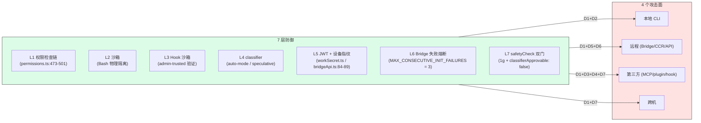

# 第 32 章 安全与信任模型 —— 攻击面、纵深防御、认证

> 本章是架构师视角的**安全横切**。前面 [第 29 章 · 权限系统](./29-permission.md) 详细讲了五阶段权限检查链;本章从**威胁模型**出发,画出 CLI 的完整攻击面,梳理纵深防御的 6 个实例,以及认证、工作租约、跨机桥接安全等关键机制。安全不是单点,而是 7 层防御的协同。

---

## 摘要

Claude Code CLI 的威胁模型覆盖 4 个攻击面:**本地 CLI**(Shell 执行、文件操作、MCP)、**远程**(Bridge、CCR、API)、**第三方**(MCP server、plugins、hooks、HTTP hooks)、**跨机**(SendMessageTool bridge)。防御不是单层,而是 7 层纵深:**权限检查链 → 沙箱(物理隔离)→ Hook 沙箱 → classifier(自动模式)→ JWT 认证 → Bridge 失败熔断 → safetyCheck 双门**。关键防御机制包括 `findOverlyBroadBashPermissions`(`permissionSetup.ts:379-411`)、`tengu_disable_bypass_permissions_mode` Statsig gate、Bridge JWT 1 年期、`useAutoModeDuringPlan` 三态不变量、SendMessageTool 的 `safetyCheck + classifierApprovable: false` 双门。本章用攻击面图与防御矩阵回答"哪里最弱"。

---

## 速赢

1. **4 个攻击面 × 7 层防御**。最弱环节是第三方(MCP server + plugin + hook),最强环节是认证(JWT + Keychain + 设备指纹)。
2. **`findOverlyBroadBashPermissions`**(`permissionSetup.ts:379-411`)检测 `Bash` / `Bash(*)` 这种"全放行"规则,等同于 YOLO 模式。
3. **`tengu_disable_bypass_permissions_mode` Statsig gate**(`permissionSetup.ts:337-352`):企业可以远端关闭 bypass mode,而用户本地 settings 无法恢复。
4. **Bridge JWT 1 年期**(`workSecret.ts`)+ `X-Trusted-Device-Token`(`bridgeApi.ts:84-89`)双重鉴权。失败熔断 `MAX_CONSECUTIVE_INIT_FAILURES = 3`(`useReplBridge.tsx:40`)。
5. **SendMessageTool 跨机桥接**(`SendMessageTool.ts:585-602`):`safetyCheck + classifierApprovable: false` 双门,既免疫 bypass,又免疫 auto-mode 分类器。
6. **Speculative bash classifier**(投机预测 + 2 秒竞速):常见安全命令免打扰,降低用户开 bypass 的诱惑。
7. **`useAutoModeDuringPlan` 三态不变量**:plan / auto / both 严格互斥。

---

## 关键图 1:攻击面图

```mermaid
%% 图 1: Claude Code CLI 的 4 个攻击面
flowchart TB
    subgraph LOCAL["① 本地 CLI 攻击面"]
        direction TB
        L1["Shell 执行 (Bash 工具)"]
        L2["文件操作 (Read/Edit/Write)"]
        L3["子进程 (Bash spawn)"]
        L4["环境变量 (process.env)"]
        L5["~/.claude/ 配置目录"]
        L6["本地 socket / pipe"]
    end

    subgraph REMOTE["② 远程攻击面"]
        direction TB
        R1["Bridge (claude.ai)"]
        R2["CCR (Claude Code Remote)"]
        R3["Anthropic API"]
        R4["/v1/environments/bridge HTTPS"]
        R5["WebSocket (双向)"]
    end

    subgraph THIRD["③ 第三方攻击面"]
        direction TB
        T1["MCP server (任意来源)"]
        T2["Plugin (marketplace)"]
        T3["Hook (任意 shell)"]
        T4["HTTP hooks (POST URL)"]
        T5[".claude/skills/ (本地 markdown)"]
        T6["Command frontmatter (任意)"]
    end

    subgraph CROSS["④ 跨机攻击面"]
        direction TB
        C1["SendMessageTool bridge"]
        C2["claude_ai_proxy transport"]
        C3["PostInterClaudeMessage"]
        C4["UDS inbox"]
    end

    subgraph PROMPT["⑤ 提示词注入 (跨面)"]
        direction TB
        P1["User prompt"]
        P2["Tool result 内容"]
        P3["Hook stdout"]
        P4["MCP server 响应"]
        P5["Git commit message / README"]
    end

    LOCAL <-- "·" --> PROMPT
    REMOTE <-- "·" --> PROMPT
    THIRD <-- "·" --> PROMPT
    CROSS <-- "·" --> PROMPT

    style LOCAL fill:#dbeafe,stroke:#333
    style REMOTE fill:#dcfce7,stroke:#333
    style THIRD fill:#fee2e2,stroke:#333
    style CROSS fill:#fef3c7,stroke:#333
    style PROMPT fill:#fce7f3,stroke:#333,stroke-dasharray:5 5
```



> **关键解读**:5 个面互相连通,提示词注入(⑤)是**横切威胁** —— 不属于任何单面,而是跨面的。

---

## 关键图 2:7 层防御矩阵



---

## 详细机制

### 1. 攻击面分解

#### ① 本地 CLI

| 子面 | 威胁 | 防御 |
|---|---|---|
| Shell 执行 | `rm -rf /`、恶意 payload | Bash sandbox + 权限 + classifier |
| 文件操作 | 读 `~/.ssh/`、写 `/etc/` | path 白名单 + permission context |
| 子进程 | 子命令逃逸 | sandbox profile + excluded commands |
| 环境变量 | `AWS_SECRET_KEY` 泄漏 | 隔离 process.env |
| `~/.claude/` | 篡改 settings.json | 文件权限 0600 + 校验 zod schema |
| 本地 socket | 跨用户访问 | unix socket 权限 |

#### ② 远程

| 子面 | 威胁 | 防御 |
|---|---|---|
| Bridge | claude.ai 推送恶意 prompt | JWT 1 年期 + X-Trusted-Device-Token |
| CCR | 远端会话劫持 | 远端托管设置 + 强制 allowlist |
| Anthropic API | API key 泄漏 | OAuth 1 年期 inference token |
| `/v1/...` HTTPS | MITM | HTTPS + certificate pinning |
| WebSocket | 远端推送未授权 prompt | 鉴权 + fail-closed |

#### ③ 第三方

| 子面 | 威胁 | 防御 |
|---|---|---|
| MCP server | 任意 tool 实现 | Tool<T,P> 合约 + checkPermissions |
| Plugin | marketplace 投毒 | signature 验证 + 用户确认 |
| Hook | 任意 shell | admin-trusted 验证 + 来源白名单 |
| HTTP hooks | 任意 POST URL | allowlist + 鉴权 |
| `.claude/skills/` | markdown 投毒 | frontmatter 校验 + 来源限制 |
| Command frontmatter | 模型可执行任意 prompt | source 验证 |

#### ④ 跨机

| 子面 | 威胁 | 防御 |
|---|---|---|
| SendMessageTool bridge | 跨机提示词注入 | safetyCheck + classifierApprovable: false |
| claude_ai_proxy | 中间人篡改消息 | transport 鉴权 |
| PostInterClaudeMessage | 远端伪造消息 | handle 校验 + from 字段 |
| UDS inbox | 本地 socket 注入 | 文件权限 + 内容校验 |

#### ⑤ 提示词注入(横切威胁)

**威胁模型**:LLM 把不可信内容(user prompt、tool result、hook stdout、MCP 响应、git commit message、README)当作"指令"执行。这是 LLM 时代的**新攻击面**,传统安全模型无法应对。

**Claude Code 的应对**:
1. **permission denials**:让所有"危险"操作必须用户确认(`safetyCheck` 双门)
2. **classifier**:对 Bash 等危险 tool 做二次确认
3. **跨机桥接的特殊对待**:`SendMessageTool` 的 `classifierApprovable: false` —— 跨机消息必须人类确认,连分类器都不能

---

### 2. 关键防御机制

#### 2a. `findOverlyBroadBashPermissions`

```ts
// src/utils/permissions/permissionSetup.ts:379-411
export function findOverlyBroadBashPermissions(
  rules: PermissionRule[],
  cliAllowedTools: string[],
): DangerousPermissionInfo[] {
  const overlyBroad: DangerousPermissionInfo[] = []

  for (const rule of rules) {
    if (
      rule.ruleBehavior === 'allow' &&
      isOverlyBroadBashAllowRule(rule.ruleValue)
    ) {
      overlyBroad.push({...})
    }
  }

  for (const toolSpec of cliAllowedTools) {
    const parsed = permissionRuleValueFromString(toolSpec)
    if (isOverlyBroadBashAllowRule(parsed)) {
      overlyBroad.push({...})
    }
  }

  return overlyBroad
}
```

`isOverlyBroadBashAllowRule`(`:351-357`)匹配 `Bash`、`Bash(*)`、`Bash()` —— 全部解析为 `{ toolName: 'Bash', ruleContent: undefined }`,即"全放行"。

**等价于 YOLO**:用户配了 `permissions.allow: ['Bash']` 就等于开 bypass mode,但 `permissionSetup.ts` 仍把它当作普通规则处理 —— 这是一致性问题。`findOverlyBroadBashPermissions` 在 `addPermissionRules` / `applySettingsChange` 路径上检查,**用户保存时弹出警告**。

#### 2b. `tengu_disable_bypass_permissions_mode` Statsig gate

```ts
// src/utils/permissions/permissionSetup.ts:337-352
const disableBypassPermissionsMode =
  growthBookDisableBypassPermissionsMode || settingsDisableBypassPermissionsMode

for (const mode of orderedModes) {
  if (mode === 'bypassPermissions' && disableBypassPermissionsMode) {
    notification = growthBookDisableBypassPermissionsMode
      ? 'Bypass permissions mode was disabled by your organization policy'
      : 'Bypass permissions mode was disabled by settings'
    continue                          // 跳过,试下一个
  }
  result = { mode, notification }
  break
}
```

**威胁**:用户开 `--dangerously-skip-permissions` 等于"完全访问",企业部署不能允许。

**防御**:Statsig 远端开关(`tengu_disable_bypass_permissions_mode`)+ settings 本地开关。**远端优先**,即使用户本地改 settings 也无法恢复。这是企业管控的核心机制。

#### 2c. Bridge 失败熔断

```ts
// src/hooks/useReplBridge.tsx:40
const MAX_CONSECUTIVE_INIT_FAILURES = 3

// src/hooks/useReplBridge.tsx:64-67
const consecutiveFailuresRef = useRef(0)
```

详见 [第 30 章 · 子系统](./30-subsystems.md) §Bridge 与 [第 30a 章 · 运行时拓扑](./30a-runtime-modes.md) §Bridge。

**关键**:`useRef` 而非 `useState` —— 跨 effect 重跑存活,用户反复切换 `/bridge` 也不会重置。

#### 2d. Speculative bash classifier

详见 [第 29 章 · 权限系统](./29-permission.md) §纵深防御的三个实例 ③。

```ts
// src/hooks/useCanUseTool.tsx:126-159
if (feature('BASH_CLASSIFIER') && result.pendingClassifierCheck &&
    tool.name === BASH_TOOL_NAME && ...) {
  const speculativePromise = peekSpeculativeClassifierCheck(command)
  if (speculativePromise) {
    const raceResult = await Promise.race([
      speculativePromise.then(r => ({ type: 'result' as const, result: r })),
      new Promise<{type:'timeout'}>(res => setTimeout(res, 2000, { type: 'timeout' as const })),
    ])
    if (raceResult.type === 'result' && raceResult.result.matches &&
        raceResult.result.confidence === 'high' && feature('BASH_CLASSIFIER')) {
      consumeSpeculativeClassifierCheck(command)
      // → allow · reason=classifier
    }
  }
}
```

**降级诱惑的反制**:用户开 bypass 是因为"每个 git status 都要弹窗"。投机分类器让常见命令免打扰,把用户留在有防护的模式里。

#### 2e. `useAutoModeDuringPlan` 三态不变量

`Plan Mode`(`PermissionMode = 'plan'`)与 `Auto Mode`(`auto`)严格互斥。`useAutoModeDuringPlan` 是三态 hook:

| `mode` | `useAutoModeDuringPlan` | 含义 |
|---|---|---|
| `plan` | `false` | plan 模式关闭 auto |
| `auto` | `true` | auto 模式不受 plan 限制 |
| `default` | hook 默认值 | 取决于 settings |

**不变量**:`plan` mode 中 `useAutoModeDuringPlan === false`,违反时 auto-mode classifier 不参与 —— 避免 plan 模式"被打擦边球"绕过。

#### 2f. `detectUnreachableRules`

```ts
// src/utils/permissions/shadowedRuleDetection.ts:193
export function detectUnreachableRules(
  context: ToolPermissionContext,
  options: DetectUnreachableRulesOptions,
): UnreachableRule[]
```

检测被其他规则遮蔽的 allow rule:
- **被 ask 规则遮蔽**:`Bash` ask + `Bash(ls:*)` allow —— 后者永远弹窗
- **被 deny 规则遮蔽**:`Bash` deny + `Bash(*)` allow —— 后者永远被拒

用户配错时(注释 `shadowedRuleDetection.ts:1-25`)显示警告 + 修复建议。

---

### 3. 认证

#### 3a. OAuth 1 年期 inference token

```ts
// src/services/oauth/
```

OAuth flow 跑完拿到 access token,**有效期 1 年**。`refreshToken` 用于过期前续期。

**威胁**:OAuth token 泄漏 = 长期 API 访问权。**缓解**:Keychain(macOS)/ Credential Manager(Windows)存储;文件系统权限 0600;HTTPS only。

#### 3b. Bridge JWT(`workSecret.ts`)

Bridge 用独立的 JWT,不在 OAuth 流程内。`workSecret.ts` 生成密钥 + 签名:

```ts
// 简化
const token = jwt.sign({deviceId, ...}, workSecret, {expiresIn: '1y'})
```

**1 年期**:与 OAuth 一致。`workSecret` 是设备绑定的,不可跨设备。

#### 3c. `X-Trusted-Device-Token`(`bridgeApi.ts:84-89`)

```ts
// src/bridge/bridgeApi.ts:84-89
headers['X-Trusted-Device-Token'] = getTrustedDeviceToken()
```

**二次验证**:即使 OAuth / JWT 被偷,设备指纹不匹配也连不上。设备指纹 = 第一次握手时由 claude.ai 写入本地的 token。

#### 3d. macOS Keychain

```ts
// src/utils/secureStorage/macOsKeychainHelpers.ts(impl;原推断路径 src/services/oauth/macosKeychain.ts 在泄露中不存在)
```

macOS 平台 OAuth token 优先存 Keychain 而不是文件。Linux / Windows 退化为文件 + 0600。

**威胁**:文件备份可能泄漏 token。Keychain 备份受 Keychain Access Control 保护。

---

### 4. 工作租约(Work Lease)

```ts
// src/bridge/ 内部 workLease.ts
const TTL = 300_000       // 5 分钟
const HEARTBEAT = 60_000  // 1 分钟
```

Bridge 模式下,本地 CLI 与远端 claude.ai 之间有"工作租约"机制:
- **TTL 300s**:5 分钟无心跳,租约过期,远端 session 视为失联
- **Heartbeat 60s**:每分钟本地 CLI 发心跳刷新
- **5× headroom**:TTL 是心跳 5 倍,允许 4 次心跳丢失仍存活

**威胁**:本地进程 hang 或网络断,远端不能及时发现,继续推送 prompt。

**缓解**:租约过期后远端自动 cancel pending prompts,本地看到 cancelled 回灌。

---

### 5. SendMessageTool 跨机桥接安全

```ts
// src/tools/SendMessageTool/SendMessageTool.ts:585-602
async checkPermissions(input, _context) {
  if (feature('UDS_INBOX') && parseAddress(input.to).scheme === 'bridge') {
    return {
      behavior: 'ask' as const,
      message: `Send a message to Remote Control session ${input.to}? It arrives as a user prompt on the receiving Claude (possibly another machine) via Anthropic's servers.`,
      // safetyCheck (not mode) — permissions.ts guards this before both
      // bypassPermissions (step 1g) and auto-mode's allowlist/classifier.
      // Cross-machine prompt injection must stay bypass-immune.
      decisionReason: {
        type: 'safetyCheck',
        reason: 'Cross-machine bridge message requires explicit user consent',
        classifierApprovable: false,
      },
    }
  }
  return { behavior: 'allow' as const, updatedInput: input }
}
```

**威胁**:A 机器上的 Claude 给 B 机器上的 Claude 发消息,消息以**用户提示词**身份到达 B。如果 A 被攻破,B 的用户不知情就被执行。

**双门防御**:
1. **`type: 'safetyCheck'`** → [第 29 章](./29-permission.md) 1g 检查,免疫 bypassPermissions
2. **`classifierApprovable: false`** → [第 29 章](./29-permission.md) `permissions.ts:532-548`,免疫 auto-mode classifier

注释"permissions.ts guards this before both"明确指出这是**两道独立的门**。只用其中一个,另一条路径就会漏。

对照反例:如果用 `decisionReason: { type: 'mode' }`,1g 检查不匹配 → 落到 2a 被 bypass 放行。**变体选错 = 防御失效**。

---

### 6. HTTP Hook 安全

```ts
// src/utils/hooks/httpHook.ts(impl)
```

用户可在 settings.json 配置 HTTP hook(POST URL)。**威胁**:任意 URL = 数据外泄通道 + CSRF 攻击面。

**缓解**:
1. **allowlist**:Hook URL 必须用户显式配,不允许 wildcard
2. **timeout**:HTTP hook 默认 5 秒 timeout
3. **body size**:限制最大 POST body
4. **HTTPS required**:不允许 http:// URL
5. **来源 admin-trusted**:来自非 admin 信任源的 hook 在 restricted-to-plugin-only 模式下不执行

---

### 7. MCP Server 信任

```ts
// src/services/mcp/useManageMCPConnections.ts
```

MCP server 可以是任意来源(本地 process、远端 SSE/HTTP、IDE proxy)。**威胁**:恶意 MCP server 返回的 tool result 包含提示词注入。

**缓解**:
1. **tool schema 校验**:zod schema 必须通过
2. **per-tool permission**:每个 MCP tool 单独走 `checkPermissions`,可以 deny
3. **stdio transport 的环境隔离**:MCP server 进程的环境变量受 sandbox 管控
4. **transport 鉴权**:SSE/HTTP transport 必须配 token
5. **`.mcp.json` 严格模式**(`strictMcpConfig`):不允许项目目录自动启 MCP server

---

### 8. Plugin 信任

```ts
// src/services/plugins/
```

Plugin 可以来自 marketplace(用户手动安装)或 `enabledPlugins` settings。

**缓解**:
1. **签名验证**(未来):marketplace plugin 应有签名
2. **manifest schema 校验**:zod
3. **来源白名单**:`isAdminTrusted` 决定 plugin 是否能在 restricted mode 加载 hook
4. **Marketplace 信任**:marketplace URL 必须用户显式加

---

## 设计权衡

### 为什么 Bash classifier 用投机 + 2 秒超时?

**威胁**:Bash 是最危险的工具,但也是最常用的。弹窗过频 → 用户开 bypass → 失去所有防护。

**投机解法**:LLM 流式返回 tool_use 时**立刻**启动 classifier,不等 `message_stop`。用户看到弹窗时,分类器已经在跑。`Promise.race([classifier, 2000ms 超时])` 保证用户最多等 2 秒。

**置信度要求**:`matches && confidence === 'high'` 才放行,`medium` / `low` 仍弹窗。**宁误杀不放行**。

### 为什么 Bridge 用 JWT 而不是 OAuth?

OAuth 适合用户身份(浏览器场景)。Bridge 场景是**设备身份**:
- 设备 fingerprint 写入本地,首次握手后远端记住
- JWT 包含 deviceId,远端验证是否"这台设备"
- 1 年期与 OAuth 一致,但生命周期独立

**威胁**:设备被偷,远端无法撤销(因为没有 password reset)。**缓解**:用户从 claude.ai 撤销 device 列表会失效,但要求用户主动操作。

### 为什么 classifierApprovable 是个布尔位而不是两种 safetyCheck?

`classifierApprovable` 控制"auto-mode 分类器能否裁决":
- `true` → 分类器可看上下文后自行放行(敏感文件路径)
- `false` → 必须人类确认,连分类器都不行(Windows 路径绕过、跨机桥接)

**为什么不直接两种 safetyCheck?** 因为 `safetyCheck.reason` 还需要描述"为什么安全敏感"。布尔位更轻。

---

## 反模式

**❶ 在 `checkPermissions` 里用 `mode` 变体表达安全约束**

```ts
// ✗ 会被 bypass 直接放行
return { behavior: 'ask', decisionReason: { type: 'mode', mode: 'default' }, message: '...' }

// ✓ 命中 1g,bypass 免疫
return { behavior: 'ask', decisionReason: { type: 'safetyCheck',
  reason: '...', classifierApprovable: false }, message: '...' }
```

详见 [第 29 章 · 权限系统](./29-permission.md) §反模式 ❶。

**❷ 假设 OAuth token 永远安全**

```ts
// ✗ 把 OAuth token 写到 telemetry
logEvent('tengu_auth_status', { token: oauthToken })
```

`AnalyticsMetadata_I_VERIFIED_THIS_IS_NOT_CODE_OR_FILEPATHS` marker type 强制要求**不能传字符串**。token 是字符串,会被 type check 拦下。

**❸ 假设 MCP server 总返回合法 schema**

```ts
// ✗ 直接用 MCP 返回的 input
await runTool(mcpToolName, mcpResult)
```

`MCPClient.callTool` 返回的 content 仍需 zod safeParse。详见 [第 28 章 · StreamingToolExecutor](./28-streaming.md) §阶段 0 schema 校验。

**❹ 让 HTTP hook 同步等待**

```ts
// ✗ await 阻塞 turn
const response = await fetch(hookUrl, { method: 'POST', body })
```

HTTP hook 必须**异步 + timeout**(`AbortController.timeout(5000)`)。

**❺ 信任 local-only 但实际暴露在 bridge**

```ts
// ✗ SendMessageTool 假设只在本地
return { behavior: 'allow', updatedInput: input }
```

如果 `to` 是 `bridge:` scheme,必须 `ask + safetyCheck + classifierApprovable: false`。详见 §5。

---

## 引用

**前置**
- [`00-front/03-glossary.md`](../00-front/03-glossary.md) —— A.3 Permission, E.2-E.8 modes & classifier
- [`04-architect/29-permission.md`](./29-permission.md) —— 五阶段权限检查链
- [`04-architect/30b-sandboxing.md`](./30b-sandboxing.md) —— sandboxOverride
- [`04-architect/30-subsystems.md`](./30-subsystems.md) —— 8 大子系统

**平行**
- [`04-architect/31-performance.md`](./31-performance.md) —— 审计埋点的成本
- [`04-architect/33-observability.md`](./33-observability.md) —— 安全埋点

**后继**
- `04-architect/34-patterns.md` —— 双门、marker types、3-tier logging 等模式

**源码定位**

| 关注点 | 路径:行号 |
|---|---|
| 5 阶段权限检查链 | `src/utils/permissions/permissions.ts:473-501` |
| safetyCheck 1g | `src/utils/permissions/permissions.ts:1252-1260` |
| safetyCheck classifierApprovable | `src/utils/permissions/permissions.ts:532-548` |
| 11 种 decisionReason | `src/types/permissions.ts:271-324` |
| `findOverlyBroadBashPermissions` | `src/utils/permissions/permissionSetup.ts:379-411` |
| `isOverlyBroadBashAllowRule` | `src/utils/permissions/permissionSetup.ts:351-357` |
| 模式优先级仲裁 | `src/utils/permissions/permissionSetup.ts:722-773` |
| bypass 禁用 | `src/utils/permissions/permissionSetup.ts:777-796,337-352` |
| Statsig gate | `tengu_disable_bypass_permissions_mode` |
| detectUnreachableRules | `src/utils/permissions/shadowedRuleDetection.ts:193` |
| SendMessageTool bridge safetyCheck | `src/tools/SendMessageTool/SendMessageTool.ts:585-602` |
| Bridge JWT | `src/bridge/jwtUtils.ts`、`src/bridge/workSecret.ts` |
| X-Trusted-Device-Token | `src/bridge/bridgeApi.ts:84-89` |
| Bridge 失败熔断 | `src/hooks/useReplBridge.tsx:40,64-67,113` |
| macOS Keychain | `src/utils/secureStorage/macOsKeychainHelpers.ts`(impl;原推断路径 `src/services/oauth/macosKeychain.ts` 在泄露中不存在) |
| 投机分类器 | `src/hooks/useCanUseTool.tsx:126-159` |
| classifier 启动 | `src/services/tools/toolExecution.ts:740-752` |
| Marker types | `src/services/analytics/index.ts:19,33`(`AnalyticsMetadata_I_VERIFIED_THIS_IS_NOT_CODE_OR_FILEPATHS`) |