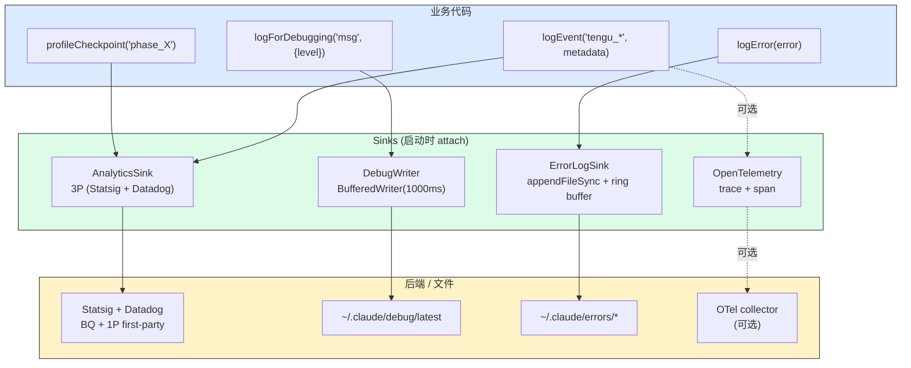
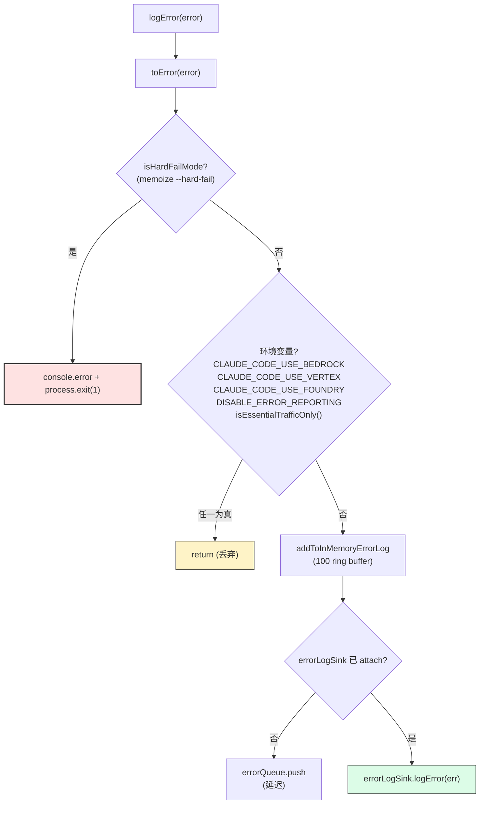

# 第 33 章 可观测性 —— OpenTelemetry + Debug 日志 + Profiling + 错误日志

> 本章是架构师视角的**可观测性横切**。Claude Code CLI 的可观测性不是单一系统,而是 4 层:**3P telemetry**(Statsig + Datadog + GrowthBook + 1P 事件)、**OpenTelemetry tracing**、**Debug 日志**(`--debug [filter]`)、**Profiling**(`--bare` 精简 + `profileCheckpoint`)。4 层各有用途,不可互相替代。错误日志有 100 条 ring buffer + watermark。本章集中讲 4 层的入口、数据格式、关闭开关、以及埋点管线。

---

## 摘要

Claude Code CLI 的可观测性是 **4 层架构**:**Telemetry**(3P analytics,1P first-party)、**Debug 日志**(`logForDebugging` + `BufferedWriter`)、**Profiling**(`profileCheckpoint` + `tengu_startup_perf`)、**错误日志**(`logError` + 100 条 ring buffer + watermark)。每一层用不同技术:**Statsig 抽样 + Datadog 后端 + GrowthBook 动态配置 + OpenTelemetry tracing + 文件日志**。**关闭开关**:`CLAUDE_CODE_USE_BEDROCK/VERTEX/FOUNDRY` 关闭 3P telemetry,`DISABLE_ERROR_REPORTING` 关闭错误上报。`--bare` 模式精简 telemetry。最关键的隐私设计是 **Marker types**(`AnalyticsMetadata_I_VERIFIED_THIS_IS_NOT_CODE_OR_FILEPATHS`),强制 type check 防止代码/路径泄漏。

---

## 速赢

1. **3P telemetry**:`logEvent` → `analytics` → Statsig/Datadog/GrowthBook;`tengu_*` 前缀;Marker types 强制隐私。
2. **Debug 日志**:`logForDebugging`(`utils/debug.ts:203`)→ `BufferedWriter` → 文件,`--debug [filter]`、`--debug-to-stderr`、`--debug-file` 三种模式。
3. **Profiling**:`profileCheckpoint`(`utils/startupProfiler.ts:65`)→ Statsig `tengu_startup_perf` 事件,100% ant + 0.5% 外部用户。
4. **错误日志**:`logError`(`utils/log.ts:158`)→ `addToInMemoryErrorLog`(100 条 ring buffer)→ 异步写磁盘;`errorLogWatermark` 标记水位。
5. **3P disable**:`CLAUDE_CODE_USE_BEDROCK/VERTEX/FOUNDRY` 自动关闭;`DISABLE_ERROR_REPORTING=1` 显式关闭;`--hard-fail` 让 `logError` 直接 `process.exit(1)`。
6. **懒加载**:OpenTelemetry ~400KB、gRPC ~700KB、perf_hooks、`CHICAGO_MCP` 沙箱 — 见 [第 31 章](./31-performance.md) §懒加载。

---

## 关键图 1:埋点管线



---

## 关键图 2:logError 的去/入流



---

## 详细机制

### 1. 3P Telemetry(`logEvent`)

#### 1a. 入口与类型

```ts
// src/services/analytics/index.ts:133-144
export function logEvent(
  eventName: string,
  // intentionally no strings unless AnalyticsMetadata_I_VERIFIED_THIS_IS_NOT_CODE_OR_FILEPATHS,
  // to avoid accidentally logging code/filepaths
  metadata: LogEventMetadata,
): void {
  if (sink === null) {
    eventQueue.push({ eventName, metadata, async: false })
    return
  }
  sink.logEvent(eventName, metadata)
}
```

`metadata` 类型是 `{ [key: string]: boolean | number | undefined }` —— **只允许数字、布尔、undefined**。**不允许字符串**(除非 cast 成 marker type)。

#### 1b. Marker Types 强制隐私

```ts
// src/services/analytics/index.ts:19,33
export type AnalyticsMetadata_I_VERIFIED_THIS_IS_NOT_CODE_OR_FILEPATHS = never
export type AnalyticsMetadata_I_VERIFIED_THIS_IS_PII_TAGGED = never
```

这两个 marker type 都是 `never` —— 实际**不能被赋值**。调用方必须显式 `cast as AnalyticsMetadata_I_VERIFIED_THIS_IS_NOT_CODE_OR_FILEPATHS`,这个 cast 在 PR review 时会被严格要求"为什么这个字符串不含代码/路径"。

这是**类型系统强制隐私**的经典模式。详见 [第 34 章 · 模式](./34-patterns.md) §Marker Types 强制隐私。

#### 1c. Sink 启动延迟

```ts
// src/services/analytics/index.ts:95-123
export function attachAnalyticsSink(newSink: AnalyticsSink): void {
  if (sink !== null) return
  sink = newSink
  if (eventQueue.length > 0) {
    const queuedEvents = [...eventQueue]
    eventQueue.length = 0
    queueMicrotask(() => {
      for (const event of queuedEvents) {
        if (event.async) void sink!.logEventAsync(event.eventName, event.metadata)
        else sink!.logEvent(event.eventName, event.metadata)
      }
    })
  }
}
```

启动时 `logEvent` 调用早于 sink attach,事件被 `eventQueue` 缓存。sink attach 后用 `queueMicrotask` 异步 drain(避免阻塞启动路径)。

**为什么异步 drain**:启动期间有 18 个 `profileCheckpoint` 调用,如果同步 drain 会阻塞 18 个 Statsig 请求,延迟显著。`queueMicrotask` 让 drain 在下一个 tick 跑。

#### 1d. 采样

```ts
// src/services/analytics/index.ts
// 'tengu_event_sampling_config' 动态配置
const sampleRate = getDynamicConfig_CACHED_MAY_BE_STALE(
  'tengu_event_sampling_config',
  { default: 1.0 }
)
if (Math.random() > sampleRate.default) return  // 采样掉
```

部分高频事件(`tengu_tool_use_*`)用 0.1% 采样率,降低 Statsig 流量。

#### 1e. 1P First-Party Events

```ts
// src/services/analytics/firstPartyEventLogger.ts
```

1P events 直接进自家 BQ 表,有 PII-tagged proto 列。`_PROTO_*` payload keys 经过 `stripProtoFields`(`analytics/index.ts:45-58`)被剥到普通 Datadog fanout 外,只 1P exporter 看到。

---

### 2. Debug 日志

#### 2a. 入口与输出

```ts
// src/utils/debug.ts:203-228
export function logForDebugging(
  message: string,
  { level }: { level: DebugLogLevel } = { level: 'debug' },
): void {
  if (LEVEL_ORDER[level] < LEVEL_ORDER[getMinDebugLogLevel()]) return
  if (!shouldLogDebugMessage(message)) return

  if (hasFormattedOutput && message.includes('\n')) {
    message = jsonStringify(message)
  }
  const timestamp = new Date().toISOString()
  const output = `${timestamp} [${level.toUpperCase()}] ${message.trim()}\n`
  if (isDebugToStdErr()) {
    writeToStderr(output)
    return
  }
  getDebugWriter().write(output)
}
```

`logForDebugging` 把消息写到 `getDebugWriter().write(output)`,后者是 `BufferedWriter`。

#### 2b. BufferedWriter 的 3 个模式

```ts
// src/utils/bufferedWriter.ts:9-99
export function createBufferedWriter({
  writeFn,
  flushIntervalMs = 1000,
  maxBufferSize = 100,
  maxBufferBytes = Infinity,
  immediateMode = false,
}: ...): BufferedWriter
```

**3 个模式**(由 `getDebugWriter` 选择,`utils/debug.ts:155-196`):
- **immediateMode**(蚂蚁 `--debug`):直接 `appendFileSync`,不退避
- **buffered 1Hz**(蚂蚁默认):1 秒 flush 一次,`maxBufferSize = 100`
- **pending write**(外部用户):`appendAsync`,async chain 防丢

**关键权衡**(注释):

```ts
// immediateMode: must stay sync. Async writes are lost on direct
// process.exit() and keep the event loop alive in beforeExit
// handlers (infinite loop with Perfetto tracing). See #22257.
```

`process.exit()` + async write = event loop 不退出,死循环。immediateMode 牺牲吞吐换确定性。

#### 2c. `--debug [filter]`

```ts
// src/utils/debugFilter.ts
const SHORTHAND_RE = /^-?(\d+(?:\.\d+)?)(k|m|b)?$/i
const MODULE_RE = /^(\w+(?::\w+)*)$/
```

`--debug api.claude.ts` 只显示该模块的日志;`--debug -api.claude.ts` 排除该模块。

#### 2d. `--debug-to-stderr` 与 `--debug-file`

- **`--debug-to-stderr`**:不走文件,直接 stderr(适合 CI)
- **`--debug-file`**:显式指定路径(默认 `~/.claude/debug/<sessionId>.log`)

`isDebugMode` memoize:

```ts
// utils/debug.ts:44-57
return (
  runtimeDebugEnabled ||
  isEnvTruthy(process.env.DEBUG) ||
  isEnvTruthy(process.env.DEBUG_SDK) ||
  process.argv.includes('--debug') ||
  process.argv.includes('-d') ||
  isDebugToStdErr() ||
  process.argv.some(arg => arg.startsWith('--debug=')) ||
  getDebugFilePath() !== null
)
```

---

### 3. Profiling

#### 3a. 入口与采样

```ts
// src/utils/startupProfiler.ts:65-75
export function profileCheckpoint(name: string): void {
  if (!SHOULD_PROFILE) return
  const perf = getPerformance()
  perf.mark(name)
  if (DETAILED_PROFILING) {
    memorySnapshots.push(process.memoryUsage())
  }
}
```

`SHOULD_PROFILE = DETAILED_PROFILING || STATSIG_LOGGING_SAMPLED`,其中:
- `DETAILED_PROFILING` = `CLAUDE_CODE_PROFILE_STARTUP=1`(env)
- `STATSIG_LOGGING_SAMPLED` = `USER_TYPE === 'ant' || Math.random() < 0.005`

**采样策略**(注释 `:30`):"100% ant, 0.5% external" —— 内部用户全采样,外部 0.5%。

#### 3b. Statsig 事件

```ts
// src/utils/startupProfiler.ts:190-193
logEvent(
  'tengu_startup_perf',
  metadata as AnalyticsMetadata_I_VERIFIED_THIS_IS_NOT_CODE_OR_FILEPATHS,
)
```

`tengu_startup_perf` 事件 metadata 是 `{import_time_ms, init_time_ms, settings_time_ms, total_time_ms, checkpoint_count}` —— 全数字,无隐私问题。

#### 3c. PHASE_DEFINITIONS

```ts
// src/utils/startupProfiler.ts:49-54
const PHASE_DEFINITIONS = {
  import_time: ['cli_entry', 'main_tsx_imports_loaded'],
  init_time: ['init_function_start', 'init_function_end'],
  settings_time: ['eagerLoadSettings_start', 'eagerLoadSettings_end'],
  total_time: ['cli_entry', 'main_after_run'],
} as const
```

4 个 phase 由 8 个 checkpoint 算出(start/end)。`total_time` 是 `cli_entry → main_after_run`,包含全部启动路径。

#### 3d. `profileReport()`

```ts
// src/utils/startupProfiler.ts:123-145
export function profileReport(): void {
  if (reported) return
  reported = true
  logStartupPerf()
  if (DETAILED_PROFILING) {
    const path = getStartupPerfLogPath()
    const dir = dirname(path)
    const fs = getFsImplementation()
    fs.mkdirSync(dir)
    writeFileSync_DEPRECATED(path, getReport(), { encoding: 'utf8', flush: true })
    logForDebugging('Startup profiling report:')
    logForDebugging(getReport())
  }
}
```

**`reported` 单次 flag**:避免多次触发(`main.tsx` + `gracefulShutdown` 都可能调)。`writeFileSync_DEPRECATED` 的 `flush: true` 保证 immediate flush(`process.exit()` 前必写)。

#### 3e. `--bare` 模式精简

```bash
claude --bare
```

`--bare` = `--print` 的极致精简子集(`cli/print.ts:455` 的 `runHeadless`):

- 跳过 transcript 写入(`QueryEngine.ts:452-455`)
- 跳过 lazy plugin 网络调用
- 跳过 `desktopUpsell` 等 UI 弹窗
- 跳过 `--debug` 隐式启用

**为什么**:CI / 脚本场景不需要所有 telemetry。详见 [第 25 章](./25-layered-arch.md) §6.2。

---

### 4. 错误日志

#### 4a. 入口与 ring buffer

```ts
// src/utils/log.ts:158-199
export function logError(error: unknown): void {
  const err = toError(error)
  if (feature('HARD_FAIL') && isHardFailMode()) {
    console.error('[HARD FAIL] logError called with:', err.stack || err.message)
    process.exit(1)
  }
  try {
    if (
      isEnvTruthy(process.env.CLAUDE_CODE_USE_BEDROCK) ||
      isEnvTruthy(process.env.CLAUDE_CODE_USE_VERTEX) ||
      isEnvTruthy(process.env.CLAUDE_CODE_USE_FOUNDRY) ||
      process.env.DISABLE_ERROR_REPORTING ||
      isEssentialTrafficOnly()
    ) {
      return
    }
    const errorStr = err.stack || err.message
    const errorInfo = {
      error: errorStr,
      timestamp: new Date().toISOString(),
    }
    addToInMemoryErrorLog(errorInfo)   // ← ring buffer
    if (errorLogSink === null) {
      errorQueue.push({ type: 'error', error: err })
      return
    }
    errorLogSink.logError(err)
  } catch {
    // pass
  }
}
```

`addToInMemoryErrorLog`(`utils/log.ts:69-77`)维护一个 100 条 ring buffer:

```ts
const MAX_IN_MEMORY_ERRORS = 100
let inMemoryErrorLog: Array<{ error: string; timestamp: string }> = []

function addToInMemoryErrorLog(errorInfo: { error: string; timestamp: string }): void {
  if (inMemoryErrorLog.length >= MAX_IN_MEMORY_ERRORS) {
    inMemoryErrorLog.shift()  // Remove oldest error
  }
  inMemoryErrorLog.push(errorInfo)
}
```

**水位(`errorLogWatermark`)**:100 条上限(`MAX_IN_MEMORY_ERRORS`),超过则 FIFO。

**`getInMemoryErrors()`** 暴露给 `/doctor` 命令显示最近错误。

#### 4b. `isHardFailMode()`

```ts
// utils/log.ts:154-156
const isHardFailMode = memoize((): boolean => {
  return process.argv.includes('--hard-fail')
})
```

`--hard-fail` 模式下,**任何 `logError` 直接 `process.exit(1)`**。用于测试 / 严格环境。

#### 4c. `isEssentialTrafficOnly()`

```ts
// (utils/envUtils.ts 实现)
function isEssentialTrafficOnly(): boolean {
  // 1. Cloud providers (Bedrock/Vertex/Foundry) — no telemetry
  // 2. 显式 DISABLE_TELEMETRY=1
  // 3. CI 环境(检测 GITHUB_ACTIONS / CIRCLECI 等)
}
```

CI 环境自动开启 essential-only 模式,减少 telemetry 噪音。

#### 4d. Sink Pre-init Queue

`errorQueue` 与 `eventQueue` 同模式:启动期间 `logError` 调用早于 sink attach,事件被队列缓存。`attachErrorLogSink`(`utils/log.ts:109-134`)**同步 drain**(注释 "errors should not be delayed")。

#### 4e. ErrorLogSink

```ts
// utils/log.ts:82-88
export type ErrorLogSink = {
  logError: (error: Error) => void
  logMCPError: (serverName: string, error: unknown) => void
  logMCPDebug: (serverName: string, message: string) => void
  getErrorsPath: () => string
  getMCPLogsPath: (serverName: string) => string
}
```

**MCP 错误分离**:MCP 错误写到 `<claude-config>/mcp-logs/<server>.log`,与其他错误分开,方便诊断。

---

### 5. 3P Telemetry Disable

#### 5a. 自动 disable(cloud providers)

```ts
// utils/log.ts:170-173
if (
  isEnvTruthy(process.env.CLAUDE_CODE_USE_BEDROCK) ||
  isEnvTruthy(process.env.CLAUDE_CODE_USE_VERTEX) ||
  isEnvTruthy(process.env.CLAUDE_CODE_USE_FOUNDRY) ||
  ...
) {
  return
}
```

AWS Bedrock / GCP Vertex / Foundry 自托管环境下,3P telemetry 自动关闭(因为这些客户不希望数据出本地)。

#### 5b. 显式 disable

```bash
DISABLE_ERROR_REPORTING=1 claude
```

或 `DISABLE_TELEMETRY=1`(由 GrowthBook 读取,关所有 Statsig 事件)。

#### 5c. CI 环境

`isEssentialTrafficOnly()` 检测 `GITHUB_ACTIONS` / `CIRCLECI` / `JENKINS_URL` 等,自动 essential-only。

---

### 6. OpenTelemetry

#### 6a. 入口

```ts
// src/utils/telemetry/logger.ts
initializeTelemetry()  // OpenTelemetry SDK 初始化
```

OpenTelemetry 仅在 `initializeTelemetry` 调用后才加载(约 400KB 体积)。

#### 6b. Span 与 Context

OpenTelemetry 通过 `trace.getTracer().startActiveSpan('tool.call', ...)` 创建 span。`QueryEngine.ts:243-271` 的 `wrappedCanUseTool` 用 span 包装权限检查。

#### 6c. 3P Telemetry vs OpenTelemetry

| 维度 | 3P (Statsig/Datadog) | OpenTelemetry |
|---|---|---|
| 采样 | 0.1%-100%(event 级别) | 全量或 trace 采样 |
| 后端 | Statsig + Datadog BQ | OTel collector(可选) |
| 格式 | `tengu_*` event name | W3C trace context |
| 用途 | 产品决策 | 性能 + 链路追踪 |

两者并存,不互斥。

---

## 设计权衡

### 为什么 `logError` 不直接 `throw`?

`logError` 设计成**永不抛**(`utils/log.ts:166-198` 包了 `try { ... } catch {}`)。理由:
- `logError` 在 catch 块里被调,如果它自身抛,会覆盖原错误信息。
- 错误日志是"尽力而为",失败不应该让进程挂。

### 为什么 Debug 日志用 BufferedWriter 而不是直接 fs.write?

| 维度 | BufferedWriter | 直接 fs.write |
|---|---|---|
| 吞吐 | 高(batch) | 低(每次 syscall) |
| 延迟 | ~1s flush | immediate |
| 失败恢复 | queue 持久 | 丢失 |
| 适用 | 高频日志 | 关键日志 |

注释 `bufferedWriter.ts:60-66`:"异步写会被 `process.exit()` 丢失"—— immediateMode 是关键日志的安全网。

### 为什么 100 条 ring buffer 不是 1000?

`MAX_IN_MEMORY_ERRORS = 100`(注释 "100 ring buffer")。理由:
- **够用**:100 条最近错误足够 `/doctor` 诊断。
- **不爆内存**:每条 ~500 bytes,100 条 = 50KB,可忽略。
- **不丢**:超过后 FIFO,旧错误淘汰。

如果用 1000 条,内存 500KB,且大部分是"陈年旧账",价值低。

### 为什么 telemetry disable 要分 cloud provider + DISABLE_ERROR_REPORTING 两层?

- **cloud provider disable** = 客户**强约束**(合同),自动生效
- **DISABLE_ERROR_REPORTING** = 用户**主动配置**(开发 / 隐私偏好),显式

分层的好处:cloud provider 用户无需知道 `DISABLE_ERROR_REPORTING`,系统自动尊重他们的合规需求。

---

## 反模式

**❶ 在 logEvent 里传 raw 字符串**

```ts
// ✗ TS 报错,但 ts-ignore 会过
logEvent('tengu_tool_use', { file_path: '/Users/me/secrets.txt' as any })
```

正确做法:cast 成 marker type,PR review 强制审查"为什么不含 PII"。

**❷ 在 finally 块里 logError**

```ts
// ✗ 可能掩盖原错误
try { ... } catch (e) {
  throw e
} finally {
  logError(new Error('cleanup failed'))
}
```

`logError` 静默吞错误,如果 finally 抛了 cleanup 错误,会掩盖 catch 的原错误。**正确做法**:logError 放在 catch 里,且使用 `addSuppressed`。

**❸ 让 logError 阻塞主路径**

```ts
// ✗ 同步 await errorLogSink.logError
await errorLogSink.logError(err)
```

`errorLogSink.logError` 异步,但**不能 await** —— 会让 catch 路径变慢。fire-and-forget 即可。

**❹ 在 CI 里开 --debug 却不重定向文件**

`--debug` 模式默认写 `~/.claude/debug/<sessionId>.log`。CI 容器销毁后日志丢失。**正确做法**:`--debug-to-stderr` 或 `--debug-file=/workspace/logs/debug.log`。

**❺ 假设 logError 总是被调用**

`logError` 是**最佳努力**。如果进程在 catch 之前 SIGKILL,该错误不会上报。**正确做法**:对 critical error 用 `tengu_critical_*` event(`logEvent`)替代,它走 Statsig 而非 sink。

---

## 引用

**前置**
- [`00-front/03-glossary.md`](../00-front/03-glossary.md) —— C.8 feature flag、3P/1P
- [`04-architect/29-permission.md`](./29-permission.md) —— 权限埋点
- [`04-architect/30-subsystems.md`](./30-subsystems.md) —— 8 大子系统

**平行**
- [`04-architect/31-performance.md`](./31-performance.md) —— profiling 懒加载
- [`04-architect/32-security.md`](./32-security.md) —— marker types 强制隐私

**后继**
- `04-architect/34-patterns.md` —— 3-tier logging、marker types、ring buffer 等模式

**源码定位**

| 关注点 | 路径:行号 |
|---|---|
| `logEvent` 入口 | `src/services/analytics/index.ts:133-144` |
| Marker type `I_VERIFIED` | `src/services/analytics/index.ts:19` |
| Marker type `PII_TAGGED` | `src/services/analytics/index.ts:33` |
| `stripProtoFields` | `src/services/analytics/index.ts:45-58` |
| `attachAnalyticsSink` pre-init queue | `src/services/analytics/index.ts:95-123` |
| `logError` 入口 | `src/utils/log.ts:158-199` |
| `MAX_IN_MEMORY_ERRORS = 100` | `src/utils/log.ts:66` |
| `addToInMemoryErrorLog` | `src/utils/log.ts:69-77` |
| `isHardFailMode` | `src/utils/log.ts:154-156` |
| 3P disable env vars | `src/utils/log.ts:170-173` |
| `attachErrorLogSink` | `src/utils/log.ts:109-134` |
| `logForDebugging` | `src/utils/debug.ts:203-228` |
| `BufferedWriter` | `src/utils/bufferedWriter.ts:9-99` |
| Debug writer 模式 | `src/utils/debug.ts:155-196` |
| `--debug-to-stderr` | `src/utils/debug.ts:85-...` |
| `profileCheckpoint` | `src/utils/startupProfiler.ts:65-75` |
| `PHASE_DEFINITIONS` | `src/utils/startupProfiler.ts:49-54` |
| `tengu_startup_perf` | `src/utils/startupProfiler.ts:190-193` |
| `profileReport` | `src/utils/startupProfiler.ts:123-145` |
| 懒加载 `getPerformance` | `src/utils/profilerBase.ts:14-20` |
| OpenTelemetry 入口 | `src/utils/telemetry/logger.ts` |