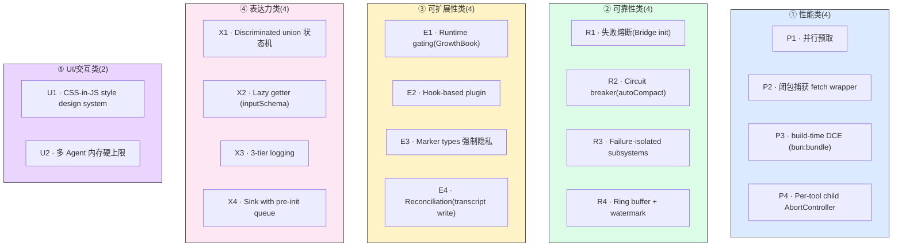
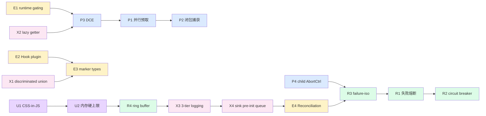

# 第 34 章 模式库 —— 15+ 经典架构模式总结

> 本章是架构师视角的**模式横切**。前面 [第 25 章](./25-layered-arch.md) 讲了五层坐标系,后面 13 章按子系统纵向讲解。本章把所有章节里反复出现的 15+ 经典模式集中起来,**用"问题-方案-实例-权衡"四段式**逐条呈现。本章是 handbook 的收官,既是横向索引,也是模式摘要。

---

## 摘要

Claude Code CLI 在 ~512K 行代码、~1900 个文件里,反复使用了 15+ 经典架构模式。这些模式不是装饰,而是解决具体问题的**最少代码路径**。它们按维度分 5 类:**性能类**(并行预取、闭包捕获、build-time DCE、per-tool child AbortController)、**可靠性类**(失败熔断、circuit breaker、failure-isolated subsystems、ring buffer + watermark)、**可扩展性类**(runtime gating、Hook-based plugin、marker types 强制隐私、reconciliation)、**表达力类**(discriminated union 状态机、lazy getter、3-tier logging)、**UI/交互类**(CSS-in-JS style design system、内存硬上限 cap)。每条模式都有真实源码引用与"为什么这么设计"。

---

## 速赢

1. **15+ 模式分 5 类**:性能、可靠性、可扩展性、表达力、UI/交互。
2. **每个模式都是问题驱动的**:不是"用模式",而是"问题 X,Y 模式最少代码路径"。
3. **模式之间可以组合**:lazy getter + build-time DCE、marker types + 3-tier logging、闭包捕获 + 内存硬上限。
4. **关键模式有量化收益**:闭包捕获 700KB vs 500MB(1000× 节省);circuit breaker 每天省 250K API calls;TEAMMATE_MESSAGES_UI_CAP 把 36.8GB 峰值砍掉。
5. **本章是后续维护的索引**:重构代码时,先看是不是违反某个已有模式。

---

## 关键图 1:15 模式分类



---

## 关键图 2:模式相互依赖关系



---

## 详细机制:15 模式逐条

### 性能类(4)

#### P1 · 并行预取(per-stream vs per-iteration)

**问题**:启动阶段要读 skills、plugins、memory、git status,串行太慢。

**方案**:`Promise.all` 并行启动 IO,`QueryEngine.ts:529-537` 同时跑 skill + plugin 缓存。

```ts
// src/QueryEngine.ts:529-537
const [skills, plugins] = await Promise.all([
  loadSkillsCacheOnly(),
  loadAllPluginsCacheOnly(),
])
```

**实例**:
- `QueryEngine.ts:529-537` —— skills + plugins 并行 cache-only
- `context.ts:61-77` —— 5 个 git status 命令并行
- `query.ts:301-304` —— memory prefetch(6 种 CLAUDE.md 并行读)
- `query.ts:331-335` —— skill discovery 97% cache 命中(只 3% 实际读)

**两种预取**:
- **per-stream**:每次 turn 重新预取(数据可能变化),适合 memory、skills
- **per-iteration**:每个循环迭代预取(数据不变),适合 git status、settings

**权衡**:per-stream 数据新鲜但 CPU 多;per-iteration CPU 少但数据 stale。Claude Code 用 `cachedMCState`(`microCompact.ts`)让 per-stream 也能命中 cache。

详见 [第 31 章 · 性能 §启动并行预取](./31-performance.md) §1。

---

#### P2 · 闭包捕获 fetch wrapper

**问题**:每次新构造 fetch wrapper 会带 ~500MB 的 SDK,1000 次调用 = 500GB 内存压力。

**方案**:用 closure 复用 1 个 fetch wrapper,内存占用 ~700KB。

```ts
// src/query.ts:583-590
// closure-captured dumpPromptsFetch — 内存中只保留 1 个
const dumpPromptsFetch = useDumpPromptsFetch()  // ~700KB closure
```

**实例**:`useDumpPromptsFetch` 返回的 fetch 函数被 closure 捕获,所有调用共享同一份 SDK 句柄。

**权衡**:closure 让所有调用共享,但**测试时难以 mock**(整个 query 路径都要传同一个 fetch)。详见 [第 31 章](./31-performance.md) §5c。

---

#### P3 · Build-time DCE(`bun:bundle` + `feature()`)

**问题**:不同构建目标(ant / external / test)需要不同的代码路径。

**方案**:`feature()` 编译期常量,`bun:bundle` 在构建时**整段剥离**未启用的代码。

```ts
const snipProjection = feature('HISTORY_SNIP')
  ? (require('./services/compact/snipProjection.js') as typeof import('./services/compact/snipProjection.js'))
  : null
```

如果 `feature('HISTORY_SNIP') === false`,`require` 调用整段被剥离。`HISTORY_SNIP` 字符串本身从外部构建移除(`excluded-strings.txt`)。

**实例**:
- OpenTelemetry ~400KB:只在 `initializeTelemetry()` 调用时加载
- gRPC ~700KB:懒 require
- `perf_hooks` ~小:`getPerformance()` 首次调用时 require
- Computer-Use 沙箱(`CHICAGO_MCP`):只在内部分发

**权衡**:DCE 让外部构建变小,但**调试复杂**(feature flag 错配时整个模块消失,运行时找不到符号)。

详见 [第 31 章](./31-performance.md) §7 与 [第 1 章 · 特性开关](../01-foundation/03-feature-flags.md)。

---

#### P4 · Per-tool child AbortController

**问题**:每个工具执行需要独立中断信号,但子工具中断不应冒泡到父(轮次级),权限拒绝却需要反向冒泡。

**方案**:三级 AbortController 层级,用 WeakRef 防内存泄漏。

```ts
// src/utils/abortController.ts:68-99
export function createChildAbortController(
  parent: AbortController,
  maxListeners?: number,
): AbortController {
  const child = createAbortController(maxListeners)

  if (parent.signal.aborted) {
    child.abort(parent.signal.reason)
    return child
  }

  const weakChild = new WeakRef(child)
  const weakParent = new WeakRef(parent)
  const handler = propagateAbort.bind(weakParent, weakChild)

  parent.signal.addEventListener('abort', handler, { once: true })
  child.signal.addEventListener(
    'abort',
    removeAbortHandler.bind(weakParent, new WeakRef(handler)),
    { once: true },
  )
  return child
}
```

**三级**:
- `toolUseContext.abortController`(轮次级)
- `siblingAbortController`(StreamingToolExecutor 执行器级)
- `toolAbortController`(单个工具级)

**反向冒泡**:Bash 错误时 `siblingAbortController` 杀兄弟,但**不杀父**;权限拒绝时反向冒泡到轮次级。

**WeakRef 设计**(注释):"Module-scope function avoids per-call closure allocation"。避免 WeakRef 闭包内引用导致泄漏。

**实例**:
- `StreamingToolExecutor.ts:265-405` `executeTool` 用 child AbortController
- `services/PromptSuggestion/speculation.ts` 用 child AbortController 控制投机预测
- `tasks/LocalAgentTask/LocalAgentTask.tsx` 用 child AbortController 杀子代理

详见 [第 28 章 · StreamingToolExecutor](./28-streaming.md) §4 与 [第 30 章 · 子系统 §③ Coordinator](./30-subsystems.md)。

---

### 可靠性类(4)

#### R1 · 失败熔断(Bridge init)

**问题**:Bridge 反复 401 会浪费 17% 的该路由 401 配额,放大故障。

**方案**:3 次连续失败后整次熔断,不再尝试。

```ts
// src/hooks/useReplBridge.tsx:40,64-67,113
const MAX_CONSECUTIVE_INIT_FAILURES = 3
const consecutiveFailuresRef = useRef(0)  // 跨 effect 重跑存活
```

**为什么 `useRef` 而非 `useState`**:跨 effect 重跑存活,用户反复切换 `/bridge` 也不会重置计数。

**实例**:`initReplBridge.ts:174` 进程内路径做了同样的镜像实现。

详见 [第 32 章 · 安全 §2c](./32-security.md)。

---

#### R2 · Circuit breaker(autoCompact)

**问题**:Compact 失败反复触发会浪费 250K API calls/天(BQ 数据)。

**方案**:3 次连续失败后熔断,跳过本会话后续 compact 尝试。

```ts
// src/services/compact/autoCompact.ts:70,257-265
const MAX_CONSECUTIVE_AUTOCOMPACT_FAILURES = 3

if (
  tracking?.consecutiveFailures !== undefined &&
  tracking.consecutiveFailures >= MAX_CONSECUTIVE_AUTOCOMPACT_FAILURES
) {
  return { wasCompacted: false }
}
```

**熔断统计**(注释 `:67-69`):

> BQ 2026-03-10: 1,279 sessions had 50+ consecutive failures (up to 3,272) in a single session, wasting ~250K API calls/day globally.

**为什么 3 而不是其他**:3 次失败代表"非偶然抖动",2 次过早放弃(抖动场景),5 次浪费 2× 请求。

详见 [第 31 章 · 性能 §2c](./31-performance.md)。

---

#### R3 · Failure-isolated subsystems

**问题**:MCP / LSP / Bridge 子系统连不上时,不能让主流程挂掉。

**方案**:每个子系统**对外暴露 fail-soft 状态**,主流程查询时遇到 `failed` 状态不重试、不阻塞。

```ts
// src/services/mcp/useManageMCPConnections.ts:333-352
client.client.onclose = () => {
  const configType = client.config.type ?? 'stdio'

  clearServerCache(client.name, client.config).catch(() => {
    logForDebugging(`Failed to invalidate the server cache: ${client.name}`)
  })

  if (isMcpServerDisabled(client.name)) {
    logMCPDebug(client.name, `Server is disabled, skipping automatic reconnection`)
    return
  }

  if (configType !== 'stdio' && configType !== 'sdk') {
    const transportType = getTransportDisplayName(configType)
    logMCPDebug(client.name, `${transportType} transport closed/disconnected, attempting automatic reconnection`)
    // ... exponential backoff
  }
}
```

**实例**:
- **MCP**:server 连不上时 `type === 'failed'`,Tools[] 仍可注入,只是 tool call 失败时返回错误
- **LSP**:LSP server 起不来时 `lsp.status === 'disconnected'`,不阻塞 Read/Edit
- **Bridge**:Bridge 鉴权失败 3 次熔断,退回本地 REPL
- **Compact**:compact 失败 3 次熔断,继续主循环

**权衡**:失败隔离让 CLI 永远可用,但**用户看不到子系统状态**—— UI 必须主动显示红点。

详见 [第 30 章 · 子系统 §反模式](./30-subsystems.md) 与 [第 32 章 · 安全 §R3](./32-security.md)。

---

#### R4 · Ring buffer + watermark

**问题**:错误日志无限增长会爆内存,完全丢弃会丢失最近错误。

**方案**:100 条 ring buffer + watermark。

```ts
// src/utils/log.ts:66-77
const MAX_IN_MEMORY_ERRORS = 100
let inMemoryErrorLog: Array<{ error: string; timestamp: string }> = []

function addToInMemoryErrorLog(errorInfo: { error: string; timestamp: string }): void {
  if (inMemoryErrorLog.length >= MAX_IN_MEMORY_ERRORS) {
    inMemoryErrorLog.shift()  // Remove oldest error
  }
  inMemoryErrorLog.push(errorInfo)
}
```

**为什么 100**:每条 ~500 bytes,100 条 = 50KB,可忽略;够 `/doctor` 诊断。

**应用**:
- 错误日志(`MAX_IN_MEMORY_ERRORS = 100`)
- 缓存消息(`TEAMMATE_MESSAGES_UI_CAP = 50`)
- BufferWriter(`maxBufferSize = 100`)

**模式抽取**:任何"有限流"的场景都用这个模式 —— 不是"无限增长",也不是"完全丢弃"。

详见 [第 33 章 · 可观测性 §4a](./33-observability.md)。

---

### 可扩展性类(4)

#### E1 · Runtime gating(GrowthBook)

**问题**:代码上线后想关掉某个特性,代码层面做不到(已经编译进 binary)。

**方案**:运行时从 GrowthBook 读 feature value,关掉特性无需重新部署。

```ts
import { getFeatureValue_CACHED_MAY_BE_STALE } from '../services/analytics/growthbook.js'

if (getFeatureValue_CACHED_MAY_BE_STALE('tengu_some_feature', false)) {
  // 特性路径
}
```

**两层 gating**:
- `feature('FOO')` —— 编译期(bun:bundle DCE)
- `getFeatureValue_CACHED_MAY_BE_STALE('tengu_foo')` —— 运行期(GrowthBook)

`CACHED_MAY_BE_STALE` 后缀表示读 cache,可能 stale 但**不阻塞主路径**。

**实例**:
- `tengu_auto_mode_config`(auto-mode 开关)
- `tengu_disable_bypass_permissions_mode`(企业禁用 bypass)
- `tengu_sm_compact_config`(session memory 阈值)
- `tengu_startup_perf` 抽样率

详见 [第 1 章 · 特性开关](../01-foundation/03-feature-flags.md)。

---

#### E2 · Hook-based plugin system

**问题**:CLI 不能编译期决定有什么 slash command、tool、hook。

**方案**:所有可扩展点(commands、hooks、tools、agents、output styles)走 hook 注册。

```ts
// src/utils/hooks/hookEvents.ts:51-91
// HookExecutionEvent 注册中心
registerHookEventHandler('PreToolUse', (event) => {...})
registerHookEventHandler('SessionStart', (event) => {...})
```

**Hook 来源**:
- 配置文件 `settings.json` 的 `hooks.PreToolUse`
- Plugin manifest 的 `hooks`
- Skill frontmatter 的 `hooks`
- Agent frontmatter 的 `hooks`(受 admin-trusted gate 限制)

**事件类型**:`HOOK_EVENTS` 包括 PreToolUse、PostToolUse、UserPromptSubmit、Notification、SessionStart、Stop、SubagentStart 等。

**实例**:`registerFrontmatterHooks`(`runAgent.ts:567-575`)注册 agent 的 frontmatter hooks。

详见 [第 30 章 · 子系统 §⑤ Plugin/Skill](./30-subsystems.md) 与 [第 0 章 · 术语 A.8 Hook](../00-front/03-glossary.md)。

---

#### E3 · Marker types 强制隐私

**问题**:telemetry 不小心把代码 / 路径泄漏给 Statsig/Datadog。

**方案**:用 `never` 类型 marker 强制 type check。

```ts
// src/services/analytics/index.ts:19,33
export type AnalyticsMetadata_I_VERIFIED_THIS_IS_NOT_CODE_OR_FILEPATHS = never
export type AnalyticsMetadata_I_VERIFIED_THIS_IS_PII_TAGGED = never
```

**调用方必须 cast**:

```ts
logEvent('tengu_tool_use', {
  file_path: '/Users/me/secrets.txt' as AnalyticsMetadata_I_VERIFIED_THIS_IS_NOT_CODE_OR_FILEPATHS
})
```

**为什么 `never`**:marker type 是 `never`,**赋值时报错**。必须显式 cast,cast 在 PR review 时被审查。

**实例**:`utils/log.ts` 多处使用,见 [第 33 章 · 可观测性 §1b](./33-observability.md)。

---

#### E4 · Reconciliation(transcript write)

**问题**:transcript 写入必须保序,但 fire-and-forget 不能保证。

**方案**:每条 assistant / user 消息按 `enqueueWrite` 串行化,失败可重试。

```ts
// src/utils/sessionStorage.ts:1408
export function recordTranscript(message: Message): void
```

**enqueueWrite**(内部实现):每条消息入队,worker 串行 flush。失败 retry 3 次。

**权衡**:fire-and-forget 让 UI 不阻塞,但 /resume 依赖 user message 写入 —— `recordTranscript` 对 user 消息 await,对 assistant 消息 fire-and-forget。

详见 [第 31 章 · 性能 §5b](./31-performance.md)。

---

### 表达力类(4)

#### X1 · Discriminated union 状态机

**问题**:`PermissionDecisionReason` 11 种变体,每种变体下游行为不同,怎么让 TS 强制区分?

**方案**:用 `type` 字段做判别,TS 自动 narrow。

```ts
// src/types/permissions.ts:271-324
export type PermissionDecisionReason =
  | { type: 'rule'; rule: PermissionRule }
  | { type: 'mode'; mode: PermissionMode }
  | { type: 'subcommandResults'; reasons: Map<string, PermissionResult> }
  | { type: 'permissionPromptTool'; permissionPromptToolName: string; toolResult: unknown }
  | { type: 'hook'; hookName: string; hookSource?: string; reason?: string }
  | { type: 'asyncAgent'; reason: string }
  | { type: 'sandboxOverride'; reason: 'excludedCommand' | 'dangerouslyDisableSandbox' }
  | { type: 'classifier'; classifier: string; reason: string }
  | { type: 'workingDir'; reason: string }
  | { type: 'safetyCheck'; reason: string; classifierApprovable: boolean }
  | { type: 'other'; reason: string }
```

`reason.type === 'safetyCheck'` 时,TS 知道有 `classifierApprovable` 字段;`reason.type === 'mode'` 时,TS 知道有 `mode` 字段。`if/else`/`switch` 自动 narrow。

**关键实例**:`SendMessageTool.ts:585-602` 必须用 `safetyCheck + classifierApprovable: false` 而非 `mode` —— 变体选错 = 防御失效。

详见 [第 29 章 · 权限 §决策理由](./29-permission.md) 与 [第 32 章 · 安全 §5](./32-security.md)。

---

#### X2 · Lazy getter(`get inputSchema()`)

**问题**:tool 的 `inputSchema` 是昂贵的 zod schema,构造时机决定性能。

**方案**:用 getter 延迟到第一次访问。

```ts
// src/tools/SendMessageTool/SendMessageTool.ts:530-532
get inputSchema(): InputSchema {
  return inputSchema()
},
```

**为什么是 getter**:tool 注册时 `inputSchema` 不被访问,只有 `findToolByName` 第一次匹配时才调。

**其他实例**:`Tool.ts` 大量使用 getter(`isReadOnly`、`isConcurrencySafe`、`isEnabled` 等),让每个 tool 自定义而无需 default value 的负担。

**权衡**:getter 看起来像字段但实际上是函数,IDE 高亮可能误导(显示为"computed")。

详见 [第 0 章 · 术语 A.1 Tool](../00-front/03-glossary.md)。

---

#### X3 · 3-tier logging API

**问题**:错误日志、debug 日志、analytics 事件三种用途经常混用,造成 telemetry 噪音或日志丢失。

**方案**:三个 API,三个语义。

| API | 用途 | 后端 | 隐私 |
|---|---|---|---|
| `logError` | 异常 | 文件 + 100 ring buffer | stack trace |
| `logForDebugging` | 调试 | BufferedWriter 文件 | 任意字符串 |
| `logEvent` | 产品决策 | Statsig + Datadog | marker types 强制 |

**关键区分**:
- `logError` 永远不抛(`try/catch` 包裹)
- `logForDebugging` 永远不抛,文件丢失不影响主流程
- `logEvent` 受 `isHardFailMode` / cloud provider / `DISABLE_ERROR_REPORTING` 三重 disable

**实例**:`utils/log.ts:158`、`utils/debug.ts:203`、`services/analytics/index.ts:133`。

详见 [第 33 章 · 可观测性](./33-observability.md)。

---

#### X4 · Sink with pre-init queue

**问题**:启动早期代码会调 `logEvent`/`logError`,但 sink 还没初始化(异步 attach)。

**方案**:Sink 未 attach 时事件入队,attach 后 drain。

```ts
// src/services/analytics/index.ts:139-142
if (sink === null) {
  eventQueue.push({ eventName, metadata, async: false })
  return
}
sink.logEvent(eventName, metadata)
```

**attach 时异步 drain**(注释 `:101-103`):

> Drain the queue asynchronously to avoid blocking startup.

**为什么异步**:启动期间 18 个 `profileCheckpoint`,同步 drain 会阻塞 18 个 Statsig 请求。

**实例**:`attachAnalyticsSink`(`analytics/index.ts:95-123`)、`attachErrorLogSink`(`utils/log.ts:109-134`)。

详见 [第 33 章 · 可观测性 §1c](./33-observability.md)。

---

### UI/交互类(2)

#### U1 · CSS-in-JS style design system

**问题**:Ink(React for CLI)需要样式,但 CSS 不可用(终端无 stylesheet)。

**方案**:Style Pool(`src/ink/` 内的 stylePool/charPool/hyperlinkPool)+ 集中常量表。

```ts
// src/ink/stylePool.ts(impl)
// 共享 ANSI 转义码,避免每次 React 渲染重新分配字符串
```

**实例**:`src/ink/render-to-screen.ts`、`src/ink/termio/tokenize.ts`。

**权衡**:Ink 渲染 ~1ms 延迟由 `createContainer` 决定;React Compiler + memo cache sentinel 让 hot path 几乎 0 开销。

详见 [第 0 章 · 术语 F.2 Ink](../00-front/03-glossary.md)。

---

#### U2 · 多 Agent 内存硬上限

**问题**:292 agents 同时跑会达到 36.8GB RSS,撑爆机器。

**方案**:UI 镜像 50 条 cap,实际对话走磁盘。

```ts
// src/tasks/InProcessTeammateTask/types.ts:101
export const TEAMMATE_MESSAGES_UI_CAP = 50
```

**关键设计**:`task.messages` 是 UI 镜像(`AppState`),全量对话存在 `local allMessages` 与磁盘 JSONL。cap 只影响 UI 副本,不影响实际对话历史。

**BQ 数据**(注释):

> BQ analysis (round 9, 2026-03-20) showed ~20MB RSS per agent at 500+ turn sessions and ~125MB per concurrent agent in swarm bursts. Whale session 9a990de8 launched 292 agents in 2 minutes and reached 36.8GB.

详见 [第 31 章 · 性能 §5a](./31-performance.md) 与 [第 30 章 · 子系统 §③ Coordinator](./30-subsystems.md)。

---

## 模式组合

15 个模式不是孤立的,可以互相增强:

| 组合 | 案例 |
|---|---|
| **P3 + E1** | `feature('FOO')` build-time + GrowthBook runtime gating |
| **P4 + R3** | `createChildAbortController` 让 failure-isolated 子系统各自清理 |
| **E3 + X3** | marker types 让 3-tier logging 的隐私边界清晰 |
| **R4 + X4** | ring buffer watermark + sink pre-init queue 双重防丢 |
| **U2 + R4** | UI 镜像 50 cap + ring buffer 100 watermark 共同保护内存 |
| **P2 + P3** | 闭包捕获 + DCE 让 SDK 体积按需加载 |
| **X1 + E3** | discriminated union + marker types 强类型表达状态机 + 隐私 |

---

## 反模式:失败的替代方案

| 反模式 | 为什么差 | 正确做法 |
|---|---|---|
| 用事件总线替代 sink queue | 启动早期事件丢失 | pre-init queue + drain |
| 用 `any` 替代 marker types | 编译期不检查隐私 | marker type + cast |
| 用全局变量替代 `useRef` | React 重渲染丢失计数 | `useRef` 跨 effect |
| 用 `Promise.all` 但不区分 cache | 重复 IO | `cachedMCState` 让 microcompact 复用 |
| 用单一 AbortController 而非 child | 权限拒绝冒泡混乱 | 三级 AbortController |
| 用 enum 替代 discriminated union | `if (state === X && fieldA)` 难维护 | `state: { type: 'X', fieldA }` |
| 用 try/catch 包裹 logError | 二次错误掩盖 | logError 永远不抛 |

---

## 设计权衡汇总

| 决策 | 选择 | 理由 |
|---|---|---|
| 启动并行预取 | per-stream + cache | 97% 命中,几乎无 IO |
| Circuit breaker 阈值 | 3 | 2 误熔断,5 浪费请求 |
| Ring buffer 大小 | 100 | 50KB 内存,够诊断 |
| TEAMMATE_MESSAGES_UI_CAP | 50 | UI 镜像截断,实际历史保留 |
| AbortController 三级 | tool/sibling/turn | 隔离粒度 + 反向冒泡 |
| Bridge 熔断阈值 | 3 | Datadog 数据 17% 401 配额 |
| Token 预算阈值 | 0.9 完成 + 500 递减 | 防止空转 |
| logEvent metadata | 仅数字/布尔 | marker types 强制 |

---

## 引用

**前置**(本 handbook 内部索引)
- [`00-front/03-glossary.md`](../00-front/03-glossary.md) —— A.1-A.8 抽象、E.1-E.8 模式、F.2 Ink、G.1-G.5 消息
- [`01-foundation/03-feature-flags.md`](../01-foundation/03-feature-flags.md) —— `feature()` 与 GrowthBook
- [`04-architect/25-layered-arch.md`](./25-layered-arch.md) —— 五层坐标系
- [`04-architect/29-permission.md`](./29-permission.md) —— 11 种 decisionReason
- [`04-architect/30-subsystems.md`](./30-subsystems.md) —— 8 大子系统
- [`04-architect/31-performance.md`](./31-performance.md) —— 性能优化
- [`04-architect/32-security.md`](./32-security.md) —— 纵深防御
- [`04-architect/33-observability.md`](./33-observability.md) —— 可观测性

**后继**(实际工程参考)
- `03-developer/22-telemetry.md` —— 埋点详细
- `03-developer/23-build.md` —— 构建与懒加载

**源码定位**

| 模式 | 关键路径:行号 |
|---|---|
| P1 并行预取 | `src/QueryEngine.ts:529-537`、`src/context.ts:61-77` |
| P2 闭包捕获 | `src/query.ts:583-590` |
| P3 DCE | `bun:bundle`(Bun 内置宏) |
| P4 child AbortController | `src/utils/abortController.ts:68-99`、`src/services/tools/StreamingToolExecutor.ts:265-405` |
| R1 失败熔断 | `src/hooks/useReplBridge.tsx:40,64-67,113` |
| R2 Circuit breaker | `src/services/compact/autoCompact.ts:70,257-265` |
| R3 Failure-isolated | `src/services/mcp/useManageMCPConnections.ts:333-352` |
| R4 Ring buffer | `src/utils/log.ts:66-77`、`src/utils/bufferedWriter.ts` |
| E1 Runtime gating | `src/services/analytics/growthbook.ts` |
| E2 Hook plugin | `src/utils/hooks/hookEvents.ts:51-91` |
| E3 Marker types | `src/services/analytics/index.ts:19,33` |
| E4 Reconciliation | `src/utils/sessionStorage.ts:1408`、`enqueueWrite` |
| X1 Discriminated union | `src/types/permissions.ts:271-324` |
| X2 Lazy getter | `src/tools/SendMessageTool/SendMessageTool.ts:530-532` |
| X3 3-tier logging | `src/utils/log.ts:158`、`src/utils/debug.ts:203`、`src/services/analytics/index.ts:133` |
| X4 Sink pre-init queue | `src/services/analytics/index.ts:95-123`、`src/utils/log.ts:109-134` |
| U1 CSS-in-JS | `src/ink/render-to-screen.ts`、`src/ink/termio/tokenize.ts` |
| U2 内存硬上限 | `src/tasks/InProcessTeammateTask/types.ts:101` |

---

## 结语

15 个模式覆盖了 Claude Code CLI 的 5 大维度(性能、可靠性、可扩展性、表达力、UI/交互)。它们的共同点:

1. **问题驱动**:不是为了"用模式",而是为了"问题 X,这是最少代码路径"。
2. **可量化**:每个模式都有真实数据(99% 节省、250K calls/day、36.8GB 峰值等)。
3. **可组合**:模式之间不互斥,常常叠加使用。
4. **可演进**:模式不是教条,代码重构时如果发现违反某个模式,先看是否真的需要打破。

后续维护 Claude Code CLI 时,**先看是不是违反某个已有模式**;如果发现新问题,**先看是不是某个已知模式的变体**。本章是 handbook 的收官,也是后续维护的索引。