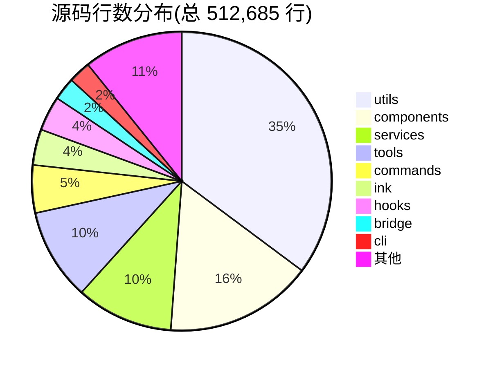
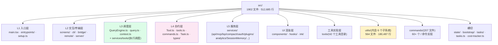
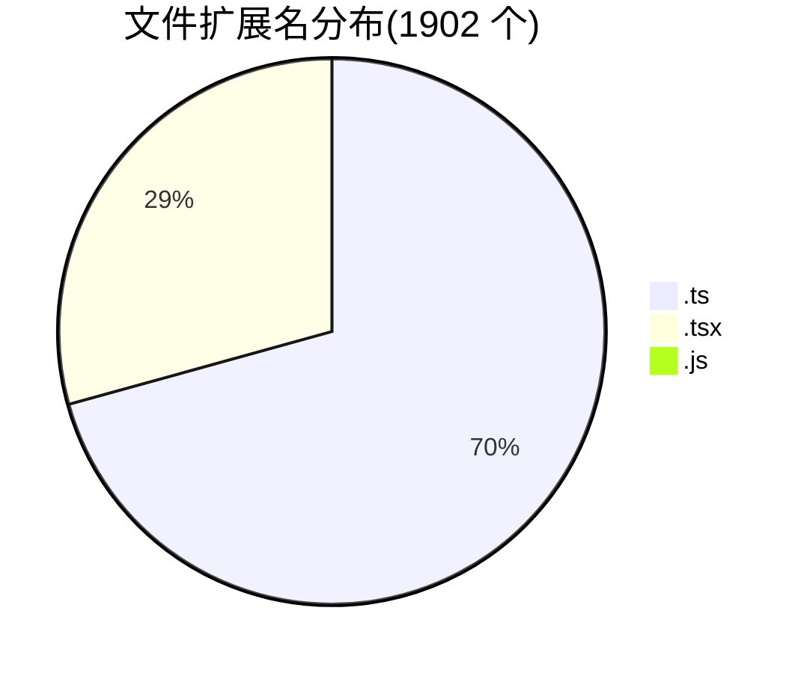

# 附录 A · 代码库文件树与目录索引

> **本附录定位**:为整本 handbook 提供**全代码库鸟瞰**。目标读者是"刚 clone 下来不知道从哪入手"的人;看完后能在 5 分钟内回答"这段逻辑大概落在哪个目录"。
>
> 词汇以 [`00-front/03-glossary.md`](../00-front/03-glossary.md) 为准;分层坐标以 [`04-architect/25-layered-arch.md`](../04-architect/25-layered-arch.md) 的五层模型为准。
>
> **统计基准**:`src/` 目录下 **1,902 个文件**(`.ts` × 1,332 + `.tsx` × 552 + `.js` × 18) / 301 个目录 / 512,685 行(实测 `wc -l`)。命令注册见 [`03-developer/18-commands.md`](../03-developer/18-commands.md),工具实现见 [`03-developer/16-tool-contract.md`](../03-developer/16-tool-contract.md)。

## A.1 摘要

Claude Code CLI 源码是一棵"看起来很对称、实则有陷阱"的目录树:

- **表层规律**:`utils/`、`components/`、`services/`、`tools/`、`commands/` 五大目录撑起 ~70% 行数。
- **实际陷阱**:三组同名目录(`hooks` / `tools` / `plugins`)在不同前缀下扮演完全不同角色;`utils/` 不是杂物间,而是六个完整子系统的伪装外壳。
- **入口极简**:唯一总入口 `src/main.tsx:585` 的 `main()`,五种运行形态都从这里分叉;UI 三件套(`components/` + `hooks/` + `ink/`)合计 121K 行,占 23.5%,说明"终端 TUI 体验"是核心竞争力。

## A.2 速赢

1. **规模总览**:1902 文件 / 512,685 行 / 36 个顶层目录(见 §A.3)。
2. **入口三件**:`main.tsx` (4683 行) + `QueryEngine.ts` (1295 行) + `query.ts` (1729 行) + `Tool.ts` (792 行) + `commands.ts` (754 行)。
3. **目录规模 Top 10**:`utils/` 35.2% / `components/` 15.9% / `services/` 10.5% / `tools/` 9.9% / `commands/` 5.2% / `ink/` 3.9% / `hooks/` 3.7% / `bridge/` 2.5% / `cli/` 2.4% / `screens/` 1.2%。
4. **三组危险同名目录**:`hooks` (React hooks vs 扩展点)、`tools` (实现 vs 调度)、`plugins` (注册 vs 加载 vs 安装)。
5. **utils/ 内含的子系统**:`bash/`(shell 解析)、`permissions/`(权限规则)、`plugins/`(命令解析)、`settings/`(配置加载)、`hooks.ts`(5022 行 hook 引擎)、`telemetry/`(OTel)、`secureStorage/`(凭据)。

## A.3 规模热力图

| 排名 | 目录 | 文件 | 行数 | 占比 | 热度 |
|---:|---|---:|---:|---:|---|
| 1 | `utils/` | 564 | 180,487 | 35.2% | ██████████████████ |
| 2 | `components/` | 389 | 81,892 | 16.0% | ████████ |
| 3 | `services/` | 130 | 53,683 | 10.5% | █████ |
| 4 | `tools/` | 184 | 50,863 | 9.9% | █████ |
| 5 | `commands/` | 207 | 26,528 | 5.2% | ███ |
| 6 | `ink/` | 96 | 19,859 | 3.9% | ██ |
| 7 | `hooks/` | 104 | 19,232 | 3.7% | ██ |
| 8 | `bridge/` | 31 | 12,613 | 2.5% | █ |
| 9 | `cli/` | 19 | 12,355 | 2.4% | █ |
| 10 | `screens/` | 3 | 5,980 | 1.2% | ▌ |
| 11 | `native-ts/` | 4 | 4,081 | 0.8% | ▌ |
| 12 | `skills/` | 20 | 4,066 | 0.8% | ▌ |
| 13 | `entrypoints/` | 8 | 4,052 | 0.8% | ▌ |
| 14 | `types/` | 11 | 3,446 | 0.7% | ▌ |
| 15 | `tasks/` | 12 | 3,290 | 0.6% | ▌ |
| 16 | `keybindings/` | 14 | 3,161 | 0.6% | ▌ |
| 17 | `constants/` | 21 | 2,648 | 0.5% | ▌ |
| 18 | `bootstrap/` | 1 | 1,758 | 0.3% | ▏ |
| 19 | `memdir/` | 8 | 1,736 | 0.3% | ▏ |
| 20 | `vim/` | 5 | 1,513 | 0.3% | ▏ |
| — | 顶层 `.ts/.tsx` | 18 | 11,972 | 2.3% | █ |
| — | 其余 14 个目录 | ~55 | ~8,500 | 1.7% | ▏ |



## A.4 顶层文件

`src/` 根目录的 18 个文件,是整棵树的骨架:

| 文件 | 行数 | 职责 | 层 |
|---|---:|---|---|
| `main.tsx` | 4683 | **总入口**。argv 解析、模式分发、Commander 定义 | L1 |
| `query.ts` | 1729 | **LLM 主循环**。流式消费、content block 拆解、工具分发 | L3 |
| `QueryEngine.ts` | 1295 | **会话状态容器**。`submitMessage` 生成器 | L3 |
| `Tool.ts` | 792 | **工具合约**。`Tool<Input,Output,P>` + `buildTool` | L4 |
| `commands.ts` | 754 | **命令注册表**。`COMMANDS` memoized 数组 | L4 |
| `setup.ts` | 477 | 首次运行引导 | L1 |
| `history.ts` | 464 | 输入历史 | L2 |
| `tools.ts` | 389 | **工具注册表**。条件组装 `Tools[]` | L4 |
| `interactiveHelpers.tsx` | 365 | 交互式辅助 | L2 |
| `cost-tracker.ts` | 323 | 成本累计 | 横切 |
| `context.ts` | 189 | 会话上下文(`getUserContext`) | L3 |
| `dialogLaunchers.tsx` | 132 | 对话框启动 | L2 |
| `Task.ts` | 125 | 任务类型 | L4 |
| `ink.ts` | 85 | Ink 导出聚合 | UI |
| `projectOnboardingState.ts` | 83 | 项目引导状态 | 横切 |
| `tasks.ts` | 39 | 任务注册 | L4 |
| `replLauncher.tsx` | 22 | REPL 启动器 | L1 |
| `costHook.ts` | 22 | 成本 hook | 横切 |

> **速读法**:先读这 18 个文件,所有核心抽象就齐了;其余 1884 个文件都是这些抽象的实现或消费者。

## A.5 `utils/` 拆解

`utils/` 564 文件 / 180,487 行,占全码库 **35.2%**。如果把它当"杂物间"读,会迷路。正确读法:**它是若干完整子系统 + 一层真正的工具函数**。

### A.5.1 子系统(按文件数)

| 子目录 | 文件 | 实际身份 |
|---|---:|---|
| `utils/plugins/` | 44 | **插件子系统**。`pluginLoader.ts`(3302 行)、`marketplaceManager.ts`(2643 行)、`loadPluginCommands.ts` |
| `utils/permissions/` | 24 | **权限子系统**。`PermissionResult.ts`、`PermissionUpdate.ts`、`PermissionMode.ts`、`autoModeState.ts` |
| `utils/bash/` | 23 | **Shell 解析子系统**。`bashParser.ts`(4436 行)、`ast.ts`(2679 行) |
| `utils/swarm/` | 22 | 多 Agent 集群协调 |
| `utils/settings/` | 19 | **配置子系统**。五层加载、`SettingsJson` 类型(`types.ts:1104`) |
| `utils/hooks/` | 17 | **Hook 子系统** 事件定义 |
| `utils/model/` | 16 | 模型选择、能力探测、fallback |
| `utils/computerUse/` | 15 | 计算机使用能力 |
| `utils/shell/` | 10 | Shell 环境探测与持久会话 |
| `utils/telemetry/` | 9 | **遥测子系统**(OTel) |
| `utils/claudeInChrome/` | 7 | 浏览器集成 |
| `utils/secureStorage/` | 6 | **凭据存储**(Keychain + 降级) |
| `utils/deepLink/` | 6 | 深链接(`cc://`) |
| `utils/task/` `utils/suggestions/` `utils/nativeInstaller/` | 各 5 | 任务 / 建议 / 安装器 |
| `utils/processUserInput/` | 4 | **输入处理管线** |
| `utils/teleport/` | 4 | 会话迁移 |
| `utils/git/` `utils/powershell/` | 各 3 | Git / PowerShell |

### A.5.2 重量级单文件

| 文件 | 行数 | 实际身份 |
|---|---:|---|
| `messages.ts` | 5512 | **消息处理核心**。序列化、归一化、内容块操作 |
| `sessionStorage.ts` | 5105 | **持久化子系统**。transcript JSONL 读写 |
| `hooks.ts` | 5022 | **Hook 执行引擎** |
| `attachments.ts` | 3997 | 附件处理(图片、文件、粘贴内容) |
| `auth.ts` | 2002 | 认证流程编排 |
| `config.ts` | 1817 | 配置读写 |
| `Cursor.ts` | 1530 | 文本光标模型(供 PromptInput) |
| `worktree.ts` | 1519 | git worktree 管理 |
| `ide.ts` | 1494 | IDE 检测与集成 |
| `claudemd.ts` | 1479 | `CLAUDE.md` 加载与排除规则 |
| `analyzeContext.ts` | 1382 | 上下文分析(`/context` 命令) |
| `teammateMailbox.ts` | 1183 | Agent 间消息队列 |
| `fileHistory.ts` | 1115 | 文件修改历史(供 `--rewind-files`) |

## A.6 完整目录索引(按层)



### A.6.1 入口与交互

| 目录/文件 | 职责 | 规模提示 |
|---|---|---|
| `main.tsx` | 唯一总入口,argv 解析、五种模式分发 | 4683 行 |
| `entrypoints/cli.tsx` | 交互式 argv 解析 | 302 行 |
| `entrypoints/init.ts` | `claude init` 子命令 | 340 行 |
| `entrypoints/mcp.ts` | `claude mcp add/list/remove` | 196 行 |
| `entrypoints/agentSdkTypes.ts` | SDK 公共 API 类型契约 | 480+ 行 |
| `entrypoints/sdk/{coreSchemas,coreTypes}.ts` | SDK 模式下的运行时核心 schema/类型 | — |
| `setup.ts` | 首次运行引导 | 477 行 |
| `replLauncher.tsx` | REPL 启动器 | 22 行 |
| `screens/REPL.tsx` | **Ink 渲染的交互式 REPL 主屏** | **5005 行** |
| `screens/ResumeConversation.tsx` | 会话恢复屏幕 | — |
| `screens/Doctor.tsx` | 诊断屏幕 | — |
| `cli/print.ts` | `runHeadless()` 无头 NDJSON 模式 | **5594 行** |
| `cli/transports/` | 输出传输适配(stdio / WebSocket / SSE) | — |
| `cli/handlers/` | CLI 子命令处理器(`autoMode` 等) | — |
| `bridge/bridgeMain.ts` | IDE Bridge 协议核心 | 2999 行 |
| `bridge/replBridge.ts` `bridge/initReplBridge.ts` | REPL ↔ Bridge 双向通道 / 握手 | — |
| `remote/` | 远程会话 | 4 文件 |
| `server/` | 本地 HTTP/WS server 模式 | 3 文件 |
| `history.ts` | 输入历史 | 464 行 |
| `interactiveHelpers.tsx` | 交互式辅助 | 365 行 |
| `dialogLaunchers.tsx` | 对话框启动 | 132 行 |

### A.6.2 调度层 + 合约层

| 目录/文件 | 职责 | 规模提示 |
|---|---|---|
| `QueryEngine.ts` | **会话生命周期**封装 | 1295 行 |
| `query.ts` | **核心 LLM 调用循环** | **1729 行** |
| `context.ts` | 会话上下文 | 189 行 |
| `services/tools/StreamingToolExecutor.ts` | 工具执行流式包装 | 530 行 |
| `services/tools/toolOrchestration.ts` | 工具编排 | 188 行 |
| `services/tools/toolExecution.ts` | **单个工具执行 + 权限闸** | **1745 行** |
| `services/tools/toolHooks.ts` | 工具调用前后的钩子串联 | — |
| `Tool.ts` | **核心合约层** | **792 行** |
| `tools.ts` | 工具注册表 | 389 行 |
| `Task.ts` | 任务状态/上下文 | 125 行 |
| `tasks.ts` | 任务注册 | 39 行 |
| `types/` (11 文件) | 命令/钩子/权限/插件/IDs/日志/文本输入/生成 7 个类型文件 | 3446 行 |
| `commands.ts` | 命令注册表 | 754 行 |
| `commands/` (207 文件) | 60+ 个 `/` 命令的实现 | 26,528 行 |

### A.6.3 服务层(33 个子模块)

| 子目录 | 职责 | 关键文件 |
|---|---|---|
| `services/api/` | Anthropic Messages API 客户端 | `claude.ts` 3419 行 |
| `services/mcp/` | MCP 协议实现(6 种 transport) | `client.ts` 3348 行,23 文件 |
| `services/compact/` | 上下文压缩(5 种策略) | `compact` / `autoCompact` / `microCompact` / `reactiveCompact` / `sessionMemoryCompact` |
| `services/lsp/` | LSP 集成 | 7 文件 |
| `services/plugins/` | 插件安装/市场 | — |
| `services/oauth/` | OAuth 2.0 + PKCE | 5 文件 |
| `services/analytics/` | GrowthBook / Datadog / 事件上报 | 9 文件 |
| `services/tools/` | **工具执行调度**(L3,非工具实现) | `StreamingToolExecutor.ts`、`toolExecution.ts` 1745 行 |
| `services/SessionMemory/` | 会话内记忆 | — |
| `services/extractMemories/` | 记忆抽取 | — |
| `services/teamMemorySync/` | 团队记忆同步 | — |
| `services/policyLimits/` | 速率/配额 | — |
| `services/remoteManagedSettings/` | 企业托管配置 | — |
| `services/AgentSummary/ toolUseSummary/ PromptSuggestion/ tips/` | 辅助生成 | — |
| `services/voice*.ts` `autoDream/` `MagicDocs/` `awaySummary.ts` | 实验性功能 | 多受 `feature()` 控制 |

### A.6.4 工具实现层(`src/tools/` 184 文件,42 个工具目录)

```
AgentTool  AskUserQuestionTool  BashTool          BriefTool
ConfigTool  EnterPlanModeTool   EnterWorktreeTool  ExitPlanModeTool
ExitWorktreeTool  FileEditTool  FileReadTool      FileWriteTool
GlobTool    GrepTool            ListMcpResourcesTool LSPTool
McpAuthTool  MCPTool            NotebookEditTool   PowerShellTool
ReadMcpResourceTool  RemoteTriggerTool  REPLTool   ScheduleCronTool
SendMessageTool  SkillTool       SleepTool         SyntheticOutputTool
TaskCreateTool  TaskGetTool      TaskListTool      TaskOutputTool
TaskStopTool   TaskUpdateTool    TeamCreateTool    TeamDeleteTool
TodoWriteTool  ToolSearchTool    WebFetchTool      WebSearchTool
shared/  testing/  utils.ts
```

每个目录的典型结构:`<Name>Tool.tsx`(`buildTool({...})` 定义)、`prompt.ts`(系统提示片段)、`<Name>ToolMessage.tsx`(渲染)、可选 `permissions.ts`。

### A.6.5 UI 渲染层

| 子目录 | 文件 | 说明 |
|---|---:|---|
| `components/permissions/` | 51 | **最大**。各类权限对话框、模式切换、规则编辑 |
| `components/messages/` | 41 | 消息渲染(user/assistant/tool_use/tool_result/system) |
| `components/agents/` | 26 | 子 Agent 视图 |
| `components/PromptInput/` | 21 | 输入框(含 Vim 模式) |
| `components/design-system/` | 16 | 基础组件 |
| `components/LogoV2/` | 15 | 启动 logo 动画 |
| `components/mcp/` | 13 | MCP 连接管理 UI |
| `components/tasks/` `Spinner/` | 各 12 | 任务视图 / 加载动画 |
| `components/CustomSelect/` | 10 | 选择器 |
| `components/FeedbackSurvey/` | 9 | 反馈问卷 |
| `hooks/`(104 文件) | — | React hooks(**不是** Hook 扩展点) |
| `ink/`(96 文件) | — | 自建 Ink:reconciler / dom / termio / layout / hit-test / bidi |

## A.7 三组危险同名目录

| 名字 | 位置 A | 位置 B | 区别 |
|---|---|---|---|
| `hooks` | `src/hooks/`(104 文件) | `src/utils/hooks.ts` + `src/utils/hooks/` | A 是 **React hooks**;B 是 **Hook 扩展点**(PreToolUse 等) |
| `tools` | `src/tools/`(184 文件) | `src/services/tools/` | A 是**工具实现**;B 是**工具执行调度** |
| `plugins` | `src/plugins/`(2 文件) | `src/utils/plugins/`(44) + `src/services/plugins/` | A 是注册目录;B 是加载逻辑;C 是安装/市场 |

初读时至少一半的"我找不到这个功能"源于这三组混淆。

## A.8 其余目录速查

| 目录 | 文件 | 职责 |
|---|---:|---|
| `constants/` | 21 | 常量、密钥、产品字符串 |
| `skills/` | 20 | 内建 Skill |
| `keybindings/` | 14 | 快捷键调度 |
| `tasks/` | 12 | 后台任务 |
| `migrations/` | 11 | 配置迁移 |
| `context/` | 9 | React context |
| `memdir/` | 8 | 记忆目录与 scratchpad |
| `state/` | 6 | `AppState.tsx` 跨层状态总线 + store |
| `buddy/` | 6 | 实验性协作功能(BUDDY feature) |
| `vim/` | 5 | Vim 模式实现 |
| `native-ts/` | 4 | yoga-layout / color-diff / file-index 纯 TS 移植 |
| `query/` | 4 | 查询辅助 |
| `bootstrap/` | 1 | `state.ts` 1758 行,全局运行时状态 |
| `upstreamproxy/` `schemas/` `plugins/` `outputStyles/` `assistant/` `voice/` `moreright/` | 1-2 | 小型辅助 |

## A.9 文件类型分布



`.js` 文件均为 stub 占位(18 个,主要是 `INTERNAL_ONLY_COMMANDS` 的内部命令),不参与 TypeScript 编译;`bun:bundle` 在 ant 构建中替换为真实实现,外部构建被 DCE。

## A.10 关键文件行号索引

| 锚点 | 内容 |
|---|---|
| `src/main.tsx:585` | `export async function main()` 总入口 |
| `src/QueryEngine.ts:184` | `class QueryEngine` |
| `src/QueryEngine.ts:209` | `async *submitMessage()` |
| `src/Tool.ts:362` | `export type Tool<Input, Output, P>` |
| `src/Tool.ts:783` | `buildTool()` 工厂 |
| `src/commands.ts:225-254` | `INTERNAL_ONLY_COMMANDS` 数组 |
| `src/commands.ts:258-346` | `COMMANDS = memoize(...)` 注册表 |
| `src/commands.ts:619-637` | `REMOTE_SAFE_COMMANDS` 17 项白名单 |
| `src/commands.ts:651-660` | `BRIDGE_SAFE_COMMANDS` 6 项白名单 |
| `src/services/tools/StreamingToolExecutor.ts:40` | `class StreamingToolExecutor` |
| `src/services/tools/StreamingToolExecutor.ts:69` | `discard()` 流式回退 |
| `src/services/tools/toolExecution.ts:283` | `findMcpServerConnection()` |
| `src/utils/hooks/hookEvents.ts:51-91` | `HookExecutionEvent` 联合类型 |
| `src/utils/processUserInput/processUserInput.ts:85` | `processUserInput()` |
| `src/utils/queryContext.ts:44` | `fetchSystemPromptParts()` |
| `src/context.ts:155` | `getUserContext()` |
| `src/screens/REPL.tsx:572` | `REPL()` 组件 |
| `src/ink/render-to-screen.ts:38` | 渲染池 |
| `src/types/permissions.ts:14-40` | `INTERNAL_PERMISSION_MODES` |
| `src/types/permissions.ts:251-266` | `PermissionResult` 判别联合 |
| `src/utils/sessionStorage.ts:101` | `Transcript` 类型 |
| `src/utils/sessionStorage.ts:1408` | `recordTranscript()` |
| `src/utils/settings/types.ts:1104` | `SettingsJson` |
| `src/bootstrap/state.ts:431` | `getSessionId()` |
| `src/bootstrap/state.ts:1758` 文件总行 | 全局状态字典 |

## A.11 引用

- [`00-front/03-glossary.md`](../00-front/03-glossary.md) — 50 术语基线
- [`01-foundation/04-codebase-tour.md`](../01-foundation/04-codebase-tour.md) — 本附录的轻量前身(规模数据 + 目录职责表)
- [`04-architect/25-layered-arch.md`](../04-architect/25-layered-arch.md) — 五层架构坐标
- [`05-appendices/03-commands.md`](03-commands.md) — 60+ 个命令的速查
- [`05-appendices/02-type-cards.md`](02-type-cards.md) — 核心类型卡片
