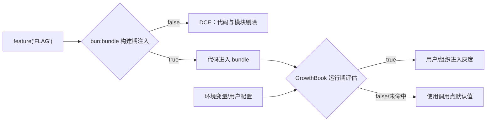
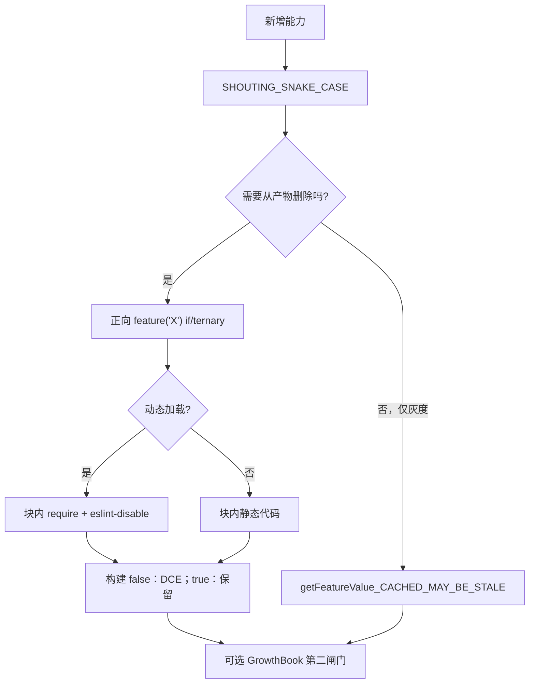

# 附录 E · `bun:bundle` 特性开关全清单(`feature()` Build Flags)

> **本附录定位**:Claude Code CLI 的**构建期开关矩阵**完整索引 — `bun:bundle` 提供的 `feature('NAME')` 在编译时为 external/ant 构建分别 DCE。本附录列举全部 **90 个 unique flag**,按 8 个功能域分组,含名称、用途摘要、首命中文件:行号、上下文代码片段。
>
> 详细 DCE 规则与 GrowthBook 软开关见 [`01-foundation/03-feature-flags.md`](../01-foundation/03-feature-flags.md);条件命令实战见 [`03-developer/16a-conditional-commands.md`](../03-developer/16a-conditional-commands.md);同名 GrowthBook 软键(`tengu_*`)列表见 [`04-architect/33-observability.md`](../04-architect/33-observability.md)。

## E.1 摘要

**实测**:`grep -rE "feature\(['\"][A-Z_]+['\"]\)" /Users/digoal/new/claude-code-main/src/` 命中 **90 个 unique flag** / **972 个 `feature()` 调用点**。每个 flag 一行 `SHOUTING_SNAKE_CASE`,通过正向 `if (feature('X'))` 或三元 `feature('X') ? require(...) : null` 让 Bun tree-shake 可识别。

## E.2 速赢

1. **总量**:**90 unique / 972 calls**。注意 `CLAUDE_IN_CHROME` 是能力族标签,源码没有同名 `feature()` 调用,**不计入** 90 个。
2. **分组**:A 核心运行模式 17 / B 上下文压缩 13 / C 远程协作 9 / D 能力扩展 21 / E Skills/Plugins 7 / F 诊断遥测 12 / G 平台浏览器 8 / H 安全分类器 2 / I 其他内部 1。
3. **DCE 三规则**:正条件 / 字符串字面量必须在真分支 / require 不能出真分支外(`src/QueryEngine.ts:120-128` 注释)。
4. **行为二分**:`true` → 代码进 bundle + 进一步 GrowthBook 灰度;`false` → 整个分支 DCE。
5. **常见字面量比较**:`process.env.USER_TYPE === 'ant'` 在构建期字面量判断,等价 `feature()`。

## E.3 双层闸门总览



## E.4 构建期开关矩阵(90 个)

> 格式:**`FLAG_NAME`** — 类别 — 用途摘要 — 关键文件:行 — 上下文片段
> 默认状态描述以"未注入发行 profile 时关闭"为准;具体发行版 profile 不在源码快照中。

### E.4.1 A · 核心运行模式(17)

#### `COORDINATOR_MODE`
- **类别**:核心运行模式
- **用途**:多 Agent 协调器;影响 QueryEngine、AgentTool、coordinator 会话
- **关键文件**:`src/QueryEngine.ts:115`
- **上下文**:`const getCoordinatorUserContext = feature('COORDINATOR_MODE') ? require('./coordinator/coordinatorMode.js').getCoordinatorUserContext : () => ({})`

#### `BRIDGE_MODE`
- **类别**:核心运行模式
- **用途**:IDE/CCR Bridge 反向通道;影响 bridge 命令、REPL hook、WebSocket 与远程安全命令
- **关键文件**:`src/hooks/useReplBridge.tsx:79`;`src/bridge/bridgeEnabled.ts:25`
- **上下文**:`const bridge = feature('BRIDGE_MODE') ? require('./commands/bridge/index.js').default : null`

#### `CCR_AUTO_CONNECT`
- **类别**:核心运行模式
- **用途**:`ccr_auto_connect` 自动连接逻辑
- **关键文件**:`src/bridge/bridgeEnabled.ts:186`

#### `CCR_MIRROR`
- **类别**:核心运行模式
- **用途**:`ccr_mirror` 镜像路径
- **关键文件**:`src/bridge/bridgeEnabled.ts:198`

#### `KAIROS`
- **类别**:核心运行模式
- **用途**:Assistant 模式;影响云端会话复用、bridge、提示词、命令和 UI
- **关键文件**:`src/bridge/bridgeMain.ts:1523`
- **上下文**:`const assistantCommand = feature('KAIROS') ? require('./commands/assistant/index.js').default : null`

#### `PROACTIVE`
- **类别**:核心运行模式
- **用途**:主动触发模式
- **关键文件**:`src/cli/print.ts:362`
- **上下文**:`const proactive = feature('PROACTIVE') || feature('KAIROS') ? require('./commands/proactive.js').default : null`

#### `AGENT_TRIGGERS`
- **类别**:核心运行模式
- **用途**:Schedule cron + 触发式 agent
- **关键文件**:`src/cli/print.ts:365`
- **上下文**:`const cronTools = feature('AGENT_TRIGGERS') ? [CronCreateTool, CronDeleteTool, CronListTool] : []`

#### `KAIROS_CHANNELS`
- **类别**:核心运行模式
- **用途**:Assistant 通道(Telegram/iMessage 等)
- **关键文件**:`src/cli/print.ts:1673`

#### `KAIROS_BRIEF`
- **类别**:核心运行模式
- **用途**:brief-only 模式
- **关键文件**:`src/commands/brief.ts:52`

#### `BG_SESSIONS`
- **类别**:核心运行模式
- **用途**:后台 `claude --bg` tmux 会话;影响 exit 路径与 `registerSession`
- **关键文件**:`src/commands/exit/exit.tsx:18`;`src/utils/concurrentSessions.ts:31`

#### `DAEMON`
- **类别**:核心运行模式
- **用途**:后台守护进程模式;影响 daemon 命令和 CLI 入口生命周期
- **关键文件**:`src/commands.ts:77`

#### `KAIROS_PUSH_NOTIFICATION`
- **类别**:核心运行模式
- **用途**:OS 推送通知集成
- **关键文件**:`src/components/Settings/Config.tsx:658`

#### `BYOC_ENVIRONMENT_RUNNER`
- **类别**:核心运行模式
- **用途**:BYOC 环境运行器
- **关键文件**:`src/entrypoints/cli.tsx:226`

#### `SELF_HOSTED_RUNNER`
- **类别**:核心运行模式
- **用途**:自托管 runner
- **关键文件**:`src/entrypoints/cli.tsx:238`

#### `DIRECT_CONNECT`
- **类别**:核心运行模式
- **用途**:`cc://` 深链接直达
- **关键文件**:`src/main.tsx:548`

#### `SSH_REMOTE`
- **类别**:核心运行模式
- **用途**:SSH 远程会话
- **关键文件**:`src/main.tsx:577`

#### `KAIROS_DREAM`
- **类别**:核心运行模式
- **用途**:Kairos dream 后台任务
- **关键文件**:`src/skills/bundled/index.ts:35`

### E.4.2 B · 上下文与会话压缩(13)

#### `HISTORY_SNIP`
- **类别**:上下文压缩
- **用途**:历史 snip 压缩;影响 QueryEngine、`/compact`、消息展示
- **关键文件**:`src/QueryEngine.ts:122`
- **上下文**:`const snipModule = feature('HISTORY_SNIP') ? require('./services/compact/snipCompact.js') : null`

#### `EXTRACT_MEMORIES`
- **类别**:上下文压缩
- **用途**:`extract_memories` 自动记忆抽取
- **关键文件**:`src/cli/print.ts:374`

#### `FILE_PERSISTENCE`
- **类别**:上下文压缩
- **用途**:`file_persistence` 文件级持久化
- **关键文件**:`src/cli/print.ts:2134`

#### `REACTIVE_COMPACT`
- **类别**:上下文压缩
- **用途**:响应式压缩(`prompt_too_long` 时被动触发)
- **关键文件**:`src/services/compact/autoCompact.ts:195`;`src/query.ts:15`

#### `PROMPT_CACHE_BREAK_DETECTION`
- **类别**:上下文压缩
- **用途**:prompt cache 断裂检测
- **关键文件**:`src/commands/compact/compact.ts:67`

#### `CONTEXT_COLLAPSE`
- **类别**:上下文压缩
- **用途**:上下文折叠(CTX collapse:90% 提交 / 95% 阻塞 spawn)
- **关键文件**:`src/commands/context/context-noninteractive.ts:50`

#### `TOKEN_BUDGET`
- **类别**:上下文压缩
- **用途**:token 预算控制
- **关键文件**:`src/components/PromptInput/PromptInput.tsx:534`

#### `TEAMMEM`
- **类别**:上下文压缩
- **用途**:TEAMMEM 团队共享记忆(`MemoryType.TeamMem`)
- **关键文件**:`src/components/memory/MemoryFileSelector.tsx:29`
- **上下文**:`...(feature('TEAMMEM') ? (['TeamMem'] as const) : []),`

#### `CACHED_MICROCOMPACT`
- **类别**:上下文压缩
- **用途**:缓存感知 microcompact;影响 query、API prompt 构建
- **关键文件**:`src/services/compact/microCompact.ts`;`src/query.ts:423`

#### `AWAY_SUMMARY`
- **类别**:上下文压缩
- **用途**:`/away` 自动总结
- **关键文件**:`src/hooks/useAwaySummary.ts:54`

#### `AGENT_MEMORY_SNAPSHOT`
- **类别**:上下文压缩
- **用途**:agent memory snapshot 持久化
- **关键文件**:`src/main.tsx:2258`

#### `MEMORY_SHAPE_TELEMETRY`
- **类别**:上下文压缩
- **用途**:memory 形态埋点
- **关键文件**:`src/memdir/findRelevantMemories.ts:66`

#### `COMPACTION_REMINDERS`
- **类别**:上下文压缩
- **用途**:压缩提醒注入 system prompt
- **关键文件**:`src/utils/attachments.ts:922`

### E.4.3 C · 远程、协作与同步(9)

#### `DOWNLOAD_USER_SETTINGS`
- **类别**:远程
- **用途**:`download_user_settings` 拉取用户配置
- **关键文件**:`src/cli/print.ts:511`

#### `COMMIT_ATTRIBUTION`
- **类别**:远程
- **用途**:`commit_attribution` 提交归因
- **关键文件**:`src/cli/print.ts:809`

#### `UDS_INBOX`
- **类别**:远程
- **用途**:Unix Domain Socket inbox;影响 peer/SendMessage、并发会话
- **关键文件**:`src/cli/print.ts:2685`

#### `CCR_REMOTE_SETUP`
- **类别**:远程
- **用途**:Claude Code Remote 安装(`/web-setup`)
- **关键文件**:`src/commands.ts:91`
- **上下文**:`const webCmd = feature('CCR_REMOTE_SETUP') ? require('./commands/remote-setup/index.js').default : null`

#### `KAIROS_GITHUB_WEBHOOKS`
- **类别**:远程
- **用途**:GitHub webhook 触发;影响 subscribe-pr
- **关键文件**:`src/commands.ts:101`

#### `NATIVE_CLIENT_ATTESTATION`
- **类别**:远程
- **用途**:native client attestation
- **关键文件**:`src/constants/system.ts:82`

#### `UPLOAD_USER_SETTINGS`
- **类别**:远程
- **用途**:`upload_user_settings` 同步配置到云
- **关键文件**:`src/main.tsx:963`

#### `HOOK_PROMPTS`
- **类别**:远程
- **用途**:hook prompt 模板注入
- **关键文件**:`src/screens/REPL.tsx:2520`

#### `AGENT_TRIGGERS_REMOTE`
- **类别**:远程
- **用途**:远程 Agent 触发(`RemoteTriggerTool`)
- **关键文件**:`src/skills/bundled/index.ts:56`

### E.4.4 D · 能力扩展与实验(21)

#### `BUDDY`
- **类别**:能力扩展
- **用途**:彩蛋子系统(CompanionSprite)
- **关键文件**:`src/buddy/CompanionSprite.tsx:168`

#### `FORK_SUBAGENT`
- **类别**:能力扩展
- **用途**:子代理 fork;影响 `/fork` 与 AgentTool
- **关键文件**:`src/commands/branch/index.ts:8`

#### `NEW_INIT`
- **类别**:能力扩展
- **用途**:新版 `/init`(`CLAUDE_CODE_NEW_INIT` env)
- **关键文件**:`src/commands/init.ts:230`

#### `VOICE_MODE`
- **类别**:能力扩展
- **用途**:语音输入;STT、VoiceIndicator
- **关键文件**:`src/commands.ts:80`

#### `WORKFLOW_SCRIPTS`
- **类别**:能力扩展
- **用途**:工作流脚本;`/workflows`
- **关键文件**:`src/commands.ts:86`

#### `ULTRAPLAN`
- **类别**:能力扩展
- **用途**:ultraplan 工具;关键词触发 + 模型配置
- **关键文件**:`src/commands.ts:104`

#### `TORCH`
- **类别**:能力扩展
- **用途**:实验性 Torch 命令
- **关键文件**:`src/commands.ts:107`

#### `MCP_SKILLS`
- **类别**:能力扩展
- **用途**:MCP-as-skill 注册
- **关键文件**:`src/commands.ts:550`

#### `QUICK_SEARCH`
- **类别**:能力扩展
- **用途**:快速搜索(REPL 内)
- **关键文件**:`src/components/PromptInput/PromptInput.tsx:1701`

#### `HISTORY_PICKER`
- **类别**:能力扩展
- **用途**:历史 picker
- **关键文件**:`src/components/PromptInput/PromptInput.tsx:1721`

#### `TERMINAL_PANEL`
- **类别**:能力扩展
- **用途**:终端面板 UI
- **关键文件**:`src/components/PromptInput/PromptInputHelpMenu.tsx:132`

#### `AUTO_THEME`
- **类别**:能力扩展
- **用途**:自动主题
- **关键文件**:`src/components/ThemePicker.tsx:113`

#### `MONITOR_TOOL`
- **类别**:能力扩展
- **用途**:`MonitorTool`(后台 monitor 任务)
- **关键文件**:`src/components/permissions/PermissionRequest.tsx:40`

#### `VERIFICATION_AGENT`
- **类别**:能力扩展
- **用途**:验证 agent(plan 退出)
- **关键文件**:`src/constants/prompts.ts:391`

#### `TEMPLATES`
- **类别**:能力扩展
- **用途**:模板系统
- **关键文件**:`src/entrypoints/cli.tsx:212`

#### `MESSAGE_ACTIONS`
- **类别**:能力扩展
- **用途**:消息 action 快捷键
- **关键文件**:`src/keybindings/defaultBindings.ts:88`

#### `WEB_BROWSER_TOOL`
- **类别**:能力扩展
- **用途**:WebBrowser 工具(codename bagel)
- **关键文件**:`src/main.tsx:1571`

#### `BUILTIN_EXPLORE_PLAN_AGENTS`
- **类别**:能力扩展
- **用途**:Explore/Plan 内置 agent(`BUILTIN_EXPLORE_PLAN_AGENTS`)
- **关键文件**:`src/tools/AgentTool/builtInAgents.ts:14`

#### `MCP_RICH_OUTPUT`
- **类别**:能力扩展
- **用途**:MCP 富输出渲染
- **关键文件**:`src/tools/MCPTool/UI.tsx:51`

#### `OVERFLOW_TEST_TOOL`
- **类别**:能力扩展
- **用途**:测试用 overflow 工具
- **关键文件**:`src/tools.ts:107`

#### `ULTRATHINK`
- **类别**:能力扩展
- **用途**:extended thinking 深度档
- **关键文件**:`src/utils/thinking.ts:20`

### E.4.5 E · Skills / Plugins / 开发者工具(7)

#### `STREAMLINED_OUTPUT`
- **类别**:开发者工具
- **用途**:简化输出格式
- **关键文件**:`src/cli/print.ts:857`

#### `EXPERIMENTAL_SKILL_SEARCH`
- **类别**:Skills
- **用途**:实验性 skill 搜索(`/clear-skill-index-cache`)
- **关键文件**:`src/commands.ts:96`

#### `CONNECTOR_TEXT`
- **类别**:Skills
- **用途**:连接器文本格式
- **关键文件**:`src/components/Message.tsx:454`

#### `BUILDING_CLAUDE_APPS`
- **类别**:Plugins
- **用途**:Claude 应用构建 bundled skill
- **关键文件**:`src/skills/bundled/index.ts:64`

#### `RUN_SKILL_GENERATOR`
- **类别**:Skills
- **用途**:skill 生成器
- **关键文件**:`src/skills/bundled/index.ts:73`

#### `SKILL_IMPROVEMENT`
- **类别**:Skills
- **用途**:skill 改进机制
- **关键文件**:`src/utils/hooks/skillImprovement.ts:177`

#### `ALLOW_TEST_VERSIONS`
- **类别**:开发者工具
- **用途**:允许测试版本(autoupdate)
- **关键文件**:`src/utils/nativeInstaller/download.ts:124`

### E.4.6 F · 诊断、遥测与测试(12)

#### `SKIP_DETECTION_WHEN_AUTOUPDATES_DISABLED`
- **类别**:诊断
- **用途**:autoupdate 关闭时跳过检测
- **关键文件**:`src/components/AutoUpdaterWrapper.tsx:36`

#### `SHOT_STATS`
- **类别**:诊断
- **用途**:截屏统计(shot stats)
- **关键文件**:`src/components/Stats.tsx:391`

#### `REVIEW_ARTIFACT`
- **类别**:诊断
- **用途**:review 工件生成
- **关键文件**:`src/components/permissions/PermissionRequest.tsx:36`

#### `ABLATION_BASELINE`
- **类别**:诊断
- **用途**:消融实验基线
- **关键文件**:`src/entrypoints/cli.tsx:21`

#### `DUMP_SYSTEM_PROMPT`
- **类别**:诊断
- **用途**:`/dump-system-prompt` 导出
- **关键文件**:`src/entrypoints/cli.tsx:53`

#### `HARD_FAIL`
- **类别**:诊断
- **用途**:崩溃测试模式
- **关键文件**:`src/utils/log.ts:160`;`src/main.tsx:3870`

#### `COWORKER_TYPE_TELEMETRY`
- **类别**:遥测
- **用途**:`coworker_type_telemetry`
- **关键文件**:`src/services/analytics/metadata.ts:603`

#### `ANTI_DISTILLATION_CC`
- **类别**:遥测
- **用途**:anti distillation 防御
- **关键文件**:`src/services/api/claude.ts:303`

#### `UNATTENDED_RETRY`
- **类别**:遥测
- **用途**:无人值守重试
- **关键文件**:`src/services/api/withRetry.ts:101`

#### `SLOW_OPERATION_LOGGING`
- **类别**:遥测
- **用途**:慢操作日志阈值
- **关键文件**:`src/utils/slowOperations.ts:157`

#### `PERFETTO_TRACING`
- **类别**:遥测
- **用途**:Perfetto 火焰图导出
- **关键文件**:`src/utils/telemetry/perfettoTracing.ts:260`

#### `ENHANCED_TELEMETRY_BETA`
- **类别**:遥测
- **用途**:增强遥测(beta session tracing)
- **关键文件**:`src/utils/telemetry/sessionTracing.ts:9`

### E.4.7 G · 平台、浏览器与运行环境(8)

#### `CHICAGO_MCP`
- **类别**:平台
- **用途**:Computer-use 沙箱(`@ant/computer-use-mcp`)
- **关键文件**:`src/entrypoints/cli.tsx:86`;`src/query/stopHooks.ts:164`

#### `LODESTONE`
- **类别**:平台
- **用途**:`LODESTONE` 深链接协议注册
- **关键文件**:`src/interactiveHelpers.tsx:176`

#### `TREE_SITTER_BASH_SHADOW`
- **类别**:平台
- **用途**:tree-sitter bash 影子解析(对照老 parser)
- **关键文件**:`src/tools/BashTool/bashPermissions.ts:1683`

#### `TREE_SITTER_BASH`
- **类别**:平台
- **用途**:tree-sitter bash 解析器
- **关键文件**:`src/utils/bash/parser.ts:51`

#### `IS_LIBC_MUSL`
- **类别**:平台
- **用途**:musl libc 检测(Alpine)
- **关键文件**:`src/utils/envDynamic.ts:53`

#### `IS_LIBC_GLIBC`
- **类别**:平台
- **用途**:glibc 检测(Linux 标准)
- **关键文件**:`src/utils/envDynamic.ts:54`

#### `NATIVE_CLIPBOARD_IMAGE`
- **类别**:平台
- **用途**:原生剪贴板图片粘贴
- **关键文件**:`src/utils/imagePaste.ts:101`

#### `POWERSHELL_AUTO_MODE`
- **类别**:平台
- **用途**:PowerShell 自动模式
- **关键文件**:`src/utils/permissions/permissions.ts:574`

### E.4.8 H · 安全、分类器与权限(2)

#### `TRANSCRIPT_CLASSIFIER`
- **类别**:分类器
- **用途**:transcript auto 分类器;影响 auto 权限、工具结果、bridge guard
- **关键文件**:`src/cli/print.ts:1067`

#### `BASH_CLASSIFIER`
- **类别**:分类器
- **用途**:Bash 命令分类器;影响 shell 解析、审批、权限与日志
- **关键文件**:`src/cli/structuredIO.ts:72`

### E.4.9 I · 其他内部开关(1)

#### `BREAK_CACHE_COMMAND`
- **类别**:内部
- **用途**:`break_cache_command` 缓存失效命令
- **关键文件**:`src/context.ts:131`

### E.4.10 非 `feature()` 能力族(参考)

#### `CLAUDE_IN_CHROME`
- **类别**:能力族(非 `feature()`)
- **用途**:Chrome 集成能力族;由 Chrome MCP/skill 与 GrowthBook 自动启用键控制
- **关键文件**:`src/utils/claudeInChrome/setup.ts:81`;`src/skills/bundled/claudeInChrome.ts`
- **说明**:源码没有同名 `feature()` 调用,不计入 90 个 unique flag。

## E.5 三条 DCE 约束

来自 `src/QueryEngine.ts:120-128` 与 `src/bridge/bridgeEnabled.ts:161-163` 的注释:



1. **必须正条件**:`feature(X) ? include : null`,而不是 `if (!feature(X)) return early`。
2. **字符串字面量必须在真分支**:`feature(X) ? 'available' : ''` ✅;`if (!feature(X)) throw 'not available'` ❌。
3. **require 必须在 feature 块内并禁用 lint**:`// eslint-disable @typescript-eslint/no-require-imports` 包住 require。

## E.6 反模式

### ❌ 用 `if (!feature(X)) return ...`

```typescript
// 错误:bundler 看到 if/return 不会消除字符串字面量
function getTools() {
  if (!feature('MONITOR_TOOL')) return []
  return require('./MonitorTool...').MonitorTool
}
// 正确
const MonitorTool = feature('MONITOR_TOOL')
  ? require('./MonitorTool...').MonitorTool
  : null
```

### ❌ `process.env.NODE_ENV === 'production'` 当 feature

`NODE_ENV === 'production'` 两分支都进 bundle;`USER_TYPE === 'ant'` 字面量比较才有 DCE。

### ❌ 把 feature call 抽到独立函数

```typescript
// 错误:bundler 无法穿透函数边界
function isBridgeOn() { return feature('BRIDGE_MODE') }
if (isBridgeOn()) require('./bridge.js')
```

### ❌ 修改公开版 CLI"暴露"内部命令

公开版用 `bun:bundle` 静态链接字面量 `false` 的 `feature()`;fork 源码改动需要同时开 feature + 移除 `INTERNAL_ONLY_COMMANDS`,违反内部分发协议。

## E.7 与 GrowthBook 软开关的关系

`feature('X')` 是**编译期硬闸门**;`getFeatureValue_CACHED_MAY_BE_STALE('tengu_xxx', defaultValue)` 是**运行期软开关**。两者并存:

- **外层 feature()** 决定代码是否进入 bundle(影响体积)
- **内层 GrowthBook** 决定代码对哪些用户启用(影响行为)

典型双闸门写法:
```typescript
if (feature('ULTRATHINK')) {                    // 编译期
  if (getFeatureValue_CACHED_MAY_BE_STALE('tengu_turtle_carbon', true)) {  // 运行期
    // ... ultrathink 行为
  }
}
```

完整 GrowthBook 软键(98 个 `tengu_*`)见 [`01-foundation/03-feature-flags.md`](../01-foundation/03-feature-flags.md) §4 / [`04-architect/33-observability.md`](../04-architect/33-observability.md)。

## E.8 引用

- [`01-foundation/03-feature-flags.md`](../01-foundation/03-feature-flags.md) — 188 flag 完整注册表(主文档)
- [`03-developer/16a-conditional-commands.md`](../03-developer/16a-conditional-commands.md) — conditional command 实战
- [`04-architect/33-observability.md`](../04-architect/33-observability.md) — GrowthBook 软开关与 OTel
- [`05-appendices/06-conditional-commands.md`](06-conditional-commands.md) — INTERNAL_ONLY 命令索引
- [`05-appendices/04-telemetry.md`](04-telemetry.md) — `tengu_*` 事件目录