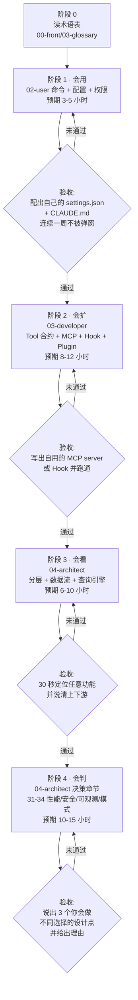

# Claude Code CLI 源码深度解析

## 从用户到架构师的全景 handbook

> **基于 2026-03-31 泄露源码的体系化技术文档**
>
> 51.2 万行 TypeScript · 1,902 文件 · 50+ 用户可见命令 · 43 工具 · 8 大子系统
>
> 63 篇章节 · 27,141 行分析 · 129 张 Mermaid 图

---

## 简介

这是一本从**用户、开发者、架构师**三种身份出发,系统拆解 Claude Code CLI 内部实现的中文 handbook。它建立在 2026 年 3 月 31 日经 npm `.map` 文件流出的完整 TypeScript 源码之上 —— `src/` 目录里有的,这里都有;没有的(`package.json`、`tsconfig.json`、测试代码),本书也只能推断并标注。

写作原则有三:**每一个论断都标注 `file:line` 源码坐标**;**每一个抽象概念都配 Mermaid 图**;**每一条结论都区分"文档事实"与"代码推断"**。这意味着,只要官方版本与泄露版出现差异,本书的每条引用都可以被定位并纠正。

本书不是 Claude Code 的官方文档。当官方文档说"自动"时,本书告诉你阈值在哪一行;当官方文档说"支持 MCP"时,本书告诉你六种 transport 的协议差异;当官方文档说"权限模式"时,本书告诉你 7 种用户态 × 5 层检查链 × 11 种 `PermissionDecisionReason` 的笛卡尔积。

---

## 三视角导览

Claude Code 的源码有 51.2 万行,**不存在"从头读到尾"这种读法**。本书为三类读者各铺了一条主干路径 —— 入口、密度、跳过的内容完全不同。选一条,读完,再回头补另一条。

```mermaid
flowchart LR
    subgraph U["用户视角"]
        U0["起点<br/>00-front/03-glossary"]
        U1["01-foundation<br/>背景/能力矩阵"]
        U2["02-user<br/>04→15 日常使用"]
        U3["产出<br/>自己的 settings.json<br/>+ CLAUDE.md + 工作流"]
    end
    subgraph D["开发者视角"]
        D0["起点<br/>00-front/03-glossary"]
        D1["01-foundation<br/>02 技术栈 + 04 导览"]
        D2["03-developer<br/>16→24 扩展与构建"]
        D3["产出<br/>MCP server / 插件<br/>/ Hook / 自定义工具"]
    end
    subgraph A["架构师视角"]
        A0["起点<br/>00-front/03-glossary"]
        A1["01-foundation<br/>03 feature flags"]
        A2["04-architect<br/>25→34 子系统与模式"]
        A3["产出<br/>可迁移的设计判断"]
    end
    U0 --> U1 --> U2 --> U3
    D0 --> D1 --> D2 --> D3
    A0 --> A1 --> A2 --> A3
    U3 -.想动手改.-> D0
    D3 -.想理解取舍.-> A0
```

### 路径 1 · 用户视角 —— "我想用好 Claude Code"

**你是谁**:每天用 Claude Code 写代码,会用基本命令,但感觉"没用到它一半能力"。你可能不写 TypeScript,也不打算读源码。

**关心**:命令怎么用、配置怎么写、权限怎么不被弹窗打断、上下文怎么管理。

**阅读顺序**:

**核心章节**:

| 序 | 章节 | 读完你能 |
|---|---|---|
| 1 | [`00-front/03-glossary.md`](00-front/03-glossary.md) | 看懂后续所有章节的名词 |
| 2 | [`02-user/04-install.md`](02-user/04-install.md) | 装上并验证它能跑 |
| 3 | [`02-user/04a-04c`](02-user/04a-claudeai-auth.md) | 3 种认证路径(Claude.ai / OAuth / Bedrock/Vertex) |
| 4 | [`02-user/06-commands.md`](02-user/06-commands.md) | 50+ `/` 命令清单与用法 |
| 5 | [`02-user/07-permissions.md`](02-user/07-permissions.md) | 7 种 `PermissionMode` 与权限规则 |
| 6 | [`02-user/08a-settings.md`](02-user/08a-settings.md) | 100+ 字段的 `settings.json` 全解 |
| 7 | [`02-user/09b-compact.md`](02-user/09b-compact.md) | 5 种压缩机制与触发阈值 |
| 8 | [`02-user/13a-mcp.md`](02-user/13a-mcp.md) ~ [`13c-plugins.md`](02-user/13c-plugins.md) | 外部能力接入的 4 种方式 |
| 9 | [`02-user/15-troubleshooting.md`](02-user/15-troubleshooting.md) | 遇到问题去哪查 |

**预期时长**:**2-3 小时通读**。读表 + 改配置为主,代码块可跳。

---

### 路径 2 · 开发者视角 —— "我想扩展或 fork Claude Code"

**你是谁**:想写一个 MCP server、一个插件、一组 Hook,或者干脆 fork 一份自己改。你读 TypeScript,想知道扩展点的**准确契约**。

**关心**:类型签名、Hook 协议、MCP transport、构建流程、调试方法。

**阅读顺序**:

**核心章节**:

| 序 | 章节 | 读完你能 |
|---|---|---|
| 1 | [`00-front/03-glossary.md`](00-front/03-glossary.md) | 同上 |
| 2 | [`01-foundation/02-tech-stack.md`](01-foundation/02-tech-stack.md) | 依赖清单与子系统技术选型 |
| 3 | [`01-foundation/04-codebase-tour.md`](01-foundation/04-codebase-tour.md) | 1,902 文件的地图 |
| 4 | [`03-developer/16-tool-contract.md`](03-developer/16-tool-contract.md) | `Tool<Input, Output, P>` 约 40 个方法的契约 |
| 5 | [`03-developer/17-build-a-tool.md`](03-developer/17-build-a-tool.md) | 手把手写一个自定义工具 |
| 6 | [`03-developer/18-commands.md`](03-developer/18-commands.md) | 三种命令类型 + 懒加载机制 |
| 7 | [`03-developer/19-ui-patterns.md`](03-developer/19-ui-patterns.md) | Ink 组件、焦点、Modal、虚拟列表 |
| 8 | [`03-developer/20-schemas.md`](03-developer/20-schemas.md) | Zod v4 单一事实源 |
| 9 | [`03-developer/22-telemetry.md`](03-developer/22-telemetry.md) | 23 个信号与采样规则 |
| 10 | [`03-developer/23-build.md`](03-developer/23-build.md) | bun bundle + `feature()` 宏死代码消除 |
| 11 | [`03-developer/24-workflow.md`](03-developer/24-workflow.md) | 命令装配、Task 生命周期、Hook 总线 |

**预期时长**:**4-6 小时**。读类型 + 写代码为主,UI 配置章节可跳。

---

### 路径 3 · 架构师视角 —— "我想学习系统设计"

**你是谁**:在设计自己的 Agent 系统 / CLI 工具 / LLM 应用,想看一个 51 万行规模的生产级实现是怎么组织的。

**关心**:分层、数据流、调度策略、性能取舍、安全纵深。

**阅读顺序**:

**核心章节**:

| 序 | 章节 | 读完你能 |
|---|---|---|
| 1 | [`00-front/03-glossary.md`](00-front/03-glossary.md) | 同上 |
| 2 | [`01-foundation/03-feature-flags.md`](01-foundation/03-feature-flags.md) | 构建期 DCE + 运行期 GrowthBook 双层机制 |
| 3 | [`04-architect/25-layered-arch.md`](04-architect/25-layered-arch.md) | 五层架构与依赖方向规则 |
| 4 | [`04-architect/26-data-flow.md`](04-architect/26-data-flow.md) | 从一次按键到一次渲染的完整链路 |
| 5 | [`04-architect/27-query-engine.md`](04-architect/27-query-engine.md) | 会话生命周期与轮次状态机 |
| 6 | [`04-architect/28-streaming.md`](04-architect/28-streaming.md) | `StreamingToolExecutor` 并发调度模型 |
| 7 | [`04-architect/29-permission.md`](04-architect/29-permission.md) | 五阶段检查链与纵深防御 |
| 8 | [`04-architect/30-subsystems.md`](04-architect/30-subsystems.md) | 8 大子系统的接口与依赖 |
| 9 | [`04-architect/31-performance.md`](04-architect/31-performance.md) | 启动、压缩、内存、并发优化 |
| 10 | [`04-architect/32-security.md`](04-architect/32-security.md) | 攻击面与认证 |
| 11 | [`04-architect/34-patterns.md`](04-architect/34-patterns.md) | 15+ 经典架构模式总结 |

**预期时长**:**6-8 小时**。读图 + 追调用链 + 对照自己的系统为主,API 细节可跳。

---

## 三角视图:同一个概念在哪些章节

下表是本书的**概念索引**。每个概念都在三个视角下被讲到,但深度不同。交叉格告诉你"这一章会讲到什么程度",最右列给出源码锚点 —— 当章节还没写到、或你想直接看原文时,从锚点切入。

| 概念 | 用户章 | 开发者章 | 架构师章 | 源码锚点 |
|---|---|---|---|---|
| **Permission** | 07 | 16 | 29 | `src/types/permissions.ts:14-40`、`src/utils/permissions/PermissionResult.ts:251` |
| **Tool** | 06 | 16, 17 | 28 | `src/Tool.ts:362`、`src/Tool.ts:783` |
| **Feature Flag** | 06 | 23 | 25 | `bun:bundle`(Bun 内置宏)、`01-foundation/03-feature-flags.md` |
| **Compact** | 09b | (隐式) | 27 | `src/services/compact/autoCompact.ts:160`、`src/services/compact/microCompact.ts:446` |
| **OAuth / 3P** | 04a, 04b, 04c | (隐式) | 32 | `src/services/oauth/`、`src/services/bedrock/`、`src/services/vertex/` |
| **MCP** | 13a | 20 | 30 | `src/services/mcp/client.ts`、`src/services/tools/toolExecution.ts:283` |
| **Runtime Mode** | 13d | (隐式) | 30a | `src/entrypoints/`、`src/screens/REPL.tsx:572` |
| **Skill vs Plugin** | 13b, 13c | 18 | 30 | `src/utils/plugins/loadPluginCommands.ts:218` |
| **Memory** | 14 | (隐式) | 30 | `src/commands/memory/memory.tsx`、`src/memdir/` |
| **Bridge / IDE** | 12 | (隐式) | 30 | `src/bridge/bridgeMain.ts:1523`、`src/hooks/useReplBridge.tsx` |
| **QueryEngine** | — (不可见) | — | 27 | `src/QueryEngine.ts:184`、`src/QueryEngine.ts:288-300` |
| **StreamingToolExecutor** | — | — | 28 | `src/services/tools/StreamingToolExecutor.ts:40`、`src/services/tools/StreamingToolExecutor.ts:388-395` |
| **Hook** | 08d | 24 | 29 | `src/utils/hooks/hookEvents.ts:51-91` |
| **settings.json** | 08a | 20 | 25 | `src/utils/settings/types.ts:1104`、`src/utils/settings/settings.ts:527` |
| **CLAUDE.md** | 08b | — | 26 | `src/utils/claudemd.ts:547` |
| **transcript** | 09 | 22 | 26 | `src/utils/sessionStorage.ts:1408` |

**怎么用这张表**:确定你的视角(选一列)→ 找到你关心的概念(选一行)→ 交叉格告诉你"这一章会讲到什么程度"→ 如果不够,用最右列的锚点直接读源码。

---

## 完整目录

### [`00-front/`](00-front/) —— 读前必读

| 章节 | 主题 |
|---|---|
| [`00-front/01-leak-context.md`](00-front/01-leak-context.md) | 泄露背景与源码边界(强制前置) |
| [`00-front/02-three-perspectives.md`](00-front/02-three-perspectives.md) | 三视角阅读指引(选路径) |
| [`00-front/03-glossary.md`](00-front/03-glossary.md) | 术语基线表 —— 50 个核心术语 |

### [`01-foundation/`](01-foundation/) —— 全局背景

| 章节 | 主题 |
|---|---|
| [`01-foundation/01-background.md`](01-foundation/01-background.md) | Claude Code 是什么 —— 能力矩阵与适用边界 |
| [`01-foundation/02-tech-stack.md`](01-foundation/02-tech-stack.md) | 技术栈 —— 依赖清单与子系统技术选型 |
| [`01-foundation/03-feature-flags.md`](01-foundation/03-feature-flags.md) | 特性开关矩阵 —— 188 个开关(90 构建期 + 98 运行期) |
| [`01-foundation/04-codebase-tour.md`](01-foundation/04-codebase-tour.md) | 代码库导览 —— 1,902 文件地图 |

### [`02-user/`](02-user/) —— 用户视角(27 章)

| 章节 | 主题 |
|---|---|
| [`02-user/04-install.md`](02-user/04-install.md) | 安装 Claude Code CLI |
| [`02-user/04a-claudeai-auth.md`](02-user/04a-claudeai-auth.md) | Claude AI 订阅认证路径 |
| [`02-user/04b-oauth-flow.md`](02-user/04b-oauth-flow.md) | OAuth 浏览器流的完整技术内幕 |
| [`02-user/04c-3p-providers.md`](02-user/04c-3p-providers.md) | 第三方云(3P)提供商:Bedrock / Vertex / Foundry |
| [`02-user/04d-onboarding.md`](02-user/04d-onboarding.md) | 首次体验:`/init`、`/memory` 与 5 件事 |
| [`02-user/05-daily-use.md`](02-user/05-daily-use.md) | 日常使用:启动、会话、退出码 |
| [`02-user/06-commands.md`](02-user/06-commands.md) | Slash 命令速查 —— 50+ 命令、8 大分类、5 个工作流剧本 |
| [`02-user/07-permissions.md`](02-user/07-permissions.md) | 权限系统(用户视角)—— 7 种模式、优先级链、Shift+Tab 切换 |
| [`02-user/08a-settings.md`](02-user/08a-settings.md) | `settings.json` 字段全解 —— 4 层加载源 + 100+ 字段参考 |
| [`02-user/08b-claudemd.md`](02-user/08b-claudemd.md) | CLAUDE.md 6 种类型详解 —— 加载顺序、frontmatter、@import 语法 |
| [`02-user/08c-mcp-config.md`](02-user/08c-mcp-config.md) | MCP 配置(`.mcp.json`)详解 —— transport、scope、allowlist/denylist |
| [`02-user/08d-hooks.md`](02-user/08d-hooks.md) | Hooks 系统详解 —— 26 个事件、4 种类型、安全配置 |
| [`02-user/09-session-history.md`](02-user/09-session-history.md) | 会话管理、历史与并发 |
| [`02-user/09b-compact.md`](02-user/09b-compact.md) | 上下文压缩 —— 5 阶段级联与 token 预算 |
| [`02-user/10-ui.md`](02-user/10-ui.md) | UI 总览 —— Ink 渲染栈与组件图谱 |
| [`02-user/10b-voice.md`](02-user/10b-voice.md) | Voice Mode —— 语音输入模式 |
| [`02-user/10c-buddy.md`](02-user/10c-buddy.md) | Buddy —— 陪伴生物子系统(彩蛋) |
| [`02-user/10d-output-styles.md`](02-user/10d-output-styles.md) | Output Styles —— LLM 输出样式 |
| [`02-user/10e-theming.md`](02-user/10e-theming.md) | 主题与配色系统 |
| [`02-user/11-multi-agent.md`](02-user/11-multi-agent.md) | 多 Agent 协作 |
| [`02-user/12-ide-bridge.md`](02-user/12-ide-bridge.md) | IDE Bridge —— 与外部编辑器的双向通信 |
| [`02-user/13a-mcp.md`](02-user/13a-mcp.md) | MCP 集成 —— 连接外部工具 |
| [`02-user/13b-skills.md`](02-user/13b-skills.md) | Skills 系统 |
| [`02-user/13c-plugins.md`](02-user/13c-plugins.md) | Plugins 系统 |
| [`02-user/13d-runtime-modes.md`](02-user/13d-runtime-modes.md) | 运行时拓扑 —— 5 种进程模式 |
| [`02-user/14-memory.md`](02-user/14-memory.md) | 记忆系统 —— `CLAUDE.md` 与 session memory |
| [`02-user/15-troubleshooting.md`](02-user/15-troubleshooting.md) | 故障排查指南 |

### [`03-developer/`](03-developer/) —— 开发者视角(10 章)

| 章节 | 主题 |
|---|---|
| [`03-developer/16-tool-contract.md`](03-developer/16-tool-contract.md) | Tool 合约 —— `Tool<Input, Output, P>` 接口完整契约 |
| [`03-developer/16a-conditional-commands.md`](03-developer/16a-conditional-commands.md) | 条件命令与动态启用 |
| [`03-developer/17-build-a-tool.md`](03-developer/17-build-a-tool.md) | 构建一个自定义工具(实战) |
| [`03-developer/18-commands.md`](03-developer/18-commands.md) | 命令系统 —— 注册、解析、调度与 fork 编排 |
| [`03-developer/19-ui-patterns.md`](03-developer/19-ui-patterns.md) | UI 开发模式 —— 组件、焦点、Modal、虚拟列表 |
| [`03-developer/20-schemas.md`](03-developer/20-schemas.md) | Schema 契约 —— Zod v4 单一事实源 |
| [`03-developer/21-logging.md`](03-developer/21-logging.md) | 日志体系 —— debug、error 与 API 三大日志通道 |
| [`03-developer/22-telemetry.md`](03-developer/22-telemetry.md) | Telemetry 体系 —— 信号、采样、隐私门控 |
| [`03-developer/23-build.md`](03-developer/23-build.md) | 构建与打包 —— bun bundle、MACRO 注入与 `feature()` 死代码消除 |
| [`03-developer/24-workflow.md`](03-developer/24-workflow.md) | 命令装配、Task 生命周期与 Hook 总线 |

### [`04-architect/`](04-architect/) —— 架构师视角(12 章)

| 章节 | 主题 |
|---|---|
| [`04-architect/25-layered-arch.md`](04-architect/25-layered-arch.md) | 分层架构基线 —— Claude Code CLI 的五层架构模型 |
| [`04-architect/26-data-flow.md`](04-architect/26-data-flow.md) | 端到端数据流 —— 从一次按键到一次渲染 |
| [`04-architect/27-query-engine.md`](04-architect/27-query-engine.md) | QueryEngine —— 会话生命周期与轮次状态机 |
| [`04-architect/28-streaming.md`](04-architect/28-streaming.md) | StreamingToolExecutor —— 流式并发执行模型 |
| [`04-architect/29-permission.md`](04-architect/29-permission.md) | 权限系统 —— 五阶段检查链与纵深防御 |
| [`04-architect/30-subsystems.md`](04-architect/30-subsystems.md) | 子系统地图 —— 8 大子系统的接口与依赖 |
| [`04-architect/30a-runtime-modes.md`](04-architect/30a-runtime-modes.md) | 5 种运行时拓扑 —— 进程级架构视图 |
| [`04-architect/30b-sandboxing.md`](04-architect/30b-sandboxing.md) | 沙箱子系统 —— 命令级隔离与决策链 |
| [`04-architect/31-performance.md`](04-architect/31-performance.md) | 性能与可扩展性 —— 启动、压缩、内存、并发 |
| [`04-architect/32-security.md`](04-architect/32-security.md) | 安全与信任模型 —— 攻击面、纵深防御、认证 |
| [`04-architect/33-observability.md`](04-architect/33-observability.md) | 可观测性 —— OpenTelemetry + Debug 日志 + Profiling + 错误日志 |
| [`04-architect/34-patterns.md`](04-architect/34-patterns.md) | 模式库 —— 15+ 经典架构模式总结 |

### [`05-appendices/`](05-appendices/) —— 附录索引

| 章节 | 主题 |
|---|---|
| [`05-appendices/01-file-tree.md`](05-appendices/01-file-tree.md) | 完整文件树与子系统归属 |
| [`05-appendices/02-type-cards.md`](05-appendices/02-type-cards.md) | 核心类型卡片速查 |
| [`05-appendices/03-commands.md`](05-appendices/03-commands.md) | 命令完整参考(开发版) |
| [`05-appendices/04-telemetry.md`](05-appendices/04-telemetry.md) | Telemetry 信号完整表 |
| [`05-appendices/05-build-flags.md`](05-appendices/05-build-flags.md) | 构建开关完整表 |
| [`05-appendices/06-conditional-commands.md`](05-appendices/06-conditional-commands.md) | 条件命令速查 |
| [`05-appendices/07-glossary-index.md`](05-appendices/07-glossary-index.md) | 术语索引与交叉引用 |

---

## 阅读建议

### 入门 → 进阶 → 深入的渐进路径

四个阶段以"能动手做出东西"为验收标准,而不是"读完了":

### 不同身份的最佳路径

**如果你是产品经理 / 终端用户 / 新手**:
走**用户路径**。读完 `00-front/03-glossary.md`、`02-user/04-07`(安装/认证/命令/权限),然后跳到 `02-user/15-troubleshooting.md` 收藏备查。其他章节按需查阅。**不要**试图通读。

**如果你是 TypeScript 工程师 / Anthropic 生态贡献者**:
走**开发者路径**。先读 `00-front/03-glossary.md` + `01-foundation/02-tech-stack.md` + `01-foundation/04-codebase-tour.md` 建立地图,然后直接看 `03-developer/16-tool-contract.md` 与 `17-build-a-tool.md`。遇到不熟悉的子系统,回到 `04-architect/30-subsystems.md` 看它在整体中的位置。

**如果你是分布式系统 / AI Agent 工程师 / 技术 Lead**:
走**架构师路径**。先读 `01-foundation/03-feature-flags.md` 了解死代码消除机制,然后从 `04-architect/25-layered-arch.md` 开始。重点关注 27、28、29 三章 —— 它们是 Agent 系统设计的核心决策。`04-architect/34-patterns.md` 是迁移性最强的总结章。

**如果你是安全 / 平台工程师**:
直接读 `04-architect/29-permission.md`、`04-architect/30b-sandboxing.md`、`04-architect/32-security.md` 三章,以及 `02-user/07-permissions.md`、`08d-hooks.md`。它们构成完整的"权限 + 沙箱 + Hook 拦截"三层防御。

### 关于跳级

- **可以跳的**:如果你已经是 Claude Code 重度用户,阶段 1 只需读"配置与权限"两章补齐默认值知识。
- **不建议跳的**:阶段 2 → 阶段 4。不理解扩展点的实际约束就去评价架构决策,很容易得出"这里过度设计了"的错误结论 —— 而这些设计往往正是为了支撑那些你没读到的扩展点。典型例子:`PermissionResult` 的 `passthrough` 中间态,单看权限模块像是冗余,读过 MCP + Hook + classifier 三个扩展点后才会明白它是必需的。

---

## 资源与限制

### 源码泄露事件背景

2026 年 3 月 31 日,Claude Code CLI 的完整 TypeScript 源码经由 npm registry 中未剥离的 source map(`.map`)文件流出,发现者 Chaofan Shou (@Fried_rice, FuzzLand) 在 X 上公开宣布。`.map` 文件里嵌入的 `sourcesContent` 是打包器为调试保留的原始文本,所以我们拿到的是"进入打包器之前的 `src/`",而不是 Anthropic 的 git 仓库。

**泄露规模**:1,902 个文件 / 512,664 行 TypeScript。

### 本 handbook 的限制

我们拿到的是 `src/` 完整目录,但**没有**:

| 缺失项 | 影响 |
|---|---|
| `package.json` | 无法读取依赖版本号;只能从 `import` 语句推断运行时依赖 |
| `tsconfig.json` | 无法读取 `strict`、`paths`、编译目标等编译选项 |
| `bunfig.toml` / lockfile | 无法读取构建配置与确定性版本 |
| `__tests__/` | **0 个测试文件**;不是因为 Anthropic 不写测试,而是因为测试根本不进 bundle |
| CI 脚本、文档、二进制资源 | 完全缺失 |

这意味着所有版本号、构建参数、打包目标都只能从代码内部**推断**而非读取。`01-foundation/02-tech-stack.md` 与 `00-front/01-leak-context.md` 详细交代了这些边界。

### 与官方版的潜在差异

- 本 handbook 基于 2026-03-31 的泄露快照。**官方版本可能在之后已修复若干 bug、调整默认值、增加新功能**。
- 任何与 `docs.claude.com` 冲突的地方,**以官方文档为准**。
- 本 handbook 的价值在于官方文档**不写**的那一层:默认值、优先级、触发条件、隐藏态、未导出 API。

### 引用纪律

本书中所有论断都带 `file:line` 源码坐标,例如 `src/Tool.ts:362-705`。这些是**快照坐标**而非永久地址:

- 对不上时,先用符号名搜索定位(`class Tool`、`function buildTool` 等)。
- 若符号也不存在,说明该 API 已被官方版本移除或重命名 —— 欢迎提交 PR 修正。

---

## 贡献与维护

### 如何提交修正

最常见的修正是**行号偏移**:官方版可能新增/删除了几行,导致引用 `src/X.ts:123` 的实际位置变成 `:135`。修正步骤:

1. 用符号名搜索定位新位置(如 `rg "function buildTool" src/`)
2. 在对应章节文件中编辑 `file:line` 引用
3. 提交 PR,标题格式 `fix: correct line ref in §X.Y`

### 如何补充新章节

### 如何报告"未覆盖的概念"

如果在阅读过程中发现某个概念没有出现在"三角视图"表中,或者表中标注的深度与实际不符,请直接开 Issue 标注章节号与期望深度。

---

## 元数据

| 项 | 值 |
|---|---|
| 总章节数 | **63**(00-front × 3、01-foundation × 4、02-user × 27、03-developer × 10、04-architect × 12、05-appendices × 7) |
| 总行数 | **27,141** |
| Mermaid 图 | **129** 张 |
| 源码规模 | 1,902 文件 / 512,664 行 |
| 源码锚点引用 | **1,736** 条 `file:line`(分布在 **532** 个唯一文件) |
| 适用范围 | Claude Code CLI 泄露快照(2026-03-31) |

---

## 引用与索引

- **前置必读**:`00-front/01-leak-context.md` → `00-front/03-glossary.md`
- **三条路径入口**:`00-front/02-three-perspectives.md`
- **快速地图**:`01-foundation/04-codebase-tour.md`
- **概念索引**:见上文"三角视图"表

---

> **致读者**:本书的写作起点是"我想知道这一行在干什么",终点是"我能把这一行的决策迁回我自己的系统"。如果读完任何一章,你能说出"我会做不同选择,因为 ——",这本书就完成了它的使命。
