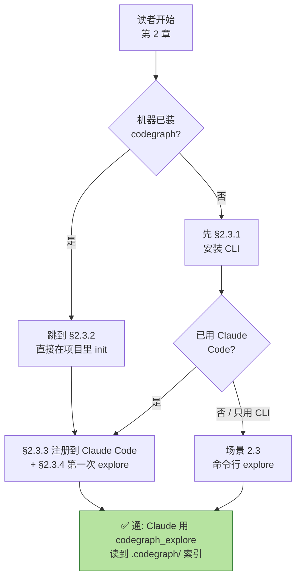

# 序章

> **写给三类读者的话**

## 写给用户(开发者)

如果你只是想**让 Claude Code 更快、更准、更省 token**,那么:
- 读 {{chapter:2}} 5 分钟上手
- 翻 {{chapter:6}} MCP 工具手册,知道 8 个 tool 何时用哪个
- 看完 {{chapter:9}} 真实场景 7 案例,体会"代码知识图谱 + LLM"的杠杆

不要先看架构章节,除非你被某章卡住回头查。

## 写给开发者(想贡献 codegraph)

如果你想**给 codegraph 加语言、写新 MCP tool、改 schema**,那么:
- 读完 Part 1 + Part 2 全章,理解用户视角
- 直接读 {{chapter:11}} Schema、{{chapter:12}} Rust kernel、{{chapter:15}} 评估
- 动手前必读 {{chapter:16}} 贡献者指南

`/add-lang` slash command 会带你跑通端到端。

## 写给架构师(想理解代码智能工程化)

如果你想**理解怎么给 AI Coding Agent 提供知识层**,那么:
- {{chapter:1}} 背景先建立问题域
- {{chapter:10}} 进程拓扑 + {{chapter:14}} MCP 三模式 是工程化核心
- {{chapter:11}} Schema、{{chapter:12}} Rust 内核、{{chapter:13}} Context 管线 是技术深度
- {{chapter:15}} 评估体系 告诉你怎么持续改进

如果你正设计自己的"agent-aware knowledge layer",这三章足够你做架构 trade-off。

---

## 阅读路径图



---

## 全书结构

```
Part 1 · Foundations       Ch1-4     问题、安装、配置
Part 2 · User Guide        Ch5-9     协作范式、工具、命令、同步、案例
Part 3 · Architecture     Ch10-15   进程、Schema、Kernel、Context、MCP、评测
Part 4 · Developer Guide   Ch16      贡献
Part 5 · Reference         Ch17-18   术语、FAQ
```

---

## 写给读者的承诺

这本电子书有三个承诺:

1. **所有实操例子都经过验证**。任何 "真实场景实战" 小节里的命令输出都来自真机跑(`references/validation-log.md` 有完整记录),不是纸上谈兵。
2. **每章都跟 Claude Code CLI 结合**。codegraph 不是独立工具,它的最大价值是给 Claude Code 当 MCP server。本书每一章都给出与 Claude Code 协作的具体模式。
3. **章节之间强关联**。每章结尾"下一章预告"指明方向,术语和 FAQ 在最后两章统一索引。

---

## 版本与时间锚

- 锚定 codegraph v1.5.0(2026 年 7 月 22 日 commit)
- 锚定 Claude Code ≥ 1.0(支持 MCP 全套协议)
- 锚定 Node 20-24(v25 因 V8 Turboshaft Zone OOM 被硬拦)
- 锚定 macOS 14.x / Ubuntu 24.04 / Windows 11

未来兼容小节分散在各章末尾。

---

## 致谢

- codegraph 团队(@colbymchenry 等贡献者):开源了这么好的工具
- Anthropic Claude Code 团队:MCP 协议的设计与稳定
- 7 benchmark 仓库(VSCode、Excalidraw、Django、Tokio、OkHttp、Gin、Alamofire)的开源社区

---

## 开始

→ 如果你是用户,跳到 {{chapter:2}}
→ 如果你是开发者,跳到 {{chapter:12}}
→ 如果你是架构师,跳到 {{chapter:10}}