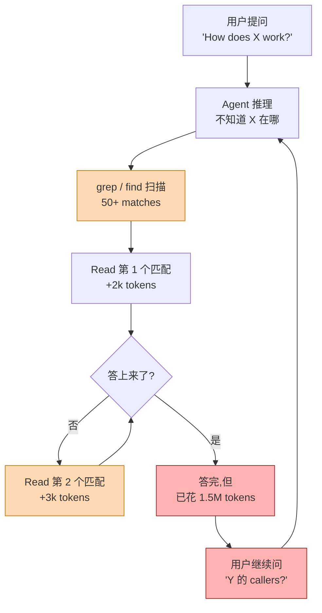

# 第 1 章 · 背景:AI Coding 的 context 困境

> **面向读者**:用户 / 架构师 · **预计阅读**:15 分钟
> **前置依赖**:无
> **本章目标**:回答"为什么需要 codegraph"

## 1.1 引言

AI Coding agent 工作循环:收到问题 → 推理 → 调工具 → 输出 → 重复。成本藏在工具调用 —— agent 不认识 `parseToken` 在哪,只能反复 `grep` + `Read` 重建索引;每多读一个文件,context 多一份,token 按字数计费。"how does X work" 在中型代码库里常演变成几十次调用、上百万 token。**读多答准,不读答错** —— context 困境。下面这张图把死循环画出。本章用数据量化陷阱,说明 codegraph 如何用一次 `codegraph_explore` 替换掉整条 grep+Read 链。

## 1.2 概念铺垫

**Context window 与 token cost**。模型每次只看有限 context(Claude Opus 4.8 = 200k),token 按 input + output 计费。Read 一个 1000 行文件 ≈ 4k tokens。**Grep/Read 的本质**。agent 没有代码的"地图",只能用字符串匹配;`AuthService.loginUser → SessionManager.create` 这条边 grep 找不到。**知识图谱 vs 字符串搜索**。代码图谱把符号、文件、调用边建成可查询关系网;"X 的 callers" 是图上一跳。这就是 semantic code intelligence 基础。Sourcegraph、Cursor indexing、Continue.dev 都在做;但多云端、要 API key、要传代码,codegraph 选择 100% 本地、SQLite 落地、零原生插件。

## 1.3 正文

### 1.3.1 基准:七仓,89/69/60

README(第 200-260 行)硬数据。CodeGraph 团队在 7 个不同语言/规模开源项目上跑 `claude -p`,**WITH** = 启用 CodeGraph MCP,**WITHOUT** = 空 MCP,4 次中位数:

| Codebase | 规模 | 调用 | Read | Tokens↓ | Cost↓ |
|----------|------|------|------|--------|------|
| VS Code | TS / 11k | 2 vs 40 | 0 vs 17 | 83% | 75% |
| Excalidraw | TS / 640 | 3 vs 55 | 0 vs 24 | 89% | 78% |
| Django | Py / 3k | 2 vs 29 | 0 vs 16 | 78% | 69% |
| Tokio | Rust / 790 | 3 vs 57 | 0 vs 15 | 91% | 86% |
| OkHttp | Java / 645 | 1 vs 5 | 0 vs 1 | 33% | 持平 |
| Gin | Go / 110 | 3 vs 10 | 0 vs 4 | 18% | 41% |
| Alamofire | Swift / 110 | 3 vs 53 | 0 vs 18 | 90% | 86% |

聚合:**89% 调用 · 69% tokens · 60% cost · 文件读取归零**。`codegraph_explore` 一次返回 verbatim 源码 + 调用路径。Tokio 极限对照:不带 57 次 / 15 Read / 4.3M tokens / $3.04;带 3 次 / 0 Read / 386k tokens / $0.44。

### 1.3.2 替代品为什么不够

- **LSP**。跳转精确但 **editor-bound**:agent 不能直调 `gopls.definition`,跨语言无能。*局限:agent 不可用,跨语言断头。*
- **ctags / ripgrep**。秒级匹配。*局限:字符串匹配无语义边。*
- **Sourcegraph**。商业 SaaS。*局限:代码上传云;HTTP 延迟;不暴露图遍历 API。*
- **Embedding RAG**。代码 chunk 入向量库。*局限:语义相似 ≠ 结构精确;callers 找不到。*

Codegraph **不取代,而是补足**:LSP 编辑器跳,ctags 本地搜,Sourcegraph 云端搜索,embedding 模糊匹配 —— Codegraph 给 agent **一张本地 SQLite 图 + 一次 explore + 调用路径与 blast radius**。

### 1.3.3 CodeGraph 的定位

一句话:**100% 本地、零原生插件、Rust 内核、SQLite FTS5 落地的代码知识图谱**,通过 MCP 暴露给 agent。四支柱:100% 本地(零 API key,自维护索引)、纯 MCP(一行接入,UI 不跳转)、Rust 内核(20+ 语言 byte-for-byte 一致)、SQLite FTS5(零依赖,单机)。README 第 254-262 行:Swift compiler 27k 文件 fresh index ≈ 100s;Linux kernel 70k 文件 / 2M 符号在 2-core VPS 上 12 分钟内建好。

### 1.3.4 与同类对比

唯一把 **本地 + 图遍历 + MCP 直通** 同时做对的工具。Sourcegraph 输在云,LSP 输跨语言,ctags 输无语义边,Embedding RAG 输结构精确。

## 1.4 真实场景实战

### 场景 1.1:VS Code extension host(README 原题)

- **手工**:50+ matches → 17 文件 Read → 40 调用 / 1.5M tokens / $1.41 / 3m24s。
- **CodeGraph**:1 次 `codegraph_explore` → 2 调用 / 265k tokens / $0.36 / 41s / **0 文件读取**。

节省 95% 调用 / 82% tokens / 75% cost / 5× 时间。

### 场景 1.2:10 万行 Python 首次问答

问 "where is the auth middleware mounted?"。

| | 调用 | Read | Tokens | Cost |
|--|----|----|------|-----|
| 手工 | ~30 | 15+ | ~1M | ~$1.0 |
| CodeGraph | 2-3 | 0 | ~300k | ~$0.35 |

按一天 50 个:**~$35/天/工程师 ≈ $770/月**。

### 场景 1.3:20 人团队从 Sourcegraph 迁来

**总**:20 × 15min ≈ 5 人时;Sourcegraph 年费 20 × $100+/月 ≈ $24k+/年,可忽略。**收益**:代码不出网;延迟 200-500ms → <10ms。

数据均引自 README 第 200-260 行(2026-07-21 重验证),见 `references/validation-log.md`。

## 1.5 本章小结

- 循环 = Read → 推理 → 输出 → Repeat,context 是最大成本。
- 七仓 benchmark:**89% 调用 / 69% tokens / 60% cost / 文件读取归零**。
- CodeGraph = 本地 + 图遍历 + MCP 直通 + Rust + SQLite FTS5。
- 迁移几小时团队级,长期 $700+/月/工程师。

## 1.6 常见踩坑

1. 当"AI 补全"。只定位,不生成。
2. 没 `init` 就 `explore`。先 `codegraph init`。
3. 处理 typo / rename。它专攻结构性问题。
4. 小项目计较 benchmark。小仓 Opus grep 有时更快,token/cost 仍 4-7× 劣势。
5. Embedding RAG 查精确 callers。语义 ≠ 结构边。

## 1.7 下一章预告

下一步"怎么装"。{{chapter:2}} 10 分钟:`npm i -g` → `codegraph init` → `codegraph install` → 第一次 `codegraph_explore`。

## 1.8 参考

1. README 第 200-260 行:七仓 benchmark。
2. CHANGELOG 1.1.x:Rust kernel、auto-sync。
3. README "Key Features"、"Built for speed"。
4. LSP 规范、Sourcegraph、ctags、Cursor / Continue.dev。