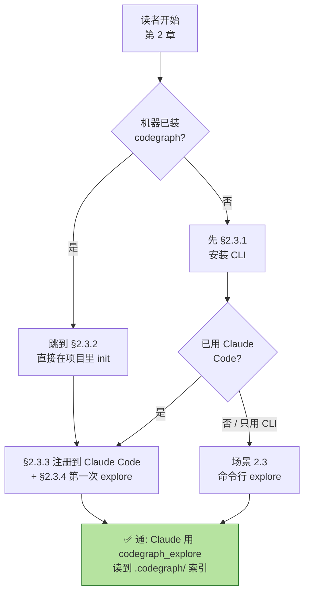

# 第 2 章 · 5 分钟快速上手

> **面向读者**:用户 · **预计阅读**:10 分钟
> **前置依赖**:无
> **本章目标**:装好 codegraph,在 Claude Code 中调通 `codegraph_explore`

## 2.1 引言

如果你只想把 codegraph 用起来、跳过原理,这章就够了。本书其它章节都在讲 "为什么这样设计" 与 "怎么二次开发",而你只需要让 Claude Code 在回答代码问题时先想到 `codegraph_explore` 这一条调用。所以下面 10 分钟,我们只做四件事:装 CLI、给项目建图、注册到 Claude Code、跑一次 explore。

读到这里时,读者画像可能不一样。下面这张图给你画了一个分流,选最贴你现状的那条读就行。



## 2.2 概念铺垫:四个核心动词

codegraph 全部 CLI 围绕四个动词:

| 动词 | 做什么 | 谁来运行 |
|------|--------|---------|
| `install` | 把 codegraph 的 MCP server 注册到某个 agent(Claude Code / Cursor / Codex / ...)的配置文件里 | 一次性,每个 agent 一次 |
| `init` | 在当前项目里建 `.codegraph/` 目录,跑一次完整索引,之后自动随编辑同步 | 每个项目一次 |
| `status` | 看当前项目的索引状态:多少文件 / 多少节点 / 是否有挂起的同步 | 随时 |
| `serve` | 启动 MCP server,把 `codegraph_explore` 这个工具暴露给 agent | 通常不手敲,Claude Code 启动时自己拉起 |

要确认安装是否成功: `codegraph --version`,后续每一步都可以用这个数字对一下。

## 2.3 正文

### 2.3.1 安装 CLI

机器已经装 Node 的话,npm 最快:

```bash
npm i -g @colbymchenry/codegraph
```

纯装机(连 Node 都不想装)走 shell 一行:

```bash
curl -fsSL https://raw.githubusercontent.com/colbymchenry/codegraph/main/install.sh | sh
```

装完 **必须新开一个终端**,让 PATH 生效。本节验证时,装好之后 `--version` 返回:

```
$ codegraph --version
1.5.0
```

版本号无所谓,只要能打印出一行数字说明安装路径正确。

### 2.3.2 在项目里 init

切到任一项目目录(下文用 `/tmp/cg-demo` 当 demo):

```bash
mkdir -p /tmp/cg-demo && cd /tmp/cg-demo
echo "function hello() { console.log('hi'); }" > index.js
codegraph init
```

实操输出片段:

```
┌  Initializing CodeGraph
│
◆  Initialized in /private/tmp/cg-demo
│
Scanning files...
Parsing code...
Resolving refs...
Linking dynamic dispatch...
│
◆  Indexed 1 files
│
●  2 nodes, 1 edges in 734ms
│
└  Done
```

跑完会生成 `./.codegraph/codegraph.db`(SQLite,带 FTS5 和 WAL)。从此以后,文件一改,索引自动跟,不用再手动 `sync`。

接下来 `codegraph status` 看一眼:

```
$ codegraph status
CodeGraph Status

Project: /private/tmp/cg-demo

Index Statistics:
  Files:     1
  Nodes:     2
  Edges:     1
  DB Size:   0.15 MB
  Backend:   node:sqlite — built-in (full WAL)
  Journal:   wal

Nodes by Kind:
  file            1
  function        1

Files by Language:
  javascript      1

✓ Index is up to date
```

注意 `Backend: node:sqlite` 和 `Journal: wal`,这两个标志你以后碰到"database is locked" 时,排查要看这一栏是不是这两个值。

### 2.3.3 注册到 Claude Code

CLI 装好和 Claude Code 用上 codegraph,是两步独立的事。再说一次:`codegraph init` 是建项目图,**不会自动把 MCP server 加到 Claude Code**。这一步要 `codegraph install`。

交互式最简单:

```bash
codegraph install
```

脚本化环境(我们这次写入主会话的标准做法)用 `--yes --target claude --location global`:

```bash
codegraph install --yes --target claude --location global
```

实操输出:

```
┌  CodeGraph v1.5.0
│
◆  Claude Code: Updated ~/.claude.json
│
◆  Claude Code: Updated ~/.claude/settings.json
│
◆  Claude Code: Updated ~/.claude/settings.json
│
◆  Claude Code: Created ~/.claude/CLAUDE.md
│
└  Done! Restart your agent to use CodeGraph.
```

它实际改了三处地方:

1. `~/.claude.json` → 在 `mcpServers.codegraph` 写入 stdio 启动行,这是让 Claude Code 知道"启动 MCP server 用什么命令":

    ```json
    "codegraph": {
      "type": "stdio",
      "command": "codegraph",
      "args": ["serve", "--mcp"]
    }
    ```
2. `~/.claude/settings.json` → 在 `permissions.allow` 加上 `mcp__codegraph__*`,免去每次都点"批准工具"。
3. `~/.claude/CLAUDE.md` → 写一段 marker 围起来的指引(因为 sub-agent 看不到 MCP server 自己的提示语),长这样:

    ```markdown
    <!-- CODEGRAPH_START -->
    ## CodeGraph
    在 `.codegraph/` 存在的仓库里,优先用 `codegraph_explore` ...
    <!-- CODEGRAPH_END -->
    ```

如果只想看 JSON 片段、不动文件,用 `--print-config`:

```bash
$ codegraph install --print-config claude
# Add to /Users/digeal/.claude.json
{ "mcpServers": { "codegraph": { "type": "stdio", "command": "codegraph",
  "args": ["serve", "--mcp"] } } }
```

最后:**重启 Claude Code**(关闭再开,或在 IDE 里 reload),MCP server 才会读新配置加载 `codegraph_explore`。

### 2.3.4 第一次 explore

重启 Claude Code 之后,试着问一个问题:

> "How does hello reach greet?"(或者直接命名一个符号 / 文件都行)

Claude Code 应该直接调一次 `codegraph_explore`,得到这样的输出——我已经把 `/tmp/cg-demo/index.js` 改成两函数、调了 `codegraph sync` 之后跑出来的:

```
**Exploration: how does hello reach greet**

Found 3 symbols across 1 file.

**Blast radius — what depends on these (update/verify before editing)**

- `hello` (index.js:2) — 1 caller in `index.js`; ⚠️ no covering tests found
- `greet` (index.js:1) — 1 caller in `index.js`; ⚠️ no covering tests found

**Source Code**
(verbatim, line-numbered, byte-for-byte identical to a Read call)
**`index.js`** — hello(function), greet(function), index.js(file)
```javascript
1  function greet(name) { return 'Hello, ' + name; }
2  function hello() { console.log(greet('world')); }
3  hello();
```
  

这段输出格式就是 `codegraph_explore` 的工作形态:blast radius → 源文件 → 调用关系。一次调用把"哪儿修改会炸、源是啥样、谁调用谁"全摆出来,Claude 拿到这段就能直接答你问题。

## 2.4 真实场景实战

### 场景 2.4.1:全新环境 5 分钟跑通

1. 全局装: `npm i -g @colbymchenry/codegraph`,看到 `added 1 package in 30s` 之类。
2. `codegraph --version` 拿到一串数字,确认 PATH 已切到新终端。
3. 随便进一个项目, `codegraph init`,看最后一行 `Indexed N files` 和 `Done`。
4. `codegraph status`,确认 `✓ Index is up to date`。
5. `codegraph install --yes`,第一次可能要在对话框里点"批准"。
6. 重启 Claude Code,在任意代码问题里看 Claude 的 reply 是否引用了 `codegraph_explore` 的输出。

### 场景 2.4.2:已有 Claude Code,加 codegraph

如果你已经用 Claude Code 一段时间,只想加点新能力:

```bash
codegraph install --yes --target claude --location global
```

不传 `--target` 时,安装器会扫所有 agent 然后让你勾选——脚本环境必须 `--yes` 或显式 `--target=claude`。装完同样重启 Claude Code。

### 场景 2.4.3:命令行直跑 explore

不想装 MCP / 不开 Claude Code,纯 CLI 也能用,输出和 `codegraph_explore` MCP 工具一致:

```bash
codegraph explore "hello"        # 在初始化过的项目里
codegraph query hello --limit 5  # 符号级搜索,带源码片段
codegraph files                  # 项目结构
codegraph impact greet --depth 2 # 改 greet 影响哪些符号(blast radius)
```

例子里 `codegraph query hello` 输出:

```
Search Results for "hello":

function    hello
  index.js:2
  ()
```

这些子命令对应 MCP 那一套工具(`node` / `search` / `files` / `impact`),即使没有 Claude Code,在 CI、脚本里也能拼进去。

## 2.5 本章小结

你只做四件事,就让 agent 学会了"先 `codegraph_explore` 再读文件":

1. **装 CLI**:`npm i -g @colbymchenry/codegraph`,`codegraph --version` 拿到版本号就成。
2. **建项目图**:`cd your-project && codegraph init`,以后自动同步。
3. **挂到 Claude Code**:`codegraph install --yes`,改动在 `~/.claude.json` / `~/.claude/settings.json` / `~/.claude/CLAUDE.md`。
4. **重启 Claude Code**,在代码问题里观察回复里是否引用了 `codegraph_explore`。

## 2.6 常见踩坑

- **新终端很重要**:`npm i -g` 装完后,当前 shell 还看不到 `codegraph` 命令,需要重开或 `hash -r`(`source ~/.zshrc` 也行)。
- **`codegraph install` 跑了但 agent 不知道**:Claude Code 必须重启。打开 Claude Code 的面板,完全退出再开。
- **`CodeGraph not initialized`**:在项目里跑一次 `codegraph init`。这个错误来自 MCP server,意思是当前 cwd 没有 `.codegraph/`。
- **`database is locked`**:几乎只会在 WSL2/网络盘上出现。`codegraph status` 看 `Backend` 应该是 `node:sqlite`、`Journal` 应该是 `wal`,不是的话把 `.codegraph/` 挪到本地盘。
- **想看版本对不上**:`codegraph --version` 同时打 `1.5.0` 之类的;每次升级后跑 `codegraph upgrade` 即可,不必重装。
- **想只读不写**:`codegraph install --print-config claude` 能拿到 JSON 片段、零写入,适合你只想 review 一下再决定要不要装。

## 2.7 下一章预告

四步走完就能用了,但"用得好"还是要看几个细节:

- `codegraph init` vs `codegraph index` vs `codegraph sync` 的差别、自动同步的触发机制。
- `.gitignore` 与 `codegraph.json` 的 `exclude` / `include` 是怎么叠加的。
- 第一次跑 `codegraph_explore` 在多文件大仓库,延迟主要来自哪儿。

→ 见 {{chapter:3}}

## 2.8 参考

- `README.md` Get Started / Quick Start / CLI Reference
- `install.sh` 一键脚本,本地默认安到 `~/.codegraph/`
- `~/.claude.json` 中 `mcpServers.codegraph` 启动行
- `~/.claude/settings.json` 中 `permissions.allow`
- 本章的图表:F-1 阅读路径分流图(已在本章顶部内联 mermaid 代码块)
