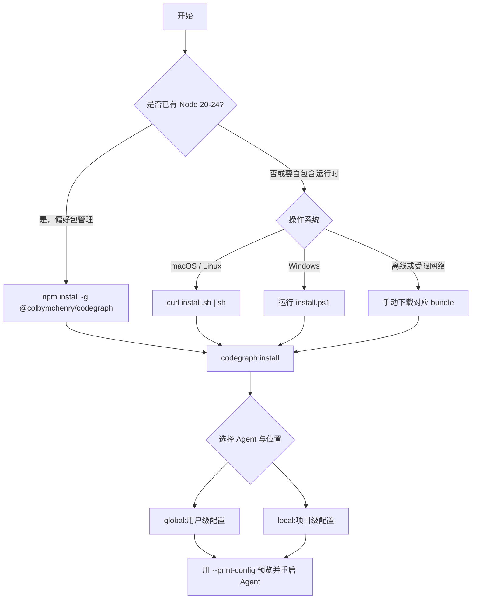

# 第 3 章 · 安装、升级与多 Agent 集成

> **面向读者**:用户 / 开发者 · **预计阅读**:20 分钟
> **前置依赖**:{{chapter:2}}
> **本章目标**:装 CLI、注册到任意 Agent、升级/回滚、与 Claude Code 协作模式

## 3.1 引言

CodeGraph CLI 与 Agent 集成是两层：先安装 `codegraph`，再把 `codegraph serve --mcp` 注册为 MCP stdio 服务。安装器只合并自己的配置项，不应覆盖同文件中的其他服务。选路见下面这张决策树：



## 3.2 概念铺垫(8 个 target agent 列表、MCP 配置 schema、permission allow 列表)

八个 target id 是 `claude`、`cursor`、`codex`、`opencode`、`hermes`、`gemini`、`antigravity`、`kiro`。通用 schema 为：

```json
{"mcpServers":{"codegraph":{"type":"stdio","command":"codegraph","args":["serve","--mcp"]}}}
```

Claude Code 还可写入权限白名单：

```json
{"permissions":{"allow":["mcp__codegraph__*"]}}
```

`--no-permissions` 可跳过它；其他 target 不写这份 allow 列表。opencode、Codex、Hermes 使用各自的 JSONC、TOML、YAML schema。

## 3.3 正文

### 3.3.1 三种安装路径(npm / curl+sh / 手动下载 bundle)

1. npm（要求 Node `>=20 <25`）：`npm install -g @colbymchenry/codegraph`。
2. macOS/Linux 自包含 bundle：`curl -fsSL https://raw.githubusercontent.com/colbymchenry/codegraph/main/install.sh | sh`。它自带 Node，无需系统 Node。
3. 手动下载 GitHub Release 的 `codegraph-<target>.tar.gz`（Windows 为 `.zip`），解压到安装目录并把启动器加入 `PATH`。Windows 可直接运行仓库的 `install.ps1`，默认安装至 `%LOCALAPPDATA%\codegraph\current`。

POSIX 默认版本目录为 `~/.codegraph/versions/<version>`，`~/.codegraph/current` 指向当前版本，命令链接位于 `~/.local/bin/codegraph`；可用 `CODEGRAPH_INSTALL_DIR`、`CODEGRAPH_BIN_DIR` 改写。

### 3.3.2 平台分发矩阵(darwin-arm64/x64、linux-x64/arm64、win-x64/arm64)

| 系统 | bundle target |
|---|---|
| Apple Silicon / Intel Mac | `darwin-arm64` / `darwin-x64` |
| Linux ARM64 / x86-64 | `linux-arm64` / `linux-x64` |
| Windows ARM64 / x86-64 | `win32-arm64` / `win32-x64` |

### 3.3.3 八个 Agent 集成(每个一节,给 --print-config 输出和写入路径)

先预览：`codegraph install --print-config <id>`；实际写入用 `codegraph install --target <id> --location global|local`。

| Agent | 写入路径（global；local） | MCP config JSON/片段 |
|---|---|---|
| Claude | `~/.claude.json`；`./.mcp.json` | `{"mcpServers":{"codegraph":{"type":"stdio","command":"codegraph","args":["serve","--mcp"]}}}` |
| Cursor | `~/.cursor/mcp.json`；`./.cursor/mcp.json` | `{"mcpServers":{"codegraph":{"type":"stdio","command":"codegraph","args":["serve","--mcp","--path","${workspaceFolder}"]}}}` |
| Codex | `~/.codex/config.toml`；不支持 local | `[mcp_servers.codegraph] command="codegraph" args=["serve","--mcp"]` |
| opencode | `~/.config/opencode/opencode.jsonc`；`./opencode.jsonc` | `{"$schema":"https://opencode.ai/config.json","mcp":{"codegraph":{"type":"local","command":["codegraph","serve","--mcp"],"enabled":true}}}` |
| Hermes | `$HERMES_HOME/config.yaml`（默认 `~/.hermes/config.yaml`）；不支持 local | `{"mcp_servers":{"codegraph":{"command":"codegraph","args":["serve","--mcp"],"timeout":120,"connect_timeout":60,"enabled":true}}}`（实际写 YAML，并把 `mcp-codegraph` 加入 CLI toolset） |
| Gemini | `~/.gemini/settings.json`；`./.gemini/settings.json` | `{"mcpServers":{"codegraph":{"type":"stdio","command":"codegraph","args":["serve","--mcp"]}}}` |
| Antigravity | `~/.gemini/config/mcp_config.json`（旧版 `~/.gemini/antigravity/mcp_config.json`）；不支持 local | `{"mcpServers":{"codegraph":{"command":"/absolute/path/to/codegraph","args":["serve","--mcp"]}}}`（macOS 优先绝对路径） |
| Kiro | `~/.kiro/settings/mcp.json`；`./.kiro/settings/mcp.json` | `{"mcpServers":{"codegraph":{"type":"stdio","command":"codegraph","args":["serve","--mcp"]}}}` |

#### Claude
写 MCP、`settings.json` 的 `mcp__codegraph__*` allow，并在 `CLAUDE.md` 标记段追加 instructions。

#### Cursor
local 的 `--path` 为项目绝对路径，global 为 `${workspaceFolder}`；清理旧 `.cursor/rules/codegraph.mdc`。

#### Codex
TOML；instructions 合并 `AGENTS.md` 标记段。

#### opencode
JSONC 的 `mcp` 键；instructions 写 `AGENTS.md`。

#### Hermes
YAML，写超时并把 `mcp-codegraph` 加入 CLI toolset；仅 global。

#### Gemini
instructions 是 `GEMINI.md`（global `~/.gemini/GEMINI.md`，local 项目根）。

#### Antigravity
`.migrated` 选择统一或旧 MCP 路径；共享 Gemini instructions。

#### Kiro
仅 MCP；清理旧 `.kiro/steering/codegraph.md`。

### 3.3.4 升级与回滚(codegraph upgrade / codegraph upgrade <version> 钉版本)

`codegraph upgrade` 升到最新版，并自动 `install --refresh` 刷新已配置 target；`codegraph upgrade --check` 只检查，`--force` 强制重装。回滚或钉版本：`codegraph upgrade v1.5.0`。POSIX 的版本目录与 `current` 链接便于切换；执行指定版本命令是受支持的回滚方式。

### 3.3.5 卸载(codegraph uninstall --keep-cli 保留 CLI)

`codegraph uninstall --keep-cli` 仅移除 Agent 配置，保留 CLI；可配 `--target`、`--location`、`--yes`。不删除项目 `.codegraph/` 索引；索引用 `codegraph uninit`。彻底移除 POSIX bundle 可让 `install.sh --uninstall` 删除 `~/.local/bin/codegraph` 与 `~/.codegraph/`。

### 3.3.6 非交互模式(--yes / --target / --location)

CI 中使用：`codegraph install --yes --target claude,cursor --location global`。`--yes` 默认等价于 global、target auto 并启用 Claude allow；仍建议显式写 target/location。target 还接受 `auto`、`all`、`none`。

## 3.4 真实场景实战(≥ 3 个)

### 场景 3.1: 在 Linux 服务器上装 + 接 Claude Code

```sh
curl -fsSL https://raw.githubusercontent.com/colbymchenry/codegraph/main/install.sh | sh
export PATH="$HOME/.local/bin:$PATH"
codegraph install --yes --target claude --location global
codegraph install --print-config claude
```

### 场景 3.2: 同时接 Claude Code + Cursor

```sh
codegraph install --yes --target claude,cursor --location local
codegraph install --print-config claude
codegraph install --print-config cursor
```

重启两个 Agent；Claude 读 `./.mcp.json`，Cursor 读 `./.cursor/mcp.json`。

### 场景 3.3: WSL2 / 受限环境(codegraph install --no-permissions + CODEGRAPH_NO_DAEMON)

```sh
export CODEGRAPH_NO_DAEMON=1
codegraph install --yes --target claude --location local --no-permissions
```

这样不写 Claude allow，且运行时禁用 daemon；适合无法常驻后台进程或需人工审批工具权限的环境。

## 3.5 本章小结

安装 CLI 后，用 target/location 精确注册 MCP；先以 `--print-config` 审核，再升级、钉版本或按 target 卸载。Claude Code 是唯一自动写 MCP allow 的集成。

## 3.6 常见踩坑

- **`~/.claude.json` vs `./.mcp.json`**：global 与 local 路径不同。`claude.ts:230-252` 明确：已有文件中新增 `codegraph` 算 updated；旧安装器误写的 `./.claude.json` 会被迁移清理，而 Claude Code 从未读取它。
- **Node 版本**：npm 路径仅支持 `>=20 <25`；Node `<20` 或 `>=25` 请改用自包含 bundle，而不是忽略 engines。
- **GitHub API 限速**：shell 先走无 API 限额的 latest redirect，再回退 API；仍失败时设置 `CODEGRAPH_VERSION=v1.5.0`。PowerShell 直接用 API，更应钉该变量；也可浏览器下载 release bundle 后手动解压。

## 3.7 下一章预告({{chapter:4}})

下一章将从“已接入”进入“可检索”：初始化仓库、构建索引并验证第一次语义查询。

## 3.8 参考

- `install.sh`、`install.ps1`
- `src/installer/targets/*.ts`、`shared.ts:24-49`
- `src/bin/codegraph.ts:2234-2470`
- `codegraph install --print-config claude|cursor|codex|opencode` 实测输出（2026-07-26）
