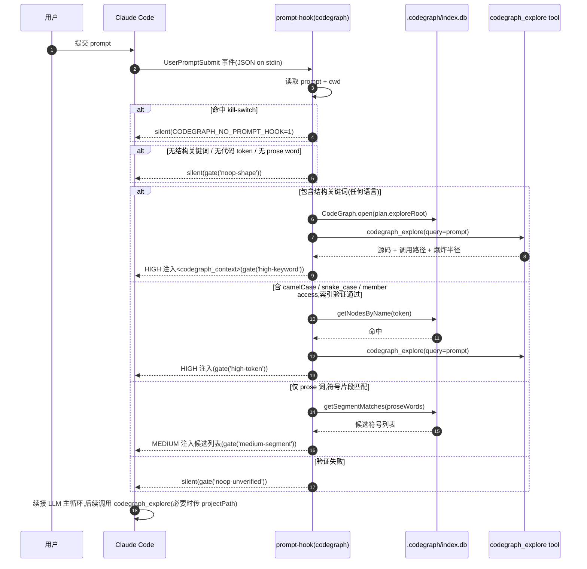

# 第 5 章 · 与 Claude Code 协作的标准范式

> **面向读者**:用户 · **预计阅读**:25 分钟
> **前置依赖**:{{chapter:6}}
> **本章目标**:掌握 5 类 prompt 与 8 个 tool 的搭配,理解 prompt hook 的三档 gate

## 5.1 引言

CodeGraph 与 Claude Code 的协作分两类问题:**结构性问题**(代码形状、流程、爆炸半径、定位)由索引接管,**非结构性问题**(修 typo、改文案)由 LLM 直答。prompt hook 在前者上预填上下文、在后者上零开销。本章钉死 5 类结构性问题 ↔ tool 搭配,讲清 `HIGH`/`MEDIUM`/`silent` 三档 gate 如何把"该不该响"做成可测判断,最后给出四个 5 分钟可复现的场景。

## 5.2 概念铺垫

**MCP initialize**。`codegraph serve --mcp` 首响的 `instructions` 字段(`server-instructions.ts:20-70`)把规约写进 system prompt:默认只暴露一个 tool `codegraph_explore`(`src/mcp/tools.ts:804` `DEFAULT_MCP_TOOLS = new Set(['explore'])`),`Read`-等价——一次返回行号源码 + 调用路径 + 爆炸半径。

**1-tool 哲学**。8 个 tool 里 `explore` 单独覆盖 80%;其余靠 `CODEGRAPH_MCP_TOOLS=explore,search,node,...`(逗号,**不带** `codegraph_` 前缀)启用,详见 {{chapter:6}}。本章"何时调哪个"默认在白名单全开。

**prompt hook 意图**。`UserPromptSubmit` 是 Claude Code 每条 prompt 进主循环前的事件。`codegraph prompt-hook`(stdin 收 `{prompt, cwd}` JSON)在后台调一次 `codegraph_explore`,把上下文以 `<codegraph_context>` 写回 stdout,与原 prompt 合并再送 LLM——结构性问题**省一次显式 tool 调用 + 提前拿到 blast radius**;非结构性问题**零开销**(silent 返回)。时序见下面这张图：



## 5.3 正文

### 5.3.1 五类 prompt 与对应 tool 搭配表

| 问题类别 | 自然语言形态 | 主推 tool | 备选 | 例子 |
|---|---|---|---|---|
| **how does X work**(单符号机理) | "X 怎么实现的"、"X 的逻辑" | `codegraph_explore("X")` | `codegraph_node(symbol=X)` | "how does `parseToken` work" |
| **how does X reach Y**(端到端流) | "X 到 Y 的路径"、"X 调用链" | `codegraph_explore("X Y")` | `codegraph_callers` + `callees` 拼接 | "how does `login` reach `db.query`" |
| **who's affected by X**(爆炸半径) | "改 X 影响谁"、"X 的 callers" | `codegraph_impact(symbol=X, depth=N)` | `codegraph_explore("X")` 看 blast radius 段 | "who's affected if I rename `UserService`" |
| **where is X**(纯定位) | "X 在哪"、"X 的定义" | `codegraph_search(query=X)` | `codegraph_node(symbol=X)` | "where is `authenticate`" |
| **what's near X**(区域勘察) | "X 周边有什么"、"模块结构" | `codegraph_files(path=X)` | `codegraph_explore("X")` 自然语言 | "what's near `src/auth`" |

非结构性问题("修这个 typo"、"把这段翻译成英文")**不在表内**——它们不进 prompt hook 任何一档,直接走 LLM 主循环,无 tool 调用。表里的 `codegraph_explore` 默认就够;备选用于想显式控 token(纯定位不要源码 → `search`)或显式锚定一个符号(改文件前先 `node` 一下既有行号源码 + 爆炸半径)的场景。

### 5.3.2 三档 prompt hook gate:HIGH / MEDIUM / silent

`codegraph prompt-hook` 在 `src/bin/codegraph.ts:1248-1366` 实现,核心是 `keyworded` / `codeTokens` / `proseWords` 三组候选 + 索引验证后的两档分支。代码段如下(`src/bin/codegraph.ts:1248-1264`):

```ts
//   HIGH   — a structural keyword (any covered language), or a code-shaped
//            token verified in the index → full explore injection.
//   MEDIUM — no keyword/token, but prose words match indexed symbol-name
//            SEGMENTS ("state machine" → OrderStateMachine, in any
//            language): inject a short list of the matching symbols and
//            let the AGENT write the explore query — the graph-derived
//            tier, no vocabulary involved.
//   silent — nothing verified. Every other prompt ("fix this typo")
//            stays a zero-cost no-op.
const keyworded = hasStructuralKeyword(prompt);
const codeTokens = keyworded ? [] : extractCodeTokens(prompt);
const proseWords = keyworded ? [] : extractProseCandidates(prompt);
if (!keyworded && codeTokens.length === 0 && proseWords.length === 0) { gate('noop-shape'); return; }
```

- **HIGH-keyword**:`hasStructuralKeyword` 在 `src/directory.ts:458` 命中结构词(任何语言的 how/where/调用/影响 等词干);或代码形 token 经 `CodeGraph.getNodesByName` 验证确实存在——直接调一次 `codegraph_explore`,把完整结果截断到 16 KB 注入。telemetry 记 `high-keyword` / `high-token`。
- **MEDIUM-segment**:无关键词、无代码形 token,但 prose 词能拆出索引里符号名的**片段**(`"state machine"` → `OrderStateMachine`)。`CodeGraph.getSegmentMatches` 命中后才注入候选符号清单(`gate('medium-segment')`),**不**替 agent 调 explore——agent 自己拼 `codegraph_explore` 查询(`src/bin/codegraph.ts:1322-1350`)。这一步是 graph-derived,不依赖词表,跨语言通用。
- **silent**:三组候选全空(常见非结构 prompt)、或 MEDIUM 在索引里查不到(`gate('noop-unverified')`、`gate('noop-shape')`),或顶层 `planFrontload` 返回空(`gate('noop-no-index')`)。hook 什么都不输出,主循环照常进行。

### 5.3.3 关掉 hook 的两种方式

1. **临时 kill-switch**(进程级):导出 `CODEGRAPH_NO_PROMPT_HOOK=1` 或 `CODEGRAPH_PROMPT_HOOK=0`,hook 在第一行就 `return`(`src/bin/codegraph.ts:1226`)。CI、低算力机器、个人偏好场景用,不卸载、不改配置。
2. **卸载时不挂载**(一次性):`codegraph uninstall` 会问是否移除 hook 段;答 No 则保留 hook,答 Yes 则一并清掉 `~/.claude/settings.json` 里的对应 `hooks.UserPromptSubmit`。

### 5.3.4 安装时是否启用 hook 的决策

`codegraph install --target claude --location global` 默认追加 hook(同时合并 MCP server、`mcp__codegraph__*` 权限白名单、`CLAUDE.md` instructions 段)。**建议默认开**:成本是结构性问题省一次往返 + 上下文更准;收益是 agent 改文件前已知道 blast radius。三种情况主动关:① 在大型 monorepo 中嫌注入超 16 KB;② 想自己手动控制每次 `codegraph_explore` 调用、避免"被动上下文";③ CI/批处理模式。

### 5.3.5 与 Claude Code 内置 Read/Grep 的边界

**原则**:`codegraph_explore` 一站式胜出时不要先 `Read`;**索引覆盖外**(配置、Markdown、`codegraph.json`)走 Read/Grep。`server-instructions.ts:60` 明确"Don't grep or Read first"。改文件前用 `codegraph_node(symbol=X, includeCode=true)` 替代 `Read`,带爆炸半径。**索引未覆盖的目录**(`codegraph status` 显示 `no .codegraph/ index exists`)降级用内置工具,**不可自动 `codegraph init`**——索引是用户的决定。

## 5.4 真实场景实战

### 场景 5.1: 触发 prompt hook 看 banner 内容

**目标**:在 Claude Code 中发一条带结构词的 prompt,观察 hook 注入的 `<codegraph_context>` 块。

**步骤**:

```text
# 项目根 /Users/digoal/new/codegraph 已 codegraph init(参考 ch02)
1. 启动 Claude Code,选 `/Users/digoal/new/codegraph` 为工作目录
2. 输入:explain how SERVER_INSTRUCTIONS shapes the agent prompt
3. Claude Code 触发 UserPromptSubmit → codegraph prompt-hook stdin 收 JSON
4. hasStructuralKeyword("how ... shapes") 命中 → HIGH-keyword
5. codegraph_explore(query="SERVER_INSTRUCTIONS ...") → 输出截断至 16 KB
6. stdout 出现 <codegraph_context note="Structural context from CodeGraph ...">...</codegraph_context>
7. 跟着是 LLM 的回应,内容已经"看过"相关源码
```

**预期**:Claude Code 回应直接引用 `src/mcp/server-instructions.ts:20-70` 的 verbatim 行号源码;若改完源码后再发,首行可能是 `⚠️ Some files referenced below were edited since the last index sync`,提示该文件需 `Read` 一次确认。

### 场景 5.2: 写一个 MEDIUM 级 prompt 让 hook 注入候选符号

**目标**:无关键词、无代码 token,只靠 prose 词触发 MEDIUM。

**步骤**:

```text
1. 在已索引项目里挑一个含 OrderStateMachine 之类 CamelCase 符号的代码
2. 在 Claude Code 输入(无结构词,无代码 token):
   "I want to understand the order state machine in this codebase"
3. hasStructuralKeyword false,extractCodeTokens false(无 camelCase),
   extractProseCandidates 拆出 "state machine" 之类 prose 片段
4. getSegmentMatches(proseWords) 命中 OrderStateMachine
5. <codegraph_context> 注入候选列表 + 建议 explore query,
   而不是直接跑 explore 把源码塞进来
```

**预期**:banner 里出现 `OrderStateMachine (class — src/orders/state.ts:42)` 这样的 3-5 行清单;LLM 据此自己发 `codegraph_explore("OrderStateMachine")`。**校验维度**:`getTelemetry().recordUsage('cli_command', 'prompt-hook-gate-medium-segment', true)` 计数 +1。

### 场景 5.3: 关掉 hook 后用手动 `codegraph explore` 验证

**目标**:证明 hook 是不需要的优化层,不是必需。

**步骤**:

```bash
# shell A: 关掉 hook
export CODEGRAPH_NO_PROMPT_HOOK=1
# shell B: 启动 Claude Code,在同一项目输入同样的 prompt
"explain how SERVER_INSTRUCTIONS shapes the agent prompt"
# 预期:Claude Code 拿到 prompt 后**自己**调用 mcp__codegraph__codegraph_explore,
#       输出与场景 5.1 一致(只是多一次显式 tool call)

# 旁路:也可以在 shell 里直接验证
cd /Users/digoal/new/codegraph
codegraph explore "SERVER_INSTRUCTIONS agent prompt"
# 预期:返回 Found N symbols ... + verbatim 行号源码
```

**预期**:hook 被关后,所有结构性问题由 agent 显式调 `codegraph_explore` 完成,功能等价,只是 prompt 进入主循环时少了一段预填上下文——对模型回答的**正确性**无影响,只影响**首响延迟**与**explore 调用次数**。

### 场景 5.4: 在 Claude Code 中用一个 bad prompt 触发 silent(不该响应的)

**目标**:验证非结构 prompt 不被 hook 污染。

**步骤**:

```text
1. 启动 Claude Code,输入:fix this typo in README.md
2. hasStructuralKeyword false(无结构词)
   extractCodeTokens false(无 camelCase / snake_case / 括号调用)
   extractProseCandidates 拆出的词无对应符号片段
3. 三组候选全空 → gate('noop-shape') → return
4. stdout 空白,Claude Code 主循环照常,LLM 自己读 README.md 改 typo
```

**预期**:Claude Code 回应里**不出现**任何 `<codegraph_context>` 块;`getTelemetry` 计数 `prompt-hook-gate-noop-shape` +1。这条 telemetry 用来验证 hook 的"无相关性零成本"承诺——非结构 prompt 一律 noop,不挤占 prompt token 预算。**反例**:`how does JavaScript work`(品牌词 token 形似但无对应符号)同样走 `gate('noop-unverified')`,不注入——这是 #994 follow-up 修过的关键边界。

## 5.5 本章小结

- 5 类结构性问题 × 8 个 tool,默认 `codegraph_explore` 吃 80%;备选 `search` 省 token、`node` 钉单符号、`impact` 控爆炸半径。
- prompt hook 是**优化层**:`HIGH-keyword` / `HIGH-token` 直接注入源码,`MEDIUM-segment` 注入候选清单让 agent 自己 explore,其余 silent。
- 关 hook:进程级 `CODEGRAPH_NO_PROMPT_HOOK=1`,或 uninstall 答 No。
- 边界:索引内 `codegraph_explore` 优先;配置/Markdown 走 Read/Grep。

## 5.6 常见踩坑

1. **品牌词当代码**:`how does JavaScript work` token 命中 `JavaScript` 但 `getNodesByName` 不存在 → silent(`gate('noop-unverified')`)。
2. **索引滞后 1 秒**:改完立刻问触发 stale banner,**只** Read banner 列出的文件。
3. **monorepo 根目录**:hook 走 `planFrontload` down-scan(`src/bin/codegraph.ts:1273`),未命中时注入提示 `projectPath`。
4. **白名单误关**:`CODEGRAPH_MCP_TOOLS=explore,search` 漏项 → `Tool ... is disabled`。修复:逗号、不带 `codegraph_` 前缀、覆盖所需项。
5. **grep 二次验证 explore**:`server-instructions.ts:59` 明令禁止——结果来自完整 AST。

## 5.7 下一章预告

{{chapter:6}} 进入 **MCP 工具完全手册**:逐个拆 8 个 tool 的 schema、参数边界、何时用哪个,与本章"何时调"互补。

## 5.8 参考

- `src/mcp/server-instructions.ts:20-70` — initialize 时下发的核心规约
- `src/mcp/tools.ts:804` — `DEFAULT_MCP_TOOLS = new Set(['explore'])`
- `src/bin/codegraph.ts:1219-1366` — `prompt-hook` 命令实现
- `src/bin/codegraph.ts:1248-1264` — keyword/token/prose 三组候选
- `src/bin/codegraph.ts:1294-1350` — HIGH / MEDIUM 分支
- `src/directory.ts:458-479` — `hasStructuralKeyword` / `extractCodeTokens`
- {{chapter:6}} — 8 个 tool 的逐个 schema 与实测输出
- F-4 prompt-hook 全链路时序 — 已在 §5.1 起首内联(mermaid 代码块)