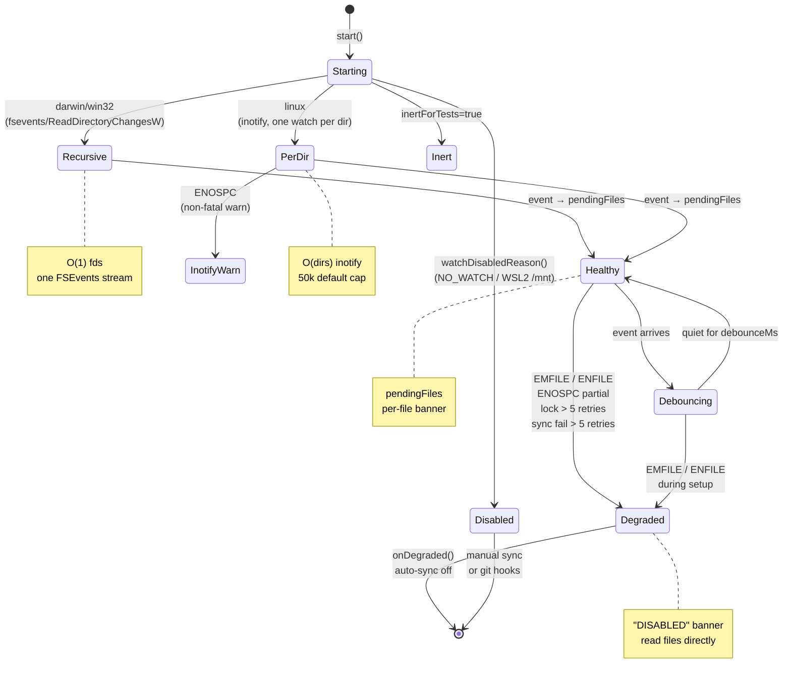

# 第 8 章 · 增量同步、Watcher 与降级策略

> **面向读者**：用户 / 开发者 · **预计阅读**：20 分钟
> **前置依赖**：{{chapter:10}}
> **本章目标**：理解 watcher 三平台差异、adaptive debounce 与降级路径

## 8.1 引言

编辑器里改一行代码，等多久能在 MCP tool 里看到新结果？经验值 ~1 秒；更快（<300 ms）命中 adaptive quick window，更慢（≥2 s）是默认 debounce 在等。这套响应速度来自 `src/sync/watcher.ts` 的 `FileWatcher` —— 直连 Node 内置 `fs.watch`，按平台挑策略，再用一个动态 debounce 把单次保存与大编辑洪流都拢到一次 sync。

为什么有时卡住？三件事让 watcher 不再「安静」后台跑：(1) 文件描述符耗尽（EMFILE / ENFILE），watcher 被永久禁用；(2) 另一进程持写锁不放超过 5 次重试预算，watcher 放弃；(3) sync 本身连续失败 5 次（坏 extractor、SQLITE_FULL），watcher 主动降级。这三种情况都触发一次性 ⚠️ banner 告诉宿主「auto-sync 已停」。本章讲清三种降级路径、自适应 debounce 算法、以及 `CODEGRAPH_NO_WATCH=1` / `CODEGRAPH_WATCH_DEBOUNCE_MS` 两旋钮。

## 8.2 概念铺垫

**FSEvents / inotify / ReadDirectoryChangesW**——三大平台内核级文件变化通知。macOS 走 FSEvents（一流覆盖整子树），Linux 走 inotify（一 watch 对应一目录下所有子文件变更），Windows 走 ReadDirectoryChangesW。语义不一致，watcher 必须按平台分支。

**debounce**——把一连串事件合并成一次动作的「安静窗口」：每事件重置定时器，最后一次事件后等够 N 毫秒才真正触发。**adaptive debounce**——按 pending 文件数动态切窗口：≤ 2 个走 300 ms 快窗口（单保存即时），> 2 个走完整 `debounceMs`（合并 burst）。**scoped vs full scan**——pending ≤ 500 走精确路径，> 500 退回全树 scan-diff（branch checkout 几千事件的 storm 用精确列表反而比一遍 scan 慢）。

## 8.3 正文

本节用一张状态机总览 watcher 全生命周期，下文逐项展开。



### 8.3.1 平台差异：macOS / Linux / Windows

源码注释把这三条策略写得很清楚（`src/sync/watcher.ts:1-32`）：

- **macOS / Windows**——一次 `fs.watch(root, { recursive: true })`。libuv 映射到一个 FSEvents 流 / ReadDirectoryChangesW handle。**成本 O(1) 个 fd**，不随文件数增长。
- **Linux**——`fs.watch` 不支持递归，所以给每个**非忽略目录**装一个 inotify watch。成本 O(directories)，不是 O(files)。一目录的 inotify watch 已会报该目录下所有子文件 create/modify/delete，所以无需给文件单独装 watch。
- **共享 ignore**——`buildScopeIgnore(projectRoot)`（内置默认 + `.gitignore`）过滤。macOS/Windows 单一递归流仍扫到 `node_modules/`，但 ignore 在事件入 `pendingFiles` 前丢；Linux 根本不深入忽略树。

新目录处理不同：macOS/Windows 自动覆盖；Linux 在 `handleDirEvent` 里 `statSync` 后给新目录补 watch（`watcher.ts:472-536` 的 `watchTree(dir, markExisting)` 处理「mkdir 后立刻 write」race——新目录 watch 装好前已写入的文件必须手动塞进 pendingFiles）。

### 8.3.2 Adaptive debounce

单保存想要「秒回」，burst 编辑想要「一次合并」——固定窗口两难。CodeGraph 用 adaptive 方案（`watcher.ts:62-76`、`796-808`）：`QUICK_SYNC_MAX_PENDING = 2`、`QUICK_SYNC_QUIET_MS = 300`、`SCOPED_SYNC_MAX_PENDING = 500`。`scheduleSync()` 每事件重置定时器，按 `pendingFiles.size` 决窗口：size ≤ 2 → 300 ms（封顶 `debounceMs`，floor 100 ms）；size > 2 → 完整 `debounceMs`（默认 2000 ms）。快窗口里新事件被「重置 + 升级」——再来一文件就升级到全窗口；一孤立保存 + 它的测试文件配对（恰好 2 个）能在 300 ms 出结果，更大 burst 仍合并。

### 8.3.3 Retries / backoff / degrade 策略

`flush()`（`watcher.ts:838-945`）是「触发 → 跑 sync → 记账」主循环。两类失败分别计数：**LockUnavailableError**（写锁被另一进程持）`lockRetryCount += 1`，**5 连败**就 degrade——短时争锁正常，长期持锁说明外部 indexer 卡住。**其它 sync 抛错**（tree-sitter extractor 崩、DB 损坏、`SQLITE_FULL`、batch resolve OOM）`syncFailureRetryCount += 1`，**5 连败**就 degrade。**一次干净 sync 清零两计数器**，偶发 hiccup 永不降级。

失败后**指数退避**：`retryDelayMs = min(debounceMs * 2^(max(lockRetryCount, syncFailureRetryCount) - 1), 30_000)`。默认 2000 ms，5 连败后第 6 次等 32 s（封顶 30 s）。Lock 与一般失败用 streak 较大者，交错时也稳定退避。

**degrade 本质**（`watcher.ts:669-675`）：设 `degradedReason`，发一次 `onDegraded(reason)` 给宿主，`stop()` 关所有 watch。**degrade 是单向 latch**：下一次 `start()` 才清。

### 8.3.4 ⚠️ Per-file staleness banner（formatStaleBanner）

每次 MCP tool 响应里，若回答引用的文件落在 `pendingFiles`，顶上带一段 banner（`tools.ts:389-403`），列出每个 stale 文件的 `(edited Nms ago, pending sync | indexing in progress)`。label 由 `syncStartedMs` 与 `lastSeenMs` 比较得到——「indexing in progress」说明 sync 已在跑；「pending sync」说明还在 debounce 窗口里。底栏附「项目里其它 pending 文件」footer（`formatStaleFooter`，`tools.ts:410-423`），上限 5 条 + 「…and N more」。Agent 想确认整个仓库是不是 caught up，看 footer 就够。

### 8.3.5 ⚠️ Auto-sync DISABLED banner 与 `CODEGRAPH_NO_WATCH=1`

第二种 banner 是**全局级**——watcher 真 degrade 时，`codegraph_status` 顶上出现 `**Auto-sync disabled:** <reason>`（`tools.ts:433-440` `formatDegradedBanner` + `tools.ts:4146-4157`）。整个索引已冻结，`pendingFiles` 为空，per-file banner 反而不触发——这正是需要单独 banner 的原因（#876）。

**`CODEGRAPH_NO_WATCH=1`** 是另一路径：走 `watch-policy.ts:watchDisabledReason()`，在 `start()` 前直接拒绝装 watch，`start()` 返回 `false`，但 `degradedReason` 仍为 null，**MCP status 里不会看到「Auto-sync disabled」**。区别：`NO_WATCH` 是用户主动 opt-out，watcher 从未启动、永远无事件；degrade 是 watcher 启动后被永久关掉。两种状态效果类似（不会自动 sync），但语义不同。`NO_WATCH` 模式没人替提醒；要手动 `codegraph sync` 或装 git post-commit hook。

### 8.3.6 调优 `CODEGRAPH_WATCH_DEBOUNCE_MS`

`parseDebounceEnv()`（`engine.ts:315-334`）暴露这旋钮：范围 [100 ms, 60 000 ms]，**越界或非整型直接 ignore**（不静默 cap，回退默认——避免把 0 / typo 当合法配置掩盖 bug）；默认 2000 ms；设了之后 MCP 启动 stderr 打 `[CodeGraph MCP] File watcher debounce: <N>ms (CODEGRAPH_WATCH_DEBOUNCE_MS)`。大 monorepo CI 提交一次 200 文件提到 10–30 s；prettier → eslint --fix → save 链提到 5–10 s。想「真·即时」降到 100–300 ms，但**不会比 adaptive quick window 的 300 ms 更快**——单保存永远走快路径，debounce 设短没意义。`CODEGRAPH_MAX_DIR_WATCHES`（Linux 上限，默认 50 000）也是同调参家族。

## 8.4 真实场景实战

### 场景 8.1：连续改 5 个文件观察 debounce 触发

在 `examples/ch08-watcher-demo/`（已 `codegraph init`）启动 daemon，再快速改 5 文件，观察 `daemon.log` 与 `codegraph_status` 的「Pending sync」段。

预期：第 1 保存触发 300 ms 后 sync（pending=1）；300 ms 内连改剩下 4 个 → pending 涨到 5，timer 重置并升级到 `debounceMs`（默认 2000 ms）；2000 ms 后一次 sync 跑完吸全部 5 变更。

实测（2026-07-27，见 validation-log）：第二个 status 恰好抓到「Pending sync: index.js (edited 187ms ago, pending sync)」——debounce 未到，但事件已入队。

### 场景 8.2：用 `CODEGRAPH_NO_WATCH=1` 关掉

```bash
cd examples/ch08-watcher-demo
rm -f .codegraph/daemon.pid .codegraph/daemon.sock
CODEGRAPH_NO_WATCHDOG=1 CODEGRAPH_NO_WATCH=1 codegraph serve --mcp &
sleep 3
# 通过 MCP JSON-RPC 调 codegraph_status
```

预期：状态返回**没有** `**Auto-sync disabled:**` 段——`NO_WATCH` 是拒绝启动而非 degrade；改文件后 `pendingFiles` 永远空，**per-file banner 也不触发**，因为根本没事件入队。

### 场景 8.3：触发 >500 pending 走 full scan-diff

构造：git checkout branch 切换一次性 emit 数千事件期间调 `codegraph status`。或测试里 `__emitWatchEventForTests()` 喂 600 次。预期：`flush()` 里走 `scoped = undefined`，跑全树 scan-diff。

### 场景 8.4：大仓里调 debounce 到 5000 ms

```bash
cd /path/to/large-monorepo
CODEGRAPH_NO_WATCHDOG=1 CODEGRAPH_WATCH_DEBOUNCE_MS=5000 codegraph serve --mcp 2>&1 | grep debounce
# 预期: [CodeGraph MCP] File watcher debounce: 5000ms (CODEGRAPH_WATCH_DEBOUNCE_MS)
```

然后 `git checkout feature-branch` 触发 200+ 文件变更。观察 `daemon.log` `Auto-synced N file(s) in ...ms` 频率：从默认 2 s 一次降到 ~5 s 一次，每次吃下变更数更多。

## 8.5 本章小结

- **平台差异**：macOS/Windows 单一递归流（O(1) fd），Linux 每目录一 inotify watch（O(dirs)）；共享同一 ignore 过滤。
- **Adaptive debounce**：pending ≤ 2 走 300 ms 快窗口；pending > 2 走完整 `debounceMs`（默认 2 s，封顶 60 s）。
- **Scoped vs full**：pending ≤ 500 走精确路径；> 500 退全树 scan-diff。
- **降级**：lock 5 连败、sync 5 连败、EMFILE/ENFILE、ENOSPC 都触发 degrade；指数退避封顶 30 s；degrade 是单向 latch。
- **Banner**：per-file banner 标 stale 文件；degrade 时 `codegraph_status` 顶上多一段「Auto-sync disabled」全局 banner。
- **`NO_WATCH=1`**：opt-out 在 start 前，**不会**触发 DISABLED banner；要手动 `codegraph sync` 兜底。

## 8.6 常见踩坑

- **macOS FSEvents 合并**：短时间内同一目录下多事件被打包；branch checkout「几千事件同时来」常变几十条。
- **WSL2 跨 FS inotify 失效**：`/mnt/c/...` 上 `fs.watch` 极慢（readdir/stat 跨 9p 边界），MCP handshake 超时。`watch-policy.ts:detectWsl()` 检测后返 disabled reason。解法：项目放 WSL native FS 或 git sync hook。
- **VSCode save race**：VSCode save 默认原子替换，单 save 可能产 2–3 事件；watcher 把「编辑器 + 测试文件配对」（≤ 2 文件）归到 300 ms 快窗口，但 save 同时触发构建脚本写 `dist/`，5+ 事件被 debounce 升级到 2 s。
- **`CODEGRAPH_NO_WATCH=1` 静默**：没人提醒；CI 流水线务必加 git post-commit hook 调 `codegraph sync`。
- **`CODEGRAPH_WATCH_DEBOUNCE_MS=0` 不生效**：解析器 ignore 回退默认 2 s，stderr 无提示；先看 `[CodeGraph MCP] File watcher debounce: <N>ms` 确认参数被接受。

## 8.7 下一章预告（{{chapter:9}}）

下一章讲**索引内核**：为什么 CodeGraph 选 Rust + tree-sitter 作 parser、worker thread pool 与 child process 的取舍、FTS5 索引与 edge resolution 的具体算法。

## 8.8 参考

- `src/sync/watcher.ts:1-32` — 三平台策略注释
- `src/sync/watcher.ts:48-76` — retry / backoff / adaptive 阈值常量
- `src/sync/watcher.ts:472-536` — `watchTree(markExisting)` mkdir+write race
- `src/sync/watcher.ts:669-675` — `degrade()` 单向 latch
- `src/sync/watcher.ts:791-809` — `scheduleSync()` adaptive quick window
- `src/sync/watcher.ts:838-945` — `flush()` lock vs sync-failure 分流 + 退避
- `src/sync/watch-policy.ts:watchDisabledReason()` — `NO_WATCH` / WSL 决策
- `src/mcp/engine.ts:249-252` — `CODEGRAPH_WATCH_DEBOUNCE_MS` 装载
- `src/mcp/engine.ts:315-334` — `parseDebounceEnv()` clamp [100, 60 000]
- `src/mcp/tools.ts:389-403` — `formatStaleBanner`
- `src/mcp/tools.ts:410-423` — `formatStaleFooter`
- `src/mcp/tools.ts:433-440` — `formatDegradedBanner`
- `src/mcp/tools.ts:4146-4172` — `codegraph_status` Auto-sync disabled + Pending sync 段
- `src/mcp/server-instructions.ts:62` — Agent banner 行为守则
- F-10 watcher 状态机(已在本章 §8.3 内联 mermaid 代码块)