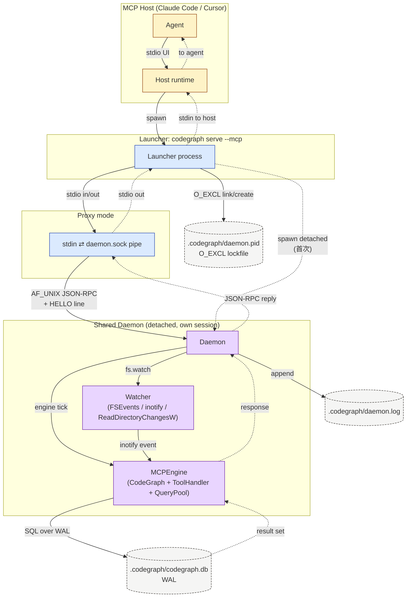

# 第 10 章 · 进程拓扑与端到端数据流

> **面向读者**：架构师 / 开发者 · **预计阅读**：25 分钟  
> **前置依赖**：{{chapter:6}}  
> **本章目标**：看清每个进程、每个 socket、每条流的角色——从 MCP host 发起一次 `codegraph_explore` 到 SQLite 返回节点之间的全部环节。

## 10.1 引言

读完前几章,你已经会用 `codegraph install` 把 MCP server 写进 Claude 配置,也能用 `codegraph explore` 直接跑查询。但**命令背后到底有几个进程在跑、它们之间靠什么说话、谁负责退出**,仍然是黑盒。

本章从一次最普通的调用出发,把它拆成 Agent → Launcher → (Proxy ⇄ Daemon) → Engine → SQLite 五段流水线,把每段的进程归属、IPC 形式、生命周期边界画清楚。读完你会:

- 知道 `codegraph serve --mcp` 启动后,**一个项目里可能同时存在 1 到 2 个进程**,以及它们各自的角色。
- 能用 `pgrep` / `lsof -U` 在现场确认当前到底跑的是 Direct、Proxy 还是 Daemon 模式。
- 理解 PPID watchdog、idle timeout、原子锁这些"小机制"在整张图里补的哪一个缺口。
- 拿到一张 F-5 全链路 mermaid 图(本节内联,节点与边都按本章命名,后续章节引用时不会错位)。

## 10.2 概念铺垫

**MCP** (Model Context Protocol)—— Anthropic 提出的进程间协议:host(Claude/Cursor 等)与 server 通过 stdio 交换 JSON-RPC 消息,**stdout 只放协议帧,诊断写 stderr**。

**JSON-RPC**——单行一帧的请求/响应/通知。`initialize`、`tools/list`、`tools/call` 是工程里最常见的三类消息。

**stdio transport**——host 把 server 当子进程拉起,server 从 `stdin` 读请求、向 `stdout` 写响应。这是 Direct 与 Proxy 模式的传输层。

**Unix-domain socket / named pipe**——同机进程间的高效双向字节流。本章里是 Proxy 与 Daemon 之间的"专线",在 macOS/Linux 上是 `.codegraph/daemon.sock`,在 Windows 上是 named pipe(`\\.\pipe\...`)。

**PPID watchdog**——一个 `setInterval`,每 5 秒读 `process.ppid`(POSIX)或对父 PID 发 `kill(pid, 0)`(Windows);父死了就主动 `process.exit`。解决 SIGKILL 后 stdin 不一定关闭、留下孤儿的问题(#277)。

**原子锁 (O_EXCL)**——创建文件时加 `O_EXCL` 标志,内核保证只有一人成功。这是多个 launcher 同时启动时"谁当 Daemon"的无锁仲裁手段。

**refcount + idle timeout**——Daemon 用 `Set<MCPSession>` 计活跃客户端,归零后启动 `setTimeout`;新连接进来取消计时器。默认 300 秒(`CODEGRAPH_DAEMON_IDLE_TIMEOUT_MS` 可改),让"启动后立刻被抛弃"的 Daemon 不会永远占着 socket。

这些概念在前文已经分别出现过。本章把它们粘到一张图上。

## 10.3 正文

### 10.3.1 三种运行模式总览

`MCPServer.start()` 决策顺序(`src/mcp/index.ts:226-275`):

1. **`CODEGRAPH_DAEMON_INTERNAL=1`** → 我就是 Daemon。被 `spawnDetachedDaemon` 重启后才有这个环境变量,直接 `startDaemonProcess()` 绑 socket。
2. **`CODEGRAPH_NO_DAEMON=1`** → Direct。这是 pre-#411 的行为,一个进程包打天下。
3. **找不到可达的 `.codegraph/`** → Direct。锁文件与 socket 都得住进 `.codegraph/`,没有项目根就没 rendezvous 点。
4. **其他情况** → Proxy。先本地答 MCP 握手,后台连/拉 Daemon;失败透明回退 Direct。

三种模式的对比(对应 `src/mcp/index.ts:17-35` 的注释):

| 模式 | 进程数(单 host) | 谁持 Engine | 何时退出 | 谁用 |
|---|---|---|---|---|
| Direct | 1 | 本进程 | host 关 stdin / PPID 死 | 临时目录、CI、单次调用 |
| Proxy | 1(自己)+ 1(Daemon) | Daemon | host 关 stdin / PPID 死;Daemonsocket 关闭后 proxy 退出 | **默认**,本机连续调用 |
| Daemon | 1(被前面 N 个 Proxy 共享) | 本进程 | refcount=0 后 idle timeout,或 SIGTERM/SIGINT | 多 agent 并发 |

### 10.3.2 直接模式(Direct)

入口:`startDirect(reason)`(`src/mcp/index.ts:310-350`)。

启动顺序:

```
new MCPEngine()                     // 共享状态容器,见 10.3.5
new StdioTransport()                // stdio ⇄ 帧解析
new MCPSession(transport, engine)   // MCP 协议状态机
engine.ensureInitialized(path)      // 后台,不阻塞 initialize 响应
session.start()                     // 接管 stdin/stdout
installSignalHandlers()             // SIGINT/SIGTERM → stop()
installPpidWatchdog()               // 每 5s 检查父进程
installMainThreadWatchdog()         // worker 子进程发 heartbeat
armStartupHandshakeTimeout()        // 15min 无 MCP 字节 = 弃婴
```

**进程拓扑**:

```
┌─────────────────────────┐
│ MCP host (Claude)        │
│  stdio ──────────────┐   │
└─────────────────────────┼───┘
                          ▼
            ┌─────────────────────────┐
            │ codegraph serve --mcp    │
            │  (Direct: 1 进程,        │
            │   MCPEngine + MCPSession │
            │   + CodeGraph + SQLite)  │
            └─────────────────────────┘
```

Direct 模式下整个 pipeline 都在一个进程里。没有 socket,没有额外文件锁。诊断最直接,代价是**每次启动都付一次冷启动**(SQLite open、grammar warm-up、query pool 关闭)。

### 10.3.3 代理模式(Proxy)

入口:`runProxyWithLocalHandshake(root)`(`src/mcp/index.ts:406-` 区间,紧接 `start()`)。

冷启动路径:

1. 取候选 socket 列表(`getDaemonSocketCandidates`)。优先 `.codegraph/daemon.sock`,过 108 字节则退化到 `os.tmpdir()` 下的哈希路径。
2. `runLocalHandshakeProxy` **本地回答** `initialize` / `tools/list` 这两个静态请求——不连 Daemon,毫秒级返回,根除 "No such tool available" 的 cold-start race(#411 注释、proxy.ts:18-19)。
3. 后台 `net.createConnection(socketPath)`,每 25ms 轮询一次,共 ~6s 预算(`DAEMON_CONNECT_MAX_RETRIES=240`)。
4. 连上 → `readHelloLine` → 校验版本一致 → 发 `DaemonClientHello`(proxy/host pid)→ 转入"stdio ⇄ socket"透明 pipe。
5. 没连上 → `spawnDetachedDaemon(root)`:用 `child_process.spawn({detached: true})` 重启自己,加上 `CODEGRAPH_DAEMON_INTERNAL=1`,`child.unref()`。新一轮竞争 O_EXCL 锁,胜者成为 Daemon。
6. **仍**没连上 → 整个 Proxy 路径抛错 → `catch` 块走 Direct。

**进程拓扑**:

```
┌─────────────────────────┐
│ MCP host (Claude)        │
│  stdio ──────────────┐   │
└─────────────────────────┼───┘
                          ▼
            ┌─────────────────────────┐
            │ Proxy (本进程)            │
            │  stdin ⇄ daemon.sock     │
            │  PPID watchdog +         │
            │  startup handshake      │
            └────────────┬────────────┘
                         │  AF_UNIX socket
                         ▼
            ┌─────────────────────────┐
            │ Daemon (detached)        │
            │  MCPEngine + N× Session │
            │  + watcher + SQLite WAL  │
            └─────────────────────────┘
```

Proxy **不解析** JSON-RPC 帧:host 写到它 stdin 的每个字节都直接 forward 到 socket,反过来也是。这让它极薄,出问题容易定位。

### 10.3.4 守护模式(Daemon)

入口:`startDaemonProcess()`(`src/mcp/index.ts:361-396`)→ `Daemon.start()`(`src/mcp/daemon.ts:206-305`)。

启动顺序:

1. **锁仲裁**:`tryAcquireDaemonLock(root)` 拿 `.codegraph/daemon.pid`。优先 `link(O_EXCL)`(POSIX),fallback 写文件(Windows)。返回 `acquired` / `taken`。
2. **`acquired`** → 进入主路径。`taken` 且持锁进程存活 → 自己 `process.exit(0)`(败者认输)。持锁进程死了 → `clearStaleDaemonLock` 后重试,最多 5 次(`TAKEOVER_MAX_RETRIES`)。
3. **绑 socket**:`bindFirstUsableSocket(candidates, listen)`。优先 in-project,失败可降级到 tmpdir 哈希路径(ExFAT / WSL2 DrvFs / FAT 等不支持 AF_UNIX 的卷,#997)。
4. **`chmod 0600`** 仅 POSIX,Windows 用 ACL。
5. **rewrite lockfile**:如果实际绑的路径不等于首选路径,把 daemon 的 `{pid, version, socketPath, startedAt}` 原子写回(避免"锁指向错地址")。
6. **`registerDaemon`**:写一份 discovery 记录,`codegraph list` / `stop --all` 靠它找进程。
7. **`armIdleTimer` + `startLivenessTimers`** + 注册 SIGINT/SIGTERM。

accept 之后(`src/mcp/daemon.ts:225 handleConnection`):

```
net.createServer(socket => {
  // 1. 发 DaemonHello: {codegraph, pid, socketPath, protocol:1}
  // 2. 启 CLIENT_HELLO_TIMEOUT_MS=3s 等待可选 client-hello
  // 3. SocketTransport(socket) + new MCPSession(transport, engine)
  // 4. this.clients.add(session); clear idleTimer
  // 5. session 'close' → this.clients.delete(session); arm idleTimer
})
```

**为什么 Daemon 必须 detached**:在 pre-#411 实现里,Daemon 是第一个 host 的子进程——那个 host 的终端一关,**所有其他 host 也连带断电**。detached 之后 Daemon 拥有独立的 session/process group,SIGHUP/SIGINT 传不到它;它的退出条件只剩 refcount=0 + idle timeout 与显式 SIGTERM。

**进程拓扑(多 host 共享)**:

```
host A stdio → Proxy A ─┐
host B stdio → Proxy B ─┼──► .codegraph/daemon.sock ──► Daemon
host C stdio → Proxy C ─┘
```

每个 Proxy 各自带 PPID watchdog;Daemon 不带——它故意比任何 host 都活得久。

### 10.3.5 MCPEngine 共享状态

无论哪种模式,**引擎实例的边界**决定了一次查询能跨多少项目复用(`src/mcp/engine.ts:53-67`):

```
MCPEngine {
  cg: CodeGraph | null              // CodeGraph 实例(包含 SQLite 连接)
  toolHandler: ToolHandler          // tool dispatch 表
  initPromise: Promise<void> | null // 单次初始化,多个 session 并发不重做
  queryPool: QueryPool | null       // 仅 Daemon 用,off-loop 读分发
}
```

- **Direct**:1 engine + 1 session + 0 query pool(单 stdio client 不需要并发)。`initPromise` 永远只跑一次。
- **Daemon**:1 engine + N session + 1 query pool(`queryPool: true`)。多个 session 通过同一 `cg` 读 SQLite WAL,worker pool 把 read tool 甩出 event loop,避免并发 explore 互锁饿死 MCP transport。

**关键不变量**:`ensureInitialized(root)` 的内部 `initPromise` 是"项目级单例":即便 daemon 同时 accept 三个 connection,SQLite 也只 open 一次。这条 promise 是整个 daemon 模式的性能来源。

### 10.3.6 端到端数据流

F-5 图覆盖从 Agent 发起 `codegraph_explore` 到 SQLite 返回的完整链路。



**节点清单**(上图据此画):

```
[Agent] Claude/Cursor
[Host] MCP host(Claude Code runtime)
[Launcher] `codegraph serve --mcp`(每次 host 启动拉起,可能是 Proxy)
[Proxy] stdin ⇄ daemon.sock 透明 pipe,带 PPID watchdog
[Daemon] detached 进程,绑 AF_UNIX socket
[Engine] MCPEngine:CodeGraph + ToolHandler + QueryPool
[Watcher] inotify / fs.watch,daemon 唯一持有
[SQLite] .codegraph/index.db,WAL 模式,单连接(daemon)
[LockFile] .codegraph/daemon.pid(O_EXCL)
[LogFile] .codegraph/daemon.log(detach 后 stdout/stderr 重定向)
```

**边清单**(每个箭头标注传输形式与方向):

```
Agent  --stdio(请求帧)-->        Host
Host   --spawn(子进程)-->         Launcher
Launcher --stdio(in/out)-->       Proxy
Launcher --spawn(detached)-->     Daemon  // 仅首次,无现成 daemon 时
Launcher --O_EXCL(link/create)--> LockFile
Proxy   --AF_UNIX(明文 JSON-RPC)--> Daemon
Proxy   --HELLO line-->            Daemon  // DaemonHello / DaemonClientHello
Daemon  --fs.watch-->              Watcher
Watcher --inotify event-->         Engine  // 触发增量 sync
Engine  --SQLite(WAL)--SQL-->      SQLite
SQLite  --row-->                   Engine
Engine  --JSON-RPC response-->     Proxy
Proxy   --stdio(响应帧)-->         Launcher
Launcher --stdio-->                Host
Host    --UI render-->             Agent
Daemon  --append-->                LogFile  // 仅 detach 模式
```

**一次完整往返(Proxy 模式,数据流)**:

1. Agent 在 UI 点了一次 "explore greet"。
2. Host 把消息包成 `tools/call { name: "codegraph_explore", arguments: { query: "greet" }}`,写入 Launcher 的 stdin。
3. Launcher (Proxy) 把字节原样写到 daemon socket。
4. Daemon 端 `MCPSession` 读到完整帧,解析后路由到 `ToolHandler.handleExplore`。
5. `toolHandler` 委托给 `Engine.cg.explore(query)`;若 query pool 开了则扔到 worker thread。
6. worker 走 SQLite WAL 读 `nodes` / `edges` / `files`,拼出 blast radius 与 call path。
7. 结果 JSON 序列化成 JSON-RPC response,沿 socket 倒回 Proxy → Launcher stdout → Host → Agent UI。

**Direct 模式**省掉第 3、4、9 步的 socket 跳——所有步骤都在一个进程,但**第 5-6 步是同步阻塞**,期间 UI 没有进度反馈,长查询会让 agent 卡住。Daemon + query pool 模式下 worker thread 让主 loop 继续处理其他 session 的请求。

## 10.4 真实场景实战

### 场景 10.1：观察启动后的进程与 socket

目的:确认本机处于 Proxy + Daemon 模式,且两进程各司其职。

```bash
# 后台启动(让 serve 进程退出前打印完整 hello)
codegraph serve --mcp &
PID=$!

# 1. 看进程树
pgrep -fl codegraph
# 预期:
#   <PID> node .../codegraph serve --mcp          ← Proxy
#   <PID_D> node .../codegraph serve --mcp ...    ← Daemon(detached,不同 PID)

# 2. 看 socket
lsof -U 2>/dev/null | grep codegraph || echo "no unix socket"
# 预期(Unix):codegraph <PID_D> ... /Users/.../.codegraph/daemon.sock

# 3. 看锁文件
cat .codegraph/daemon.pid
# 预期:JSON {pid, version, socketPath, startedAt},version 与 codegraph --version 一致

# 4. 关掉,看清理
kill $PID
sleep 6
lsof -U 2>/dev/null | grep codegraph || echo "cleaned"
ls -la .codegraph/daemon.pid 2>/dev/null || echo "lockfile cleaned"
```

**判读**:

- Proxy 和 Daemon 是**两个独立 PID**,因为 spawn 时 `detached: true` 让 Daemon 进入新 session。
- `lsof -U` 命中 `.codegraph/daemon.sock` 表示绑在了项目目录里;没命中而 `lsof -U` 总数不变,表示降级到 tmpdir(`getDaemonSocketCandidates` 第二项)。
- `kill $PID` 只杀 Proxy;Daemon 要靠 idle timeout 回收,所以 6 秒后仍可能存在——继续等 `CODEGRAPH_DAEMON_IDLE_TIMEOUT_MS`(默认 300s)就消失。

### 场景 10.2：清理不干净时的强制回收

目的:模拟 host SIGKILL(Proxy 立刻没机会 close socket),确认 idle + PID sweep 仍能让 Daemon 退出。

```bash
# 启动并触发一次实际查询(让 Proxy 确实 attach 过)
codegraph serve --mcp &
PROXY_PID=$!
sleep 2

# 模拟 SIGKILL,跳过所有清理
kill -9 $PROXY_PID

# 此时:
pgrep -fl codegraph | grep -v PID  # 仍能看到 Daemon
lsof -U 2>/dev/null | grep codegraph  # socket 还在

# 等待 idle timeout(为了快速验证,启动时设置短超时)
# CODEGRAPH_DAEMON_IDLE_TIMEOUT_MS=10000 codegraph serve --mcp
# 10 秒后:Daemon 进程消失,socket / pidfile 都清理
```

**判读**:Daemon 不依赖 stdin 关闭——它依赖 client-refcount + idle timer。即使 Proxy 被 SIGKILL,socket close 仍会被内核投递(`SocketTransport` 监听 `close` 事件),refcount 归零,idle timer 启动。若 socket close 因故丢失(#692 Windows named-pipe hazard),还有 30 秒一次的 `clientSweepTimer` 用 `kill(pid, 0)` 复核,以及 30 分钟的 `maxIdleTimer` 兜底。

## 10.5 本章小结

一张图记住整章:Agent → Host → Launcher → (Proxy ⇄ Daemon → Engine → SQLite)。

- **Direct** 把流水线塞进 1 个进程;Proxy 把 transport 与 lifecycle 解耦;Daemon 把昂贵状态摊到项目级。
- 三个关键 IPC 形式:**stdio**(host ↔ launcher)、**AF_UNIX socket**(launcher ↔ daemon)、**SQLite WAL**(daemon ↔ index.db)。
- 三个并发仲裁:**O_EXCL lockfile**(多 launcher 谁当 daemon)、**PPID watchdog**(host 死→proxy 退)、**refcount + idle timer**(daemon 在没人用时退)。
- MCPEngine 的 `initPromise` 让多 session 共享单 SQLite open,是 daemon 模式的性能根。

## 10.6 常见踩坑

1. **把 daemon 当成 host 的子进程**——pre-#411 的旧行为,会因第一个 host 退出而拖垮所有其他 host。永远要 detached。
2. **只看 socket 文件存在就认为连得上**——必须先读 hello 校验版本,否则 0.9.x proxy 撞上 0.10.x daemon 会写出诡异字段。
3. **诊断写 stdout**——MCP host 把 server stdout 当协议帧解析,任何 `console.log` 都会破坏 JSON-RPC 流。诊断必须走 stderr 或 `daemon.log`。
4. **靠 stdin EOF 判断 host 退出**——SIGKILL、launcher 链、socket-backed stdin 都会让 EOF 不到。要么靠 stdin teardown,要么靠 PPID watchdog。
5. **refcount 一定能归零**——named pipe 在 Windows 上可能丢 close 事件(#692)。必须配合 client PID sweep + max-idle 兜底。
6. **冷启动时不等 daemon 就放弃**——本地 handshake + 25ms 轮询 + ~6s 预算,足以盖住 node 进程启动。不要把 connect 超时调成 1 秒。

## 10.7 下一章预告({{chapter:11}})

下一章进入 SQLite 的 schema 层:节点表、边表、文件表的具体列、为何用 WAL、为何单连接够用。理解了 10 章的"谁在用 SQLite",再看 schema 里每条索引为什么存在。

## 10.8 参考

- 源码:`src/mcp/index.ts:1-400`(模式决策)、`src/mcp/daemon.ts:1-350`(绑 socket 与 refcount)、`src/mcp/proxy.ts:1-100`(透明 pipe)、`src/mcp/engine.ts:1-80`(MCPEngine 边界)。
- 验证:`references/validation-log.md`。
- 关联章节:{{chapter:14}}(MCP 三模式的协议工程细节)。