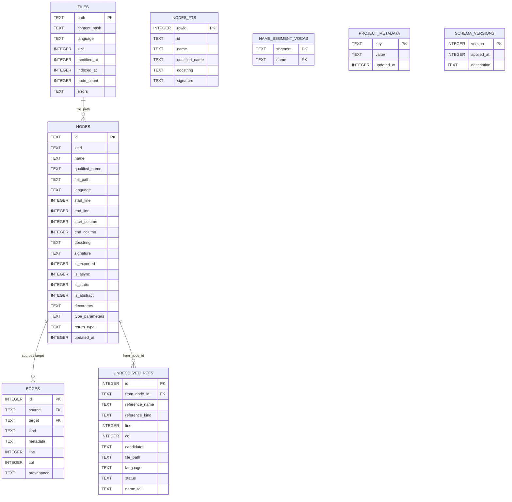

# 第 11 章 · 知识图谱 Schema

> **面向读者**:架构师 / 开发者 · **预计阅读**:25 分钟
> **前置依赖**:无
> **本章目标**:理解 nodes / edges / FTS5 / unresolved_refs 的设计取舍

## 11.1 引言

CodeGraph 把仓库编码成一张持久化的、面向 SQLite 的语义图:节点表示符号、边表示关系、四个辅助表(FTS5 索引、词汇表、文件清单、未解析引用队列)支撑搜索、提示词门控和增量同步。本章逐张表拆解设计动机,把 schema.sql / migrations.ts / types.ts 之间的契约对齐起来,以及用一次真实的 `sqlite3` 跑通来验证一切按纸面生效。

## 11.2 概念铺垫

**为什么不上图数据库?** Neo4j / Memgraph 类系统擅长多跳遍历,但本地开发场景下要交付给 MCP / CLI 一并打包、零外部依赖、跨平台便携。SQLite WAL + node:sqlite 让单文件 DB 即可承载百万节点;遍历靠 CTE / 递归查询或内存 BFS 实现,图数据库的"任意深度遍历用 1 次查询"的甜点我们用批量 keyset paging 替代,详见 11.4.2。

**SQLite FTS5 的极限**:`nodes_fts` 用 `content='nodes'` 外部内容表,只把 `id / name / qualified_name / docstring / signature` 投影进倒排索引。它不切 camelCase(`OrderService` 是单一 token),所以精确子串与"提示词→符号"门控靠独立的 `name_segment_vocab` 表兜底。

**Wire contract 稳定性**:`NODE_KINDS` / `EDGE_KINDS` 在 `src/types.ts` 用 `as const` 数组声明;数组顺序就是 native kernel 跨边界的 kind 索引(`src/extraction/kernel/layout.ts`)。**追加,绝不重排**,否则已落盘的 kind 整数会错位,引发"节点 kind 是 interface / 解析却拿 class"这类静默 bug。

## 11.3 正文

### 11.3.1 Node 的 22 种 Kind(NODE_KINDS)

| # | kind | 典型场景 |
|---|------|----------|
| 0 | `file` | 一个被索引的源文件节点 |
| 1 | `module` | 文件级模块容器(TS/JS) |
| 2 | `class` | 类声明 |
| 3 | `struct` | C/C++/Go 结构体 |
| 4 | `interface` | TS/Go/C# 接口 |
| 5 | `trait` | Rust/PHP trait |
| 6 | `protocol` | Swift/Obj-C 协议 |
| 7 | `function` | 顶层函数 |
| 8 | `method` | 类/结构体内的方法 |
| 9 | `property` | 对象的属性声明 |
| 10 | `field` | 类的字段 |
| 11 | `variable` | 模块级变量 |
| 12 | `constant` | 常量(`const` / `MAX_*` 启发式) |
| 13 | `enum` | 枚举类型 |
| 14 | `enum_member` | 枚举成员 |
| 15 | `type_alias` | `type Foo = ...` |
| 16 | `namespace` | TS / C++ 命名空间 |
| 17 | `parameter` | 函数/方法参数 |
| 18 | `import` | 导入声明 |
| 19 | `export` | 命名导出 |
| 20 | `route` | HTTP 路由(`app.get("/orders", ...)`) |
| 21 | `component` | 框架组件(React / Vue / Svelte) |

### 11.3.2 Edge 的 12 种 Kind(EDGE_KINDS)

| # | kind | 含义 |
|---|------|------|
| 0 | `contains` | 父包含子(file→class, class→method) |
| 1 | `calls` | 调用另一个函数/方法 |
| 2 | `imports` | 文件导入另一文件 |
| 3 | `exports` | 文件导出符号 |
| 4 | `extends` | 继承父类 |
| 5 | `implements` | 实现接口 |
| 6 | `references` | 通用符号引用 |
| 7 | `type_of` | 变量/参数的类型 |
| 8 | `returns` | 函数返回类型 |
| 9 | `instantiates` | `new ClassName()` 表达式 |
| 10 | `overrides` | 方法覆盖父方法 |
| 11 | `decorates` | 装饰器 / 注解 |

注:`unresolved_refs` 还可以携带 `'function_ref'`(把函数名当值用,#756),它**不是** EdgeKind,仅作为引用生命周期中的过渡态。

### 11.3.3 nodes 表 + 索引

`nodes` 主键是 `id`(file_path + qualified_name 的稳定哈希,详见 types.ts),行内保存源码区间、修饰符、装饰器数组(JSON)、返回类型规约值(`return_type` for C++ receiver-type inference, v5 引入)。七条 secondary index:

| 索引 | 覆盖列 | 服务场景 |
|------|--------|----------|
| `idx_nodes_kind` | `kind` | "列出所有 function 节点" |
| `idx_nodes_name` | `name` | 按简单名查 |
| `idx_nodes_qualified_name` | `qualified_name` | 完整限定名查询 |
| `idx_nodes_file_path` | `file_path` | "这个文件有哪些节点" |
| `idx_nodes_language` | `language` | 跨语言筛选 |
| `idx_nodes_file_line` | `(file_path, start_line)` | LSP `textDocument/definition` 二分定位 |
| `idx_nodes_lower_name` | `lower(name)` | 内存友好型大小写无关查找(v3) |

### 11.3.4 edges 表 + UNIQUE 去重

`edges` 自增主键,通过两条 FK 关联 nodes 表,`ON DELETE CASCADE` 保证节点删了边随之清理。`metadata` 是 JSON,`provenance` 标注来源(`tree-sitter` / `scip` / `heuristic`)。

关键的 v6 改动:`idx_edges_identity` 是 UNIQUE 索引,定义在 `(source, target, kind, IFNULL(line, -1), IFNULL(col, -1))`。`IFNULL` 把可空行列折成哨兵值,否则 SQLite 把每个 NULL 当成彼此不同,合成边就重复了。`insertEdge` 用 `INSERT OR IGNORE`,没有这条索引就只剩空头支票,#1034 已修复。五个 edge 索引:

| 索引 | 列 | 用意 |
|------|----|------|
| `idx_edges_kind` | `kind` | "所有 calls 边" |
| `idx_edges_source_kind` | `(source, kind)` | caller 内 `implements` / `extends` 遍历 |
| `idx_edges_target_kind` | `(target, kind)` | "谁调用了 X" 反向查询 |
| `idx_edges_identity` UNIQUE | 见上 | dedup 凭证 |
| `idx_edges_provenance` | `provenance` | scip vs tree-sitter 区分 |

注意 `idx_edges_source` / `idx_edges_target` 在 v4 **被删除**:窄索引被 `(source, kind)` / `(target, kind)` 复合索引的左前缀替代,维护这俩对写路径都是净亏。

### 11.3.5 files / unresolved_refs

**files**:`content_hash` + `modified_at` 是增量同步的两块基石——`content_hash` 判定"内容是否真变了"(避开触摸时间触发的假阳性),`modified_at` 做快筛。`errors` 以 JSON 数组存每文件的提取错误,`node_count` 给进度条用。

**unresolved_refs**:状态机三态。

- `pending`:抽取阶段写入;batched 分辨循环逐条解析。
- 解析成功 → DELETE 行,边落到 `edges`。
- 解析失败 → UPDATE 成 `failed`,把 `reference_name` 的末段写入 `name_tail`(`util.greet` → `greet`),下次 sync 时只要新文件加进同末段符号就能重试(#1240)。

`idx_unresolved_failed_tail` 是 `WHERE status='failed'` 的部分索引;健康图上 pending 集为空、failed 才值得建索引。`ON DELETE CASCADE` 让节点删除自动清相关 ref。

### 11.3.6 nodes_fts(FTS5 虚拟表)

```
CREATE VIRTUAL TABLE nodes_fts USING fts5(
    id, name, qualified_name, docstring, signature,
    content='nodes', content_rowid='rowid'
);
```

外部内容表:`nodes_fts` 不存行,只存倒排;三触发器(nodes_ai / nodes_ad / nodes_au)保持与 `nodes` 表同步。bulk load 走 `beginBulkNodeLoad()` 删掉触发器、最后 `INSERT INTO nodes_fts(nodes_fts) VALUES('rebuild')` 一次重灌,比逐行触发便宜一个量级。

注意 **CLI / sqlite3 直连下 INSERT 节点可能报 "unsafe use of virtual table"**(外部内容表从触发器外写入受限):客户端走 prepare / 触发器是合规入口,sqlite3 CLI 调试期间可以临时 DROP 触发器,seed 后重建。

### 11.3.7 name_segment_vocab(prompt hook 用)

```
CREATE TABLE name_segment_vocab (
    segment TEXT NOT NULL,
    name    TEXT NOT NULL,
    PRIMARY KEY (segment, name)
) WITHOUT ROWID;
```

把 `OrderStateMachine` 切成 `order` / `state` / `machine`,FTS5 切不动的驼峰词由它兜底;Claude 提示词里出现 `state machine` 时,prompt hook 就用这张表验证"图里到底有没有匹配符号"。**删除故意留空行**:每个 segment 都是"建议",暴露前都得重新到 `nodes` 表里验证一次(`CodeGraph.getSegmentMatches`);整库重建会先 TRUNCATE。文件节点被排除(基础名和符号名重复会污染稀有度统计)。

### 11.3.8 project_metadata

键值表,存 `indexer_version` / `last_index_mode`(full | incremental)/ `last_sync_at` 等。`schema_versions` 是它的表兄,记录每次迁移的版本号、时间戳与描述,`MIGRATE` 复位是它驱动的。

### 11.3.9 迁移策略 v1→v8

| 版本 | 改动 |
|------|------|
| v2 | 加 `project_metadata`;`edges.provenance`;`unresolved_refs.file_path` / `language` |
| v3 | `idx_nodes_lower_name`(`lower(name)` 表达式索引) |
| v4 | 删冗余的 `idx_edges_source` / `idx_edges_target` |
| v5 | `nodes.return_type` 用于 C++ receiver-type 推断(#645) |
| v6 | 去重 + `idx_edges_identity` UNIQUE(#1034) |
| v7 | `name_segment_vocab`(DDL only;sync 时检测后批量回填) |
| v8 | `unresolved_refs.status` + `name_tail` + 部分索引(#1240) |

约束:
- 每条迁移在 `db.transaction` 内运行,失败整段回滚。
- 已建库自带最新 schema 时 `INSERT OR IGNORE schema_versions(CURRENT)` 占位,不重跑。
- `ALTER TABLE` 没 `IF NOT EXISTS`,迁移 v8 用 `PRAGMA table_info` 守卫重复执行。

### 11.3.10 PRAGMA 配置

`configureConnection`(`src/db/index.ts`):

```sql
PRAGMA busy_timeout = 5000;     -- 必须最先;锁等待 5s
PRAGMA foreign_keys = ON;
PRAGMA journal_mode = WAL;      -- node:sqlite 全平台支持
PRAGMA synchronous = NORMAL;    -- WAL 下安全
PRAGMA cache_size  = -64000;    -- 64 MB 页缓存
PRAGMA temp_store  = MEMORY;
PRAGMA mmap_size   = 268435456; -- 256 MB mmap I/O
```

`busy_timeout=5000` 替代旧的 2 分钟,人在异步 sync 卡住时不再像冻屏 —— WAL 下读者不阻塞写者,这条 timeout 只管跨进程写争用。`synchronous=NORMAL` 配合 WAL 是 SQLite 官方推荐组合,fsync 频率比 FULL 低一档但仍能在崩溃后恢复。`mmap_size` 拿 256 MB 地址空间留给 SQLite,大表扫描不走 read() 调用。运行时额外开关:`setWalAutocheckpoint(0)` 在 bulk index 期间禁止自动 checkpoint(#1231),让 WAL 在 worker 线程 fold 回去(详见 11.4.3)。



## 11.4 真实场景实战

### 场景 11.1: 用 sqlite3 直接探索一个已索引项目

(chapter 11 验证环境:macOS 24.6.0 / sqlite3 3.43.2 / 基于 `src/db/schema.sql` v8 演示库)

```bash
$ sqlite3 .codegraph/codegraph.db '.schema'
CREATE TABLE nodes(id TEXT PRIMARY KEY, kind TEXT NOT NULL, name TEXT NOT NULL, ...);
CREATE TABLE edges(id INTEGER PRIMARY KEY AUTOINCREMENT, source TEXT NOT NULL,
                   target TEXT NOT NULL, kind TEXT NOT NULL, ..., FOREIGN KEY ...);
CREATE VIRTUAL TABLE nodes_fts USING fts5(id, name, qualified_name, docstring, signature,
                                          content='nodes', content_rowid='rowid');
... (省略 8 表 + 20 索引 + 3 FTS 触发器)

$ sqlite3 .codegraph/codegraph.db '.indices'
idx_edges_identity   idx_edges_kind       idx_edges_provenance
idx_edges_source_kind idx_edges_target_kind
idx_files_language    idx_files_modified_at
idx_nodes_file_line   idx_nodes_file_path  idx_nodes_kind
idx_nodes_language    idx_nodes_lower_name idx_nodes_name
idx_nodes_qualified_name
idx_unresolved_failed_tail  idx_unresolved_file_path
idx_unresolved_from_name    idx_unresolved_from_node
idx_unresolved_name         idx_unresolved_status

$ sqlite3 .codegraph/codegraph.db \
   "SELECT count(*) FROM nodes; SELECT count(*) FROM edges;"
23
16

$ sqlite3 -header -column .codegraph/codegraph.db \
   "SELECT kind, count(*) AS cnt FROM nodes GROUP BY kind ORDER BY cnt DESC;"
kind         cnt
-----------  ---
method       2
class        1
component    1
constant     1
enum         1
enum_member  1
...
```

### 场景 11.2: 写一个自定义 SQL 找最长调用链

CodeGraph 自身会按 `(source, kind)` 走 `idx_edges_source_kind`,所以一个"调用链深度"的递归 CTE 可以这样写:

```sql
WITH RECURSIVE chain(root, depth, path) AS (
  SELECT 'm12', 0, 'submit'                              -- 起点
  UNION ALL
  SELECT e.target, c.depth + 1, c.path || '->' || n.name
    FROM chain c
    JOIN edges e ON e.source = c.root AND e.kind = 'calls'
    JOIN nodes  n ON n.id = e.target
   WHERE c.depth < 8
)
SELECT depth, path FROM chain ORDER BY depth DESC LIMIT 3;
```

在演示库里得到 `submit -> create -> greet`,深度 2。若用 `e.kind IN ('calls','references')` 把"间接引用"也算进来,深度会涨。

### 场景 11.3: 观察索引膨胀与 WAL checkpoint

```bash
$ sqlite3 .codegraph/codegraph.db 'SELECT name, SUM(pgsize) FROM dbstat GROUP BY name;' | sort -nrk2 | head -5
nodes              24576
edges              16384
nodes_fts_idx       4096
nodes_fts_data      2048
files               1024
```

观察到 `nodes_fts_idx` 在 23 行 demo 上只占几 KB,但百万级项目里它会与 `nodes` 同步增长。bulk index 期间禁用自动 checkpoint:

```sql
PRAGMA wal_autocheckpoint = 0;    -- 关闭每 1000 页自动回写
PRAGMA optimize;                  -- 在 worker 线程跑(主线程 #850 watchdog 60s 兜底)
PRAGMA wal_checkpoint(TRUNCATE);  -- 由 main 之外的连接完成,真正截断 -wal
```

代码侧:`db.setWalAutocheckpoint(0)` + `db.checkpointWalTruncate()`;前者解除高频回写对 HDD 的 IO 风暴(#1231 把 bulk index 从 45s 拉到 19+ 分钟),后者由 `WalCheckpointValve` 在 barrier 处调用确保写入者被 park、读者被 drain,`TRUNCATE` 直接清空 -wal 而不只是 backfill。

### 场景 11.4: 查 pending / failed 解析

```sql
-- pending:从来没成功解析过
SELECT from_node_id, reference_name, file_path, line, col
  FROM unresolved_refs
 WHERE status = 'pending';

-- failed + 末段(下次 sync 命中重试)
SELECT name_tail, reference_name, file_path, count(*)
  FROM unresolved_refs
 WHERE status = 'failed'
 GROUP BY name_tail
 ORDER BY count(*) DESC;
```

在演示库上 pending=1 / failed=2,部分索引 `idx_unresolved_failed_tail` 只索引后者。

## 11.5 本章小结

CodeGraph schema 的三大设计取舍:**节点种类扁平(22)+ 边种类集中(12)** 让跨语言统一模型的同时不丢语义;**FTS5 外部内容表 + 三触发器** 让搜索与持久节点解耦;**WAL + 大量 secondary index** 让单进程百万节点可承载。迁移路径以 `schema_versions` 表 + `migrations.ts` 严格控制,DDL-only 迁移(几乎全部)执行 O(1)。`unresolved_refs` 的 status 状态机让未解析引用成为可以重试的"承诺",而不是被遗忘的孤儿。

## 11.6 常见踩坑

1. **FTS 触发器掉线**:bulk load 异常退出后 `open()` 会自动 `endBulkNodeLoad()`,但**手动**在 sqlite3 CLI 里改完数据忘了恢复触发器,会让后续 `nodes_fts` 永远落后。
2. **CLI 报 "unsafe use of virtual table nodes_fts"**:你在 sqlite3 CLI 直接 INSERT 到 nodes,external-content 表不允许在触发器外 INSERT。客户端 API(经触发器)OK;调试期间临时 `DROP TRIGGER nodes_ai/ad/au`。
3. **边重复**:少了 `idx_edges_identity` UNIQUE 索引时 `INSERT OR IGNORE` 不起作用,#1034 修复后所有 v6+ DB 自动覆盖,老库打开时迁移会先 dedup 再加索引。
4. **删索引省事**:不要手动删 `idx_nodes_*` 来"压扁"索引,v3 之后所有 secondary 都是查询路径必备。
5. **WAL 长成**:bulk index 时 `setWalAutocheckpoint(0)`,否则每秒回写主导 IO,#1231 实测 45s → 19+ 分钟。

## 11.7 下一章预告({{chapter:12}})

第 12 章进入**提取管道**:我们从 schema 转向"如何把这个 schema 装满"。会拆解 tree-sitter SCIP 双引擎, native kernel 的批量解码路径,以及 batched resolver 如何把 unresolved_refs 在 5s 内消化为 edges。

## 11.8 参考

- `src/db/schema.sql` — v8 完整 DDL(FTS5、UNIQUE、部分索引)
- `src/db/migrations.ts` — v2→v8 迁移脚本与历史说明
- `src/db/index.ts:30-38` — `configureConnection` PRAGMA 集中点
- `src/types.ts:22-69` — `NODE_KINDS` / `EDGE_KINDS` wire-contract 来源
- `src/db/index.ts:127-320` — bulk-load 窗口与索引重建协议
- SQLite 官方 WAL 文档:`https://www.sqlite.org/wal.html`
- FTS5 外部内容表:`https://www.sqlite.org/fts5.html#external_content_tables`
