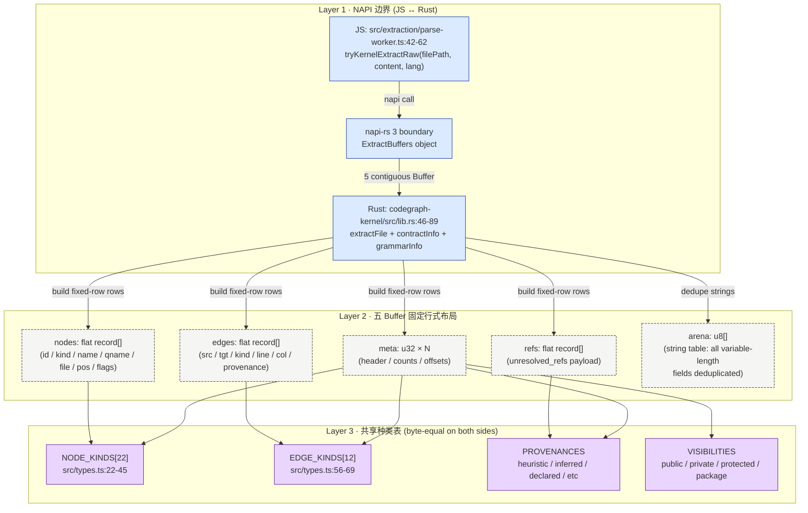

# 第 12 章 · Rust 内核与 tree-sitter NAPI 桥接

> **面向读者**:架构师 / 开发者 · **预计阅读**:30 分钟
> **前置依赖**:{{chapter:11}}
> **本章目标**:讲清 codegraph 为什么需要 Rust 内核、buffer contract 是什么、kernel 如何挂载、ABI 校验失败时如何无感回退 wasm

## 12.1 引言

codegraph 管线分两段:tree-sitter 解析 + 提取器产出节点边。Ch11 讲过第二段 Schema,那第一段为何非要写 Rust 内核?dubbo 仓库 4,402 个 Java 文件全新索引,parse-loop 4.7s,绝大多数时间花在 web-tree-sitter 的 JS↔WASM 边界跨越(`docs/design/native-extraction-kernel.md`)。最小实验:把这部分移到 Rust 侧,wall 从 4.7s 降到 202ms(7 个 wasm worker 仍并行)——这是再没有别处能挤的最后一个结构性加速杠杆。本章回答:为何选 Rust?`codegraph-kernel` 暴露了什么?`ExtractBuffers` 五字节数组的 wire 格式是什么?陈旧 `.node` 不匹配时加载器如何自动回退 wasm?

## 12.2 概念铺垫

**NAPI / napi-rs / cdylib**。Node-API 是 Node 跨主版本稳定的 C ABI;napi-rs 是 Rust 薄封装;`crate-type = ["cdylib"]`(`Cargo.toml:9-10`)产出 `.node` 原生 addon。每个 `napi` 函数是一次边界跨越——但跟 web-tree-sitter 不同,跨越发生在**文件级**而非节点级。

**Buffer contract**。跨 NAPI 边界最便宜的数据是 `Buffer`(零拷贝)。`ExtractBuffers`(`lib.rs:46-53`)直接送五个固定宽度字节数组:`meta / nodes / edges / refs / arena`,典型 OLAP 列存思路。

**tree-sitter vs wasm**。wasm 优势是零依赖、跨平台;代价是每次 `.kind / .childForFieldName / .text` 都跨一次边界,一次解析有数十万节点。native 把 walk 留在同进程同线程,只在文件出口送字节数组。两者共享同一 tree-sitter C 库(内核 0.25,与 wasm 必须 revision-matched)。

**ABI 稳定性**。`KERNEL_ABI_VERSION = 2`(`buffers.rs:71` / `layout.ts:20`)是 wire 版本号。任何 layout 改动必须同步 bump 两边。陈旧 `.node` 不是错是历史;加载器(`loader.ts:124-137`)加载时跑 ABI 校验,不通过当 null,后续全走 wasm——用户即使没重装 `.node`,索引仍能完成,只是回到 wasm 速度。

## 12.3 正文

### 12.3.1 为什么选 Rust

四条线同时指向 Rust。**零成本抽象**:`TreeCursor` walk 在 C/Rust 都是指针自增;JS 必须每次跨 wasm。**ABI 控制力**:`cdylib` + `napi-rs` 给一个可跨 Node 主版本的 `.node`,Go cgo / C++ 头依赖更难。**生态**:tree-sitter 官方绑定 Rust-first,21 个语法 crate 现成;其中几个(`lua / scala` 等)crates.io 上无可用版本,改为 vendored C + `build.rs`(`build.rs:1-87`);其余如 `kotlin` 等用 registry `=x.y.z` 精确 pin,以与 wasm 侧 revision 字节级匹配。**错误恢复**:`Error::from_reason` 把语法错误以 `napi::Error` 抛回 JS,观感与 wasm 一致。非目标明确"不搬 resolution / synthesis"——后者有 2,444 测试的字节级确定性护城河。

### 12.3.2 crate 结构

`Cargo.toml` 注释标出**两个不能轻易改的版本边界**:21 个语法 crate 必须跟 wasm 侧 revision-matched(`Cargo.toml:23-27`);其中六个用 `=x.y.z` 精确 pin(`Cargo.toml:31-59`),因为它们的 vendored wasm 是从这些 tag 的 `parser.c / scanner.c` 字节级拷贝——patch bump 而不重 vendor 会让 sha 对不上,`kernel-grammar-parity` 测试拒绝合入。这是维护税,换来同种语言的 wasm 与 native 路径**逐节点同语义**。

`build.rs:1-87` 编译四个 vendored C 语法,`scala/parser.c` 35 MB 是 tree-sitter 生态最大语法之一。`profile.release` 打开 `lto = true / codegen-units = 1 / strip = "symbols"`(`Cargo.toml:69-72`)——单 codegen unit 让 LTO 真有效,strip 让 dlopen 后内存下降一个量级。

### 12.3.3 NAPI 暴露面

`lib.rs` 顶部暴露四类对象 + 四个函数:`ExtractBuffers`(`lib.rs:46-53`)五 `Buffer` 字段;`ContractInfo`(`lib.rs:58-66`)做版本与种类表校验;`GrammarInfo`(`lib.rs:71-78`)是逐语法 parity 取样点;`CfnptrFacts + cfnptr_scan_files`(`lib.rs:168-`)是批量 cFnPtr 扫描,TS feature-detect,缺失时保留 JS 路径。核心入口 `extract_file(file_path, content, language)`(`lib.rs:218-`)按 language 分发到 20 个 walker。

⚠ Rust 端**无异步、无内部线程池**;每个 walker 同步返回五 buffer(`lib.rs:9-11`)。已有 `ParseWorkerPool` 已按文件并行,worker 线程自己驱动一次 `extract_file`,**不要在 Rust 侧重建并行**——worker 数 × kernel 内部并行度会爆栈。

### 12.3.4 Buffer contract 字节布局

wire 格式由 `codegraph-kernel/src/buffers.rs` 与 `src/extraction/kernel/layout.ts` **逐字节镜像**,两边文件头都明确"必须 byte-for-byte 一致"。下面这张图把上面的对照表画成三层:上层 NAPI 边界(JS↔Rust),中层五 Buffer 固定行式布局,下层 arena 池与 `NODE_KINDS / EDGE_KINDS / VISIBILITIES / PROVENANCES` 四共享种类表。



| 表 | 行宽 | 关键字段 |
|---|---|---|
| `meta` | 36 B | `version: u8` + 4× `u32` count + `errors: (off,len)` + `durationMs: f64` |
| `nodes` | 96 B | `kind: u8` + `visibility: u8` + `flags: u16` + 4× `u32` 位置 + 9× `(off,len)` 字符串对 |
| `edges` | 44 B | 2× `u32` 索引(NONE 时回退字符串 id) + `kind / provenance: u8` + 行/列 |
| `refs` | 40 B | `fromIdx: u32` + `kind: u8`(200=`function_ref`) + `flags: u8` + 3× 字符串对 |
| `arena` | 变长 | UTF-8 字节流,字符串以 `(off,len)` 引用,`NONE=0xFFFFFFFF` 表示缺省 |

关键不变量:**多字节数值一律 little-endian**;`kind` 是种类表索引(数组顺序成契约,append-only);`flags: u16` 存 4 对布尔位 `(present, value)` 依次 `isExported / isAsync / isStatic / isAbstract`;`extraJson` 是 escape hatch,Rust 想塞进 `Node` 但 buffer 没列的字段打包成 JSON 写这里。

### 12.3.5 加载、校验、回退流程

加载器 `src/extraction/kernel/loader.ts` 状态机是:尝试 → 失败 → null。**任何失败都静默回退**,只有 `CODEGRAPH_KERNEL_DEBUG=1` 才把原因打 stderr。

候选路径三条,顺序尝试(`loader.ts:103-118`):`CODEGRAPH_KERNEL_PATH` 环境变量 → `<packageRoot>/kernel/codegraph-kernel.node`(发布包)→ `<packageRoot>/codegraph-kernel/prebuilds/<plat>-<arch>/codegraph-kernel.node`(从源码跑)。每条先 `fs.existsSync`,再用 `createRequire(__filename)` 跨 CJS/ESM 加载。成功后**不立刻信任**,跑 `verifyContract(mod, from)`(`loader.ts:124-137`):

```ts
function verifyContract(mod, from) {
  const info = mod.contractInfo();
  if (info.abiVersion !== KERNEL_ABI_VERSION) return false;       // 闸门 1
  const sameTable = (a, b) => a.length === b.length && a.every((v, i) => v === b[i]);
  if (!sameTable(info.nodeKinds, NODE_KINDS) ||
      !sameTable(info.edgeKinds, EDGE_KINDS)) return false;       // 闸门 2
  return true;
}
```

任一关不过,该候选跳过继续下一条;**所有候选都不通过则 `cached = null`**,`kernelSupports(lang)` 永远返回 false,提取路径自动用 wasm,`verifyContract` 不抛异常。`kernelSupports(language)`(`loader.ts:169-173`)**每次调用都重新检查 kill switch**——测试可在子进程临时设 `CODEGRAPH_KERNEL=0` 强制走 wasm 而无需重置缓存;配合 `resetKernelForTests()`(`loader.ts:176-179`)清掉 `cached` 让环境变更生效。

### 12.3.6 调用粒度与并行模型

调用粒度**每文件一次**:`parse-worker.ts:19` 的 `tryKernelExtractRaw` 引用和 `:101-113` 的 raw buffer 透传可见——buffer 跨 worker→main 是平拷贝,不解码;只有带 `extract()` hook 的 framework 才走 decoded 路径(`parse-worker.ts:93-99`)。并行模型延续 `ParseWorkerPool`:worker 数 = Node 默认 CPU 数,每个 worker 调一次 `extract_file`(`tree-sitter.ts:6715-6722` 是触发点),**Rust 内部不开线程**。这与 dubbo spike 结论吻合:单条 native 线程已比 7-worker wasm 池快 4.4×,再叠加内部并行会让 cache locality 退化。

跟 Claude Code 的连接:任何 `codegraph_explore` 调用——例如 `codegraph explore codegraph-cli --max-depth 4`——返回的图谱来自本次索引产物;若 `codegraph init` 走的是 kernel 路径,图谱就是 Rust 提取的。语义对调用方透明,但它是 kernel 性能优势的实际消费者。

## 12.4 真实场景实战

### 场景 12.1: 编译 kernel

**目标**:macOS arm64 上从源码编译 `codegraph-kernel`,产出 staged `.node`。

**环境**:macOS Darwin 24.6.0 / Rust `stable-aarch64-apple-darwin`(rustup 已装,未在 PATH) / codegraph 1.5.0 / node v24.14.1。

```bash
export PATH="$HOME/.cargo/bin:$PATH"     # rustup 默认 ~/.cargo/bin,scripts 不 source rc
cd ~/new/codegraph && npm run build:kernel
ls -lh codegraph-kernel/prebuilds/darwin-arm64/codegraph-kernel.node
```

**验证**:cargo 不在 PATH 时 `build-kernel.sh:67` 报 `cargo: command not found`(已踩);clean build 耗时 **4 分 52 秒**,主要时间在 scala parser.c 35 MB 编译;产物 **34 MB**。clang 警告 `-u tf-8`(MSVC `-utf-8` 在 Apple clang 被拆字符)是预期噪声。脚本无 `set -x`,中间 cargo 输出被透传,调试时只能手动 `cargo build --release` 重跑。

### 场景 12.2: 验证 ABI contract

**目标**:不写 Rust 代码,直接验证 `.node` 模块能加载、`contractInfo()` 与预期 layout 一致。

```bash
cd ~/new/codegraph
node -e "console.log(Object.keys(require('./codegraph-kernel/prebuilds/darwin-arm64/codegraph-kernel.node')))"
# 期望: contractInfo / grammarInfo / cfnptrScanFiles / cfnptrStripC / extractFile

node -e "
  const m = require('./codegraph-kernel/prebuilds/darwin-arm64/codegraph-kernel.node');
  const c = m.contractInfo();
  console.log(c.abiVersion, c.kernelVersion, c.languages.length, c.nodeKinds.length, c.edgeKinds.length);
"
# 期望: 2 0.1.0 20 22 12
```

**验证**:实测 `abiVersion: 2 / kernelVersion: 0.1.0 / languages: 20 / node_kinds: 22 / edge_kinds: 12`,与 `buffers.rs:99-122` 完全一致。再通过 `m.grammarInfo('typescript')` 拿每语法的 `abi_version / node_kind_count / field_count`,这是 `kernel-grammar-parity` 测试断言的逐语法数据点。

### 场景 12.3: 强制 wasm fallback

**目标**:证明 verifyContract 拒绝 `.node` 时,索引仍能完成,只是走 wasm 路径。

```bash
cp ~/new/codegraph/dist/extraction/kernel/loader.js{,.bak}

python3 -c "
p = '/Users/digoal/new/codegraph/dist/extraction/kernel/loader.js'
s = open(p).read().replace(
  'info.abiVersion !== layout_1.KERNEL_ABI_VERSION',
  'true || info.abiVersion !== layout_1.KERNEL_ABI_VERSION')
open(p,'w').write(s)
"

mkdir -p /tmp/cg-fallback && cd /tmp/cg-fallback
cat > hello.ts <<'EOF'
export function greet(name: string): string { return `Hello, ${name}`; }
class User { constructor(public name: string) {} }
EOF
echo '{ "include": ["*.ts"] }' > codegraph.json

cd ~/new/codegraph
CODEGRAPH_KERNEL_DEBUG=1 node dist/bin/codegraph.js init /tmp/cg-fallback
```

**预期**(实测):
```
[codegraph-kernel] .../codegraph-kernel.node: ABI 2 != expected 2 — ignoring kernel
◆ Indexed 1 files
●  4 nodes, 3 edges in 114ms
```

未 patch 的 loader 应看到 `loaded .../codegraph-kernel.node (languages: typescript, tsx, ...)`。**清理必须**:`mv .../loader.js.bak .../loader.js`。patch 在 `dist/` 上做;一旦重跑 `npm run build`,tsc 会把 `loader.ts` 重编译覆盖——好事,但意味着 patch 只能"临时现场验证"。

## 12.5 本章小结

- Rust 内核只替代 wasm 的 parse+extract,resolution / synthesis / framework / MCP 一概不碰,保持字节级确定性护城河。
- NAPI + napi-rs + cdylib 以"每文件一次边界跨越"换掉 web-tree-sitter 的"每节点一次"。
- `ExtractBuffers` 五 buffer + arena 是 wire format 核心;`KERNEL_ABI_VERSION` 与 `NODE_KINDS / EDGE_KINDS` 索引顺序是契约,只能追加。
- 加载器三层防御:`fs.existsSync` → `require` → `verifyContract`,任一失败静默回退 wasm,不抛异常、不影响索引可用性。
- Rust 端不开线程,继续复用 `ParseWorkerPool` 的 per-file 并行——kernel 内部并行跟 cache locality 在 4,402 文件规模下是负收益。

## 12.6 常见踩坑

1. **`cargo not found`** — rustup 默认装 `~/.cargo/bin`,`npm run build:kernel` 不 source shell rc。
2. **`-u tf-8` 警告** — `build.rs:20` 给 MSVC 的 `-utf-8` 在 Apple clang 被拆字符,警告但不影响产物。**不要**删 `flag_if_supported`。
3. **scala parser.c 编译慢** — 35 MB 单文件,clean build 单独这一步 >1 分钟。
4. **dist/loader.js patch 后忘还原** — `npm run build` 冲掉;`git status dist/` 是最快恢复检查。
5. **grammar version drift** — kernel bump 某语法而 wasm 没动,`kernel-grammar-parity` CI 红;**必须同步**(`Cargo.toml:21-22`)。
6. **`CODEGRAPH_KERNEL=0` 不生效** — 必须在每个 worker 子进程都读到;embedder 启动后清环境会丢。
7. **wasm 路径 `Aborted(` 噪声** — `parse-worker.ts:42-62` 已过滤 Emscripten stderr;日志里冒出说明你跑的是 wasm。

## 12.7 下一章预告

buffer 跨过边界、解码完成 `ExtractionResult` 后,下一步是把它们组装成"调用者看到的知识图谱":ref 解析、imports 折叠、framework hook 合并,以及把最终 nodes/edges 落到 SQLite。这就是 {{chapter:13}} Context 组装管线。

## 12.8 参考

- `codegraph-kernel/Cargo.toml` — 依赖树、版本 pin、release profile
- `codegraph-kernel/src/lib.rs:46-243` — `ExtractBuffers / ContractInfo / extract_file` 暴露面
- `codegraph-kernel/src/buffers.rs:1-122` — 五 buffer 字节布局
- `codegraph-kernel/build.rs:1-87` — 四个 vendored C 语法
- `src/extraction/kernel/loader.ts:103-179` — 候选路径 + verifyContract + kill switch
- `src/extraction/kernel/layout.ts:1-112` — TS 侧 layout 镜像
- `src/extraction/parse-worker.ts:19, 86-113` — worker 内 raw buffer 透传
- `src/extraction/tree-sitter.ts:6715-6722` — `tryKernelExtract` 触发点
- `docs/design/native-extraction-kernel.md` — spike 与架构决策
- `docs/design/rust-kernel-migration-plan.md` — per-language rollout 计划