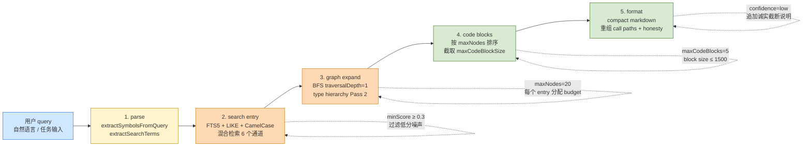

# 第 13 章 · Context 组装管线

> **面向读者**:架构师 · **预计阅读**:25 分钟
> **前置依赖**:{{chapter:11}}
> **本章目标**:理解 explore 一次返回的所有信息如何拼装



## 13.1 引言

`codegraph_explore` 一次调用把源码、调用路径、blast radius、honesty disclaimer 全部塞回上下文——这是**五阶段装配流水线**的产物。本章拆 `src/context/index.ts:216-276` 的 `buildContext()`,逐阶段讲清做了什么、能怎么调参。

## 13.2 概念铺垫

**Token budget**。`DEFAULT_BUILD_OPTIONS`(`src/context/index.ts:143-152`):`maxNodes=20`、`maxCodeBlocks=5`、`maxCodeBlockSize=1500`。三者不是硬上限而是**预算**:20 节点 BFS,挑 5 个高价值节点,每个 ≤1500 字符,合计约 7.5 KB。

**高价值节点过滤**。`HIGH_VALUE_NODE_KINDS`(`src/context/index.ts:159-162`)排除 `import / export`——它们只说"某东西存在",几乎不是 agent 想要的。

**调用路径的诚实截断**。`buildCallPathsSection`(`src/context/index.ts:320-416`)从子图**纯内存**抽 `calls` 边,DFS ≤6 hops,只保留"连通 2+ query 相关 symbol"的链。动态 hop 以 `[callback via registrar @file:line]` 标注,断点显式——agent 用 `codegraph_node` 续桥。

## 13.3 正文

### 13.3.1 五阶段总览

```
parse → search entry → graph expand → code blocks → format
 (query)   (种子节点)      (BFS 邻居)     (挑源码)      (markdown)
```

每阶段都可替换:`findRelevantContext` 返回 `Subgraph`,`extractCodeBlocks` 读源码,`formatContextAsMarkdown` 出字符串。

### 13.3.2 阶段 1:parse

入口是 `buildContext` 的 input——字符串或 `{title, description}`(`src/context/index.ts:223`)。两路并行:`extractSymbolsFromQuery` 抽 camelCase / snake_case;`extractSearchTerms` 分词去停用词。

### 13.3.3 阶段 2:search entry

`findRelevantContext`(`src/context/index.ts:432-960`)跑 6 通道:exact match(共址加权)、definition prefix、FTS5、dominant-dir boost(+25)、CamelCase infix(LIKE 边界)、compound(多词同节点名)。6 通道对同一节点取**最高分**;测试文件 × 0.3;最后 `slice(0, searchLimit)`(默认 3)。seed 很挑。

### 13.3.4 阶段 3:graph expand

从每个 entry BFS,默认 `traversalDepth=1`(浅)。每 entry budget = `ceil(maxNodes / entryPoints.length)`(默认 20/3 ≈ 7)。**按 entry 数等分**是核心:20 总数被分到 7 入口,每个只见 2-3 邻居。`class / interface / struct / trait / protocol` 额外触发 `getTypeHierarchy` 拉 `extends / implements`,上限 `maxNodes / 4`,再跑 Pass 2 把 parent 的 sibling 拉进来。

### 13.3.5 阶段 4:code blocks

`extractCodeBlocks` 读磁盘,按 entry + 高 score 节点顺序,每个 ≤ `maxCodeBlockSize`。**只读一次**——`format` 阶段的 ordering 决定哪些函数进了 LLM context。

### 13.3.6 阶段 5:format

`formatContextAsMarkdown`(`src/context/formatter.ts:18-90`)输出三段:Entry Points(generated 排末位)、Related Symbols(≤10,按 file 分组)、Code(#### `<name> <file:line>`)。重排序用 `isGeneratedFile`(`*.pb.go / *.pulsar.go / mocks`),protobuf 桩排后,agent 不被吸走。还拼接 `buildCallPathsSection`+ `buildLowConfidenceNote`(仅 `confidence === 'low'` 时)。

### 13.3.7 低置信度提示

`LOW_CONFIDENCE_MARKER`(`src/context/markers.ts`)是 Unicode sentinel,Agent 看到即明白"以下不确定"。文案三件事:entry 可能离题、用精确符号名再 explore、给出"确实命中的目录"`codegraph_files` 作起点。**主动认错**比"撒一张看似齐全的列表"更省 token。

## 13.4 真实场景实战

### 场景 13.1:跑 explore 看 blocks

`/Users/digoal/new/codegraph/src/` 已索引。对 `"context build pipeline"` 跑 `codegraph explore`(默认):`Found 53 symbols across 3 files`,3 个 code blocks,chars=12 771。块数 3(< `maxCodeBlocks=5`),主体是 `context/index.ts:164-1100` 逐字源码。印证 1) **BFS 子图 53 节点**(20×3 entry 预算分配);2) **块大小没顶到 1500**(空行/注释拉低密度)。

### 场景 13.2:`--max-files 2` 与 `minScore`

同 query 加 `--max-files 2`:blocks=2 chars=8 892(−30%),文件 3→2。`--max-files` 是 MCP 层在 format **之后**做的"保留前 N 个文件的源码"后处理;**不影响 BFS,只影响 code block 选择**。`minScore=0.3` 过滤非 import 噪声,`"the"` 等停用词 query 返回空 context。

## 13.5 本章小结

`codegraph_explore` 是端到端的图查询装配,**不是搜索**。五阶段都有显式 budget 与诚实截断:`maxNodes=20` 限 BFS,`maxCodeBlocks=5` 限源码密度,`LOW_CONFIDENCE_MARKER` 防误信。理解后你能从 query 一路追到 markdown 字符数。

## 13.6 常见踩坑

- **索引过期 stale blocks**:watcher 停或 degraded 时 banner 标 `⚠️ index may be stale`,但 LLM 不会自动重读——prompt 里要显式 `Read`(Ch08)。
- **maxNodes 太低丢调用链**:默认 20 在大型 monorepo 不够;把 `maxNodes` 提到 50+,**token 同步涨**。
- **formatter 过宽**:>30 KB 时 LLM 注意力下降;调 `format: 'json'` 自行挑字段。
- **entry 命中 `import / export`**:改写 query 为更具体的 camelCase。

## 13.7 下一章预告

{{chapter:14}} 会讲 Direct / Proxy / Daemon 模式下如何序列化、watchdog 触发时如何优雅失败。

## 13.8 参考

- `src/context/index.ts:143-318`——五阶段装配主体
- `src/context/formatter.ts:18-90`——compact markdown
- `src/context/markers.ts`——`LOW_CONFIDENCE_MARKER`
- {{chapter:11}}——节点 / 边 / FTS5