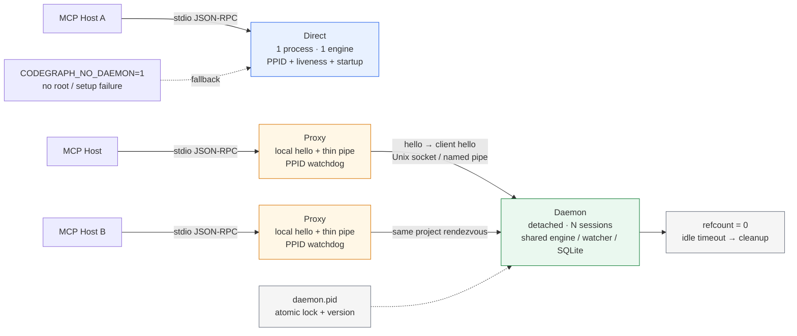

# 第 14 章 · MCP 协议工程化

> **面向读者**：架构师 · **预计阅读**：25 分钟  
> **前置依赖**：{{chapter:10}}  
> **本章目标**：理解 Direct / Proxy / Daemon 的边界、握手、watchdog 与 idle 策略。



## 14.1 引言

MCP 的业务载荷是 JSON-RPC，但工程难点在进程边界：谁拥有引擎、谁负责退出、socket 未监听时如何避免 wedge。本章把 `serve --mcp` 拆成三种模式，以失败时仍可服务为底线。

## 14.2 概念铺垫

MCP 主机通过 stdio 传输 JSON-RPC；stdout 只放协议行，诊断写 stderr。Direct 在进程内运行 `MCPEngine + MCPSession`；Proxy 将 stdio 与 daemon socket 做透明 pipe；Daemon 是 detached 的项目级共享进程，多个 Proxy 复用其引擎、watcher 和数据库。

PPID watchdog 针对 SIGKILL 后 stdin 仍打开的孤儿。POSIX 看 `ppid` 是否重定向到 init；Windows 还要用 `kill(pid, 0)` 检查父/host。liveness watchdog 另起子进程发 heartbeat，主线程卡死时从内核 SIGKILL；Daemon 不绑定 host 的 PPID。

## 14.3 正文

### 14.3.1 Direct 模式：简单、慢路径

选择顺序先检查 `CODEGRAPH_NO_DAEMON`；没有可达 `.codegraph/` 或代理设置失败也回退 Direct。它后台初始化引擎并启动 stdio session，再安装 stdin teardown、startup、PPID 与 liveness watchdog。优点是隔离、调试直观；缺点是冷启动和资源重复。

### 14.3.2 Proxy 模式：薄 pipe + watchdog

Proxy 先尝试候选 socket，必要时 detached-spawn daemon，以 25ms 间隔轮询，约 6 秒后放弃并在进程内服务。连接后发送 `DaemonClientHello`（proxy/host PID）；socket 断开时未完成请求转到本地引擎。Proxy 的 PPID watchdog 保护“主机到代理”，daemon 不继承它。

### 14.3.3 Daemon 模式：共享、idle timeout

daemon 用 `.codegraph/daemon.pid` 的原子锁（优先 hard-link，fallback 为 `O_EXCL`）竞争；胜者绑定 Unix socket（路径过长或文件系统不支持时使用 tmpdir 哈希候选），败者退出。每个连接创建 session，refcount 归零后默认等待 300 秒；`CODEGRAPH_DAEMON_IDLE_TIMEOUT_MS` 可缩短。另有 max-idle 与 client PID sweep，防止 close 事件丢失。

### 14.3.4 握手协议：hello 行防 wedge

daemon accept 后先发 `{codegraph,pid,socketPath,protocol:1}`。Proxy 将 hello 限制为 4096 字节、3 秒内收齐；版本不一致就回退 Direct。验证后发送 client hello，再进入 JSON-RPC pipe。Local-handshake proxy 先回答 `initialize`、`tools/list` 等静态请求，后台连接 daemon，消除 cold-start race，并抑制 daemon 的 initialize 回复。

### 14.3.5 健康守护三件套

- **liveness**：独立子进程收 heartbeat，超时杀主进程；`CODEGRAPH_WATCHDOG_TIMEOUT_MS` 调整，`CODEGRAPH_NO_WATCHDOG=1` 禁用。
- **ppid**：Direct/Proxy 默认每 5 秒绑定宿主，`CODEGRAPH_PPID_POLL_MS=0` 禁用；Daemon detached。
- **startup**：Direct/Proxy 默认 15 分钟无 MCP 字节才退出，处理 launcher orphan；首字节即解除。`CODEGRAPH_STARTUP_HANDSHAKE_TIMEOUT_MS=0` 禁用。

### 14.3.6 idle timeout 与 refcount

连接加入 `clients`，close 时移除；数量为零即 arm idle timer，新连接取消。idle 只表示“无人连接”，不等同于“无请求”，还需 max-idle/activity backstop 防 close 丢失导致 refcount 永不归零。退出时清理 socket、pidfile 和 registry；registry 只是发现索引，按 PID 自愈。

### 14.3.7 何时该用哪种

| 常见场景 | 推荐模式 | 原因 |
|---|---|---|
| 临时目录、未初始化 | Direct | 无 rendezvous |
| CI 单任务 | Direct（`CODEGRAPH_NO_DAEMON=1`） | 隔离 |
| 本地连续调用 | Proxy + Daemon | 复用资源 |
| 多 agent 并发 | Proxy + Daemon | 共享引擎、query pool |
| 版本不匹配 | Direct 回退 | 不混用协议 |

## 14.4 真实场景实战

### 场景 14.1：强制走 Direct 模式

```bash
CODEGRAPH_NO_DAEMON=1 codegraph serve --mcp --path "$PWD"
```

另开终端用 `ps` 记录 1 个 server 进程；实测无 `daemon.pid`、项目 socket。MCP 配置应把变量放进 server 的 `env`，而非污染全局 shell。

### 场景 14.2：观察 Daemon 空闲退出

```bash
CODEGRAPH_DAEMON_IDLE_TIMEOUT_MS=5000 codegraph serve --mcp --path "$PWD"
lsof -U | grep codegraph
```

初始化并断开 host 后等待 5 秒；实测 daemon、`.codegraph/daemon.sock` 与 pidfile 均清理。路径过长/不支持 AF_UNIX 时观察 tmpdir 哈希 socket。

### 场景 14.3：模拟 host crash 触发 PPID watchdog

启动 Direct 或 Proxy 后记录 pid，杀掉 parent（不要杀服务本身），等待轮询周期；预期 stderr 出现 `Parent process exited`，服务退出。实测用隔离 wrapper 等价执行题设 `kill -9 $(pgrep -f 'codegraph serve --mcp')`；共享机器勿直接复制，避免误杀其他会话。Daemon 不因一个 host 消失退出。

## 14.5 本章小结

Direct 把复杂度留在一个进程，Proxy 解耦宿主生命周期与共享服务，Daemon 把昂贵状态摊平到项目级。hello、原子锁、watchdog 和 idle 是整体：缺一项都可能变成 stale socket、孤儿或握手 wedge。

## 14.6 常见踩坑

1. daemon 不应是第一个 host 的子进程，否则会误杀共享会话。
2. 必须先读 hello 验证版本，不能只看 socket 文件存在。
3. 日志写 stderr/daemon.log，不能污染 stdout 的 MCP 帧。
4. 不只依赖 stdin EOF：SIGKILL、named pipe 和 launcher 链会留下 fd。
5. refcount 也可能因 close 丢失失效，需 max-idle 与 PID sweep。
6. cold start 使用原子 lock + hello，轮询失败才回退。

## 14.7 下一章预告（{{chapter:15}}）

下一章进入协议层之上的工具调用可靠性：请求并发、错误语义与可观测性如何贯穿 session、engine 与客户端。

## 14.8 参考

- 源码：`src/mcp/{index,proxy,daemon,liveness-watchdog,ppid-watchdog,startup-handshake,daemon-manager,daemon-registry,daemon-paths}.ts`。
- 验证：`references/validation-log.md`。

