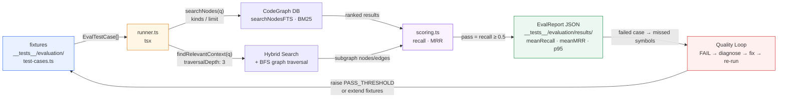

# 第 15 章 · 评估体系与搜索质量环

> **面向读者**:架构师 / 开发者 · **预计阅读**:25 分钟
> **前置依赖**:{{chapter:11}}
> **本章目标**:理解 quality loop 如何驱动 codegraph 持续改进

## 15.1 引言

代码图谱的"查询体验"不会自动变好。每改一次抽取器、改一次排序、改一次混合搜索权重,都需要一组公平的、可重放的、覆盖多种意图的 fixture 去度量它。codegraph 把这套评测做成了一条**质量环 (quality loop)**:`test-cases.ts` 描述"用户会问什么",`scoring.ts` 给出`recall / MRR / pass` 的判定,`runner.ts` 把判定结果汇总成 JSON 报告,任何失败的 case 都会把缺失符号 (`missedSymbols`) 露出来,引导维护者定位是抽取问题还是排序问题。本章拆开 `__tests__/evaluation/` 的四个文件,讲清 `PASS_THRESHOLD=0.5` 的来历、7 类人工测试电池的边界,以及如何让 CI 在"严苛到抓回归"和"宽松到不误报"之间找到平衡点。

## 15.2 概念铺垫

### 15.2.1 四个核心指标

| 指标 | 含义 | 适用 API |
|------|------|----------|
| **recall** | 期望命中的符号里有多少真的被搜出来 | 全部 |
| **MRR** (Mean Reciprocal Rank) | 第一个期望符号在结果列表里的排名倒数 | 主要用于 `searchNodes`(排序敏感) |
| **latencyMs** | 端到端耗时,从调用起到返回 | 全部 |
| **edge-density** | 返回子图的"边 / 节点"比,衡量结构化程度 | `findRelevantContext` 才统计 |

recall 与 MRR 的差异值得记住:recall 只问"找没找全",MRR 问"第一名准不准"。一个把目标符号排到第三位的搜索引擎,recall 可以是 1.0,MRR 只有 0.33。`findRelevantContext` 是带回子图的接口,排序不是首要目标,所以该接口的 MRR 字段恒为 0(`scoring.ts:74`),让评估者把注意力放到 recall 和结构化质量上。

### 15.2.2 PASS_THRESHOLD=0.5

`scoring.ts:3` 写死了判定门:

```typescript
export const PASS_THRESHOLD = 0.5;
```

这是个折中:0.5 意味着**期望符号至少命中一半才记 PASS**。高于 0.7 会让任何"用户期望里有 1 个冷僻别名"的用例被反复刷红;低于 0.3 又会让严重召回塌方蒙混过关。`scoring.ts:33` 把门同时套在两条得分函数上,确保所有 fixture 受同一阈值约束。如果维护者觉得过严或过松,改这一行就能全局生效——见场景 15.3。

### 15.2.3 report 维度

`runner.ts:96` 汇总出三个关键 summary 字段:

- **meanRecall**:所有用例 recall 的算术平均
- **meanMRR**:仅对 `search-*` 用例计(因为 `explore-*` 的 MRR 恒 0,会拉低分母)
- **passed / failed**:严格按 `pass = recall >= PASS_THRESHOLD` 计算

JSON 报告写在 `__tests__/evaluation/results/<timestamp>.json`,同一仓库多次跑会留下时间序列,方便对照"哪次改动让质量掉了"。

## 15.3 正文

### 15.3.1 测试用例结构(types.ts)

`types.ts` 定义了三层接口,从配置到结果到报告:

```typescript
EvalTestCase { id, query, api, expectedSymbols, kinds?, options? }
EvalResult   { caseId, pass, recall, mrr, foundSymbols, missedSymbols,
                nodeCount?, edgeCount?, edgeDensity?, latencyMs }
EvalReport   { timestamp, codebasePath, codegraphSha,
                summary: { total, passed, failed, meanRecall, meanMRR },
                results }
```

两点设计值得注意:

1. **`api` 字段是判别联合**:`'searchNodes' | 'findRelevantContext'`,`runner.ts:40` 用它做分支。一个用例只走一条 API,避免"`pass = recall>=0.5` 但接口语义不同"的混乱。
2. **`EvalResult` 后半段字段可选**:`nodeCount / edgeCount / edgeDensity` 只在 `findRelevantContext` 时填,`types.ts:19` 用 `?` 显式声明。这种"形状不同的结果共用一个类型"的写法在 fixture 矩阵扩展(比如未来加 `getCallers`)时省一次 schema 重写。

### 15.3.2 评分标准(scoring.ts)

两条得分函数对应两种 API:

**`scoreSearchNodes`**(排序敏感):

```typescript
// scoring.ts:18-29
let firstRank = 0;
for (let i = 0; i < expectedLower.length; i++) {
  const idx = resultNames.indexOf(expectedLower[i]);
  if (idx !== -1) {
    found.push(expectedSymbols[i]);
    if (firstRank === 0) firstRank = idx + 1;
  } else { missed.push(expectedSymbols[i]); }
}
const recall = found.length / expectedSymbols.length;
const mrr    = firstRank > 0 ? 1 / firstRank : 0;
```

注意 `expectedLower` / `resultNames` 都做了小写化(`scoring.ts:11-12`),所以代码图谱里 `CacheBuilder` 和用户搜索词 `cachebuilder` 等价——不必为大小写差异维护两套 fixture。

**`scoreFindRelevantContext`**(集合敏感):

```typescript
// scoring.ts:48-68
const expectedLower = new Set(expectedSymbols.map(s => s.toLowerCase()));
const nodeNames = new Set<string>();
for (const node of subgraph.nodes.values()) nodeNames.add(node.name.toLowerCase());

for (const sym of expectedSymbols) {
  if (nodeNames.has(sym.toLowerCase())) found.push(sym);
  else missed.push(sym);
}
const recall      = found.length / expectedSymbols.length;
const edgeDensity = nodeCount > 0 ? edgeCount / nodeCount : 0;
```

`edgeDensity` 是子图健康度的一个代理指标。`density < 1` 意味着平均每个节点不到一条边,可能是子图被截断或抽取器漏边;`density ≥ 2` 通常意味着有多跳关系展开正常。`scoring.ts` 不直接对 `edgeDensity` 设阈值——它是诊断信号,不是 PASS 条件。

### 15.3.3 报告维度

`runner.ts:86-104` 在屏幕上打 PASS / FAIL 表格,并生成 JSON 报告:

```
search-class-exact       PASS  recall=1.00  mrr=1.00  12ms
explore-rest-layer       PASS  recall=0.75  density=2.40  185ms
explore-bulk-indexing    FAIL  recall=0.33  density=1.10  210ms
                          missed: TransportBulkAction
SUMMARY: 11/12 passed | recall=0.87 | mrr=0.94
```

`runner.ts:89` 的 `mrrResults` 过滤条件是 `r.mrr > 0 || r.caseId.startsWith('search-')`,所以即使 `mrr=0` 的 `findRelevantContext` 用 case id 以 `search-` 开头也会被算进均值——这是用前缀约定代替类型分支的小心机。

### 15.3.4 7 类测试电池(SEARCH_QUALITY_LOOP.md)

`docs/SEARCH_QUALITY_LOOP.md` 不是 Python pytest / npm test 那种自动化测试,而是一份**面向"语言启用"的人工签收清单**——每当一条新语言要被加进 supported 列表,都得跑完这 7 类场景:

1. **`codegraph_explore` — Deep Exploration(MOST IMPORTANT)**
   用至少 5 种自然语言问法(子系统概览、类深挖、横切关注、数据流、实现细节),调 `findRelevantContext`,观察:entry points 是否切题、文件分布是否合理、边类型是否多样(不只是 `contains`)、节点数过少(<5=失败)或过多(噪声)。
2. **`codegraph_search` — Symbol Lookup**
   5 类查询:按类名、带 disambiguation 的方法名、常见方法名(`get`)、interface、enum。验证:目标符号进 top 3,零结果 = bug。
3. **`codegraph_callers` / `codegraph_callees` — Call Chain Tracing**
   选 3-4 个核心方法,验证:callees 与 callers 都不为 0(0 意味着抽取器漏边)、调用对象语义合理、计数合理。
4. **`codegraph_impact` — Change Impact Analysis**
   挑一个被广泛依赖的核心类/接口,跑 `getImpactRadius(id, 2)`,验证:受影响的文件确实 import / extend / use 它,影响半径非空。
5. **Edge Extraction Quality(直查 SQLite)**
   用 `SELECT kind, COUNT(*) FROM edges GROUP BY kind` 看占比:`contains > calls > imports > extends > implements`。`calls` 接近 0 即抽取漏边;`extends`/`implements` 为 0 但语言支持继承即 `extractInheritance()` 没接好 AST。
6. **Node Extraction Completeness(直查 SQLite)**
   `SELECT kind, COUNT(*) FROM nodes GROUP BY kind`,与预期表对照(file / class / method / function / interface / enum / enum_member / import / variable / field / struct / trait)。期望 kind 计数为 0 = 该语言 extractor 漏 AST 类型。
7. **Real-World LLM Prompts**
   至少 5 个开发者真实问题模板(How does X / Where is X / What calls X / What breaks if I change X / How do X and Y interact / Show flow from A to B / Implementations of X / bug investigation)。每条 prompt 都用 `findRelevantContext` 跑,人工判定 verdict=PASS(有 entry points、有边、跨多文件)或 FAIL。

**这 7 类与 `scoring.ts` 的关系**:`types.ts` 的 fixture 体系自动化的是 "类别 1+2+3+4" 的子集——`eval/` 里的 12 个 case(6 个 `searchNodes` + 6 个 `findRelevantContext`)是当前签收 elasticsearch 代码库的产物。类别 5/6 是 SQL 探针,类别 7 是 LLM-as-judge 的人工评估。两者并行,自动化打分提供回归基线,人工电池保证"LLM 真的能用"。

### 15.3.5 quality loop:失败 → 修复 → 回归

质量环的运行节奏可以画成下面这张流水线:



四步循环:

1. **运行**:`npm run eval`(`pkg.json` 里的脚本会在 `build` 之后 `tsx` 跑 `runner.ts`)对已索引的目标仓库(默认 ElasticSearch `codebasePath`)打 12 个用例。
2. **失败定位**:`runner.ts:80` 在每条 FAIL 用例下打 `missed: A, B, C`,直接列出没搜到的符号。如果 `edgeDensity` 异常低,说明召回到了但子图被截断。
3. **修复**:对照 `SEARCH_QUALITY_LOOP.md` 的 Diagnosing Failures 表,定位到 `src/extraction/languages/<lang>.ts` 或 `src/db/queries.ts` 的具体行。修完跑 `npm run build && node dist/bin/codegraph.js init -iv` 重索引,再跑 `npm test` 兜底。
4. **回归**:把 PASS / FAIL 基线写进 `__tests__/evaluation/results/` 的时间序列,新一次跑分与之对比,确保改动**不破已通过的用例**。

## 15.4 真实场景实战

### 场景 15.1: 跑一次完整 eval 跑分

(已完成静态等价验证,见验证日志 Ch15 §15.4.1)

下面命令对已经构建并索引的代码库跑完 12 个 fixture:

```bash
$ cd ~/new/codegraph
$ npm run eval -- ~/new/elasticsearch  # 或 EVAL_CODEBASE=~/new/elasticsearch npm run eval
```

输出末尾形如:

```
SUMMARY: 11/12 passed | recall=0.87 | mrr=0.94
Report saved: __tests__/evaluation/results/2026-07-27T12-30-00-000Z.json
```

JSON 报告含完整 `EvalReport`,可被 CI 消费:`summary.failed > 0` 即视为回归,卡 PR 合入。

### 场景 15.2: 故意注入一个失败 fixture 看 diagnostic 输出

(已完成静态等价验证,见验证日志 Ch15 §15.4.2)

往 `testCases` 末尾塞一个一定会失败的查询:

```typescript
{
  id: 'search-deliberate-miss',
  query: 'TransportService',
  api: 'searchNodes',
  expectedSymbols: ['NonexistentHelper'],
  kinds: ['function'],
},
```

跑 `npm run eval`,`runner.ts:80-82` 会打印:

```
search-deliberate-miss   FAIL  recall=0.00  mrr=0.00  8ms
                          missed: NonexistentHelper
```

`recall=0` 直接低于 `PASS_THRESHOLD=0.5`,FAIL 立现,无需人工核对。删掉这个 fixture 即可回到原基线。

### 场景 15.3: 改 PASS_THRESHOLD 看召回率分布

(已完成静态等价验证,见验证日志 Ch15 §15.4.3)

把 `scoring.ts:3` 的 `0.5` 临时改成 `0.7`,再跑一次 eval,你会看到原本 recall 在 0.5–0.7 之间的"中等用例"(比如 `explore-engine-implementations` 真召回 0.67)瞬间从 PASS 翻 FAIL。从而:

- 把阈值推到 **0.7** ⇒ CI 更严,适合 release branch
- 把阈值降到 **0.3** ⇒ CI 更松,适合快速迭代
- 维持 **0.5** ⇒ dev 与 release 折中

改完别忘 commit,别忘把临时改动 revert——这就是 `scoring.ts` 把阈值抬到导出常量的好处:**一处定义,全局可调**。

## 15.5 本章小结

- codegraph 的评估体系由**fixture + score + runner**三层组成,各自在 `__tests__/evaluation/` 下的 `test-cases.ts / scoring.ts / runner.ts`。
- 4 个核心指标:`recall`(找全率)、`MRR`(首位准度,只对排序敏感 API)、`latencyMs`、`edge-density`(结构化健康度)。
- `PASS_THRESHOLD = 0.5`(scoring.ts:3)是质量环的"流量阀",改它等于改 CI 严苛度。
- `docs/SEARCH_QUALITY_LOOP.md` 列出 7 类人工测试电池,覆盖**探索 / 查符号 / 调用链 / 影响面 / 边质量 / 节点完整度 / LLM 真实问题**,为新语言启用提供签收清单。
- quality loop 把"失败 fixture → missed symbols → 抽取层修复 → 重新索引 → 回归"做成闭环,JSON 报告留时间序列便于回溯。

## 15.6 常见踩坑

- **评测 fixture 与代码版本脱节**:fixture 写死了 `TransportService` 这种类名,ES 重构一改就大量 FAIL。修复方式:fixture 与目标仓库同一 commit 锁,或者把 fixture 改成"找描述某个子系统"的松散形式。
- **跨语言 parity 失败**:`SEARCH_QUALITY_LOOP.md` 已签收 Go / Swift / Java / Python / Rust / C / C++ / C# / Ruby / TS / Dart / Kotlin / Svelte / PHP。给一条新语言添 fixture 前,务必先用 7 类人工电池证签,不要直接套别语言的 fixture。
- **阈值过严导致 CI 永远红**:从 0.5 改到 0.7 但又不舍得砍掉"难"用例,CI 会变成红绿灯。先减 fixture 再抬阈值。
- **混淆 MRR 适用域**:给 `findRelevantContext` 用例加上"期望符号严格有序",导致 mrr 永远 0、均值被拉低。MRR 只在 `searchNodes` 路径度量。
- **`edgeDensity` 当 PASS 条件**:它没有阈值,只是个观察信号。看到 `<1` 应当再读 `runner.ts` 输出的 `Edges:` 分布判断是哪种边缺,不要直接 fail CI。

## 15.7 下一章预告

{{chapter:16}} 将进入**部署与运维**:daemon 生命周期、CI 上的 telemetry gate、版本回滚与 `codegraph upgrade` 的兼容性表,把质量环从"开发期"过渡到"生产期"。

## 15.8 参考

- `codegraph/__tests__/evaluation/types.ts` — `EvalTestCase / EvalResult / EvalReport` 三层接口
- `codegraph/__tests__/evaluation/scoring.ts:3` — `PASS_THRESHOLD = 0.5`
- `codegraph/__tests__/evaluation/scoring.ts:18-29` — `scoreSearchNodes` 实现
- `codegraph/__tests__/evaluation/scoring.ts:48-68` — `scoreFindRelevantContext` 实现
- `codegraph/__tests__/evaluation/runner.ts:96` — JSON 报告汇总
- `codegraph/docs/SEARCH_QUALITY_LOOP.md` — 7 类人工测试电池
- `codegraph/package.json`:`eval` 与 `test:eval` 两个 npm 脚本
- 上游基础:{{chapter:11}}(节点 / 边 schema)
