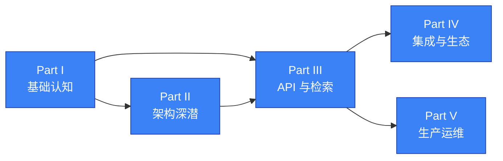

# 章节计划与学习路径

> 本文件是《Cognee 记忆工程》的"宏观地图"。
> 详细章节内容见 [./chapters/](./chapters/) 各章文件,术语见 [./GLOSSARY.md](./GLOSSARY.md)。

---

## 设计目标

本书用 **5 篇 30 章** 体系化讲清 Cognee 开源记忆框架。读者读完应能:

1. **理解定位**:Cognee 在 RAG / Memory / Agent 生态中的独特价值,与 Mem0 / Zep / Letta / Graphiti 的边界。
2. **跑通三栈**:本地 / Docker / Cloud 三种部署,SDK / CLI / MCP 三种调用方式都能跑。
3. **看懂四层记忆**:短期会话 / 长期语义 / 程序性 Skill / 巩固 memify 的内部实现。
4. **选型四件事**:存储后端、LLM provider、SearchType、集成方案。
5. **接入 8 个主流集成**:Claude Code / Claude Agent SDK / Strands / LangGraph / CrewAI / Google ADK / Telegram / Slack。
6. **二次开发**:自定义 Pipeline / Task / Retriever / Graph Model。
7. **生产化**:跑通评测、调优性能、迁移外部数据源、Kubernetes 部署。

---

## 全书结构与依赖

### 逻辑递进

```
背景认知 → 架构深潜 → API/检索 → 集成生态 → 生产运维
   Part I      Part II    Part III   Part IV      Part V
   Ch01-05    Ch06-12    Ch13-18    Ch19-23      Ch24-30
```

### 依赖图



### 各篇定位

| 篇 | 名称 | 章数 | 重点读者 | 核心目标 |
|---|---|---|---|---|
| Part I | 基础认知 | 5 | 入门用户 | 建立"为什么需要"的心智模型 |
| Part II | 架构深潜 | 7 | 架构师 / 高级开发者 | 读懂源码地图、模块边界、内部数据流 |
| Part III | API 与检索 | 6 | 应用开发者 | 掌握 v1/v2 双 API、18 种 SearchType |
| Part IV | 集成与生态 | 5 | Claude Code 用户 / Agent 工程师 | 接入 8 主流 + 11 长尾集成 |
| Part V | 实战与运维 | 7 | 工程负责人 / SRE | 评测、调优、迁移、部署、贡献 |

---

## 30 章速览

### Part I · 基础认知

| 章 | 标题 | 一句话 |
|---|---|---|
| Ch01 | 为什么 Agent 需要 Cognee | LLM Agent 长期记忆痛点与 BEAM 评测解读 |
| Ch02 | 安装与五分钟上手 | `pip install cognee` 到第一行代码 |
| Ch03 | Hello World:`add` / `cognify` / `search` 三步走 | 默认 5 步 pipeline 与三段式 retriever |
| Ch04 | 核心概念速览 | ECL、SearchType、Retriever、Skill 全景 |
| Ch05 | 与同类项目对比 | Cognee vs Mem0 / Zep / Graphiti / Letta |

### Part II · 架构深潜

| 章 | 标题 | 一句话 |
|---|---|---|
| Ch06 | 模块总览与代码地图 | `modules/` `infrastructure/` `pipelines/` 三层 |
| Ch07 | 数据模型与实体 | DataPoint / Entity / Edge / KnowledgeGraph |
| Ch08 | 管道引擎 Pipelines | Task / Pipeline / DAG / 并发编排 |
| Ch09 | 检索器三段式 | `get_retrieved_objects` → `get_context` → `get_completion` |
| Ch10 | 存储后端 | SQLite/LanceDB/Ladybug 与 Postgres 全栈 |
| Ch11 | 可观测性与追踪 | OpenTelemetry / Langfuse / Trace |
| Ch12 | 大图治理 | Sync / Migrations / Truth Subspace / Prune |

### Part III · API 与检索

| 章 | 标题 | 一句话 |
|---|---|---|
| Ch13 | v1 底层 API 详解 | `add` `cognify` `search` 全参数 |
| Ch14 | v2 内存 API | `remember` `recall` `improve` `forget` 四步生命周期 |
| Ch15 | SearchType 全景与选型 | 18 种检索类型逐项详解 + 决策树 |
| Ch16 | Memify | `cognee.memify()` 与自适应记忆 |
| Ch17 | 自定义管道与 DAG | `@register_task` 与 DSL |
| Ch18 | Agent Memory | `cognee.agent_memory` 与子代理 |

### Part IV · 集成与生态

| 章 | 标题 | 一句话 |
|---|---|---|
| Ch19 | `cognee-cli` 子命令手册 | 18 个命令与全局开关 |
| Ch20 | Claude Code / Claude Agent SDK 集成 | 主流 2 集成 |
| Ch21 | Strands / LangGraph / CrewAI / Google ADK | 主流 4 框架集成 |
| Ch22 | Telegram / Slack / Web Widget | 主流 3 聊天工具集成 |
| Ch23 | 无代码与 IDE/终端集成 | 长尾 11 集成 |

### Part V · 实战与运维

| 章 | 标题 | 一句话 |
|---|---|---|
| Ch24 | 配置与数据集治理 | `cognee.config` / datasets / agents / 多租户 |
| Ch25 | 数据迁移 | Mem0 / Zep / Graphiti / Letta / COGXArchive |
| Ch26 | 评测 | BEAM 与 `cognee eval` |
| Ch27 | 性能调优与缓存 | Postgres Session Cache / LanceDB 索引 |
| Ch28 | API Server 部署 | FastAPI / 认证 / Docker / K8s |
| Ch29 | 前端 UI | cognee-frontend Next.js 控制台 |
| Ch30 | 贡献指南 | 从 AGENTS.md 到模块扩展 |

---

## 章节依赖矩阵

每章"前置知识"列出的章节是必须先读的。每章"推荐阅读"是顺路读的。

| 章 | 必读前置 | 顺路读 |
|---|---|---|
| Ch01 | — | Ch04, Ch26 |
| Ch02 | — | Ch03, Ch13 |
| Ch03 | Ch02 | Ch04, Ch13 |
| Ch04 | Ch03 | Ch07, Ch15 |
| Ch05 | Ch01 | Ch25 |
| Ch06 | Ch04 | Ch07, Ch08, Ch10 |
| Ch07 | Ch06 | Ch08, Ch16 |
| Ch08 | Ch06 | Ch09, Ch17 |
| Ch09 | Ch04, Ch08 | Ch15 |
| Ch10 | Ch07 | Ch27 |
| Ch11 | Ch08 | Ch26 |
| Ch12 | Ch07 | Ch27 |
| Ch13 | Ch03, Ch04 | Ch14, Ch15 |
| Ch14 | Ch13 | Ch15, Ch25 |
| Ch15 | Ch09 | Ch18 |
| Ch16 | Ch07, Ch14 | — |
| Ch17 | Ch08 | Ch21 |
| Ch18 | Ch14, Ch15 | Ch20 |
| Ch19 | Ch03 | Ch20 |
| Ch20 | Ch14, Ch18 | Ch21 |
| Ch21 | Ch18 | Ch22 |
| Ch22 | Ch19, Ch20 | Ch23 |
| Ch23 | Ch20, Ch21 | — |
| Ch24 | Ch06 | Ch25 |
| Ch25 | Ch05, Ch24 | — |
| Ch26 | Ch01, Ch11 | — |
| Ch27 | Ch10, Ch12 | — |
| Ch28 | Ch24 | Ch29 |
| Ch29 | Ch28 | — |
| Ch30 | Ch06, Ch24 | — |

---

## 推荐学习路径

| 你 | 推荐路径 | 估时 |
|---|---|---|
| **第一次听说 Cognee** | Ch01 → Ch02 → Ch03 → Ch04 | 1.5 小时 |
| **Claude Code 重度用户** | Ch01 → Ch02 → Ch03 → Ch04 → Ch13 → Ch14 → **Ch20** | 4 小时 |
| **Agent 框架开发者** | Ch01 → Ch04 → Ch07 → Ch13 → Ch14 → Ch15 → Ch18 → **Ch21** | 5 小时 |
| **架构师 / SRE** | Ch01 → Ch06 → Ch07 → Ch08 → Ch09 → Ch10 → Ch11 → Ch24 → Ch26 → **Ch27** → **Ch28** | 7 小时 |
| **二次开发者** | Ch01 → Ch04 → Ch07 → Ch08 → Ch09 → Ch15 → Ch16 → **Ch17** → Ch30 | 6 小时 |
| **准备落地生产** | Ch01 → Ch10 → Ch11 → Ch24 → Ch25 → Ch26 → **Ch27** → **Ch28** | 5 小时 |

---

## 配套资源

- **术语表**:[./GLOSSARY.md](./GLOSSARY.md)(约 300 个术语)
- **风格规范**:[./style-guide.md](./style-guide.md)(写作与 mermaid 规范)
- **共享素材包**:[./shared-context/](./shared-context/)(写作子 Agent 用的术语表、代码路径、mermaid 模板)
- **mermaid 配置**:[./templates/mermaid-template.md](./templates/mermaid-template.md)
- **完整目录**:[./SUMMARY.md](./SUMMARY.md)(mdbook / GitBook 兼容)

---

## 版本基线

- cognee:**v1.4.0**
- Python:3.10 – 3.14
- 操作系统:macOS / Linux / Windows(WSL2)
- 输出日期:2026-07-26