# 第 2 章 `Install & Quickstart: 安装与五分钟上手`

> 本章目标:读完本章,你将能够
> - 在 5 分钟内完成 cognee 安装,并跑通 `add → cognify → search` 第一段代码
> - 理解 cognee 默认后端栈(SQLite + LanceDB + Ladybug)的零依赖优势
> - 通过 `LLM_API_KEY` 配置 LLM,并知道默认 LLM 是 `openai/gpt-5-mini`
> - 在三种部署形态(本地 / Docker / Postgres 全栈)之间按场景切换

## 前置知识

- 已读完 [[chapter-01-why-memory|第 1 章 为什么 Agent 需要 Cognee]](./chapter-01-why-memory.md)
- 需要的基础库:`cognee>=1.4.0`、`pydantic>=2.10.5`、`asyncio`、`litellm>=1.83.7`
- 环境:Python **3.10–3.14**(即 `>=3.10, <3.15`,见 `pyproject.toml` 第 10 行)
- 一份可访问的 LLM 凭证(本文示例用 OpenAI)

## 本章导览

- 2.1 Python 版本与系统要求,以及 `pyproject.toml` 的版本声明如何直接控制 cognee 行为
- 2.2 四种安装方式(pip / uv / poetry / Docker)与选型对比
- 2.3 默认后端栈(SQLite + LanceDB + Ladybug)为何能做到零依赖
- 2.4 配置 LLM 与 API Key:`LLM_API_KEY` 与默认模型 `openai/gpt-5-mini`
- 2.5 五行代码跑通 `add → cognify → search`,把握最常用 API
- 2.6 切换到 Docker / Postgres 全栈的全栈路径预告

---

## 2.1 Python 版本与系统要求

cognee 的 Python 版本约束并非随手写下的随机区间,而是直接由上游包的 wheel(预编译包)覆盖范围推导出来的。`<COGNEE_REPO>/pyproject.toml` 第 10 行声明:

```toml
requires-python = ">=3.10,<3.15"
```

这一行只位于 `pyproject.toml` 的 `[project]` 段；文件后面的 `[tool.uv]` 段只有 `constraint-dependencies`，不重复声明 Python 版本。具体的 micro 版本(3.10–3.14)代表了 `requires-python` 允许的范围;3.15 之后不在该项目声明的支持区间内。所以,**请把 Python 锁在 3.10–3.14 区间**。如果你正在用 `pyenv`,推荐 `pyenv install 3.12.x` 起步,因为 3.12 是当前生态最稳定的中间版本。

系统层面,cognee 是纯 Python + 原生扩展包,理论支持 macOS / Linux / Windows。Linux 上一切原生;macOS 上多数原生 wheel 都有内置;Windows 上,`pyproject.toml` 第 56 行通过 `python-magic-bin<0.5` 做了平台判断,只在 Windows 上安装该依赖。

```bash
# 在 3.12 上创建虚拟环境并升级 pip(Windows / macOS / Linux 一致)
python3.12 -m venv .venv
source .venv/bin/activate        # Windows 用 .venv\Scripts\activate
pip install -U pip
```

## 2.2 四种安装方式

不同的人有不同的工具链习惯,cognee 同时提供四种安装路径,它们最终都把同一个 `cognee` 包装到 Python 路径里。差异主要在**包管理器的元数据管理方式**:pip 直接安装解析出的依赖,uv 把锁文件锁在 `uv.lock` 中,poetry 把锁文件锁在 `poetry.lock` 中,Docker 则跳过本地 Python 直接容器化。

| 安装方式 | 一行命令 | 适用场景 | 锁文件 |
|---|---|---|---|
| `pip` | `pip install cognee` | 教学 / 临时脚本 / Jupyter | `requirements.txt` |
| `uv` | `uv add cognee` | 新项目、希望全局 lock | `uv.lock` |
| `poetry` | `poetry add cognee` | 已用 poetry 的项目 | `poetry.lock` |
| Docker | `docker compose up cognee` | 不想装 Python,直接跑服务 | `docker-compose.yml` |

```bash
# 方式 1:pip(最简单)
pip install "cognee>=1.4.0"

# 方式 2:uv(快速且带 lockfile)
uv add "cognee>=1.4.0"

# 方式 3:poetry
poetry add "cognee>=1.4.0"
```

`pyproject.toml` 第 4 行把版本写死为 `1.4.0`(基线日期 2026-07-26),第 22–69 行把这套 cognee 真正强依赖的包一次性列出来,包含 `lancedb>=0.24.3,<1.0.0`、`ladybug>=0.16.0,<=0.18.2`、`aiosqlite`、`tiktoken`、`litellm` 等关键库。**任何一种安装方式都只需一条命令**,你不需要单独装 Ladybug 或 LanceDB,可选依赖(如 Postgres / Kuzu / Ollama / Anthropic 等)在 `[project.optional-dependencies]` 段中,以 `cognee[postgres]` 这种 extra 形式按需启用。

第四种路径走 Docker,跳过 Python 直接把 cognee API 服务跑起来。`<COGNEE_REPO>/docker-compose.yml` 第 1–37 行定义了 `cognee` 主服务,默认监听 `8000` 端口并内置 healthcheck。你只需要:

```bash
# 拉源码、复制 .env、启动
git clone https://github.com/topoteretes/cognee
cd cognee
cp .env.template .env
# 编辑 .env,把 LLM_API_KEY 填入
docker compose up cognee
```

这一刻,容器已经在 `http://localhost:8000/health` 上响应了。Docker 路径特别适合不想污染本机 Python 环境的场景,或团队里希望统一环境的小组。第 2.6 节会展开讲全栈切换。

## 2.3 默认后端栈:零依赖启动

为什么 cognee 能"装上即用、零数据库服务"?秘密在 `pyproject.toml` 第 22–69 行的依赖列表里:**关系库、向量库、图数据库都被实现成了嵌入式文件系统**,而不是独立的 server。

cognee 启动时会按下面这套默认栈装配后端(也称"文件即数据库栈"):

| 角色 | 默认后端 | 实现路径 | 存储位置 |
|---|---|---|---|
| 关系库(Relational) | SQLite | `<COGNEE_REPO>/cognee/infrastructure/databases/relational/` | `.data/cognee_databases/` 下 SQLite 文件 |
| 向量库(Vector) | LanceDB | `<COGNEE_REPO>/cognee/infrastructure/databases/vector/lancedb/` | `cognee.lancedb/` 目录 |
| 图数据库(Graph) | Ladybug | `<COGNEE_REPO>/cognee/infrastructure/databases/graph/ladybug/` | Ladybug 数据文件 |

三套适配器的入口定义在 `<COGNEE_REPO>/cognee/infrastructure/databases/relational/config.py`(SQLite 是 `db_provider` 的默认值)、`<COGNEE_REPO>/cognee/infrastructure/databases/vector/lancedb/LanceDBAdapter.py`、`<COGNEE_REPO>/cognee/infrastructure/databases/graph/ladybug/adapter.py`。它们都跑在同一进程内,文件各自独立,互不依赖网络。这意味着第一次跑 `await cognee.add(...)` 时,cognee 会**惰性创建**对应目录,你不需要预先 `psql -c "CREATE DATABASE"` 也不需要启动 Neo4j。

这种设计的直接收益:

- **零运维**:没有 `docker run postgres`、没有健康检查、没有连接池调优。
- **可重现**:`.data/` 目录就是你的数据库实例,删掉即重置,打包即迁移。
- **速度快**:进程内调用,免去 TCP / 序列化开销,适合本地开发与评测。

代价是:这套栈不适合多 writer 并发写多图谱(因为 SQLite 写锁与 Ladybug 的 WAL 仍是单文件竞争),也不适合十亿级向量。遇到这些场景时再切到 Postgres 全栈(详见 2.6 节与第 10 章)。

## 2.4 配置 LLM 与 API Key

cognee 启动时通过 `cognee/__init__.py` 第 9–11 行加载 `.env`:

```python
import dotenv
dotenv.load_dotenv(override=True)
```

环境变量被 `pydantic-settings` 读取,映射到 `LLMConfig`(`<COGNEE_REPO>/cognee/infrastructure/llm/config.py`)。注意第 49 行:

```python
llm_model: str = "openai/gpt-5-mini"
```

这是 cognee **1.4.0 默认使用的 LLM**,与 LiteLLM 风格保持一致(`provider/model` 写法)。你不需要在 `.env` 里指定模型也能跑通——`.env.template` 的 Quick Start 注释只说明设置这一个变量即可,并未在第 5 行提供说明文字。注意模板第 3 行仍把默认图数据库写成 KuzuDB;当前代码默认值是 Ladybug,因此以代码配置为准。

```bash
# .env(只需要这一行)
LLM_API_KEY="sk-..."
```

如需切换:

```bash
# 在 .env 里覆盖默认模型与 endpoint
LLM_MODEL="openai/gpt-5-mini"
LLM_PROVIDER="openai"

# 或者切到 Anthropic
LLM_PROVIDER="anthropic"
LLM_MODEL="claude-3-5-sonnet-latest"
ANTHROPIC_API_KEY="..."
```

如果你不想动 `.env`,也可以在 Python 里运行时用 `cognee.config` 命名空间改,这会绕过 `@lru_cache` 的 `get_llm_config` 缓存。`<COGNEE_REPO>/cognee/api/v1/config/config.py` 第 297–320 行暴露了 `set_llm_model` / `set_llm_api_key` 等显式 setter,例如:

```python
import cognee

# 运行时改模型与 key(对当前进程生效)
cognee.config.set_llm_model("openai/gpt-5-mini")
cognee.config.set_llm_api_key("<你的API_KEY>")
```

这套命名空间设计是 1.4.0 引入的"运行时不重启切模型"能力,你会在第 6 章的 stage 路由里再次看到它。

## 2.5 五行代码跑通 add → cognify → search

最朴素的 cognee 用法只用三个动作:**摄取 → 认知化 → 检索**。这一节把第 1 章的"全貌图"压缩到可运行的小程序,几乎一比一对应 `<COGNEE_REPO>/examples/demos/simple_cognee_example.py`(该示例使用了 v2 的 `remember/recall`;本节给出更基础的 v1 API,同样基于 cognee 1.4.0)。

```python
"""
ch02_quickstart.py —— 5 行核心:摄取 → 认知化 → 检索

依赖:cognee>=1.4.0、.env 中 LLM_API_KEY
可执行:python ch02_quickstart.py
"""

import asyncio
import cognee


async def main():
    await cognee.add(
        "Natural language processing (NLP) is a subfield of AI.",
        dataset_name="main_dataset",
    )
    await cognee.cognify(datasets="main_dataset")
    results = await cognee.search(
        query_text="What is NLP?",
        query_type="GRAPH_COMPLETION",
        top_k=15,
        datasets="main_dataset",
    )
    for r in results:
        print(r)


if __name__ == "__main__":
    asyncio.run(main())
```

对照:

- `cognee.add` → 实际实现 `<COGNEE_REPO>/cognee/api/v1/add/add.py` 第 25 行,只接收字符串、文件路径、二进制流、DataItem 中的一种或列表
- `cognee.cognify` → 实际实现 `<COGNEE_REPO>/cognee/api/v1/cognify/cognify.py` 第 43 行,默认对 `main_dataset` 数据集跑默认 pipeline(classify → chunk → extract graph → summarize → store)
- `cognee.search(query, "GRAPH_COMPLETION")` → 实际实现 `<COGNEE_REPO>/cognee/api/v1/search/search.py` 第 31 行,**第二个参数是 SearchType 枚举**(注意是 `query_type`,不是 `search_type`)。`GRAPH_COMPLETION` 默认会做图遍历 + LLM 合成答案

如果你更想把状态清空重跑,`cognee.forget(everything=True)` 是一键还原的全清方法,把三套后端都清空。注意它会要求 `await`,本章示例暂不展开,留给第 14 章详细解释。

完整示例文件:`<COGNEE_REPO>/examples/demos/simple_cognee_example.py`(该示例使用 v2 API 的 `remember/recall`,与本节等价)。

### 2.5.1 部署形态对比图

下面这张图把第 2.2 节到 2.6 节的三种部署形态一次性画出,帮你在"零依赖落地"与"接入生产 Postgres 全栈"之间做选择。



## 2.6 切换到 Docker / Postgres 全栈(预告)

`docker-compose.yml` 的设计兼容"按需启动可选后端"——`postgres`、`neo4j`、`redis` 等服务都被某个 `profile` 守护,默认不启动。这就是切换到 Postgres 全栈时需要的开关:

```bash
# 启动 Postgres 服务,并把 cognee 切到 Postgres 后端运行
DB_PROVIDER=postgres \
DB_HOST=localhost \
DB_PORT=5432 \
DB_USERNAME=cognee \
DB_PASSWORD=cognee \
DB_NAME=cognee_db \
docker compose --profile postgres up
```

等价地,在 Python 中可以这么切:

```python
# 切到 Postgres + pgvector + Kuzu(三件套可选任意一种)
import cognee

cognee.config.set_relational_db_config({
    "db_provider": "postgres",
    "db_host": "localhost",
    "db_port": "5432",
    "db_username": "cognee",
    "db_password": "cognee",
    "db_name": "cognee_db",
})
cognee.config.set_vector_db_provider("pgvector")
cognee.config.set_graph_database_provider("kuzu")
```

实现位置:`<COGNEE_REPO>/cognee/infrastructure/databases/hybrid/postgres/adapter.py` 把关系库和向量库合并到同一个 Postgres 实例,`pgvector` 作为扩展承担向量检索。这一层细节在第 10 章"Postgres 全栈切换与性能调优"完整展开,本章只做预告。

---

## 2.7 多语言客户端(生态补充)

> **更新(2026-07-26):**Cognee 主仓库 `README.md` 行 76–78 与行 381–397 同时提供 Rust 与 TypeScript 客户端,作为 Python SDK 之外的官方多语言入口。这两条线不是本章主路径,只在你不想写 Python 时作"补充门"。

- **Rust**:`cognee-rs`,仓库 <https://github.com/topoteretes/cognee-rs>;文档与 Discord channel 见同一 README。
- **TypeScript**:`@cognee/cognee-ts`,包 <https://www.npmjs.com/package/@cognee/cognee-ts>;能在 Node.js 与浏览器侧通过 `cognee-mcp` 的 stdio / SSE 客户端复用同一组 v1 API。

```text
🦀 Rust 客户端:        cognee-rs
🟦 TypeScript 客户端: @cognee/cognee-ts
```

> **备注:**`cognee-rs` 当前覆盖核心 1.4.0 v1 API(`add` / `cognify` / `search`),
> v2 `remember` / `recall` 处于客户端侧薄封装阶段。`@cognee/cognee-ts` 等价覆盖 v1
> API,并对接 `cognee-mcp` 的 stdio/SSE 客户端以便浏览器/Node.js 环境复用。两者都不是
> 本章主线,只是给"不想写 Python"的读者留一条门;具体引入路径见第 21 章与
> 附录 D、`E` 节。

---

## 小结

- cognee 的 Python 版本约束是 `>=3.10, <3.15`,见 `pyproject.toml` 第 10 行,推荐用 3.12 作为起手版本
- 四种安装方式(`pip` / `uv` / `poetry` / `docker compose`)落到同一个 `cognee>=1.4.0` 包,差异在包管理与运行环境隔离
- 默认后端栈(SQLite + LanceDB + Ladybug)全是文件式嵌入式实现,因此装上即用,零数据库服务
- `LLM_API_KEY` 一行 `.env` 即可启动,默认 LLM 是 `openai/gpt-5-mini`,运行中可用 `cognee.config.set_llm_model(...)` 切换
- `add → cognify → search` 三步是最小可用循环,参数名是 `query_type` 而不是 `search_type`
- 从本地零依赖切换到 Postgres 全栈只需 `set_relational_db_config`/`set_vector_db_provider`,详细在 Ch10

## 实践作业

1. **(基础)** 用 `uv add cognee` 创建一个空项目,把 2.5 节的 `ch02_quickstart.py` 跑通,把 `.env` 中的 `LLM_API_KEY` 占位符替换成你自己的 OpenAI key。
2. **(进阶)** 修改示例,把 `add` 改成接收 `["text 1", "/path/to/your/file.pdf"]` 列表,确认 cognee 能同时处理纯文本与 PDF 输入(参考 `<COGNEE_REPO>/cognee/api/v1/add/add.py` 第 141–149 行的混合列表示例)。
3. **(挑战)** 在示例里把 `cognee.search(..., "GRAPH_COMPLETION")` 改成 `"RAG_COMPLETION"` 与 `"CHUNKS"`,分别打印返回结果,观察三种检索类型返回结构的差异(预告 Ch13 的检索选型)。

## 推荐阅读

- [[chapter-01-why-memory|第 1 章 为什么 Agent 需要 Cognee]](./chapter-01-why-memory.md)——理解 ECL 范式与 `add → cognify → search` 在更大坐标系中的位置
- [[chapter-03-add-cognify-search|第 3 章 Hello World:`add` / `cognify` / `search` 三步走]](./chapter-03-add-cognify-search.md)——下一章从底向上看数据模型
- [[chapter-13-v1-api|第 13 章 v1 底层 API 详解:`add` / `cognify` / `search`]](../part-03-api/chapter-13-v1-api.md)——深入理解 `GRAPH_COMPLETION` / `RAG_COMPLETION` / `CHUNKS` 等检索类型的差异与选型
- 源码:`<COGNEE_REPO>/cognee/api/v1/add/add.py`、`<COGNEE_REPO>/cognee/api/v1/cognify/cognify.py`、`<COGNEE_REPO>/cognee/api/v1/search/search.py`
- 配置:`<COGNEE_REPO>/cognee/infrastructure/llm/config.py`(第 49 行 `openai/gpt-5-mini`)
- 部署:`<COGNEE_REPO>/docker-compose.yml`、`<COGNEE_REPO>/.env.template`
- 示例:`<COGNEE_REPO>/examples/demos/simple_cognee_example.py`

## 下一章预告

第 3 章 `DataPoint、Entity 与 KnowledgeGraph:数据模型详解` 将从底向上拆解 cognee 的图领域模型:DataPoint 基类、Entity / Edge / NodeSet / Skill 之间的关系,以及 LLM 输出节点与持久化节点的区别。读完你就能读懂任何 v1 API 返回的列表结构。
