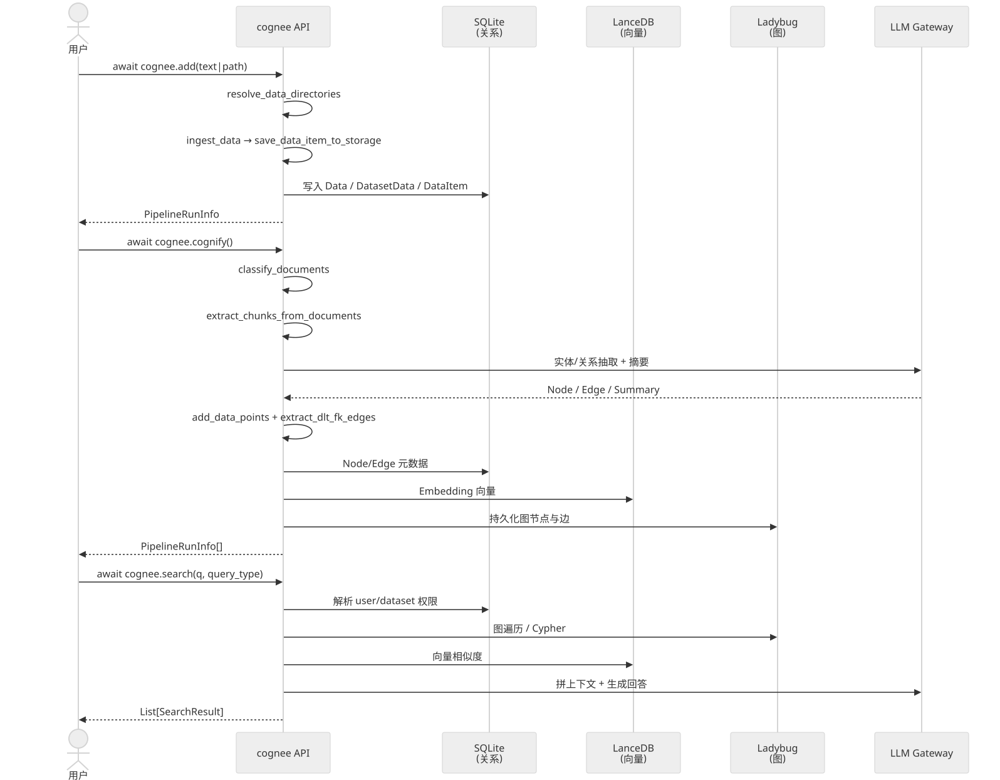

# 第 3 章 `Hello World: add / cognify / search 三步走`

> 本章目标:读完本章,你将能够
> - 用 `cognee.add()` 把一份本地文本或 PDF 摄取到 cognee,并知道内部跑了哪两个任务。
> - 用 `cognee.cognify()` 把已摄取数据构建为知识图,并复述默认的 5 步 pipeline。
> - 用 `cognee.search()` 提问,理解每个检索器背后的"取对象 → 拼上下文 → 生成回答"三段式。
> - 解释 Dataset(数据集)、tenant(租户)与 ACL 在 cognee 中如何隔离数据。
> - 找到 cognee 在磁盘上的文件落盘位置,并区分 `delete` 与 `prune` 的语义。

## 前置知识
- 已读完 [[chapter-02-install-quickstart|第 2 章 安装与五分钟上手]](./chapter-02-install-quickstart.md),至少在本机跑通过一次 LLM API key 配置。
- 需要的基础库:`cognee>=1.4.0`、`pydantic>=2.0`、`asyncio`。
- 环境:Python 3.10–3.14,默认栈为 SQLite + LanceDB + Ladybug。

## 本章导览
- 3.1 完整流程一览:一张时序图描绘 `add → cognify → search` 的三方交互。
- 3.2 `cognee.add`:摄取阶段的两步 pipeline 与文件加载器。
- 3.3 `cognee.cognify`:从文本到知识图的默认 5 任务 pipeline。
- 3.4 `cognee.search`:BaseRetriever 的三段式契约与 18 种 SearchType 的选型原则。
- 3.5 Dataset、tenant 与 ACL:数据隔离模型与默认文件落盘位置。
- 3.6 `delete` vs `prune`:删除单条数据、清空数据集、整体清盘的边界。
- 3.7 端到端示例:对一份本地 PDF 跑通三步走并可视化。

---

## 3.1 完整流程一览

把 cognee 当成一个 ECL(Extract → Cognify → Load)流水线工厂:你交数据,流水线先摄取,再认知化,最后落到三个存储后端,再被搜索器反向取回。本节用一张时序图把"用户、cognee、存储"三方对齐。



这张图只画了最常走的"本地默认栈"路径,如果你切换到 Postgres/Neo4j/PGVector,只需要替换三个 storage adapter,接口语义不变。

---

## 3.2 cognee.add:摄取与建库

入口在 `<COGNEE_REPO>/cognee/api/v1/add/add.py`,它把"用户给的混合输入"先交给两个 task,再交给 `run_pipeline` 调度:

```python
# <COGNEE_REPO>/cognee/api/v1/add/add.py 第 210-221 行(简化)
tasks = [
    Task(resolve_data_directories, include_subdirectories=True),
    Task(
        ingest_data,
        dataset_name,
        user,
        node_set,
        dataset_id,
        preferred_loaders,
        importance_weight,
    ),
]
```

第一步 `resolve_data_directories`(`<COGNEE_REPO>/cognee/tasks/ingestion/resolve_data_directories.py`)只做一件事:把传入的字符串还原成"实际可读的文件列表"。它会区分本地绝对路径、`file://`、`s3://` 与普通文本,把目录递归展开成文件,把二进制流直接透传。判断逻辑在源码里以 `urlparse(item).scheme` 区分 S3/HTTP/本地。

第二步 `ingest_data`(`<COGNEE_REPO>/cognee/tasks/ingestion/ingest_data.py`)负责:
1. 用 `load_or_create_datasets` 确保 `Dataset` 行存在(默认 `dataset_name="main_dataset"`)。
2. 调用 `save_data_item_to_storage` 把文件按 mime 选择 loader,文本/图片/音频/PDF 各走各的解析器。
3. 把 `Data` 行写入关系库,并通过 `DatasetData` 多对多表挂到目标 dataset。

`add()` 还做几件你可能忽略的副作用:解析 `resolve_authorized_user_dataset` 检查当前用户对 dataset 的权限、调用 `reset_dataset_pipeline_run_status` 重置该 dataset 上未完成的 `add_pipeline` / `cognify_pipeline` 状态、以及在 `run_in_background=True` 时用 `materialize_stream_for_background` 把流式输入预先物化为内存 buffer。

完整示例:摄取一段文本与一个本地 PDF。

```python
import asyncio
import cognee

async def main():
    # 文本 + 本地 PDF 混着传入,add 会按类型自动分派
    await cognee.add([
        "Cognee 是一个面向 LLM Agent 的开源记忆框架,核心是 ECL 流水线。",
        "<USER_NOTES_DIR>/intro-to-cognee.pdf",
    ], dataset_name="getting_started")

    # run_info 是一个 PipelineRunInfo,可以拿到 pipeline_run_id 查进度
    print("add done")

asyncio.run(main())
```

> 关键实现见 `<COGNEE_REPO>/cognee/api/v1/add/add.py` 第 25-286 行,以及 `<COGNEE_REPO>/cognee/tasks/ingestion/ingest_data.py` 第 28-100 行。

---

## 3.3 cognee.cognify:从文本到知识图

入口 `<COGNEE_REPO>/cognee/api/v1/cognify/cognify.py` 的核心是 `get_default_tasks`(第 315-378 行),它返回的 5 步任务链就是默认的 cognify pipeline:

```python
# <COGNEE_REPO>/cognee/api/v1/cognify/cognify.py 第 350-376 行
default_tasks = [
    Task(classify_documents),                                            # 1
    Task(extract_chunks_from_documents, max_chunk_size=..., chunker=...), # 2
    Task(extract_graph_and_summarize, KnowledgeGraph, ...),              # 3
    Task(add_data_points, embed_triplets=embed_triplets),                  # 4
    Task(extract_dlt_fk_edges),                                           # 5
]
```

五步分别对应五个真实任务,代码路径分别是:

| 步骤 | Task | 作用 | 代码路径 |
|---|---|---|---|
| 1 | `classify_documents` | 把 DataItem 推断为类型化的 Document | `<COGNEE_REPO>/cognee/tasks/documents/classify_documents.py` |
| 2 | `extract_chunks_from_documents` | 按 token 数切片,默认 chunker 是 `TextChunker` | `<COGNEE_REPO>/cognee/tasks/documents/extract_chunks_from_documents.py` |
| 3 | `extract_graph_and_summarize` | 调用 LLM 抽取实体/关系,并为每个 chunk 生成 summary | `<COGNEE_REPO>/cognee/tasks/graph/extract_graph_and_summarize.py` |
| 4 | `add_data_points` | 把 DataPoint、Edge、Embedding 写入三库 | `<COGNEE_REPO>/cognee/tasks/storage/add_data_points.py` |
| 5 | `extract_dlt_fk_edges` | 重建 DLT 外键关系边 | `<COGNEE_REPO>/cognee/tasks/ingestion/extract_dlt_fk_edges.py` |

几个值得记住的细节:
- `chunk_size` 默认从 `get_max_chunk_tokens()` 自动算出,公式是 `min(embedding_max_completion_tokens, llm_max_completion_tokens // 2)`,所以小模型也能跑。
- `chunks_per_batch` 默认 100,在 `get_cognify_config()` 中可改,控制每次送进 LLM 的 batch 大小。
- 如果你想"先评估再跑",设 `dry_run=True`,会调用 `estimate_cognify_dry_run` 返回 token / cost 估算。
- 如果你的数据带强时间语义,可以打开 `temporal_cognify=True`,它会切换到 `get_temporal_tasks`(事件抽取 → 事件图构建)。

```python
import asyncio
import cognee

async def main():
    # 默认 pipeline:对 getting_started 数据集做知识图构建
    await cognee.cognify(datasets=["getting_started"], run_in_background=False)

    # 进阶:换成 dry_run 估算 token
    estimate = await cognee.cognify(
        datasets=["getting_started"], dry_run=True
    )
    print("estimated tokens:", estimate)

asyncio.run(main())
```

> 关键实现见 `<COGNEE_REPO>/cognee/api/v1/cognify/cognify.py` 第 315-378 行。

---

## 3.4 cognee.search:三段式检索

入口 `<COGNEE_REPO>/cognee/api/v1/search/search.py` 把工作全部委托给 `cognee.modules.search.methods.search`,而后者会按 `SearchType` 选择 18 个检索器之一。**所有检索器都遵循同一份三段式契约**,定义在 `<COGNEE_REPO>/cognee/modules/retrieval/base_retriever.py`:

```text
1. get_retrieved_objects(query)       # 从图/向量库拉原始对象(Edge、Chunk、Node)
2. get_context_from_objects(query, retrieved_objects)
                                      # 把原始对象压成可喂给 LLM 的文本
3. get_completion_from_context(query, context, retrieved_objects)
                                      # 用 LLM 生成最终回答
```

以 `GRAPH_COMPLETION`(默认)为例,实现路径 `<COGNEE_REPO>/cognee/modules/retrieval/graph_completion_retriever.py`:阶段 1 在 Ladybug 里做一跳/多跳图遍历,阶段 2 把命中节点拼成"实体-关系-实体"短文,阶段 3 调用 LLM 总结。`CHUNKS`、`SUMMARIES`、`CODE` 这些非生成型检索器则可以跳过阶段 3,只回原始对象。

`search()` 还有几个常被忽略的开关:
- `datasets` / `dataset_ids`:限定检索范围,等价于"只读某个 namespace"。
- `node_name` + `node_name_filter_operator`(AND/OR):实体级过滤,常用于"只看某几只概念"。
- `top_k` 默认 15,`wide_search_top_k` 默认 100,前者决定最终结果数,后者决定图遍历候选数。
- `retriever_specific_config` / `code_query`:不同 SearchType 专属参数,例如 `CODE` 检索需要 `code_query={operation: "explore"}`。
- `feedback_influence`:用历史 FeedbackEntry 的分数调节结果权重。

```python
import asyncio
import cognee
from cognee import SearchType

async def main():
    # 1. 默认:图遍历 + LLM 回答
    r1 = await cognee.search(
        "Cognee 的 ECL 流水线是哪三步?",
        query_type=SearchType.GRAPH_COMPLETION,
        datasets=["getting_started"],
        top_k=10,
    )

    # 2. 跳过 LLM,只看命中的 chunk(快、可解释)
    r2 = await cognee.search(
        "Cognee 的 ECL 流水线是哪三步?",
        query_type=SearchType.CHUNKS,
    )

    # 3. 让 cognee 自己选 SearchType
    r3 = await cognee.search(
        "Cognee 的 ECL 流水线是哪三步?",
        query_type=SearchType.FEELING_LUCKY,
    )

    for label, res in (("GRAPH_COMPLETION", r1), ("CHUNKS", r2), ("FEELING_LUCKY", r3)):
        print(f"=== {label} ===")
        for item in res:
            print(str(item)[:200])

asyncio.run(main())
```

> 关键实现见 `<COGNEE_REPO>/cognee/api/v1/search/search.py` 第 31-359 行,以及 `<COGNEE_REPO>/cognee/modules/retrieval/base_retriever.py` 第 5-77 行。

---

## 3.5 数据集 dataset 与文件落盘位置

cognee 的隔离基本单位是 `Dataset`,模型定义在 `<COGNEE_REPO>/cognee/modules/data/models/Dataset.py`,关键字段:

| 字段 | 含义 |
|---|---|
| `id` (UUID) | dataset 的稳定主键 |
| `name` | dataset 名,`add()` 的 `dataset_name` 默认 `"main_dataset"` |
| `owner_id` (UUID,索引) | 拥有者 user.id |
| `tenant_id` (UUID,索引,可空) | 租户级隔离,适合 SaaS 多客户场景 |
| `acls` | 反向关系到 `ACL` 表,实现 read/write/delete/share 四级权限 |
| `data` | 多对多关联到 `Data`,通过 `DatasetData` 连接表 |

`ACL` 的存在意味着同一份底层数据可以在两个 tenant 下以不同权限被访问,但 search 时 `resolve_authorized_user_dataset` 会强制校验。多租户示例可看 `<COGNEE_INTEGRATIONS_REPO>/integrations/langgraph/examples/saas_entitlements_agents.py`。

文件落盘的默认位置由 `<COGNEE_REPO>/cognee/base_config.py` 控制:

| 配置项 | 默认值 | 内容 |
|---|---|---|
| `data_root_directory` | `<cwd>/.data_storage` | 按 `tenant_id`/`user_id` 分桶存放的原始摄取文件 |
| `system_root_directory` | `<cwd>/.cognee_system` | 三个数据库的共同父目录,全部落在其 `databases/` 子目录:`cognee_db`(SQLite 关系库)、`cognee.lancedb`(LanceDB 向量库)、`cognee_graph_ladybug`(Ladybug 图库) |
| `cache_root_directory` | `<cwd>/.cognee_cache` | pipeline 缓存、LLM 响应缓存 |
| `logs_root_directory` | `~/.cognee/logs` | 运行日志 |

第一次跑通 `add()` 之后,你可以执行 `ls -la .data_storage .cognee_system .cognee_cache` 自检。如果想集中管理,把 `COGNEE_LOGS_DIR` 与 `system_root_directory` 改成 `~/.cognee/...` 即可。

---

## 3.6 cognee.delete vs cognee.prune

这两个 API 看起来像,语义却不一样,新手很容易混用。

| 维度 | `cognee.delete(data_id, dataset_id, mode)` | `cognee.prune` |
|---|---|---|
| 入口路径 | `<COGNEE_REPO>/cognee/api/v1/delete/__init__.py`(deprecated,推荐 `cognee.datasets.delete_data`) | `<COGNEE_REPO>/cognee/api/v1/prune/prune.py` |
| 操作粒度 | 单条 `Data` 行 / 整个 dataset | 整个数据集 / 整个本地栈 |
| 是否影响图与向量 | 否,只删关系库的 Data 行;图/向量里的衍生节点保留 | 是,清空图数据库、向量数据库与可选缓存 |
| 典型场景 | "这一篇 PDF 解析错了,删掉重加" | "把本地实验数据全部清空,重新开始" |
| 风险 | 低(可重跑 cognify 修复) | 高(不可恢复,务必先备份) |

`delete` 内部其实是 `datasets.delete_data`(`<COGNEE_REPO>/cognee/api/v1/datasets/datasets.py` 第 144 行),`mode="soft"` 只解除 `DatasetData` 关联,`mode="hard"` 会进一步删除数据行。`prune` 内部委托给 `cognee.modules.data.deletion`,提供 `prune.prune_data()`(清空数据集)和 `prune.prune_system(graph=True, vector=True, metadata=False, cache=True)`(清空整盘)。生产环境推荐走 `datasets.delete_data` 或 `prune.prune_data`,慎用 `prune.prune_system`。

---

## 3.7 端到端示例:对一份本地 PDF 提问

把本章所有 API 串起来,完成"上传 PDF → 建图 → 问答 → 可视化"完整闭环。

```python
import asyncio
import cognee
from cognee import SearchType

PDF_PATH = "<USER_NOTES_DIR>/cognee-paper.pdf"

async def main():
    # 1. 清理上一轮实验残留(慎用)
    # await cognee.prune.prune_data()

    # 2. 摄取:文本 + 一份 PDF,放到独立 dataset
    await cognee.add(
        [
            "Cognee 把传统 RAG 升级为图 + 向量 + 关系的三库混合检索。",
            PDF_PATH,
        ],
        dataset_name="paper_walkthrough",
    )

    # 3. 认知化:对 paper_walkthrough 跑默认 5 步 pipeline
    await cognee.cognify(datasets=["paper_walkthrough"])

    # 4. 搜索:三种 SearchType 对比
    graph_answer = await cognee.search(
        "Cognee 的 ECL 流水线由哪三步组成?",
        query_type=SearchType.GRAPH_COMPLETION,
        datasets=["paper_walkthrough"],
        top_k=10,
    )
    chunks = await cognee.search(
        "Cognee 的 ECL 流水线由哪三步组成?",
        query_type=SearchType.CHUNKS,
        datasets=["paper_walkthrough"],
    )
    print("GRAPH_COMPLETION:", graph_answer)
    print("CHUNKS:", chunks)

    # 5. 可视化:在浏览器里看图谱
    await cognee.visualize_graph(path="/tmp/cognee_graph.html")

    # 6. 删除单条实验数据(假设 data_id 已知)
    # await cognee.datasets.delete_data(dataset_id=dataset_id, data_id=data_id)

asyncio.run(main())
```

跑完这段脚本,你会在 `.cognee_system/databases/cognee_graph_ladybug` 看到图库文件,在 `.cognee_system/databases/cognee.lancedb` 看到向量索引,在 `.cognee_system/databases/cognee_db` 看到 SQLite 关系库,在 `/tmp/cognee_graph.html` 看到可交互的图谱可视化。

> 完整示例参考 `<COGNEE_REPO>/examples/demos/simple_cognee_example.py` 与 `<COGNEE_REPO>/examples/demos/comprehensive_example/cognee_comprehensive_example.py`。

---

## 小结

- `cognee.add()` 内部跑两步:先用 `resolve_data_directories` 把混合输入展平,再用 `ingest_data` 写入 SQLite + 文件存储,并通过 `DatasetData` 多对多表挂到目标 dataset。
- `cognee.cognify()` 默认 5 步:`classify_documents → extract_chunks_from_documents → extract_graph_and_summarize → add_data_points → extract_dlt_fk_edges`,每一步都是可替换的 `Task`。
- `cognee.search()` 不直接干活,所有检索器都遵循 BaseRetriever 的"取对象 → 拼上下文 → 生成回答"三段式契约。
- 隔离与权限基于 `Dataset` + `ACL`,`tenant_id` 是 SaaS 多客户的标配字段。
- 默认栈的三个数据库都落在 `.cognee_system/databases/`(SQLite `cognee_db` + LanceDB `cognee.lancedb` + Ladybug 图库 `cognee_graph_ladybug`);原始摄取文件按租户/用户分桶存于 `.data_storage`,LLM 缓存在 `.cognee_cache`,运行日志在 `~/.cognee/logs`。
- `delete` 是"删一行/一个 dataset"的细粒度动作,`prune` 是"整盘清空"的核弹级操作。

## 实践作业

1. **(基础)** 复现 3.7 节的端到端示例,用一段你熟悉的本地 Markdown 当输入,确认 `ls .data_storage .cognee_system` 能看到文件。
2. **(进阶)** 在 `cognee.search()` 里把 `query_type` 依次切到 `CHUNKS` / `SUMMARIES` / `TRIPLET_COMPLETION` / `FEELING_LUCKY`,对比返回内容的形态与耗时,记录到 `experiment.md`。
3. **(挑战)** 用 `cognee.datasets.create("alpha")` 与 `cognee.datasets.create("beta")` 建两个 dataset,把同一段文本分别喂进去,然后用 `cognee.search(query, datasets=["alpha"])` 验证检索结果互不污染,顺带看看 ACL 表里的权限差异。

## 推荐阅读

- [[chapter-02-install-quickstart|第 2 章 安装与五分钟上手]](./chapter-02-install-quickstart.md):补全 LLM API key、依赖与存储后端的准备步骤。
- [[chapter-04-core-concepts|第 4 章 核心概念速览:ECL、SearchType、Retriever 三段式]](./chapter-04-core-concepts.md):从 ECL 与数据集的角度再展开一遍。
- [[chapter-15-search-type-tour|第 15 章 SearchType 全景与选型:18 种检索类型逐项详解]](../part-03-api/chapter-15-search-type-tour.md):深入 `SearchType` 的取舍与组合。
- 源码:`<COGNEE_REPO>/cognee/api/v1/add/add.py`、`<COGNEE_REPO>/cognee/api/v1/cognify/cognify.py`、`<COGNEE_REPO>/cognee/api/v1/search/search.py`。
- 示例:`<COGNEE_REPO>/examples/demos/simple_cognee_example.py`、`<COGNEE_REPO>/examples/demos/comprehensive_example/cognee_comprehensive_example.py`。

## 下一章预告

第 4 章将进入 cognee 心智模型:为什么 cognee 选"图 + 向量 + 关系"三库架构,DataPoint 的身份字段如何让记忆具备幂等性,以及在 SaaS 场景下 `tenant_id` 与 ACL 是怎么共同保证数据所有权的。