# 第 4 章 `Core Concepts: ECL / SearchType / Retriever 三段式`

> 本章目标:读完本章,你将能够
> - 准确解释 ECL、四层记忆、MemoryEntry、SearchType 与 Retriever
> - 区分 Skill、SkillSet、NodeSet、Dataset、DataPoint、Entity 与 KnowledgeGraph
> - 用统一术语描述后续章节中的摄取、认知化、加载与检索流程

## 前置知识

- 已读完 [[chapter-03-add-cognify-search|第 3 章 Hello World:`add` / `cognify` / `search` 三步走]](./chapter-03-add-cognify-search.md)
- 需要的基础库:`cognee>=1.4.0`、`pydantic>=2.0`、`asyncio`
- 环境:Python 3.10–3.14

## 本章导览

- 4.1 用 ECL 统一数据进入记忆系统的语言
- 4.2 用四层记忆定位信息的生命周期
- 4.3 认识四种 MemoryEntry
- 4.4 浏览 18 种 SearchType
- 4.5 理解 Retriever 的三阶段契约
- 4.6 区分 Skill、NodeSet 与核心数据模型

> **术语基线:**本章给出全书后续章节使用的统一定义。后文会讨论实现与选型,
> 但不再重复定义这些术语。

---

## 4.1 ECL:Extract → Cognify → Load

ECL 是 cognee 的核心流水线范式:**E**xtract(提取)→ **C**ognify(认知化)→
**L**oad(加载)。权威描述见 `<COGNEE_REPO>/CLAUDE.md`(顶层项目说明中的
Project Overview 段)。

- **Extract:**接收文本、文件或结构化对象,解析出可处理的数据。
- **Cognify:**分类、分块,抽取实体与关系,并生成摘要等语义结构。
- **Load:**把图节点、关系、向量和元数据写入对应存储与索引。

ECL 描述的是数据如何成为可检索记忆,不等同于三个同名公共函数。最常用的用户路径仍是
`add → cognify → search`:`add` 负责摄取,`cognify` 编排认知化与落库任务,
`search` 消费已经加载的记忆。也就是说,不要把 ECL 的 `L` 误写成 `search`。

```python
import asyncio

import cognee
from cognee import SearchType


async def main():
    await cognee.add(
        "Cognee 使用 ECL 组织记忆工程流程。",
        dataset_name="chapter_04",
        node_set=["term_baseline"],
    )
    await cognee.cognify(datasets="chapter_04")
    result = await cognee.search(
        query_text="ECL 是什么?",
        query_type=SearchType.GRAPH_COMPLETION,
        datasets="chapter_04",
    )
    print(result)


asyncio.run(main())
```

公共入口分别位于
`<COGNEE_REPO>/cognee/api/v1/add/add.py`、
`<COGNEE_REPO>/cognee/api/v1/cognify/cognify.py` 与
`<COGNEE_REPO>/cognee/api/v1/search/search.py`。认知化阶段的典型任务可在
`<COGNEE_REPO>/cognee/tasks/graph/extract_graph_and_summarize.py` 和
`<COGNEE_REPO>/cognee/tasks/storage/add_data_points.py` 中找到。

---

## 4.2 四层记忆模型(短期/长期/程序性/巩固)

为什么要分层?因为“刚发生的对话”“已经建立索引的事实”“可复用的执行方法”与
“对旧记忆的再加工”具有不同的时效、载体和更新方式。本文统一采用以下四层工程模型。

| 记忆层 | 主要载体 | 作用与边界 |
|---|---|---|
| 短期/会话记忆 | `QAEntry`、`TraceEntry`、`FeedbackEntry` | 会话问答、工具轨迹与反馈;QA 与 trace 召回按 token overlap 排序 |
| 长期语义记忆 | 图节点、向量索引、chunk、summary | 原始数据经过 `add → cognify` 后形成可跨会话复用的结构化知识 |
| 程序性记忆 | `Skill`、`SkillRunEntry`、Coding Rules | 保存“怎样做”、调用哪些工具以及一次技能运行的效果,供 Agent 选择和复用 |
| 巩固与再加工 | `memify`、`improve`、session distillation、global context index | 把反馈、频率和会话经验重新组织为更稳定、更有价值的记忆 |

判断信息属于哪一层,可以连续问四个问题。它是否只服务当前交互?若是,先放短期层。
它是否是未来会反复查询的稳定事实?若是,经 `add → cognify` 进入长期层。
它是否描述可重复执行的步骤、工具约束或成功模式?若是,属于程序性层。
它是否在评价、压缩、合并或重建既有记忆?若是,属于巩固与再加工层。
这个判断法强调信息的当前职责,同一份经验可以随生命周期迁移:一次失败先形成 trace,
随后附加反馈,再蒸馏成长期事实或 Coding Rule,最终成为可检索的 Skill。

这里的“层”表示职责,并非四套完全隔离的数据库。例如 `SkillRunEntry` 通过公共记忆入口提交,
但其语义是图支持的程序性运行记录;会话也可以经蒸馏与 `memify` 进入长期图。
会话 QA 与 trace 的 token overlap 实现见
`<COGNEE_REPO>/cognee/api/v1/recall/recall.py`。巩固入口和会话持久化分别见
`<COGNEE_REPO>/cognee/modules/memify/memify.py` 与
`<COGNEE_REPO>/cognee/memify_pipelines/persist_sessions_in_knowledge_graph.py`;
全局上下文索引管道位于
`<COGNEE_REPO>/cognee/memify_pipelines/global_context_index.py`。

---

## 4.3 MemoryEntry 四种类型

MemoryEntry(记忆条目)不是单一数据类,而是四种 Pydantic 模型组成的联合类型。
定义位于 `<COGNEE_REPO>/cognee/memory/entries.py`。

| 类型 | 判别字段 | 最小语义 |
|---|---|---|
| `QAEntry` | `type="qa"` | 一轮 question/answer,可附 retrieval context 与反馈 |
| `TraceEntry` | `type="trace"` | 一次工具或函数调用的来源、参数、返回值与状态 |
| `FeedbackEntry` | `type="feedback"` | 通过 `qa_id` 给既有 QA 补充评分或文字反馈,本质是更新 |
| `SkillRunEntry` | `type="skill_run"` | 技能选择与执行结果,包含分数、延迟、候选技能和工具轨迹 |

```python
from cognee.memory import FeedbackEntry, MemoryEntry, QAEntry, SkillRunEntry, TraceEntry

entries: list[MemoryEntry] = [
    QAEntry(question="ECL 是什么?", answer="Extract → Cognify → Load"),
    TraceEntry(origin_function="search", status="success"),
    FeedbackEntry(qa_id="qa-entry-id", feedback_score=1),
    SkillRunEntry(selected_skill_id="skill-id", task_text="解释 Cognee"),
]

print([entry.type for entry in entries])
```

这四类依靠 `type` 判别,使 `remember()` 能把负载路由到会话 QA、Agent trace、反馈更新或
Skill run 对应处理路径。不要把 `MemoryEntry` 与知识图中的任意 `DataPoint` 混为一谈:
前者是内存 API 的输入联合类型,后者是图领域对象的通用基类。

---

## 4.4 SearchType 全景速览表(18 种)

SearchType(检索类型)表达“用户想得到什么形式的结果”,并进一步决定使用哪个 Retriever。
枚举的唯一基线是
`<COGNEE_REPO>/cognee/modules/search/types/SearchType.py`。
下表先建立全景,具体选型与参数留到第 15 章。

| SearchType | 一句话说明 |
|---|---|
| `SUMMARIES` | 检索 summary 节点,适合快速了解资料概貌 |
| `CHUNKS` | 语义检索原始 chunk,返回材料而不负责最终回答 |
| `CHUNKS_LEXICAL` | 按词法匹配 chunk,适合精确术语、标识符和关键词 |
| `RAG_COMPLETION` | 用检索到的文本上下文完成经典 RAG 回答 |
| `HYBRID_COMPLETION` | 合并向量与图上下文后生成回答 |
| `TRIPLET_COMPLETION` | 围绕“实体—关系—实体”三元组组织回答 |
| `GRAPH_COMPLETION` | 基于知识图邻域或遍历结果生成回答 |
| `GRAPH_COMPLETION_DECOMPOSITION` | 将复杂问题拆成子查询后进行图补全 |
| `GRAPH_SUMMARY_COMPLETION` | 联合图结构与 summary 生成概括性回答 |
| `GRAPH_COMPLETION_COT` | 在图上下文上执行分步推理式补全 |
| `GRAPH_COMPLETION_CONTEXT_EXTENSION` | 扩展初始图上下文,覆盖更宽的相关知识 |
| `CYPHER` | 执行 Cypher 并直接返回图查询结果 |
| `NATURAL_LANGUAGE` | 把自然语言意图转换为图查询并返回结果 |
| `FEELING_LUCKY` | 由 cognee 自动选择合适的检索路径 |
| `TEMPORAL` | 检索事件、实体与时间关系,回答时序问题 |
| `CODING_RULES` | 召回代码规范、约束和可复用开发规则 |
| `AGENTIC_COMPLETION` | 由 Agent 进行多步检索与推理,可结合 skill/tool |
| `CODE` | 面向源码事实、路径、依赖和影响分析的代码检索 |

从使用方式看,18 种类型还可分成四组。`SUMMARIES`、`CHUNKS`、`CHUNKS_LEXICAL`
偏向返回证据;名称含 `COMPLETION` 的类型通常会在证据之上生成结果;`CYPHER`、
`NATURAL_LANGUAGE` 与 `TEMPORAL` 强调结构化或时间查询;`CODING_RULES`、`CODE` 与
`AGENTIC_COMPLETION` 面向代码和 Agent 工作流。`FEELING_LUCKY` 是自动路由入口,
不是一种新的存储格式。这个分组只帮助建立直觉,最终行为仍以具体 Retriever 的契约为准。

```python
from cognee import SearchType

assert len(SearchType) == 18
for search_type in SearchType:
    print(search_type.name, search_type.value)
```

调用 `cognee.search()` 时参数名是 `query_type`,不是 `search_type`。若只需要证据材料,
优先考虑 `CHUNKS`、`CHUNKS_LEXICAL` 或 `SUMMARIES`;若需要生成回答,再选择 completion 类。

---

## 4.5 Retriever 三段式

SearchType 是对外的检索意图,Retriever(检索器)是落实该意图的实现。统一抽象
`BaseRetriever` 位于
`<COGNEE_REPO>/cognee/modules/retrieval/base_retriever.py`,其契约严格分为三步:

1. `get_retrieved_objects`:从图或向量存储取得 edge、chunk 等原始对象。
2. `get_context_from_objects`:把原始对象整理成适合提示词或确定性返回的上下文。
3. `get_completion_from_context`:结合原查询与上下文形成最终结果。

```python
from inspect import iscoroutinefunction

from cognee.modules.retrieval.base_retriever import BaseRetriever

stages = (
    "get_retrieved_objects",
    "get_context_from_objects",
    "get_completion_from_context",
)

assert all(iscoroutinefunction(getattr(BaseRetriever, name)) for name in stages)
print(" → ".join(stages))
```

三段式也提供了清晰的调试边界。若原始对象就不相关,应检查查询、过滤条件、索引与召回策略;
若对象正确但关键字段未进入上下文,应检查格式化、裁剪和 token 预算;若上下文充分而最终回答偏离,
才重点检查提示词、响应模型和生成阶段。把三个阶段的中间产物分别观测,能避免把所有问题都笼统地
归因于“检索不准”,也便于在不调用 LLM 的情况下测试前两段。

三段式的价值在于分离“召回了什么”“如何压缩成上下文”和“是否调用 LLM”。因此同一批原始对象
可以采用不同上下文格式,确定性 Retriever 也可以避免不必要的生成步骤。具体实现例如
`<COGNEE_REPO>/cognee/modules/retrieval/chunks_retriever.py` 与
`<COGNEE_REPO>/cognee/modules/retrieval/graph_completion_retriever.py`。

---

## 4.6 Skill / NodeSet / Dataset

这些概念容易因为都能“分组”而混淆,应从职责区分。

- **Skill(技能):**数据集范围内的程序性 playbook,记录名称、描述、procedure、声明工具与
  可检索文本。模型见 `<COGNEE_REPO>/cognee/modules/engine/models/Skill.py`。
- **SkillSet(技能集):**一组相关 Skill 的逻辑集合。在本章基线源码中它不是独立的
  `SkillSet` 数据模型;工程上可借助 dataset scope 或 NodeSet 组织。不要虚构同名公共 API。
- **NodeSet(节点集):**只有 `name` 的轻量 `DataPoint`,用于给 dataset 内节点打标签、分组和限定
  子图检索,但不替代 Dataset 的权限隔离。模型见
  `<COGNEE_REPO>/cognee/modules/engine/models/node_set.py`。
- **Dataset(数据集):**数据、权限和租户隔离的基本范围,带 owner、tenant 与 ACL。模型见
  `<COGNEE_REPO>/cognee/modules/data/models/Dataset.py`。
- **DataPoint(数据点):**图领域知识对象的 Pydantic 基类,提供 id、metadata、索引字段和身份字段。
  定义见 `<COGNEE_REPO>/cognee/infrastructure/engine/models/DataPoint.py`。
- **Entity(实体):**`DataPoint` 的具体子类,以名称、描述、类型和关系表示一个概念。模型见
  `<COGNEE_REPO>/cognee/modules/engine/models/Entity.py`。
- **KnowledgeGraph(知识图):**Entity、其他节点与 Edge 构成的语义网络,是 cognify 后的重要
  持久化结果,不是 NodeSet 或 Dataset 的别名。

一个实用例子是多客户支持 Agent:为租户建立独立 Dataset,用 `customer_123`、`refund_flow`
等 NodeSet 标签限定客户与流程子图,把退款步骤写成 Skill,把相关 Skill 视为一个 SkillSet,
再以 Entity 表示客户、订单和政策。这样权限边界、检索范围、程序性做法与业务事实各归其位。
如果只用 NodeSet 代替 Dataset,标签能帮助检索,却不能自动提供 owner、tenant 与 ACL 语义。

简记为:Dataset 管隔离,NodeSet 管轻量分组,DataPoint 管图对象通用形态,Entity 管领域概念,
Skill 管可复用做法,SkillSet 管技能的逻辑集合,KnowledgeGraph 管节点与关系的整体语义。
这些模型的字段、身份生成与边关系将在第 7 章展开。

---

## 4.7 概念关系图



图中箭头表达职责关系,不等于 Python 继承关系。例如 Dataset 包含/隔离数据,
而 `DataPoint → Entity` 才表示模型继承方向。

## 小结

- ECL 的固定含义是 Extract → Cognify → Load;常用 API 主路径是 `add → cognify → search`。
- cognee 的记忆工程基线包含短期、长期、程序性、巩固与再加工四层。
- MemoryEntry 是 `QAEntry`、`TraceEntry`、`FeedbackEntry`、`SkillRunEntry` 的联合类型。
- 18 种 SearchType 描述检索意图,Retriever 用三段式把意图落实为对象、上下文和结果。
- Dataset、NodeSet、DataPoint、Entity、Skill 与 KnowledgeGraph 各有边界,不能互换使用。

## 实践作业

1. **(基础)** 运行本章 SearchType 枚举代码,核对输出恰好包含 18 个成员。
2. **(进阶)** 用同一问题分别调用 `CHUNKS` 与 `GRAPH_COMPLETION`,记录原始材料和生成回答的差异。
3. **(挑战)** 阅读两个 Retriever 实现,逐项标注三阶段的输入、输出以及是否调用 LLM。

## 推荐阅读

- [[chapter-07-data-model|第 7 章 数据模型与实体:DataPoint / Entity / NodeSet / KnowledgeGraph]](../part-02-architecture/chapter-07-data-model.md)
- [[chapter-15-search-type-tour|第 15 章 SearchType 全景与选型:18 种检索类型逐项详解]](../part-03-api/chapter-15-search-type-tour.md)
- 源码:`<COGNEE_REPO>/cognee/memory/entries.py`
- 源码:`<COGNEE_REPO>/cognee/modules/search/types/SearchType.py`
- 源码:`<COGNEE_REPO>/cognee/modules/retrieval/base_retriever.py`

## 下一章预告

第 5 章将对比 Mem0、Zep、Graphiti、Letta 与 LangChain Memory,说明 Cognee 的定位与取舍。
