# 第 5 章 `vs Alternatives: 与同类项目对比`

> 本章目标:读完本章,你将能够
> - 在 5 分钟内根据业务场景在 Cognee / Mem0 / Zep / Graphiti / Letta / LangChain Memory 之间做出技术选型决策
> - 说出 cognee 与同类项目在数据模型、检索方式、后端栈、协议、可视化、ACL、开源、集成生态等 8 个维度的横向差异
> - 通过一段 Python 代码,把 Mem0 / Zep / Graphiti / Letta / COGX 五种来源的数据迁入 cognee
> - 识别 cognee 的独特价值(开源 + 24 集成 + 本地图库 + MCP + 三栈统一)与不适用的边界场景

## 前置知识

- 已读完 [[chapter-01-why-memory|第 1 章 为什么 Agent 需要 Cognee]](./chapter-01-why-memory.md)
- 已读完 [[chapter-04-core-concepts|第 4 章 核心概念速览:ECL、SearchType、Retriever 三段式]](./chapter-04-core-concepts.md)
- 需要的基础库:`cognee>=1.4.0`、`pydantic>=2.10.5`、`asyncio`、`litellm>=1.83.7`
- 环境:Python **3.10–3.14**,默认 SQLite + LanceDB + Ladybug 三栈

## 本章导览

- 5.1 横向对比表:六个项目、八个维度一次看清
- 5.2 选型决策树:从场景走到推荐框架
- 5.3 迁移路径:cognee 内置五个迁移源(`Mem0Source` / `ZepSource` / `GraphitiSource` / `LettaSource` / `COGXArchiveSource`)
- 5.4 Cognee 的独特价值:开源 + 24 集成 + 本地图数据库 + MCP + 三栈统一
- 5.5 何时不该选 Cognee:边界场景的诚实提醒

---

## 5.1 横向对比表

选型最怕「凭感觉」拍脑袋。本节把六个主流记忆框架拉到同一张表中,按 8 个维度逐项对照,维度选取原则是「5 分钟内能拍板」。

| 维度 | **Cognee** | **Mem0** | **Zep (Cloud)** | **Graphiti (OSS)** | **Letta (OSS)** | **LangChain Memory** |
|---|---|---|---|---|---|---|
| 数据模型 | 图节点 + 三栈统一(默认 SQLite/LanceDB/Ladybug) | KV 记忆条目(`memory_id` → 文本) | 时序图(episodes + entities + facts) | 时序图(episodes + entity edges, 双时态) | Agent File(core memory + archival + messages) | KV / 向量条目(子模块独立) |
| 检索方式 | 18 种 `SearchType`:`GRAPH_COMPLETION` / `HYBRID_COMPLETION` / `TRIPLET_COMPLETION` / `CYPHER` / `NATURAL_LANGUAGE` / `TEMPORAL` / `AGENTIC_COMPLETION` 等 | 向量相似度 + LLM 重排 | 图遍历 + 摘要 | 图遍历 + 双时态过滤 | Block 检索 + archival 向量 | 向量(`ConversationBufferMemory` / `VectorStoreRetrieverMemory` 等) |
| 后端栈 | 本地三栈默认,整栈可换 Postgres + PGVector + Neo4j | 托管 SaaS + OSS Qdrant/PG | 托管 SaaS + OSS FalkorDB/Neo4j | OSS FalkorDB / Neo4j 自托管 | OSS SQLite/Postgres 自托管 | 插件式,挂任意 LangChain VectorStore |
| 协议支持 | MCP Server(`cognee-mcp`)+ OpenAPI + Python SDK | OpenAI 兼容 SDK;MCP 由社区提供 | REST + GraphQL(SaaS) | Python SDK | Python SDK + REST | LangChain Tools / MCP adapter |
| 多租户 / ACL | Dataset 级隔离 + permissions.json + principal ACL | `user_id` / `agent_id` / `run_id` 命名空间 | `session_id` + `user_id` | `group_id` + `user_id` | `agent_id` | 几乎无,靠应用层 |
| 可视化 | `cognee.start_ui()` + `cognee.visualize_graph()` + Graph Explorer | Mem0 Dashboard(只读) | Zep Cloud UI | Graphiti Explorer(社区版) | Letta ADE(Agent Dev Environment) | LangSmith 追踪(非图谱) |
| 开源 / 商业 | Apache-2.0 全栈开源 + 可选 Cognee Cloud | 双协议(OSS 核心 + 商业托管) | 商业为主,OSS 文档版 | Apache-2.0 OSS | Apache-2.0 OSS | MIT OSS,商业 LangSmith |
| 集成生态 | **24 个官方集成**(见 `inventory.yml`) | 8-10 个(LangChain / LlamaIndex 等) | 偏自家 SaaS | 偏框架级,与 LangChain / Mem0 互通 | 偏框架级 | 200+ VectorStore / Loader,但记忆子模块分散 |

> 关键事实(仓库已验证,2026-07 截止):
>
> - cognee 集成清单权威来源 `<COGNEE_INTEGRATIONS_REPO>/integrations/inventory.yml`,共 **24 个 `slug`**:Claude Code / Claude Agent SDK / LangGraph / CrewAI / Google ADK / Strands / Hermes / OpenClaw / Vellum / Codex / Dify / n8n / Telegram / Slack / Web Widget / Chat-Memory / Second Brain / VS Code / Aider / OpenAI Agents / Vercel AI SDK 等。
> - cognee 迁移源清单路径 `<COGNEE_REPO>/cognee/modules/migration/sources/`,导出 `MemorySource` 基类与五个具体源:`Mem0Source` / `ZepSource`(同时是 `GraphitiSource` 的父类) / `LettaSource` / `COGXArchiveSource`,以及三种导入模式 `("re-derive", "preserve", "hybrid")`(基类定义见 `base.py`)。
> - 默认三栈 `<COGNEE_REPO>/cognee/infrastructure/databases/` 下分别有 `relational/sqlalchemy/`(SQLite)、`vector/lancedb/`、`graph/ladybug/`;统一切换入口在 `databases/hybrid/postgres/adapter.py`。

补充几点容易看错的地方:

1. **Zep 与 Graphiti 的关系**:Zep 是商业 SaaS 平台,Graphiti 是其开源图记忆后端(Apache-2.0)。cognee 把两者当成同一种导出格式,共用 `ZepSource` 基类,`GraphitiSource` 是子类别名(`zep.py` 第 127 行),加载时通过 `manifest.source_system` 区分。
2. **Mem0 的本质**:Mem0 把记忆存成「命名 KV + 向量」,不是图。做全局检索时往往把所有记忆拉给 LLM 重排,延迟和成本都偏高;cognee 的 `GRAPH_COMPLETION` 直接走图遍历,上下文更紧凑。
3. **LangChain Memory 是「套件」而非「产品」**:`ConversationBufferMemory`、`VectorStoreRetrieverMemory`、`ConversationSummaryMemory` 等互相独立,没有统一的服务端、没有图谱可视化、没有迁移工具——适合写 PoC,不适合长期生产。

---

## 5.2 选型决策树

把上表的差异翻译成可执行的「问 A 走 X」流程,适用于大多数 LLM Agent 场景。



走读示例:

- **场景 A**:做企业知识库,要问「张三是哪个部门的,负责哪些项目,和谁协作过」→ 选 cognee,`GRAPH_COMPLETION` 做一跳图遍历 + LLM 合成最直接。
- **场景 B**:做 ToC 助手,按 `user_id` 隔离,延迟 < 200ms → 选 Mem0,API 简单、向量化路径短。
- **场景 C**:多 Agent 协同,Agent A 记住的事实要让 Agent B 看到,还要按部门 ACL 隔离 → 选 cognee,Dataset + principal permissions 是天然设计。
- **场景 D**:做学术评测,需要 LangChain 周边全套 → 选 LangChain Memory,因为它与 LangChain 的 Evaluator / Tool 一致。

---

## 5.3 迁移路径:cognee 内置五个迁移源

如果你已经用了 Mem0 / Zep / Graphiti / Letta 或自家的 cognee 实例,cognee 提供了「零代码迁移」路径——把这些框架的导出文件(或 live API 返回值)喂给 `cognee.remember()` 即可。

### 5.3.1 五个迁移源对照

权威来源:`<COGNEE_REPO>/cognee/modules/migration/sources/__init__.py`,导出五个具体源:

```python
from cognee.modules.migration.sources import (
    MemorySource,
    Mem0Source,
    ZepSource,        # 同时也是 GraphitiSource 的父类
    GraphitiSource,   # = ZepSource 子类, source_system="graphiti"
    LettaSource,
    COGXArchiveSource,
)
```

三种 `mode` 的取舍:

- `re-derive`(默认,适合 Mem0):只把原始文本写进 cognee,然后跑 cognee 自己的 cognify 提取图——丢弃原系统的实体/关系。
- `preserve`(适合 Letta + COGX):把原系统的实体、关系直接映射到 cognee 图,零 LLM 调用,适合「别浪费已经抽好的图」。
- `hybrid`(适合 Zep/Graphiti 导入):既保留原图,又对原文重新 cognify 一次,在两者冲突时新版本优先。

### 5.3.2 示例一:从 Mem0 迁入 cognee

```python
import asyncio
import cognee
from cognee.modules.migration.sources import Mem0Source

async def main():
    # 接受文件路径 / 已解析的 list / dict(自动识别 results/memories 包装)
    source = Mem0Source("mem0_export.json", mode="re-derive")

    # 走 cognee 记忆 API,内部走迁移 loader
    await cognee.remember(source)

    # 立刻可以查
    result = await cognee.search("用户偏好", "GRAPH_COMPLETION")
    print(result)

asyncio.run(main())
```

关键实现见 `<COGNEE_REPO>/cognee/modules/migration/sources/mem0.py` 第 32–48 行,自动识别 `results` / `memories` / `items` 包装键,并把 `categories` / `user_id` / `agent_id` / `run_id` 转成 cognee 的 `Scope`(`user_id`、`agent_id`、`run_id` 三段)。

### 5.3.3 示例二:从 Zep / Graphiti 迁入 cognee(带时序)

```python
import asyncio
import cognee
from cognee.modules.migration.sources import ZepSource, GraphitiSource

async def main():
    # Zep Cloud 导出的 JSON 含 episodes + entities + facts
    zep_source = ZepSource("zep_export.json", mode="hybrid")
    await cognee.remember(zep_source)

    # OSS Graphiti 导出格式一致,所以用别名
    graphiti_source = GraphitiSource("graphiti_dump.json", mode="preserve")
    await cognee.remember(graphiti_source)

asyncio.run(main())
```

关键实现见 `<COGNEE_REPO>/cognee/modules/migration/sources/zep.py` 第 88–124 行,会把 `valid_at` / `invalid_at`(以及作为 `invalid_at` 备选的 `expired_at`)映射为 cognee 的双时态,并把 `episodes` 列表挂到每条 `COGXFact` 的 `provenance` 字段。

### 5.3.4 迁移源能力对照

| 迁移源 | 类名 | 推荐导入模式 | 关键导出字段 |
|---|---|---|---|
| Mem0 | `Mem0Source` | `re-derive` | `memory` / `text` / `categories` / `user_id` / `agent_id` / `run_id` |
| Zep | `ZepSource` | `hybrid`(默认) / `preserve` | `episodes` + `entities`/`nodes` + `facts`/`edges` + `valid_at`/`invalid_at` |
| Graphiti | `GraphitiSource`(`ZepSource` 子类) | 同 Zep | 同 Zep,`source_system="graphiti"` 标记 |
| Letta | `LettaSource` | `re-derive` / `preserve` | core memory blocks + messages + archival passages |
| COGX Archive | `COGXArchiveSource` | `preserve`(默认) / `hybrid` | manifest + permissions.json(可选,带 ACL) |

> **预告**:本章给出的是迁移源的「能力速览」,完整的端到端迁移手册(包括备份恢复、跨实例迁移、`cognee.export()` 反向导出)放在第 25 章(预告链接见后文「推荐阅读」)。

---

## 5.4 Cognee 的独特价值

把上面的对比表翻译成一句结论:**cognee 是当前唯一一个把「图记忆 + 本地三栈 + 24 集成 + MCP + 多租户 ACL」五件事一起做对的开源框架**。具体拆开:

1. **完全开源 + 自托管**:Apache-2.0,所有能力(含 `Mem0Source` / `ZepSource` 等迁移源)在仓库内可见可改。Mem0 / Zep 的云版功能强,但数据出境会带来合规成本(金融、医疗、政务场景无法接受);Graphiti / Letta 也是开源,但生态规模和图形化能力弱于 cognee。
2. **本地图数据库默认**:Ladybug 是 Kuzu 的官方 fork(`<COGNEE_REPO>/cognee/infrastructure/databases/graph/ladybug/adapter.py`),嵌入式 + WAL 持久化,**零外部依赖**即可在笔记本或 CI 跑完整 cognify pipeline。对比 Graphiti 强依赖 FalkorDB/Neo4j,启动门槛更高。
3. **24 个官方集成**:覆盖 Claude Code、Claude Agent SDK、LangGraph、CrewAI、Strands、Google ADK、Hermes、OpenClaw、Vellum、Codex、Dify、n8n、Telegram、Slack、Web Widget、Chat-Memory、Second Brain、VS Code、Aider、OpenAI Agents、Vercel AI SDK。权威清单见 `<COGNEE_INTEGRATIONS_REPO>/integrations/inventory.yml`。
4. **MCP 一等公民**:`cognee-mcp`(`<COGNEE_REPO>/cognee-mcp/src/server.py`)是独立子仓库,任何 MCP 客户端(Claude Code / Cursor / Continue / 自研 Agent)都可以通过 `mcp__cognee__recall()` 直接调用,免去单独维护 HTTP API。
5. **三栈统一,可整栈替换**:默认 SQLite + LanceDB + Ladybug 启动零成本;生产环境可一键替换为 Postgres + PGVector + Neo4j / Kuzu(`<COGNEE_REPO>/cognee/infrastructure/databases/hybrid/postgres/adapter.py`)。同一套 API、同一套 pipeline 不需要改一行代码。
6. **18 种 SearchType**:不只向量,不只图——`GRAPH_COMPLETION_COT`(思维链)、`GRAPH_COMPLETION_DECOMPOSITION`(子查询分解)、`CYPHER`(直查图)、`NATURAL_LANGUAGE`(NL → Cypher)、`TEMPORAL`(双时态)、`AGENTIC_COMPLETION`(多轮 Agent) 在其他框架要么没有、要么要自己拼。
7. **memify 自适应巩固**:`<COGNEE_REPO>/cognee/memify_pipelines/` 提供 `apply_feedback_weights` / `apply_frequency_weights` / `consolidate_entity_descriptions` / `persist_sessions_in_knowledge_graph` 等管道,让记忆随使用频率、用户反馈自动调整权重——这是 Mem0 / LangChain Memory 都缺乏的能力。

一句话总结:**cognee = 图记忆版的 Supabase**——开源、自托管、有可视化、有 ACL、有迁移工具、有生态。

---

## 5.5 何时不该选 Cognee

不夸不贬。以下场景 cognee 不是最优解,直接换框架更省心:

- **极轻量 ToC 端侧助手,只需 KV 记忆**:Mem0 的 API 比 cognee 简单得多,一行 `memory.add()` 就完事,没有 cognify pipeline 等待。如果你的记忆只是「用户说过的关键事实」,不上图、不做关系推理,Mem0 更合算。
- **强时序、双时态审计(医疗、金融回溯)**:Graphiti 的双时态模型(`valid_at` / `invalid_at` / `expired_at`)比 cognee 当前的 `TEMPORAL` 检索更细。cognee 通过 `GraphitiSource` 可以迁入 Graphiti 导出的数据,但如果你从零搭且「时间」是第一维度,直接用 Graphiti 反而省事。
- **LangChain 全栈实验**:如果你已经重度依赖 LangChain 的 Expression Language / Output Parser / Callback 体系,LangChain Memory 在一致性上更舒服。cognee 与 LangChain 通过 `<COGNEE_INTEGRATIONS_REPO>/integrations/langgraph/` 互通,但生态重心不一样。
- **< 100 行的 Demo**:cognee 概念词汇较多(`DataPoint` / `Pipeline` / `MemoryEntry` / `SearchType`),最小可用代码也要 30+ 行;Mem0 / LangChain Memory 的 Hello World 在 10 行以内。
- **完全不想装任何图数据库的客户环境**:虽然 Ladybug 是嵌入式,但仍要写盘(WAL)。如果对方环境是「连文件都禁」的纯无状态服务,只能挂云——而 cognee Cloud 目前还没有正式 GA,建议先用 Mem0 或 Zep Cloud 顶着。

诚实提示:上述场景 cognee 都能跑,只是「性价比」不如专用框架。

---

## 小结

- cognee / Mem0 / Zep / Graphiti / Letta / LangChain Memory 在 8 个维度上各有强弱,核心差异在「数据模型」(图 vs KV)、「协议」(MCP vs SaaS)、「生态规模」(24 vs 8)。
- 选型决策树按「企业图谱 / 多 Agent / 用户长期记忆 / 学术实验」四条主路径分流,大多数 ToB 场景落在 cognee 一侧。
- cognee 内置 5 个迁移源(`Mem0Source` / `ZepSource` / `GraphitiSource` / `LettaSource` / `COGXArchiveSource`),通过 `cognee.remember()` 一行接入,迁移成本极低。
- cognee 的独特价值在「开源 + 本地图库 + 24 集成 + MCP + 三栈统一 + memify」五件套同时具备,其他框架都只能覆盖其中若干。
- 边界场景要诚实评估:极轻量、强时序审计、LangChain 全栈、Demo 验证等场景下,Mem0 / Graphiti / LangChain Memory 反而更省心。

## 实践作业

1. **(基础)** 在本地启动 cognee,用 `Mem0Source("mem0_export.json")` 把示例 Mem0 导出文件导入,验证 `await cognee.search("用户偏好", "GRAPH_COMPLETION")` 能返回至少一条结果。
2. **(进阶)** 对比同一份文本分别用 `re-derive` 和 `preserve` 模式导入,观察 cognee 图谱节点数量与 `cognee.datasets()` 列表的差异,理解三种 `IMPORT_MODES` 的语义。
3. **(挑战)** 写一个最小 PoC:把 5 个对比框架的导出文件(mem0.json / zep.json / letta.af / cogx 目录)分别用对应的 `MemorySource` 迁入 cognee,然后用 `GRAPH_COMPLETION_COT` 跑同一个查询,记录结果质量与延迟,输出对比报告。

## 推荐阅读

- [[chapter-01-why-memory|第 1 章 为什么 Agent 需要 Cognee]](./chapter-01-why-memory.md)
- [[chapter-04-core-concepts|第 4 章 核心概念速览:ECL、SearchType、Retriever 三段式]](./chapter-04-core-concepts.md)
- 迁移手册预告(第 25 章,完整版见 Part V)
- 源码:`<COGNEE_REPO>/cognee/modules/migration/sources/`(五个迁移源实现)
- 集成清单:`<COGNEE_INTEGRATIONS_REPO>/integrations/inventory.yml`(24 集成权威索引)
- 默认栈:`<COGNEE_REPO>/cognee/infrastructure/databases/`
- MCP Server:`<COGNEE_REPO>/cognee-mcp/src/server.py`

## 下一章预告

第 6 章将进入架构深潜篇,从 cognee 的目录结构开始逐层拆解 `cognee.api.v1` / `cognee.modules` / `cognee.tasks` / `cognee.infrastructure` 四层的协作方式,以及 `pipeline → task → run_pipeline` 的执行模型。
