# 第 6 章 `Module Map: 模块总览与代码地图`

> 本章目标:读完本章,你将能够
> - 在 5 分钟内定位 cognee 任意公共 API 的入口文件
> - 区分 `cognee/api/`、`cognee/modules/`、`cognee/infrastructure/`、`cognee/pipelines/`、`cognee/tasks/` 五层的职责
> - 读懂 cognee 顶层 `__init__.py` 的所有导出符号,知道它们对应哪个文件
> - 在改动某个模块前,先看清它依赖了哪些基础设施

## 前置知识

- 已读完 [[chapter-07-data-model|第 7 章 数据模型与实体:DataPoint / Entity / NodeSet / KnowledgeGraph]](./chapter-07-data-model.md)
- 已读完 [[chapter-08-pipelines|第 8 章 管道引擎 Pipelines:Task / Pipeline / DAG]](./chapter-08-pipelines.md)
- 需要的基础库:`cognee>=1.4.0`、`pydantic>=2.0`、`asyncio`
- 环境:Python 3.10–3.14

## 本章导览

- 6.1 顶层入口:`__init__.py` 导出符号全清单
- 6.2 `modules/`:领域模块(29 个子包)
- 6.3 `infrastructure/`:基础设施(databases / llm / engine / session / data / files / context)
- 6.4 `pipelines/`:管道运行时(Task / BoundTask / Drop)
- 6.5 `tasks/`:任务实现(17 个子领域)
- 6.6 `memify_pipelines/`:记忆化预定义管道
- 6.7 `memory/`:MemoryEntry 判别联合
- 6.8 `api/v1/`:路由层
- 6.9 `migration/`:跨框架迁移源(Mem0 / Zep / Letta / COGX)
- 6.10 `alembic/` + `eval_framework/`
- 6.11 模块依赖大图

---

## 6.1 顶层入口:`__init__.py` 导出符号

cognee 的 Python 包入口只有一个文件:`<COGNEE_REPO>/cognee/__init__.py`(89 行)。它做了五件事:

1. 调用 `dotenv.load_dotenv()` 读 `.env`
2. 调用 `setup_logging()` 初始化日志
3. 导入 V1 API(7 个主入口函数 + UI/可视化 + 配置)
4. 导入 V2 内存 API(remember/recall/improve/forget/serve/disconnect/visualize/push/export)
5. 导入 Memory 类型 + 观测/迁移/会话/版本模型

下面是 `__init__.py` 中导出的所有符号(完整复制自 `<COGNEE_REPO>/cognee/__init__.py` 第 18–88 行)。

### 6.1.1 V1 API 导出符号

```python
# V1 - 摄取与认知化
from .api.v1.add import add
from .api.v1.delete import delete
from .api.v1.cognify import cognify
from .modules.memify import memify
from .modules.run_custom_pipeline import run_custom_pipeline
from .api.v1.update import update
from .api.v1.config.config import config
from .api.v1.datasets.datasets import datasets
from .api.v1.agents.agents import agents
from .api.v1.prune import prune

# V1 - 检索
from .api.v1.search import SearchType, search

# V1 - 可视化与 UI
from .api.v1.visualize import (
    visualize_graph,
    start_visualization_server,
    get_schema_inventory,
    get_memory_provenance_graph,
    visualize_memory_provenance,
)
from cognee.modules.visualization.cognee_network_visualization import (
    cognee_network_visualization,
)
from .api.v1.ui import start_ui

# V1 - 会话
from .api.v1.session import session

# V1 - Pipeline
from .modules import pipelines
from .pipelines import Drop

# V1 - 迁移执行器
from cognee.run_migrations import run_migrations
```

### 6.1.2 V2 内存 API 导出符号

```python
# V2 - 内存导向 API
from .api.v1 import (
    remember,         # 一次性记忆(支持 MemoryEntry / MemorySource / 原始数据)
    RememberResult,
    recall,           # 召回(按 query + scope)
    improve,          # 给最近一条 QAEntry 加反馈分数
    forget,           # 遗忘(按 dataset/scope/node_id)
    serve,            # 一键启动 FastAPI 服务
    disconnect,       # 关闭所有数据库连接
    visualize,        # 返回 graphviz DOT
    push,             # 把会话推到外部系统
    PushResult,
    export,           # 导出为 GraphSnapshot / graphml / cogx
    ExportResult,
)

# V2 - Memory 类型
from .memory import (
    MemoryEntry,      # 判别联合基类
    QAEntry,          # Q/A 会话条目
    TraceEntry,       # Agent 工具调用步骤
    FeedbackEntry,    # 对历史 QA 的反馈
    # 注: SkillRunEntry / RecallScope / normalize_scope 在 cognee.memory 里导出,
    # 但 cognee 包顶层没有再 re-export,需直接 from cognee.memory import ...
)

# V2 - 跨框架迁移
from . import migration  # Mem0Source / ZepSource / LettaSource / GraphitiSource / COGXArchiveSource

# V2 - 观测(Tracing)
from cognee.modules.observability.trace_context import (
    enable_tracing,
    disable_tracing,
    get_last_trace,
    get_all_traces,
    clear_traces,
)

# Agent memory 命名空间
from cognee.modules.agent_memory import agent_memory

# 关系库会话模型
from cognee.modules.session_lifecycle.models import SessionModelUsage, SessionRecord
import cognee.modules.migrations.models  # noqa: F401
```

> 关键解读:V1 与 V2 不是版本替换关系,而是两种语义层。V1(`add → cognify → search`)面向"文档 → 知识图"的批处理流水线;V2(`remember → recall → improve → forget`)面向"会话 → 记忆条目"的 Agent 实时循环。两个 API 共享底层 `infrastructure/` 与 `modules/`,只在 `api/v1/` 路由层分叉。

---

## 6.2 `modules/`:领域模块

`<COGNEE_REPO>/cognee/modules/` 是 cognee 业务逻辑的"中环",共 29 个子包。下表按职责分组。

### 6.2.1 核心八件套

| 子包 | 一句话职责 | 关键路径 |
|---|---|---|
| `cognify` | 默认认知化 pipeline 的装配入口 | `cognee/modules/cognify/` |
| `search` | 检索类型枚举 + 检索器调度 | `cognee/modules/search/types/SearchType.py` |
| `retrieval` | 19 类检索器实现(Chunks/Cypher/Temporal/Agentic ...) | `cognee/modules/retrieval/base_retriever.py` |
| `memify` | 记忆化主入口,加反馈/频率/会话蒸馏 | `cognee/modules/memify/memify.py` |
| `pipelines` | 经典 `Task`/`run_pipeline` 风格 | `cognee/modules/pipelines/tasks/task.py` |
| `agents` | 智能体工具集(tool 调用) | `cognee/modules/agents/` |
| `agent_memory` | LLM Agent 内存命名空间 | `cognee/modules/agent_memory/__init__.py` |
| `tools` | Skill/Tool 注册与执行(execute_tool/ingest_skills) | `cognee/modules/tools/` |
| `run_custom_pipeline` | `cognee.run_custom_pipeline` 入口文件 | `cognee/modules/run_custom_pipeline/run_custom_pipeline.py` |

> 实操提示:改 `search()` 默认行为时,直接看 `cognee/modules/search/`;改"加反馈后如何重排"时,直接看 `cognee/memify_pipelines/`(不是 `modules/memify/`)。

### 6.2.2 数据建模与图谱

| 子包 | 一句话职责 | 关键路径 |
|---|---|---|
| `engine` | LLM 输出的临时 DataPoint 模型(Entity / Edge / NodeSet) | `cognee/modules/engine/models/` |
| `graph` | 持久化 KnowledgeGraph / Node / Edge / EdgeType | `cognee/modules/graph/models/` |
| `data` | Document / Dataset / TextDocument 等持久模型 | `cognee/modules/data/models/Dataset.py` |
| `ingestion` | 数据接入步骤(目录解析 + DLT 抽取外键) | `cognee/modules/ingestion/` |
| `chunking` | chunk 切分策略(TextChunker / SlidingWindowChunker) | `cognee/modules/chunking/` |
| `storage` | 数据点写入与索引的中间层 | `cognee/modules/storage/` |

### 6.2.3 内存与会话

| 子包 | 一句话职责 | 关键路径 |
|---|---|---|
| `session_distillation` | 会话蒸馏(把短期缓存提炼为长期记忆) | `cognee/modules/session_distillation/` |
| `session_lifecycle` | Session / User / Permission 模型 + 关系库注册 | `cognee/modules/session_lifecycle/models/` |
| `recall` | V2 recall 的搜索器 | `cognee/modules/recall/` |
| `users` | FastAPI Users / 租户 / 角色 / 权限 | `cognee/modules/users/` |

### 6.2.4 观测与运维

| 子包 | 一句话职责 | 关键路径 |
|---|---|---|
| `observability` | trace context + Langfuse 适配 | `cognee/modules/observability/trace_context.py` |
| `metrics` | 调用指标 + 成本估算 | `cognee/modules/metrics/` |
| `sync` | 跨实例同步 / 监听 | `cognee/modules/sync/` |
| `migration` | 跨框架兼容层(Mem0/Zep/Letta → Cognee) | `cognee/modules/migration/` |
| `migrations` | Alembic 关系库迁移 runner / registry | `cognee/modules/migrations/` |
| `settings` | LLM / Vector DB 配置的 get/set | `cognee/modules/settings/` |
| `cloud` | cognee Cloud 服务适配层 | `cognee/modules/cloud/` |

### 6.2.5 进阶领域

| 子包 | 一句话职责 | 关键路径 |
|---|---|---|
| `ontology` | 本体约束(OWL / SHACL 等) | `cognee/modules/ontology/` |
| `truth_subspace` | 真值子空间投影,过滤 hallucination | `cognee/modules/truth_subspace/` |
| `visualization` | 网络图可视化服务 | `cognee/modules/visualization/cognee_network_visualization.py` |

---

## 6.3 `infrastructure/`:基础设施

`<COGNEE_REPO>/cognee/infrastructure/` 提供了 cognee 依赖的所有"硬资源"——数据库引擎、LLM 网关、文件系统、会话、锁。

### 6.3.1 `databases/` 三库适配

```
infrastructure/databases/
├── relational/         # 关系库(SQLite / Postgres via SQLAlchemy)
│   ├── sqlalchemy/SqlAlchemyAdapter.py
│   └── get_relational_engine.py
├── vector/             # 向量库(LanceDB / PGVector / Turso)
│   ├── lancedb/LanceDBAdapter.py
│   ├── pgvector/PGVectorAdapter.py
│   ├── turso/TursoAdapter.py
│   ├── embeddings/get_embedding_engine.py
│   └── get_vector_engine.py
├── graph/              # 图库(Ladybug / Kuzu / Neo4j / Neptune / Postgres / Turso)
│   ├── ladybug/adapter.py
│   ├── kuzu/adapter.py
│   ├── neo4j_driver/adapter.py
│   ├── neptune_driver/adapter.py
│   ├── postgres/adapter.py
│   ├── turso/adapter.py
│   └── get_graph_engine.py
├── hybrid/             # 组合存储(Neptune Analytics / Postgres)
│   ├── neptune_analytics/adapter.py
│   └── postgres/adapter.py
└── unified/            # 统一抽象(get_graph_engine 装载于此)
```

> 默认栈请参阅 Ch04。三个引擎工厂的返回类型都是统一的 `GraphDBInterface` / `VectorDBInterface` / `RelationalDBInterface`,所以换库时上游业务代码无需改动。

### 6.3.2 `llm/` LLM 网关

- `LLMGateway.py`:统一 LLM 入口,屏蔽 OpenAI / Anthropic / Ollama / vLLM 等供应商差异
- `config.py`:读取 `LLM_API_KEY`、`LLM_MODEL`、`LLM_ENDPOINT` 等环境变量
- `structured_output_framework/`:LiteLLM + Instructor 双后端的结构化输出
- `tokenizer/resolver.py`:跨厂商 tokenizer 自动选择
- `extraction/`:JSON schema 抽取工具
- `prompts/`:内置提示词模板
- `retry_config.py`:指数退避 + 速率限制

> 关键设计:所有 `tasks/graph/*.py` 都走 `LLMGateway.acreate_structured_output()` 而不是直接调 OpenAI。

### 6.3.3 其他基础设施

| 子目录 | 职责 |
|---|---|
| `engine/` | DataPoint / Edge 等基础 ORM 模型(被 `modules/engine/models/` 复用) |
| `data/` | 数据访问 |
| `loaders/` | 文档/网页加载器引擎(LoaderEngine + supported_loaders) |
| `files/` | 文件系统抽象 |
| `session/` | DB Session 工厂、上下文管理 |
| `context/` | 全局上下文(ContextGlobalVariables) |
| `entities/` | 实体识别工具 |
| `locks/` | 分布式锁 |
| `utils/` | 通用工具函数 |

---

## 6.4 `pipelines/`:管道运行时

cognee 提供两种 pipeline API,我们在 Ch05 已经知道它们怎么用。这里给出底层模块结构。

### 6.4.1 新式 deferred-call API

`<COGNEE_REPO>/cognee/pipelines/__init__.py` 显式导出:

- `Drop`:sentinel,任务里 `return Drop` 过滤当前 item

```python
from cognee.pipelines import Drop
```

### 6.4.2 旧式(legacy)Task API

`__init__.py` 的 `_LEGACY_IMPORTS` 字典延迟加载(`__getattr__`):

```python
_LEGACY_IMPORTS = {
    "Task":             "cognee.modules.pipelines.tasks.task",
    "task":             "cognee.modules.pipelines.tasks.task",
    "run_tasks":        "cognee.modules.pipelines.operations.run_tasks",
    "run_tasks_parallel": "cognee.modules.pipelines.operations.run_parallel",
    "run_pipeline":     "cognee.modules.pipelines.operations.run_pipeline",
}
```

> 关键事实:`cognee.run_custom_pipeline` 实际是 `from .modules.run_custom_pipeline import run_custom_pipeline`,走的也是 legacy 链路;而 `from cognee.pipelines import run_pipeline` 走的是同样的 `run_pipeline.py`。两者同源。

### 6.4.3 `Task` 抽象

| 概念 | 路径 |
|---|---|
| `Task` 类 | `<COGNEE_REPO>/cognee/modules/pipelines/tasks/task.py` |
| `TaskSpec` | 任务的标准化描述(名称 + 入参 + 出参 + 前置) |
| `BoundTask` | 已绑定输入参数的 Task 包装(配合新式 API) |
| `run_pipeline` | `cognee/modules/pipelines/operations/run_pipeline.py` |
| `run_tasks` | `cognee/modules/pipelines/operations/run_tasks_base.py` |
| `validate_pipeline_tasks` | `cognee/modules/pipelines/layers/validate_pipeline_tasks.py` |

> 实操提示:在 `cognee.run_custom_pipeline([...])` 内部,任务被解析为 BoundTask 链,中间插入 `Drop` 过滤,最后交给 `run_tasks_base` 执行。

---

## 6.5 `tasks/`:任务实现

`<COGNEE_REPO>/cognee/tasks/` 是真正的"操作原子库",共 17 个子目录。每个文件对应一个可被 pipeline 调用的 async 函数。

| 子目录 | 一句话职责 | 代表文件 |
|---|---|---|
| `ingestion/` | 数据接入(目录解析 + DLT 外键抽取) | `ingest_data.py`、`extract_dlt_fk_edges.py` |
| `documents/` | 文档分类与切分 | `classify_documents.py`、`extract_chunks_from_documents.py` |
| `chunks/` | chunk 级后处理(去重、嵌入) | `chunk_naive_dual_context_summary.py` |
| `graph/` | 知识图抽取 + summarization | `extract_graph_and_summarize.py`、`extract_graph_from_data.py` |
| `storage/` | 数据点持久化与索引 | `add_data_points.py`、`index_data_points.py`、`index_graph_edges.py` |
| `memify/` | memify pipeline 任务 | `consolidate_entity_descriptions.py` |
| `temporal_graph/` | 时间事件抽取 | `extract_events_and_entities.py` |
| `temporal_awareness/` | 时间感知检索 | `resolve_temporal_context.py` |
| `code_graph/` | 代码知识图(SourceCodeGraph) | `extract_code_graph.py` |
| `schema/` | schema 推断与对齐 | `infer_schema.py` |
| `summarization/` | LLM 摘要生成 | `summarize_text.py` |
| `translation/` | 跨语言映射 | `translate_data.py` |
| `web_scraper/` | 网页抓取 | `scrape_website.py` |
| `entity_completion/` | 实体补全 | `complete_entity_attributes.py` |
| `cleanup/` | 清理孤立/未使用数据 | `cleanup_unused_data.py` |
| `codingagents/` | 代码 Agent 关联规则抽取 | `coding_rule_associations.py` |
| `completion/` | 补全抽象异常与基础工具 | `exceptions/` |

> 默认 `cognee.cognify()` 的任务流:`classify_documents → extract_chunks_from_documents → extract_graph_and_summarize → add_data_points → index_data_points → index_graph_edges`。这六个文件全部在 `tasks/` 里。

---

## 6.6 `memify_pipelines/`:记忆化管道

`<COGNEE_REPO>/cognee/memify_pipelines/` 是 cognee 独有的"现成任务集合",专门给 `cognee.memify()` 用。

| 文件 | 用途 |
|---|---|
| `memify_default_tasks.py` | memify 默认 task 列表(被 `cognee.memify()` 直接调用) |
| `apply_feedback_weights.py` | 把 FeedbackEntry 的分数扩散到 graph edge.weight |
| `apply_frequency_weights.py` | 访问频次 → 重要性权重 |
| `consolidate_entity_descriptions.py` | 同一实体的多份描述合并 |
| `create_triplet_embeddings.py` | (subject, predicate, object) 三元组向量 |
| `global_context_index.py` | 全局上下文索引(跨 dataset 共享的 NodeSet) |
| `persist_sessions_in_knowledge_graph.py` | 把会话条目写进图 |
| `persist_agent_trace_feedbacks_in_knowledge_graph.py` | TraceEntry → 图节点 |

> 与 `tasks/memify/` 的区别:`tasks/memify/` 放通用任务,`memify_pipelines/` 专门给 `cognee.memify()` 使用,且大多数会写到图,不是写到向量库。

---

## 6.7 `memory/`:MemoryEntry

`<COGNEE_REPO>/cognee/memory/` 提供给 V2 `remember/recall` 用的判别联合类型。

```python
from cognee.memory import (
    MemoryEntry, QAEntry, TraceEntry, FeedbackEntry,
    SkillRunEntry, RecallScope, normalize_scope,
)
```

| 类型 | discriminator | 落点 |
|---|---|---|
| `QAEntry` | `"qa"` | SessionManager.add_qa → 关系库会话缓存 |
| `TraceEntry` | `"trace"` | SessionManager.add_agent_trace_step |
| `FeedbackEntry` | `"feedback"` | SessionManager.add_feedback |
| `SkillRunEntry` | `"skill_run"` | 直接写图(graph-backed) |
| `RecallScope` | `Literal["auto","graph","session","trace","graph_context","session_context","all"]` | `recall(query, scope=...)` 时限定范围 |

> 关键设计:`type` 字面量字段就是路由键。`cognee.remember(MemoryEntry)` 时,`remember` 会按 `entry.type` 字符串派发到对应的 `SessionManager` 方法(详见 Ch14)。

---

## 6.8 `api/v1/`:路由层

`<COGNEE_REPO>/cognee/api/v1/` 的子目录几乎一一对应公开 API:

```
api/
├── client.py                 # FastAPI app 工厂
├── DTO.py                    # 请求/响应 Pydantic 模型
└── v1/
    ├── add/                  # cognee.add
    ├── cognify/              # cognee.cognify
    ├── search/               # cognee.search  + SearchType
    ├── delete/               # cognee.delete
    ├── update/               # cognee.update
    ├── prune.py              # cognee.prune
    ├── config/               # cognee.config
    ├── datasets/             # cognee.datasets
    ├── agents/               # cognee.agents
    ├── remember/             # cognee.remember (v2)
    ├── recall/               # cognee.recall  (v2)
    ├── improve/              # cognee.improve (v2)
    ├── forget/               # cognee.forget  (v2)
    ├── serve/                # cognee.serve / cognee.disconnect
    ├── visualize.py          # cognee.visualize_graph 等
    ├── ui.py                 # cognee.start_ui
    ├── session.py            # cognee.session
    ├── memify/               # cognee.memify (router)
    ├── skills/               # cognee.* skill 列表
    ├── sync/                 # cognee.sync
    ├── llm/                  # cognee.llm.* (LLMGateway 路由)
    ├── exceptions/           # cognee.exceptions
    ├── export/               # cognee.export
    ├── push/                 # cognee.push
    ├── health/               # cognee.health
    ├── permissions/          # cognee.permissions
    ├── proposals/            # cognee.proposals
    ├── users/                # cognee.users
    ├── sessions/             # cognee.sessions
    ├── api_keys/             # cognee.api_keys
    ├── activity/             # cognee.activity
    ├── responses/            # cognee.responses(API 响应封装)
    ├── cloud/                # cognee.cloud.*
    ├── settings/             # cognee.settings
    └── ontologies/           # cognee.ontologies
```

> 关键事实:`<COGNEE_REPO>/cognee/api/client.py` 是 FastAPI app 装配入口;`uvicorn cognee.api.client:app` 即可启动 server。

---

## 6.9 `migration/`:跨框架迁移源

`<COGNEE_REPO>/cognee/migration/__init__.py` 聚合所有兼容外部记忆框架的数据源。

```python
from cognee.migration import (
    # COGX(Cognee 自身的归档格式)
    COGXArchiveSource, COGXDocument, COGXEntity, COGXEpisode,
    COGXFact, COGXManifest, COGXMemory, COGXMemoryBlock,
    COGXRawNode, COGXRecord, COGXScope, COGXTurn,
    COGX_VERSION, EXPORT_FORMATS, IMPORT_MODES,

    # 外部数据源
    Mem0Source,           # Mem0 JSON
    ZepSource,            # Zep(可配 Graphiti/Neo4j)
    GraphitiSource,       # Graphiti JSON
    LettaSource,          # Letta / MemGPT
    MemorySource,         # 抽象基类(所有 Source 的父类型)

    # 导出与 Snapshot
    ExportResult, GraphEdge, GraphSnapshot,
    build_snapshot, export_dataset,
    datapoint_registry, read_archive, read_manifest, rehydrate_node,
)
```

> 关键 API:`await cognee.remember(Mem0Source("mem0_export.json"))` —— remember 支持直接接收 `MemorySource`,会自动通过路由派发到 importer。

---

## 6.10 `alembic/` + `eval_framework/`

### 6.10.1 `alembic/`:关系库迁移

`<COGNEE_REPO>/cognee/alembic/` 是 SQLAlchemy 官方迁移工具的初始化:

- `env.py`:载入 `cognee/infrastructure/databases/relational/` 的 metadata
- `versions/`:所有迁移脚本,按时间戳命名
- `alembic.ini`:`<COGNEE_REPO>/cognee/alembic.ini`

执行命令:

```bash
alembic -c cognee/alembic.ini upgrade head
```

`cognee.run_migrations()`(被 `__init__.py` 导入)是 Python 内调用入口。

### 6.10.2 `eval_framework/`:BEAM 等评测

`<COGNEE_REPO>/cognee/eval_framework/` 是 cognee 自带的评测平台。

| 文件 | 用途 |
|---|---|
| `runner.py` | 评测主入口 |
| `eval_config.py` | 评测配置 |
| `run_eval.py` | CLI 评测脚本 |
| `run_beam_eval.py` | BEAM 评测脚本 |
| `modal_run_eval.py` | Modal 平台上的评测脚本 |
| `beam/REPORT.md` | BEAM 评测报告 |
| `corpus_builder/` | 语料构造 |
| `benchmark_adapters/` | 各类评测框架(LooGLE、LoCoMo 等)适配 |
| `sweeps/` | 超参数扫描 |
| `metrics_dashboard.py` / `modal_eval_dashboard.py` | 结果可视化 |
| `analysis/`, `evaluation/`, `reporting/`, `answer_generation/`, `token_usage_analysis/` | 多阶段评估流水线 |
| `Dockerfile` | 容器化评测 |
| `README.md` | 评测平台总览 |

> 关键事实:`cognee.eval_framework` 与独立仓库 `evals/`(在仓库根)并存——后者存可发布的 Leaderboard 数据,前者是工具链。

---

## 6.11 模块依赖图

下图刻画了 cognee 各层之间的"调用方向"(箭头指向被调用者),分层清晰:API 层 → 业务模块层 → 任务/管道层 → 基础设施层。



> 读图提示:
>
> - **同一子包多次出现**:左侧是"API 包装层"(在 `api/v1/...`),右侧是被调用者(在 `modules/...`)。一个公共函数可能分散在两个目录。
> - **`infrastructure/` 是单向下沉**:`tasks/` → `infrastructure/` → 数据库/LLM,不反向。
> - **`pipelines/` 是协调器**:它本身不实现功能,只是编排 `tasks/` 中的原子函数。

---

## 小结

- cognee 的 Python 包入口只有 89 行的 `cognee/__init__.py`,导出全部 V1 + V2 API。
- `modules/` 是 29 个领域子包的"中环",每个子包只负责一件事:检索、记忆、Agent、迁移、session 等。
- `infrastructure/` 是三层"硬资源":`databases/`(关系/向量/图)、`llm/`(LLM Gateway + 结构化输出 + tokenizer)、`engine/session/data/files/context`。
- `pipelines/` 提供新式 deferred-call(只导出 `Drop`)与旧式 Task/TaskSpec/BoundTask(通过 `__getattr__` 延迟加载)。
- `tasks/` 是 17 类原子操作,默认 `cognee.cognify()` 的 6 个核心步骤都在这里。
- `memify_pipelines/` 是 cognee 独有的反馈/频率/会话蒸馏管道集合,被 `cognee.memify()` 直接装配。
- `memory/entries.py` 用 Pydantic 判别联合承载 5 类 MemoryEntry(`MemoryEntry` 是 `Union[QAEntry, TraceEntry, FeedbackEntry, SkillRunEntry]`),`type` 字段就是路由键;`SkillRunEntry` 在 `cognee.memory` 中可访问但未在包顶层 re-export。
- `api/v1/` 的每个子目录几乎都对应一个公共 API;`cognee/api/client.py` 是 FastAPI 入口。
- `migration/` 暴露 Mem0/Zep/Letta/Graphiti/COGX 数据源,支持 `cognee.remember(Source)`。
- `alembic/` 负责关系库迁移,`eval_framework/` 提供 BEAM 等评测工具链。

## 实践作业

1. **(基础)** 打开 `cognee/__init__.py`,对每个导出符号写出"对应文件路径 + 一句话职责"。
2. **(进阶)** 跑一遍 `from cognee.pipelines import Task, task, run_pipeline, Drop`,确认这四个符号都来自 `__getattr__` 延迟加载(可在 PyCharm 里 `Go to Definition`)。
3. **(挑战)** 自己新增一个 `cognee.infrastructure.databases.graph` 的 mock 适配器,不用真数据库,只实现 `get_graph_engine()`,验证 `cognee.cognify()` → `tasks.graph.extract_graph` 阶段不会立刻崩(可以断在 `add_data_points` 阶段)。

## 推荐阅读

- [[chapter-07-data-model|第 7 章 数据模型与实体:DataPoint / Entity / NodeSet / KnowledgeGraph]](./chapter-07-data-model.md)
- [[chapter-08-pipelines|第 8 章 管道引擎 Pipelines:Task / Pipeline / DAG]](./chapter-08-pipelines.md)
- Knowledge Graph: 图谱构建与演化(尚未成稿,详见 Ch12 Graph Governance 中相关章节)
- LLM Gateway: 统一大模型接入(相关实现分布于 `cognee/infrastructure/llm/` 与 `cognee/modules/pipelines/`,暂未单列章节)
- [[chapter-10-storage-backends|第 10 章 存储后端:SQLite / LanceDB / Ladybug 与 Postgres 全栈]](./chapter-10-storage-backends.md)
- 源码:`<COGNEE_REPO>/cognee/__init__.py`、`<COGNEE_REPO>/cognee/skill.md`
- 示例:`<COGNEE_REPO>/examples/guides/custom_tasks_and_pipelines.py`

## 下一章预告

第 7 章将深入 `modules/graph/` 与 `tasks/graph/`,拆解 cognee Knowledge Graph 的实体抽取、边权重计算与 summarization 流程,把第 6 章的"模块地图"放大到 Knowledge Graph 内部。
