# 第 7 章 `Data Model: 数据模型与实体`

> 本章目标：读完本章，你将能够
> - 解释 Document → Chunk → Entity/Edge → Summary → Index 的数据生命周期。
> - 使用 `DataPoint` 的索引字段、身份字段和 provenance 字段设计可去重的数据模型。
> - 区分 LLM 输出的 Node/Edge、DataPoint 关系元数据和持久化图 Node/Edge。

## 前置知识

- 已读完 [[chapter-04-core-concepts|第 4 章 核心概念速览:ECL、SearchType、Retriever 三段式]](../part-01-foundation/chapter-04-core-concepts.md)
- 已读完 [[chapter-06-module-map|第 6 章 模块总览与代码地图]](./chapter-06-module-map.md)
- 需要的基础库：`cognee>=1.4.0`、`pydantic>=2.0`、`asyncio`。
- 环境：Python 3.10–3.14。

## 本章导览

- 7.1 数据生命周期：看清对象何时产生、何时持久化。
- 7.2–7.3 `DataPoint`、`Entity` 与 `EntityType`：理解字段和身份。
- 7.4–7.5 Node/Edge 与 `KnowledgeGraph`：避免同名模型混用。
- 7.6–7.8 Ontology、Dataset 和 Skill：把实体放进可治理的范围。
- 7.9 实体关系图：用一张图收束模型之间的连接。

---

## 7.1 数据生命周期

为什么要从生命周期而不是从一张表开始？因为 cognee 的“数据模型”同时服务于抽取、去重、向量索引、图遍历和租户隔离；同一个事实在不同阶段会有不同的表示。调用 `add` 摄取 Document 或其他输入后，摄取任务形成文档对象；`extract_chunks_from_documents` 将其切为 Chunk。`extract_graph_and_summarize` 或 `extract_graph_from_data` 再从片段中请求 LLM 产生节点和边，并生成 Summary。最后，`add_data_points` 写入关系存储，`index_data_points` 写入向量索引，`index_graph_edges` 为图边建立可检索表示。

这个过程可以概括为：

1. **Document** 是来源边界，保存原始内容及其来源信息。
2. **Chunk** 是计算边界，适合分块、嵌入和局部抽取；一个 Document 可以产生多个 Chunk。
3. **Entity/Edge** 是结构化知识。Entity 通常落为 `DataPoint` 子类，Edge 既可能是 LLM 的临时输出，也可能是 DataPoint 之间的关系描述。
4. **Summary** 是压缩后的可检索上下文，帮助检索器以较少 token 理解一组 Chunk 或图结构。
5. **Index** 不是另一个“事实来源”，而是由 `metadata.index_fields` 指定哪些字段应该向量化，以及由图和关系数据库维护的查询结构。

源码入口可分别对照 `<COGNEE_REPO>/cognee/tasks/documents/extract_chunks_from_documents.py`、`<COGNEE_REPO>/cognee/tasks/graph/extract_graph_and_summarize.py`、`<COGNEE_REPO>/cognee/tasks/storage/add_data_points.py` 和 `<COGNEE_REPO>/cognee/tasks/storage/index_data_points.py`。因此，设计自定义模型时，首先应问“这个字段是内容、身份、治理信息还是运行时属性”，而不是把所有字符串都放入 embedding。

---

## 7.2 `DataPoint` 基类

为什么所有可进入认知化管道的对象都需要一个共同基类？因为存储任务需要统一取得 ID、类型、索引字段和来源；不同子类只负责表达领域语义。`<COGNEE_REPO>/cognee/infrastructure/engine/models/DataPoint.py` 中的 `DataPoint` 是 Pydantic `BaseModel`，并在实例化时把 `type` 设置为实际子类名。

### 7.2.1 字段总表

| 字段 | 类型/默认值 | 作用与设计注意 |
|---|---|---|
| `id` | `UUID`，默认 `uuid4()` | 主身份。声明 `identity_fields` 时自动变为稳定 UUID5；显式传入 ID 则优先。 |
| `created_at` | `int`，UTC 毫秒时间戳 | 创建时间，适合排序和溯源。 |
| `updated_at` | `int`，UTC 毫秒时间戳 | 更新版本时刷新；与 `version` 配合。 |
| `ontology_valid` | `bool=False` | 标记本体校验状态。 |
| `ontology_uri` | `str | None` | 对齐到外部本体时保留稳定 IRI。 |
| `version` | `int=1` | 数据点版本号；`update_version()` 会递增。 |
| `topological_rank` | `int | None`，默认 `0` | 图拓扑或排序相关的可选属性。 |
| `metadata` | `MetaData`，默认 `{"index_fields": []}` | 索引和去重契约；可含 `type`、`index_fields`、`identity_fields`。 |
| `type` | `str` | 默认基类名，但构造子类实例后会写成子类名。 |
| `belongs_to_set` | `list[DataPoint] | list[str] | None` | 指向所属 `NodeSet` 的轻量归属标签。 |
| `source_pipeline` | `str | None` | 产生此对象的 pipeline。 |
| `source_task` | `str | None` | 产生此对象的 task。 |
| `source_node_set` | `str | None` | 来源节点集标识。 |
| `source_user` | `str | None` | 产生或提交该数据的用户。 |
| `source_content_hash` | `str | None` | 原始内容哈希，用于重放、变更检测和溯源。 |
| `feedback_weight` | `float=0.5` | 反馈信号权重，可由强化管道调整。 |
| `importance_weight` | `float | None`，默认 `0.5` | 重要性权重，可用于排序或巩固。 |

这里有一个容易被忽略的边界：`index_fields` 是“需要向量化的字段”，不是“所有需要保存的字段”；`identity_fields` 是“决定同一性的字段”，不是“用于全文搜索的字段”。例如 `Entity` 的 `name` 同时承担两种职责，而 `description` 可以保存和参与业务逻辑，却不必成为身份的一部分。

### 7.2.2 稳定 ID 与命名空间

当子类声明 `identity_fields` 时，`DataPoint.__init__` 收集这些字段，交给 `id_for()`。实现会先规范化字符串（小写、空格变下划线、去除撇号），再以 `uuid5(NAMESPACE_OID, f"{类名}:{拼接值}")` 生成 ID。类名就是命名空间的一部分，所以 `Entity.id_for("Acme")` 与另一个模型对同一字符串的 ID 不会相撞。这样可以在不知道实例对象时直接计算查找 ID，也能让重复摄取同一实体实现幂等合并。

自定义模型的最小写法如下。`Dedup` 和 `Embeddable` 注解会被 `DataPoint` 的 Pydantic 子类初始化钩子转换为 metadata。

```python
from typing import Annotated

from cognee.infrastructure.engine import DataPoint, Dedup, Embeddable


class Product(DataPoint):
    name: Annotated[str, Dedup(), Embeddable()]
    description: Annotated[str, Embeddable()] = ""


product = Product(name="Cognee", description="面向 Agent 的记忆框架")
assert product.id == Product.id_for("Cognee")
print(product.metadata)
```

如果字段职责不适合通过注解表达，也可以显式写 metadata。下面的 `Incident` 只用 `title` 去重，但把 `symptoms` 和 `resolution` 一起嵌入。

```python
from cognee.infrastructure.engine import DataPoint


class Incident(DataPoint):
    title: str
    symptoms: str = ""
    resolution: str = ""
    metadata = {
        "index_fields": ["title", "symptoms", "resolution"],
        "identity_fields": ["title"],
    }


incident = Incident(title="向量索引延迟", symptoms="写入后暂时查不到")
print(incident.id, incident.source_pipeline)
```

实际项目中应保留 `source_pipeline`、`source_task` 和 `source_content_hash`，不要只依赖一条 description 解释来源。版本升级也应调用 `update_version()`，而不是手动修改一个无关联的时间字段。

---

## 7.3 `Entity` 与 `EntityType`

为什么实体需要单独建模？Chunk 适合保存文本局部，Entity 则代表跨 Chunk、可合并和可被图遍历的概念。`<COGNEE_REPO>/cognee/modules/engine/models/Entity.py` 中，`Entity` 继承 `DataPoint`，核心字段是：必填的 `name: str` 与 `description: str`、可选的 `is_a: EntityType` 与 `relations: List[tuple]`。默认 metadata 为 `{"index_fields": ["name"], "identity_fields": ["name"]}`，所以同名实体在相同模型命名空间下能够稳定复现 ID。

`EntityType` 本身也是 `DataPoint` 子类，位于 `<COGNEE_REPO>/cognee/modules/engine/models/EntityType.py`，拥有 `name`、`description`、`relations`，并同样以 `name` 做索引和身份字段。`is_a` 是分类语义，不等同于 Python 的继承：例如“巴黎”可以是 `Entity`，其 `is_a` 指向“城市”这个 `EntityType`。这一区分让类型可以作为可管理、可本体对齐的对象，而不是散落在字符串 label 中。

`relations` 是 DataPoint 内部用于描述关联的 tuple 结构，tuple 中可以放关系元数据和目标 DataPoint。它不应与下节中的三种 `Edge` 互相替代：一个是领域对象上的声明，一个是 LLM 结构化输出，另一个是存储表记录。

`NodeSet` 位于 `<COGNEE_REPO>/cognee/modules/engine/models/node_set.py`，也继承 `DataPoint`，只有一个 `name` 字段。它适合做轻量分组，例如“本次会话实体”或“产品知识集”，而不是把分组信息复制到每个实体的自然语言描述中。

---

## 7.4 三种 Node/Edge 的区分

为什么同样叫 Node 和 Edge，却不能直接互换？因为它们分别处于“抽取协议”“关系元数据”“持久化存储”三个边界。

| 层次 | 真实路径 | 主要字段 | 生命周期 |
|---|---|---|---|
| LLM 输出 | `<COGNEE_REPO>/cognee/shared/data_models.py` | `Node(id,name,type,description)`；`Edge(source_node_id,target_node_id,relationship_name,description)` | 一次抽取或摘要调用的结构化结果。 |
| DataPoint 关系元数据 | `<COGNEE_REPO>/cognee/infrastructure/engine/models/Edge.py` | `weight`、`weights`、`relationship_type`、`properties`、`edge_text` | 构造 DataPoint 关系时的附加信息，不是图数据库表。 |
| 持久化图记录 | `<COGNEE_REPO>/cognee/modules/graph/models/Node.py`、`Edge.py` | Node 有 `dataset_id,data_id,type,indexed_fields,attributes`；Edge 有源/目标 ID、`relationship_name`、`dataset_id` | 关系数据库 ORM 表，面向查询、租户和 pipeline run。 |

典型错误是把 LLM 的 `Edge` 直接当作 SQLAlchemy 的 Edge 写入。正确做法是先校验 LLM 输出，解析实体身份与归属，再由存储 task 转换成持久化 Node/Edge；关系权重和 `edge_text` 则可作为 DataPoint 关系元数据或 attributes 保存。另一个错误是把持久化 Node 的 `id` 当成自然语言实体名：持久化层还要维护 `slug`、`data_id`、`dataset_id` 和 `pipeline_run_id`，这些是治理和查询维度。

---

## 7.5 `KnowledgeGraph`

`KnowledgeGraph` 是 LLM 抽取协议中的聚合容器。非 Gemini 分支至少有 `nodes: list[Node]` 和 `edges: list[Edge]`；Gemini 分支还带 `summary` 和 `description`。它的作用是让一次 LLM 调用返回完整的图增量，而不是承诺它就是最终数据库模式。

在算法和可视化语境中，还会用 `adjacency`（邻接表）表示从节点 ID 到相邻节点集合的派生结构。也就是说，可以把知识图理解为三件互补数据：`nodes` 保存节点属性，`edges` 保存有向关系，`adjacency` 为遍历和布局加速。当前 `KnowledgeGraph` Pydantic schema 的权威字段仍以 `<COGNEE_REPO>/cognee/shared/data_models.py` 为准；邻接表通常在内存中由 edges 构造，而不是要求 LLM 输出冗余的 adjacency。可视化中的构造逻辑见 `<COGNEE_REPO>/cognee/modules/visualization/subgraph_data.py`。

因此，转换流程是：LLM `Node` → 根据类型和身份字段解析为 `DataPoint`/`Entity`；LLM `Edge` → 解析端点、关系名称和描述 → 持久化图 Edge；edges → 运行时 adjacency。每次转换都要带着 dataset 和 provenance，避免跨数据集把同名实体误合并。

---

## 7.6 Ontology 与 `OntologyResolver`

为什么有了 `EntityType` 还需要 Ontology？`EntityType` 是 cognee 内部可持久化的类型对象，Ontology 则提供外部领域标准的 URI、类别和开放世界语义。位于 `<COGNEE_REPO>/cognee/modules/ontology/` 的 `OntologyResolver` 体系负责加载或匹配本体；`models.py` 中的 `AttachedOntologyNode` 用 `uri`、`name` 和 `category` 轻量包装外部节点。

当实体成功对齐时，`DataPoint.ontology_uri` 保存稳定 IRI，`ontology_valid` 表示校验结果。这样导出 RDF 或和其他领域图谱链接时，使用的是外部标识而非一个局部 label。无法匹配时保留 `ontology_uri=None`，不要为了“看起来规范”而猜造 URI。默认解析器和匹配策略分别可从 `<COGNEE_REPO>/cognee/modules/ontology/get_default_ontology_resolver.py` 与 `<COGNEE_REPO>/cognee/modules/ontology/matching_strategies.py` 追踪。

---

## 7.7 Dataset

为什么 Dataset 不继承 `DataPoint`？Dataset 是关系库中的治理容器，不是需要被语义嵌入的知识节点。`<COGNEE_REPO>/cognee/modules/data/models/Dataset.py` 中的 SQLAlchemy `Dataset` 包含 `id`、`name`、`owner_id`、可选 `tenant_id`、`acls`、一对一 `configuration` 和关联 `data`。它还保存 `created_at`、`updated_at`。

Dataset 决定数据可见范围：持久化 Node 和 Edge 都带 `dataset_id`，并可带 `user_id`、`pipeline_run_id`。因此，同一个 `Entity.name` 在两个 Dataset 中可以是两个业务上下文中的实体；稳定 ID 解决模型内的身份复现，但不能替代 dataset 级授权和隔离。`acls` 负责权限，`configuration` 负责该集合的配置，`data` 则连接原始数据对象。设计多租户系统时，查询条件必须同时考虑 `tenant_id`、Dataset ACL 和图节点的 dataset 归属。

---

## 7.8 Skill

`Skill` 是程序性记忆单元，不是普通的 Entity。`<COGNEE_REPO>/cognee/modules/engine/models/Skill.py` 中它继承 `DataPoint`，使用 `name` 和 `source_dir` 作为 `identity_fields`，`search_text` 作为 `index_fields`。除 `description`、`procedure`、`declared_tools` 外，还带维护者、版本、标签、许可证、来源仓库、`dataset_scope`、`is_active` 等字段。

这套身份设计有两个好处：同名 Skill 放在不同目录时不冲突；检索时使用聚合后的 `search_text`，不会把维护元数据无意中嵌入。程序性记忆的调用者可以依据 `dataset_scope` 和 `is_active` 筛选，再将 procedure 交给 agentic retriever 执行。Skill 仍然继承 DataPoint，因此可以使用版本、权重和 provenance；但它的语义是“如何做”，Entity 的语义是“谁/什么”。

---

## 7.9 实体关系图

下面的 ER 图把“继承/关联”和“持久化边界”放在同一个视图中。图中 `Edge` 指 DataPoint 关系元数据；持久化图边另以 `PersistedEdge` 标注，避免与它混名。



阅读这张图时，先沿左侧理解对象继承，再沿右侧理解落库：Entity 是 DataPoint，Dataset 却是治理容器；DataPoint 关系元数据不等于 PersistedEdge；持久化 Node 通过 `data_id` 回到业务数据点，并通过 `dataset_id` 进入租户边界。

## 小结

- cognee 的生命周期是 Document → Chunk → Entity/Edge → Summary → Index；Index 是派生结构，不是新的事实源。
- `DataPoint` 统一身份、索引、版本、权重和 provenance；`identity_fields` 决定稳定 UUID5 的类命名空间。
- `Entity` 与 `EntityType` 都是 DataPoint，前者表达实例，后者表达可管理的分类；`NodeSet` 只提供轻量分组。
- LLM Node/Edge、DataPoint 关系 Edge、持久化图 Node/Edge 处在不同边界，必须经过转换而不能直接互换。
- Dataset 负责数据、租户和 ACL 治理；Skill 复用 DataPoint 机制来承载程序性记忆。

## 实践作业

1. **基础**：继承 `DataPoint` 实现 `Book` 模型，令 `isbn` 为 `identity_fields`、`title` 为 `index_fields`，验证两次构造得到相同 ID。
2. **进阶**：在 `<COGNEE_REPO>/examples/guides/custom_data_models.py` 的基础上增加 `source_content_hash` 和 `belongs_to_set`，摄取两个 Dataset，观察相同名称实体的隔离行为。
3. **挑战**：实现一个 LLM `Edge` 到持久化 Edge 的转换函数：校验端点、附加 `dataset_id` 和 `pipeline_run_id`，同时将 `description` 保存在 attributes 中，并由 edges 构造双向 adjacency。

## 推荐阅读

- [[chapter-08-pipelines|第 8 章 管道引擎 Pipelines:Task / Pipeline / DAG]](./chapter-08-pipelines.md)
- [[chapter-16-memify|第 16 章 Memify:`cognee.memify()` 与自适应记忆]](../part-03-api/chapter-16-memify.md)
- DataPoint：`<COGNEE_REPO>/cognee/infrastructure/engine/models/DataPoint.py`
- 图模型：`<COGNEE_REPO>/cognee/modules/graph/models/Node.py`、`<COGNEE_REPO>/cognee/modules/graph/models/Edge.py`
- Ontology：`<COGNEE_REPO>/cognee/modules/ontology/`
- 示例：`<COGNEE_REPO>/examples/guides/custom_data_models.py`

## 下一章预告

第 8 章将沿着本章的数据模型，拆解 `cognify` 默认 pipeline 如何完成抽取、摘要、持久化和索引。
