# 第 8 章 `Pipelines: 管道引擎`

> 本章目标:读完本章,你将能够
> - 解释 `Task`、`TaskSpec`、`BoundTask` 的职责与数据传递规则
> - 使用经典 `run_pipeline` 与新式 BoundTask API 编排任务
> - 理解批处理、数据项并发、数据集级锁和执行日志的协作方式
> - 编写自定义 task,并为不同场景选择合适的 pipeline API

## 前置知识

- 已读完 [[chapter-06-module-map|第 6 章 模块总览与代码地图]](./chapter-06-module-map.md)
- 需要的基础库:`cognee>=1.4.0`、`pydantic>=2.0`、`asyncio`
- 环境:Python 3.10–3.14

## 本章导览

- 8.1 从可调用对象到可调度的 `Task`
- 8.2 经典 API 的鉴权、环境准备与数据集调度
- 8.3 新式 API 的延迟绑定调用
- 8.4 执行模型、日志与可观测性
- 8.5 数据集锁、批处理与并行边界
- 8.6 自定义 task 和 pipeline 的实现方式
- 8.7 用 DAG 阅读 `cognify` 默认管道

---

## 8.1 Task 抽象

为什么不直接依次 `await` 五个函数?因为管道运行时还必须统一处理同步与异步函数、流式结果、
批大小、丢弃标记、遥测、来源标注和下游递归。`Task` 是这一切的执行适配层,实现位于
`<COGNEE_REPO>/cognee/modules/pipelines/tasks/task.py`。

### 8.1.1 `Task`、`TaskSpec` 与 `BoundTask`

三者可以理解为“运行时任务—声明—一次调用”的关系:

| 抽象 | 何时创建 | 保存什么 | 是否立即执行 |
|---|---|---|---|
| `Task` | 经典 API 组装时 | executable、默认参数、`batch_size`、`enriches` | 否 |
| `TaskSpec` | `@task` 或 `task(fn)` 时 | 函数及声明级默认配置 | 否 |
| `BoundTask` | 调用 `TaskSpec(...)` 时 | 一个 `Task` 与本次调用的 keyword arguments | 否 |

`Task` 在构造时通过 `inspect` 判断 executable 是普通函数、coroutine、generator 还是
async generator,再选择对应执行方法。generator 类任务会持续产出元素,运行时按**下一个任务**的
`batch_size` 聚合后再传递;普通函数与 coroutine 通常产生一个结果。

`@task` 返回的是 `TaskSpec`,所以 `extract(graph_model=KnowledgeGraph)` 不是执行函数,而是创建
`BoundTask`。要在单元测试中绕过管道直接调用底层函数,可使用 `extract.direct(...)`。

### 8.1.2 `enriches` 与 `_Drop`

有些任务只修改输入对象,没有必要再返回它。将 `enriches=True` 后,若普通函数或 coroutine 返回
`None`,`Task` 会继续 yield 原始第一个输入。这适合原地补字段、打标签或更新 metadata:

```python
from cognee.pipelines import task

@task(enriches=True)
def normalize_in_place(record: dict):
    record["text"] = record["text"].strip()
    # 无需 return;管道继续传递 record
```

需要过滤数据时,任务可以返回或 yield `_Drop` 的公共类型 `Drop`。四种 executable 的适配逻辑都会
过滤该结果,使其不进入后续任务。公共导出见
`<COGNEE_REPO>/cognee/pipelines/types.py`,过滤实现见前述 `task.py`。

`@task_summary("Normalized {n} record(s)")` 则给函数附加摘要模板。底层执行器读取该属性,把结果数
写进观测 span;没有模板时使用通用摘要。相关逻辑位于
`<COGNEE_REPO>/cognee/modules/pipelines/operations/run_tasks_base.py`。

---

## 8.2 经典 run_pipeline API

经典 API 面向 Cognee 的完整数据集生命周期。其签名接受 `list[Task]`、`data`、`datasets`、
`user`、存储配置、缓存、增量加载和 rollback handler 等参数:

```python
from cognee.modules.pipelines.operations.pipeline import run_pipeline
from cognee.modules.pipelines.tasks.task import Task

async def uppercase(text: str) -> str:
    return text.upper()

async def execute(user):
    events = []
    async for event in run_pipeline(
        tasks=[Task(uppercase)],
        data=["pipeline"],
        datasets="demo",
        user=user,
        pipeline_name="uppercase_pipeline",
        skip_connection_test=True,
    ):
        events.append(event)
    return events
```

经典入口位于
`<COGNEE_REPO>/cognee/modules/pipelines/operations/pipeline.py`,调用顺序是:

1. `validate_pipeline_tasks(tasks)`:拒绝不是 `Task` 的步骤。
2. `setup_and_check_environment(...)`:准备环境并按配置检查连接。
3. `resolve_authorized_user_datasets(datasets, user)`:解析默认用户和有权限的数据集。
4. 逐个调用 `run_pipeline_per_dataset(...)`:获取数据、判断缓存资格并执行任务。

这里有一个容易误读的边界:当前实现对本次传入的多个 authorized datasets 使用 `for` 循环,
因此**单次调用中的多个数据集是顺序运行**,不是自动并行。不同外部调用若针对不同 dataset,
则不会被同一把数据集锁互相阻塞。

公开的 `cognee.run_custom_pipeline(...)` 对经典入口做了更友好的封装,实现位于
`<COGNEE_REPO>/cognee/modules/run_custom_pipeline/run_custom_pipeline.py`。它适合需要 dataset
鉴权、运行状态、后台模式、增量加载和回滚的应用级管道。

### 8.2.1 并行编排与 `task_concurrency`

本版本没有名为 `task_concurrency` 的公开参数。实际并行度由两个维度控制:

- `data_per_batch`:经典 `run_tasks` 创建所有 data-item task,再通过
  `asyncio.Semaphore(data_per_batch)` 限制同时执行的数据项数。
- `Task.task_config["batch_size"]`:控制相邻任务之间一次传递多少结果,它是批大小,不是同时运行的
  task 数。

并行实现位于
`<COGNEE_REPO>/cognee/modules/pipelines/operations/run_tasks.py`。如果项目文档或旧示例使用
`task_concurrency`,应按当前版本改用 `data_per_batch`,不要把它传给 `run_pipeline`。

---

## 8.3 新式 BoundTask API

为什么引入新式 API?经典 `Task(fn, **params)` 能工作,但“任务声明”与“某次 pipeline 调用的参数”
混在一起。BoundTask API 使用 deferred-call pattern,让每一步像函数调用,同时不立即执行:

```python
from cognee.pipelines import task
from cognee.modules.pipelines.operations.run_pipeline import run_pipeline

@task
def classify(text: str) -> dict:
    return {"text": text, "kind": "note"}

@task(enriches=True)
def add_length(record: dict):
    record["length"] = len(record["text"])

@task
def render(record: dict, prefix: str = "") -> str:
    return f"{prefix}{record['kind']}:{record['length']}"

async def execute():
    return await run_pipeline(
        [classify(), add_length(), render(prefix="result=")],
        data="Cognee",
        pipeline_name="bound_task_demo",
    )
```

新入口位于
`<COGNEE_REPO>/cognee/modules/pipelines/operations/run_pipeline.py`。它首先验证所有元素都是
`BoundTask`,然后把每个 bound kwargs 合并进内部 `Task`,构造 `PipelineContext`,最终委托给
`run_tasks_base`。因此它仍能获得任务遥测、span、结果摘要和 DataPoint provenance stamping。

### 8.3.1 两套 API 如何选择

| 维度 | 经典 `run_pipeline` | 新式 BoundTask `run_pipeline` |
|---|---|---|
| 输入步骤 | `list[Task]` | `list[BoundTask]` |
| 参数绑定 | `Task(fn, key=value)` | `spec(key=value)` |
| dataset 参数 | `datasets`,可解析一个或多个 | `dataset`,仅写入 context |
| 用户解析 | 结合授权数据集解析 | `user=None` 时取默认用户 |
| 环境/连接检查 | 有 | 无 |
| 数据集数据自动读取 | 有 | 无,使用传入 `data` |
| 数据集级锁 | 有 | 无 |
| PipelineRun 持久化 | 经 `run_tasks` 完整记录 | 仅走 `run_tasks_base`,不创建 PipelineRun |
| 返回形态 | async generator,产出运行事件 | coroutine,返回最终结果列表 |
| 适合场景 | 应用级、数据集级、需后台/回滚/缓存 | 轻量组合、内存数据、易读的延迟绑定 |

两个函数同名,导入路径决定语义。`cognee.modules.pipelines.run_pipeline` 当前导出经典版本;
新式版本应从 `cognee.modules.pipelines.operations.run_pipeline` 明确导入。

---

## 8.4 PipelineRun 与 TaskRun 模型

为什么执行日志采用模型而不是只打印日志?因为长任务需要回答“哪个 dataset、哪次 run、处于什么
状态、输入摘要是什么”。`PipelineRun` 在关系库中按事件追加记录,字段包括 `pipeline_run_id`、
`pipeline_id`、`pipeline_name`、`dataset_id`、`status` 与 JSON `run_info`。`status` 取值为
`PipelineRunStatus` 四态枚举:`DATASET_PROCESSING_INITIATED`、`DATASET_PROCESSING_STARTED`、
`DATASET_PROCESSING_COMPLETED`、`DATASET_PROCESSING_ERRORED`。模型位于
`<COGNEE_REPO>/cognee/modules/pipelines/models/PipelineRun.py`。

经典执行路径实际调用 start、complete、error 三个操作;initiated 操作可供排队或后台编排阶段使用:

- `<COGNEE_REPO>/cognee/modules/pipelines/operations/log_pipeline_run_initiated.py`
- `<COGNEE_REPO>/cognee/modules/pipelines/operations/log_pipeline_run_start.py`
- `<COGNEE_REPO>/cognee/modules/pipelines/operations/log_pipeline_run_complete.py`
- `<COGNEE_REPO>/cognee/modules/pipelines/operations/log_pipeline_run_error.py`

`PipelineTask` 是 `Pipeline` 与持久化 `Task` 定义之间的关联表,见
`<COGNEE_REPO>/cognee/modules/pipelines/models/PipelineTask.py`。不要把这个数据库模型与运行时
`tasks/task.py` 中的 `Task` 混为一谈。`TaskRun` 则提供 task 名称、状态和 `run_info` 字段,见
`<COGNEE_REPO>/cognee/modules/pipelines/models/TaskRun.py`;当前主执行链的细粒度任务观察主要由
`run_tasks_base.py` 的 logger、telemetry 与 OpenTelemetry span 完成。

底层的 `run_tasks_base` 采用递归链式执行:取第一个任务,根据下一个任务的 `batch_size` 执行并产出,
每个结果再递归进入剩余任务。当没有剩余任务时 yield 当前数据。它还会给 `DataPoint` 写入
`source_pipeline`、`source_task`、`source_user`、`source_node_set`、`source_content_hash` 与拓扑顺序,
便于追踪数据来自哪一步。

---

## 8.5 数据集级锁与 ContextVar

为什么同一个 dataset 必须串行?两个 cognify run 若同时修改同一批图节点、向量索引和运行状态,
可能造成重复写入或互相覆盖。经典入口为每个 dataset UUID 保存一把进程内 `asyncio.Lock`:

- 同一 dataset 的外部 run 串行等待;
- 不同 dataset 使用不同锁,独立调用可并行推进;
- 锁仅在当前 Python 进程有效,多 worker 部署不能把它当成分布式锁。

嵌套调用还有一个陷阱:外层 pipeline 已持锁,内部 task 又对同一 dataset 调用另一个 pipeline,
若再次获取非重入锁就会自锁。`_held_datasets: ContextVar[frozenset]` 标记当前执行已经持有的 dataset。
子 `asyncio.Task` 会继承 context,因此嵌套 run 能识别重入并跳过再次加锁;标记在每次 yield 前恢复,
避免泄漏给前台驱动。完整实现见
`<COGNEE_REPO>/cognee/modules/pipelines/operations/pipeline.py`。

这也定义了部署边界:单进程安全不等于多进程安全。生产环境若允许多个 worker 同时处理同一 dataset,
还需要数据库 advisory lock、租约表或分布式锁等跨进程协调机制。

---

## 8.6 自定义 Task 与 Pipeline

我有一个“清洗文本后提取关键词”的问题,可以先把业务函数做成 `Task`,再交给完整的数据集运行时:

```python
import cognee
from cognee.modules.pipelines.tasks.task import Task

async def clean(text: str) -> str:
    return " ".join(text.split())

def keywords(text: str) -> list[str]:
    return [word.lower() for word in text.split() if len(word) > 4]

async def execute():
    return await cognee.run_custom_pipeline(
        tasks=[Task(clean), Task(keywords)],
        data="Cognee builds structured memory",
        dataset="task_demo",
        pipeline_name="keyword_pipeline",
        skip_connection_test=True,
    )
```

若函数由自己维护,优先用 `@task`;若包装第三方函数,可使用 functional wrapper:

```python
from cognee.pipelines import task

async def third_party_extract(data, language="zh"):
    return {"language": language, "data": data}

extract = task(third_party_extract, batch_size=10)
bound_step = extract(language="zh")
```

本版本源码中不存在公开的 `@register_task` 装饰器。当前自定义 task 的注册方式就是
`@task` 或 `task(existing_function, ...)`,随后将产生的 `BoundTask` 交给新式 `run_pipeline`;
经典路径则显式构造 `Task`。因此不要从不存在的模块导入 `register_task`。可运行的经典示例位于
`<COGNEE_REPO>/examples/guides/custom_tasks_and_pipelines.py`。

选择批大小时应从下游资源倒推:LLM extraction 可通过较大的 `batch_size` 减少调用碎片,但会增加
单次 token 与内存压力;`data_per_batch` 决定多个输入项的并发量,应结合 LLM rate limit、数据库连接池
和机器内存设置。两者解决的问题不同,不要用一个代替另一个。

---

## 8.7 cognify 默认 pipeline DAG

为什么默认 `cognify` 是五步而不是一个大函数?拆分后,分类、切片、LLM 图抽取、持久化和外键边抽取
可以分别配置 batch size、记录来源、定位故障,也可以被自定义管道替换。默认任务组装位于
`<COGNEE_REPO>/cognee/api/v1/cognify/cognify.py`。



五个节点分别对应文档分类、语义切片、实体/关系抽取与摘要、图/向量数据持久化,以及 DLT 外键关系
补全。其真实实现路径包括:

- `<COGNEE_REPO>/cognee/tasks/documents/classify_documents.py`
- `<COGNEE_REPO>/cognee/tasks/documents/extract_chunks_from_documents.py`
- `<COGNEE_REPO>/cognee/tasks/graph/extract_graph_and_summarize.py`
- `<COGNEE_REPO>/cognee/tasks/storage/add_data_points.py`
- `<COGNEE_REPO>/cognee/tasks/ingestion/extract_dlt_fk_edges.py`

其中 `extract_graph_and_summarize` 与 `add_data_points` 使用 `chunks_per_batch` 作为 task batch size。
这张 DAG 表达的是数据依赖顺序;数据项层面的并发由 `run_tasks.py` 的 semaphore 在 DAG 外控制。

## 小结

- `Task` 统一适配四种 Python callable,并负责 batch、`enriches` 与 `_Drop` 语义。
- `TaskSpec` 描述任务,调用它得到延迟执行的 `BoundTask`;`.direct()` 用于直接测试底层函数。
- 经典 API 提供数据集鉴权、环境准备、运行日志、回滚和进程内锁;新式 API 更轻量、声明更清晰。
- `data_per_batch` 控制数据项并发,`batch_size` 控制任务边界的批传递;当前没有公开
  `task_concurrency` 参数。
- 数据集锁借助 `ContextVar` 防止同 dataset 的嵌套 pipeline 自锁,但不能跨进程协调。

## 实践作业

1. **(基础)** 实现 `strip_text`、`to_lower`、`word_count` 三个 `@task`,用新式 BoundTask API
   运行,并分别通过 `.direct()` 测试单个任务。
2. **(进阶)** 修改
   `<COGNEE_REPO>/examples/guides/custom_tasks_and_pipelines.py`,给 extraction task 添加
   `@task_summary`,对比不同 `batch_size` 和 `data_per_batch` 下的日志与运行时间。
3. **(挑战)** 同时发起三次经典 pipeline:两次指向同一 dataset,一次指向另一 dataset;记录开始与结束
   时间,验证同 dataset 串行、不同 dataset 不被同一数据集锁阻塞,再说明多进程下为何结论不成立。

## 推荐阅读

- [[chapter-09-retrievers|第 9 章 检索器三段式:get_retrieved_objects / get_context / get_completion]](./chapter-09-retrievers.md)
- [[chapter-17-custom-pipelines|第 17 章 自定义管道与 DAG:@register_task 与 run_custom_pipeline]](../part-03-api/chapter-17-custom-pipelines.md)
- Task 源码:`<COGNEE_REPO>/cognee/modules/pipelines/tasks/task.py`
- 经典运行时:`<COGNEE_REPO>/cognee/modules/pipelines/operations/pipeline.py`
- 新式运行时:`<COGNEE_REPO>/cognee/modules/pipelines/operations/run_pipeline.py`

## 下一章预告

第 9 章将进入检索端,介绍 `Retriever` 从“命中对象”到“组织上下文”再到“生成回答”的三段式统一协议,
以及 `SearchType`、`FEELING_LUCKY`、Context Provider 等关键概念。
