# 第 9 章 `Retrievers: 检索器三段式`

> 本章目标:读完本章,你将能够
> - 解释 Retriever 从“命中对象”到“组织上下文”再到“生成回答”的统一协议
> - 根据问题形态选择 SearchType,并理解 `FEELING_LUCKY` 的边界
> - 使用 Context Provider、`SearchResultPayload` 与重排策略控制上下文质量
> - 实现并注册一个最小自定义 Retriever

## 前置知识

- 已读完 [[chapter-04-core-concepts|第 4 章 核心概念速览:ECL、SearchType、Retriever 三段式]](../part-01-foundation/chapter-04-core-concepts.md)
- 已读完 [[chapter-08-pipelines|第 8 章 管道引擎 Pipelines:Task / Pipeline / DAG]](./chapter-08-pipelines.md)
- 需要的基础库:`cognee>=1.4.0`、`pydantic>=2.0`、`asyncio`
- 环境:Python 3.10–3.14

## 本章导览

- 9.1:用统一三段式拆开“找什么、怎么表达、是否生成”
- 9.2:从 22 个检索相关实现与入口看完整能力边界
- 9.3–9.4:理解 SearchType 工厂调度与自动选型
- 9.5–9.7:控制上下文、统一返回值并压缩噪声
- 9.8:实现、调用和注册自定义 Retriever

---

## 9.1 三段式抽象

为什么不把“检索”写成一个大函数?因为原始命中、上下文表达和 LLM 生成是三种不同的
变化轴。向量库返回 Chunk,图数据库返回 Edge 或三元组,Cypher 返回结构化记录;它们都可以被
格式化为上下文,却未必都需要再调用 LLM。Cognee 因而在
`<COGNEE_REPO>/cognee/modules/retrieval/base_retriever.py` 中定义三个异步方法:

1. `get_retrieved_objects(query)`:访问图、向量或其他存储,得到节点、三元组、Chunk 或记录。
2. `get_context_from_objects(query, retrieved_objects)`:把原始对象转换成字符串或字符串列表。
3. `get_completion_from_context(query, retrieved_objects, context)`:让 LLM 基于问题和上下文生成回答,
   或对非生成式检索直接返回原始对象。

这三个方法形成稳定边界:替换数据库主要影响第一段,改变提示词或证据格式主要影响第二段,
切换回答模型主要影响第三段。`BaseRetriever.get_completion()` 本身就是三段式顺序调用的最小编排。
生产搜索路径则由
`<COGNEE_REPO>/cognee/modules/search/methods/get_retriever_output.py`
执行,并在每段建立可观测 span。



`only_context=True` 是重要的成本开关。执行器仍完成对象召回与上下文组装,但跳过第三段,
既减少一次 LLM 调用,也让上层 Agent 自己决定如何消费证据。注意它返回的是 `context`,不是
`result_object`;如果需要原始图边或 Chunk,应读取完整的 `SearchResultPayload` 或直接调用 Retriever。

---

## 9.2 22 个 Retriever 全景

为什么同一套协议需要许多实现?因为“相关”并非单一概念:关键词重合、向量语义接近、图邻域可达、
时间约束满足和代码结构匹配分别需要不同算法。当前基线源码有 **19 个具体 Retriever 类**。
下表为满足架构全景而列出 22 项:前 19 项是具体类,第 20 项是抽象基类,最后两项是路由/扩展入口,
不能误当成额外的具体 Retriever。

| # | Retriever 或入口 | SearchType | 一句话说明 |
|---:|---|---|---|
| 1 | `ChunksRetriever` | `CHUNKS` | 以向量相似度命中原始 DocumentChunk,适合只取片段。 |
| 2 | `BM25ChunksRetriever` | `CHUNKS_LEXICAL` | 当前工厂默认的词法实现,用 BM25 兼顾词频与文档长度。 |
| 3 | `LexicalRetriever` | 可自定义注册 | 通用词法基类,由调用方注入 tokenizer 与 scorer。 |
| 4 | `JaccardChunksRetriever` | 可自定义注册 | 按词集合或多重集合 Jaccard 相似度排序 Chunk。 |
| 5 | `SummariesRetriever` | `SUMMARIES` | 召回摘要节点,用更短文本覆盖较大语义范围。 |
| 6 | `TripletRetriever` | `TRIPLET_COMPLETION` | 召回实体—关系—实体三元组并据此生成回答。 |
| 7 | `HybridRetriever` | `HYBRID_COMPLETION` | 融合 Chunk、实体、图关系及可选全局上下文等多路证据。 |
| 8 | `CompletionRetriever` | `RAG_COMPLETION` | 经典向量 RAG:召回 Chunk、拼接上下文、调用 LLM。 |
| 9 | `GraphCompletionRetriever` | `GRAPH_COMPLETION` | 从图三元组和邻域建立上下文后生成回答。 |
| 10 | `GraphSummaryCompletionRetriever` | `GRAPH_SUMMARY_COMPLETION` | 先总结图检索结果,再基于压缩后的图上下文补全。 |
| 11 | `GraphCompletionCotRetriever` | `GRAPH_COMPLETION_COT` | 迭代验证当前证据并提出后续检索问题,形成 CoT 检索循环。 |
| 12 | `GraphCompletionDecompositionRetriever` | `GRAPH_COMPLETION_DECOMPOSITION` | 把复杂问题拆成子查询,分别检索后汇总。 |
| 13 | `GraphCompletionContextExtensionRetriever` | `GRAPH_COMPLETION_CONTEXT_EXTENSION` | 多轮扩展图上下文,适合证据跨越多个邻域的问题。 |
| 14 | `CypherSearchRetriever` | `CYPHER` | 把输入作为 Cypher 执行并返回查询结果。 |
| 15 | `NaturalLanguageRetriever` | `NATURAL_LANGUAGE` | 将自然语言转换为 Cypher,校验/重试后执行。 |
| 16 | `TemporalRetriever` | `TEMPORAL` | 提取查询中的时间约束,结合时序图证据回答。 |
| 17 | `CodeRetriever` | `CODE` | 执行结构化代码图操作,不是普通自由文本问答入口。 |
| 18 | `CodingRulesRetriever` | `CODING_RULES` | 从指定 NodeSet 取得编码规则,供代码 Agent 注入约束。 |
| 19 | `AgenticRetriever` | `AGENTIC_COMPLETION` | 让检索 Agent 在多轮中使用 skills/tools 与图记忆。 |
| 20 | `BaseRetriever` | 无 | 三段式抽象基类,定义协议而不提供可直接实例化的检索。 |
| 21 | `FEELING_LUCKY` 路由 | `FEELING_LUCKY` | 用 LLM 选择实际 SearchType,本身不执行检索。 |
| 22 | 社区 Retriever 注册入口 | 注册时指定 | 用 `use_retriever` 将自定义类绑定到 SearchType。 |

词法实现的关系尤其容易混淆。`lexical_retriever.py` 提供遍历、Top-K 与上下文拼装骨架;
`bm25_retriever.py` 和 `jaccard_retrival.py` 只替换分词/评分策略。核心工厂目前将
`CHUNKS_LEXICAL` 固定映射到 `BM25ChunksRetriever`,Jaccard 并没有独立 SearchType。
相关实现分别位于:

- `<COGNEE_REPO>/cognee/modules/retrieval/lexical_retriever.py`
- `<COGNEE_REPO>/cognee/modules/retrieval/bm25_retriever.py`
- `<COGNEE_REPO>/cognee/modules/retrieval/jaccard_retrival.py`
- `<COGNEE_REPO>/cognee/modules/retrieval/hybrid_retriever.py`
- `<COGNEE_REPO>/cognee/modules/retrieval/agentic_retriever.py`

选型时先问输出契约。只要证据就选 `CHUNKS`、`CHUNKS_LEXICAL` 或 `SUMMARIES`;要完整回答再选
`*_COMPLETION`;问题包含显式时间约束时考虑 `TEMPORAL`;只有可信调用方提供 Cypher 时才直接用
`CYPHER`。`CODE` 需要结构化 `code_query`,不等价于“询问一段代码”。

---

## 9.3 SearchType 调度

为什么公共 API 只暴露 `query_type`,内部却能产生不同对象?答案是工厂注册表。
`<COGNEE_REPO>/cognee/modules/search/methods/get_search_type_retriever_instance.py`
先读取 `top_k`、prompt、NodeSet、session 和 `retriever_specific_config`,再按 SearchType 选择类并只传入
该类需要的构造参数。例如 `GRAPH_COMPLETION_COT` 接收 `max_iter`,上下文扩展版本接收
`context_extension_rounds`,`HYBRID_COMPLETION` 则分别控制 Chunk、实体和事实的 Top-K。

调度不是简单的 `if/else`:它还承担三类边界检查。第一,skills/tools 只能交给
`AGENTIC_COMPLETION`;第二,环境变量 `ALLOW_CYPHER_QUERY=false` 会禁用 `CYPHER` 与
`NATURAL_LANGUAGE`;第三,核心注册表未命中时才检查社区注册项并在仍未命中时抛出
`UnsupportedSearchTypeError`。

架构上应把通用参数与 Retriever 专属参数分开。前者如 `top_k`、`session_id`,后者放进
`retriever_specific_config`,避免某个检索器的旋钮污染所有实现。SearchType 枚举的权威定义位于
`<COGNEE_REPO>/cognee/modules/search/types/SearchType.py`。

---

## 9.4 FEELING_LUCKY 自动选型

为什么需要自动选型?面向最终用户的系统往往不能要求用户理解 18 个 SearchType。
`FEELING_LUCKY` 把查询交给 LLM 分类器,然后将得到的枚举再次送入正常工厂。实现位于
`<COGNEE_REPO>/cognee/modules/search/operations/select_search_type.py`。

自动不代表任意。选择器只接受 `SearchType.__members__` 中的合法名称;非法输出、异常均回退到
`RAG_COMPLETION`。`CODE` 被明确排除,因为自由文本分类器无法构造它所需的结构化代码操作。
此外,执行器会先解析“有效 SearchType”,因此 `SearchResultPayload.search_type` 记录真正运行的类型,
而不是 `FEELING_LUCKY` 这个入口。

适合自动选型的场景是探索式产品或低风险问答。审计严格、延迟敏感或测试要求可复现时,应显式固定
SearchType。因为自动路由本身增加一次 LLM 调用,也可能随模型或提示词变化而改变结果。

---

## 9.5 Context Provider

为什么 Retriever 之外还要有 Context Provider?Retriever 解决一次查询的完整三段式,而 Context
Provider 更像可嵌入其他流程的“上下文供给器”:输入若干 Entity 与 query,返回可注入的文本。
目录 `<COGNEE_REPO>/cognee/modules/retrieval/context_providers/` 提供三种实现:

| Provider | 行为 | 适用场景 |
|---|---|---|
| `TripletSearchContextProvider` | 为每个 Entity 并发执行暴力三元组搜索并格式化 | 已知实体,需要直接图证据 |
| `SummarizedTripletSearchContextProvider` | 在上项结果上调用 `summarize_text` | 三元组较多,上下文预算有限 |
| `DummyContextProvider` | 返回固定的 Einstein 文本 | 单元测试、接口演示,不可用于生产知识 |

`TripletSearchContextProvider` 会从实体的 `name`、`description`、`text` 中选择可用文本,再将实体文本与
query 合并检索。摘要版本复用检索过程,只覆盖 `_format_triplets`;这说明“找证据”和“压缩证据”也可
独立演进。

---

## 9.6 SearchResultPayload

为什么不能直接返回任意列表?不同 Retriever 的原始对象与最终答案差异很大,但 API、遥测和序列化
需要稳定外壳。`<COGNEE_REPO>/cognee/modules/search/models/SearchResultPayload.py`
定义统一模型:

- `result_object`:第一段命中的原始对象,可为列表、字典或复杂对象;
- `context`:第二段得到的字符串或字符串列表;
- `completion`:第三段输出,支持字符串、字典、列表和 Pydantic 模型;
- `search_type`:实际执行的 SearchType;
- `only_context`:决定 `.result` 优先返回 context;
- `dataset_name`、`dataset_id`、`dataset_tenant_id`:数据集归属元数据。

`.result` 的选择顺序是:若 `only_context`,返回 `context`;否则依次选择非空 `completion`、`context`、
`result_object`。序列化器会把复杂原始对象转成字符串,并用 `model_dump()` 处理 Pydantic completion。
因此,对内部调试最好检查三个字段,不要只看 `.result`,否则可能看不到召回对象与生成答案之间的差异。

---

## 9.7 上下文压缩与重排

为什么 Top-K 命中后仍需处理?因为高相关不等于适合直接塞进 prompt:内容可能重复、过长、互相冲突,
也可能只在词面上相关。上下文工程的目标是在 token 预算内提高证据密度,通常分四步:

1. 在召回侧限制候选规模,如 `top_k`、`wide_search_top_k`、`max_edges_per_entity`。
2. 在评分侧重排,如 BM25 的 IDF/长度归一化,或图检索中的距离惩罚和反馈权重。
3. 在融合侧去重并平衡来源,例如 Hybrid Retriever 分别控制 Chunk、Entity、Fact 通道。
4. 在表达侧压缩,例如 `GraphSummaryCompletionRetriever` 或
   `SummarizedTripletSearchContextProvider` 先摘要再生成。

有些资料将这一步统称为 `re_rank_context`。但在本章对应的 cognee 1.4.0 源码基线中,没有名为
`re_rank_context` 的公共函数或方法;不要把它当成可直接 import 的 API。当前实现把重排与压缩分散在
具体 Retriever、`top_k` 参数、Hybrid ranking 和摘要 Provider 中。若项目需要统一的
`re_rank_context`,最稳妥的扩展点是第二段:在 `get_context_from_objects` 内对原始对象去重、打分、
截断后再格式化,同时保留 `result_object` 供审计。

压缩也有代价。LLM 摘要会增加延迟且可能丢失限定词;确定性 BM25/距离排序更便宜,却无法理解复杂
语义。生产系统应记录候选数、压缩后长度和最终证据,用 Ch15 的评测方法比较答案质量与成本。

---

## 9.8 自定义 Retriever

为什么自定义时应先实现最小三段式?因为这样可分别测试召回、格式化和生成,失败时能快速定位。
下面的实现不依赖数据库或 LLM,可直接运行,适合作为协议测试起点。

```python
import asyncio
from typing import Any

from cognee.modules.retrieval.base_retriever import BaseRetriever


class InMemoryRetriever(BaseRetriever):
    def __init__(self, documents: list[str]):
        self.documents = documents

    async def get_retrieved_objects(self, query: str) -> list[str]:
        words = set(query.lower().split())
        return [
            document
            for document in self.documents
            if words & set(document.lower().split())
        ]

    async def get_context_from_objects(
        self, query: str, retrieved_objects: Any
    ) -> str:
        return "\n".join(retrieved_objects)

    async def get_completion_from_context(
        self, query: str, retrieved_objects: Any, context: str
    ) -> list[str]:
        return [f"基于上下文回答 {query}: {context}"]


async def main():
    retriever = InMemoryRetriever(["Cognee supports graph retrieval", "BM25 ranks chunks"])
    print(await retriever.get_completion("Cognee retrieval"))


asyncio.run(main())
```

第二个片段展示如何显式执行三段式并模拟 `only_context`。这样即使暂不接入公共搜索工厂,也能验证
每段输出契约。

```python
import asyncio


async def run_retriever(retriever, query: str, only_context: bool = False):
    objects = await retriever.get_retrieved_objects(query=query)
    context = await retriever.get_context_from_objects(
        query=query, retrieved_objects=objects
    )
    if only_context:
        return context
    return await retriever.get_completion_from_context(
        query=query, retrieved_objects=objects, context=context
    )


async def main():
    retriever = InMemoryRetriever(["graph memory links entities", "vector search finds chunks"])
    context = await run_retriever(retriever, "graph entities", only_context=True)
    print(context)


asyncio.run(main())
```

需要接入工厂时,可使用
`<COGNEE_REPO>/cognee/modules/retrieval/register_retriever.py` 的
`use_retriever(search_type, retriever)`。注册表以现有 SearchType 为键,社区实现会覆盖该键对应的核心
实例化路径,因此应选择明确的绑定策略并在进程启动阶段注册。自定义构造器还必须接受工厂传入的
`**kwargs`,否则可能因参数不匹配失败。不要虚构一个枚举值;新增 SearchType 属于更大范围的 API 变更,
还需同步枚举、路由提示词、工厂和测试。

---

## 小结

- Cognee 用“召回对象—组装上下文—生成结果”三段式统一图、向量、词法和代码检索。
- 当前基线有 19 个具体 Retriever;22 项全景还包括抽象基类、自动路由和社区注册入口。
- SearchType 工厂集中处理默认参数、安全边界与实例化,`FEELING_LUCKY` 只负责选型。
- `SearchResultPayload` 同时保留原始对象、上下文和 completion,`only_context` 可跳过 LLM 生成。
- 当前没有公共 `re_rank_context` 符号;重排与压缩由 Top-K、评分、混合融合和摘要实现共同完成。

## 实践作业

1. **(基础)** 运行 9.8 的 `InMemoryRetriever`,分别打印 objects、context 和 completion,再验证
   `only_context=True` 不执行第三段。
2. **(进阶)** 基于 `LexicalRetriever` 实现一个余弦词频 scorer,与
   `BM25ChunksRetriever` 在同一批问题上的 Top-5 结果比较重合率和排序差异。
3. **(挑战)** 为 `GraphCompletionRetriever` 设计确定性的上下文去重与字符预算截断,保留截断前
   `result_object`,并用 Ch15 的指标比较答案质量、延迟与 token 成本。

## 推荐阅读

- [[chapter-15-search-type-tour|第 15 章 SearchType 全景与选型:18 种检索类型逐项详解]](../part-03-api/chapter-15-search-type-tour.md)
- 源码:`<COGNEE_REPO>/cognee/modules/retrieval/base_retriever.py`
- 源码:`<COGNEE_REPO>/cognee/modules/search/methods/get_retriever_output.py`
- 源码:`<COGNEE_REPO>/cognee/modules/search/methods/get_search_type_retriever_instance.py`

## 下一章预告

第 10 章将继续深入存储与检索协作机制,解释图、向量和关系后端如何支撑上述 Retriever。
