# 第 11 章 `Observability: 可观测性与追踪`

> 本章目标:读完本章,你将能够
> - 使用 cognee 内置的 trace API(`enable_tracing` / `disable_tracing` / `get_last_trace` 等)对一次 `cognify` + `search` 流程做"事后取证"
> - 把 cognee 的 OpenTelemetry spans 同时导出到 Langfuse、Dash0、Datadog 等任何 OTLP 后端
> - 通过 `LOG_LEVEL`、`cognee-cli --debug`、`PipelineRun` 模型三类机制定位 pipeline 卡顿、失败、缓存命中等问题
> - 在结构化日志(structlog)上把 LLM 调用、数据库查询、向量召回等关键事件串联起来

## 前置知识

- 已读完 [[chapter-08-pipelines|第 8 章 管道引擎 Pipelines:Task / Pipeline / DAG]](./chapter-08-pipelines.md):`Task`、`BoundTask`、DAG 调度这些概念在本章会反复出现
- 已读完 [[chapter-06-module-map|第 6 章 模块总览与代码地图]](./chapter-06-module-map.md):对 `modules/` 与 `infrastructure/` 的边界有基本概念
- 需要的基础库:`cognee>=1.4.0`、`opentelemetry-sdk`、`opentelemetry-exporter-otlp`(可选,本地内存 trace 不需要)、`structlog`(随 cognee 自带)
- 环境:Python 3.10–3.14、cognee 1.4.0 基线

## 本章导览

- 11.1 内置 trace API:`enable_tracing` / `get_last_trace` / `get_all_traces` / `clear_traces`
- 11.2 OpenTelemetry 集成:`OTEL_EXPORTER_OTLP_ENDPOINT` 与 OTLP 导出
- 11.3 Langfuse 集成:`LANGFUSE_*` 环境变量与端到端示例
- 11.4 metrics 模块:节点、边、token、缓存命中
- 11.5 DEBUG 日志:`cognee-cli --debug`、`LOG_LEVEL`
- 11.6 PipelineRun 日志:四段状态机(`initiated` → `started` → `completed` / `errored`)
- 11.7 结构化日志:structlog 与 `cognee/shared/logging_utils.py`
- 11.8 trace 流向图:cognify → 多 OTLP 出口

---

## 11.1 内置 trace API

为什么需要这一层?cognee 默认情况下既不打 span 也不写日志,因为它的核心用户场景是"跑一次认知化、问几个问题"。但只要生产环境出现"这一轮 `cognify` 为什么这么慢"或"`recall` 返回了奇怪的 entity"这类问题,开发者就需要事后能拿到一份完整的 span 树。cognee 1.4 在 `cognee/modules/observability/` 下提供了两层 API:底层走原生 OpenTelemetry(OTEL),上层用 4 个函数把常用操作封装成"开关 + 内存取证"。

### 11.1.1 启用与查询

`enable_tracing()` 会安装一个内存版的 `CogneeSpanExporter`(见 `<COGNEE_REPO>/cognee/modules/observability/tracing.py` 第 111 行 `class CogneeSpanExporter`),并把 tracer provider 替换为 cognee 自带的实现;如果当前已经有外部工具(如 `opentelemetry-instrument`)设置了 provider,它会把 in-memory exporter 挂上去而不破坏外部链路。`disable_tracing()` 反向关闭 tracer provider 并清空全局状态。

下面这段代码展示了一个完整的"开关 → 跑业务 → 事后取证"循环:

```python
import asyncio
import cognee
from cognee.modules.observability import (
    enable_tracing,
    disable_tracing,
    get_last_trace,
    get_all_traces,
    clear_traces,
)

async def main():
    enable_tracing()                       # 1. 打开 in-memory trace 缓冲
    try:
        await cognee.add("Cognee 是一个面向 LLM Agent 的开源记忆框架。")
        await cognee.cognify()
        await cognee.search("什么是 Cognee", "GRAPH_COMPLETION")
    finally:
        disable_tracing()                   # 5. 关闭,清空全局 tracer

    # 6. 拿到最近一次 trace 的 span 树
    last = get_last_trace()
    if last is not None:
        summary = last.summary()           # {"operation": ..., "total_duration_ms": ..., "errors": []}
        tree    = last.tree()              # 嵌套字典,span 与 children 一一对应
        print(summary, tree)

asyncio.run(main())
```

要点:

- `get_last_trace()` 返回 `CogneeTrace`,提供 `summary()`、`tree()`、`spans()` 三种读法(`<COGNEE_REPO>/cognee/modules/observability/tracing.py` 第 183–241 行)
- `get_all_traces()` 返回一个 `list[CogneeTrace]`,buffer 上限 50 条 trace(`_MAX_TRACES`,`tracing.py` 第 103 行),超出后最早一条被驱逐
- `clear_traces()` 把内存缓冲区清空,适合在多次对比跑中复用同一进程

### 11.1.2 TraceContext / SpanContext / TokenUsage 模型

cognee 没有单独定义 `class TraceContext` / `class SpanContext` / `class TokenUsage`——它们都是 OpenTelemetry 自身的数据模型在 cognee 里的语义化别名,体现为 `tracing.py` 中定义的语义属性常量:

| 别名 | 实际语义 | 常量名(节选) |
|---|---|---|
| `TraceContext` | 一次端到端调用,标识为 `trace_id`(`cognee` tracer 在 OTEL trace 上加了一层 `service.name=cognee`) | 见 `<COGNEE_REPO>/cognee/modules/observability/tracing.py` 第 247–249 行 `_provider` / `_tracer` 全局 |
| `SpanContext` | 一次同步或异步单元,带 `name`、`start_time_ns`、`attributes`、`status` | `CogneeSpanExporter.export()` 第 123–144 行定义的 `span_dict` |
| `TokenUsage` | 一次 LLM 调用的 token 计量,通常挂在生成类 span 的 `attributes` 上 | `COGNEE_LLM_MODEL` / `COGNEE_LLM_PROVIDER`(见 `tracing.py` 第 35–36 行),与 OTel GenAI 规范的 `gen_ai.usage.input_tokens` / `gen_ai.usage.output_tokens` 一起读 |

在代码里,如果你要做一次 span 上下文切换,就用 `tracer.start_as_current_span(name)`(底层是 OTEL 的 `ContextManager`)。`get_observe.py` 第 123–134 行给出了一个 wrapper 模板:它把 `@observe(as_type="generation")` 装饰的函数包成 `SpanKind.CLIENT`,并把 `langfuse.observation.type=generation` / `gen_ai.request.model` / `langfuse.observation.input` 这些属性写到 span 上,后面 11.3 节会用到。

### 11.1.3 单元语义属性常量

`tracing.py` 第 32–69 行集中定义了一组以 `cognee.*` 为前缀的语义属性,这是 cognee 与外部 OTLP 后端之间的"字典契约"。下面这张表列出最常用的几个:

| 常量 | OTLP 端看到的 key | 何时写入 |
|---|---|---|
| `COGNEE_DB_SYSTEM` | `cognee.db.system` | 数据库类 span(如 vector 检索) |
| `COGNEE_DB_ROW_COUNT` | `cognee.db.row_count` | DB 返回行数 |
| `COGNEE_LLM_MODEL` | `cognee.llm.model` | LLM 适配器调用 |
| `COGNEE_LLM_PROVIDER` | `cognee.llm.provider` | LLM 适配器调用 |
| `COGNEE_SEARCH_TYPE` | `cognee.search.type` | `cognee.search()` 入口 |
| `COGNEE_SEARCH_QUERY` | `cognee.search.query` | 检索 query(会被 `redact_secrets()` 处理) |
| `COGNEE_PIPELINE_TASK_NAME` | `cognee.pipeline.task_name` | 每个 task 实例 |
| `COGNEE_RESULT_COUNT` | `cognee.result.count` | 检索结果数 |
| `GEN_AI_REQUEST_MODEL` | `gen_ai.request.model` | OTel GenAI 规范 |
| `LANGFUSE_OBSERVATION_TYPE` | `langfuse.observation.type` | generation/span/chain |

只要后端选 Langfuse / Dash0 / Datadog,这些 key 都能直接在 dashboard 上 filter。`redact_secrets()`(`tracing.py` 第 82–89 行)会在写入 span attribute 前把 `sk-…`、`api_key=…`、`Bearer …` 等模式打码,避免 API key 流入日志系统。

---

## 11.2 OpenTelemetry 集成

OTEL 不是 cognee 专属的协议——它是 CNCF 维护的可观测性标准,只要后端支持 OTLP(OpenTelemetry Protocol),cognee 就能把 trace 送过去。cognee 1.4 通过环境变量完成零代码配置:

```bash
# 把 trace 同时送到一个 OTLP gRPC 端点
export OTEL_EXPORTER_OTLP_ENDPOINT="http://localhost:4317"
export OTEL_EXPORTER_OTLP_HEADERS="authorization=Bearer <你的token>"
export COGNEE_TRACING_ENABLED=true
export OTEL_SERVICE_NAME="cognee-prod"
```

读完这三到四个变量之后,`setup_tracing()`(`tracing.py` 第 335–390 行)会做以下事情:

1. 用 `Resource.create({"service.name": OTEL_SERVICE_NAME, "service.version": 版本号, "deployment.environment": ENV})` 构造资源标签
2. 创建一个新的 `TracerProvider`(`_provider = TracerProvider(resource=resource)`)
3. 把内存 `CogneeSpanExporter` 挂上去(`_provider.add_span_processor(SimpleSpanProcessor(_exporter))`)
4. 如果 `OTEL_EXPORTER_OTLP_ENDPOINT` 非空,调用 `_try_add_otlp_exporter(_provider)` 加 OTLP 导出器
5. 设置 `trace.set_tracer_provider(_provider)` 写入 OTEL 全局

注意第 357 行的 `_is_auto_instrumented()` 短路:如果你已经用 `opentelemetry-instrument` 或其它 agent 跑 cognee,这里不会创建新 provider,只会把 in-memory exporter 挂到既有 provider 上。这意味着本地和生产可以共用同一份 cognee 代码,只在部署侧切换 OTLP 后端即可。

### 11.2.1 gRPC vs HTTP

`_try_add_otlp_exporter()`(`tracing.py` 第 277–332 行)做了一个小但重要的判别:Langfuse 的 OTLP 入口是 `/api/public/otel/v1/traces`,Langfuse 拒绝 gRPC,所以代码强制走 HTTP exporter(`OTLPSpanExporter as OTLPHttpSpanExporter`);其它 endpoint 则优先尝试 gRPC,失败 fallback 到 HTTP。这个细节在自托管 Langfuse 改域名时同样成立——只要 URL 含 `/api/public/otel`,就走 HTTP 路径。

### 11.2.2 控制台输出

如果你只想看 span 文本而不是接后端,可以直接:

```python
from cognee.modules.observability import enable_tracing
enable_tracing(console_output=True)   # 启用 ConsoleSpanExporter
```

这一行等价于把 `ConsoleSpanExporter` 挂到 provider 上,会在 stdout 打印每个 span 的完整 JSON 表示——调试 LLM prompt / response 时特别有用。

---

## 11.3 Langfuse 集成

Langfuse 是目前最常见的 LLM 可观测性平台,它原生支持 OTLP,意味着 cognee 不需要装 `langfuse-sdk` 就能把 trace 发过去。整个接线在 `cognee/base_config.py` 第 41–67 行完成:检测到 `LANGFUSE_PUBLIC_KEY` / `LANGFUSE_SECRET_KEY` 后,自动生成 OTLP endpoint 和 Basic Auth header,并打开 `cognee_tracing_enabled`。

### 11.3.1 最小配置

只需要三个环境变量:

```bash
export LANGFUSE_PUBLIC_KEY="pk-lf-..."
export LANGFUSE_SECRET_KEY="sk-lf-..."
# 可选;缺省 https://cloud.langfuse.com,自托管改成你的域名
export LANGFUSE_HOST="https://us.cloud.langfuse.com"
```

`base_config.py` 第 50–63 行会做两件事:

- 把 `pk-lf-...:sk-lf-...` 拼起来做 base64,得到 `Authorization=Basic <auth_b64>` 写入 `otel_exporter_otlp_headers`
- 把 `<host>/api/public/otel/v1/traces` 写入 `otel_exporter_otlp_endpoint`(如果用户没有显式覆盖)
- 把 `cognee_tracing_enabled` 置 `True`,因此不需要再设 `COGNEE_TRACING_ENABLED`

`validate_paths()` 还会强制两个 key 同时存在,缺一即抛 `ValueError`,这是为了避免"只设了 public_key 时发到错误 endpoint"的边界情况。

### 11.3.2 端到端示例

`<COGNEE_REPO>/examples/guides/langfuse_telemetry.py` 就是一个完整脚本。它先 `os.getenv("LANGFUSE_PUBLIC_KEY")` 做防御性检查,然后跑 `cognee.add` → `cognee.cognify()` → `cognee.search()` 三步。Langfuse 后台会看到:

- 一次根 trace(`cognee` service,operation=`cognee.search` 或 `cognee.cognify` 等)
- N 个 generation span(`langfuse.observation.type=generation`),每个对应一次 LLM 提取 / 生成,带 `gen_ai.request.model`、`gen_ai.system`、输入 / 输出
- 若干 internal span(`cognee.span.category=default`),覆盖数据库查询、向量召回等

关键源码(`<COGNEE_REPO>/cognee/modules/observability/get_observe.py` 第 30–44 行):

```python
span.set_attribute(LANGFUSE_OBSERVATION_TYPE, "generation")
model = getattr(adapter, "model", None)
if model:
    span.set_attribute(GEN_AI_REQUEST_MODEL, model)
provider = getattr(adapter, "name", None)
if provider:
    span.set_attribute(GEN_AI_SYSTEM, provider.lower())
payload = _generation_input_payload(func, args, kwargs)
if payload:
    span.set_attribute(
        LANGFUSE_OBSERVATION_INPUT,
        redact_secrets(payload[:_MAX_OBSERVED_CHARS]),
    )
```

这段把 Langfuse 在 dashboard 上渲染 generation 所需的三个字段都写齐了。`_generation_input_payload()`(第 47–66 行)用 `inspect.signature(func).bind(...)` 把 LLM 调用的 keyword 参数打包成 JSON,从而对参数重命名保持鲁棒。

### 11.3.3 与本地 trace 并存

Langfuse 配置启动后,你仍然可以拿到本地的 in-memory trace:

```python
import os
os.environ["LANGFUSE_PUBLIC_KEY"] = "pk-lf-..."
os.environ["LANGFUSE_SECRET_KEY"] = "sk-lf-..."

import asyncio, cognee
from cognee.modules.observability import get_last_trace

async def main():
    await cognee.add("Langfuse 是一个 LLM 可观测性平台。")
    await cognee.cognify()
    await cognee.search("Langfuse 是什么", "GRAPH_COMPLETION")

    last = get_last_trace()
    if last is not None:
        print(last.summary())

asyncio.run(main())
```

因为 Langfuse 的 OTLP endpoint 写在 `otel_exporter_otlp_endpoint`,cognee 启动时会同时挂上 in-memory exporter 和 OTLP HTTP exporter(见 `tracing.py` 第 296–302 行的 `_add_http_exporter()`),两者互不影响。

---

## 11.4 metrics 模块

trace 回答的是"这一次调用是怎么走的",metrics 回答的是"这一段时间内的总体趋势"。cognee 把图谱级别的统计放在 `cognee/modules/metrics/` 下,核心入口是 `get_pipeline_run_metrics.py`。

### 11.4.1 一次 metrics 计算

文件 `<COGNEE_REPO>/cognee/modules/metrics/operations/get_pipeline_run_metrics.py` 实现了 `get_pipeline_run_metrics(pipeline_run, include_optional)`:

1. 先查 `GraphMetrics` 表,如果 `pipeline_run_id` 已经算过,直接返回(标记为 `cache hit`,第 47 行)
2. 否则调用 `graph_engine.get_graph_metrics(include_optional)` 拿到节点数、边数、平均度、连通分量数、直径、平均聚类系数等
3. 把这些指标与 `Data.token_count` 总和写进 `GraphMetrics`,绑定 `id=pipeline_run.pipeline_run_id`
4. 写日志:`Computed metrics for pipeline run ID %s in %.2fs (%s)`,其中 `%s` 缓存命中状态

### 11.4.2 暴露的指标维度

下表列出 `GraphMetrics` 的核心字段(见 `get_pipeline_run_metrics.py` 第 49–62 行),它们在 dashboard / 评测中都可以直接拿来用:

| 指标 | 含义 | 默认计算 |
|---|---|---|
| `num_tokens` | 整库 token 总数,`select sum(Data.token_count)` | 是 |
| `num_nodes` | 图谱节点数 | 是 |
| `num_edges` | 图谱边数 | 是 |
| `mean_degree` | 平均度数 | 是 |
| `edge_density` | 边密度 | 是 |
| `num_connected_components` | 连通分量数 | 是 |
| `num_selfloops` | 自环数 | 是 |
| `diameter` | 图直径 | 仅 `include_optional=True` |
| `avg_shortest_path_length` | 平均最短路径 | 仅 `include_optional=True` |
| `avg_clustering` | 平均聚类系数 | 仅 `include_optional=True` |

评测场景下,这十个指标直接对应 BEAM 报告(见 `<COGNEE_REPO>/cognee/eval_framework/beam/REPORT.md`)的图质量维度。

### 11.4.3 与 trace 的关系

metrics 是"批视图",trace 是"单次视图"。典型组合用法:先看 `num_nodes` 是否在某段时间突增(说明 batch ingestion 写入了大量低质节点),再用 `get_last_trace()` 拉出问题那次 `cognify` 的完整 span 树,定位到具体 task;最后用 11.6 节要讲的 `PipelineRun.run_info` 反查任务上下文。

---

## 11.5 DEBUG 日志

trace 是 OTEL 维度,日志是 `logging` / `structlog` 维度。两者不冲突,但覆盖的事件集合不同:trace 关心"span 的起止和属性",日志关心"代码里发生了什么、抛了什么异常"。

### 11.5.1 CLI 的 `--debug`

`<COGNEE_REPO>/cognee/cli/minimal_cli.py` 第 55–62 行定义 `--debug`:

```
usage: cognee [-h] [--version] [--debug] {add|search|cognify|...} ...
  --debug               Enable debug mode to show full stack traces on exceptions
```

它通过 `argparse.Action` 实现(见 `<COGNEE_REPO>/cognee/cli/_cognee.py` 第 32–53 行的 `DebugAction`),触发后调用 `cognee.cli.debug.enable_debug()`,之后任何子命令的未捕获异常都会打印完整 stack trace 而不是简化的 `Error: <message>`。

如果你是写脚本调用 cognee 而不是用 CLI,等价做法是:

```python
import logging, cognee
logging.basicConfig(level=logging.DEBUG)
await cognee.cognify()        # 满屏 DEBUG 日志会从 cognee + litellm + sqlalchemy 输出
```

### 11.5.2 `LOG_LEVEL` 环境变量

`cognee/shared/logging_utils.py` 第 90–97 行定义了一组 `log_levels` 映射。`setup_logging()`(第 311 行起)会在没有传 `log_level` 时读 `os.getenv("LOG_LEVEL", "INFO")`,然后映射到 `logging.INFO` / `logging.DEBUG` 等数值。这意味着:

| 环境变量 | 行为 |
|---|---|
| `LOG_LEVEL=INFO`(默认) | 只看关键事件 |
| `LOG_LEVEL=DEBUG` | 输出 cognee + litellm + sqlalchemy 全部 DEBUG 信息 |
| `LOG_LEVEL=WARNING` | 只看异常与告警 |

注意 `setup_logging()` 还会过滤掉 LiteLLM 的 `LoggingWorker cancelled` 系列噪声(第 330–369 行的 `LiteLLMCancellationFilter`),所以把级别调成 `DEBUG` 不会立刻被几百行 worker 取消消息淹没。

### 11.5.3 日志输出位置

`logging_utils.py` 第 103–132 行 `resolve_logs_dir()` 给出日志目录优先级:

1. `BaseConfig.logs_root_directory`(读 `COGNEE_LOGS_DIR`)
2. `/tmp/cognee_logs`(兜底)

每条日志通过 `PlainFileHandler` 写入 `YYYY-MM-DD_HH-MM-SS.log` 文件,默认单文件上限 50 MB,保留 5 个备份(总盘占用 ≈ 250 MB),可通过 `COGNEE_LOG_MAX_BYTES` / `COGNEE_LOG_BACKUP_COUNT` 调。`LOG_FILE_NAME` 环境变量可以用来在多进程场景下指定共享日志文件名。

---

## 11.6 PipelineRun 日志

前面 11.4 讲的是图谱维度的 metrics,本节讲的是"管道运行维度"的日志——cognee 把每一次 `cognify` / `memify` / `add` 都会持久化到 `pipeline_runs` 表里,可以在事后通过 SQL 查询或 `cognee.api.v1` 拿到。

### 11.6.1 状态机

`<COGNEE_REPO>/cognee/modules/pipelines/models/PipelineRun.py` 第 8–12 行定义了 `PipelineRunStatus` 四态:

| 状态 | 含义 |
|---|---|
| `DATASET_PROCESSING_INITIATED` | 已登记任务,管道尚未开始 |
| `DATASET_PROCESSING_STARTED` | 管道开始执行,数据已预处理 |
| `DATASET_PROCESSING_COMPLETED` | 管道成功结束 |
| `DATASET_PROCESSING_ERRORED` | 管道失败,`run_info.error` 存了异常文本 |

每个状态都对应一个 `log_pipeline_run_*` 函数,集中在 `<COGNEE_REPO>/cognee/modules/pipelines/operations/` 下:

- `log_pipeline_run_initiated.py` 第 7–23 行:写 `INITIATED` 行
- `log_pipeline_run_start.py` 第 9–33 行:写 `STARTED` 行,同时 `summarize_run_info_data(data)` 把输入数据规模摘要塞进 `run_info.data`
- `log_pipeline_run_complete.py` 第 9–31 行:写 `COMPLETED` 行,数据摘要再算一次
- `log_pipeline_run_error.py` 第 9–37 行:写 `ERRORED` 行,把异常 `str(e)` 放进 `run_info.error`

四个函数的写法高度一致——它们都是 SQLAlchemy 异步插入到 `pipeline_runs` 表,`PipelineRun` 模型定义见 `PipelineRun.py` 第 15–27 行(`id`、`pipeline_run_id`、`pipeline_name`、`pipeline_id`、`dataset_id`、`status`、`run_info`、`created_at`)。

### 11.6.2 何时调用

`run_tasks.py`(与 `log_pipeline_run_*` 同处 `operations/` 目录内)第 81 行调用了 `log_pipeline_run_start`,并通过 `try / except` 在失败时调用 `log_pipeline_run_error`。完整的状态机切换在 `cognee/modules/pipelines/operations/run_tasks.py` 中完成,核心代码(简化):

```python
pipeline_run = await log_pipeline_run_start(
    pipeline_id, pipeline_name, dataset.id, data
)
try:
    for task in pipeline_tasks:
        async for item in task.execute(...):
            ...
    await log_pipeline_run_complete(
        pipeline_run.pipeline_run_id,
        pipeline_id, pipeline_name, dataset.id, data,
    )
except Exception as e:
    await log_pipeline_run_error(
        pipeline_run.pipeline_run_id,
        pipeline_id, pipeline_name, dataset.id, data, e,
    )
    raise
```

这就是为什么如果你在 `cognify()` 跑完之后看 `pipeline_runs` 表,会看到一行 `status=COMPLETED` + `run_info.data`;如果中途异常,你会看到一行 `status=ERRORED` + `run_info.error`。

### 11.6.3 如何查询

直接走 SQL:

```sql
SELECT pipeline_name, status, run_info, created_at
FROM pipeline_runs
ORDER BY created_at DESC
LIMIT 20;
```

或者在 Python 里:

```python
from cognee.infrastructure.databases.relational import get_relational_engine
from cognee.modules.pipelines.models import PipelineRun
from sqlalchemy import select

engine = get_relational_engine()
async with engine.get_async_session() as session:
    rows = (await session.execute(
        select(PipelineRun).order_by(PipelineRun.created_at.desc()).limit(20)
    )).scalars().all()
    for r in rows:
        print(r.created_at, r.status.value, r.pipeline_name, r.run_info)
```

配合 trace(`get_last_trace()`)就能拿到"那一次失败的完整 span 树 + 当时管道上下文"。

---

## 11.7 结构化日志

cognee 默认日志不是 Python 原生 `print`,而是 `structlog` —— 一种"键值对风格"的日志库。优势是日志天然可被 `jq` / `loki` / `datadog` 解析,劣势是第一次见的人会觉得它"啰嗦"。

### 11.7.1 setup_logging 的关键步骤

`<COGNEE_REPO>/cognee/shared/logging_utils.py` 第 311–583 行的 `setup_logging()` 做了以下事情:

1. 调 `configure_external_library_logging()`(第 39–80 行)压低 `litellm` / `openai._base_client` 的噪声
2. 装两个 filter:`LiteLLMCancellationFilter` 和 `LiteLLMFilter`,过滤 worker 取消消息
3. 配 `structlog.configure(processors=[...])`,包含 `TimeStamper(fmt=get_timestamp_format(), utc=True)`、`ExceptionHandler`、`UnicodeDecoder` 等处理器(第 419–436 行)
4. 用 `NewlineStreamHandler` 把日志写到 stderr(第 489–510 行)
5. 用 `PlainFileHandler` 写到日志目录,带 `RotatingFileHandler` 轮转(第 537–551 行)
6. 装 `sys.excepthook = handle_exception`(第 463 行),让未捕获异常走 structlog 后再回退到默认行为

第 477–486 行配置了 `level_styles`,cognee 用红 / 黄 / 绿 / 蓝色分级别染色。

### 11.7.2 自定义 logger

`get_logger(name=None)`(第 235–247 行)返回 `structlog.get_logger(name)`,调用时这样写:

```python
from cognee.shared.logging_utils import get_logger
log = get_logger(__name__)
log.info("cognify_done", dataset=dataset_id, node_count=n)
```

输出大致是:

```
2026-07-26T12:00:00.123456 [info    ] cognify_done dataset=8e... node_count=412
```

每个键值对都是 span attribute 的天然候选——这是为什么 `tracing.py` 里的语义属性常量名都很"工程化"的原因。

### 11.7.3 与 trace 共享的属性命名

观察一下 `tracing.py` 与 `logging_utils.py` 的命名:

- `tracing.py` 用 `cognee.search.type`、`cognee.search.query`、`cognee.db.row_count`
- `logging_utils.py` 用 `python_version`、`structlog_version`、`cognee_version`

后者更像是"进程级元信息",前者更像是"调用级业务信息"。如果你想自己定义业务 span attribute,建议复用 `cognee.<domain>.<key>` 这个前缀,这样在 Langfuse / Datadog 上能跟 cognee 自带的 span 一起被同一个 query 找到。

---

## 11.8 trace 流向图

下图展示一次完整的 `cognify` → `search` 调用中,trace 是怎么从 cognee 流出并分发到不同 OTLP 后端的:



关键点:

- `TracerProvider` 是单一入口(`tracing.py` 第 378 行 `TracerProvider(resource=resource)`)
- 三个内置 `SpanProcessor` 同时挂载:`CogneeSpanExporter`(本地)、`ConsoleSpanExporter`(stdout)、`OTLPSpanExporter`(远端)
- `langfuse.observation.type=generation` 之类的属性由 `get_observe.py` 第 30 行统一写入,因此无论是走 Langfuse 还是 Datadog,LLM 调用都带这套属性

---

## 小结

- cognee 的可观测性分四层:内置 trace API(内存取证)、OTLP 后端导出(远端)、`metrics` 模块(图谱统计)、`structlog` 日志(进程级)
- `enable_tracing` + `get_last_trace` 是开发自检的最低成本组合,无需任何外部服务;接入 Langfuse 只需要 `LANGFUSE_PUBLIC_KEY` + `LANGFUSE_SECRET_KEY`
- `PipelineRun` 四态状态机(`initiated` / `started` / `completed` / `errored`)是管道维度的"事实表",与 trace 互补——trace 告诉你怎么走,PipelineRun 告诉你最终成败
- `tracing.py` 中的 `cognee.*` / `gen_ai.*` / `langfuse.*` 语义属性常量是 cognee 与外部 OTLP 后端之间的"字典契约",不要重命名
- `redact_secrets()` 会在写入 span attribute 前自动打码,不要绕过它

## 实践作业

1. **(基础)** 在默认主路径(SQLite + LanceDB + Ladybug)下跑 `enable_tracing()` + `cognee.add` + `cognee.cognify()` + `get_last_trace()`,打印 `last.summary()` 看 span 总数与 breakdown,把结果贴到笔记里
2. **(进阶)** 把 `examples/guides/langfuse_telemetry.py` 跑通,登录 Langfuse cloud 查看 trace,把 LLM generation 的 input / output 截图,确认 `langfuse.observation.type=generation` 生效
3. **(挑战)** 故意构造一次失败的 `cognee.cognify()`(比如传入损坏的 PDF),同时打开 `LOG_LEVEL=DEBUG` 和 `enable_tracing()`,用 `PipelineRun.run_info.error` + `get_last_trace()` 双重定位失败 task;在 `cognee/modules/pipelines/operations/log_pipeline_run_error.py` 周围补一个能直接给出"trace 中的失败 span → 对应 task 名"映射的小脚本

## 推荐阅读

- [[chapter-08-pipelines|第 8 章 管道引擎 Pipelines:Task / Pipeline / DAG]](./chapter-08-pipelines.md):理解 `Task` / DAG 才能读懂 trace 中的 task span
- 第 26 章 `Production Observability: 生产级可观测性栈`(待写):把本章的 OTLP 配置和 Langfuse 示例接入 Prometheus + Grafana / OTel Collector(详见第 26 节)
- 源码:`<COGNEE_REPO>/cognee/modules/observability/tracing.py`、`<COGNEE_REPO>/cognee/base_config.py`、`<COGNEE_REPO>/examples/guides/langfuse_telemetry.py`
- 示例:`<COGNEE_REPO>/examples/guides/langfuse_telemetry.py`
- 论文 / 规范:OpenTelemetry GenAI Semantic Conventions,`https://opentelemetry.io/docs/specs/semconv/gen-ai/`

## 下一章预告

第 12 章将介绍 cognee 的**安全与权限模型**——多租户隔离、`DataPoint.permissions`、`AccessControl` 中间件,以及如何与 OIDC / Auth0 集成。