# 第 14 章 `v2 Memory API: remember / recall / improve / forget`

> 本章目标:读完本章,你将能够
> - 像调用 RDD 一样,用 `remember / recall / improve / forget` 四步管理 Agent 的全部记忆生命周期
> - 区分 v1 的 `add / cognify / search` 与 v2 的四步生命周期,做出正确的选型决策
> - 读懂四种 `MemoryEntry` 子类型(`QAEntry / TraceEntry / FeedbackEntry / SkillRunEntry`)的字段语义
> - 用 `RecallResponse` 判别联合(`source` 字段)处理多源召回结果
> - 在 GDPR / 数据隔离 / 离线 LLM 场景下使用 `forget` 与 `memory_only`

## 前置知识

- 已读完 [[chapter-04-core-concepts|第 4 章 核心概念速览:ECL、SearchType、Retriever 三段式]](./../part-01-foundation/chapter-04-core-concepts.md)
- 已读完 [[chapter-13-v1-api|第 13 章 v1 底层 API 详解:`add` / `cognify` / `search`]](./chapter-13-v1-api.md)
- 需要的基础库:`cognee>=1.4.0`、`pydantic>=2.0`、`asyncio`
- 环境:Python 3.10–3.14,默认栈 SQLite + LanceDB + Ladybug

## 本章导览

- 14.1 四步生命周期:为什么 `remember / recall / improve / forget` 是 Agent 的 RDD
- 14.2 `cognee.remember`:摄取的完整签名、RememberKwargs、`RememberResult`
- 14.3 `cognee.recall`:检索、scope / auto_route / 四种 source
- 14.4 `cognee.improve`:反馈写回与多阶段桥接
- 14.5 `cognee.forget`:GDPR 被遗忘权的统一入口
- 14.6 MemoryEntry 四种类型
- 14.7 RecallResponse 判别联合
- 14.8 v2 vs v1 选型决策表

---

## 14.1 四步生命周期

如果说 v1 的 `add / cognify / search` 是数据库的三段式 CRUD,那么 v2 的四步生命周期就是 Agent 的记忆 RDD——**R**emember(记忆)、**R**ecall(回忆)、**I**mprove(强化)、**F**orget(遗忘)。它把 ECL 的三段范式封装进了 4 个高层动词,并显式建模了"反馈写回"和"被遗忘权"两条 v1 没有的语义路径。



四个动词的语义边界:

| 动词 | 动词含义 | 主要副作用 | 返回类型 |
|---|---|---|---|
| `remember` | 把任何形式的"输入"转化为持久或会话记忆 | add + cognify(或仅 session 缓存) | `RememberResult` |
| `recall` | 在记忆上做混合检索 | 读图、向量、session、trace | `list[RecallResponse]` |
| `improve` | 把召回过程中产生的反馈写回图谱 | 反馈权重、session 桥接、真相子空间 | 与 `memify` 同 |
| `forget` | 删除记忆(部分 / 全部) | 图 / 向量 / 关系库 / session 缓存 | `dict`(删除摘要) |

> 关键实现见 `<COGNEE_REPO>/cognee/api/v1/remember/remember.py`、`<COGNEE_REPO>/cognee/api/v1/recall/recall.py`、`<COGNEE_REPO>/cognee/api/v1/improve/improve.py`、`<COGNEE_REPO>/cognee/api/v1/forget/forget.py`。

与 v1 的语义对应关系:



这意味着 **v2 不是替代 v1,而是在 v1 之上的高层语义封装**:v2 调用内部走的是 v1 的实现路径,但额外承担了会话缓存、反馈桥接、混合召回、被遗忘权四件事。

---

## 14.2 `cognee.remember`

`remember()` 是 v2 唯一的摄取入口,源码见 `<COGNEE_REPO>/cognee/api/v1/remember/remember.py`。它的设计意图是"一次调用,涵盖所有写入场景":文本、文件、URL、二进制流、`MemoryEntry` 类型化条目、`MemorySource` 迁移流都走同一个函数。

### 14.2.1 完整签名

```python
async def remember(
    data: Union[
        BinaryIO,
        list[BinaryIO],
        str,
        list[str],
        DataItem,
        list[DataItem],
        "MemoryEntry",
        MemorySource,
    ],
    dataset_name: str = "main_dataset",
    *,
    session_id: Optional[str] = None,
    chunk_size: Optional[int] = None,
    chunker: Optional[Any] = None,
    custom_prompt: Optional[str] = None,
    run_in_background: bool = False,
    self_improvement: bool = True,
    session_ids: Optional[List[str]] = None,
    dry_run: bool = False,
    **kwargs: Unpack[RememberKwargs],
) -> Union["RememberResult", "DryRunEstimate"]:
    pass  # 源码位置 <COGNEE_REPO>/cognee/api/v1/remember/remember.py,签名节选
```

### 14.2.2 参数分类

| 参数 | 类别 | 说明 |
|---|---|---|
| `data` | 数据本体 | str / 路径 / URL / bytes / `DataItem` / `MemoryEntry` / `MemorySource` |
| `dataset_name` | 数据集定位 | 默认 `"main_dataset"`;会被规范化后传给 `cognify()` |
| `session_id` | 模式选择 | `None` → 永久图(走 add + cognify);设置 → session 缓存 |
| `chunk_size` | 切分控制 | 默认自动计算;token 数 |
| `chunker` | 切分策略 | 默认 `TextChunker` |
| `custom_prompt` | 抽取提示 | 传给 `extract_graph_and_summarize` |
| `run_in_background` | 异步模式 | 返回未完成的 `RememberResult`,await 即阻塞 |
| `self_improvement` | 自强化 | 永久记忆下自动调用 `improve()`,session 模式下后台桥接 |
| `session_ids` | 反向桥接 | `self_improvement=True` 时,把新写入的图关系同步到这些 session |
| `dry_run` | 估算 | 不真正摄取,只返回 token / 成本估算 |
| `**kwargs` | `RememberKwargs` | 见下表 |

### 14.2.3 `RememberKwargs` 与三类标签

`remember.py` 在 `_ADD_ONLY` / `_COGNIFY_ONLY` / `_SHARED` 三组中,把每一个 kwargs 显式路由到 `add()`、`cognify()` 或两者:

| kwargs 字段 | 路由 | 含义 |
|---|---|---|
| `graph_model` | `_COGNIFY_ONLY` | 自定义 Pydantic 图模型,见 `shared/data_models.py` |
| `chunks_per_batch` | `_COGNIFY_ONLY` | 每批 chunk 数 |
| `dataset_id` | `_ADD_ONLY` | UUID 形式的数据集定位 |
| `node_set` | `_ADD_ONLY` | 节点集标签(默认 `"main_dataset"`) |
| `preferred_loaders` | `_ADD_ONLY` | 文件加载器偏好 |
| `primary_key` | `_ADD_ONLY` | 关系表主键(结构化数据) |
| `write_disposition` | `_ADD_ONLY` | 写入策略(append / replace) |
| `query` / `max_rows_per_table` | `_ADD_ONLY` | 数据库源相关 |
| `content_type` | 顶层分支 | `"skills"` 走 `add_skills` 管线;`"code"` 走 enola 仓库图 |
| `skills_text` / `skill_name` | `"skills"` 模式 | 内联 SKILL.md 的字符串 + 名称 |
| `skill_improvement` | 顶层 | 与 `SkillRunEntry` 配套,触发技能改进提案 |
| `index_vectors` | `"code"` 模式 | 是否对代码图索引向量 |
| `user` / `vector_db_config` / `graph_db_config` / `llm_config` / `embedding_config` | `_SHARED` | 同时传给 add 和 cognify |
| `incremental_loading` / `data_cache` / `data_per_batch` | `_SHARED` | 摄取批控 |

### 14.2.4 `RememberResult` 与状态机

`remember()` 不直接返回 dict,而是返回一个 promise-like 的 `RememberResult`。它的 `status` 字段定义了一个微型状态机:

```text
running → completed        # 永久记忆成功完成
running → errored          # 失败,error 字段有详情
session_stored             # 仅写入了 session 缓存(无图)
```

| 字段 | 用途 |
|---|---|
| `status` | `running` / `completed` / `errored` / `session_stored` |
| `dataset_name` / `dataset_id` | 写入位置 |
| `pipeline_run_id` | cognify 流水线 ID(永久模式) |
| `session_ids` / `session_id` | session 模式下的会话 ID |
| `entry_type` / `entry_id` | 当传入 `MemoryEntry` 时由 dispatcher 写入 |
| `items` / `items_processed` / `content_hash` | 每个数据项的元数据 |
| `elapsed_seconds` | 耗时(秒) |
| `error` | 失败时的错误信息 |
| `done` | 反映关联的后台 `asyncio.Task` 是否完成;没有后台任务时为 `True` |

### 14.2.5 最简示例

```python
import asyncio
import cognee

async def main():
    # 永久记忆:走 add + cognify
    result = await cognee.remember(
        "Einstein was born in Ulm in 1879.",
        dataset_name="scientists",
    )
    print(result)               # RememberResult(status='completed', dataset='scientists', ...)
    print(result.content_hash)  # 首个数据项的内容哈希

asyncio.run(main())
```

### 14.2.6 Session 模式 + 后台自强化

```python
import asyncio
import cognee
from cognee.memory import QAEntry

async def main():
    # Session 模式:不写入永久图,只进 session 缓存
    result = await cognee.remember(
        QAEntry(
            question="What is cognee?",
            answer="An open-source memory framework for LLM agents.",
        ),
        session_id="chat-42",
    )
    # self_improvement=True 默认下,后台会自动把 session 数据桥接进永久图
    await result                # 等待后台 improve 完成

asyncio.run(main())
```

> 关键实现:`_remember_inner` 内部对 session 模式调用 `_add_to_session` 写缓存,然后 `asyncio.create_task(_session_improve())` 后台执行 `improve()`。源码第 1158–1190 行。

---

## 14.3 `cognee.recall`

`recall()` 是 v2 的检索入口,源码见 `<COGNEE_REPO>/cognee/api/v1/recall/recall.py`。它把 v1 的 `search(query, query_type=...)` 升级为"多源、自动路由、可定制度"的统一召回。

### 14.3.1 完整签名

```python
async def recall(
    query_text: str,
    query_type: SearchType | None = None,
    *,
    datasets: list[str] | None = None,
    dataset_ids: list[UUID] | None = None,
    top_k: int = 15,
    auto_route: bool = True,
    scope: str | list[str] | None = None,
    system_prompt: str | None = None,
    system_prompt_path: str = "answer_simple_question.txt",
    node_name: list[str] | None = None,
    node_name_filter_operator: str = "OR",
    only_context: bool = False,
    session_id: str | None = None,
    context_profile: str = "qa",
    wide_search_top_k: int | None = 100,
    triplet_distance_penalty: float | None = 6.5,
    feedback_influence: float = get_base_config().default_feedback_influence,
    verbose: bool = False,
    retriever_specific_config: dict | None = None,
    neighborhood_depth: int | None = None,
    neighborhood_seed_top_k: int | None = None,
    include_references: bool = False,
    user: object | None = None,
    llm_config: LLMConfig | None = None,
    embedding_config: EmbeddingConfig | None = None,
) -> list[RecallResponse]:
    pass  # 源码位置 <COGNEE_REPO>/cognee/api/v1/recall/recall.py,签名节选
```

### 14.3.2 参数分类

| 参数 | 类别 | 说明 |
|---|---|---|
| `query_text` | 必填 | 自然语言问题 |
| `query_type` | 检索策略 | `None` + `auto_route=True` 触发 query_router;显式传值则跳过路由 |
| `auto_route` | 路由开关 | 默认 True;设为 False 时退化为 `GRAPH_COMPLETION` |
| `datasets` / `dataset_ids` | 数据集定位 | UUID 优先于 name |
| `top_k` | 召回数量 | 默认 15 |
| `scope` | 来源 | `auto / graph / session / trace / session_context / all / list` |
| `system_prompt` / `system_prompt_path` | LLM 控制 | 默认 `answer_simple_question.txt` |
| `node_name` / `node_name_filter_operator` | 节点过滤 | 限定某些命名节点(`OR` / `AND`) |
| `only_context` | 返回裁剪 | True 时只返回上下文,不调用 LLM |
| `session_id` | session 召回 | 同时启用 session / trace / session_context 来源 |
| `context_profile` | 上下文 profile | `qa` 或 `agent` |
| `wide_search_top_k` / `triplet_distance_penalty` | Retriever 调优 | 传给图检索器 |
| `feedback_influence` | 反馈加权 | 影响基于反馈权重的排序 |
| `verbose` | 日志 | 打印中间步骤 |
| `retriever_specific_config` | 透传 | 给自定义检索器 |
| `neighborhood_depth` / `neighborhood_seed_top_k` | 图邻域 | 图遍历深度参数 |
| `include_references` | 返回引用 | True 时附带 `references` 字段 |
| `user` / `llm_config` / `embedding_config` | 上下文 | 用户身份、LLM、Embedding 配置 |

### 14.3.3 `scope` 的自动解析

`recall.py` 通过 `normalize_scope()`(`<COGNEE_REPO>/cognee/memory/entries.py`)把 `scope` 解析为具体的 source 列表,然后并发跑对应 runner:

```text
scope="auto" + session_id + 无 query_type + 无 datasets
   → sources=["session","graph"],session 命中即短路
scope="auto" + session_id + 有 datasets / query_type
   → sources=["session","graph"],两者都贡献
scope="auto" + 无 session_id
   → sources=["graph"]
scope="all"
   → sources=["graph","session","trace","session_context"]
scope="session" | "trace" | "session_context" | "graph"
   → 只跑对应来源
```

### 14.3.4 auto-route 与 query_router

当 `query_type` 为 `None` 且 `auto_route=True` 时,`recall()` 调用 `<COGNEE_REPO>/cognee/api/v1/recall/query_router.py` 的 `route_query(query_text)`。这是一个基于规则的轻量分类器(关键词、长度、问句类型),把 query 路由到 18 种 `SearchType`(详见 Ch04)。如果你显式传 `query_type=SearchType.GRAPH_COMPLETION`,则 bypass 路由。

### 14.3.5 四种 source 的检索行为

| source | 检索器入口 | 命中字段 | 何时启用 |
|---|---|---|---|
| `session` | `_search_session` | question + context + answer 的 token 重叠 | session_id 存在 |
| `trace` | `_search_trace` | origin_function + status + memory_query + memory_context + method_params/return + session_feedback + error_message 的 token 重叠 | session_id 存在 |
| `session_context` | `_fetch_session_context` | 渲染好的 active-guidance 块 | session_id 存在 + profile |
| `graph` | `authorized_search` | 图遍历 + 向量 + LLM | 默认 |

### 14.3.6 多源合并示例

```python
import asyncio
import cognee
from cognee.memory import QAEntry

async def main():
    # 先往 session 写入一条 Q&A
    await cognee.remember(
        QAEntry(question="cognee 的中文名?", answer="Cognee 记忆工程"),
        session_id="chat-42",
    )

    # 从 session + graph 一起召回
    results = await cognee.recall(
        "cognee 是什么",
        session_id="chat-42",
        scope="all",            # graph + session + trace + session_context
        top_k=5,
    )
    for r in results:
        print(r.source, "→", getattr(r, "question", getattr(r, "content", r)))

asyncio.run(main())
```

输出形如:

```text
session → cognee 的中文名?
graph → Cognee 是一个面向 LLM Agent 的开源记忆框架
session_context → (项目背景段落)
```

---

## 14.4 `cognee.improve`

`improve()` 是 v2 的反馈写回与记忆强化入口,源码见 `<COGNEE_REPO>/cognee/api/v1/improve/improve.py`。它不是 v1 `memify()` 的别名,而是在默认 `memify` enrichment 前后编排反馈加权、session 持久化、trace 持久化、Agent 上下文抽取、session 蒸馏及可选索引构建。

### 14.4.1 完整签名

```python
async def improve(
    dataset: Union[str, UUID] = "main_dataset",
    *,
    run_in_background: bool = False,
    node_name: Optional[List[str]] = None,
    session_ids: Optional[List[str]] = None,
    build_global_context_index: bool = False,
    build_truth_subspace: bool = False,
    **kwargs: Unpack[ImproveKwargs],
):
    pass  # 源码位置 <COGNEE_REPO>/cognee/api/v1/improve/improve.py,签名节选
```

### 14.4.2 参数分类

| 参数 | 含义 |
|---|---|
| `dataset` | 数据集 name 或 UUID |
| `run_in_background` | 后台运行 |
| `node_name` | 限定节点 |
| `session_ids` | 关键参数;提供时启动 session 桥接链 |
| `build_global_context_index` | 是否构建 bucket+root summary 的全局索引 |
| `build_truth_subspace` | 从蒸馏出的 session learnings 构建 truth subspace |
| `extraction_tasks` / `enrichment_tasks` | 自定义任务列表(在 `ImproveKwargs`) |
| `data` / `node_type` / `user` / `vector_db_config` / `graph_db_config` | 透传参数(在 `ImproveKwargs`) |
| `feedback_alpha` | 反馈权重学习率,默认 0.1 |

### 14.4.3 多阶段桥接



各阶段的功能:

1. **Stage 1 — apply_feedback_weights**:按 `feedback_alpha`(默认 0.1)调整被 `used_graph_element_ids` 引用过的节点/边的 `feedback_weight`。高分提升,低分降低。
2. **Stage 2 — persist_sessions_in_knowledge_graph**:把 session 缓存中的 Q&A 内容 add+cognify 到永久图,带 `node_set="user_sessions_from_cache"` 标签。
3. **Stage 2b — persist_agent_trace_feedbacks**:把 Agent 工具调用 trace 的每步反馈认知化进图(节点集 `agent_trace_feedbacks`)。这是 Claude Code 插件数百次工具调用得以沉淀的关键。
4. **Stage 2b2 — extract_agent_context**:先把 Agent trace 批量抽取为 agent profile 的 session-context lessons,供后续蒸馏使用。
5. **Stage 2c — distill_sessions**:把每个 session 的 gated active-guidance 蒸馏为 entity-anchored 的课程,add+cognify 进图(节点集 `session_learnings`)。
6. **Stage 2d — build_truth_subspace**(可选):从蒸馏出的 session learnings 构建 truth subspace。
7. **Stage 3 — memify_enrichment**:抽取三元组嵌入并建索引(`memify` 的默认流程)。
8. **Stage 4 — global_context_index**(可选):基于 summary 构建 bucket + root 全局上下文;后台模式下会跳过。

### 14.4.4 并发互斥

当 `session_ids` 长度恰好为 1 时,`improve()` 通过 `try_acquire_improve_lock` 加锁,避免自动 improve、idle watcher、session end 三处并发改写同一个 session。多 session 时不上锁。

### 14.4.5 示例

```python
import asyncio
import cognee

async def main():
    # 把 chat-42 这个 session 的反馈桥接到永久图
    result = await cognee.improve(
        dataset="scientists",
        session_ids=["chat-42"],
        build_global_context_index=True,
    )
    print(result)  # 形如 {dataset_id: PipelineRunInfo}

asyncio.run(main())
```

---

## 14.5 `cognee.forget`

`forget()` 是 v2 唯一的删除入口,统一了 v1 的 `delete` / `prune` / `empty_dataset`。源码见 `<COGNEE_REPO>/cognee/api/v1/forget/forget.py`。它把删除语义分成 5 种 target:

| target | 触发条件 | 清理范围 |
|---|---|---|
| `everything` | `everything=True` | 当前用户的所有 dataset + 图 + 向量 + session 缓存 |
| `dataset` | `dataset=...` 或 `dataset_id=...` | 整个 dataset(图 + 向量 + 关系库) |
| `data_item` | `data_id=...` + `dataset`/`dataset_id` | 单条数据 |
| `dataset_memory_only` | `memory_only=True` + `dataset` | 仅图与向量,保留原始文件 |
| `data_item_memory_only` | `memory_only=True` + `data_id` | 仅图与向量,保留文件 |

### 14.5.1 完整签名

```python
async def forget(
    *,
    data_id: Optional[UUID] = None,
    dataset: Optional[str] = None,
    dataset_id: Optional[UUID] = None,
    everything: bool = False,
    memory_only: bool = False,
    user: Any = None,
) -> dict:
    pass  # 源码位置 <COGNEE_REPO>/cognee/api/v1/forget/forget.py,签名节选
```

### 14.5.2 GDPR 被遗忘权场景

```python
import asyncio
import cognee
from uuid import UUID

async def main():
    # 场景 1:用户行使被遗忘权
    await cognee.forget(everything=True)

    # 场景 2:撤回某条具体数据
    await cognee.forget(
        data_id=UUID("c4d5e6f7-8a9b-4c0d-9e1f-2a3b4c5d6e7f"),
        dataset="scientists",
    )

    # 场景 3:仅重置知识,保留原始文件,以便用新 prompt 重新 cognify
    await cognee.forget(dataset="scientists", memory_only=True)

asyncio.run(main())
```

> 注意:`memory_only` 只删图节点 / 边 / 向量嵌入,**不删原始文件**,因此后续可用 `cognee.remember(..., custom_prompt="新的抽取指令")` 重新认知化。

---

## 14.6 MemoryEntry 四种类型

为了让 `remember()` 不只接受"一堆文本",cognee 定义了判别联合 `MemoryEntry`。源码见 `<COGNEE_REPO>/cognee/memory/entries.py`。每个子类都带 `type: Literal[...]` 字段,`remember()` 通过 `isinstance` 与 `MEMORY_ENTRY_TYPES` 元组把它路由到正确的 `SessionManager` 方法。

| 类型 | 字面量 `type` | 必需字段 | 可选字段 | 路由目标 |
|---|---|---|---|---|
| `QAEntry` | `"qa"` | `question`, `answer` | `context`, `feedback_text`, `feedback_score`, `used_graph_element_ids` | `SessionManager.add_qa` |
| `TraceEntry` | `"trace"` | `origin_function` | `status`, `method_params`, `method_return_value`, `memory_query`, `memory_context`, `error_message`, `generate_feedback_with_llm` | `SessionManager.add_agent_trace_step` |
| `FeedbackEntry` | `"feedback"` | `qa_id` | `feedback_text`, `feedback_score` | `SessionManager.add_feedback` |
| `SkillRunEntry` | `"skill_run"` | `selected_skill_id` | `success_score`, `feedback`, `task_text`, `result_summary`, `tool_trace`, `node_set` 等 | `remember_skill_run_entry`(图) |

注意:

- `QAEntry` / `TraceEntry` / `FeedbackEntry` 都是 **session 缓存后端**,要求 `session_id`。
- `SkillRunEntry` 是 **图后端**,允许无 `session_id`,会落到 `skills` node_set。
- `SkillRunEntry` 内置字段验证:`success_score ∈ [0, 1]`,`feedback ∈ [-1, 1]`,时间戳非负。

```python
from cognee.memory import QAEntry, TraceEntry, FeedbackEntry, SkillRunEntry

qa = QAEntry(
    question="cognee 怎么发音?",
    answer="/ˈkɒɡniː/",
    feedback_score=5,
)

trace = TraceEntry(
    origin_function="cognee.recall",
    status="success",
    memory_query="cognee 是什么",
    memory_context="(上下文)",
    method_params={"query_text": "cognee 是什么"},
    method_return_value={"results": [...]},
)

fb = FeedbackEntry(
    qa_id="c4d5e6f7-8a9b-4c0d-9e1f-2a3b4c5d6e7f",
    feedback_score=5,
    feedback_text="回答准确",
)

skill = SkillRunEntry(
    selected_skill_id="summarize_doc",
    success_score=0.92,
    feedback=0.6,
    task_text="总结一篇 5000 字文档",
    result_summary="生成 200 字摘要",
    latency_ms=2300,
)
```

---

## 14.7 RecallResponse 判别联合

`recall()` 不再返回 v1 那种 `list[str]` 或 `list[dict]`,而是返回 `list[RecallResponse]`,这是 Pydantic 的 Annotated Union。源码见 `<COGNEE_REPO>/cognee/modules/recall/types/RecallResponse.py`:

```python
class ResponseQAEntry(SessionQAEntry):
    source: Literal["session"]

class ResponseAgentTraceEntry(SessionAgentTraceEntry):
    source: Literal["trace"]

class ResponseSessionContextEntry(BaseModel):
    source: Literal["session_context"]
    content: str
    context_profile: str

class ResponseGraphEntry(SearchResultItem):
    source: Literal["graph"]

RecallResponse = Annotated[
    ResponseQAEntry | ResponseAgentTraceEntry | ResponseSessionContextEntry | ResponseGraphEntry,
    Field(discriminator="source"),
]
```

判别字段是 `source`,值为字面量 `"session" / "trace" / "session_context" / "graph"` 之一。Pydantic 在反序列化时会自动选择正确的子类。

### 14.7.1 四种 source 的字段对照

| source | 主要字段 | 典型字段 |
|---|---|---|
| `session` | `question`, `answer`, `context`, `feedback_score`, `used_graph_element_ids` | 来自 `SessionQAEntry` |
| `trace` | `origin_function`, `status`, `memory_query`, `memory_context`, `method_params`, `method_return_value` | 来自 `SessionAgentTraceEntry` |
| `session_context` | `content`, `context_profile` | 渲染好的 active-guidance 块 |
| `graph` | 继承自 `SearchResultItem`,含 `search_result`, `dataset_name`, `dataset_id` 等 | 来自图检索 |

### 14.7.2 类型安全地消费结果

```python
import asyncio
import cognee

async def main():
    results = await cognee.recall("什么是 cognee", scope="all", session_id="chat-42")

    for r in results:
        if r.source == "session":
            print(f"[Q&A] {r.question} → {r.answer}")
        elif r.source == "trace":
            print(f"[Trace] {r.origin_function} → {r.status}")
        elif r.source == "session_context":
            print(f"[SessionCtx/{r.context_profile}] {r.content[:60]}...")
        elif r.source == "graph":
            print(f"[Graph] {r.search_result[:80]}...")

asyncio.run(main())
```

---

## 14.8 v2 vs v1 选型决策表

何时用 v2、何时回退到 v1,这是 Agent 落地的核心选型。下面的决策矩阵覆盖了五种典型场景。

| 场景 | 推荐 | 原因 |
|---|---|---|
| 全新 Agent,从零搭建记忆 | **v2** | 四步动词覆盖完整生命周期,默认开启 `self_improvement` 与 `auto_route` |
| 需要 session 缓存 + 反馈写回 | **v2** | v1 需要手动管理 cache / memify 链路,v2 一行 `remember(session_id=...)` 解决 |
| GDPR / 数据合规 | **v2** | `forget(everything=True)` 是统一的被遗忘权入口 |
| 需要混合召回(session + graph) | **v2** | `scope="all"` 一行解决,v1 没有对应物 |
| 已经在 v1 上跑通,无 session / 反馈需求 | **v1** | `add / cognify / search` 更直白,文档最齐全 |
| 极简脚本、单元测试 | **v1** | 行为最少,不需要管理 `RememberResult` 状态机 |
| 需要 dry_run / 后台流水线 | **v2** | v2 显式支持 `dry_run` 与 `run_in_background`,返回 `RememberResult` |
| Skill / 程序性记忆 | **v2** | `SkillRunEntry` / `content_type="skills"` 是 v2 独有的 |
| 迁移外部记忆系统(Mem0 / Zep / Letta) | **v2** | `MemorySource` 是 v2 专属参数 |

### 14.8.1 行为差异速查

| 维度 | v1 | v2 |
|---|---|---|
| 摄取 | `add(data)` | `remember(data, dataset_name=..., session_id=...)` |
| 认知化 | `cognify()` 显式调用 | `remember()` 内置(add + cognify 一体) |
| 检索 | `search(query, query_type=...)` | `recall(query_text, query_type=..., scope=..., auto_route=...)` |
| 强化 | `memify()` 手动调用 | `improve(dataset, session_ids=...)` 自动 + 多阶段 |
| 删除 | `delete` / `prune` / `empty_dataset` | `forget(data_id=, dataset=, everything=, memory_only=)` |
| 返回值 | `list[str]` / dict | `RememberResult` / `list[RecallResponse]` |
| 后台 | 自己用 `asyncio` 包裹 | `run_in_background=True` 原生支持 |
| 估算 | 无 | `dry_run=True` 返回 `DryRunEstimate` |
| 反馈写回 | 手动 | 自动(配合 session) |
| 多源召回 | 无 | `scope="all"` |
| 迁移外部源 | 无 | `MemorySource` |

### 14.8.2 选型伪代码

```python
# 决策树
if needs_session_cache or needs_feedback or needs_forget:
    api = "v2"  # cognee.remember/recall/improve/forget
elif needs_typed_memory_entries or skill_runs:
    api = "v2"  # MemoryEntry / SkillRunEntry
elif needs_multi_source_recall:
    api = "v2"  # scope="all"
elif needs_dry_run_or_background:
    api = "v2"  # run_in_background / dry_run
else:
    api = "v1"  # cognee.add / cognify / search
```

---

## 小结

- **v2 四步生命周期**(`remember / recall / improve / forget`)把 v1 的"两段半"封装成了 RDD 风格的高层动词,每个动词都有明确的边界与返回类型。
- **`remember()` 是统一入口**:支持文本 / 文件 / `MemoryEntry` / `MemorySource`,通过 `RememberKwargs` 显式路由到 `add()` / `cognify()` / `skills` / `code` 四条子管线。
- **`recall()` 是多源召回器**:通过 `scope` 与 `auto_route` 同时调度 session / trace / session_context / graph 四个来源,返回 `RecallResponse` 判别联合。
- **`improve()` 是多阶段桥接器**:把 session 中的反馈、Q&A、trace、active-guidance 逐步沉淀到永久图,可选构建 truth subspace 与全局上下文索引,并自带并发互斥锁。
- **`forget()` 是合规入口**:5 种 target 覆盖 GDPR 的全部需求,`memory_only` 保留原始文件以便重新认知化。
- **MemoryEntry 四种类型**承担"session 缓存 vs 图"的分工,`RecallResponse.source` 字段承担"哪种来源"的判别。

## 实践作业

1. **(基础)** 跑通 `<COGNEE_REPO>/examples/demos/remember_recall_improve_example.py`,观察其中 `recall()` 返回结果的 `source` 字段。
2. **(进阶)** 在同一 session 中写入 3 条 `QAEntry`,给其中 2 条追加 `FeedbackEntry`,再调用 `improve(session_ids=[...])`,验证 `apply_feedback_weights` 的副作用。
3. **(挑战)** 用 `SkillRunEntry` 写入 5 条 skill run,通过 `improve(build_truth_subspace=True, build_global_context_index=True)` 构建 truth subspace,再 `forget(dataset=..., memory_only=True)` 后用新 `custom_prompt` 重新 `remember`,对比两次 recall 的答案差异。

## 推荐阅读

- [[chapter-13-v1-api|第 13 章 v1 底层 API 详解:`add` / `cognify` / `search`]](./chapter-13-v1-api.md)
- [[chapter-15-search-type-tour|第 15 章 SearchType 全景与选型:18 种检索类型逐项详解]](./chapter-15-search-type-tour.md)
- [[chapter-04-core-concepts|第 4 章 核心概念速览:ECL、SearchType、Retriever 三段式]](./../part-01-foundation/chapter-04-core-concepts.md)
- 源码:`<COGNEE_REPO>/cognee/api/v1/remember/remember.py`
- 源码:`<COGNEE_REPO>/cognee/api/v1/recall/recall.py`
- 源码:`<COGNEE_REPO>/cognee/api/v1/improve/improve.py`
- 源码:`<COGNEE_REPO>/cognee/api/v1/forget/forget.py`
- 源码:`<COGNEE_REPO>/cognee/memory/entries.py`
- 源码:`<COGNEE_REPO>/cognee/modules/recall/types/RecallResponse.py`
- 示例:`<COGNEE_REPO>/examples/demos/remember_recall_improve_example.py`
- 论文:Markovic 2025, *Optimizing the Interface Between Knowledge Graphs and LLMs*, arXiv:2505.24478

## 下一章预告

第 15 章将深入 18 种 `SearchType` 与对应的 Retriever,给出"问题→检索类型"的完整选型决策树,以及如何自定义 Retriever。