# 第 15 章 `SearchType: 全景与选型`

> 本章目标:读完本章,你将能够
> - 列举 cognee 1.4 全部 18 种 `SearchType` 枚举,理解它们的返回类型与适用场景
> - 根据问题类型(纯文本 / 图谱探索 / 代码 / 时序 / 多轮推理)选择合适的 `SearchType`
> - 用 Python 代码调用每一种 `SearchType` 完成一次召回(recall)
> - 在不确定该用哪种时,把 `SearchType` 参数交给 `FEELING_LUCKY`

## 前置知识

- 已读完 [[chapter-04-core-concepts|第 4 章 核心概念速览:ECL、SearchType、Retriever 三段式](../part-01-foundation/chapter-04-core-concepts.md):`cognee.add` 与 `cognee.cognify` —— 了解 ECL(Extract → Cognify → Load)三段式,以及为什么 cognee 在一次 `cognify()` 之后能同时拥有 chunk、summary、KnowledgeGraph 三种索引
- 已读完 [[chapter-09-retrievers|第 9 章 检索器三段式:get_retrieved_objects / get_context / get_completion](../part-02-architecture/chapter-09-retrievers.md):`cognee.search` 基础 —— 知道 `cognee.search(query, query_type=...)` 是异步 API,默认使用 `GRAPH_COMPLETION`
- 需要的基础库:`cognee>=1.4.0`、`pydantic>=2.0`、`asyncio`
- 环境:Python 3.10–3.14

## 本章导览

- 15.1 18 种 `SearchType` 速览 —— 一张大表统揽枚举、返回类型、底层 retriever
- 15.2 CHUNKS / CHUNKS_LEXICAL —— 文本片段与词法召回
- 15.3 SUMMARIES / RAG_COMPLETION / HYBRID_COMPLETION —— 摘要与向量补全
- 15.4 TRIPLET_COMPLETION / GRAPH_COMPLETION —— 三元组与一跳图补全
- 15.5 GRAPH_COMPLETION_COT / DECOMPOSITION / CONTEXT_EXTENSION —— 高级图补全三件套
- 15.6 GRAPH_SUMMARY_COMPLETION —— summary 索引驱动的图补全
- 15.7 CYPHER / NATURAL_LANGUAGE —— 图查询与 NL → Cypher
- 15.8 TEMPORAL / FEELING_LUCKY —— 时序检索与自动选型
- 15.9 CODING_RULES / CODE —— 程序性约束与源代码上下文
- 15.10 AGENTIC_COMPLETION —— 多轮推理,可挂 skill/tool
- 15.11 选型决策树 —— mermaid 决策树 + 经验法则

---

## 15.1 18 种 `SearchType` 速览

`SearchType` 是 cognee 1.4 中枚举值最多的 API 入口参数,定义见 `<COGNEE_REPO>/cognee/modules/search/types/SearchType.py`。它对应的是 `cognee.search(query, query_type=...)` 的第二个参数 —— 注意是 `query_type` 而非 `search_type`,沿用 v1 API 的命名惯例。`cognee.search` 的实现位于 `<COGNEE_REPO>/cognee/api/v1/search/search.py`,内部按 `query_type` 字符串到 retriever 类做了一次映射。

为了让你一眼看清差异,先把全部 18 种类型放到同一张表里比较。返回类型一栏写的是 `cognee.search` 直接吐出的 Python 对象形态,后续小节会逐一展开。

| `SearchType` 枚举 | 中文 | 返回类型 | 适用场景 | 底层 retriever |
|---|---|---|---|---|
| `CHUNKS` | 片段检索 | `list[Chunk]`(DataPoint 子类) | 想拿到原始文本切片做高亮/二次处理 | `chunks_retriever.py` |
| `CHUNKS_LEXICAL` | 词法片段检索 | `list[Chunk]` | 用户给的是专有名词 / 代码符号 / 缩写,向量召回不到 | `bm25_retriever.py` / `lexical_retriever.py` / `jaccard_retrival.py` |
| `SUMMARIES` | 摘要检索 | `list[TextSummary]` | 想要 overview,不想要正文 | `summaries_retriever.py` |
| `RAG_COMPLETION` | RAG 补全 | `list[CompletionResult]` | 经典 RAG 问答,纯向量 + LLM | `completion_retriever.py` |
| `HYBRID_COMPLETION` | 混合补全 | `list[CompletionResult]` | 既要向量召回也要图召回,各自答一题 | `hybrid_retriever.py` |
| `TRIPLET_COMPLETION` | 三元组补全 | `list[Triplet]` | 想看 `(subject, relation, object)` 实体-关系-实体 | `triplet_retriever.py` |
| `GRAPH_COMPLETION` | 图补全 | `list[CompletionResult]` | 一跳邻域 + LLM 答得动的问题 | `graph_completion_retriever.py` |
| `GRAPH_COMPLETION_COT` | 图补全思维链 | `list[CompletionResult]` | 需要显式推理步骤的多跳问题 | `graph_completion_cot_retriever.py` |
| `GRAPH_COMPLETION_DECOMPOSITION` | 图补全分解 | `list[CompletionResult]` | 复合问题需要拆成子查询再合并 | `graph_completion_decomposition_retriever.py` |
| `GRAPH_COMPLETION_CONTEXT_EXTENSION` | 图补全上下文扩展 | `list[CompletionResult]` | 邻域不够,需要向上下文窗口外延展 | `graph_completion_context_extension_retriever.py` |
| `GRAPH_SUMMARY_COMPLETION` | 图摘要补全 | `list[CompletionResult]` | 长文档语料,基于 summary 索引召回 | `graph_summary_completion_retriever.py` |
| `CYPHER` | Cypher 检索 | 图数据库原生结果 | 你已经知道怎么写 Cypher,只想直接查 | `cypher_search_retriever.py` |
| `NATURAL_LANGUAGE` | 自然语言 Cypher | `list[CompletionResult]` | 让 cognee 把自然语言翻成 Cypher 再跑 | `natural_language_retriever.py` |
| `TEMPORAL` | 时序检索 | `list[CompletionResult]` | 问题带"去年 / 上季度 / 2024 年"等时间锚点 | `temporal_retriever.py` |
| `FEELING_LUCKY` | 自动选型 | 任意(由 cognee 决定) | 不知道该用哪种,让框架挑 | 委托给其他 retriever |
| `CODING_RULES` | 代码规则检索 | `list[CompletionResult]` | 召回"项目里有哪些命名约束 / 规范" | `coding_rules_retriever.py` |
| `CODE` | 代码检索 | `list[CodeChunk]` | 召回源代码上下文(配合代码图摄取管道) | `code_retriever.py` |
| `AGENTIC_COMPLETION` | Agent 补全 | `list[CompletionResult]` | 多轮推理,可挂 skill / tool | `agentic_retriever.py` |

> **速记法**:第一段是 `CHUNKS*` 与 `SUMMARIES` 等"原始证据"型;中间是 `*COMPLETION` 的"LLM 答一题"型;后面三段 `CYPHER` / `TEMPORAL` / `CODE*` 是"特殊技能"型;`FEELING_LUCKY` 是"放手给 cognee"型;`AGENTIC_COMPLETION` 是"多轮工具"型。

---

## 15.2 CHUNKS / CHUNKS_LEXICAL

`CHUNKS` 是最朴素的检索:走向量相似度召回若干 `Chunk` 节点并直接返回。`CHUNKS_LEXICAL` 把向量换成 BM25 / Jaccard 等词法打分,适合"用户问了一个项目专属缩写""用户贴了半段代码"这种向量召回不到的情况。两条路径的实现都在 `<COGNEE_REPO>/cognee/modules/retrieval/` 目录下,分别是 `chunks_retriever.py` 和 `bm25_retriever.py` / `lexical_retriever.py` / `jaccard_retrival.py`。

```python
import asyncio
import cognee
from cognee.modules.search.types import SearchType

async def main():
    await cognee.add(["LangChain 是一个 LLM 编排框架", "LlamaIndex 专注 RAG 场景"])
    await cognee.cognify()

    # CHUNKS:返回若干 Chunk,带文本与所属 Document
    chunks = await cognee.search(
        "LangChain 与 LlamaIndex 的区别",
        query_type=SearchType.CHUNKS,
    )
    for c in chunks:
        print(type(c).__name__, getattr(c, "text", "")[:80])

    # CHUNKS_LEXICAL:用 BM25,适合精确词命中
    lex_chunks = await cognee.search(
        "LangChain",
        query_type=SearchType.CHUNKS_LEXICAL,
    )
    print("lexical hits:", len(lex_chunks))

asyncio.run(main())
```

`CHUNKS` 系列常被二次加工:把命中片段喂给另一个前端做高亮、拼成提示词,或者作为下一步图的输入。

---

## 15.3 SUMMARIES / RAG_COMPLETION / HYBRID_COMPLETION

`SUMMARIES` 走 `summaries_retriever.py`,返回的是 `TextSummary` 节点 —— 这是 `cognee.cognify()` 时生成的文档/章节级摘要,粒度比 chunk 粗,适合做"先看总览再决定要不要查细节"的场景。

`RAG_COMPLETION` 是经典 RAG,只走向量 + LLM,对应 `completion_retriever.py`。它在认知图里反而显得"原始",因为 cognee 的默认推荐是图补全。

`HYBRID_COMPLETION` 同时跑向量召回和图召回,各自答一题,再把两份答卷合到一起。代码上你只需要切 `query_type`,框架会在内部调两次 retriever。

```python
import asyncio
import cognee
from cognee.modules.search.types import SearchType

async def main():
    await cognee.add(["PostgreSQL 16 引入了 logical replication 的新选项"])
    await cognee.cognify()

    # SUMMARIES:返回 TextSummary,粒度比 chunk 粗
    summaries = await cognee.search("PostgreSQL 16", query_type=SearchType.SUMMARIES)

    # RAG_COMPLETION:经典 RAG,纯向量
    rag = await cognee.search(
        "PostgreSQL 16 logical replication 的新选项是什么",
        query_type=SearchType.RAG_COMPLETION,
    )

    # HYBRID_COMPLETION:向量 + 图同时跑,各自答一题
    hybrid = await cognee.search(
        "PostgreSQL 16 logical replication 的新选项是什么",
        query_type=SearchType.HYBRID_COMPLETION,
    )
    print(len(summaries), len(rag), len(hybrid))

asyncio.run(main())
```

`RAG_COMPLETION` 与 `HYBRID_COMPLETION` 的实现在 `<COGNEE_REPO>/cognee/modules/retrieval/completion_retriever.py` 与 `hybrid_retriever.py`,后者在 `BaseRetriever` 之上做并联 fan-out,详见 `<COGNEE_REPO>/cognee/modules/retrieval/base_retriever.py` 的三段式 `get_retrieved_objects` / `get_context_from_objects` / `get_completion_from_context` 约定。

---

## 15.4 TRIPLET_COMPLETION / GRAPH_COMPLETION

`TRIPLET_COMPLETION` 直接吐出 `(subject, relation, object)` 三元组,不调 LLM 生成答案,适合做"知识图谱审计 / 关系抽取可视化 / 后续加工",对应 `triplet_retriever.py`。

`GRAPH_COMPLETION` 是 cognee 推荐的默认检索:一跳邻域 + LLM 答一题。返回 `CompletionResult`,其中 `CompletionResult.answer` 是字符串,`CompletionResult.context` 是引用到的证据片段列表,实现见 `<COGNEE_REPO>/cognee/modules/retrieval/graph_completion_retriever.py`。

```python
import asyncio
import cognee
from cognee.modules.search.types import SearchType

async def main():
    await cognee.add(["GraphRAG 用图谱增强 LLM 的事实一致性"])
    await cognee.cognify()

    # 三元组:不调 LLM,直接给 (s, r, o)
    triplets = await cognee.search("GraphRAG", query_type=SearchType.TRIPLET_COMPLETION)
    for t in triplets:
        print(t)

    # 默认图补全:一跳邻域 + LLM
    answers = await cognee.search(
        "GraphRAG 怎么增强事实一致性",
        query_type=SearchType.GRAPH_COMPLETION,
    )
    for a in answers:
        print("answer:", a)
        print("context:", getattr(a, "context", None))

asyncio.run(main())
```

`GraphCompletionRetriever` 的内部流水线见 `<COGNEE_REPO>/cognee/modules/retrieval/graph_completion_retriever.py`,它会先调 `brute_force_triplet_search` 找一跳邻域,再 `resolve_edges_to_text` 把边变成自然语言,最后用 `generate_completion` 让 LLM 答。

---

## 15.5 GRAPH_COMPLETION_COT / DECOMPOSITION / CONTEXT_EXTENSION

这三类是 `GRAPH_COMPLETION` 的"加强版"。

- **`GRAPH_COMPLETION_COT`**:让 LLM 在回答前显式生成思维链,适合多跳、容易算错的问题。实现在 `graph_completion_cot_retriever.py`。
- **`GRAPH_COMPLETION_DECOMPOSITION`**:把问题拆成若干子查询,每个子查询走一次图召回,再合并答卷。实现在 `graph_completion_decomposition_retriever.py`。
- **`GRAPH_COMPLETION_CONTEXT_EXTENSION`**:一跳邻域不够时,沿着 NodeSet / summary 节点向外继续扩展窗口。实现在 `graph_completion_context_extension_retriever.py`。

```python
import asyncio
import cognee
from cognee.modules.search.types import SearchType

QUERY = "cognee 1.4 的 GRAPH_COMPLETION_COT 与 GRAPH_COMPLETION 有什么区别"

async def main():
    await cognee.add(["cognee 1.4 提供了 GRAPH_COMPLETION_COT 这种带思维链的检索..."])
    await cognee.cognify()

    # CoT:让 LLM 显式写推理步骤
    cot = await cognee.search(QUERY, query_type=SearchType.GRAPH_COMPLETION_COT)

    # Decomposition:把复合问题拆成子查询
    decomp = await cognee.search(QUERY, query_type=SearchType.GRAPH_COMPLETION_DECOMPOSITION)

    # Context Extension:邻域不够时继续扩展窗口
    ext = await cognee.search(QUERY, query_type=SearchType.GRAPH_COMPLETION_CONTEXT_EXTENSION)
    print(len(cot), len(decomp), len(ext))

asyncio.run(main())
```

经验法则:如果 `GRAPH_COMPLETION` 答得动,优先用它;答偏或答不全,再升级到 COT / DECOMPOSITION / CONTEXT_EXTENSION。

---

## 15.6 GRAPH_SUMMARY_COMPLETION

`GRAPH_SUMMARY_COMPLETION` 复用了 cognify 时为每篇文档生成的 `TextSummary` 节点作为图的"长上下文入口"。当你有几万篇文档、原始 chunk 不够用、但 summary 已经被 LLM 提炼过,这个 SearchType 比一通 chunk 召回更省 token,实现见 `<COGNEE_REPO>/cognee/modules/retrieval/graph_summary_completion_retriever.py`。

```python
import asyncio
import cognee
from cognee.modules.search.types import SearchType

async def main():
    await cognee.add(["长文档语料..."])  # 假设已 ingest 多份长文档
    await cognee.cognify()

    answers = await cognee.search(
        "长文档里关于 X 的章节讲了些什么",
        query_type=SearchType.GRAPH_SUMMARY_COMPLETION,
    )
    print(answers)

asyncio.run(main())
```

它本质上是"基于 summary 的图补全",所以也享受图召回的结构化优势,但回答粒度更偏向"概述级"。

---

## 15.7 CYPHER / NATURAL_LANGUAGE

`CYPHER` 是图谱低阶入口:你直接写 Cypher 查询,retriever 不做 LLM 改写,直接把结果返回,适合"我已经知道图谱 schema"的高级用户。底层图引擎默认是 Ladybug(实现见 `<COGNEE_REPO>/cognee/infrastructure/databases/graph/ladybug/adapter.py`),可以换成 Kuzu 或 Neo4j。

`NATURAL_LANGUAGE` 是 `CYPHER` 的友好版本:你写自然语言问题,retriever 用 LLM 把它翻译成 Cypher,再丢给图引擎跑,再把结果喂给 LLM 答一题。实现见 `<COGNEE_REPO>/cognee/modules/retrieval/natural_language_retriever.py`。

```python
import asyncio
import cognee
from cognee.modules.search.types import SearchType

async def main():
    await cognee.add(["Neo4j 是原生图数据库", "PostgreSQL 是关系数据库"])
    await cognee.cognify()

    # CYPHER:你已经知道图 schema,直接写查询
    raw = await cognee.search(
        "MATCH (n:Entity) WHERE n.name CONTAINS '数据库' RETURN n LIMIT 5",
        query_type=SearchType.CYPHER,
    )

    # NATURAL_LANGUAGE:cognee 自己翻 Cypher
    nl = await cognee.search(
        "数据库类的实体有哪些",
        query_type=SearchType.NATURAL_LANGUAGE,
    )
    print(len(raw), len(nl))

asyncio.run(main())
```

`CYPHER` 与 `NATURAL_LANGUAGE` 在 cognee 1.4 中默认会调图引擎 —— 如果你切换到非 Cypher 原生的后端(如 Ladybug),两者都会被自动翻译成 Ladybug SQL 语法后再执行,这是 LadybugAdapter 的"方言"特性。

---

## 15.8 TEMPORAL / FEELING_LUCKY

`TEMPORAL` 用于带时间锚点的问题。它会走 `temporal_retriever.py`,先调 `extract_events_and_timestamps`(实现见 `<COGNEE_REPO>/cognee/tasks/temporal_graph/extract_events_and_entities.py`)把 chunk 里出现的事件和年份/季度抽出来,作为 `Event` 数据点挂在对应 chunk 上,再按时间窗口过滤。这种"时间感知"维度让 cognee 能区分"2024 年的事"和"2025 年的事"。

`FEELING_LUCKY` 是个"省心"开关:你不需要选,让 cognee 帮你选。它本质是把请求委托给一个简单的路由层(对 query 字符串做启发式分类后落到某个 retriever),适合 demo / hackathon 场景;生产环境仍建议显式指定。

```python
import asyncio
import cognee
from cognee.modules.search.types import SearchType

async def main():
    await cognee.add([
        "2024 年我们发布了 cognee 0.30",
        "2025 年我们发布了 cognee 1.0",
        "2026 年我们发布了 cognee 1.4",
    ])
    await cognee.cognify()

    # TEMPORAL:带时间锚点
    ans = await cognee.search(
        "2025 年我们发布了什么版本",
        query_type=SearchType.TEMPORAL,
    )
    print(ans)

    # FEELING_LUCKY:cognee 自己选 SearchType
    lucky = await cognee.search("cognee 版本演进", query_type=SearchType.FEELING_LUCKY)
    print(lucky)

asyncio.run(main())
```

`FEELING_LUCKY` 不应该被滥用 —— 它隐藏了你的意图,一旦底层启发式策略变了,行为也会漂移。

---

## 15.9 CODING_RULES / CODE

`CODING_RULES` 专门召回"项目里有那些命名规范 / 编码约束"之类的程序性知识,实现见 `<COGNEE_REPO>/cognee/modules/retrieval/coding_rules_retriever.py`。如果你把项目的 README / CONTRIBUTING / StyleGuide 都 add 进 cognee,再 `cognify()` 一次,就能用 `CODING_RULES` 把规则挑出来。

`CODE` 召回源代码上下文,需要配合代码图摄取管道(`cognee/tasks/code_graph/` 下的 `extract_code_graph.py` 等任务,`cognee` 内部通过 `code_retriever.py` 驱动)。它常被用来"我想改 X,看看历史上类似的代码长什么样"。

```python
import asyncio
import cognee
from cognee.modules.search.types import SearchType

async def main():
    # CODING_RULES:召回项目里的编码规范
    await cognee.add([
        "项目规定所有 Python 函数命名使用 snake_case",
        "所有 dataclass 必须显式给出 type annotations",
    ])
    await cognee.cognify()

    rules = await cognee.search(
        "Python 函数命名有什么约束",
        query_type=SearchType.CODING_RULES,
    )

    # CODE:通常配合代码图摄取管道,把代码 ingest 后召回
    # await cognee.add("/path/to/repo")  # 配合 code_graph 任务
    # await cognee.cognify()
    code_hits = await cognee.search(
        "retry_with_backoff 实现",
        query_type=SearchType.CODE,
    )
    print(len(rules), len(code_hits))

asyncio.run(main())
```

`CODE` 检索与 cognee 的代码图摄取管道强相关(`cognee/tasks/code_graph/` 目录下的 `extract_code_graph.py` 等任务)。如果还没跑过代码摄取,先在 `cognify()` 之前把仓库路径交给 `cognee.add()`,让代码图任务跑通。

---

## 15.10 AGENTIC_COMPLETION

`AGENTIC_COMPLETION` 是 cognee 1.4 中唯一支持"多轮推理 + 调用 skill / tool"的检索类型。它的实现位于 `<COGNEE_REPO>/cognee/modules/retrieval/agentic_retriever.py`,本质上是一个 LLM agent loop:每一轮让模型看现有上下文决定要不要再查一次图、要不要调用某个 Skill(参考 `<COGNEE_REPO>/cognee/modules/engine/models/Skill.py`),直到收敛或达到最大轮次。

```python
import asyncio
import cognee
from cognee.modules.search.types import SearchType

async def main():
    await cognee.add(["cognee 1.4 引入了 AGENTIC_COMPLETION"])
    await cognee.cognify()

    # AGENTIC_COMPLETION:多轮推理,可挂 skill / tool
    answers = await cognee.search(
        "cognee 1.4 的 AGENTIC_COMPLETION 和 GraphRAG 有什么本质区别",
        query_type=SearchType.AGENTIC_COMPLETION,
    )
    print(answers)

asyncio.run(main())
```

`AGENTIC_COMPLETION` 通常最贵:它每一轮都可能再调一次 LLM,token 消耗显著高于普通图补全。换来的是可以挂自定义 Skill(例如"再去查一个外部 API""强制要求引用源文档 ID")。这一类用法会在 Ch18 详细展开。

---

## 15.11 选型决策树

下面这张图把本章 18 种 SearchType 串成一条决策路径。读法:从最上面的"问题类型"开始,沿着分支走,落到叶子节点就是推荐的 `SearchType`。



### 经验法则

1. **不知道该用啥 → 先试 `GRAPH_COMPLETION`**。这是 cognee 1.4 的默认推荐,一跳邻域 + LLM 在大多数问题下都答得动。
2. **答得动但答不全 → 升级到 `GRAPH_COMPLETION_COT` 或 `_DECOMPOSITION`**。前者适合"需要算几步"的问题,后者适合"复合多子问题"。
3. **邻域过窄 → 用 `_CONTEXT_EXTENSION`**。它会沿 summary / NodeSet 把窗口向外扩展。
4. **想看证据,不要 LLM → `CHUNKS` / `CHUNKS_LEXICAL` / `TRIPLET_COMPLETION` / `SUMMARIES`**。它们不调 LLM,纯返回数据,适合做审计与高亮。
5. **Cypher 老手 → `CYPHER`**,新人 → `NATURAL_LANGUAGE`。
6. **时间锚点问题 → `TEMPORAL`**(必须先 `cognify()` 时跑过 `extract_events_and_entities`)。
7. **代码规则 → `CODING_RULES`**,源代码上下文 → `CODE`。
8. **多轮推理 / 挂 skill / tool → `AGENTIC_COMPLETION`**,但准备好更高的 token 预算。
9. **实在懒得选 → `FEELING_LUCKY`**,但生产环境慎用。

### 常见误用

- 把 `GRAPH_COMPLETION` 当万能锤:碰到纯文本相似度召回即可的问题(比如"用户搜索 '退款流程'"),RAG_COMPLETION 更便宜。
- 把 `TEMPORAL` 当通用:它依赖 `extract_events_and_entities` 抽取时间事件,如果你没把对应 pipeline 跑过,等于跑空。
- 把 `AGENTIC_COMPLETION` 当默认:它贵且不可控,优先用普通 graph completion,只在需要"再查一次"时才上。

---

## 小结

- cognee 1.4 共有 18 种 `SearchType`,定义在 `<COGNEE_REPO>/cognee/modules/search/types/SearchType.py`,通过 `cognee.search(query, query_type=...)` 切换
- 选型时可以按"是否要 LLM""是否要图""是否要时间""是否要代码"四象限快速定位
- 不确定时先试 `GRAPH_COMPLETION`,答不全再升级 COT / DECOMPOSITION / CONTEXT_EXTENSION
- 高级能力(`CODE` / `AGENTIC_COMPLETION` / `TEMPORAL`)依赖对应的 pipeline 是否在 `cognify()` 阶段跑过
- `FEELING_LUCKY` 适合 demo,生产环境建议显式指定

## 实践作业

1. **(基础)** 把 15.2–15.10 中任意 5 个 SearchType 的代码片段跑起来,观察返回类型与列表长度差异
2. **(进阶)** 选一个真实语料(如 Ch09 的 demo),把 `GRAPH_COMPLETION` / `_COT` / `_DECOMPOSITION` 三种结果对比,记录回答质量与耗时
3. **(挑战)** 在 `examples/guides/agent_memory_quickstart.py` 基础上加一段代码:让 agent 自己根据问题类型选 SearchType,把"自动选型"从 `FEELING_LUCKY` 升级为你自己的路由器

## 推荐阅读

- [[chapter-09-retrievers|第 9 章 检索器三段式:get_retrieved_objects / get_context / get_completion]](../part-02-architecture/chapter-09-retrievers.md) —— 看 `search` API 的完整签名与返回包装
- [[chapter-18-agent-memory|第 18 章 Agent Memory:`cognee.agent_memory` 与子代理]](./chapter-18-agent-memory.md) —— 深入 `AGENTIC_COMPLETION` 与 Skill 挂载
- 源码:`<COGNEE_REPO>/cognee/api/v1/search/search.py`
- 源码:`<COGNEE_REPO>/cognee/modules/retrieval/base_retriever.py` —— 所有 retriever 的三段式契约
- 示例:`<COGNEE_REPO>/examples/demos/simple_cognee_example.py`

## 下一章预告

第 16 章将进入 `cognee.search` 的参数调优:用 `top_k` / `node_type` / `dataset` 等参数把每种 `SearchType` 调到刚好够用。