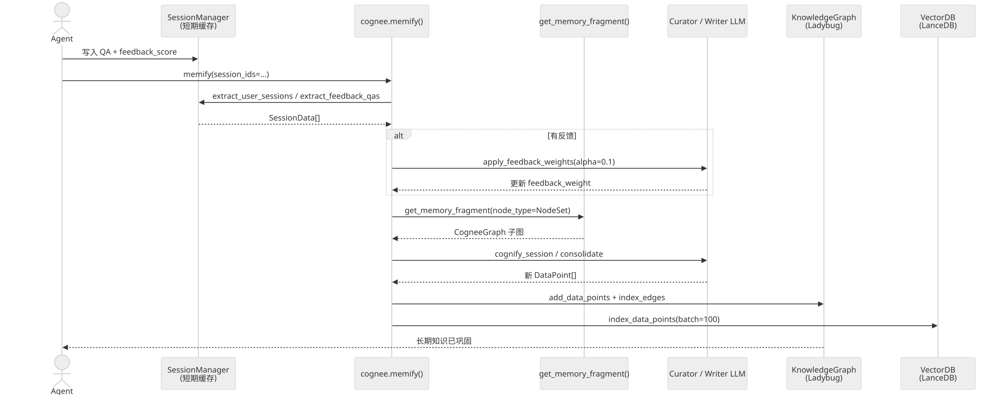

# 第 16 章 `Memify: 自适应记忆巩固`

> 本章目标:读完本章,你将能够
> - 理解 cognee 的"记忆化(memify)"管道与"认知化(cognify)"管道的本质区别
> - 掌握 `cognee.memify()` 的完整签名与各参数的语义
> - 区分 7 种预定义 memify 管道的作用与适用场景
> - 在自己的 Agent 里编排 session → 长期知识图谱的巩固流程
> - 理解 `improve()` 与 `memify()` 的关系

## 前置知识
- 已读完 [[chapter-07-data-model|第 7 章 数据模型与实体:DataPoint / Entity / NodeSet / KnowledgeGraph]](../part-02-architecture/chapter-07-data-model.md),理解 DataPoint、Edge、feedback_weight 字段
- 已读完 [[chapter-14-v2-memory-api|第 14 章 v2 内存 API:`remember` / `recall` / `improve` / `forget`]](./chapter-14-v2-memory-api.md),理解四层记忆模型
- 需要的基础库:`cognee>=1.4.0`、`pydantic>=2.0`、`asyncio`
- 环境:Python 3.10–3.14

## 本章导览
- 16.1 `cognee.memify()` 完整签名:为什么它能"在已有图谱上继续生长"
- 16.2 默认 memify pipeline:三元组 embedding 与 session 认知化
- 16.3 七种预定义 memify pipeline 对照表
- 16.4 feedback weights 与 reward signal:`feedback_alpha` 调参原理
- 16.5 session distillation:短期上下文如何压缩为长期课程
- 16.6 与 `improve()` 的关系:`improve()` 是 `memify()` 的产品级编排
- 16.7 短期 → 长期巩固时序图

---

## 16.1 `cognee.memify()` 完整签名

`cognee.memify()` 与 `cognee.cognify()` 的关键区别在于**起点**:`cognify()` 把原始文档切碎、提图、入库,而 `memify()` 默认**不切文档**,它直接读取已存在的知识图谱(通过 `get_memory_fragment()`),在图上做"再加工"。这是 cognee 设计哲学里"短期 → 长期"的桥梁。

完整签名见 `<COGNEE_REPO>/cognee/modules/memify/memify.py` 第 25–129 行:

```python
async def memify(
    extraction_tasks: Union[List[Task], List[str]] = None,
    enrichment_tasks: Union[List[Task], List[str]] = None,
    data: Optional[Any] = None,
    dataset: Union[str, UUID] = "main_dataset",
    user: User = None,
    node_type: Optional[Type] = NodeSet,
    node_name: Optional[List[str]] = None,
    vector_db_config: Optional[dict] = None,
    graph_db_config: Optional[dict] = None,
    run_in_background: bool = False,
):
    pass  # 源码位置 <COGNEE_REPO>/cognee/modules/memify/memify.py 第 25–129 行,签名节选
```

参数逐项拆解:

| 参数 | 语义 | 关键细节 |
|---|---|---|
| `extraction_tasks` | 从已有图谱中"抽取"数据点 | 默认 `[Task(get_triplet_datapoints)]`,前提是 `cognify_config.triplet_embedding=True` |
| `enrichment_tasks` | 在抽出的数据点上"加工" | 默认 `[Task(index_data_points, batch_size=100)]`,即重新写入向量库 |
| `data` | 用户显式传入的原始材料 | 若为 None,memify 会通过 `get_memory_fragment()` 把整张图(或 `node_type`/`node_name` 指定的子图)当作输入 |
| `dataset` | 目标数据集 | 决定走哪份数据库连接 |
| `user` | 多租户上下文 | 默认 None 时用 `get_default_user()` |
| `node_type` | 子图过滤类型 | 默认 `NodeSet`,可换成 `Entity`、`Chunk` 等任意 DataPoint 子类 |
| `node_name` | 子图过滤名称 | 与 `node_type` 配合做"只巩固这一支" |
| `vector_db_config` | 临时覆盖向量库 | 不传则走全局配置 |
| `graph_db_config` | 临时覆盖图库 | 不传则走全局配置 |
| `run_in_background` | 是否异步执行 | True 时返回 `pipeline_run_id` 用于轮询 |

> 关键实现见 `<COGNEE_REPO>/cognee/modules/memify/memify.py` 第 100–106 行:当 `data` 为空时,memify 会调用 `<COGNEE_REPO>/cognee/modules/retrieval/utils/brute_force_triplet_search.py` 中的 `get_memory_fragment()`,把当前 dataset 下的整张图(按 `node_type`/`node_name` 过滤)序列化成一个 `CogneeGraph` 内存对象,作为 pipeline 的起点。

下面是一个最小可运行的示例,展示 memify 的核心调用:

```python
import asyncio
import cognee

async def main():
    # 1. 准备长期知识
    await cognee.add("Postgres 是一个开源关系数据库,支持 JSONB 与向量扩展")
    await cognee.cognify()

    # 2. 在已有图谱上做"巩固":重新生成三元组 embedding
    pipeline_run = await cognee.memify()
    print("memify run:", pipeline_run)

    # 3. 检索已巩固后的图谱
    results = await cognee.search("Postgres 支持哪些特性", "GRAPH_COMPLETION")
    for r in results:
        print(r)

asyncio.run(main())
```

## 16.2 默认 memify pipeline

默认 memify 的真正"任务列表"在 `<COGNEE_REPO>/cognee/memify_pipelines/memify_default_tasks.py` 第 8–25 行。代码极简:

```python
def get_default_memify_extraction_tasks():
    from cognee.modules.cognify.config import get_cognify_config
    if not get_cognify_config().triplet_embedding:
        return []
    return [Task(get_triplet_datapoints, triplets_batch_size=100)]


def get_default_memify_enrichment_tasks():
    return [Task(index_data_points, task_config={"batch_size": 100})]


def get_session_memify_tasks():
    """Return (extraction_tasks, enrichment_tasks) for session cognification."""
    return (
        [Task(extract_user_sessions)],
        [Task(cognify_session)],
    )
```

理解这张表的三点:

1. **`triplet_embedding` 开关**:若 `cognify_config.triplet_embedding=False`,默认 extraction 阶段返回空列表,memify 实质上变成"只重新建索引"——这种用法对大规模图谱降级很有用。
2. **`get_triplet_datapoints`**(`<COGNEE_REPO>/cognee/tasks/memify/get_triplet_datapoints.py`):遍历图谱中所有类型为 `Triplet` 的边,把每条 (head, relation, tail) 转成 DataPoint,并保留 `feedback_weight`、`importance_weight`。
3. **session 模式**:`extract_user_sessions → cognify_session` 是把 session 缓存里的问答对固化到主图的核心两步,详见 16.5 节。

## 16.3 七种预定义 memify pipeline

`<COGNEE_REPO>/cognee/memify_pipelines/` 目录提供 7 个开箱即用的高阶包装。它们都内部分两步:构造 `extraction_tasks` 与 `enrichment_tasks`,然后调 `cognee.memify()`。

| Pipeline | 文件 | 主要任务组合 | 适用场景 |
|---|---|---|---|
| `apply_feedback_weights_pipeline` | `apply_feedback_weights.py` | `extract_feedback_qas` → `apply_feedback_weights(alpha)` | 用户打分后,把正负反馈写回图边权 |
| `apply_frequency_weights_pipeline` | `apply_frequency_weights.py` | `extract_feedback_qas` → `apply_frequency_weights` | 按访问频率调整图边权,实现热度感知 |
| `consolidate_entity_descriptions_pipeline` | `consolidate_entity_descriptions.py` | `get_entities_with_neighborhood` → `generate_consolidated_entities` + `add_data_points` | 实体描述随时间碎片化,LLM 合并生成新描述 |
| `create_triplet_embeddings` | `create_triplet_embeddings.py` | `get_triplet_datapoints` → `index_data_points` | 重建/补齐三元组 embedding |
| `global_context_index_pipeline` | `global_context_index.py` | `extract_global_context_index_input` → `update_global_context_index` | 建全局上下文索引,支持图/向量 bucketing |
| `persist_sessions_in_knowledge_graph_pipeline` | `persist_sessions_in_knowledge_graph.py` | `extract_user_sessions` → `cognify_session` | 把 session 缓存里的问答写入主图 |
| `persist_agent_trace_feedbacks_in_knowledge_graph_pipeline` | `persist_agent_trace_feedbacks_in_knowledge_graph.py` | `extract_agent_trace_feedbacks` → `cognify_agent_trace_feedback` | 把 Agent 每步反馈写入图谱,支持 `last_n_steps` 截断 |

调用样例(把 QA 反馈写回边权):

```python
import asyncio
import cognee
from cognee.modules.users.methods import get_default_user
from cognee.memify_pipelines.apply_feedback_weights import (
    apply_feedback_weights_pipeline,
)

async def main():
    user = await get_default_user()         # 必须显式传入 User 对象
    # 假定已经有若干 session 缓存了 QA + 评分
    result = await apply_feedback_weights_pipeline(
        user=user,
        session_ids=["sess_001", "sess_002"],
        dataset="main_dataset",
        alpha=0.1,                # feedback_alpha,默认 0.1
        batch_size=100,
        run_in_background=False,
    )
    print("feedback weights applied:", result)

asyncio.run(main())
```

调用样例(实体描述合并):

```python
import asyncio
from cognee.memify_pipelines.consolidate_entity_descriptions import (
    consolidate_entity_descriptions_pipeline,
)

async def main():
    await consolidate_entity_descriptions_pipeline()

asyncio.run(main())
```

## 16.4 feedback weights 与 reward signal

`feedback_weight` 与 `importance_weight` 是 cognee 给图谱加的"可学习"维度:前者由用户反馈驱动,后者由数据本身的统计特性(出现频次、是否来自权威源)驱动。两者共同影响 `get_memory_fragment()` 的投影逻辑。

### `feedback_alpha` 的数学含义

`apply_feedback_weights_pipeline(..., alpha=0.1)` 中 `alpha` 表示**单次反馈对边权的最大更新幅度**:

```
new_weight = old_weight * (1 - alpha) + reward * alpha
```

其中 `reward ∈ [0, 1]` 来自 session QA 评分 `feedback_score`(`QAEntry.feedback_score` 为整数 `1..5`,在 `<COGNEE_REPO>/cognee/tasks/memify/apply_feedback_weights.py` 第 43–50 行的 `normalize_feedback_score()` 中归一化为 `(feedback_score - 1) / 4`,1 = 最差、5 = 最好)。`alpha=0.1` 表示每次只调整 10%,这避免了**单次反馈噪声**污染图谱,也让"长期受欢迎的答案"慢慢胜出。`alpha` 取值范围 `(0, 1]`,默认 0.1,在 `<COGNEE_REPO>/cognee/memify_pipelines/apply_feedback_weights.py` 第 41–42 行有强制校验。

### 元数据去重

`<COGNEE_REPO>/cognee/tasks/memify/feedback_weights_constants.py` 第 1 行定义了 `MEMIFY_METADATA_FEEDBACK_WEIGHTS_APPLIED_KEY = "feedback_weights_applied"`,每条 QAEntry 被打分应用后会写入该标记,**防止同一反馈被多次加权**(replay 攻击防护)。

### retrieval 侧的影响

`<COGNEE_REPO>/cognee/modules/retrieval/utils/brute_force_triplet_search.py` 第 70–74 行:`feedback_influence > 0` 时,`feedback_weight` 自动进入三元组距离惩罚 `triplet_distance_penalty`,最终排序时高分三元组优先返回。这意味着好的反馈会"自我增强":被打高分的答案对应的实体在下次搜索时更容易被召回。

## 16.5 session distillation

短期记忆(一次会话里发生过什么)要变成长期记忆(图中可复用的实体关系)需要两层蒸馏:

1. **粗蒸馏**:`persist_sessions_in_knowledge_graph_pipeline` 直接把 session 里的 Q/A 文本当成新文档,跑一遍 `cognify_session`,新节点打 `node_set="user_sessions_from_cache"` 标签。
2. **细蒸馏**:`<COGNEE_REPO>/cognee/modules/session_distillation/distill.py` 实现了 `distill_session()`:它通过 curator LLM 把会话按 batch 切片,writer LLM 比对已有图谱,只写入"足够新颖"的课程(lesson),失败是 fail-open 的(单个 lesson 失败不影响整次)。



注意:`consolidate_entity_descriptions` 与 `session_distillation` 都属于"LLM 在图上再加工",但作用对象不同——前者合并实体描述,后者从 session 中挖掘新结构。

## 16.6 与 `improve()` 的关系

第 14 章我们学过 `cognee.improve()` 是 v2 内存 API 里的"强化"动作。`improve()` 实际上是 `memify()` 的**编排层**,由 `<COGNEE_REPO>/cognee/api/v1/improve/improve.py` 实现。它在 `session_ids` 给定时,按以下顺序串起多个 memify 流水线(阶段编号对应 `improve.py` 内部 `_bridge_sessions` / `_persist_session_traces` / `_distill_sessions` / `memify()` 等逻辑):

1. `apply_feedback_weights_pipeline(session_ids, alpha=0.1)`
2. `persist_sessions_in_knowledge_graph_pipeline(session_ids)`
3. `persist_agent_trace_feedbacks_in_knowledge_graph_pipeline(session_ids)`(每步 Agent trace 落图)
4. `distill_session(session_id)`(细蒸馏,产出 `node_set="session_learnings"`)
5. 可选 `global_context_index_pipeline(rebuild=True)`
6. 可选 `build_truth_subspace`

随后还会跑一次默认 `memify()` 完成三元组 embedding 重建与向量索引的 enrichment(Stage 3)。所有"bridge session"步骤都是 fail-open 的,单步失败不会中断 `improve()`。

也就是说,**`memify()` 是原子操作**,**`improve()` 是把这些原子操作编成一首"强化进行曲"**。需要细粒度控制时调 `memify`,产品级一键强化时调 `improve`。

```python
import asyncio
import cognee

async def main():
    # 一键强化:对若干 session 做完整的"反馈→落图→蒸馏"
    await cognee.improve(
        session_ids=["sess_001", "sess_002"],
        build_global_context_index=True,
    )

asyncio.run(main())
```

## 16.7 短期 → 长期巩固时序

下面这张时序图把本章讲过的所有角色连起来,展示一段 Agent 会话是如何从"短期缓存"演化为"长期知识"的。



---

## 小结

- `cognee.memify()` 是 cognee 在已有图谱上做"再加工"的统一入口,核心差异是它从 `get_memory_fragment()` 取图而非从原始文档切碎
- 默认 memify 的两个任务:`get_triplet_datapoints`(重生成三元组 embedding)+ `index_data_points`(重建向量索引)
- 7 种预定义 pipeline 各司其职:反馈加权、频率加权、描述合并、三元组 embedding、全局索引、session 落图、agent trace 落图
- `feedback_alpha` 默认 0.1 控制单次反馈的最大更新幅度,`MEMIFY_METADATA_FEEDBACK_WEIGHTS_APPLIED_KEY` 防止 replay 重复加权
- session distillation 通过 curator/writer 两段 LLM 做"细蒸馏",与"粗蒸馏"的 `persist_sessions_in_knowledge_graph` 形成层次
- `cognee.improve()` 是 `cognee.memify()` 的产品级编排,内部串联多条 memify pipeline

## 实践作业

1. **(基础)** 跑通 16.1 节的最小示例,观察 memify 前后的 `cognee.search()` 返回差异
2. **(进阶)** 修改 `apply_feedback_weights_pipeline` 的 `alpha` 为 0.01 与 0.5,观察两次调用后 `feedback_weight` 的变化幅度,记录到 `cognee-memify-feedback-alpha.md`
3. **(挑战)** 自己编排一个 memify pipeline:把 `consolidate_entity_descriptions` 与 `apply_feedback_weights` 串联,先合并描述,再按反馈加权

## 推荐阅读

- [[chapter-14-v2-memory-api|第 14 章 v2 内存 API:`remember` / `recall` / `improve` / `forget`]](./chapter-14-v2-memory-api.md):深入 `improve()` 的状态机
- [[chapter-25-migration|第 25 章 数据迁移:Mem0 / Zep(Graphiti) / Letta / COGXArchive]](../part-05-production/chapter-25-migration.md):memify 在迁移中的作用
- 源码:`<COGNEE_REPO>/cognee/modules/memify/memify.py`
- 源码:`<COGNEE_REPO>/cognee/memify_pipelines/`
- 源码:`<COGNEE_REPO>/cognee/modules/session_distillation/distill.py`
- 示例:`<COGNEE_REPO>/examples/demos/remember_recall_improve_example.py`

## 下一章预告

第 17 章将介绍 `search` 18 种 SearchType 的统一基类 `BaseRetriever`,以及三段式 retrieve → rerank → completion 的工程实现。