# 第 17 章 `Custom Pipelines: 自定义管道与 DAG`

> 本章目标:读完本章,你将能够
> - 区分“复用 cognify 默认任务”和“从 Python 函数构造管道”两种自定义方式
> - 使用经典 `Task`、`run_custom_pipeline` 与新式 `BoundTask` API 编排业务流程
> - 为组织架构、HR 简历筛选等真实场景设计可执行的任务链
> - 识别当前版本中 `cognee.cognify(tasks=...)` 与 `@register_task` 的兼容性边界

## 前置知识

- 已读完 [[chapter-08-pipelines|第 8 章 管道引擎 Pipelines:Task / Pipeline / DAG]](../../part-02-architecture/chapter-08-pipelines.md)
- 需要的基础库:`cognee>=1.4.0`、`pydantic>=2.0`、`asyncio`
- 环境:Python 3.10–3.14,默认栈 SQLite + LanceDB + Ladybug

## 本章导览

- 17.1 先按改动范围选择 API
- 17.2 复用并替换默认 cognify 任务列表
- 17.3 用 `run_custom_pipeline` 编排任意 Python 函数
- 17.4 自定义 task 与新式 `BoundTask` API
- 17.5—17.7 三个真实业务示例
- 17.8 与 LCEL、LlamaIndex Pipeline 的简要对比

---

## 17.1 两种自定义方式

为什么不把所有业务都塞进 `cognify`?默认认知化管道针对通用文本,固定完成分类、切片、图抽取、
持久化和外键边补全。业务若只想改变图模型、prompt 或 chunk 大小,直接传 `graph_model`、
`custom_prompt`、`chunk_size` 即可;只有任务顺序或数据契约发生变化时,才需要自定义 Pipeline(管道)。

两种方式的边界如下:

| 方式 | 输入 | 适合场景 | 运行时能力 |
|---|---|---|---|
| A. 复用/替换 cognify 任务列表 | `list[Task]` | 保留默认 ECL 主干,插入或替换一步 | dataset 鉴权、状态、缓存、后台模式 |
| B. Python 函数 pipeline | 任意 callable 包装成 `Task` | JSON、业务对象、规则抽取等非标准输入 | 由 `run_custom_pipeline` 接入经典运行时 |
| 新式进阶 | `list[BoundTask]` | 内存数据的轻量函数组合 | context、遥测、provenance,但无完整 PipelineRun |

当前基线必须特别说明:源码
`<COGNEE_REPO>/cognee/api/v1/cognify/cognify.py` 的 `cognify` 签名没有显式
`tasks` 参数。网上旧代码中的 `cognee.cognify(tasks=[...])` 表达的是“覆盖任务列表”的经典思路,
但在 1.4.0 中 `**kwargs` 会继续传给默认图抽取 task,并不会替换 pipeline。可靠写法是取得
`get_default_tasks()` 的结果,修改列表后交给 `cognee.run_custom_pipeline(...)`。不要让一个看似被接受的
keyword argument 掩盖版本差异。



---

## 17.2 方式 A:替换 cognify 任务列表

为什么先复用默认列表再改,而不是复制五步代码?因为 `get_default_tasks()` 已经解析 ontology、LLM 最大
chunk token、`chunks_per_batch` 与 triplet embedding 配置。复制代码容易在升级后漏掉默认参数。
默认列表的组装位置是
`<COGNEE_REPO>/cognee/api/v1/cognify/cognify.py`,经典执行器位于
`<COGNEE_REPO>/cognee/modules/pipelines/operations/pipeline.py`。

下面是在默认图抽取前加入过滤 task 的完整模式:

```python
import asyncio
import cognee
from cognee.api.v1.cognify.cognify import get_default_tasks
from cognee.modules.pipelines import Task
from cognee.modules.users.methods import get_default_user

async def keep_nonempty(items):
    return [item for item in items if getattr(item, "text", "").strip()]

async def main():
    await cognee.add("Cognee 把文本转换为可检索的知识图。", dataset_name="docs")
    user = await get_default_user()
    tasks = await get_default_tasks(user=user)
    tasks.insert(2, Task(keep_nonempty))
    await cognee.run_custom_pipeline(
        tasks=tasks,
        user=user,
        dataset="docs",
        pipeline_name="filtered_cognify",
    )

asyncio.run(main())
```

插入位置必须服从输入输出契约:第 0 步接收 `Data`,分类后产生 `Document`,切片后产生 `Chunk`,
图抽取后产生 `DataPoint`,最后才可交给 `add_data_points`。相关真实实现分别位于:

- `<COGNEE_REPO>/cognee/tasks/documents/classify_documents.py`
- `<COGNEE_REPO>/cognee/tasks/documents/extract_chunks_from_documents.py`
- `<COGNEE_REPO>/cognee/tasks/graph/extract_graph_and_summarize.py`
- `<COGNEE_REPO>/cognee/tasks/storage/add_data_points.py`

---

## 17.3 方式 B:run_custom_pipeline Python DSL

为什么称它为 Python DSL?因为任务就是普通同步函数、coroutine、generator 或 async generator;
`Task` 只为它们补上批处理和参数绑定语义。实现
`<COGNEE_REPO>/cognee/modules/run_custom_pipeline/run_custom_pipeline.py` 会把 `data` 送给第一步,
再通过经典 `run_pipeline` 逐步传递结果。它还暴露 `use_pipeline_cache`、`incremental_loading`、
`data_per_batch`、`run_in_background`、`data_cache` 与 `skip_connection_test`。

从第 13 章的 `add → cognify → search` 调用继续向下拆,可以写出不依赖 LLM 的业务管道:

```python
import asyncio
import cognee
from cognee.modules.pipelines import Task

async def normalize(rows):
    return [{"name": row["name"].strip(), "level": int(row["level"])} for row in rows]

def select_senior(rows):
    return [row for row in rows if row["level"] >= 5]

async def main():
    result = await cognee.run_custom_pipeline(
        tasks=[Task(normalize), Task(select_senior)],
        data=[{"name": " Alice ", "level": "6"}, {"name": "Bob", "level": "3"}],
        dataset="hr_demo",
        pipeline_name="senior_filter",
        skip_connection_test=True,
    )
    print(result)

asyncio.run(main())
```

`run_in_background=True` 适合大批量数据,但返回的是运行信息而不是最终业务对象。`data_per_batch` 控制
数据项并发,而 `Task(..., task_config={"batch_size": 20})` 控制相邻步骤的传递批大小;两者不能互换。
若 task 会调用 LLM 或 embedding,不要设置 `skip_connection_test=True`。

### 17.3.1 先写数据契约,再排任务顺序

自定义管道最常见的故障不是“函数不能运行”,而是相邻 task 对同一对象的理解不同。设计时应为每一步
写下三项契约:输入元素类型、输出元素类型、是否会修改原对象。例如 `Document → Chunk → DataPoint`
是合法主链;若过滤器返回 `list[dict]`,后面的 `add_data_points` 就无法把普通字典解释为带 metadata 的
图节点。能用 Pydantic 或 DataPoint 表达的中间结果,不要只靠注释约定字段。

经典执行器会把前一步产物递归送往后一步。普通函数和 coroutine 通常产生单个结果;generator 与
async generator 可以持续产出元素,并按下游 `batch_size` 聚合。因而一个 task 返回“一个列表”与
逐个 `yield` 列表中的元素并不等价:前者把列表当作一次产物,后者允许执行器分批送给下游。开始编码前
先决定粒度,可以避免多嵌套一层 list 的隐蔽错误。

### 17.3.2 缓存、增量与幂等性

`use_pipeline_cache` 判断相同 pipeline 是否已有运行或完成记录;`incremental_loading` 与 `data_cache`
则根据 Cognee Data 模型中的内容 hash 跳过未变化数据。它们都不能自动保证业务 task 幂等。如果一个
自定义步骤会发邮件、调用付款 API 或写外部系统,重试就可能产生第二次副作用。稳妥做法是让 task 只
生成待执行的 DataPoint,在管道外用唯一业务键提交副作用;或者在外部系统保存
`pipeline_name + source_content_hash` 作为幂等键。

错误处理也应保持单一职责:task 遇到无法满足契约的数据就抛异常,让经典运行时记录失败和执行回滚;
不要捕获所有异常后返回空列表,否则 PipelineRun 可能显示成功,但图谱实际缺了一段。只有“该条数据按
业务规则应被忽略”时才使用过滤语义。批量任务还应在小样本上验证边界,再逐步提高 `data_per_batch`,
以免 LLM 限流与数据库连接池同时成为瓶颈。

---

## 17.4 @register_task 自定义 task

为什么这一节标题保留 `@register_task`?它是一些早期设计稿中对“注册 task”的称呼,但当前源码
`<COGNEE_REPO>/cognee/modules/pipelines/tasks/task.py` **没有公开的 `register_task` 符号**。
1.4.0 的正式装饰器是 `@task`:它返回 `TaskSpec`;调用 `TaskSpec` 才得到延迟执行的 `BoundTask`。
把自定义实现放在项目自己的模块即可;若准备贡献给 Cognee,再按领域放入
`<COGNEE_REPO>/cognee/tasks/` 的相应子目录。

新式 `run_pipeline` 的进阶用法如下:

```python
import asyncio
from cognee.pipelines import task
from cognee.modules.pipelines.operations.run_pipeline import run_pipeline

@task
def parse(text: str) -> list[str]:
    return [part.strip() for part in text.split(",")]

@task(enriches=False)
def label(parts: list[str], prefix: str = "tag") -> list[str]:
    return [f"{prefix}:{part}" for part in parts]

async def main():
    results = await run_pipeline(
        [parse(), label(prefix="skill")],
        data="python, graph, memory",
        dataset="rules",
        pipeline_name="bound_task_rules",
        context={"source": "coding-agent"},
    )
    print(results)

asyncio.run(main())
```

新入口
`<COGNEE_REPO>/cognee/modules/pipelines/operations/run_pipeline.py` 会验证每一步都是
`BoundTask`,合并调用时 kwargs,构造 `PipelineContext`,再委托 `run_tasks_base`。它不会自动读取 dataset,
也不创建完整的 `PipelineRun`;需要数据集锁、缓存或后台执行时,仍选 `run_custom_pipeline`。

### 17.4.1 `@task` 的三种实用语义

第一种是声明默认配置:`@task(batch_size=20)` 把批大小留在 `TaskSpec`;某次调用还可用
`extract(batch_size=5)` 覆盖。第二种是 `enriches=True`:task 原地修改输入且返回 `None` 时,执行器会
继续传递原输入,适合补标签或 metadata。第三种是 `.direct(...)`:它绕过 Pipeline,直接调用底层函数,
适合单元测试输入输出契约。测试应分别覆盖 `.direct()` 的纯函数行为和完整 pipeline 的传递行为。

`PipelineContext` 也不是全局变量。只有函数签名显式声明 `ctx` 时,执行器才会传入上下文;业务配置可放
在 `context` 的 extras 中,用户、dataset 与 pipeline 名则由强类型字段承载。这样一个 task 可以读取
租户或来源信息,同时保持普通函数可独立测试。不要在模块导入时读取“当前 dataset”,因为并发运行时
不同 pipeline 会共享模块状态。

如果要包装自己无法修改的第三方函数,使用 `task(existing_function, batch_size=...)`;如果要走经典
运行时,则显式写 `Task(existing_function, ...)`。两种包装不可混装:新式 `run_pipeline` 要求调用后的
`BoundTask`,经典 `run_custom_pipeline` 要求 `Task`。类型检查报“Did you forget to call the task?”时,
通常是把 `TaskSpec` 本身放进了列表,正确形式应是 `my_task()`。

---

## 17.5 示例 1:替换默认 cognify 任务

我有一个“重建 add 与 cognify,但需要控制每一步”的问题,可以直接复用官方示例
`<COGNEE_REPO>/examples/custom_pipelines/custom_cognify_pipeline_example.py`。其核心代码先构造 add
任务,再取得默认 cognify 任务:

```python
import asyncio
import cognee
from cognee.api.v1.cognify.cognify import get_default_tasks
from cognee.modules.engine.operations.setup import setup
from cognee.modules.pipelines import Task
from cognee.modules.users.methods import get_default_user
from cognee.tasks.ingestion import ingest_data, resolve_data_directories

async def main():
    await setup()
    user = await get_default_user()
    add_tasks = [
        Task(resolve_data_directories, include_subdirectories=True),
        Task(ingest_data, "main_dataset", user),
    ]
    await cognee.run_custom_pipeline(
        tasks=add_tasks,
        data="Natural language processing is a field of computer science.",
        user=user,
        dataset="main_dataset",
        pipeline_name="add_pipeline",
    )

    cognify_tasks = await get_default_tasks(user=user)
    await cognee.run_custom_pipeline(
        tasks=cognify_tasks,
        user=user,
        dataset="main_dataset",
        pipeline_name="cognify_pipeline",
    )

asyncio.run(main())
```

这正是方式 A 在当前版本中的可运行形式。生产代码应给修改后的 pipeline 使用独立
`pipeline_name`,否则缓存、日志和排障时难以区分默认与自定义运行。

---

## 17.6 示例 2:组织架构图谱

我有一个“companies.json 与 people.json 已结构化,不想让 LLM 重新猜关系”的问题,可以直接把
Pydantic/DataPoint 的嵌套关系转换成图。高层示例位于
`<COGNEE_REPO>/examples/custom_pipelines/organizational_hierarchy/organizational_hierarchy_pipeline_example.py`,
低层 Task API 版本位于
`<COGNEE_REPO>/examples/custom_pipelines/organizational_hierarchy/organizational_hierarchy_pipeline_low_level_example.py`。

```python
import asyncio
import cognee
from cognee.low_level import DataPoint
from cognee.modules.pipelines import Task
from cognee.tasks.storage import add_data_points

class Person(DataPoint):
    name: str
    metadata: dict = {"index_fields": ["name"], "identity_fields": ["name"]}

class Department(DataPoint):
    name: str
    employees: list[Person]
    metadata: dict = {"index_fields": ["name"], "identity_fields": ["name"]}

class Company(DataPoint):
    name: str
    departments: list[Department]
    metadata: dict = {"index_fields": ["name"], "identity_fields": ["name"]}

def ingest_files(rows):
    return [
        Company(
            name=row["company"],
            departments=[Department(
                name=row["department"],
                employees=[Person(name=row["person"])],
            )],
        )
        for row in rows
    ]

async def main():
    await cognee.run_custom_pipeline(
        tasks=[Task(ingest_files), Task(add_data_points)],
        data=[{"company": "GreenFuture", "department": "R&D", "person": "Alice"}],
        dataset="org",
        pipeline_name="organizational_hierarchy",
    )

asyncio.run(main())
```

`identity_fields` 让同名业务实体获得稳定身份,避免手写去重字典。嵌套字段不仅是 JSON 结构:
`Company.departments` 会形成公司到部门的关系,`Department.employees` 会形成部门到员工的关系;
`index_fields` 则指出哪些文本字段需要进入向量索引。对这类确定性数据,直接建模通常比“先序列化为
自然语言再让 LLM 抽取”更便宜、更稳定,也更容易验证边的方向。

真实数据往往把公司与人员拆在两个文件中。应先按 department 名聚合员工,再创建共享的 Department
对象,最后将其挂到 Company;否则每读到一名员工就创建新部门,会依赖后端去重并增加无意义写入。
缺失部门可以显式创建空 `employees` 列表,但公司名、部门名等 identity 字段缺失时应尽早报错,不要把
“Unknown”当成所有缺失实体的共同身份。

低层示例使用 `load_or_create_datasets` 和 `run_tasks(...)` 的 async generator,适合必须逐条消费运行
状态、精确持有 dataset UUID 的场景。高层 `run_custom_pipeline` 更适合一般应用:它统一处理用户与
数据集解析,也减少业务代码直接依赖内部状态模型的范围。

---

## 17.7 示例 3:HR 简历 pipeline 动态分支

我有一个”重建图和检索不必每次都执行”的问题,可以让控制平面动态选择步骤。真实示例
`<COGNEE_REPO>/examples/custom_pipelines/dynamic_steps_resume_analysis_hr_example.py` 使用配置字典控制
剪枝、摄取、认知化和检索。开关名为 `prune_data`、`prune_system`、`add_text`、`cognify`、`retriever`,
分别独立控制每一步。这里的”动态分支”是 Python 控制流,不是运行时自动改写 DAG:

```python
import asyncio
import cognee
from cognee import SearchType

async def main(enable_steps, text_list):
    if enable_steps.get("prune_data"):
        await cognee.prune.prune_data()
    if enable_steps.get("prune_system"):
        await cognee.prune.prune_system(metadata=True)
    if enable_steps.get("add_text"):
        for text in text_list:
            await cognee.add(text)
    if enable_steps.get("cognify"):
        await cognee.cognify()
    if enable_steps.get("retriever"):
        return await cognee.search(
            query_text="Who has experience in design tools?",
            query_type=SearchType.GRAPH_COMPLETION,
        )
    return []

steps = {
    "prune_data": True,
    "prune_system": True,
    "add_text": True,
    "cognify": True,
    "retriever": True,
}
asyncio.run(main(steps, ["Alice: Python, Spark", "David: Photoshop, Illustrator"]))
```

这种模式适合开发、回放和定时任务;生产环境应把 `prune_data` / `prune_system` 默认设为 `False`,
保留 `add_text`、`cognify`、`retriever`,并把开关来源纳入审计。
同目录还有两种可迁移模式:采购示例
`<COGNEE_REPO>/examples/custom_pipelines/agentic_reasoning_procurement_example.py` 先按节点集多轮召回,
再由 LLM 汇总价格、交付、保修与历史表现;编码 Agent 示例
`<COGNEE_REPO>/examples/custom_pipelines/memify_coding_agent_rule_extraction_example.py` 则以
`extract_subgraph_chunks → add_rule_associations` 从对话轨迹蒸馏可召回的 coding rules。前者是多步推理,
后者是对已有图的二次记忆化,都能复用本章的“步骤有明确契约”原则。

---

## 17.8 与 LangChain LCEL / LlamaIndex 对比

为什么不直接套用另一个编排框架?如果管道重点是通用工具调用、模型串联或复杂条件状态机,外部框架可能
更成熟;如果重点是 Cognee 的 dataset、图/向量持久化、provenance 和认知化任务,原生 Pipeline 更短。

| 维度 | Cognee Pipeline | LangChain LCEL | LlamaIndex Pipeline |
|---|---|---|---|
| 核心组合单元 | `Task` / `BoundTask` | `Runnable` | event/component |
| 默认数据流 | 上一步输出进入下一步 | pipe、map、parallel | event 驱动步骤 |
| 知识图持久化 | `add_data_points` 原生接入 | 需自建 Runnable | 需接索引/存储组件 |
| dataset 运行状态 | 经典 API 内建 | 通常交给 LangSmith/应用层 | 通常由应用层管理 |
| 动态分支 | Python 控制流或拆分 pipeline | branch/router 较方便 | event 路由较方便 |
| 最佳用途 | 记忆摄取、认知化、记忆化 | LLM 调用链与工具组合 | RAG 索引与查询工作流 |

选型不必二选一:外层可用 LCEL 或 LlamaIndex 处理会话和工具路由,内层调用
`cognee.run_custom_pipeline` 落实记忆工程。关键是只让一个系统负责重试和并发,避免双层调度造成重复写入。
团队还应统一运行标识和追踪上下文,让外层工作流的一次调用能够定位到内层 PipelineRun;否则故障发生时,
只能看到两个系统各自成功或失败,却无法还原同一批数据的端到端路径。

## 小结

- 当前 1.4.0 不应直接使用 `cognee.cognify(tasks=[...])`;应修改 `get_default_tasks()` 的结果并交给
  `run_custom_pipeline`。
- 经典 `Task` 管道适合 dataset 级执行;新式 `TaskSpec → BoundTask` 适合轻量、可读的函数组合。
- 当前正式装饰器是 `@task`,不存在公开的 `@register_task`;输入输出契约比装饰器名称更重要。
- 组织架构可用 DataPoint 嵌套关系确定性建图,HR 动态步骤则由显式 Python 控制流完成。
- `data_per_batch`、task `batch_size` 和业务分支分别控制并发、批传递与 DAG 选择,不要混为一谈。

## 实践作业

1. **(基础)** 运行
   `<COGNEE_REPO>/examples/custom_pipelines/custom_cognify_pipeline_example.py`,打印默认任务的
   executable 名称,再加入一个不改变数据的审计 task。
2. **(进阶)** 修改组织架构示例,增加 `Project` DataPoint 和“员工参与项目”的关系;分别用
   `run_custom_pipeline` 与低层 `run_tasks` 运行并比较返回结果。
3. **(挑战)** 把 HR 开关改造成“先做词法预筛,候选数超过阈值才 cognify”的两阶段流程,记录每个
   `pipeline_name`、耗时和输入数量,并设计失败后可安全重跑的策略。

## 推荐阅读

- [[chapter-08-pipelines|第 8 章 管道引擎 Pipelines:Task / Pipeline / DAG]](../../part-02-architecture/chapter-08-pipelines.md)
- [[chapter-21-frameworks|第 21 章 Strands / LangGraph / CrewAI / Google ADK 集成(主流 4 框架)]](../part-04-integrations/chapter-21-frameworks.md)
- 新式运行时:`<COGNEE_REPO>/cognee/modules/pipelines/operations/run_pipeline.py`
- 完整示例目录:`<COGNEE_REPO>/examples/custom_pipelines/`

## 下一章预告

第 18 章将介绍 `cognee.agent_memory` 与子代理,把本章的自定义数据流接入 Agent 的记忆生命周期。
