# 第 18 章 `Agent Memory: cognee.agent_memory 与子代理`

> 本章目标:读完本章,你将能够
> - 把 plan、scratchpad 摘要和 tool call 结果写入 Session 或 Cognee 长期记忆
> - 用 `cognee.agent_memory` 在 Agent 调用前召回记忆,并自动注入 Cognee 的 LLM 调用
> - 创建子代理(sub-agent)身份,管理运行连接,并查询 Session 的 QA、Trace 与 Feedback
> - 让跨进程 Agent 通过 REST API 注册、查看连接和检查会话

## 前置知识

- 已读完 [[chapter-14-v2-memory-api|第 14 章 v2 内存 API:`remember` / `recall` / `improve` / `forget`]](./chapter-14-v2-memory-api.md),理解
  `remember`、`recall` 与 `MemoryEntry`
- 已读完 [[chapter-15-search-type-tour|第 15 章 SearchType 全景与选型:18 种检索类型逐项详解]](./chapter-15-search-type-tour.md),理解
  `GRAPH_SUMMARY_COMPLETION` 与 `AGENTIC_COMPLETION`
- 需要的基础库:`cognee>=1.4.0`、`pydantic>=2.0`、`asyncio`
- 环境:Python 3.10–3.14;使用 Session 功能时需在导入 `cognee` 前设置 `CACHING=true`

## 本章导览

- 18.1 `cognee.modules.agent_memory`:装饰器、运行上下文与自动注入
- 18.2 `cognee.agents`:子代理身份和运行连接的完整 SDK API
- 18.3 `cognee.session`:QA、Trace、Feedback 与会话指标
- 18.4 ReAct / Plan-and-Execute:把中间状态变成可召回记忆
- 18.5 REST API:供独立进程、容器和远程 Agent 使用
- 18.6 POCs 与示例:从官方演示理解短期记忆到长期图谱的桥接
- 18.7 Agent ↔ Cognee 流程:把各入口串成一条工程闭环

---

## 18.1 cognee.modules.agent_memory

普通函数只看到本次调用参数,这会让 Agent 在新一轮执行时重复探索。`cognee.agent_memory` 的做法是:先为异步
入口建立调用上下文,从 Session 和知识图召回相关记忆,再运行 Agent,最后按配置保存成功或失败的 Trace。
顶层导出位于 `<COGNEE_REPO>/cognee/__init__.py`,实现入口位于
`<COGNEE_REPO>/cognee/modules/agent_memory/decorator.py`。

需要先澄清一个容易造成错误代码的名称:当前基线没有公开的 `AgentMemory` 类,公开入口是
`@cognee.agent_memory(...)` 装饰器。运行态对象叫 `AgentMemoryContext`,定义在
`<COGNEE_REPO>/cognee/modules/agent_memory/runtime.py`。模块还导出
`get_current_agent_memory_context()`,供外部 LLM 客户端手动读取 `memory_context`。

装饰器的完整参数如下。

| 参数与默认值 | 作用与约束 |
|---|---|
| `agent_session_name=None` | 连接显示名;省略时每次调用生成 UUID |
| `with_memory=True` | 从授权 Dataset 的 Cognee 图记忆召回 |
| `with_session_memory=False` | 注入最近 `session_feedback`;要求开启缓存 |
| `save_session_traces=False` | 调用结束时保存参数、返回值、状态或异常 |
| `memory_query_fixed=None` | 固定召回问题,不能与下一项同时设置 |
| `memory_query_from_method=None` | 从被装饰函数的同名参数取召回问题 |
| `memory_system_prompt=None` | 传给记忆检索的 system prompt |
| `memory_top_k=5` | Cognee 召回的 `top_k` |
| `memory_only_context=False` | 只取检索上下文,不要求生成完整回答 |
| `session_memory_last_n=5` | 读取最近 N 条 Trace feedback,必须为正整数 |
| `session_id=None` | Session 隔离键;不同入口宜使用不同值 |
| `user=None` | 调用者;省略时使用 default user |
| `dataset_name=None` | Dataset;省略时解析为 `main_dataset` |
| `session_trace_summary=True` | 是否用 LLM 为 Trace 生成简短反馈 |
| `persist_session_trace_after=None` | 每累计 N 条 Trace,将最近 N 条记忆化到图中 |
| `persist_session_trace_raw_content=False` | 长期化时是否保留原始 Trace 内容 |
| `persist_session_trace_node_set_name=None` | 长期 Trace 写入的 NodeSet 名称 |

被装饰对象必须是 `async def`。`with_memory=True` 时,有效用户必须对目标 Dataset 同时拥有 read 和 write
权限;Session 相关三项则依赖缓存。内部检索固定使用 `SearchType.GRAPH_SUMMARY_COMPLETION`,合并后的记忆上下文
最多保留 4000 个字符。参数、返回值与异常还会经过限长和可序列化处理。

一次 wrapper 调用依次完成权限解析、连接注册、两路召回、上下文绑定、业务函数执行、Trace 持久化和连接停用。
图召回失败采用 fail-open:记录 warning 后让 Agent 在空记忆下继续运行;业务函数自身的异常则会原样抛出,同时保存
`status="error"` 和错误摘要。这样的边界保证记忆服务短暂不可用时不会阻断主任务,又保留了事后排障证据。嵌套调用
通过 `ContextVar` token 恢复外层上下文,并发异步任务不会共享同一个可变 scratchpad。

为什么它能“自动注入”?装饰器把 `AgentMemoryContext` 放进 `ContextVar`,而
`<COGNEE_REPO>/cognee/infrastructure/llm/LLMGateway.py` 会在每次
`acreate_structured_output()` 前把记忆加到 `text_input`。因此自动注入只覆盖 Cognee 的 `LLMGateway`;
若直接调用 OpenAI 或 Anthropic SDK,应读取 `get_current_agent_memory_context().memory_context` 并自行拼接。

下面的程序先建立图记忆,再让装饰器按 `question` 召回并自动注入。运行前需配置可用的 LLM 与 embedding。

```python
import asyncio

import cognee
from cognee.infrastructure.llm.LLMGateway import LLMGateway

DATASET = "ch18_agent_memory"


@cognee.agent_memory(
    agent_session_name="faq-worker",
    with_memory=True,
    dataset_name=DATASET,
    memory_query_from_method="question",
    memory_only_context=True,
)
async def faq_agent(question: str) -> str:
    return await LLMGateway.acreate_structured_output(
        text_input=question,
        system_prompt="只根据注入的记忆回答;没有依据时回答不知道。",
        response_model=str,
    )


async def main() -> None:
    await cognee.remember(
        "Apollo 项目的发布窗口是每周三 20:00。",
        dataset_name=DATASET,
        self_improvement=False,
    )
    print(await faq_agent("Apollo 项目什么时候发布?"))


asyncio.run(main())
```

---

## 18.2 cognee.agents 子代理管理

子代理管理包含两层对象。`create` 创建的是长期身份:一个归属于当前用户的 child user 和独立 API key;
`register` 创建的是运行连接:某个 Agent 进程当前连接了哪些 Dataset、Session,使用哪种 memory mode。身份可以长期
存在,连接应随进程启动和退出而注册、注销。SDK 实现在
`<COGNEE_REPO>/cognee/api/v1/agents/agents.py`。

### 18.2.1 `agents` API 全方法表

| 方法 | 关键参数 | 返回值与用途 |
|---|---|---|
| `create` | `name,datasets=None,user=None` | 创建子代理,返回 ID、显示邮箱和新 API key |
| `list` | `user=None` | 列出当前用户拥有的子代理,只显示 key label |
| `get` | `agent_id,user=None` | 查看一个归属当前用户的子代理 |
| `delete` | `agent_id,user=None` | 删除子代理身份及其连接记录,返回 `None` |
| `register` | `agent_session_name` 及连接元数据 | 注册活动连接,返回连接字典 |
| `unregister` | `agent_session_name,user=None` | 注销连接,返回当前进程内活动连接数 |
| `list_connections` | `agent_id,range_key,status_filter,...` | 分页查看连接和可选的 memory sources |
| `get_connection` | `agent_id,agent_session_name=None` | 查看连接详情、最近 Session、Trace 与 QA |

`create(..., datasets=[...])` 会先验证调用者对每个 Dataset 的 read 权限,然后给新 Agent 授予 read/write。
API key 只在创建响应中返回原文,后续 `list/get` 只返回 label。

这里要以源码签名为准:本基线没有 `agents.connections(...)`,SDK 方法名是
`agents.list_connections(...)`;也没有 `agents.delete(..., force=True)`,删除只接收 `agent_id` 和可选 `user`。
REST 路径虽然叫 `/connections`,也不等于存在同名 SDK 方法。不要把 CLI 的 `force` 参数套到 Agent API。

以下程序覆盖身份创建、查询、连接注册、连接详情、注销和清理。示例中 `created` 是 child identity;
`connection` 是当前 SDK 进程的运行连接,两者故意分开以展示边界。

```python
import asyncio
from uuid import uuid4

import cognee


async def main() -> None:
    await cognee.add("初始化 Agent 管理示例")
    created = await cognee.agents.create(f"planner-{uuid4().hex[:8]}")
    try:
        print(await cognee.agents.get(created["agent_id"]))
        print(await cognee.agents.list())

        connection_name = f"planner-run-{uuid4().hex[:8]}"
        connection = await cognee.agents.register(
            connection_name,
            type="sdk",
            memory_mode="session",
            session_id="agent-001",
        )
        try:
            page = await cognee.agents.list_connections(
                agent_id=connection["user_id"],
                active_only=True,
            )
            detail = await cognee.agents.get_connection(
                connection["user_id"],
                agent_session_name=connection_name,
            )
            print(page)
            print(detail)
        finally:
            await cognee.agents.unregister(connection_name)
    finally:
        await cognee.agents.delete(created["agent_id"])


asyncio.run(main())
```

`@cognee.agent_memory` 会自动完成一次 SDK connection 的注册与停用;长驻进程、MCP server 或工作流引擎则更适合
显式调用 `register/unregister`。当 `COGNEE_AGENT_MODE=true` 时,注册计数还可用于无人连接后的服务退出。

---

## 18.3 cognee.session 会话管理

为什么 Session 不能只看成聊天记录?因为 Agent 的一次任务同时产生回答、工具轨迹、评价和成本指标。Cognee 把富内容
放在 Session cache,把生命周期和聚合指标放在关系库的 `SessionRecord`。SDK namespace 定义于
`<COGNEE_REPO>/cognee/api/v1/session/__init__.py`,具体方法位于
`<COGNEE_REPO>/cognee/api/v1/session/session.py`。

| `cognee.session` 方法 | 作用 |
|---|---|
| `get_session(session_id,last_n,user)` | 返回 `SessionQAEntry` 列表 |
| `add_feedback(session_id,qa_id,...)` | 给已有 QA 附加文字或 1–5 分 |
| `add_frequency_weights(...)` | 记录本轮用到的 node/edge,供后续强化 |
| `delete_feedback(session_id,qa_id,user)` | 清空已有反馈 |
| `distill_session(session_id,...)` | 把有效会话经验蒸馏为图文档 |

自动记录有明确边界:开启缓存并把 `session_id` 传给 completion retriever 时,生成路径会保存 QA 和 LLM 用量;
`agent_memory(save_session_traces=True)` 会保存函数级 Trace;每个工具调用若也要入库,应显式写 `TraceEntry`。
Feedback 可由应用调用 `add_feedback` 或 `remember(FeedbackEntry(...))` 提交;启用 `AUTO_FEEDBACK=true` 后,
Session turn 还会分析评价型输入,生成反馈证据和候选指导,失败时保持 fail-open。显式评分仍更适合审计。
`get_session()` 只读 QA,Trace 应通过 `recall(scope=["trace"])` 或 Session REST 详情查看。数据模型见
`<COGNEE_REPO>/cognee/memory/entries.py`。

```python
import asyncio
import os

os.environ["CACHING"] = "true"
os.environ["CACHE_BACKEND"] = "fs"

import cognee  # noqa: E402
from cognee import QAEntry  # noqa: E402


async def main() -> None:
    stored = await cognee.remember(
        QAEntry(question="部署失败原因?", answer="磁盘空间不足。"),
        session_id="support-001",
    )
    await cognee.session.add_feedback(
        session_id="support-001",
        qa_id=stored.entry_id,
        feedback_text="原因正确,还应给出清理命令。",
        feedback_score=4,
    )
    entries = await cognee.session.get_session("support-001", last_n=1)
    print(entries[0].model_dump())


asyncio.run(main())
```

---

## 18.4 与 ReAct / Plan-and-Execute 结合

在 ReAct 中,值得保存的是 `Thought` 的操作性摘要、`Action`、工具参数、`Observation` 和最终结果;不要持久化模型的私有
chain-of-thought。Plan-and-Execute 则应先保存版本化 plan,再按步骤保存工具 Trace。Session 是任务内的快速工作记忆,
经筛选或达到阈值后再进入 Cognee 图谱,成为跨任务长期记忆。

下面把 plan、tool call 和 observation 放进同一条 `TraceEntry`,无需 LLM 即可运行和召回。

```python
import asyncio
import os

os.environ["CACHING"] = "true"
os.environ["CACHE_BACKEND"] = "fs"

import cognee  # noqa: E402
from cognee import TraceEntry  # noqa: E402


async def main() -> None:
    session_id = "agent-001"
    await cognee.remember(
        TraceEntry(
            origin_function="search_logs",
            method_params={
                "plan": ["查询错误日志", "核对部署版本", "生成修复建议"],
                "query": "login timeout",
            },
            method_return_value={"observation": "v2.4 登录请求 timeout"},
            generate_feedback_with_llm=False,
        ),
        session_id=session_id,
    )
    traces = await cognee.recall(
        "search_logs timeout",
        session_id=session_id,
        scope=["trace"],
    )
    print(traces)


asyncio.run(main())
```

如果只需要轻量 scratchpad,字符串也能直接写入同一 Session:

```python
import asyncio
import os

os.environ["CACHING"] = "true"
os.environ["CACHE_BACKEND"] = "fs"

import cognee  # noqa: E402


async def main() -> None:
    await cognee.remember(
        "今天用户问了: 登录失败; 我用了 search_logs 工具; 得到了 timeout 结果",
        session_id="agent-001",
        self_improvement=False,
    )
    context = await cognee.recall(
        "登录失败",
        session_id="agent-001",
        scope=["session"],
    )
    print(context)


asyncio.run(main())
```

生产中可让装饰器设置 `persist_session_trace_after=N`,每 N 条 Trace 调用记忆化管道,把近期经验写入 Dataset。
这比每个 token 都长期化更便宜,也能减少噪声。若工具输出包含密钥、PII 或大对象,应在写入前自行脱敏;内置
sanitization 负责限长与序列化,不等于业务级合规过滤。

---

## 18.5 REST API

跨进程 Agent 不应共享 Python `ContextVar`,而应通过 FastAPI 注册连接和查询 Session。仓库原生挂载前缀是
`/api/v1`,见 `<COGNEE_REPO>/cognee/api/client.py`。有些网关把 `/api` 设为 base path,文档中会简写成
`/v1/...`;直接运行仓库服务时应使用下表的完整路径。

| 方法与原生路径 | 关键输入 | 用途 |
|---|---|---|
| `GET /api/v1/agents/list` | 无 | 列出子代理身份 |
| `POST /api/v1/agents/create` | query `name` | 创建身份并返回 API key |
| `GET /api/v1/agents/connections` | `agent_id,range,status,...` | 查看活动连接 |
| `POST /api/v1/agents/register` | `RegisterAgentRequest` JSON | 注册跨进程连接 |
| `GET /api/v1/sessions` | `range,status,limit,offset,...` | 分页列出可见 Session |
| `GET /api/v1/sessions/stats` | `range` | 返回数量、成本、token、成功率 |
| `GET /api/v1/sessions/{id}` | path `id` | 返回元数据及最近 20 条 QA/Trace |

Agent 路由实现见
`<COGNEE_REPO>/cognee/api/v1/agents/routers/get_agents_router.py`,Session dashboard 路由见
`<COGNEE_REPO>/cognee/api/v1/sessions/routers/get_sessions_router.py`。认证开启时可用创建所得 key 放入
`X-Api-Key` 请求头。注册请求示例:

```bash
curl -X POST "$COGNEE_URL/api/v1/agents/register" \
  -H "X-Api-Key: <你的API_KEY>" \
  -H "Content-Type: application/json" \
  -d '{"agent_session_name":"worker-01","type":"api",\
"memory_mode":"hybrid","session_id":"agent-001","dataset_names":["main_dataset"]}'
```

进程退出时应再调用 `POST /api/v1/agents/unregister`;查看单个连接还可使用
`GET /api/v1/agents/connections/{agent_id}`。注意 REST `create` 当前不接收 SDK 的 `datasets` 参数;需要授权时应在
服务端权限流程中完成,不能假设两个入口签名完全相同。

---

## 18.6 POCs 与示例

两个官方 POC 展示了不同的“短期 → 长期”路径。

1. `<COGNEE_REPO>/examples/demos/agentic_session_context_demo.py` 逐条写入五个 `TraceEntry`,周期性提取
   agent profile 指导,再用 `distill_session()` 写入图。`--offline` 模式跳过 LLM 提取,适合先验证失败 Trace 与
   `recall(scope=["trace"])`。
2. `<COGNEE_REPO>/examples/demos/conversation_session_persistence_example.py` 在两个 `session_id` 中连续问答,
   然后调用 `persist_sessions_in_knowledge_graph_pipeline()` 把会话持久化并可视化。
3. `<COGNEE_REPO>/examples/guides/agent_memory_quickstart.py` 对比只读 Session memory 的 support agent 与
   只读图记忆的 FAQ bot,并展示 Trace 达到阈值后后者如何获得知识。

可从低成本路径开始:

```bash
cd <COGNEE_REPO>
uv run python examples/demos/agentic_session_context_demo.py --offline
```

---

## 18.7 Agent ↔ Cognee 流程

下面的流程图把装饰器、Session、长期图谱和 LLM 自动注入放到一条数据流中。虚线表示达到阈值后的异步长期化。



工程上可以据此设置三条边界:用 `session_id` 隔离任务,用 `dataset_name` 隔离长期知识域,用 Agent identity/API key
隔离执行主体。不要把三者都写成同一个字符串;否则权限、审计和遗忘都会变得含混。

## 小结

- `cognee.agent_memory` 是异步装饰器,不是公开的 `AgentMemory` 实例;它负责召回、上下文绑定和 Trace 收尾。
- Cognee `LLMGateway` 会自动注入当前 `memory_context`;外部 LLM SDK 需要手动注入。
- 子代理 identity 与运行 connection 是两层对象;SDK 应使用 `list_connections/get_connection` 查看连接。
- QA、Trace、Feedback 进入 Session cache,筛选后的经验再通过阈值持久化或蒸馏进入长期图谱。
- ReAct 和 Plan-and-Execute 应保存可审计的操作摘要与工具结果,而不是未经筛选的私有推理文本。

## 实践作业

1. **(基础)** 运行 18.4 的 `TraceEntry` 示例,再分别用 `scope=["session"]` 和 `scope=["trace"]` 比较结果。
2. **(进阶)** 给一个 ReAct Agent 加上 `@cognee.agent_memory`,保存成功与失败工具调用,并在下一轮验证自动注入。
3. **(挑战)** 创建两个子代理并分配不同 Dataset,通过 REST 注册连接;验证父用户能看到 Session,而代理不能越权
   读取另一 Dataset,最后蒸馏一条确认有效的经验到长期图谱。

## 推荐阅读

- [[chapter-20-claude-code|第 20 章 Claude Code / Claude Agent SDK 集成(主流)]](../part-04-integrations/chapter-20-claude-code.md)
- 源码:`<COGNEE_REPO>/cognee/modules/agent_memory/`
- 源码:`<COGNEE_REPO>/cognee/api/v1/agents/agents.py`
- 示例:`<COGNEE_REPO>/examples/guides/agent_memory_quickstart.py`

## 下一章预告

第 19 章将介绍 `cognee-cli` 的完整子命令,把本章的 Agent 与 Session 操作迁移到终端和自动化脚本中。
