# 第 19 章 `CLI Manual: cognee-cli 完整子命令手册`

> 本章目标:读完本章,你将能够
> - 直接调用 18 个 `cognee-cli` 命令文件(共注册 22 个 argparse 子命令)完成摄取、认知化、检索、强化、迁移全流程
> - 掌握全局开关(`--debug`、`-ui`、`--user-id`、`--api-url` 等)的用法与适用场景
> - 用一行命令启动 cognee 全栈(前端 3000 + 后端 8000 + MCP 8001)
> - 在多 Agent/多进程环境下,正确使用 `--api-url` 把命令转发到远端服务器

## 前置知识

- 已读完 [[chapter-03-add-cognify-search|第 3 章 Hello World:`add` / `cognify` / `search` 三步走]](../part-01-foundation/chapter-03-add-cognify-search.md),理解 `add → cognify → search` 三步走
- 已读完 [[chapter-06-module-map|第 6 章 模块总览与代码地图]](../part-02-architecture/chapter-06-module-map.md),清楚默认 pipeline 的输入/输出
- 已读完 [[chapter-13-v1-api|第 13 章 v1 底层 API 详解:`add` / `cognify` / `search`]](../part-03-api/chapter-13-v1-api.md),清楚 `SearchType` 枚举值

需要的基础库:`cognee>=1.4.0`、`click`、`rich-argparse`(可选,默认已装),Python 3.10–3.14。

## 本章导览

- **19.1** CLI 入口与全局开关:从 `pyproject.toml` 注册到 `--api-url` 转发
- **19.2–19.6** 核心数据管道:`add` / `cognify` / `search` / `memify|improve` / `remember|recall|improve|forget`
- **19.7–19.12** 工程管理:`datasets`、`agents`、`sessions`、`feedback`、`config`、`push`
- **19.13–19.15** 评测、迁移与一键 UI:`eval`、`upgrade/downgrade`、`-ui`

---

## 19.1 CLI 入口与全局开关

`cognee-cli` 是一个统一的命令行前端,把 Python API(`cognee.add / cognee.cognify / cognee.search / ...`)翻译成子命令,并自动额外注册 `<COGNEE_REPO>/cognee/cli/commands/` 下的 18 个命令文件(共注册 22 个 argparse 子命令;其中 `migrate_command.py` 内含 5 个独立类:`Upgrade`/`Downgrade`/`History`/`Current`/`Stamp`,加上其他 17 个单一命令文件)。

**1. 注册方式。** 在 `<COGNEE_REPO>/pyproject.toml` 第 202 行,通过标准的 PEP 621 console-script 把入口固定在 `cognee.cli._cognee:main`:

```toml
[project.scripts]
cognee-cli = "cognee.cli._cognee:main"
```

执行 `pip install -e .` 后,`cognee-cli` 命令即可在任何目录下被解析。

**2. 子命令发现。** 入口 `<COGNEE_REPO>/cognee/cli/_cognee.py` 中的 `_discover_commands()`(第 84-122 行)用一个静态列表导入命令模块,把命令类挂到 `argparse` 子解析器上:

```python
command_modules = [
    ("cognee.cli.commands.add_command", "AddCommand"),
    ("cognee.cli.commands.cognify_command", "CognifyCommand"),
    ("cognee.cli.commands.search_command", "SearchCommand"),
    ("cognee.cli.commands.memify_command", "MemifyCommand"),
    ("cognee.cli.commands.remember_command", "RememberCommand"),
    ...
]
```

每个命令实现都必须满足 `SupportsCliCommand` Protocol(`<COGNEE_REPO>/cognee/cli/reference.py`),提供 `command_string`、`help_string`、`configure_parser`、`execute` 四个成员。

**3. 全局开关表。** 在 `_create_parser()` 中,以下开关位于子命令之外,适用于所有命令:

| 开关 | 说明 | 示例 |
|---|---|---|
| `--version` | 打印 cognee 版本(从 `cognee.version.get_cognee_version()` 读) | `cognee-cli --version` |
| `--debug` | 启用 debug,异常时打印完整栈 | `cognee-cli ... --debug` |
| `-ui` | 一键启动前端 + 后端 API + MCP Server | `cognee-cli -ui` |
| `--user-id <UUID>` | 多 Agent 隔离,每个 UUID 独立会话历史/权限 | `cognee-cli ... --user-id 550e...` |
| `--api-url <URL>` | 将命令转发到运行中的 cognee HTTP API(避免文件 DB 锁竞争) | `cognee-cli ... --api-url http://localhost:8000` |
| `--api-key <key>` | API-Key 鉴权(`X-Api-Key`,回退到 `$COGNEE_API_KEY`) | `cognee-cli ... --api-url ... --api-key ck_...` |
| `--api-token <token>` | Bearer Token(`Authorization: Bearer <token>`,回退到 `$COGNEE_API_TOKEN`) | `cognee-cli ... --api-url ... --api-token eyJ...` |

下面这段演示了 `--debug` 的执行路径(`<COGNEE_REPO>/cognee/cli/_cognee.py` 第 387-388 行):

```python
if debug.is_debug_enabled() and raiseable_exception:
    raise raiseable_exception
```

**4. 环境变量。** cognee 的核心配置仍然走环境变量,CLI 会读这些:

| 变量 | 用途 |
|---|---|
| `LLM_API_KEY` | 缺省 API Key,所有子命令共用 |
| `LLM_PROVIDER` | `openai` / `anthropic` / `gemini` / `ollama` 等 |
| `LLM_MODEL` | 默认模型,例如 `gpt-5-mini` |
| `DATABASE_PROVIDER` | `sqlite` / `postgres` / `kuzu` / `neo4j` |
| `COGNEE_API_KEY` / `COGNEE_API_TOKEN` | `--api-key/--api-token` 的回退 |
| `COGNEE_SERVICE_URL` | `cognee push` 远端地址 |
| `COGNEE_ALEMBIC_PATH` | `upgrade/downgrade` 的自定义 Alembic 目录 |

> 想理解这些开关背后的多进程锁、HTTP 转发逻辑,可读 `<COGNEE_REPO>/cognee/cli/api_dispatch.py`:当 `--api-url` 设置且命令在 `SUPPORTED_COMMANDS = {add, cognify, search, memify, datasets, delete, remember, recall, improve, forget}` 中,会把整条命令翻译为 JSON 转发到 API 服务器。

---

## 19.2 数据摄取:`cognee-cli add`

`add` 把原始数据写入 Cognee,实现位于 `<COGNEE_REPO>/cognee/cli/commands/add_command.py`。它直接调用 `cognee.add(...)`(对应 `<COGNEE_REPO>/cognee/api/v1/add/add.py`)。

**用途与关键参数:**

| 参数 | 说明 |
|---|---|
| `data`(位置参数,可多个) | 文本 / 文件路径(以 `/` 起) / `file://` / `s3://bucket/path` |
| `-d` / `--dataset-name` | 数据集名,默认 `main_dataset` |

**支持格式:** `.txt .md .csv .pdf .docx .pptx`(文本)、`.png .jpg .jpeg`(OCR + 视觉模型)、`.mp3 .wav`(语音转文字)、`.py .js .ts ...`(代码结构解析)。

```bash
# 摄取单个文本到默认数据集
cognee-cli add "LangChain 是一个 LLM 编排框架"

# 把仓库下的 PDF 全部放入 my_project 数据集
cognee-cli add docs/*.pdf --dataset-name my_project

# 混合多种来源
cognee-cli add /abs/path/file.txt file:///rel/path.md s3://bucket/file.pdf --dataset-name my_project
```

加 `--user-id <UUID>` 之后,数据归属到该 Agent,会话和权限也随之隔离。

---

## 19.3 知识构建:`cognee-cli cognify`

`cognify` 是把已摄取的数据转成知识图的核心命令,定义在 `<COGNEE_REPO>/cognee/cli/commands/cognify_command.py`(第 36-77 行)。它把 `--ontology-file` 翻译成 cognee 内部的 `ontology_config`,然后调 `cognee.cognify(...)`。

**关键参数:**

| 参数 | 说明 |
|---|---|
| `-d` / `--datasets`(可多个) | 处理哪些数据集;默认处理全部 |
| `--chunk-size` | 每块 token 上限(自动估算若不指定) |
| `--chunker` | `TextChunker` / `LangchainChunker` / `CsvChunker` |
| `--ontology-file` | 单个或多个 RDF/OWL 本体文件,逗号分隔 |
| `--background` / `-b` | 后台异步执行,大文档必备 |
| `--chunks-per-batch` | 单批处理块数(大单文档建议 50) |
| `--dry-run` | 只估算 LLM token 用量,不实际抽取 |
| `--verbose` / `-v` | 打印详细进度 |

```bash
# 默认调度处理
cognee-cli cognify --datasets my_project

# 后台异步处理 + 详细日志
cognee-cli cognify --datasets my_project -b -v

# 加上 RDF 本体约束实体类型
cognee-cli cognify --datasets my_project --ontology-file ontology/finance.owl \
  --chunk-size 1024 --chunker LangchainChunker

# 事前估算 token,避免 LLM 账单惊喜
cognee-cli cognify --datasets my_project --dry-run
```

背后的 pipeline 与 `cognee.cognify()` 一致,详见 Ch06。

---

## 19.4 检索查询:`cognee-cli search`

`search` 是图谱查询的兼容入口,实现见 `<COGNEE_REPO>/cognee/cli/commands/search_command.py`。注意:CLI 这里使用的参数名是 `--query-type`(对应 `cognee.search(query_text, query_type=...)`),与 cognee v1 API 完全一致。

**关键参数:**

| 参数 | 说明 |
|---|---|
| `query_text`(位置参数) | 自然语言问题 |
| `-t` / `--query-type` | `GRAPH_COMPLETION`(默认) / `RAG_COMPLETION` / `CHUNKS` / `SUMMARIES` / `CODE` / `CYPHER` |
| `-d` / `--datasets` | 限定数据集 |
| `-k` / `--top-k` | 返回的最大结果数(默认 10,最大 100) |
| `--system-prompt` | 自定义系统提示词文件 |
| `-f` / `--output-format` | `pretty` / `json` / `simple` |

```bash
# 默认 GRAPH_COMPLETION,综合图谱 + LLM
cognee-cli search "LangChain 是什么"

# 用 CHUNKS 只取文档块(无需 LLM,速度快)
cognee-cli search "FastAPI 异步" --query-type CHUNKS --top-k 5 --output-format json

# 限制到指定数据集
cognee-cli search "ReAct 推理" --datasets my_project --query-type GRAPH_COMPLETION
```

如果你的客户端是 Agent 框架,推荐直接用 `recall`(见 19.6)而不是 `search`,前者会携带 session_id 自动归档 Q&A。

---

## 19.5 记忆强化:`cognee-cli memify` / `improve`

`memify` 是 cognee 独有的"记忆化管道",见 `<COGNEE_REPO>/cognee/cli/commands/memify_command.py`。它会跑一组 task:`apply_feedback_weights`、`apply_frequency_weights`、`consolidate_entity_descriptions`、`create_triplet_embeddings`、`global_context_index` 等,把当前的图谱加固为长期记忆。

**关键参数:**

| 参数 | 说明 |
|---|---|
| `-d` / `--dataset-name`(二选一) | 数据集名 |
| `--dataset-id`(二选一) | 数据集 UUID |
| `--node-name`(可多个) | 只强化某些命名实体 |
| `--data` | 可选文本,作为额外输入 |
| `-b` / `--background` | 后台执行 |

```bash
# 强化整个数据集
cognee-cli memify -d my_project

# 只强化某一个实体
cognee-cli memify --dataset-id 550e8400-e29b-41d4-a716-446655440000 \
  --node-name "Python" "FastAPI" --background
```

`improve` 是 `memify` 的内存友好别名(`<COGNEE_REPO>/cognee/cli/commands/improve_command.py`),额外支持 `--session-ids`(把会话反馈桥接到永久图谱)和 `--feedback-alpha`(学习率,默认 0.1)。

```bash
# 把会话 "abc123" 的反馈写到长期图谱
cognee-cli improve -d my_project --session-ids abc123 --feedback-alpha 0.1
```

---

## 19.6 内存 API:`cognee-cli remember` / `recall` / `improve` / `forget`

这是 cognee 1.0 引入的"四步生命周期"CLI 入口,实现都集中在 `<COGNEE_REPO>/cognee/cli/commands/`。

| 子命令 | 路径 | 用途 |
|---|---|---|
| `remember` | `remember_command.py` | 一步完成 `add + cognify + improve`,把任意数据塞进长期记忆 |
| `recall` | `recall_command.py` | 内存友好查询,支持 `-s session_id` 仅查会话缓存 |
| `improve` | 同 19.5 | 强化已有图谱 |
| `forget` | `forget_command.py` | 精确删除数据集、data-item 或全部数据 |

**典型组合:**

```bash
# 一行写一条记忆
cognee-cli remember "周一晨会决定使用 FastAPI 替换 Flask" \
  --dataset-name my_project --chunks-per-batch 50 --background

# 7 天后召回,带上 session_id
cognee-cli recall "为什么换掉 Flask" -s sprint-2026w30 --output-format pretty

# 只读会话缓存,不查图谱
cognee-cli recall "上次的结论" -s sprint-2026w30 --query-type GRAPH_COMPLETION

# 精准忘记某条记忆
cognee-cli forget --dataset-id 550e8400-e29b-41d4-a716-446655440000 --data-id <uuid>

# 清空一切(谨慎!)
cognee-cli forget --everything
```

> **`forget` vs `delete`.** 早期 cognee 用 `delete`(`<COGNEE_REPO>/cognee/cli/commands/delete_command.py`)以"按 dataset 名称批量删除"。1.4 起,推荐用 `forget`,它接受 `--data-id`(单条)、`--dataset`/`--dataset-id`(数据集)、`--everything`(全部),更细粒度。

---

## 19.7 数据集管理:`cognee-cli datasets`

实现见 `<COGNEE_REPO>/cognee/cli/commands/datasets_command.py`,第一个字母大写的 `DatasetsCommand` 表示这是个"父命令",还有 6 个二级子动作:

| 子动作 | 参数 | 用途 |
|---|---|---|
| `list` | (无) | 列出当前用户可见的所有数据集(打印 ID/Name/Created) |
| `create` | `<name>` | 新建数据集,自动给当前用户 `read/write/share/delete` 四种权限 |
| `data` | `<dataset_uuid>` | 列出该数据集下全部 data item(ID/Name/Type/Created) |
| `status` | `<uuid>...` | 查询 cognify 管道运行状态(可加 `--pipelines` 指定) |
| `graph` | `<dataset_uuid>` | 导出知识图为 JSON,默认 stdout,可 `-o file.json` 输出到文件 |
| `delete` | `<dataset_uuid>` | 删除整个数据集,需 `--force` 跳过确认 |

```bash
# 看一眼当前用户所有数据集
cognee-cli datasets list

# 新建一个并立刻开始用
cognee-cli datasets create my_project
cognee-cli cognify -d my_project

# 监控状态
cognee-cli datasets status 550e8400-e29b-41d4-a716-446655440000

# 导出图谱给前端或外部工具
cognee-cli datasets graph 550e8400-e29b-41d4-a716-446655440000 -o graph.json

# 删除(谨慎)
cognee-cli datasets delete 550e8400-e29b-41d4-a716-446655440000 --force
```

`create` 逻辑(`<COGNEE_REPO>/cognee/cli/commands/datasets_command.py` 第 95-114 行)会自动调用 `give_permission_on_dataset(user, dataset.id, "read"/"write"/"share"/"delete")`,避免找不到数据集的常见报错。

---

## 19.8 子代理管理:`cognee-cli agents`

这是 cognee 1.0 引入的多租户能力,见 `<COGNEE_REPO>/cognee/cli/commands/agents_command.py`。一个 agent 拥有独立 UUID、`agent_email`、API key,可以挂多个数据集。

**二级子动作:**

| 子动作 | 关键参数 | 用途 |
|---|---|---|
| `create` | `<name>` + `--datasets` | 新建 agent,返回 `agent_id` / `agent_email` / `agent_api_key`(key 一次性展示,务必保存!) |
| `list` | (无) | 列出当前用户拥有的所有 agent |
| `get` | `<agent_uuid>` | 查看单个 agent 详情 |
| `delete` | `<agent_uuid>` + `--force` | 删除 agent |
| `register` | `<session_name>` + `--type api` + `--memory-mode` + `--dataset-ids/names` | 注册一个 agent 会话(连接) |
| `unregister` | `<session_name>` | 注销一个会话 |
| `connections` | `--agent-id` + `--range` + `--status` + `--limit/offset` | 查看活跃连接,可过滤 30d/7d 等时间窗 |

```bash
# 建一个客服 agent,能读客服对话数据集
cognee-cli agents create support-bot --datasets support_logs faq_corpus

# 注册一个会话连接
cognee-cli agents register prod-conn-001 --type api --memory-mode read_only \
  --dataset-names support_logs

# 看过去 7d 的活跃连接
cognee-cli agents connections --range 7d --limit 100

# 删除 agent(慎)
cognee-cli agents delete 550e8400-... -f
```

> **关于 API Key**:`create` 输出的 `agent_api_key` 仅展示一次,需要立即保存到 secret manager。Ch23 会展开 SaaS 多租户模式。

---

## 19.9 会话:`cognee-cli sessions`

实现见 `<COGNEE_REPO>/cognee/cli/commands/sessions_command.py`。当前只内置 `get` 一个二级动作,用来读取某个 session 的 Q&A history。

| 参数 | 说明 |
|---|---|
| `<session_id>`(可选) | 默认根据 `--user-id` 自动推断 |
| `-n` / `--last-n` | 只取最近 N 条 |
| `-f` / `--format` | `pretty` / `json` |

```bash
# 看默认 session 的全部问答
cognee-cli sessions get

# 只看最近 10 条
cognee-cli sessions get -n 10

# 拿 json 喂给其他工具
cognee-cli sessions get -f json -n 50 > history.json
```

每条 entry 包含 `qa_id`、`question`、`answer`、`feedback_score`、`feedback_text`,非常适合做后续反馈批改。

---

## 19.10 反馈:`cognee-cli feedback`

实现见 `<COGNEE_REPO>/cognee/cli/commands/feedback_command.py`,只有两个二级动作:

| 子动作 | 关键参数 | 用途 |
|---|---|---|
| `add` | `<session_id>` `<qa_id>` + `-t text` 和/或 `-s score` | 在某条 Q&A 上挂反馈 |
| `delete` | `<session_id>` `<qa_id>` | 清除反馈 |

```bash
# 给一条 answer 打 +1 分并附文字
cognee-cli feedback add my-session abc-qa-id --text "答案准确" --score 1

# 清掉反馈
cognee-cli feedback delete my-session abc-qa-id
```

反馈会作为 `apply_feedback_weights` 的输入,在下次 `memify/improve` 时影响实体权重(见 19.5)。

---

## 19.11 配置:`cognee-cli config`

实现见 `<COGNEE_REPO>/cognee/cli/commands/config_command.py`。五个二级动作:

| 子动作 | 关键参数 | 用途 |
|---|---|---|
| `get` | `[key]` | 读取某个 key 或全部 |
| `set` | `<key> <value>` | 修改配置(value 若是 JSON 则按 JSON 解析) |
| `unset` | `<key>` + `--force` | 还原为默认值 |
| `list` | (无) | 列出所有可用 key |
| `reset` | `--force` | 把所有配置重置为默认 |

> **可识别的 key:** `llm_provider`、`llm_model`、`llm_api_key`、`llm_endpoint`、`graph_database_provider`、`vector_db_provider`、`vector_db_url`、`vector_db_key`、`chunk_size`、`chunk_overlap`。

```bash
# 把模型换成 claude
cognee-cli config set llm_model claude-sonnet-4.5
cognee-cli config set llm_provider anthropic

# 切图数据库为 Kuzu
cognee-cli config set graph_database_provider kuzu

# 看所有
cognee-cli config list

# 清掉单个
cognee-cli config unset chunk_size --force
```

如果想用环境变量而非命令行,`set` 的所有 key 都可以替换为 `os.environ` 变量(取决于 `cognee.config` 的读取顺序)。

---

## 19.12 推送云端:`cognee-cli push`

实现见 `<COGNEE_REPO>/cognee/cli/commands/push_command.py`。它把本地数据集的图谱导出为 COGX 压缩包,然后导入到 Cognee Cloud(或自定义 URL),避免远端重新 `cognify`。

**关键参数:**

| 参数 | 说明 |
|---|---|
| `dataset`(位置参数) | 本地数据集名,默认 `main_dataset` |
| `--target-dataset` | 远端数据集名,默认与本地同名 |
| `--mode` | `preserve`(零 LLM 调用,直接用本地导出图)/ `hybrid`(导出图 + 远端 cognify)/ `re-derive`(丢弃导出图,远端重抽) |
| `--url` | 远端实例 URL(默认走 `serve` 保存的凭证) |
| `--api-key` | 远端实例的 API key |
| `-b` / `--background` | 后台上传(大图推荐) |

```bash
# 1. 先登录(一次)
cognee-cli serve

# 2. 推到云端,preserve 模式零成本
cognee-cli push my_project --target-dataset production --mode preserve

# 大图后台推
cognee-cli push my_project -b

# 推到私有部署
cognee-cli push my_project --url https://my.cognee.ai --api-key ck_...
```

`IMPORT_MODES` 常量来自 `<COGNEE_REPO>/cognee/modules/migration/sources/base.py`,`preserve` 是默认也是最经济的选项。

---

## 19.13 评测:`cognee-cli eval`

实现见 `<COGNEE_REPO>/cognee/cli/commands/eval_command.py`,把评测 harness(在 `<COGNEE_REPO>/cognee/eval_framework/runner.py`)接到 CLI 上,允许"一键跑 benchmark"。

**关键参数(由 `add_eval_arguments` 提供):**

| 参数 | 默认 | 说明 |
|---|---|---|
| `--benchmark` | `Dummy` | `HotPotQA` / `Musique` / `TwoWikiMultiHop` / `LongMemEval`(注册后)/ `BEAM` / `Dummy` |
| `--engine` | `direct_llm` | `direct_llm` / `deepeval`(`deepeval` 需要 `cognee[eval]` 额外包) |
| `--limit` | 1 | 测试样本数(`EvalConfig.number_of_samples_in_corpus`) |
| `--output-dir` | (无) | 报告输出目录;未指定时由 `EvalConfig.results_dir` 决定 |
| `--no-dashboard` | (关闭) | 不生成 HTML dashboard(默认开启,需要 `cognee[eval]`) |
| `--seed` | 42 | 随机种子,保证可复现 |

```bash
# 装上 cognee[eval] 才有完整仪表盘
pip install "cognee[eval]"

# 跑 HotPotQA 5 条样本
cognee-cli eval --benchmark HotPotQA --engine direct_llm --limit 5

# 跑 LongMemEval,只要文本报告
cognee-cli eval --benchmark LongMemEval --no-dashboard --output-dir eval_results
```

报告默认生成 HTML dashboard(JSON + Markdown),BEAM(详细)报告见 `<COGNEE_REPO>/cognee/eval_framework/beam/REPORT.md`。

---

## 19.14 数据库迁移:`upgrade` / `downgrade` / `history` / `current` / `stamp`

这 5 个命令全部来自 `<COGNEE_REPO>/cognee/cli/commands/migrate_command.py`,模仿 alembic 的语义,但 cognee 把 `relational(Alembic) + graph/ladybug + vector/lancedb` 三库视为一条 chain。

| 子命令 | 关键参数 | 用途 |
|---|---|---|
| `upgrade` | `[revision]` + `--alembic` + `--alembic-path` | 升级到 `head`(默认)或某个 slug |
| `downgrade` | `<revision>` + `--alembic` + `--dataset`(可重复) + `--force` | 回滚到 `base` 或某个 slug(重写数据) |
| `history` | (无) | 列出整条 migration chain,新→旧,标记 `head` / `<base>` |
| `current` | (无) | 打印每个数据库当前 stamped revision(含 last error) |
| `stamp` | `<revision>` + `--dataset` + `--force` | 不跑迁移,直接修改 stamped revision(用于修复 bookkeeping) |

```bash
# 升级到最新
cognee-cli upgrade

# 看当前状态
cognee-cli current

# 列出迁移历史
cognee-cli history

# 回滚到指定 revision(强制)
cognee-cli downgrade base --alembic base --force

# 修复 bookkeeping:把某个数据集标记为 head
cognee-cli stamp head --dataset 550e8400-... --force
```

迁移命令背后是 `<COGNEE_REPO>/cognee/modules/migrations/startup.py` 的 `apply_all_migrations` 与 `revert_all_migrations`,统一加全局锁,确保并发安全。

---

## 19.15 启动 UI:`cognee-cli -ui`

这是一个**不带任何子命令**的特殊开关,在 `_cognee.py` 中由 `UiAction` 处理(第 56-78 行):它会被 `_main()` 转换成对 `cognee.start_ui(...)` 的调用,同时启动前端 3000 + 后端 API 8000 + MCP 8001。

```bash
# 一键启动全栈
cognee-cli -ui
```

启动后能看到:

```
Starting cognee UI...
The interface is available at: http://localhost:3000
The API backend is available at: http://localhost:8000
The MCP server is available at: http://localhost:8001
Press Ctrl+C to stop the server...
```

它由 `pid_callback` 跟踪所有派生的 PIDs 和 Docker 容器,SIGINT/SIGTERM 时自动 kill 进程组(`<COGNEE_REPO>/cognee/cli/_cognee.py` 第 219-289 行),所以 `Ctrl+C` 不会出现"僵尸进程"。



---

## 小结

- `cognee-cli` 在 `pyproject.toml` 第 202 行注册,入口固定为 `cognee.cli._cognee:main`,子命令通过 `_discover_commands()` 自动发现。
- 全局开关 `--user-id` + `--api-url` 是多 Agent / 多进程场景的标配,前者做权限隔离,后者走 HTTP 把锁集中到 API 服务器。
- 18 个命令文件(派生 22 个 argparse 子命令)围绕 "data → graph → query → enrich" 4 阶段展开,核心是 `add / cognify / search / recall`,强化是 `memify / improve`,管理是 `datasets / agents / sessions / feedback / config`,工程是 `eval / migrate / push / serve`。
- 用 `cognee-cli -ui` 一键拉起前端 + 后端 + MCP,可视化、调试、远程集成都开箱即用。

## 实践作业

1. **(基础)** 在你本地的 my_project 数据集上,跑完一整套 `add → cognify → search` 流程(`add "..."` 一条文本 → `cognify -d my_project -b` → `search "..."`),并把回答贴到笔记。
2. **(进阶)** 用 `cognee-cli datasets graph <uuid> -o graph.json` 导出一份图谱,然后用 `cognee-cli push my_project --mode preserve` 把同一份图谱推到沙箱 Cognee Cloud 验证。
3. **(挑战)** 写一个 `~/.bashrc` 函数 `cfind()`:接受一个 session-id 和 keyword,内部调用 `cognee-cli sessions get <sid> -n 100 -f json | jq` 过滤 feedback_score < 0 的 Q&A,为后续 `memify` 准备 "bad examples" 集合。

## 推荐阅读

- [[chapter-03-add-cognify-search|第 3 章 Hello World:`add` / `cognify` / `search` 三步走]](../part-01-foundation/chapter-03-add-cognify-search.md) — `add → cognify → search` 三步走的源头
- [[chapter-06-module-map|第 6 章 模块总览与代码地图]](../part-02-architecture/chapter-06-module-map.md) — cognify pipeline 全景
- [[chapter-13-v1-api|第 13 章 v1 底层 API 详解:`add` / `cognify` / `search`]](../part-03-api/chapter-13-v1-api.md) — `--query-type` 选项的来源
- 源码:`<COGNEE_REPO>/cognee/cli/_cognee.py`(入口与全局开关)
- 源码:`<COGNEE_REPO>/cognee/cli/commands/`(18 个命令文件,共注册 22 个 argparse 子命令类)
- 源码:`<COGNEE_REPO>/pyproject.toml`(第 202 行 `cognee-cli` 注册)

## 下一章预告

第 20 章 `MCP 集成:把 cognee 暴露成 Model Context Protocol Server` 将展开 `cognee-mcp`(`<COGNEE_REPO>/cognee-mcp/`,独立 Python 包,自带 `pyproject.toml`)的 MCP 协议握手、tools 列表、`cognee.add / cognify / search` 的 tool schema 定义,以及把 CLI 子命令一一映射到 MCP tool。