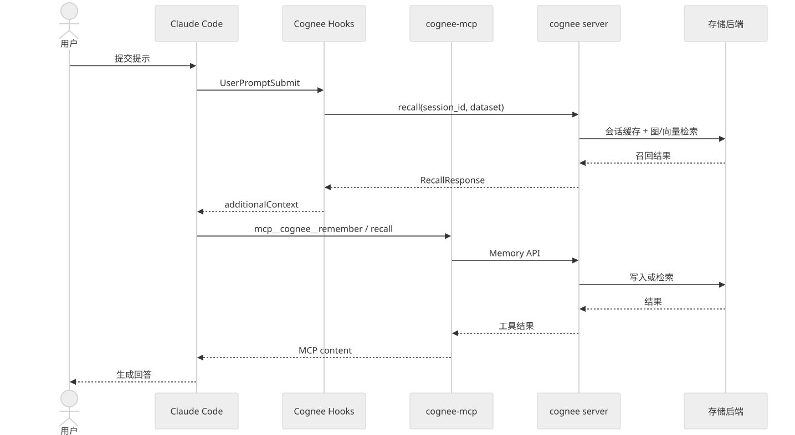

# 第 20 章 `Claude Code & Claude Agent SDK: 集成`

> 本章目标:读完本章,你将能够
> - 在 Claude Code 中安装 `cognee-memory` 插件,并理解其自动记忆链路
> - 根据部署边界选择 `managed_endpoint`、`integration_local` 或 `embedded` mode
> - 通过 Skill、独立 `cognee-mcp` 或 Claude Agent SDK 调用 `remember` 与 `recall`

## 前置知识

- 已读完 [[chapter-14-v2-memory-api|第 14 章 v2 内存 API:`remember` / `recall` / `improve` / `forget`]](../part-03-api/chapter-14-v2-memory-api.md),理解 `remember`、`recall`、`improve`、`forget`
- 已读完 [[chapter-18-agent-memory|第 18 章 Agent Memory:`cognee.agent_memory` 与子代理]](../part-03-api/chapter-18-agent-memory.md),理解会话缓存与永久知识图的边界
- 需要 Python 3.10–3.14、Claude Code,本地 mode 还需要 Cognee 使用的 `LLM_API_KEY`

## 本章导览

- 20.1–20.5:安装插件,配置 mode,理解 Hooks、Skills 与主动调用
- 20.6:把独立 `cognee-mcp` 接入 Claude Code
- 20.7:在 Claude Agent SDK 内创建进程内 MCP Server
- 20.8–20.9:对比三种集成方式并排查常见问题
- 20.10:`cognee-doctor` 诊断命令与典型输出

---

## 20.1 Claude Code 插件安装

为什么优先讲插件?因为它不只提供三个命令,还把记忆写入和回忆嵌入 Claude Code
生命周期:用户每次提交提示时自动召回,工具执行与回答完成后自动记录,会话结束时再同步到
永久知识图。插件清单位于
`<COGNEE_INTEGRATIONS_REPO>/integrations/claude-code/.claude-plugin/plugin.json`,
插件名为 `cognee-memory`。

可以在 Claude Code chat 内安装:

```text
/plugin marketplace add topoteretes/cognee-integrations
/plugin install cognee-memory@cognee
```

也可以在 shell 中安装:

```bash
claude plugin marketplace add topoteretes/cognee-integrations
claude plugin install cognee-memory@cognee
```

如果在 chat 内安装,应退出并重新启动 Claude Code。仅执行 `/reload-plugins` 可以载入 Skill,
却不会补跑本次会话已经错过的 `SessionStart`。重新启动后看到
`Cognee Memory Connected` 才表示生命周期集成已开始工作。

插件目录 `<COGNEE_INTEGRATIONS_REPO>/integrations/claude-code/` 中的重要入口如下:

- 清单:`.claude-plugin/plugin.json`
- Hook 配置:`hooks/hooks.json`
- 回忆 Agent:`agents/cognee-recall.md`
- 三个 Skill:`skills/cognee-remember/SKILL.md`、`skills/cognee-search/SKILL.md`、
  `skills/cognee-sync/SKILL.md`
- Hook 和命令实现:`scripts/`,包含 18 个 Python 文件
- 客户端封装:`scripts/_cognee_client.py`
- 共享核心:`scripts/_plugin_common.py`,当前大小约 95939 字节

后两者把 endpoint、认证、session、dataset 和容错逻辑集中起来。阅读插件行为时,不要只看
Skill 文本,还要结合这些共享实现。

---

## 20.2 配置与三种 mode

为什么要区分 mode?因为“Claude 如何调用 Cognee”和“Cognee 在哪里运行”是两个不同问题。
插件实际启动规则以 `SessionStart` 为准:设置 `COGNEE_BASE_URL` 时进入
`managed_endpoint`;未设置时进入 `integration_local`,插件在本机自启 API Server,默认使用
`http://localhost:8011`。`embedded` 则是不经过独立 HTTP 服务,直接在 Python 进程中调用
Cognee,主要用于 Claude Agent SDK 的进程内工具集成。

| mode | 数据路径 | 适用场景 | 主要代价 |
|---|---|---|---|
| `managed_endpoint` | Claude Code → 已有 endpoint | Cognee Cloud、团队共享服务 | 需要 URL,远端通常需要 API Key |
| `integration_local` | Claude Code → 插件自启本地 Server | 单机开发,插件默认选择 | 首次启动与本地模型/数据库初始化 |
| `embedded` | Agent 进程 → Cognee Python API | 自定义 Claude Agent SDK 应用 | Agent 与记忆引擎共享进程资源 |

本地插件的最小启动配置:

```bash
export LLM_API_KEY='<你的API_KEY>'
export COGNEE_PLUGIN_DATASET='my-project-memory'
export COGNEE_SESSION_ID='my-project-session'
claude
```

连接 Cognee Cloud 或现有服务:

```bash
export COGNEE_BASE_URL='https://<你的Cognee服务地址>'
export COGNEE_API_KEY='<你的COGNEE_API_KEY>'
export COGNEE_PLUGIN_DATASET='team-memory'
export COGNEE_PREFER_MEMORY='true'
claude
```

关键变量的含义是:

| 环境变量 | 作用 |
|---|---|
| `LLM_API_KEY` | 本地 Cognee 执行实体抽取等 LLM 操作所需的密钥 |
| `COGNEE_BASE_URL` | 指向现有 endpoint;设置后选择 `managed_endpoint` |
| `COGNEE_API_KEY` | 远端认证密钥;本地 mode 可自动签发并缓存 |
| `COGNEE_PREFER_MEMORY` | 默认 `true`,提示 Claude 优先使用 Cognee 记忆 |
| `COGNEE_SESSION_ID` | 固定或恢复一个命名会话;不设置则每次启动生成 |
| `COGNEE_PLUGIN_DATASET` | 当前启动周期的读写 Dataset,默认 `agent_sessions` |

Dataset 在一次启动期间固定。要切换 Dataset,应退出 Claude Code,修改环境变量后再启动。
`COGNEE_PREFER_MEMORY` 只是引导模型优先使用 Cognee,并不能可靠禁用 Claude Code 自带的
`MEMORY.md` 注入。

---

## 20.3 Hooks 详解

为什么自动化要放在 Hooks?如果依赖模型每轮“记得调用工具”,总会出现漏写、漏查或会话退出
前未同步。配置文件
`<COGNEE_INTEGRATIONS_REPO>/integrations/claude-code/hooks/hooks.json` 把六类事件
绑定到确定性脚本。

| Hook | 脚本 | 行为 | 同步 timeout |
|---|---|---|---|
| `SessionStart` | `session-start.py` | 选择 mode,建立身份,确认 Dataset 就绪并启动 watcher | 120s |
| `UserPromptSubmit` | `session-context-lookup.py` + `store-user-prompt.py` | 自动 recall 并注入上下文,异步写入用户提示 | 120s(上下文查找),写入异步不阻塞 |
| `PostToolUse` | `store-to-session.py` | 异步写入 Bash、Agent、Read、Write、Edit、Grep、Glob trace | 异步(无 timeout) |
| `Stop` | `store-to-session.py --stop` + `clear-transcript-context.py` | 异步写入 assistant answer,随后清理 transcript context | 写入异步,清理 5s |
| `PreCompact` | `pre-compact.py` | 上下文压缩前建立 memory anchor,降低关键信息丢失概率 | 120s |
| `SessionEnd` | `sync-session-to-graph.py --session-end` | 触发 detached final sync,把会话记忆同步到永久图 | 异步 |

> **更新(2026-07-26):**v1.0 起的 hooks.json 为同步类脚本配上 120s 充裕预算,确保
> `session-context-lookup.py` 启动本地服务或跨网络召回不会被截断;`store-to-session.py`
> 系列统一标 `async: true`,即使偶发写入阻塞也不会拖慢交互。`stop → clear-transcript-context.py`
> 显式给 5s,避免清场脚本自身卡死。原始基线版本默认 15s 上限,首次启动较慢的本地 DB
> migration 会触发超时,这是 1.0 之后被抬高的主要原因。

关键脚本分别位于
`<COGNEE_INTEGRATIONS_REPO>/integrations/claude-code/scripts/session-start.py`、
`<COGNEE_INTEGRATIONS_REPO>/integrations/claude-code/scripts/session-context-lookup.py`、
`<COGNEE_INTEGRATIONS_REPO>/integrations/claude-code/scripts/store-to-session.py` 与
`<COGNEE_INTEGRATIONS_REPO>/integrations/claude-code/scripts/sync-session-to-graph.py`。

下图展示一次典型提示从 Claude Code 经 MCP 或 HTTP 工具边界到 Cognee 的路径。插件模式的
Hooks 可直接访问 Cognee Server;独立 MCP 模式则先经过 `cognee-mcp`。



这里有一个重要的时序差异:`UserPromptSubmit` 的 recall 是同步上下文准备;提示、工具 trace 与
回答写入则尽量异步,避免阻塞交互。永久写入可能采用后台认知化,因此“请求已接受”不等于
“图已可检索”。需要立即查询时,应等待完成或执行同步。

### Hook 日志字段:`elapsed_ms`

> **更新(2026-07-26):**v1.0 起 `session-context-lookup.py` 与 `store-to-session.py` 在
> `~/.cognee-plugin/claude-code/hook.log` 中写入 `elapsed_ms` 字段,围绕 recall / bridge /
> improve 三类操作记录耗时(单位毫秒),便于诊断慢 Hook。典型一行:

```json
{"event": "context_lookup_hit", "scope": "graph", "hits": 4,
 "elapsed_ms": 312.7, "session_id": "agent_abc123"}
```

读取脚本行为时,过滤 `elapsed_ms > 1000` 的行即可定位显著慢操作;写入失败路径同样记录
`elapsed_ms`(见 `_plugin_common.py:1590` 的 `elapsed_ms(start)` helper)。

---

## 20.4 Skills 详解

为什么在自动 Hooks 之外还要保留 Skill?自动召回针对当前提示,自动写入针对会话轨迹;而用户
仍需要明确表达“永久记住这条项目规则”“只查永久图”或“现在就同步”。三个 Skill 正好覆盖
这些主动意图。

### 20.4.1 `cognee-remember`

定义见
`<COGNEE_INTEGRATIONS_REPO>/integrations/claude-code/skills/cognee-remember/SKILL.md`。
它把记忆分到三个 `node_set`:用户偏好进入 `user_context`,项目知识进入 `project_docs`,Agent
发现与轨迹进入 `agent_actions`。包装脚本优先 POST `/api/v1/remember`,连接失败时才回退到
`cognee-cli`。默认后台构图,短暂等待后会报告是否已可查询。

### 20.4.2 `cognee-search`

定义见
`<COGNEE_INTEGRATIONS_REPO>/integrations/claude-code/skills/cognee-search/SKILL.md`。
它默认同时查询 session cache 与永久图,也能以 `--session` 或 `--graph` 限定范围。结果中的
`_source` 可用于区分 `session` 和 `graph`。不要因为 CLI 空 stdout 就断言“没有结果”;运行中的
Server `/api/v1/recall` 才是事实来源。

### 20.4.3 `cognee-sync`

定义见
`<COGNEE_INTEGRATIONS_REPO>/integrations/claude-code/skills/cognee-sync/SKILL.md`。
它调用 session-aware `improve`:应用反馈权重,持久化 Q&A 与压缩后的 trace feedback,提炼经验,
丰富图关系并把知识快照同步回 session cache。`SessionEnd` 会自动执行,但需要跨会话立即可见时
可提前手动触发。

---

## 20.5 主动调用

为什么主动调用仍然重要?自动化解决“每轮都做”的基础工作,主动命令则表达更强的业务语义。
在 Claude Code chat 中可直接执行:

```text
/cognee-memory:cognee-remember 记住项目约定:所有公开 API 都必须写异步测试
/cognee-memory:cognee-search 查找上一轮会话确定的数据库迁移策略
/cognee-memory:cognee-sync
```

不带参数调用时,Claude Code 会根据 Skill 指令和当前对话补充参数。需要深度、跨会话回忆时,
还可以委托
`<COGNEE_INTEGRATIONS_REPO>/integrations/claude-code/agents/cognee-recall.md`
定义的 `cognee-recall` Agent。它被约束为优先做一次宽查询,避免扇出大量重复请求。

---

## 20.6 cognee-mcp 独立 server

为什么选择独立 MCP Server?当你希望多个 MCP Client 共用统一工具边界,或不想安装专属
Claude Code 插件时,独立进程更通用。项目位于 `<COGNEE_REPO>/cognee-mcp/`,入口是
`<COGNEE_REPO>/cognee-mcp/src/server.py`。

从源码启动三种 transport:

```bash
cd <COGNEE_REPO>/cognee-mcp
uv sync --dev --all-extras --reinstall
export LLM_API_KEY='<你的API_KEY>'

# stdio,默认
python src/server.py

# SSE
python src/server.py --transport sse

# Streamable HTTP
python src/server.py --transport http \
  --host 127.0.0.1 --port 8000 --path /mcp
```

核心 Memory API 暴露三个工具:

- `remember`:带 `session_id` 时写 session cache,不带时写永久知识图
- `recall`:自动路由检索;带 `session_id` 时先查会话,未命中再查永久图
- `forget`:按 Dataset 删除,或以 `everything=True` 删除当前用户拥有的全部记忆

以 HTTP transport 接入 Claude Code:

```bash
# 终端 A:启动 MCP Server
cd <COGNEE_REPO>/cognee-mcp
export LLM_API_KEY='<你的API_KEY>'
python src/server.py --transport http \
  --host 127.0.0.1 --port 8000 --path /mcp

# 终端 B:注册并检查
claude mcp add cognee-http -t http http://localhost:8000/mcp
claude mcp list
```

独立 Server 还可能为 Workspace UI 注册辅助工具,但本章讨论的稳定、最小 Agent 记忆契约是
`remember`、`recall`、`forget`。不要把旧版 `add_tool`、`search_tool` 名称复制到新配置。

---

## 20.7 Claude Agent SDK + MCP

为什么 SDK 集成仍采用 MCP?`create_sdk_mcp_server` 能把普通 Python 异步函数包装成 Claude
可调用工具,同时通过 `allowed_tools` 做最小权限控制。与外置 MCP 不同,这个 Server 与 Agent
运行在同一个 Python 应用中,不需要监听端口。

安装依赖并设置 Cognee 的 LLM Key:

```bash
python -m venv .venv
source .venv/bin/activate
pip install cognee-integration-claude claude-agent-sdk
export LLM_API_KEY='<你的API_KEY>'
```

下面是完整的最小示例:

```python
import asyncio

from claude_agent_sdk import (
    AssistantMessage,
    ClaudeAgentOptions,
    ClaudeSDKClient,
    TextBlock,
    create_sdk_mcp_server,
)
from cognee_integration_claude import cognee_tools


async def main():
    server = create_sdk_mcp_server(
        name="cognee-tools",
        version="1.0.0",
        tools=cognee_tools(),
    )
    options = ClaudeAgentOptions(
        mcp_servers={"tools": server},
        allowed_tools=[
            "mcp__tools__remember",
            "mcp__tools__recall",
        ],
    )

    async with ClaudeSDKClient(options=options) as client:
        await client.query(
            "请先记住:支付服务的重试上限是 3 次;然后回忆重试上限。"
        )
        async for message in client.receive_response():
            if isinstance(message, AssistantMessage):
                for block in message.content:
                    if isinstance(block, TextBlock):
                        print(block.text)


if __name__ == "__main__":
    asyncio.run(main())
```

工具实现位于
`<COGNEE_INTEGRATIONS_REPO>/integrations/claude-agent-sdk/cognee_integration_claude/tools.py`。
`cognee_tools()` 返回 `remember_tool` 与 `recall_tool`;前者用 `asyncio.Lock` 串行保护写入,后者
保留 Cognee 原生 `RecallResponse`,再由 `render_results` 提取文本。注册工具 ID 的格式不是由
`create_sdk_mcp_server` 的 `name` 参数决定,而由 `mcp_servers` 的映射键决定:
`mcp__<server>__remember`、`mcp__<server>__recall`。上例键名是 `tools`,所以 ID 是
`mcp__tools__remember` 与 `mcp__tools__recall`。

如果希望先写廉价 session cache,结束时再持久化,可以绑定 `session_id`:

```python
import asyncio

import cognee
from cognee_integration_claude import cognee_tools


async def promote_session():
    session_id = "contract-review-2026"
    tools = cognee_tools(
        session_id=session_id,
        remember_kwargs={"self_improvement": False},
    )
    # 将 tools 传给 create_sdk_mcp_server 并驱动 Agent 后,再执行提升。
    print([tool.name for tool in tools])
    await cognee.improve(session_ids=[session_id])


asyncio.run(promote_session())
```

官方完整示例见
`<COGNEE_INTEGRATIONS_REPO>/integrations/claude-agent-sdk/examples/example.py`。
生产代码不应照搬其中的 `await cognee.forget(everything=True)`,那只是演示前清场。



---

## 20.8 三种集成模式对比

这里的“三种”指三条面向 Claude 的集成路径,不要与 20.2 的运行 mode 混淆。

| 集成路径 | 自动 recall/trace/sync | 进程边界 | 工具范围 | 最适合 |
|---|---|---|---|---|
| Claude Code 插件 | 完整 Hooks 自动化 | 本地或远端 HTTP | 三个 Skill + recall Agent | 日常 Claude Code 编程 |
| 独立 `cognee-mcp` | 由模型/客户端调用工具 | 独立 MCP 进程 | 核心 `remember/recall/forget` | 多 Client、标准 MCP 部署 |
| Claude Agent SDK 内嵌 MCP | 由应用控制 | 与 Agent 同进程 | `remember/recall` | 自定义 Agent 产品与权限收敛 |

如果目标只是让 Claude Code 跨会话记住项目背景,选插件最简单。如果已有统一 MCP 基础设施或
需要 Claude Code 之外的 Client 复用,选独立 `cognee-mcp`。如果正在编写自己的 Agent 服务,
并希望把工具白名单、session 提升时机写进应用逻辑,选 Claude Agent SDK。

---

## 20.9 常见问题

### 安装后没有自动 recall

先确认已重新启动 Claude Code,而不是只执行 `/reload-plugins`。再检查
`~/.cognee-plugin/claude-code/hook.log` 中的 `SessionStart` 与 `mode_decision`。chat 内首次安装
可能异步拉取 marketplace,因此当前会话错过启动 Hook 是正常现象。

### 本地启动失败或一直等待

确认 `LLM_API_KEY` 已在启动 `claude` 的 shell 中导出,默认端口 8011 未被其他服务占用。若已有
服务,直接设置 `COGNEE_BASE_URL` 进入 `managed_endpoint`,避免重复拉起本地 Server。

### 明明记住了,为什么立即搜不到

永久 `remember` 默认可能后台认知化。已入队只说明请求被接受,图尚未具备最终可查询性。
可稍后重试,或执行 `/cognee-memory:cognee-sync`;小数据且确需同步行为时,可设置
`COGNEE_REMEMBER_BACKGROUND=false`。

### 上一会话的数据召回为空

检查新旧启动是否使用相同的 `COGNEE_PLUGIN_DATASET`;默认插件 Dataset 是
`agent_sessions`,而直接 Python SDK 可能写入另一个默认 Dataset。再确认上一会话完成了
`SessionEnd` final sync。不要依据空 CLI stdout 下结论,应直接检查 Server recall 响应。

### SDK 报工具不允许或找不到

检查 `allowed_tools` 是否使用 `mcp__<映射键>__<工具名>`。若
`mcp_servers={"tools": server}`,正确 ID 是 `mcp__tools__remember`,不是
`mcp__cognee-tools__remember`。还要确认没有在 `disallowed_tools` 中再次禁用它。

### `forget` 是否会删除全部数据

会,如果传入 `everything=True`。独立 MCP 的 `forget(dataset="...")` 可只删一个 Dataset。
生产环境应限制工具权限,让只读 Agent 仅获得 `recall`。

### Windows 上 statusline 显示乱码或崩溃

> **更新(2026-07-26):**v1.0 起 `scripts/cognee_statusline_render.py` 在 `main()` 入口对
> `sys.stdin` 与 `sys.stdout` 调用 `reconfigure(encoding="utf-8")`(行 216–220 的 for/try
> 块,reconfigure 调用本身在第 218 行),保证 Claude Code 传入的 UTF-8 JSON 状态在
> Windows 默认 GBK codepage 下也能正确解码。 早于 1.0 的版本在 `zh-CN` / emoji 场景下
> 可能 `UnicodeDecodeError` 或乱码。升级到 1.0 后若仍异常,检查 Python 启动环境是否被
> 第三方站点包拦截 `sys.stdin.reconfigure`。

---

## 20.10 `cognee-doctor` 诊断命令

> **新增(2026-07-26):**v1.0 新增 `scripts/cognee-doctor.sh` + `scripts/doctor.py`,
> 在不动配置、不写库的前提下,把配置 / 网络 / 熔断器 / 嵌入模型一次性扫一遍,输出人类
> 可读表格或 JSON。它不替代 §20.9 的逐项排查,而是第一道定位入口。

```bash
# 人类可读
bash ${CLAUDE_PLUGIN_ROOT}/scripts/cognee-doctor.sh

# 机器可读(JSON)
bash ${CLAUDE_PLUGIN_ROOT}/scripts/cognee-doctor.sh --json
```

典型人类输出(节选;实际键名与 `doctor.py` 的 `_DISPLAY_ORDER` 一致):

```text
Cognee Doctor

Mode:                 Local
Server URL:           -
API Key Source:       ENV
Reachable:            Yes
Latency:              12.3 ms
Cognee (local):       1.4.0
Cognee (server):      1.4.0-local
Embedding Model:      Default
Embedding Dims:       Default
Circuit Breaker:      Closed
```

> 字段含义:`Mode` 解析 `COGNEE_BASE_URL` 指向本地回环 / 远端 / 未设置;
> `Reachable` + `Latency` 取代了旧版单一 `Health` 字段(由 `urllib` 探针 `GET /health` 得到);
> `Cognee (local)` 从 `~/.cognee-plugin/venv` 的 `importlib.metadata` 取 cognee 版本,
> `Cognee (server)` 从 `/health` 响应里读 `version`;`Circuit Breaker` 映射为
> `Closed` 或 `Open (retry in ~Ns)`。

何时跑:

- `SessionStart` 后看不到 `Cognee Memory Connected`,先看 doctor 输出 mode / health
- `recall` 命中率掉到 0、怀疑 embedding 通道异常,核对 `Embedding Model` 与 `Embedding Dims`
- 怀疑 `cognee-mcp` 调用被熔断器拦截,核对 `Circuit Breaker` 字段
- 长期生产部署后回归测试,把 `--json` 输出接入健康检查 job

实现仅做只读探针(`never modifies configuration, initialises databases, registers resources,
writes files, or mutates state`),可以放心跑在 CI smoke 阶段。等价调用也可以通过
`python3 ${CLAUDE_PLUGIN_ROOT}/scripts/doctor.py [--json]` 直接发起。

---

## 小结

- Claude Code 插件用六类 Hooks 自动完成启动、召回、轨迹捕获、压缩锚定和最终同步。
- `managed_endpoint` 连接已有服务,`integration_local` 由插件自启本地服务,`embedded` 在 Agent
  进程内直接调用 Cognee。
- 三个 Skill 分别负责永久记忆、显式搜索与 session-to-graph 同步,用于补充自动 Hooks。
- 独立 `cognee-mcp` 提供标准 transport 与核心 `remember`、`recall`、`forget` 契约。
- Claude Agent SDK 通过进程内 MCP 暴露 `remember/recall`,工具 ID 由 MCP 映射键生成。

## 实践作业

1. **(基础)** 安装 `cognee-memory` 插件,设置独立的 `COGNEE_PLUGIN_DATASET`,用三个 Skill
   完成“记忆一条项目规则 → 搜索 → 同步”,并从 `_source` 判断结果来自 session 还是 graph。
2. **(进阶)** 启动 `<COGNEE_REPO>/cognee-mcp/src/server.py` 的 HTTP transport,
   用 `claude mcp add` 注册服务,验证 `remember`、`recall`、`forget(dataset=...)` 的完整闭环。
3. **(挑战)** 基于
   `<COGNEE_INTEGRATIONS_REPO>/integrations/claude-agent-sdk/examples/example.py`
   编写双 Agent:写 Agent 拥有 `remember/recall`,只读 Agent 只拥有 `recall`;使用命名
   `session_id`,并在人工确认后调用 `cognee.improve` 提升到永久图。

## 推荐阅读

- [[chapter-21-frameworks|第 21 章 Strands / LangGraph / CrewAI / Google ADK 集成(主流 4 框架)]](./chapter-21-frameworks.md)
- 插件说明:`<COGNEE_INTEGRATIONS_REPO>/integrations/claude-code/README.md`
- MCP Server:`<COGNEE_REPO>/cognee-mcp/README.md`
- SDK 工具实现:
  `<COGNEE_INTEGRATIONS_REPO>/integrations/claude-agent-sdk/cognee_integration_claude/tools.py`

## 下一章预告

第 21 章将介绍主流 Agent 框架集成(Strands、LangGraph、CrewAI、Google ADK),把 Cognee 记忆接入有状态图工作流与多节点 Agent 编排。
