# 第 21 章 `Frameworks: Strands / LangGraph / CrewAI / Google ADK`

> 本章目标:读完本章,你将能够
> - 将 Cognee 的写入与检索能力注册为四种主流 Agent 框架的 tool
> - 为会话选择持久知识图、短期缓存或 `NodeSet` 标签,并理解它们的边界
> - 用 LangGraph、Cognee 用户权限与历史 resolution 构建多租户 Copilot

## 前置知识

- 已读完 [[chapter-18-agent-memory|第 18 章 Agent Memory:`cognee.agent_memory` 与子代理]](../part-03-api/chapter-18-agent-memory.md)
- 核心基线:`cognee>=1.4.0`、`pydantic>=2.0`、`asyncio`
- 环境:Python 3.10–3.14,以及相应模型的 API Key
- 四个集成包的依赖范围并不相同。请在各自目录创建独立虚拟环境并执行 `uv sync`,
  以该目录的 `pyproject.toml` 和 `uv.lock` 为准,不要在同一环境中强制升级 Cognee

## 本章导览

- 21.1–21.4:逐一完成 Strands、LangGraph、CrewAI 与 Google ADK 的 tool 注册
- 21.5:拆解 Billing、Support、Entitlements 与 Supervisor 组成的 SaaS Copilot
- 21.6–21.7:比较执行模型、会话语义与适用场景,给出选型路径

---

四个框架的编排方式不同,但集成边界是一致的:框架负责决定何时调用工具,Cognee 负责把信息
摄取、认知化并检索。这样更换 Agent 框架时,长期记忆不必跟着迁移。



## 21.1 Strands Agent 集成

为什么 Strands 适合从 `remember` / `recall` 开始?Strands tool 是同步调用,而 Cognee 的内存 API
是异步调用。集成层在后台线程运行专用 event loop,把这项差异封装起来;业务代码只需把
`cognee_tools()` 的返回值交给 `Agent(tools=...)`。该函数返回两个已装饰的工具,分别映射到
`cognee.remember` 与 `cognee.recall`。

下面的程序使用 OpenAI `gpt-4o`,先让一个 Agent 记住合同,再用没有聊天历史的新 Agent 回忆:

```python
import os

from cognee_integration_strands import cognee_tools
from dotenv import load_dotenv
from strands import Agent
from strands.models.openai import OpenAIModel

load_dotenv()


def main():
    api_key = os.getenv("LLM_API_KEY")
    if not api_key:
        raise RuntimeError("请在 .env 中设置 LLM_API_KEY")

    model = OpenAIModel(
        client_args={"api_key": api_key},
        model_id="gpt-4o",
    )
    tools = cognee_tools()

    writer = Agent(model=model, tools=tools)
    writer("Use the remember tool: Orion Retail Group renewed for £2.0M in 2026.")

    reader = Agent(model=model, tools=tools)
    answer = reader("Use the recall tool: what is Orion's 2026 contract value?")
    print(answer)


if __name__ == "__main__":
    main()
```

真实注册逻辑位于
`<COGNEE_INTEGRATIONS_REPO>/integrations/strands/cognee_integration_strands/tools.py`,
完整的 `gpt-4o` 示例位于
`<COGNEE_INTEGRATIONS_REPO>/integrations/strands/examples/example.py`。需要短期会话时,改为
`cognee_tools(session_id="case-1001", remember_kwargs={"self_improvement": False})`;
随后用 `cognee.improve(session_ids=["case-1001"])` 将缓存提升到持久图。完整流程见
`<COGNEE_INTEGRATIONS_REPO>/integrations/strands/examples/session_example.py`。

> **破坏性变更:**Strands 集成 0.1.x 升级到 0.2.0/Cognee 1.0 后没有兼容层。旧的
> `add_tool`、`search_tool` 与 `get_sessionized_cognee_tools()` 应替换为 `cognee_tools()`。
> 同时,新版 `session_id` 表示会话缓存,不再等同于“按用户隔离数据”。

## 21.2 LangGraph 集成(含 SaaS 案例)

为什么复杂工作流更适合 LangGraph?记忆操作不仅能挂到单个 ReAct Agent,还可以成为
`StateGraph` 节点的一部分,由状态、边与 Supervisor 控制执行顺序。集成入口
`get_sessionized_cognee_tools(user_id)` 返回异步 `add_tool` 与 `search_tool`,因此必须调用
`await agent.ainvoke(...)`,不能改成同步 `invoke()`。

```python
import asyncio
import os

from cognee_integration_langgraph import get_sessionized_cognee_tools
from dotenv import load_dotenv
from langchain.agents import create_agent
from langchain_core.messages import HumanMessage

load_dotenv()


async def main():
    api_key = os.getenv("OPENAI_API_KEY")
    if not api_key:
        raise RuntimeError("请在 .env 中设置 OPENAI_API_KEY")
    os.environ.setdefault("LLM_API_KEY", api_key)

    add_tool, search_tool = get_sessionized_cognee_tools("tenant-acme-case-1001")
    tools = [add_tool, search_tool]

    writer = create_agent("openai:gpt-4o-mini", tools=tools)
    await writer.ainvoke(
        {"messages": [HumanMessage(content="Remember: invoice INV-94812 is paid.")]}
    )

    reader = create_agent("openai:gpt-4o-mini", tools=tools)
    response = await reader.ainvoke(
        {"messages": [HumanMessage(content="Search memory for INV-94812 status.")]}
    )
    print(response["messages"][-1].content)


if __name__ == "__main__":
    asyncio.run(main())
```

工具实现见
`<COGNEE_INTEGRATIONS_REPO>/integrations/langgraph/cognee_integration_langgraph/tools.py`,
最小合同示例见
`<COGNEE_INTEGRATIONS_REPO>/integrations/langgraph/examples/example.py`。当前实现会为
`add_tool` 绑定 `NodeSet`,为 `search_tool` 绑定 `session_id`;这能组织数据和保留问答上下文,
但不是授权机制。真正的多租户隔离必须把 Cognee `user` 传入该工厂,并启用后端访问控制。

还要把“Strands 0.1.x 到 Cognee 1.0 的破坏性变更”与 LangGraph 自身版本分开看。
LangGraph 集成当前清单仍约束较早的 Cognee 版本,而本书核心仓库基线为 1.4.0。生产项目应
先在独立环境运行该目录测试,再升级依赖;不要仅修改版本范围后假定兼容。

## 21.3 CrewAI 集成

为什么 CrewAI 的接入最直接?CrewAI 已围绕 role、goal、task 组织协作,通常只缺一个可共享的
外部知识后端。集成包已用 `@tool` 包装同步函数,并在内部后台 event loop 执行 Cognee 异步
任务,所以将 `add_tool`、`search_tool` 直接放进 `Agent.tools` 即可。

```python
import os

from cognee_integration_crewai import add_tool, search_tool
from crewai import Agent
from dotenv import load_dotenv

load_dotenv()


def build_agent():
    if not os.getenv("OPENAI_API_KEY") or not os.getenv("LLM_API_KEY"):
        raise RuntimeError("请设置 OPENAI_API_KEY 和 LLM_API_KEY")
    return Agent(
        role="Contract Analyst",
        goal="Store and retrieve contract facts",
        backstory="You verify answers against the Cognee knowledge base.",
        tools=[add_tool, search_tool],
        verbose=True,
    )


def main():
    writer = build_agent()
    writer.kickoff(
        "Use add_tool to remember: Meditech Solutions is a £1.2M healthcare contract."
    )

    reader = build_agent()
    result = reader.kickoff(
        "Use search_tool to find healthcare contracts and report their values."
    )
    print(result.raw)


if __name__ == "__main__":
    main()
```

包装器源码位于
`<COGNEE_INTEGRATIONS_REPO>/integrations/crewai/cognee_integration_crewai/tools.py`,
直接注册示例位于
`<COGNEE_INTEGRATIONS_REPO>/integrations/crewai/examples/tools_example.py`。会话化示例
`<COGNEE_INTEGRATIONS_REPO>/integrations/crewai/examples/sessionized_tools_example.py`
还提供 `get_sessionized_cognee_tools()`。但当前 CrewAI 包只在写入时注入 `NodeSet`,检索并未
按该标签过滤,因此不能把它当作租户隔离;需要安全边界时,应在集成层补充 Cognee 用户权限。

## 21.4 Google ADK 集成

为什么 Google ADK 使用 `LongRunningFunctionTool`?Cognee 的摄取与认知化可能超过一次普通函数
调用的时长。集成层把异步 `add_tool_impl`、`search_tool_impl` 包装成长任务工具,让 ADK Runner
负责等待事件。默认示例使用 `gemini-2.5-flash`,同时 Cognee 仍需要自己的 `LLM_API_KEY`。

```python
import asyncio
import os

from cognee_integration_google_adk import add_tool, search_tool
from dotenv import load_dotenv
from google.adk.agents import Agent
from google.adk.runners import InMemoryRunner

load_dotenv()


async def print_final(events):
    for event in events:
        if event.is_final_response() and event.content:
            for part in event.content.parts:
                if part.text:
                    print(part.text)


async def main():
    if not os.getenv("GOOGLE_API_KEY") or not os.getenv("LLM_API_KEY"):
        raise RuntimeError("请设置 GOOGLE_API_KEY 和 LLM_API_KEY")

    agent = Agent(
        model="gemini-2.5-flash",
        name="contract_analyst",
        description="Contract memory assistant",
        instruction="Always use Cognee tools to store or retrieve contract facts.",
        tools=[add_tool, search_tool],
    )
    runner = InMemoryRunner(agent=agent)

    await runner.run_debug(
        "Use add_tool to remember: QuantumSoft is a £5.5M technology contract."
    )
    events = await runner.run_debug(
        "Use search_tool to answer: what is the QuantumSoft contract value?"
    )
    await print_final(events)


if __name__ == "__main__":
    asyncio.run(main())
```

工具定义位于
`<COGNEE_INTEGRATIONS_REPO>/integrations/google-adk/cognee_integration_google_adk/tools.py`,
可运行示例位于
`<COGNEE_INTEGRATIONS_REPO>/integrations/google-adk/examples/tools_example.py`。
其 `get_sessionized_cognee_tools()` 会让写入和检索使用相同 `NodeSet`;这适合逻辑分区,但
`NodeSet` 仍不是身份认证或访问控制。完整会话示例见
`<COGNEE_INTEGRATIONS_REPO>/integrations/google-adk/examples/sessionized_tools_example.py`。

## 21.5 真实案例:SaaS 多租户 Copilot

我有一个“客户已付款却被降级”的 SaaS incident 问题,数据散落在账单、工单、订阅、权限和
审计事件中;我希望第二次同类故障不要从零调查。这个案例用 LangGraph 编排 Billing、Support、
Entitlements 三个专业 Agent,再由 Supervisor 汇总根因与建议。

工作流按 `Billing → Support → Entitlements → synthesize` 执行。Billing 在同一 session 内先查
invoice、再查 billing account;Entitlements 还执行一次 `TEMPORAL` 检索生成统一时间线。
Supervisor 将每次结果摄取到 `agent_resolutions` Dataset。处理 TICK-1002 时,先检索已保存的
TICK-1001 resolution,再结合本次三个 Agent 的发现生成结论,从而实现跨 incident 复用。

多租户部署必须启用真正的授权栈,而不只是传入 session 名称:

```bash
export ENABLE_BACKEND_ACCESS_CONTROL=True
export DB_PROVIDER=sqlite
export VECTOR_DB_PROVIDER=lancedb
export GRAPH_DATABASE_PROVIDER=kuzu
export GRAPH_DATASET_DATABASE_HANDLER=kuzu
```

Billing、Support、Entitlements 与 Supervisor 分别使用独立 Cognee User。各专业 Agent 只拥有
自己的 Dataset;Supervisor 获得所有 Dataset 的 `read` 权限,才能跨域综合。数据加载和授权代码
位于
`<COGNEE_INTEGRATIONS_REPO>/integrations/langgraph/examples/data/cognee_mock_saas_entitlements_demo/load_into_cognee.py`,
Supervisor 图位于
`<COGNEE_INTEGRATIONS_REPO>/integrations/langgraph/examples/saas_entitlements_agents.py`。
完整运行说明见
`<COGNEE_INTEGRATIONS_REPO>/integrations/langgraph/examples/README_SAAS_DEMO.md`。

跨 session 实验位于
`<COGNEE_INTEGRATIONS_REPO>/integrations/langgraph/examples/memory_reuse_experiment.py`。
它比较“每次使用新 session 的图检索基线”与“Redis 会话缓存 + 每 4 个 incident 执行 memify”:
示例输出中,10 次调查的基线总耗时为 380 秒,反馈条件为 293 秒,约快 23%。首轮反馈可能更慢,
因此这组数字应被视为该次运行结果,而非普适 SLA;真正价值在于后续运行复用缓存问答,并将
筛选后的知识长期写回图。

## 21.6 框架对比表

| 框架 | 注册入口 | 工具执行模型 | 会话机制 | 更适合 |
|---|---|---|---|---|
| Strands | `cognee_tools()` | 同步 tool,后台运行异步 Cognee | 真正的 Cognee session cache,可用 `improve` 持久化 | 简洁的 `remember` / `recall` Agent |
| LangGraph | `get_sessionized_cognee_tools(id)` | 原生 async,必须 `ainvoke` | `session_id` 上下文 + 可选 Cognee User | 有状态图、Supervisor、多 Agent 工作流 |
| CrewAI | `[add_tool, search_tool]` | 同步 tool,后台 event loop | 当前会话工厂主要标记写入 | role/task/crew 式业务协作 |
| Google ADK | `[add_tool, search_tool]` | async `LongRunningFunctionTool` | 写入与检索共享 `NodeSet` | Gemini 与 Google ADK 生态 |

四者的共同点是“工具注册”;差异则在执行模型和会话语义。尤其要记住:
`session_id`、`NodeSet` 与 Cognee User 权限解决的是三个不同问题,分别是上下文、图内分组和授权。

## 21.7 选型决策

选型可以依次回答四个问题:

1. 需要显式状态、条件边、Supervisor 或故障恢复吗?优先 LangGraph。
2. 只需要给同步 Agent 增加持久 `remember` / `recall` 吗?优先 Strands。
3. 团队模型已经围绕 role、goal、task 与 crew 设计吗?直接使用 CrewAI 工具。
4. 模型与运行时主要在 Gemini/Google ADK 中吗?使用长任务工具包装最自然。

如果系统有多租户安全要求,框架偏好应排在安全模型之后:先启用
`ENABLE_BACKEND_ACCESS_CONTROL=True`,为租户或服务角色创建 Cognee User,按 Dataset 授权,
再把 `user` 绑定到工具。不要使用可由客户端猜测的 session 字符串代替权限检查。最后还应在
目标集成自己的锁文件环境中运行 smoke test,验证模型 SDK、Cognee 与框架版本组合。

## 小结

- 四个框架都通过 tool 接口复用 Cognee,Agent 负责调度,Cognee 负责记忆与检索。
- Strands 面向 `remember` / `recall`;LangGraph、CrewAI 与 Google ADK 主要暴露写入/搜索工具。
- 同步框架由集成层桥接异步 Cognee,LangGraph 与 Google ADK 则直接采用异步执行模型。
- `session_id`、`NodeSet` 不是多租户授权;安全隔离必须使用 Cognee User 与 Dataset 权限。
- LangGraph SaaS 案例通过 `agent_resolutions` 和 memify 复用历史处置经验。

## 实践作业

1. **(基础)** 从四个示例中任选一个,在独立虚拟环境设置 API Key,让新 Agent 回忆旧 Agent
   写入的一条事实,并记录实际 tool 调用。
2. **(进阶)** 修改 LangGraph 示例,为两个 `session_id` 分别写入事实;解释检索上下文、
   `NodeSet` 分组和 Cognee User 授权的差别,不要只比较返回文本。
3. **(挑战)** 运行 SaaS Copilot 的 TICK-1001/TICK-1002 流程,增加第四个 Security Agent,
   给它独立 Dataset 与 User,再通过权限显式授予 Supervisor 只读访问;比较新增节点前后的耗时。

## 推荐阅读

- [[chapter-22-chat-tools|第 22 章 聊天工具集成:Telegram / Slack / Web Widget(主流 3)]](./chapter-22-chat-tools.md)
- Strands 集成:`<COGNEE_INTEGRATIONS_REPO>/integrations/strands/README.md`
- LangGraph 集成:`<COGNEE_INTEGRATIONS_REPO>/integrations/langgraph/README.md`
- CrewAI 集成:`<COGNEE_INTEGRATIONS_REPO>/integrations/crewai/README.md`
- Google ADK 集成:`<COGNEE_INTEGRATIONS_REPO>/integrations/google-adk/README.md`

## 下一章预告

第 22 章将把同一套 Cognee 记忆能力接入 Telegram、Slack 与 Web Widget,把框架内 Agent
扩展为面向真实用户的聊天入口。
