# 第 22 章 `Chat Tools: Telegram / Slack / Web Widget`

> 本章目标:读完本章,你将能够
> - 启动 Telegram、Slack 与 Web Widget 三种 Cognee 聊天入口
> - 用 Dataset 隔离群聊/频道记忆,并用 `brain:<user>` 建立跨场景个人记忆
> - 为召回结果保留 Telegram deeplink、Slack permalink 或 Web 引用
> - 根据隐私、网络入口和交互方式选择合适的 Chat Tool

## 前置知识

- 已读完 [[chapter-19-cli-manual|第 19 章 `cognee-cli` 完整子命令手册]](./chapter-19-cli-manual.md),能够启动 Cognee Server 并管理 Dataset
- 已读完 [[chapter-20-claude-code|第 20 章 Claude Code / Claude Agent SDK 集成(主流)]](./chapter-20-claude-code.md),理解远端 HTTP 与进程内集成的边界
- 环境:Python 3.10–3.14;Cognee Server 的 LLM Key 配置在服务端,聊天工具只需服务地址和 API Key

## 本章导览

- **22.1–22.3**:分别接入 Telegram、Slack 和嵌入式 Web Widget
- **22.4**:用 Chat-Memory 共享适配器统一记忆、召回、引用与遗忘
- **22.5**:组合 per-channel 与 per-user 两种 Scope,实现双层记忆
- **22.6**:按部署条件、隐私边界和交互入口做选型

---

下面的共同原则是:聊天平台只负责接收事件和展示回答,Cognee Server 负责
`remember` / `recall` / `forget` 或等价的 `add` / `cognify` / `search` 流程。
Dataset(数据集)是持久图谱、检索和整组遗忘的边界,不能只把 `chat_id` 当作显示字段。



三个包都能从模块入口启动,但传输方式和外部凭据不同:

| 工具 | 包名 | 传输方式 | 启动命令 | 默认边界 |
|---|---|---|---|---|
| Telegram | `cognee-integration-telegram` | 长轮询 | `python -m cognee_integration_telegram` | DM、群、论坛话题 |
| Slack | `cognee-integration-slack` | Socket Mode | `python -m cognee_integration_slack` | `slack_<channel_id>` |
| Web Widget | `cognee-integration-web-widget` | FastAPI + CORS | `python -m cognee_integration_web_widget.server` | 浏览器会话 + 共享文档 |

## 22.1 Telegram Bot

为什么 Telegram 适合快速验证?长轮询不要求公网 webhook,笔记本电脑也能运行。入口
`<COGNEE_INTEGRATIONS_REPO>/integrations/telegram/cognee_integration_telegram/__main__.py`
通过 `run_polling()` 接收消息;Scope 规则位于
`<COGNEE_INTEGRATIONS_REPO>/integrations/telegram/cognee_integration_telegram/scoping.py`。
私聊映射为 `telegram_dm_<user_id>`,群聊映射为 `telegram_group_<chat_id>`,论坛话题再追加
`thread_id`。负数群 ID 会被安全编码,避免 Dataset 名冲突。

```bash
cd <COGNEE_INTEGRATIONS_REPO>/integrations/telegram
uv sync
export TELEGRAM_BOT_TOKEN='<你的TELEGRAM_BOT_TOKEN>'
export COGNEE_BASE_URL='http://localhost:8000'
export COGNEE_API_KEY='<你的COGNEE_API_KEY>'
uv run python -m cognee_integration_telegram
```

当前源码的用户命令是 `/ask <question>`、`/forget`、`/optout` 与 `/optin`,普通文本和媒体
caption 会被动记忆。也就是说,概念上的 `/remember` 由“直接发消息”完成,概念上的
`/recall` 由 `/ask` 完成,并没有名为 `/remember`、`/recall` 的 Telegram 命令。处理器见
`<COGNEE_INTEGRATIONS_REPO>/integrations/telegram/cognee_integration_telegram/bot.py`。

引用链路在
`<COGNEE_INTEGRATIONS_REPO>/integrations/telegram/cognee_integration_telegram/citations.py`:
每个 Dataset 最多保留最近 1000 条 `MessageRef`;召回答案的 `Evidence` 与消息做词项匹配。
Supergroup 可生成 `https://t.me/c/...` deeplink,DM 和基础群没有公开链接时降级为引用原文。
若要摄取群内普通消息,还需关闭 BotFather group privacy mode 或将机器人设为管理员。

## 22.2 Slack Bot(双层记忆)

为什么 Slack 不对每条消息立即 `cognify`?频道流量高,逐条构图会放大成本并阻塞回复。
`<COGNEE_INTEGRATIONS_REPO>/integrations/slack/cognee_integration_slack/ingestion_buffer.py`
默认累计 10 条消息再构图;收到 `@cognee` 或 `/recall` 时先强制 flush,保证问题能看到尚未成批的消息。

```bash
cd <COGNEE_INTEGRATIONS_REPO>/integrations/slack
uv sync
export SLACK_BOT_TOKEN='<你的SLACK_BOT_TOKEN>'
export SLACK_APP_TOKEN='<你的SLACK_APP_TOKEN>'
export COGNEE_SLACK_OPTED_IN_CHANNELS='C01234567,C07654321'
export COGNEE_BASE_URL='http://localhost:8000'
export COGNEE_API_KEY='<你的COGNEE_API_KEY>'
uv run python -m cognee_integration_slack
```

Slack App 需启用 Socket Mode,订阅 `message.channels`、`app_mention`,并注册 `/recall`、
`/cognee-optin`、`/cognee-optout`、`/cognee-forget`。事件装配在
`<COGNEE_INTEGRATIONS_REPO>/integrations/slack/cognee_integration_slack/slack_app.py`。
消息先写入 `slack_<channel_id>`,再以 `GRAPH_COMPLETION` 生成回答、以 `CHUNKS` 找引用。
`cognee_memory.py` 把 channel、作者、时间戳和 permalink 编入 provenance header,召回后还原为
Slack Block Kit 链接;permalink 缺失时只显示文字,不制造坏链接。

需要区分“当前实现”和“双层目标”:当前 Slack 包的
`<COGNEE_INTEGRATIONS_REPO>/integrations/slack/cognee_integration_slack/memory_adapter.py`
只实现 per-channel `slack_<id>`,其 README 也明确把 per-user forget 列为后续工作。
要获得双层记忆,应在频道层之外再接 22.4 的 `per_user_scope`,写入 `brain:<user>`。频道层回答
“我们决定了什么”,个人层回答“我在不同频道和工具中记过什么”;不要把个人偏好写进公共频道图。

## 22.3 Web Widget

为什么网站需要代理层?浏览器不能持有 Cognee API Key,还需要跨域控制。入口
`<COGNEE_INTEGRATIONS_REPO>/integrations/web-widget/cognee_integration_web_widget/server.py`
提供 CORS-enabled FastAPI 代理:`POST /api/chat`、`POST /api/forget`、`GET /widget.js` 和
`GET /`。默认监听 `http://127.0.0.1:8000`。

```bash
cd <COGNEE_INTEGRATIONS_REPO>/integrations/web-widget
uv sync
export COGNEE_BASE_URL='http://127.0.0.1:8011'
export COGNEE_API_KEY='<你的COGNEE_API_KEY>'
export WIDGET_ALLOWED_ORIGINS='https://www.example.com'
uv run python -m cognee_integration_web_widget.server
# 浏览器打开 http://127.0.0.1:8000
```

上例把 Widget 放在 8000、Cognee Server 放在 8011,避免端口冲突。页面只需加入:

```html
<script src="http://127.0.0.1:8000/widget.js"
        data-site-id="acme"
        data-api="http://127.0.0.1:8000"></script>
```

`widget.js` 用 `localStorage` 保存 visitor、conversation 和 opt-in 状态。Adapter 生成
`web:{site_id}:{visitor_id}:{conversation_id}` session,并可同时读取共享只读 Dataset
`web:{site_id}:docs`。实现见
`<COGNEE_INTEGRATIONS_REPO>/integrations/web-widget/cognee_integration_web_widget/adapter.py`。
用户取消 “Remember this chat” 时不传 `session_id`,请求变为无状态;“Forget me” 调用 Dataset 级
forget。由于 HTTP API 尚不能独立删除 session cache,这里是 best-effort,生产隐私承诺不能把它描述为
可验证的会话级彻底擦除。

## 22.4 Chat-Memory 共享适配器

为什么还需要共享包?如果每个平台各自实现 consent、Scope、provenance 和 forget,规则很快漂移。
核心文件
`<COGNEE_INTEGRATIONS_REPO>/integrations/chat-memory/cognee_integration_chat_memory/adapter.py`
把平台事件归一化为 `Conversation`、`Message` 和 `Scope`,后端只需满足 `remember`、`recall`、
`forget_scope`、`forget_user` 四方法契约。当前三个独立工具仍保留各自 Adapter;共享包是统一这些
实现并扩展双层记忆的标准核心,不能误认为三者源码已经直接 import 同一个 `adapter.py`。

下面示例来自同目录思想,但可原样运行且不需要任何 Key:

```python
import asyncio

from cognee_integration_chat_memory import (
    ChatMemoryAdapter,
    Conversation,
    InMemoryMemoryBackend,
    Message,
    per_channel_scope,
)


async def main():
    memory = ChatMemoryAdapter(
        scope=per_channel_scope,
        backend=InMemoryMemoryBackend(),
    )
    conversation = Conversation(
        platform="slack", workspace="T1", channel="C1", user="U1"
    )
    memory.set_consent("U1", True)
    await memory.ingest(
        conversation,
        Message(
            text="发布 窗口 是 周五 20:00。",
            user="U1",
            timestamp="1",
            permalink="https://example.slack.com/archives/C1/p1",
        ),
    )
    answer = await memory.answer(conversation, "发布 窗口")
    print(answer.text)
    print([citation.permalink for citation in answer.citations])


asyncio.run(main())
```

完整零 Key 示例位于
`<COGNEE_INTEGRATIONS_REPO>/integrations/chat-memory/examples/console_bot.py`。
当前基线文件为 102 行,运行命令是 `python examples/console_bot.py`;设置 `COGNEE_BASE_URL` 后,
同一示例会切换到真实 HTTP 后端。

## 22.5 双层记忆架构

为什么不能只选一个 Dataset?团队事实需要共享,个人偏好却不应广播。双层记忆对每条获得授权的
消息分别评估两个落点:

| 层 | Scope 策略 | Dataset 示例 | 适合内容 | 召回范围 |
|---|---|---|---|---|
| 频道层 | `per_channel_scope` | `slack_C123` 或 `chat:slack:t1:c123` | 决策、纪要、负责人 | 当前频道成员共享 |
| 个人层 | `per_user_scope` | `brain:u456` | 偏好、私人笔记、跨工具待办 | 同一用户跨频道/平台 |

Scope 实现位于
`<COGNEE_INTEGRATIONS_REPO>/integrations/chat-memory/cognee_integration_chat_memory/scoping.py`。
`per_channel_scope` 让 Dataset 随频道变化,session 可再缩小到 thread;
`per_user_scope` 固定 `brain:<user>`,session 仍保留 platform/workspace/channel/thread。
因此“长期归属”和“最近对话”是两个正交键。

落地时采用显式路由:公共发言写频道层;只有用户主动标记为个人记忆或在 DM 中确认后,才写个人层。
回答频道问题时先查频道层;回答“我的偏好/待办”时查个人层;确需合并时,在应用层合并并标注来源。
HTTP 后端只能整 Dataset 遗忘,所以 per-user forget 应配合 per-user Dataset;若要从共享频道 Dataset
精确删除某位用户的数据,需使用 SDK 后端,且仍要评估共享图节点的引用关系。

## 22.6 选型决策

| 条件 | 首选 | 原因 | 注意点 |
|---|---|---|---|
| 无公网入口、群聊为主 | Telegram | 长轮询最省部署 | 群隐私模式、deeplink 能力有差异 |
| 团队频道、线程和审计链接 | Slack | Socket Mode、Block Kit、permalink | 先 opt-in;批量 cognify |
| 产品官网或 SaaS 内嵌 | Web Widget | 一个 script 标签,UI 可控 | API Key 留在后端,生产环境限制 CORS |
| 多平台共享规则 | Chat-Memory | 统一 Scope、consent、引用、遗忘 | 生产 consent store 应换成 Redis/SQL |
| 强个人跨平台记忆 | `per_user_scope` | `brain:<user>` 跨工具稳定 | 身份必须先做可信映射 |

不要只按 UI 选型。先确定 Dataset 的共享和删除边界,再选 transport;否则上线后再改变 Scope 会产生
旧 Dataset 迁移、重复记忆和隐私语义不一致。

## 小结

- Telegram 用长轮询把 DM、群聊和论坛话题映射为独立 Dataset,引用可回到 `t.me`。
- Slack 当前实现以频道为 Dataset,批量 `cognify`,并用 permalink 输出可审计来源。
- Web Widget 用 FastAPI CORS 代理保护服务端凭据,同时分离个人 session 与共享文档 Dataset。
- `per_channel_scope` 与 `per_user_scope` 组合后,才能同时获得团队共享记忆和跨场景个人记忆。
- Dataset 是检索与遗忘边界;consent、身份映射和删除能力必须在上线前验证。

## 实践作业

1. **(基础)** 任选 Telegram、Slack 或 Web Widget,按本章命令启动,写入三条消息并完成一次带引用召回。
2. **(进阶)** 运行 `examples/console_bot.py`,分别改用 `per_channel_scope` 与 `per_user_scope`,比较生成的 Dataset 和跨会话召回结果。
3. **(挑战)** 为 Slack 增加显式“记到个人脑”命令:公共消息仍写 `slack_<channel_id>`,个人消息写 `brain:<user>`,并补充 consent、整 Dataset 遗忘与引用回链测试。

## 推荐阅读

- [[chapter-23-nocode-ide|第 23 章 无代码与 IDE/终端集成(长尾 11 集成)]](./chapter-23-nocode-ide.md),继续接入 n8n、Dify、VS Code 等长尾入口
- Chat-Memory 核心:`<COGNEE_INTEGRATIONS_REPO>/integrations/chat-memory/`
- Telegram 集成:`<COGNEE_INTEGRATIONS_REPO>/integrations/telegram/`
- Slack 集成:`<COGNEE_INTEGRATIONS_REPO>/integrations/slack/`
- Web Widget 集成:`<COGNEE_INTEGRATIONS_REPO>/integrations/web-widget/`

## 下一章预告

第 23 章将把同一套 Cognee 记忆能力扩展到无代码平台、IDE 与终端工具,并给出长尾集成的统一选型方法。
